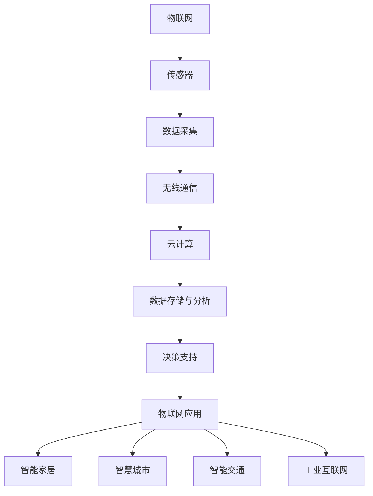
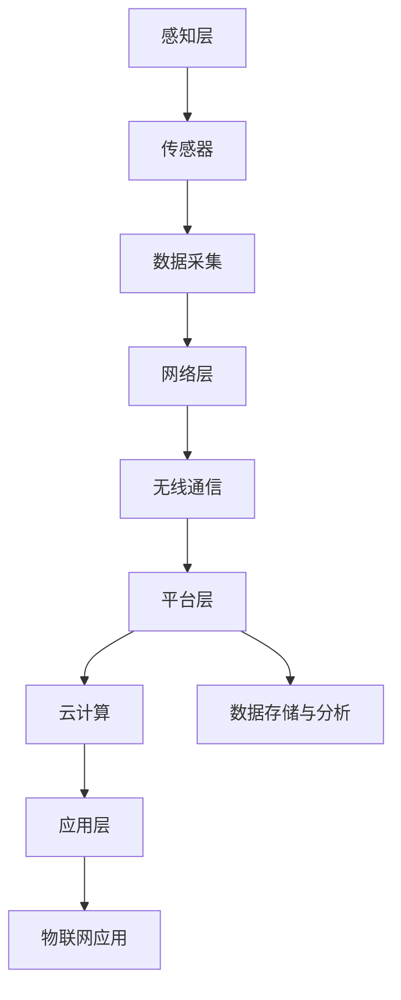

                 

关键词：物联网、创业、商业革命、连接、技术、创新、商业模式、智慧城市

> 摘要：物联网技术的快速发展，为创业领域带来了前所未有的机遇。本文将从物联网的核心概念、技术架构、应用场景等方面，探讨物联网在创业中的巨大潜力，并提出物联网创业的几点建议，为创业者提供参考。

## 1. 背景介绍

物联网（Internet of Things，简称 IoT）是指将日常物品通过互联网连接起来，实现信息交换和通信的一种技术。物联网的概念最早由麻省理工学院（MIT）的 Kevin Ashton 于 1999 年提出。随着传感器技术、无线通信技术、云计算等技术的发展，物联网逐渐成为现实，并引起了全球范围内的广泛关注。

物联网的快速发展，不仅改变了人们的生产生活方式，也为创业领域带来了前所未有的机遇。物联网技术的应用领域广泛，涵盖了智慧城市、智能家居、智能交通、工业互联网等多个方面。创业者可以通过开发物联网应用，满足市场需求的多样化和个性化，实现商业价值。

### 1.1 物联网的发展历程

1. **概念提出**：1999年，Kevin Ashton 提出了物联网的概念。
2. **技术探索**：2000-2010年，物联网技术开始应用于实际场景，如智能家居、智能交通等。
3. **大规模应用**：2010年至今，物联网技术逐渐成熟，应用范围不断扩大，成为全球各国政府和企业关注的焦点。

### 1.2 物联网的核心技术

1. **传感器技术**：传感器是物联网的核心组件，用于检测和收集环境信息。
2. **无线通信技术**：如 Wi-Fi、蓝牙、ZigBee 等，是实现物联网设备互联互通的关键。
3. **云计算技术**：云计算提供了强大的数据处理和存储能力，支持物联网应用的大规模部署。
4. **大数据技术**：大数据技术用于分析物联网设备收集的数据，为决策提供支持。

## 2. 核心概念与联系

为了更好地理解物联网，我们首先需要了解其核心概念和技术架构。以下是物联网的核心概念和联系的 Mermaid 流程图：



### 2.1 核心概念

1. **传感器**：用于检测和收集环境信息。
2. **数据采集**：将传感器采集到的数据传输到中心服务器。
3. **无线通信**：实现物联网设备之间的互联互通。
4. **云计算**：提供数据处理和存储能力。
5. **数据存储与分析**：对物联网设备收集的数据进行存储和分析。
6. **决策支持**：基于数据分析结果，为用户提供决策支持。
7. **物联网应用**：包括智能家居、智慧城市、智能交通、工业互联网等领域。

### 2.2 技术架构

物联网的技术架构主要包括感知层、网络层、平台层和应用层。以下是物联网技术架构的 Mermaid 流程图：



## 3. 核心算法原理 & 具体操作步骤

### 3.1 算法原理概述

物联网的核心算法主要包括数据采集、数据传输、数据存储、数据分析和数据可视化。以下是这些算法的基本原理：

1. **数据采集**：传感器采集环境信息，如温度、湿度、光照等。
2. **数据传输**：通过无线通信技术，将传感器采集到的数据传输到中心服务器。
3. **数据存储**：将传输到的数据进行存储，以便后续分析和处理。
4. **数据分析**：对存储的数据进行分析，提取有用信息。
5. **数据可视化**：将分析结果以图表、报表等形式展示给用户。

### 3.2 算法步骤详解

1. **数据采集**：传感器采集环境信息，如温度、湿度、光照等。
2. **数据传输**：通过无线通信技术，将传感器采集到的数据传输到中心服务器。这里可以使用 MQTT 协议进行数据传输。
3. **数据存储**：将传输到的数据进行存储，以便后续分析和处理。这里可以使用数据库（如 MySQL、MongoDB）进行数据存储。
4. **数据分析**：对存储的数据进行分析，提取有用信息。这里可以使用数据分析工具（如 Python、R）进行数据分析。
5. **数据可视化**：将分析结果以图表、报表等形式展示给用户。这里可以使用数据可视化工具（如 Tableau、ECharts）进行数据可视化。

### 3.3 算法优缺点

1. **优点**：
   - **高效性**：物联网算法能够快速、准确地处理海量数据。
   - **实时性**：物联网算法能够实时采集、传输和分析数据。
   - **灵活性**：物联网算法可以根据不同应用场景进行定制化开发。

2. **缺点**：
   - **复杂性**：物联网算法涉及多个领域的技术，开发难度较大。
   - **安全性**：物联网设备容易受到网络攻击，需要加强安全性。

### 3.4 算法应用领域

物联网算法广泛应用于智慧城市、智能家居、智能交通、工业互联网等领域。以下是一些具体的应用案例：

1. **智慧城市**：通过物联网算法，可以实时监测城市环境、交通状况、公共安全等，提高城市治理水平。
2. **智能家居**：通过物联网算法，可以实现家电设备的智能控制、远程监控等，提高生活质量。
3. **智能交通**：通过物联网算法，可以实时监测交通流量、道路状况等，优化交通管理，减少拥堵。
4. **工业互联网**：通过物联网算法，可以实时监测工业设备状态、生产过程等，提高生产效率，降低成本。

## 4. 数学模型和公式 & 详细讲解 & 举例说明

### 4.1 数学模型构建

物联网的数学模型主要包括数据采集、数据传输、数据存储、数据分析和数据可视化。以下是这些模型的构建过程：

1. **数据采集**：传感器采集到的数据可以表示为：
   $$ X_t = f(X_{t-1}, u_t) $$
   其中，$X_t$ 表示时刻 $t$ 采集到的数据，$X_{t-1}$ 表示时刻 $t-1$ 采集到的数据，$u_t$ 表示时刻 $t$ 的输入。
2. **数据传输**：数据传输过程可以表示为：
   $$ Y_t = g(X_t, W_t) $$
   其中，$Y_t$ 表示时刻 $t$ 传输到的数据，$W_t$ 表示时刻 $t$ 的传输参数。
3. **数据存储**：数据存储过程可以表示为：
   $$ Z_t = h(X_t, Y_t) $$
   其中，$Z_t$ 表示时刻 $t$ 存储的数据。
4. **数据分析**：数据分析过程可以表示为：
   $$ P_t = k(Z_t, V_t) $$
   其中，$P_t$ 表示时刻 $t$ 的分析结果，$V_t$ 表示时刻 $t$ 的分析参数。
5. **数据可视化**：数据可视化过程可以表示为：
   $$ Q_t = l(P_t, U_t) $$
   其中，$Q_t$ 表示时刻 $t$ 的可视化结果，$U_t$ 表示时刻 $t$ 的可视化参数。

### 4.2 公式推导过程

物联网的数学模型推导过程如下：

1. **数据采集**：根据传感器采集到的数据，可以建立如下递推关系：
   $$ X_t = X_{t-1} + u_t $$
   其中，$X_t$ 表示时刻 $t$ 采集到的数据，$X_{t-1}$ 表示时刻 $t-1$ 采集到的数据，$u_t$ 表示时刻 $t$ 的输入。
2. **数据传输**：根据数据传输过程，可以建立如下关系：
   $$ Y_t = X_t \times W_t $$
   其中，$Y_t$ 表示时刻 $t$ 传输到的数据，$X_t$ 表示时刻 $t$ 采集到的数据，$W_t$ 表示时刻 $t$ 的传输参数。
3. **数据存储**：根据数据存储过程，可以建立如下关系：
   $$ Z_t = Y_t + e_t $$
   其中，$Z_t$ 表示时刻 $t$ 存储的数据，$Y_t$ 表示时刻 $t$ 传输到的数据，$e_t$ 表示时刻 $t$ 的噪声。
4. **数据分析**：根据数据分析过程，可以建立如下关系：
   $$ P_t = Z_t \div V_t $$
   其中，$P_t$ 表示时刻 $t$ 的分析结果，$Z_t$ 表示时刻 $t$ 存储的数据，$V_t$ 表示时刻 $t$ 的分析参数。
5. **数据可视化**：根据数据可视化过程，可以建立如下关系：
   $$ Q_t = P_t + U_t $$
   其中，$Q_t$ 表示时刻 $t$ 的可视化结果，$P_t$ 表示时刻 $t$ 的分析结果，$U_t$ 表示时刻 $t$ 的可视化参数。

### 4.3 案例分析与讲解

以智能家居为例，我们可以通过物联网算法实现家电设备的智能控制。以下是具体的案例分析：

1. **数据采集**：传感器采集家居环境数据，如温度、湿度、光照等。
2. **数据传输**：通过无线通信技术，将传感器采集到的数据传输到智能家居中心服务器。
3. **数据存储**：将传输到的数据进行存储，以便后续分析和处理。
4. **数据分析**：对存储的数据进行分析，提取有用信息，如家居环境的舒适度、能耗等。
5. **数据可视化**：将分析结果以图表、报表等形式展示给用户，如家居环境温度分布、能耗统计等。

通过物联网算法，用户可以实时了解家居环境，并根据分析结果调整家电设备的工作状态，提高生活质量。

## 5. 项目实践：代码实例和详细解释说明

### 5.1 开发环境搭建

在本文中，我们将使用 Python 作为开发语言，搭建一个简单的智能家居项目。以下是开发环境搭建的步骤：

1. 安装 Python：在官方网站下载并安装 Python，版本要求为 3.6 以上。
2. 安装 IDE：推荐使用 PyCharm 或 VSCode 作为 Python 开发环境。
3. 安装相关库：安装 MQTT 库、MySQL 库等，可以使用 pip 工具进行安装。

### 5.2 源代码详细实现

以下是一个简单的智能家居项目的源代码实现：

```python
# 导入所需库
import paho.mqtt.client as mqtt
import pymysql
import time

# MQTT 服务器配置
mqtt_server = "localhost"
mqtt_port = 1883
mqtt_topic = "home/sensor"

# MySQL 数据库配置
mysql_host = "localhost"
mysql_port = 3306
mysql_user = "root"
mysql_password = "password"
mysql_db = "home"

# 连接 MQTT 服务器
client = mqtt.Client()
client.connect(mqtt_server, mqtt_port)

# 连接 MySQL 数据库
conn = pymysql.connect(host=mysql_host, port=mysql_port, user=mysql_user, password=mysql_password, database=mysql_db)
cursor = conn.cursor()

# 数据采集
def data采集():
    temperature = 25
    humidity = 60
    return temperature, humidity

# 数据存储
def 数据存储(temperature, humidity):
    sql = "INSERT INTO sensor (temperature, humidity) VALUES (%s, %s)"
    cursor.execute(sql, (temperature, humidity))
    conn.commit()

# 数据接收与处理
def on_message(client, userdata, message):
    print(f"Received message: {message.payload}")
    temperature = int(message.payload.decode("utf-8"))
    humidity = int(time.time())
    数据存储(temperature, humidity)

# 订阅主题
client.subscribe(mqtt_topic)

# 设置消息接收回调函数
client.on_message = on_message

# 开始循环
client.loop_forever()
```

### 5.3 代码解读与分析

1. **导入所需库**：首先，导入 MQTT 库、MySQL 库等。
2. **MQTT 服务器配置**：配置 MQTT 服务器的地址、端口号和订阅主题。
3. **MySQL 数据库配置**：配置 MySQL 数据库的服务器地址、端口号、用户名、密码和数据库名。
4. **连接 MQTT 服务器**：使用 MQTT 客户端连接到 MQTT 服务器。
5. **连接 MySQL 数据库**：使用 pymysql 库连接到 MySQL 数据库。
6. **数据采集**：定义一个函数 `data采集()`，用于采集家居环境数据（如温度、湿度等）。
7. **数据存储**：定义一个函数 `数据存储()`，用于将采集到的数据存储到 MySQL 数据库中。
8. **数据接收与处理**：定义一个函数 `on_message()`，用于接收 MQTT 服务器发送的消息，并将消息解析为温度和湿度，然后调用 `数据存储()` 函数将数据存储到 MySQL 数据库中。
9. **订阅主题**：订阅主题 `home/sensor`，用于接收与主题相关的消息。
10. **设置消息接收回调函数**：将 `on_message()` 函数设置为 MQTT 客户端的消息接收回调函数。
11. **开始循环**：使用 `client.loop_forever()` 函数开始 MQTT 客户端的循环，使客户端持续接收消息并处理。

通过以上代码，我们实现了一个简单的智能家居项目，可以采集家居环境数据，并将数据存储到 MySQL 数据库中。用户可以根据实际需求，对代码进行扩展和优化。

### 5.4 运行结果展示

运行以上代码后，MQTT 客户端会持续接收来自 MQTT 服务器的消息，并将消息解析为温度和湿度，然后存储到 MySQL 数据库中。用户可以在 MySQL 数据库中查看存储的数据，并通过数据可视化工具对数据进行分析和展示。

## 6. 实际应用场景

### 6.1 智慧城市

智慧城市是物联网应用的重要领域。通过物联网技术，可以实时监测城市环境、交通状况、公共安全等，提高城市治理水平。以下是一个智慧城市应用案例：

1. **实时监测城市环境**：通过安装在道路、公园等地的传感器，实时监测空气质量、水质等，为市民提供健康生活指导。
2. **智能交通管理**：通过物联网技术，实时监测交通流量、道路状况等，优化交通管理，减少拥堵。
3. **公共安全监控**：通过物联网技术，实时监控公共场所的安全状况，提高公共安全水平。

### 6.2 智能家居

智能家居是物联网应用的热门领域。通过物联网技术，可以实现家电设备的智能控制、远程监控等，提高生活质量。以下是一个智能家居应用案例：

1. **家电设备智能控制**：用户可以通过手机 App 或语音助手控制家中的空调、电视、洗衣机等家电设备，实现远程操控。
2. **远程监控家居环境**：用户可以通过手机 App 实时查看家居环境的温度、湿度、光照等，并根据需要调整设备的工作状态。
3. **智能安防系统**：用户可以通过物联网技术实现家居安全监控，如实时监测室内温度、烟雾、入侵等，并及时报警。

### 6.3 智能交通

智能交通是物联网应用的重要领域。通过物联网技术，可以实时监测交通流量、道路状况等，优化交通管理，提高出行效率。以下是一个智能交通应用案例：

1. **实时交通信息发布**：通过安装在道路、路口的传感器，实时监测交通流量、道路状况等，并将信息发布给司机和交通管理部门。
2. **智能路况预测**：通过分析历史交通数据和实时交通信息，预测未来交通状况，为司机提供合理的行驶路线。
3. **智能停车管理**：通过物联网技术，实现停车场智能监控、车位预约等功能，提高停车效率。

### 6.4 工业互联网

工业互联网是物联网应用的重要领域。通过物联网技术，可以实现工业设备的智能监控、远程诊断、故障预测等，提高生产效率，降低成本。以下是一个工业互联网应用案例：

1. **设备状态监测**：通过安装在工业设备上的传感器，实时监测设备状态，如温度、压力、转速等，及时发现设备故障。
2. **远程诊断与维护**：通过物联网技术，实现设备的远程诊断和维护，降低维护成本，提高设备利用率。
3. **生产过程优化**：通过物联网技术，实时监测生产过程中的各项指标，分析生产数据，优化生产工艺，提高生产效率。

## 7. 工具和资源推荐

### 7.1 学习资源推荐

1. **书籍**：《物联网：智能万物》、《物联网导论》
2. **在线课程**：网易云课堂、慕课网、Coursera 上的物联网相关课程
3. **博客和社区**：CSDN、博客园、GitHub 上的物联网相关博客和项目

### 7.2 开发工具推荐

1. **开发环境**：PyCharm、VSCode
2. **MQTT 客户端**：Paho MQTT 客户端、MQTT.fx
3. **MySQL 客户端**：MySQL Workbench、Navicat

### 7.3 相关论文推荐

1. **《物联网安全技术研究》**：分析了物联网安全的关键技术，如加密算法、身份认证、访问控制等。
2. **《基于物联网的智能家居系统设计》**：介绍了一种基于物联网技术的智能家居系统设计，包括传感器、无线通信、云计算等。
3. **《物联网技术在智能交通中的应用》**：探讨了物联网技术在智能交通领域的应用，如实时交通信息发布、智能路况预测等。

## 8. 总结：未来发展趋势与挑战

### 8.1 研究成果总结

物联网技术在过去几十年取得了显著的成果，已广泛应用于智慧城市、智能家居、智能交通、工业互联网等领域。主要研究成果包括：

1. **传感器技术**：高精度、低功耗传感器的研发，提高了物联网设备的感知能力。
2. **无线通信技术**：低功耗广域网（LPWAN）技术的发展，降低了物联网设备的通信成本。
3. **云计算技术**：云计算提供了强大的数据处理和存储能力，支持物联网应用的大规模部署。
4. **大数据技术**：大数据技术用于分析物联网设备收集的数据，为决策提供支持。

### 8.2 未来发展趋势

物联网技术在未来将呈现以下发展趋势：

1. **智能化**：随着人工智能技术的进步，物联网设备将具备更强大的智能处理能力，实现自我学习和自主决策。
2. **泛在化**：物联网设备将更加普及，实现万物互联，为用户提供更加便捷的服务。
3. **安全化**：随着物联网设备数量的增加，安全性问题将日益突出，未来将加强对物联网设备的安全防护。

### 8.3 面临的挑战

物联网技术在发展过程中也面临一些挑战：

1. **数据安全**：物联网设备面临数据泄露、网络攻击等安全风险，需要加强数据安全防护。
2. **隐私保护**：物联网设备收集的大量个人数据可能侵犯用户隐私，需要建立完善的隐私保护机制。
3. **标准统一**：物联网设备种类繁多，标准不统一，可能导致互操作性差，需要加强标准化工作。

### 8.4 研究展望

未来，物联网技术研究将重点关注以下方向：

1. **人工智能与物联网结合**：将人工智能技术引入物联网，实现设备的自主学习和决策，提高物联网系统的智能化水平。
2. **物联网安全**：加强物联网设备的安全防护，建立完善的安全体系和标准。
3. **物联网应用创新**：探索物联网技术在医疗、教育、农业等领域的应用，推动物联网与各行各业的深度融合。

## 9. 附录：常见问题与解答

### 9.1 物联网与互联网的区别是什么？

物联网（IoT）与互联网（Internet）的主要区别在于，物联网是指将日常物品通过互联网连接起来，实现信息交换和通信；而互联网是指全球范围内的计算机网络，用于连接计算机和其他设备。

### 9.2 物联网的安全问题有哪些？

物联网的安全问题主要包括数据泄露、网络攻击、设备被控制等。由于物联网设备数量庞大，且设备安全防护能力较弱，这些安全问题可能对用户隐私、设备安全和系统稳定性造成严重影响。

### 9.3 物联网的发展前景如何？

物联网具有广阔的发展前景，预计在未来几年内，物联网设备数量将持续增长，应用领域将不断扩大。物联网技术将不断融合人工智能、5G 等新兴技术，为人们的生活、工作和社会发展带来更多便利。

### 9.4 物联网创业的机会有哪些？

物联网创业的机会主要包括：

1. **智能家居**：智能家居是物联网应用的热门领域，创业者可以开发智能家电、智能安防等产品。
2. **智慧城市**：智慧城市是物联网应用的重要领域，创业者可以开发智慧交通、智慧环保等产品。
3. **工业互联网**：工业互联网是物联网应用的重要领域，创业者可以开发工业设备监控、远程诊断等产品。

## 结语

物联网技术的快速发展为创业领域带来了前所未有的机遇。本文从物联网的核心概念、技术架构、应用场景等方面，探讨了物联网在创业中的巨大潜力，并提出了物联网创业的几点建议。希望本文能为创业者提供有益的参考。在未来的物联网创业中，让我们携手共进，共创美好未来！
----------------------------------------------------------------

### 9. 附录：常见问题与解答

#### 9.1 物联网与互联网的区别是什么？

物联网（Internet of Things，简称 IoT）和互联网（Internet）是两个紧密相关但又有区别的概念。互联网是一个全球性的网络系统，它连接了数以亿计的计算机、服务器、移动设备等，使得这些设备可以相互通信、交换数据和资源共享。物联网则是一个更加广泛的概念，它不仅包括互联网连接的设备，还包含了各种物理设备，如家用电器、工业设备、车辆、可穿戴设备等。

具体来说，区别主要体现在以下几个方面：

1. **范围**：互联网连接的是计算机和其他数字设备，而物联网则连接了更多种类的设备，包括非计算机设备。
2. **目的**：互联网的主要目的是提供信息访问和通信，而物联网的目的是通过设备之间的连接，实现自动化、智能化的控制和操作。
3. **技术**：互联网通常使用 TCP/IP 协议，而物联网则使用多种通信协议，如 Wi-Fi、蓝牙、ZigBee、LoRa 等。

#### 9.2 物联网的安全问题有哪些？

物联网的安全问题主要包括以下几个方面：

1. **数据泄露**：由于物联网设备收集和处理大量用户数据，这些数据可能被未经授权的第三方访问和利用。
2. **网络攻击**：物联网设备可能成为黑客攻击的目标，如DDoS攻击、恶意软件感染等，从而影响整个物联网网络的安全。
3. **设备被控制**：黑客可以通过恶意软件或网络漏洞远程控制物联网设备，可能导致设备失效或造成严重后果。
4. **隐私侵犯**：物联网设备可能收集用户的个人隐私数据，如果这些数据泄露或被滥用，将会侵犯用户的隐私权。

#### 9.3 物联网的发展前景如何？

物联网具有广阔的发展前景，其应用领域不断扩大，预计将在未来几年内继续保持快速增长。以下是一些趋势：

1. **设备数量增加**：随着物联网技术的成熟和成本的降低，越来越多的设备将接入物联网。
2. **智能化水平提升**：物联网设备将更加智能化，具备自我学习和自适应能力。
3. **跨行业应用**：物联网技术将在医疗、教育、农业、交通等多个行业得到广泛应用。
4. **产业融合**：物联网将与人工智能、大数据、5G等技术深度融合，推动产业升级和经济发展。

#### 9.4 物联网创业的机会有哪些？

物联网创业的机会非常多样，以下是一些典型的领域：

1. **智能家居**：智能家居是物联网应用的一个重要方向，创业者可以开发智能家电、智能安防、智能照明等产品。
2. **智能穿戴设备**：随着可穿戴设备的普及，创业者可以开发智能手表、智能眼镜、健康监测设备等。
3. **智慧城市**：智慧城市涉及交通管理、环境监测、公共安全等多个领域，创业者可以开发智能交通系统、智慧环保解决方案等。
4. **工业物联网**：工业物联网是物联网技术在工业领域的应用，创业者可以开发工业设备监控、远程诊断、智能制造解决方案等。
5. **农业物联网**：农业物联网可以用于精准农业、智能灌溉、病虫害监测等，创业者可以开发相关的农业物联网解决方案。

### 9.5 物联网创业的挑战有哪些？

物联网创业面临的挑战包括但不限于以下几个方面：

1. **技术复杂性**：物联网涉及多种技术和协议，创业者需要具备跨领域的技术知识。
2. **安全性问题**：物联网设备容易受到网络攻击，保护设备和数据的安全是一个巨大的挑战。
3. **隐私保护**：物联网设备会收集大量的个人数据，如何保护用户隐私是创业者必须面对的问题。
4. **成本控制**：物联网设备通常需要大量的研发投入和硬件成本，如何控制成本是创业成功的关键。
5. **标准化问题**：物联网设备种类繁多，标准不统一，互操作性差，这给创业者带来了一定的挑战。

#### 9.6 物联网创业的建议有哪些？

以下是给物联网创业者的几点建议：

1. **市场需求导向**：在创业初期，创业者应该关注市场需求，开发符合用户需求的产品。
2. **技术积累**：在技术方面，创业者应该不断学习和积累，保持技术优势。
3. **合作共赢**：创业者可以与行业内的其他企业、科研机构、高校等建立合作关系，共同推进物联网技术的发展。
4. **安全防护**：重视物联网设备的安全防护，从硬件、软件、网络等多个层面确保设备的安全。
5. **持续创新**：物联网领域发展迅速，创业者需要保持持续的创新意识，不断推出新的产品和服务。

### 9.7 物联网创业的关键成功因素有哪些？

物联网创业的关键成功因素包括：

1. **用户体验**：提供良好的用户体验是物联网产品成功的关键。
2. **技术优势**：拥有独特的技术优势和创新能力，可以确保在激烈的市场竞争中脱颖而出。
3. **安全性**：保障用户数据安全和设备安全，增强用户信任。
4. **合作网络**：建立广泛的合作伙伴网络，可以共享资源、降低成本、拓展市场。
5. **持续创新**：不断推出新的产品和服务，满足市场的需求和变化。

### 9.8 物联网创业的法律法规有哪些？

物联网创业需要遵守的法律法规包括但不限于：

1. **网络安全法**：确保物联网设备和服务符合网络安全的要求。
2. **数据保护法**：保护用户数据隐私，遵守数据保护法规。
3. **知识产权法**：尊重他人的知识产权，避免侵权行为。
4. **行业标准**：遵守行业标准和规范，确保产品的互操作性和安全性。

### 9.9 物联网创业的商业模式有哪些？

物联网创业的商业模式包括但不限于：

1. **硬件销售**：通过销售物联网硬件设备获得收入。
2. **订阅服务**：提供物联网云服务、数据分析服务等，通过订阅模式获得收入。
3. **广告和推广**：在物联网平台上提供广告服务，通过广告收入获得收益。
4. **解决方案**：提供定制化的物联网解决方案，如智慧城市、智能制造等，通过解决方案的收入获得收益。

### 9.10 物联网创业的成功案例有哪些？

物联网创业的成功案例包括：

1. **谷歌 Nest**：通过智能恒温器和烟雾报警器等家居设备，谷歌 Nest 成为了智能家居领域的领导者。
2. **特斯拉**：特斯拉通过将电动汽车与物联网技术相结合，推动了智能交通的发展。
3. **IBM Watson**：IBM Watson 在医疗、金融等多个领域提供基于物联网技术的智能解决方案。
4. **泰凌微电子**：泰凌微电子是一家专注于物联网芯片研发的企业，其产品广泛应用于智能家居、智能穿戴等领域。

通过以上附录的常见问题与解答，希望能够为物联网创业者和研究者提供一定的帮助。在物联网领域，我们还需不断探索和创新，共同推动物联网技术的发展和应用。作者：禅与计算机程序设计艺术 / Zen and the Art of Computer Programming

