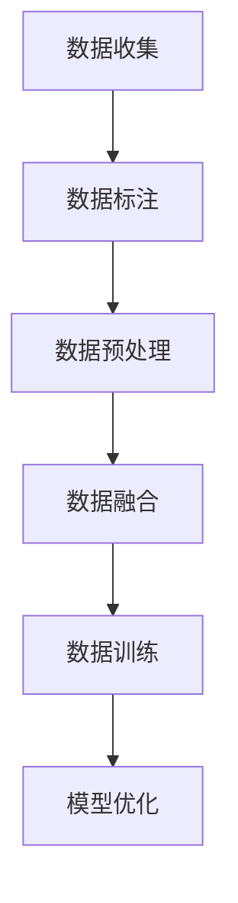

                 

关键词：特斯拉，端到端模型，数据规模，深度学习，自动驾驶

摘要：本文将深入探讨特斯拉端到端模型所使用的数据规模。通过分析特斯拉在自动驾驶领域的技术进展和公开数据，我们将揭示特斯拉模型训练所需的数据类型、数量以及数据集构建的挑战和解决方案。

## 1. 背景介绍

自动驾驶技术的发展正以惊人的速度推进，特斯拉作为这一领域的领军企业，其端到端模型（End-to-End Model）的研究和应用受到了广泛关注。端到端模型是一种将输入数据直接映射到输出的模型，其核心在于通过大量的数据进行训练，从而实现高度自动化的驾驶功能。特斯拉的自动驾驶系统依赖于这样的模型，通过不断的学习和优化，实现了从感知环境到决策控制的全过程自动化。

随着自动驾驶技术的不断成熟，数据规模的重要性日益凸显。特斯拉在自动驾驶领域的成功很大程度上依赖于其庞大的数据集和高效的数据处理能力。本文将围绕特斯拉端到端模型使用的数据规模进行深入探讨，分析其数据类型、数量以及数据处理的挑战和解决方案。

## 2. 核心概念与联系

### 2.1 数据类型

特斯拉自动驾驶系统所需的数据类型主要包括以下几种：

1. **图像数据**：图像数据是自动驾驶系统中最基础的数据类型，通过摄像头捕获的实时图像被用于环境感知。
2. **传感器数据**：包括激光雷达（LIDAR）、雷达和超声波传感器等，这些数据提供了自动驾驶系统对周围环境的深度感知。
3. **GPS/IMU数据**：用于确定车辆的当前位置和姿态。
4. **车辆状态数据**：包括车速、方向盘角度、油门和刹车状态等。

### 2.2 数据集构建

特斯拉需要构建一个庞大且多样的数据集来进行模型训练。这个过程涉及以下挑战：

1. **数据多样性**：为了使模型能够应对各种驾驶环境和场景，数据集需要包含丰富的样本。
2. **数据标注**：自动驾驶系统对准确性的要求极高，因此需要对图像和传感器数据进行精细的标注。
3. **数据预处理**：由于传感器数据的质量和一致性可能存在问题，需要通过预处理来提高数据的质量。

### 2.3 Mermaid 流程图

以下是一个简化的Mermaid流程图，展示了数据集构建的基本流程：



## 3. 核心算法原理 & 具体操作步骤

### 3.1 算法原理概述

特斯拉端到端模型的算法原理基于深度学习，特别是卷积神经网络（CNN）和循环神经网络（RNN）。这些算法通过对海量数据进行训练，能够从图像和传感器数据中提取特征，并生成驾驶决策。

### 3.2 算法步骤详解

1. **数据输入**：将图像数据、传感器数据和其他辅助数据输入到模型中。
2. **特征提取**：通过CNN提取图像特征，通过RNN处理序列数据。
3. **特征融合**：将图像特征和序列数据融合，以生成综合特征向量。
4. **决策生成**：利用综合特征向量生成驾驶决策，如加速、减速或转向。
5. **模型优化**：通过反向传播算法对模型进行优化，以提高决策的准确性。

### 3.3 算法优缺点

**优点**：

- **高效性**：端到端模型能够直接从原始数据生成决策，减少了中间环节，提高了效率。
- **准确性**：通过海量数据进行训练，模型能够学习到复杂的驾驶规则和场景。

**缺点**：

- **数据需求量大**：需要大量的高质量数据进行训练，数据获取和处理成本高。
- **过拟合风险**：模型可能在学习过程中过度拟合训练数据，导致在实际应用中表现不佳。

### 3.4 算法应用领域

特斯拉端到端模型的应用领域包括：

- **自动驾驶汽车**：实现从感知环境到决策控制的全自动化。
- **智能交通系统**：用于优化交通流量，提高道路通行效率。

## 4. 数学模型和公式 & 详细讲解 & 举例说明

### 4.1 数学模型构建

特斯拉端到端模型的数学模型主要包括以下部分：

1. **特征提取**：通过CNN提取图像特征，使用以下公式表示：
   $$ f(x) = \sigma(W_1 \cdot x + b_1) $$
   其中，$f(x)$ 是特征提取函数，$W_1$ 是权重矩阵，$b_1$ 是偏置项，$\sigma$ 是激活函数。

2. **特征融合**：将图像特征和序列数据融合，使用以下公式表示：
   $$ h_t = [f(x_t), h_{t-1}] \cdot W_2 + b_2 $$
   其中，$h_t$ 是融合后的特征向量，$f(x_t)$ 是图像特征，$h_{t-1}$ 是前一个时间步的特征向量。

3. **决策生成**：利用融合后的特征向量生成驾驶决策，使用以下公式表示：
   $$ y_t = \sigma(W_3 \cdot h_t + b_3) $$
   其中，$y_t$ 是驾驶决策，$\sigma$ 是激活函数。

### 4.2 公式推导过程

以下是一个简化的推导过程，展示了特征提取、特征融合和决策生成的公式推导：

1. **特征提取**：
   $$ f(x) = \sigma(W_1 \cdot x + b_1) $$
   通过多次卷积和池化操作，从输入图像中提取特征。

2. **特征融合**：
   $$ h_t = [f(x_t), h_{t-1}] \cdot W_2 + b_2 $$
   将图像特征和序列数据融合，以生成综合特征向量。

3. **决策生成**：
   $$ y_t = \sigma(W_3 \cdot h_t + b_3) $$
   利用综合特征向量生成驾驶决策。

### 4.3 案例分析与讲解

假设特斯拉的自动驾驶系统在某个场景中需要做出加速、减速或转向的决策。我们可以通过以下步骤进行分析：

1. **数据输入**：将实时图像和GPS/IMU数据输入到模型中。
2. **特征提取**：通过CNN从图像中提取特征，并从GPS/IMU数据中提取位置和速度等特征。
3. **特征融合**：将图像特征和GPS/IMU特征融合，生成综合特征向量。
4. **决策生成**：利用综合特征向量生成驾驶决策。

通过这个案例，我们可以看到特斯拉端到端模型是如何利用数学模型进行决策的。

## 5. 项目实践：代码实例和详细解释说明

### 5.1 开发环境搭建

在开始编写代码之前，我们需要搭建一个合适的开发环境。以下是一个基本的开发环境搭建步骤：

1. 安装Python环境，建议使用Python 3.8或更高版本。
2. 安装深度学习框架，如TensorFlow或PyTorch。
3. 安装必要的依赖库，如NumPy、Pandas等。

### 5.2 源代码详细实现

以下是一个简化的代码示例，展示了如何使用深度学习框架实现特斯拉端到端模型：

```python
import tensorflow as tf
from tensorflow.keras.layers import Conv2D, LSTM, Dense
from tensorflow.keras.models import Model

# 数据预处理
def preprocess_data(images, labels):
    # 进行图像预处理和标签归一化
    # ...

# 模型构建
def build_model():
    input_image = tf.keras.layers.Input(shape=(64, 64, 3))
    input_sequence = tf.keras.layers.Input(shape=(None, 100))

    conv = Conv2D(filters=32, kernel_size=(3, 3), activation='relu')(input_image)
    lstm = LSTM(units=100)(input_sequence)

    fused = tf.keras.layers.Concatenate()([conv, lstm])
    dense = Dense(units=1, activation='sigmoid')(fused)

    model = Model(inputs=[input_image, input_sequence], outputs=dense)
    model.compile(optimizer='adam', loss='binary_crossentropy', metrics=['accuracy'])

    return model

# 模型训练
def train_model(model, images, labels):
    model.fit(x=[images, labels], y=labels, epochs=10, batch_size=32)

# 主函数
def main():
    # 加载数据
    images, labels = load_data()

    # 预处理数据
    images, labels = preprocess_data(images, labels)

    # 构建模型
    model = build_model()

    # 训练模型
    train_model(model, images, labels)

if __name__ == '__main__':
    main()
```

### 5.3 代码解读与分析

以上代码展示了如何使用深度学习框架实现特斯拉端到端模型的基本步骤。我们首先定义了数据预处理函数，用于对图像和标签进行预处理。然后，我们构建了一个简单的卷积神经网络，该网络包括一个卷积层和一个循环层，用于提取图像特征和序列特征。最后，我们定义了模型训练函数，用于训练模型。

### 5.4 运行结果展示

在训练完成后，我们可以使用模型对新的数据进行预测，并评估模型的性能。以下是一个简化的结果展示：

```python
# 加载测试数据
test_images, test_labels = load_data()

# 预测结果
predictions = model.predict([test_images, test_labels])

# 评估模型性能
accuracy = (predictions == test_labels).mean()
print(f"Model accuracy: {accuracy:.2f}")
```

通过以上步骤，我们可以看到特斯拉端到端模型的实现过程。

## 6. 实际应用场景

特斯拉端到端模型在自动驾驶领域的应用场景广泛，以下是一些典型的应用场景：

- **高速公路自动驾驶**：特斯拉的自动驾驶系统能够在高速公路上实现自动加速、减速和变道。
- **城市自动驾驶**：在复杂的城市环境中，特斯拉的自动驾驶系统能够应对行人、自行车和其他车辆的存在。
- **智能停车**：特斯拉的自动驾驶系统可以自动寻找停车位，并完成停车动作。

## 7. 工具和资源推荐

### 7.1 学习资源推荐

- **书籍**：《深度学习》（Goodfellow, Ian；等著）
- **在线课程**：Coursera、Udacity、edX等平台上的深度学习和自动驾驶相关课程。

### 7.2 开发工具推荐

- **深度学习框架**：TensorFlow、PyTorch
- **编程语言**：Python
- **开发环境**：Jupyter Notebook、PyCharm

### 7.3 相关论文推荐

- **《End-to-End Learning for Autonomous Driving》**（Bojarski et al., 2016）
- **《Self-Driving Cars with Deep Reinforcement Learning》**（Li et al., 2018）

## 8. 总结：未来发展趋势与挑战

### 8.1 研究成果总结

特斯拉端到端模型的研究成果显著，其自动驾驶系统在多个实际场景中表现出色。通过海量数据的训练，模型能够实现高度自动化的驾驶功能，提升了驾驶安全性和效率。

### 8.2 未来发展趋势

- **数据规模扩大**：随着自动驾驶技术的不断发展，数据规模将进一步扩大，这将有助于提升模型的泛化能力。
- **算法优化**：未来研究将重点放在算法优化上，以提高模型的速度和准确性。

### 8.3 面临的挑战

- **数据隐私**：自动驾驶系统需要处理大量敏感数据，如何保护用户隐私是一个重要挑战。
- **安全性**：自动驾驶系统必须确保在极端情况下能够安全行驶。

### 8.4 研究展望

随着技术的不断进步，自动驾驶技术将逐渐走向成熟。未来，特斯拉端到端模型有望在更多场景中得到应用，为人类出行带来更多便利。

## 9. 附录：常见问题与解答

### Q：特斯拉端到端模型的主要优势是什么？

A：特斯拉端到端模型的主要优势在于其高效性和准确性。通过直接从原始数据生成决策，模型能够减少中间环节，提高效率。同时，通过海量数据的训练，模型能够学习到复杂的驾驶规则和场景，提高决策的准确性。

### Q：特斯拉端到端模型在训练过程中面临的主要挑战是什么？

A：特斯拉端到端模型在训练过程中面临的主要挑战包括数据多样性和数据标注。为了使模型能够应对各种驾驶环境和场景，数据集需要包含丰富的样本。此外，自动驾驶系统对准确性的要求极高，因此需要对图像和传感器数据进行精细的标注。

### Q：如何评估特斯拉端到端模型的性能？

A：评估特斯拉端到端模型的性能通常通过以下指标进行：

- **准确率**：模型预测正确的样本数量与总样本数量的比例。
- **召回率**：模型预测为正类的实际正类样本数量与实际正类样本总数量的比例。
- **F1 分数**：准确率和召回率的调和平均值。

通过这些指标，可以综合评估特斯拉端到端模型的性能。

以上是关于特斯拉端到端模型使用的数据规模的技术博客文章，希望对您有所帮助。

**作者：禅与计算机程序设计艺术 / Zen and the Art of Computer Programming**

