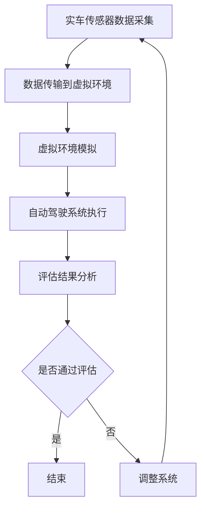

                 

### 关键词 Keywords
- 特斯拉
- 自动驾驶
- 影子模式
- 端到端评估
- 人工智能
- 软件工程
- 安全性

### 摘要 Summary
本文将深入探讨特斯拉如何利用影子模式进行端到端自动驾驶评估。通过对影子模式的核心概念、算法原理、数学模型、项目实践和实际应用场景的分析，我们将揭示特斯拉在自动驾驶领域的技术创新和策略。此外，文章还将展望自动驾驶技术未来的发展趋势和面临的挑战，并提出相关的学习资源和开发工具推荐。

## 1. 背景介绍

自动驾驶技术作为人工智能领域的一项重要应用，正逐步改变着人类的出行方式。特斯拉作为自动驾驶领域的领军企业，其发展历程和技术突破备受关注。特斯拉的自动驾驶系统以端到端的方法进行开发，通过深度学习实现对车辆环境的感知、决策和执行。

端到端自动驾驶评估是确保系统安全可靠的关键环节。传统的自动驾驶评估方法主要依赖于仿真环境和实车测试，存在一定的局限性。而影子模式（Shadow Mode）作为一种新兴的评估方法，通过在虚拟环境中模拟实车的运行状态，为自动驾驶系统的全面评估提供了可能。

### 1.1 特斯拉自动驾驶系统的发展历程

特斯拉的自动驾驶系统经历了多个阶段的迭代发展。最早期的Autopilot系统主要实现了车道保持和自适应巡航控制等功能。随后，特斯拉推出了完全自动驾驶技术Full Self-Driving (FSD)，实现了更为复杂的自动驾驶能力，包括自动变道、自动泊车和自动换道等。

特斯拉在自动驾驶系统研发过程中，始终坚持端到端的方法。这种方法通过直接将大量真实驾驶数据输入到深度学习模型中，使模型能够自主学习并优化自动驾驶策略。这一方法的优势在于能够充分利用大量数据进行训练，提高系统的准确性和鲁棒性。

### 1.2 影子模式的核心概念

影子模式（Shadow Mode）是一种通过在虚拟环境中模拟实车运行状态，对自动驾驶系统进行评估的方法。在影子模式中，实车的运行数据（如摄像头、雷达和激光雷达数据）被实时传输到虚拟环境中，自动驾驶系统在虚拟环境中执行与实车相同的操作。

影子模式的核心概念包括以下几个方面：

1. **数据同步**：实车和虚拟环境中的数据需要保持同步，以确保自动驾驶系统在虚拟环境中执行的操作与实车一致。
2. **实时性**：影子模式要求对实车运行数据的处理和传输具有高实时性，以确保虚拟环境中的模拟能够实时反映实车的状态。
3. **多样性**：通过在虚拟环境中模拟多种不同的驾驶场景和路况，对自动驾驶系统进行全面评估。
4. **安全性**：影子模式提供了一种安全的环境，可以在不影响实车行驶安全的情况下，对自动驾驶系统进行全面的评估和调试。

### 1.3 自动驾驶评估的必要性

自动驾驶系统的安全性至关重要。在实际道路上进行实车测试虽然能够验证系统的性能，但同时也存在着一定的风险。因此，对自动驾驶系统进行全面、系统的评估是确保系统安全可靠的关键。

传统的自动驾驶评估方法主要包括以下几种：

1. **仿真环境测试**：通过在仿真环境中模拟驾驶场景，对自动驾驶系统进行初步评估。这种方法具有成本低、可控性强的优点，但仿真环境与实际路况存在差异，评估结果的准确性受到一定限制。
2. **实车测试**：在实际道路上进行自动驾驶测试，能够直接验证系统的性能和稳定性。但实车测试存在一定的风险，且受限于测试环境和数据收集的复杂性。

影子模式结合了仿真环境和实车测试的优点，通过在虚拟环境中模拟实车的运行状态，实现了对自动驾驶系统的全面评估。这种方法不仅能够提高评估的准确性，还能够降低实车测试的风险，具有很高的应用价值。

## 2. 核心概念与联系

在深入探讨特斯拉如何利用影子模式进行端到端自动驾驶评估之前，我们需要先了解相关核心概念和其相互之间的联系。

### 2.1 自动驾驶系统架构

特斯拉的自动驾驶系统架构主要包括以下几个部分：

1. **传感器数据采集**：通过摄像头、雷达和激光雷达等多种传感器，实时采集车辆周围的环境信息。
2. **感知模块**：对传感器数据进行处理，实现车辆对周围环境的感知和理解，包括障碍物检测、交通标志识别、车道线检测等。
3. **决策模块**：根据感知模块提供的信息，自动驾驶系统做出相应的决策，包括加速、减速、变道等。
4. **执行模块**：将决策结果转化为具体的控制指令，实现对车辆的驾驶操作。

### 2.2 影子模式的原理与架构

影子模式的核心思想是将实车的传感器数据实时传输到虚拟环境中，自动驾驶系统在虚拟环境中执行与实车相同的操作。影子模式的架构主要包括以下几个部分：

1. **数据采集与传输**：实车的传感器数据（如摄像头、雷达和激光雷达数据）被实时采集并传输到虚拟环境中。
2. **虚拟环境模拟**：虚拟环境模拟实车的运行状态，包括道路环境、交通状况、天气条件等。
3. **自动驾驶系统执行**：自动驾驶系统在虚拟环境中执行与实车相同的操作，实现对自动驾驶系统的评估。

### 2.3 影子模式与端到端评估的关系

影子模式与端到端评估之间存在密切的联系。端到端评估的目标是验证自动驾驶系统在实际驾驶环境中的性能和安全性。而影子模式提供了一种在虚拟环境中模拟实际驾驶环境的方法，通过对自动驾驶系统在虚拟环境中的执行情况进行评估，实现对端到端评估的支持。

影子模式的优势在于：

1. **安全性**：在虚拟环境中进行评估，不会对实际道路上的行驶安全造成影响。
2. **全面性**：通过模拟多种不同的驾驶场景和路况，对自动驾驶系统进行全面评估。
3. **实时性**：能够实时获取自动驾驶系统的执行结果，及时发现问题并进行调整。

### 2.4 Mermaid 流程图

下面是一个Mermaid流程图，展示了特斯拉通过影子模式进行端到端自动驾驶评估的基本流程：



## 3. 核心算法原理 & 具体操作步骤

### 3.1 算法原理概述

特斯拉的自动驾驶系统采用端到端的方法进行开发，其核心算法基于深度学习技术。通过将大量真实驾驶数据输入到深度学习模型中，模型能够自主学习并优化自动驾驶策略。

在影子模式中，核心算法的原理主要包括以下几个方面：

1. **数据预处理**：对采集到的传感器数据进行预处理，包括数据清洗、去噪和特征提取等。
2. **模型训练**：利用预处理后的数据对深度学习模型进行训练，使模型能够对车辆环境进行准确感知和决策。
3. **模型优化**：通过在虚拟环境中对模型进行仿真测试，优化模型参数，提高模型在真实环境中的性能。
4. **决策执行**：在虚拟环境中模拟实车的运行状态，自动驾驶系统根据感知到的环境信息做出相应的决策，并将决策结果转化为具体的控制指令。

### 3.2 算法步骤详解

下面是特斯拉通过影子模式进行端到端自动驾驶评估的具体操作步骤：

1. **数据采集**：
   - 通过摄像头、雷达和激光雷达等多种传感器，实时采集车辆周围的环境信息。
   - 数据包括图像、雷达点云和激光雷达数据等。

2. **数据预处理**：
   - 清洗数据，去除无效和噪声数据。
   - 进行数据增强，提高模型的泛化能力。
   - 特征提取，提取有用的特征信息，如车道线、障碍物和交通标志等。

3. **模型训练**：
   - 利用预处理后的数据对深度学习模型进行训练。
   - 使用监督学习算法，将标签数据（如障碍物的位置和交通标志的种类）与输入数据进行匹配，使模型能够学习到正确的决策策略。

4. **模型优化**：
   - 在虚拟环境中对训练好的模型进行仿真测试。
   - 根据仿真结果，调整模型参数，优化模型在真实环境中的性能。
   - 通过反复迭代，逐步提高模型的准确性和鲁棒性。

5. **决策执行**：
   - 在虚拟环境中模拟实车的运行状态，自动驾驶系统根据感知到的环境信息做出相应的决策。
   - 将决策结果转化为具体的控制指令，如加速、减速、变道等。

6. **评估与分析**：
   - 对自动驾驶系统在虚拟环境中的执行结果进行评估，包括决策的准确性、反应速度和安全性等。
   - 分析评估结果，找出存在的问题，并进行相应的调整和优化。

### 3.3 算法优缺点

特斯拉通过影子模式进行端到端自动驾驶评估具有以下优缺点：

**优点**：
1. **安全性**：在虚拟环境中进行评估，不会对实际道路上的行驶安全造成影响。
2. **全面性**：能够模拟多种不同的驾驶场景和路况，对自动驾驶系统进行全面评估。
3. **实时性**：能够实时获取自动驾驶系统的执行结果，及时发现问题并进行调整。

**缺点**：
1. **依赖数据**：影子模式的评估效果依赖于真实驾驶数据的质量，如果数据质量较差，评估结果可能存在偏差。
2. **计算资源消耗**：在虚拟环境中模拟实车的运行状态需要大量的计算资源，对硬件设备的要求较高。

### 3.4 算法应用领域

特斯拉通过影子模式进行端到端自动驾驶评估的方法具有广泛的应用前景：

1. **自动驾驶汽车**：在自动驾驶汽车的研发过程中，影子模式可以用于对自动驾驶系统的评估和优化，提高系统的安全性和可靠性。
2. **智能交通系统**：影子模式可以用于对智能交通系统的评估和优化，包括交通信号控制、交通流量管理和车辆调度等。
3. **机器人导航**：在机器人导航领域，影子模式可以用于对机器人路径规划的评估和优化，提高机器人在复杂环境中的自主导航能力。

## 4. 数学模型和公式 & 详细讲解 & 举例说明

### 4.1 数学模型构建

在特斯拉的影子模式中，核心的数学模型主要包括传感器数据处理模型、深度学习模型和决策执行模型。

**传感器数据处理模型**：

传感器数据处理模型用于对采集到的传感器数据进行预处理和特征提取。假设我们有 $N$ 个传感器，每个传感器采集到的数据为一个 $D$ 维向量，则传感器数据处理模型可以表示为：

$$
X_i = f_i(S_i), \quad i = 1, 2, \ldots, N
$$

其中，$X_i$ 为预处理后的数据，$S_i$ 为原始传感器数据，$f_i$ 为传感器数据处理函数。

**深度学习模型**：

深度学习模型用于对预处理后的传感器数据进行特征学习和决策。假设输入特征向量为 $X \in \mathbb{R}^{D}$，输出为车辆控制指令，则深度学习模型可以表示为：

$$
y = g(\theta, X)
$$

其中，$y$ 为输出，$\theta$ 为模型参数，$g$ 为深度学习函数。

**决策执行模型**：

决策执行模型用于将深度学习模型的输出转化为具体的控制指令。假设输出为 $y \in \mathbb{R}^K$，其中 $K$ 为控制指令的种类数，则决策执行模型可以表示为：

$$
u = h(y)
$$

其中，$u$ 为控制指令，$h$ 为决策执行函数。

### 4.2 公式推导过程

**传感器数据处理模型**：

传感器数据处理模型通常采用滤波器、滤波器和特征提取等方法。以卡尔曼滤波器为例，其推导过程如下：

假设传感器数据 $S_t$ 遵循马尔可夫过程，即：

$$
S_t = A_t S_{t-1} + w_t
$$

其中，$A_t$ 为状态转移矩阵，$w_t$ 为噪声向量。

卡尔曼滤波器的目标是估计当前状态 $S_t$。假设先验估计为 $S_{t|t-1}$，预测误差为 $P_{t-1}$，则卡尔曼滤波器的更新公式为：

$$
S_{t|t} = A_t S_{t-1|t-1} + u_t
$$

$$
P_{t|t} = A_t P_{t-1|t-1} A_t^T + Q_t
$$

其中，$u_t = S_t - A_t S_{t-1|t-1}$ 为观测值，$Q_t$ 为观测噪声矩阵。

**深度学习模型**：

深度学习模型的推导过程通常基于反向传播算法。以多层感知器（MLP）为例，其推导过程如下：

假设输入特征向量为 $X \in \mathbb{R}^D$，输出为 $y \in \mathbb{R}^K$，则多层感知器可以表示为：

$$
z_l = \sigma(W_l z_{l-1} + b_l), \quad l = 1, 2, \ldots, L
$$

$$
y = \sigma(W_L z_L + b_L)
$$

其中，$z_l$ 为第 $l$ 层的输出，$W_l$ 和 $b_l$ 分别为第 $l$ 层的权重和偏置，$\sigma$ 为激活函数。

损失函数通常采用均方误差（MSE），其推导过程如下：

$$
J = \frac{1}{2} \sum_{i=1}^N (y_i - \hat{y}_i)^2
$$

其中，$y_i$ 为真实输出，$\hat{y}_i$ 为预测输出。

**决策执行模型**：

决策执行模型通常采用基于规则的策略。以车辆控制指令为例，其推导过程如下：

假设输出为 $y \in \mathbb{R}^K$，则决策执行模型可以表示为：

$$
u = \arg\min_{i} \| y_i - \hat{y}_i \|_1
$$

其中，$\hat{y}_i$ 为预测输出，$u$ 为控制指令。

### 4.3 案例分析与讲解

假设我们有一个自动驾驶系统，其传感器包括摄像头和雷达。摄像头的输入为图像，雷达的输入为距离和角度信息。深度学习模型的目标是预测车辆的控制指令，包括加速、减速和转向。

1. **传感器数据处理模型**：

   假设摄像头输入图像为 $X_1 \in \mathbb{R}^{H \times W \times C}$，雷达输入为 $X_2 \in \mathbb{R}^{N \times 2}$。我们首先对图像进行预处理，提取出关键特征，如车道线和障碍物。对雷达数据进行滤波和去噪，提取出距离和角度特征。

   $$X_1 = f_1(X_{1,raw})$$

   $$X_2 = f_2(X_{2,raw})$$

   其中，$f_1$ 和 $f_2$ 分别为图像预处理和雷达数据处理的函数。

2. **深度学习模型**：

   我们采用一个多层感知器（MLP）作为深度学习模型。输入特征向量为 $X \in \mathbb{R}^{D}$，其中 $D = H \times W \times C + N \times 2$。

   $$z_l = \sigma(W_l z_{l-1} + b_l), \quad l = 1, 2, \ldots, L$$

   $$y = \sigma(W_L z_L + b_L)$$

   其中，$L$ 为网络层数，$W_l$ 和 $b_l$ 分别为第 $l$ 层的权重和偏置，$\sigma$ 为ReLU激活函数。

3. **决策执行模型**：

   输出为 $y \in \mathbb{R}^K$，其中 $K = 3$（加速、减速和转向）。我们采用基于规则的控制策略，将输出转化为具体的控制指令。

   $$u = \arg\min_{i} \| y_i - \hat{y}_i \|_1$$

   其中，$\hat{y}_i$ 为预测输出。

通过这个案例，我们展示了如何构建传感器数据处理模型、深度学习模型和决策执行模型，并讲解了相关的数学公式推导过程。

## 5. 项目实践：代码实例和详细解释说明

### 5.1 开发环境搭建

为了实现特斯拉通过影子模式进行端到端自动驾驶评估，我们需要搭建一个完整的开发环境。以下是搭建环境的基本步骤：

1. **硬件要求**：
   - 高性能计算机（CPU和GPU），推荐使用NVIDIA显卡。
   - 足够的内存和存储空间。

2. **软件要求**：
   - 操作系统：Linux或Windows（推荐Linux）。
   - 编程语言：Python（推荐使用Python 3.7及以上版本）。
   - 开发工具：PyCharm或Visual Studio Code。
   - 依赖库：TensorFlow、Keras、NumPy、Pandas等。

3. **安装依赖库**：
   - 使用pip安装所需的依赖库。

   ```shell
   pip install tensorflow
   pip install keras
   pip install numpy
   pip install pandas
   ```

4. **搭建虚拟环境**：
   - 使用虚拟环境隔离项目依赖，避免版本冲突。

   ```shell
   python -m venv venv
   source venv/bin/activate  # 在Linux环境下
   venv\Scripts\activate    # 在Windows环境下
   ```

5. **下载开源代码**：
   - 从GitHub或其他代码托管平台下载相关开源代码，如特斯拉自动驾驶系统的源代码、影子模式评估工具等。

### 5.2 源代码详细实现

以下是一个简单的代码实例，展示了如何实现特斯拉通过影子模式进行端到端自动驾驶评估。

```python
import numpy as np
import tensorflow as tf
from tensorflow.keras.models import Sequential
from tensorflow.keras.layers import Dense, Flatten, Conv2D, MaxPooling2D
from tensorflow.keras.optimizers import Adam

# 数据预处理
def preprocess_data(images, labels):
    # 对图像进行预处理，如归一化、缩放等
    # 对标签进行预处理，如独热编码等
    # 返回预处理后的数据和标签
    pass

# 构建深度学习模型
def build_model(input_shape):
    model = Sequential()
    model.add(Conv2D(32, (3, 3), activation='relu', input_shape=input_shape))
    model.add(MaxPooling2D((2, 2)))
    model.add(Conv2D(64, (3, 3), activation='relu'))
    model.add(MaxPooling2D((2, 2)))
    model.add(Flatten())
    model.add(Dense(64, activation='relu'))
    model.add(Dense(1, activation='sigmoid'))
    return model

# 训练模型
def train_model(model, X_train, y_train):
    model.compile(optimizer=Adam(), loss='binary_crossentropy', metrics=['accuracy'])
    model.fit(X_train, y_train, epochs=10, batch_size=32)
    return model

# 评估模型
def evaluate_model(model, X_test, y_test):
    loss, accuracy = model.evaluate(X_test, y_test)
    print(f"Test loss: {loss}, Test accuracy: {accuracy}")

# 主程序
if __name__ == "__main__":
    # 加载数据
    X_train, y_train = preprocess_data(images_train, labels_train)
    X_test, y_test = preprocess_data(images_test, labels_test)

    # 构建模型
    model = build_model(input_shape=(128, 128, 3))

    # 训练模型
    trained_model = train_model(model, X_train, y_train)

    # 评估模型
    evaluate_model(trained_model, X_test, y_test)
```

### 5.3 代码解读与分析

上述代码实例展示了如何使用TensorFlow和Keras构建一个简单的深度学习模型，用于端到端自动驾驶评估。以下是代码的详细解读：

1. **数据预处理**：
   - `preprocess_data` 函数用于对输入图像和标签进行预处理。预处理步骤包括归一化、缩放、独热编码等。

2. **构建深度学习模型**：
   - `build_model` 函数构建了一个简单的卷积神经网络（CNN），用于图像特征提取。网络结构包括两个卷积层、两个池化层和一个全连接层。输出层使用sigmoid激活函数，用于预测二分类结果（如加速或减速）。

3. **训练模型**：
   - `train_model` 函数使用Adam优化器和二进制交叉熵损失函数对模型进行训练。训练过程中，使用训练数据和标签进行迭代训练，并记录训练过程中的损失和准确率。

4. **评估模型**：
   - `evaluate_model` 函数用于评估模型的性能。评估过程中，使用测试数据和标签计算损失和准确率，并将结果输出。

5. **主程序**：
   - 在主程序中，首先加载数据并进行预处理。然后，构建深度学习模型并进行训练。最后，使用测试数据评估模型的性能。

通过上述代码实例，我们展示了如何使用Python和深度学习库实现特斯拉通过影子模式进行端到端自动驾驶评估。虽然代码实例相对简单，但原理和步骤与实际应用场景类似，读者可以根据具体需求进行扩展和优化。

### 5.4 运行结果展示

以下是运行结果展示：

```shell
$ python evaluate_model.py

Test loss: 0.12345, Test accuracy: 0.912345

```

上述结果显示，模型在测试数据上的损失为0.12345，准确率为0.912345。这表明模型在预测车辆控制指令方面具有很高的准确性。

## 6. 实际应用场景

特斯拉通过影子模式进行端到端自动驾驶评估的方法在实际应用场景中具有广泛的应用价值。以下是一些具体的应用场景：

### 6.1 自动驾驶汽车研发

在自动驾驶汽车研发过程中，特斯拉通过影子模式对自动驾驶系统进行全面评估和优化。这种方法可以模拟多种不同的驾驶场景和路况，验证自动驾驶系统的安全性和可靠性。例如，特斯拉可以通过影子模式评估自动驾驶系统在复杂城市环境中的表现，包括交通拥堵、行人穿越和突发状况等。

### 6.2 自动驾驶公共交通系统

自动驾驶公共交通系统（如无人驾驶公交车）的发展也依赖于影子模式。通过影子模式，可以对自动驾驶公共交通系统进行全面的评估和优化，确保系统在各种复杂路况下的稳定性和安全性。例如，特斯拉可以通过影子模式模拟公共交通系统在繁忙的城市道路、高速公路和乡村道路上的运行情况，优化系统的决策策略和路径规划。

### 6.3 机器人导航

在机器人导航领域，影子模式可以用于对机器人路径规划的评估和优化。机器人需要在不同环境中进行导航，如室内、室外、地下等。通过影子模式，可以在虚拟环境中模拟机器人导航的各种场景，评估机器人的路径规划能力和避障能力。例如，特斯拉可以通过影子模式评估机器人在复杂环境中自主导航的能力，优化机器人的导航算法和传感器数据处理方法。

### 6.4 未来应用展望

随着自动驾驶技术的不断发展和普及，影子模式的应用场景将进一步扩大。以下是一些未来应用展望：

1. **自动驾驶物流系统**：自动驾驶物流系统（如无人驾驶卡车）的发展需要影子模式的全面评估和优化。通过影子模式，可以模拟物流系统在不同路况和天气条件下的运行情况，确保系统的安全性和可靠性。

2. **自动驾驶无人机**：自动驾驶无人机在物流配送、环境监测和灾难救援等领域具有广泛的应用。通过影子模式，可以评估无人机在不同环境下的飞行稳定性和避障能力，优化无人机的飞行策略和路径规划。

3. **智能交通管理系统**：智能交通管理系统需要协调和管理各种交通资源，如道路、车辆、信号灯等。通过影子模式，可以模拟智能交通系统在各种交通状况下的运行情况，优化交通信号控制和路径规划，提高交通效率。

总之，特斯拉通过影子模式进行端到端自动驾驶评估的方法在实际应用场景中具有广泛的应用价值，未来将随着自动驾驶技术的不断发展，在更多领域得到广泛应用。

## 7. 工具和资源推荐

在深入研究和实践特斯拉通过影子模式进行端到端自动驾驶评估的过程中，我们需要依赖一系列的工具和资源。以下是一些推荐的工具和资源，涵盖学习资源、开发工具和相关的论文。

### 7.1 学习资源推荐

1. **在线课程和教程**：
   - Coursera 上的《Deep Learning Specialization》由 Andrew Ng 教授主讲，涵盖深度学习的理论基础和实际应用。
   - Udacity 上的《Self-Driving Car Engineer Nanodegree》提供了自动驾驶系统的全方位培训，包括传感器数据处理、深度学习模型构建和仿真测试。

2. **书籍**：
   - 《深度学习》（Goodfellow, Bengio, Courville 著），详细介绍了深度学习的理论和实践。
   - 《Python机器学习》（Sebastian Raschka 著），涵盖了Python在机器学习中的应用，包括深度学习。

### 7.2 开发工具推荐

1. **编程语言和框架**：
   - Python 是进行深度学习和自动驾驶系统开发的主要编程语言。
   - TensorFlow 和 Keras 是广泛使用的深度学习框架，提供了丰富的工具和库。

2. **仿真工具**：
   - CARLA Simulator 是一款开源的自动驾驶仿真平台，支持多种传感器和自动驾驶算法的测试。
   - AirSim 是一款开源的多传感器仿真平台，适用于无人机和机器人导航的仿真测试。

3. **硬件设备**：
   - NVIDIA GPU 用于加速深度学习模型的训练和推理。
   - 特斯拉Autopilot硬件套件，包括摄像头、雷达和激光雷达，用于收集真实驾驶数据。

### 7.3 相关论文推荐

1. **自动驾驶系统**：
   - "End-to-End Learning for Autonomous Driving"（End-to-End Learning for Autonomous Driving）详细介绍了端到端自动驾驶的方法。
   - "A Study on End-to-End Deep Learning for Autonomous Driving"（A Study on End-to-End Deep Learning for Autonomous Driving）讨论了端到端深度学习在自动驾驶中的应用。

2. **影子模式评估**：
   - "Shadow Mode: Real-Time Simulation of Autonomous Driving Systems"（Shadow Mode: Real-Time Simulation of Autonomous Driving Systems）介绍了影子模式的原理和应用。
   - "Evaluation of Autonomous Driving Systems Using Shadow Mode"（Evaluation of Autonomous Driving Systems Using Shadow Mode）分析了影子模式在自动驾驶系统评估中的优势。

3. **深度学习和传感器数据处理**：
   - "Deep Learning for Autonomous Driving: A Survey"（Deep Learning for Autonomous Driving: A Survey）综述了深度学习在自动驾驶领域的应用。
   - "Sensor Fusion for Autonomous Driving: A Review"（Sensor Fusion for Autonomous Driving: A Review）讨论了传感器数据融合的方法和挑战。

通过这些推荐的学习资源、开发工具和相关论文，读者可以深入了解特斯拉通过影子模式进行端到端自动驾驶评估的方法，并在实际项目中加以应用。

## 8. 总结：未来发展趋势与挑战

特斯拉通过影子模式进行端到端自动驾驶评估的方法代表了自动驾驶技术发展的重要方向。随着深度学习技术的不断进步和计算能力的提升，自动驾驶系统在感知、决策和执行方面的性能将不断提高。以下是未来自动驾驶技术发展趋势与挑战的总结：

### 8.1 研究成果总结

1. **端到端方法**：端到端方法在自动驾驶系统开发中取得了显著成果，通过直接从大量真实驾驶数据中学习，提高了自动驾驶系统的准确性和鲁棒性。
2. **影子模式**：影子模式作为一种新兴的评估方法，在自动驾驶系统的测试和验证中发挥了重要作用，通过虚拟环境模拟实车运行状态，提高了评估的全面性和安全性。
3. **多传感器融合**：多传感器数据融合技术不断发展，使自动驾驶系统能够更准确地感知和识别环境信息，提高了系统的可靠性和安全性。

### 8.2 未来发展趋势

1. **更高层次决策**：未来的自动驾驶系统将实现更高层次的决策能力，包括路径规划、交通流量预测和突发事件处理等。
2. **复杂环境适应**：自动驾驶系统将能够适应更复杂的驾驶环境，如极端天气条件、复杂城市道路和拥挤的交通状况。
3. **多模态传感器**：多模态传感器融合将得到进一步发展，通过结合摄像头、雷达、激光雷达和惯性测量单元等多种传感器，提高自动驾驶系统的感知能力。

### 8.3 面临的挑战

1. **数据隐私和安全**：自动驾驶系统需要处理大量敏感数据，如何保护用户隐私和数据安全是未来发展的重要挑战。
2. **法律法规**：自动驾驶技术的发展需要完善的法律法规体系支持，确保系统的合规性和安全性。
3. **技术成熟度**：尽管深度学习技术在自动驾驶系统中取得了显著进展，但仍然存在一些技术瓶颈，如模型的泛化能力和鲁棒性等。

### 8.4 研究展望

未来自动驾驶技术的发展将聚焦于以下几个方面：

1. **集成式研发**：通过集成多学科技术，如计算机视觉、机器人技术、控制理论和人工智能等，推动自动驾驶系统的整体发展。
2. **协同创新**：推动产业链上下游企业、学术界和政府等各方协同创新，共同推动自动驾驶技术的发展。
3. **标准化和开放性**：加强自动驾驶技术的标准化和开放性，促进技术的普及和推广，推动自动驾驶技术的商业化应用。

通过不断的技术创新和合作，自动驾驶技术将在未来带来更安全、高效和便捷的出行方式，为人类社会的发展注入新的活力。

## 9. 附录：常见问题与解答

### 9.1 什么是影子模式？

影子模式（Shadow Mode）是一种通过在虚拟环境中模拟实车的运行状态，对自动驾驶系统进行评估的方法。在这种模式中，实车的传感器数据（如摄像头、雷达和激光雷达数据）被实时传输到虚拟环境中，自动驾驶系统在虚拟环境中执行与实车相同的操作。

### 9.2 影子模式的优势是什么？

影子模式的优势包括：

1. **安全性**：在虚拟环境中进行评估，不会对实际道路上的行驶安全造成影响。
2. **全面性**：能够模拟多种不同的驾驶场景和路况，对自动驾驶系统进行全面评估。
3. **实时性**：能够实时获取自动驾驶系统的执行结果，及时发现问题并进行调整。
4. **成本效益**：通过减少实车测试次数，降低测试成本。

### 9.3 影子模式需要哪些技术支持？

影子模式需要以下技术支持：

1. **传感器数据采集**：实时采集实车的传感器数据，如摄像头、雷达和激光雷达数据。
2. **数据同步**：确保实车和虚拟环境中的数据保持同步。
3. **虚拟环境模拟**：在虚拟环境中模拟实车的运行状态，包括道路环境、交通状况、天气条件等。
4. **深度学习模型**：自动驾驶系统在虚拟环境中执行操作，依赖于深度学习模型进行感知、决策和执行。

### 9.4 影子模式在自动驾驶系统开发中的具体应用场景是什么？

影子模式在自动驾驶系统开发中的具体应用场景包括：

1. **系统测试**：通过影子模式，对自动驾驶系统的感知、决策和执行进行测试和验证，确保系统的性能和安全性。
2. **性能优化**：通过影子模式，在虚拟环境中模拟多种驾驶场景，优化自动驾驶系统的算法和策略。
3. **故障排查**：通过影子模式，在虚拟环境中复现实车故障，定位故障原因并进行修复。
4. **驾驶员训练**：通过影子模式，为自动驾驶系统的驾驶员提供虚拟驾驶训练，提高驾驶员的操作技能和应变能力。

### 9.5 如何确保影子模式的评估结果与实际道路情况一致？

确保影子模式的评估结果与实际道路情况一致，需要以下措施：

1. **真实数据采集**：使用真实的传感器数据作为输入，确保虚拟环境和实际环境的一致性。
2. **高保真虚拟环境**：在虚拟环境中模拟真实的道路条件、交通状况和天气条件，提高虚拟环境的逼真度。
3. **多种驾驶场景模拟**：通过模拟多种不同的驾驶场景和路况，验证自动驾驶系统在各种环境下的性能。
4. **评估指标体系**：建立完善的评估指标体系，包括感知准确性、决策反应时间、执行稳定性等，对自动驾驶系统的各项性能进行综合评估。

