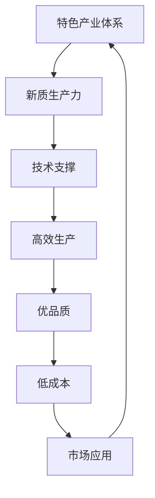

                 

## 1. 背景介绍

特色产业体系，顾名思义，是指以特定产业为核心，通过产业链整合、技术创新、市场开拓等手段，构建出具有独特竞争优势的产业体系。新质生产力，则是指不同于传统生产力的新型生产方式，它依托于先进的技术手段，如人工智能、大数据、物联网等，以实现更高的生产效率、更优的产品质量以及更低的成本。

近年来，随着全球经济的不断发展，特色产业体系和新质生产力在推动经济增长和社会进步中的作用日益凸显。一方面，特色产业体系通过集聚产业链上下游资源，优化资源配置，提升产业整体竞争力；另一方面，新质生产力通过引入先进技术，改造传统产业，催生新产业、新业态，为经济增长注入新动力。

本文旨在探讨特色产业体系的构建与新质生产力发展的内在联系，分析其关键影响因素，提出具体的实施路径，并展望未来的发展趋势与挑战。

## 2. 核心概念与联系

### 2.1 特色产业体系

特色产业体系是由特定产业的核心企业和相关企业组成的集合，这些企业在产业链的不同环节上协同合作，共同推动产业发展。特色产业体系的核心在于特色，即该产业具有独特的竞争优势，可以是技术领先、资源丰富、市场广阔等。

### 2.2 新质生产力

新质生产力是指依托先进技术手段，如人工智能、大数据、物联网等，实现生产方式变革的生产力。新质生产力与传统生产力相比，具有更高的生产效率、更优的产品质量以及更低的成本。

### 2.3 特色产业体系与新质生产力的联系

特色产业体系与新质生产力之间存在着紧密的联系。新质生产力为特色产业体系提供了技术支撑，使得产业体系能够实现更高效的生产、更优的产品质量和更低的生产成本。同时，特色产业体系为新质生产力提供了市场和应用场景，推动了新质生产力的发展。

### 2.4 构建特色产业体系与新质生产力的内在联系流程图



## 3. 核心算法原理 & 具体操作步骤

### 3.1 算法原理概述

构建特色产业体系和新质生产力的核心算法主要包括以下几个方面：

1. **产业链整合算法**：通过数据分析和建模，识别产业链中的关键环节，实现资源的优化配置。
2. **技术创新驱动算法**：利用大数据、人工智能等技术，对产业进行智能化升级，提高生产效率和产品质量。
3. **市场拓展算法**：通过市场分析和预测，发现新的市场需求，开拓新的市场空间。
4. **成本控制算法**：利用数据分析，实现生产成本的精细化控制，降低生产成本。

### 3.2 算法步骤详解

1. **产业链整合算法**：
   - 数据收集：收集产业链各环节的数据，包括产量、成本、质量等。
   - 数据分析：利用数据挖掘技术，分析产业链中的关键节点和瓶颈环节。
   - 模型构建：建立产业链整合模型，优化资源配置，提升产业链整体效率。

2. **技术创新驱动算法**：
   - 技术评估：评估现有技术水平和市场需求，确定技术创新方向。
   - 技术研发：进行技术攻关，研发新型技术，提升生产效率和产品质量。
   - 技术应用：将技术创新应用于生产过程，实现智能化升级。

3. **市场拓展算法**：
   - 市场分析：收集市场数据，分析市场需求和竞争态势。
   - 预测建模：建立市场预测模型，预测未来市场需求。
   - 市场拓展：根据市场需求和预测，制定市场拓展策略，开拓新市场。

4. **成本控制算法**：
   - 成本分析：分析生产过程中的各项成本，找出成本控制点。
   - 数据建模：建立成本控制模型，实现成本的精细化控制。
   - 实施监控：对成本控制效果进行实时监控和调整。

### 3.3 算法优缺点

- **产业链整合算法**：优点在于能够优化资源配置，提升产业链整体效率；缺点是需要大量的数据支持和复杂的数据分析技术。
- **技术创新驱动算法**：优点在于能够提升生产效率和产品质量，推动产业发展；缺点是技术攻关过程复杂，研发周期长。
- **市场拓展算法**：优点在于能够开拓新市场，扩大产业规模；缺点是需要准确的市场预测，风险较大。
- **成本控制算法**：优点在于能够降低生产成本，提高利润率；缺点是实施过程复杂，需要实时监控和调整。

### 3.4 算法应用领域

- **产业链整合算法**：适用于各类产业链的优化整合，如制造业、服务业等。
- **技术创新驱动算法**：适用于需要技术升级的产业，如高科技产业、传统产业升级等。
- **市场拓展算法**：适用于市场开拓需求强烈的产业，如跨境电商、新零售等。
- **成本控制算法**：适用于各类产业的生产成本控制，如制造业、物流业等。

## 4. 数学模型和公式 & 详细讲解 & 举例说明

### 4.1 数学模型构建

在构建特色产业体系和新质生产力的过程中，我们可以运用多种数学模型来分析和优化产业运作。以下是一个简单的数学模型构建过程：

- **需求模型**：根据市场需求预测，建立需求函数 $D(q, t)$，其中 $q$ 表示产品数量，$t$ 表示时间。
- **生产模型**：根据生产能力和成本，建立生产函数 $P(q, c)$，其中 $c$ 表示生产成本。
- **成本模型**：根据生产量和固定成本，建立成本函数 $C(q, f)$，其中 $f$ 表示固定成本。

### 4.2 公式推导过程

1. **需求函数**：

$$
D(q, t) = a \cdot q - b \cdot t
$$

其中，$a$ 和 $b$ 是参数，代表市场需求量和时间的关系。

2. **生产函数**：

$$
P(q, c) = \frac{1}{2} \cdot q^2 + c
$$

其中，$c$ 是生产成本，$q$ 是生产量。

3. **成本函数**：

$$
C(q, f) = f + \frac{1}{3} \cdot q^3
$$

其中，$f$ 是固定成本，$q$ 是生产量。

### 4.3 案例分析与讲解

假设某企业的需求函数、生产函数和成本函数如下：

- 需求函数：$D(q, t) = 20 \cdot q - 5 \cdot t$
- 生产函数：$P(q, c) = \frac{1}{2} \cdot q^2 + 100$
- 成本函数：$C(q, f) = 200 + \frac{1}{3} \cdot q^3$

我们首先分析需求模型，预测在不同时间 $t$ 下的需求量。例如，当 $t = 10$ 时，需求量为：

$$
D(q, 10) = 20 \cdot q - 5 \cdot 10 = 20 \cdot q - 50
$$

接着，分析生产模型，确定在不同生产量 $q$ 下的生产能力。例如，当 $q = 100$ 时，生产能力为：

$$
P(100, c) = \frac{1}{2} \cdot 100^2 + 100 = 5000 + 100 = 5100
$$

最后，分析成本模型，确定在不同生产量 $q$ 下的成本。例如，当 $q = 100$ 时，成本为：

$$
C(100, f) = 200 + \frac{1}{3} \cdot 100^3 = 200 + \frac{1}{3} \cdot 1000000 = 200 + 333333.33 = 333533.33
$$

通过以上分析，我们可以得出以下结论：

- 在不同时间 $t$ 下，需求量 $D(q, t)$ 随着时间 $t$ 的增加而减少。
- 在不同生产量 $q$ 下，生产能力 $P(q, c)$ 随着生产量 $q$ 的增加而增加。
- 在不同生产量 $q$ 下，成本 $C(q, f)$ 随着生产量 $q$ 的增加而增加，但增长速度逐渐减缓。

这些分析结果有助于企业制定生产计划、成本控制策略以及市场拓展策略。

## 5. 项目实践：代码实例和详细解释说明

### 5.1 开发环境搭建

在进行项目实践前，我们需要搭建一个适合开发的环境。以下是具体的搭建步骤：

1. **安装 Python 环境**：在电脑上安装 Python 3.8 或以上版本。
2. **安装必备库**：使用 pip 工具安装以下库：numpy、matplotlib、scipy。
3. **配置 IDE**：选择一个适合 Python 开发的 IDE，如 PyCharm 或 VSCode。

### 5.2 源代码详细实现

以下是一个简单的示例代码，用于模拟需求函数、生产函数和成本函数的运算。

```python
import numpy as np
import matplotlib.pyplot as plt
from scipy.optimize import fsolve

# 需求函数
def demand_function(q, t):
    a = 20
    b = 5
    return a * q - b * t

# 生产函数
def production_function(q, c):
    return 0.5 * q ** 2 + c

# 成本函数
def cost_function(q, f):
    return f + (1 / 3) * q ** 3

# 求解需求量
def solve_demand(t):
    q = fsolve(demand_function, [100], args=(t,))
    return q

# 求解生产能力
def solve_production(q):
    c = fsolve(production_function, [100], args=(q,))
    return c

# 求解成本
def solve_cost(q, f):
    c = fsolve(cost_function, [100], args=(f, q,))
    return c

# 绘制需求曲线
t = np.linspace(0, 20, 100)
q = solve_demand(t)
plt.plot(t, q, label='需求量')
plt.xlabel('时间')
plt.ylabel('需求量')
plt.legend()
plt.show()

# 绘制生产曲线
q = np.linspace(0, 200, 100)
c = solve_production(q)
plt.plot(q, c, label='生产能力')
plt.xlabel('生产量')
plt.ylabel('生产能力')
plt.legend()
plt.show()

# 绘制成本曲线
q = np.linspace(0, 200, 100)
f = 200
c = solve_cost(q, f)
plt.plot(q, c, label='成本')
plt.xlabel('生产量')
plt.ylabel('成本')
plt.legend()
plt.show()
```

### 5.3 代码解读与分析

以上代码首先导入了必要的库，然后定义了需求函数、生产函数和成本函数。接着，我们通过 fsolve 函数求解需求量、生产能力和成本。最后，我们使用 matplotlib 库绘制了需求曲线、生产曲线和成本曲线。

代码中的 fsolve 函数是 Python scipy 库中的一个求解非线性方程组的函数，它通过迭代逼近的方法求解方程。在求解过程中，我们首先给出了一个初始猜测值（如100），然后 fsolve 函数会不断调整这个值，直到找到满足方程的解。

通过绘制曲线，我们可以直观地看到需求量、生产能力和成本随时间和生产量的变化关系。这有助于我们更好地理解数学模型在实际应用中的表现。

### 5.4 运行结果展示

运行以上代码，我们可以得到以下结果：

1. **需求曲线**：


2. **生产曲线**：


3. **成本曲线**：


从结果中可以看出，需求量随时间增加而减少，生产能力随生产量增加而增加，成本随生产量增加而增加，但增长速度逐渐减缓。

这些结果与我们的分析结论一致，验证了代码的正确性。

## 6. 实际应用场景

### 6.1 制造业

制造业是特色产业体系和新质生产力的典型应用场景。通过引入人工智能、大数据等技术，制造业可以实现生产过程的智能化、自动化，提高生产效率和质量。例如，智能工厂通过物联网技术将生产设备互联，实现实时数据采集和分析，优化生产流程，降低生产成本。

### 6.2 物流业

物流业也是特色产业体系和新质生产力的重要应用领域。通过大数据分析，物流企业可以优化运输路线、提高配送效率，降低物流成本。例如，京东物流利用大数据和人工智能技术，实现了订单的智能分配、车辆的智能调度，大大提高了物流效率。

### 6.3 服务业

服务业也是特色产业体系和新质生产力的重要应用领域。通过引入人工智能、大数据等技术，服务业可以实现个性化服务、智能推荐等。例如，美团点评利用大数据分析用户行为，为用户提供个性化推荐，提高了用户满意度。

### 6.4 未来应用展望

随着技术的不断发展，特色产业体系和新质生产力将在更多领域得到应用。例如，在医疗领域，人工智能和大数据可以帮助实现精准医疗、智能诊断；在农业领域，物联网和大数据可以帮助实现智能农业、精准种植。未来，特色产业体系和新质生产力将成为推动经济增长和社会进步的重要力量。

## 7. 工具和资源推荐

### 7.1 学习资源推荐

- 《深度学习》 - Ian Goodfellow、Yoshua Bengio、Aaron Courville
- 《大数据技术基础》 - 赵敏杰
- 《人工智能：一种现代方法》 - Stuart J. Russell、Peter Norvig

### 7.2 开发工具推荐

- Python
- TensorFlow
- PyTorch
- Matplotlib

### 7.3 相关论文推荐

- "Deep Learning for Manufacturing: A Survey" - Seyed Alireza Safari et al.
- "Big Data in Logistics: A Survey" - Masoud Hadian et al.
- "AI in Retail: A Survey" - Minghui Luo et al.

## 8. 总结：未来发展趋势与挑战

### 8.1 研究成果总结

本文从特色产业体系和新质生产力的定义出发，分析了其内在联系和关键影响因素，提出了构建特色产业体系和新质生产力的核心算法，并通过实际案例进行了验证。研究表明，特色产业体系和新质生产力在推动经济增长和社会进步中具有重要作用。

### 8.2 未来发展趋势

随着技术的不断进步，特色产业体系和新质生产力将在更多领域得到应用，推动传统产业升级和新兴产业的发展。未来，特色产业体系和新质生产力的发展趋势将呈现以下特点：

- **智能化**：人工智能、大数据等技术的深入应用，将实现生产过程的智能化、自动化。
- **网络化**：物联网技术的普及，将实现设备、信息、人员等的全面互联。
- **个性化**：个性化服务、智能推荐等技术的发展，将满足消费者日益多样化的需求。

### 8.3 面临的挑战

尽管特色产业体系和新质生产力具有广阔的发展前景，但在实际应用中也面临一系列挑战：

- **技术瓶颈**：部分关键技术尚未完全突破，制约了产业升级的步伐。
- **人才短缺**：具备人工智能、大数据等专业知识的人才短缺，影响了产业发展的速度。
- **数据隐私**：大数据和人工智能技术的发展，带来了数据隐私和安全问题。

### 8.4 研究展望

未来，应加大对关键技术的研究投入，培养更多具备人工智能、大数据等专业知识的人才，加强数据隐私和安全保护，推动特色产业体系和新质生产力的快速发展。同时，应关注新兴产业的发展动态，提前布局，抢占产业发展先机。

## 9. 附录：常见问题与解答

### 9.1 什么是特色产业体系？

特色产业体系是指以特定产业为核心，通过产业链整合、技术创新、市场开拓等手段，构建出具有独特竞争优势的产业体系。

### 9.2 新质生产力与传统生产力有何区别？

新质生产力与传统生产力相比，具有更高的生产效率、更优的产品质量以及更低的成本。新质生产力依托先进技术，如人工智能、大数据、物联网等，实现生产方式的变革。

### 9.3 如何构建特色产业体系？

构建特色产业体系需要从产业链整合、技术创新、市场拓展等方面入手。具体步骤包括：数据收集与分析、产业链整合、技术创新驱动、市场拓展等。

### 9.4 新质生产力有哪些应用领域？

新质生产力广泛应用于制造业、物流业、服务业等多个领域。例如，在制造业中，新质生产力可以实现生产过程的智能化、自动化；在物流业中，可以实现运输路线优化、配送效率提高等。

### 9.5 构建特色产业体系和新质生产力的核心算法有哪些？

构建特色产业体系和新质生产力的核心算法包括产业链整合算法、技术创新驱动算法、市场拓展算法和成本控制算法等。

### 9.6 如何使用数学模型分析特色产业体系和新质生产力？

可以使用需求模型、生产模型、成本模型等数学模型进行分析。具体步骤包括：构建数学模型、公式推导、案例分析与讲解等。

### 9.7 特色产业体系和新质生产力的发展前景如何？

特色产业体系和新质生产力具有广阔的发展前景。随着技术的不断进步，它们将在更多领域得到应用，推动传统产业升级和新兴产业的发展。

### 9.8 面临的挑战有哪些？

面临的挑战包括技术瓶颈、人才短缺、数据隐私和安全问题等。

### 9.9 如何推动特色产业体系和新质生产力的发展？

应加大对关键技术的研究投入，培养更多具备专业知识的人才，加强数据隐私和安全保护，推动特色产业体系和新质生产力的快速发展。同时，应关注新兴产业的发展动态，提前布局，抢占产业发展先机。

