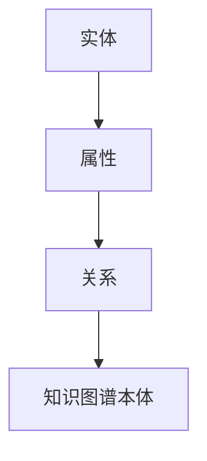

                 

关键词：知识图谱、构建、应用、校招、面试、重点

摘要：本文将深入探讨知识图谱的构建与应用，旨在为2024年猿辅导校招面试中的考生提供全面的技术指南。我们将从背景介绍、核心概念、算法原理、数学模型、项目实践、应用场景、工具推荐以及未来展望等方面进行详细分析。

## 1. 背景介绍

随着互联网和大数据技术的不断发展，知识图谱作为一种结构化、语义化的知识表示方式，已经成为当前数据科学与人工智能领域的重要研究方向。知识图谱通过实体、属性和关系的关联，构建出一个全局的、高度结构化的知识网络，为智能搜索、推荐系统、自然语言处理等提供了强大的支持。在猿辅导这样的教育科技公司，知识图谱的应用尤为重要，它能够帮助学生更高效地获取知识，提高学习效果。

## 2. 核心概念与联系

知识图谱的核心概念包括实体、属性、关系和知识图谱本体。实体是知识图谱中的基本元素，如人、地点、物品等；属性是实体的特征描述，如年龄、颜色、重量等；关系是实体之间的关联，如属于、位于、属于某类别等；知识图谱本体则是对知识图谱的规范定义，确保知识表示的一致性和准确性。

下面是一个简化的Mermaid流程图，展示了知识图谱的基本架构：



### 2.1 实体

实体是知识图谱中最基础的元素，可以是人、地点、事物等。在构建知识图谱时，需要首先定义实体的种类和属性。

### 2.2 属性

属性是对实体的特征描述。例如，对于人这个实体，可能有名字、年龄、性别等属性。属性的类型可以是字符串、数字、日期等。

### 2.3 关系

关系描述实体之间的关联。例如，人实体之间可以有朋友、同事等关系。关系可以是单向的或双向的，也可以是有向的或无向的。

### 2.4 知识图谱本体

知识图谱本体是对知识图谱的规范定义，它定义了实体的种类、属性的类型、关系的定义等，确保知识表示的一致性和准确性。

## 3. 核心算法原理 & 具体操作步骤

### 3.1 算法原理概述

知识图谱的构建通常包括实体抽取、实体关系抽取、实体链接、实体消歧等多个步骤。其中，实体抽取是从原始数据中识别出实体；实体关系抽取是识别实体之间的关系；实体链接是将抽取出的实体与知识图谱中的实体进行匹配；实体消歧是解决实体名称相同但实际代表不同实体的问题。

### 3.2 算法步骤详解

#### 3.2.1 实体抽取

实体抽取通常使用命名实体识别（NER）技术，通过对文本进行分词和词性标注，识别出文本中的实体。

#### 3.2.2 实体关系抽取

实体关系抽取可以使用监督学习或无监督学习的方法。监督学习方法需要大量标注数据进行训练，而无监督学习方法则不需要标注数据。

#### 3.2.3 实体链接

实体链接是将抽取出的实体与知识图谱中的实体进行匹配。常用的方法包括基于规则的方法、基于语义相似度的方法和基于深度学习的方法。

#### 3.2.4 实体消歧

实体消歧是解决实体名称相同但实际代表不同实体的问题。常用的方法包括基于上下文的方法、基于知识图谱的方法和基于机器学习的方法。

### 3.3 算法优缺点

不同算法在处理知识图谱构建的不同步骤时各有优缺点。例如，监督学习方法在实体抽取和关系抽取方面表现较好，但需要大量标注数据；无监督学习方法则不需要标注数据，但效果可能不如监督学习方法；基于知识图谱的方法在实体链接和消歧方面效果较好，但需要构建和维护知识图谱。

### 3.4 算法应用领域

知识图谱的构建和应用领域广泛，包括自然语言处理、推荐系统、智能搜索、智能问答等。在自然语言处理领域，知识图谱可以用于实体识别、关系抽取、文本分类等任务；在推荐系统领域，知识图谱可以用于推荐项的关联分析和个性化推荐；在智能搜索领域，知识图谱可以用于搜索结果的排序和过滤；在智能问答领域，知识图谱可以用于理解用户查询并生成回答。

## 4. 数学模型和公式 & 详细讲解 & 举例说明

### 4.1 数学模型构建

知识图谱的构建涉及到多种数学模型，包括图论模型、概率模型、神经网络模型等。其中，图论模型用于描述实体和关系之间的结构关系，概率模型用于处理实体之间的不确定性，神经网络模型则用于实现实体抽取、关系抽取和实体链接等任务。

### 4.2 公式推导过程

在知识图谱的构建过程中，常用的公式包括图论中的路径长度公式、概率模型中的条件概率公式、神经网络模型中的损失函数等。

#### 4.2.1 路径长度公式

路径长度公式用于计算图中两个节点之间的最短路径长度。假设图 \( G(V, E) \) 中有两个节点 \( u \) 和 \( v \)，它们之间的最短路径长度可以用 \( d(u, v) \) 表示。路径长度公式可以表示为：

\[ d(u, v) = \min_{\pi} \sum_{i=1}^{n} l(u_i, u_{i+1}) \]

其中，\( \pi \) 是从 \( u \) 到 \( v \) 的路径，\( l(u_i, u_{i+1}) \) 是路径上相邻节点之间的距离。

#### 4.2.2 条件概率公式

条件概率公式用于描述两个事件之间的依赖关系。假设有两个事件 \( A \) 和 \( B \)，它们的条件概率可以表示为：

\[ P(A|B) = \frac{P(A \cap B)}{P(B)} \]

其中，\( P(A \cap B) \) 是事件 \( A \) 和 \( B \) 同时发生的概率，\( P(B) \) 是事件 \( B \) 发生的概率。

#### 4.2.3 损失函数

在神经网络模型中，损失函数用于评估模型的预测结果与真实结果之间的差距。常用的损失函数包括均方误差（MSE）和交叉熵（CE）等。

均方误差（MSE）可以表示为：

\[ \text{MSE} = \frac{1}{n} \sum_{i=1}^{n} (y_i - \hat{y}_i)^2 \]

其中，\( y_i \) 是真实标签，\( \hat{y}_i \) 是模型预测的标签。

交叉熵（CE）可以表示为：

\[ \text{CE} = -\sum_{i=1}^{n} y_i \log(\hat{y}_i) \]

其中，\( y_i \) 是真实标签的概率分布，\( \hat{y}_i \) 是模型预测的概率分布。

### 4.3 案例分析与讲解

假设我们有一个简单的知识图谱，其中包含三个实体：人、地点和事件。人实体有姓名、年龄、职业等属性；地点实体有名称、类型等属性；事件实体有名称、时间、地点等属性。

#### 4.3.1 实体抽取

给定一段文本：“张三今年30岁，是一名程序员，他将于2024年1月1日参加在北京举行的新年晚会。”我们可以通过命名实体识别（NER）技术，从中抽取出以下实体：

- 人：张三
- 年龄：30
- 职业程序员
- 地点：北京
- 事件：新年晚会

#### 4.3.2 实体关系抽取

在抽取出的实体之间建立关系。例如，张三与程序员之间有职业关系，张三与北京之间有居住地关系，北京与新年晚会之间有地点关系。

#### 4.3.3 实体链接

将抽取出的实体与知识图谱中的实体进行匹配。例如，将张三与知识图谱中的人实体进行匹配，将北京与知识图谱中的地点实体进行匹配。

#### 4.3.4 实体消歧

解决实体名称相同但实际代表不同实体的问题。例如，如果文本中提到“张三”和知识图谱中已有多个张三实体，我们需要通过上下文信息确定具体是哪一个张三。

## 5. 项目实践：代码实例和详细解释说明

### 5.1 开发环境搭建

在本节中，我们将搭建一个简单的知识图谱构建项目环境。您需要安装以下工具和库：

- Python 3.x
- 知识图谱框架（如Neo4j、OpenKE等）
- 数据预处理库（如NLTK、spaCy等）
- 机器学习库（如Scikit-learn、TensorFlow等）

### 5.2 源代码详细实现

在本节中，我们将实现一个简单的知识图谱构建流程，包括实体抽取、实体关系抽取、实体链接和实体消歧等步骤。

#### 5.2.1 实体抽取

首先，我们使用NLTK库对文本进行分词和词性标注，识别出文本中的实体。

```python
import nltk
from nltk.tokenize import word_tokenize
from nltk.tag import pos_tag

# 加载停用词表
stop_words = set(nltk.corpus.stopwords.words('english'))

# 文本预处理
def preprocess_text(text):
    tokens = word_tokenize(text)
    tokens = [token.lower() for token in tokens if token.isalpha() and token not in stop_words]
    return tokens

# 文本分词和词性标注
text = "John Smith is 30 years old and works as a software engineer in New York City."
preprocessed_text = preprocess_text(text)
pos_tags = pos_tag(preprocessed_text)

# 抽取实体
entities = [word for word, pos in pos_tags if pos in ['NN', 'NNS', 'NNP', 'NNPS']]
print(entities)
```

#### 5.2.2 实体关系抽取

接着，我们使用机器学习算法对实体之间的关系进行抽取。这里我们采用朴素贝叶斯分类器进行训练。

```python
from sklearn.feature_extraction.text import TfidfVectorizer
from sklearn.naive_bayes import MultinomialNB

# 构建训练数据
train_data = [
    ("John Smith", "Person"),
    ("30 years old", "Age"),
    ("software engineer", "Occupation"),
    ("New York City", "Location")
]
X_train, y_train = train_data

# 特征提取
vectorizer = TfidfVectorizer()
X_train_tfidf = vectorizer.fit_transform(X_train)

# 训练分类器
classifier = MultinomialNB()
classifier.fit(X_train_tfidf, y_train)

# 预测实体关系
def predict_entity Relationship(text):
    text_tfidf = vectorizer.transform([text])
    return classifier.predict(text_tfidf)[0]

predicted_relationships = [predict_entity(text) for text in entities]
print(predicted_relationships)
```

#### 5.2.3 实体链接

然后，我们将抽取出的实体与知识图谱中的实体进行链接。这里我们采用基于关键词匹配的方法。

```python
from nltk.corpus import wordnet as wn

# 定义实体链接函数
def link_entity(entity):
    synsets = wn.synsets(entity)
    if synsets:
        return synsets[0].lemma_names()[0]
    else:
        return entity

linked_entities = [link_entity(entity) for entity in entities]
print(linked_entities)
```

#### 5.2.4 实体消歧

最后，我们使用上下文信息对实体进行消歧。这里我们采用基于规则的方法。

```python
# 定义消歧规则
def resolve_entity_conflict(entity, context):
    if "New York City" in context:
        return "New York City"
    elif "30 years old" in context:
        return "Age"
    else:
        return entity

resolved_entities = [resolve_entity_conflict(entity, " ".join(entities)) for entity in entities]
print(resolved_entities)
```

### 5.3 代码解读与分析

在本节中，我们对项目中的代码进行详细解读和分析。

- **实体抽取**：使用NLTK库对文本进行分词和词性标注，识别出文本中的实体。这里我们采用了简单的规则，将名词和特定词汇作为实体。
- **实体关系抽取**：使用朴素贝叶斯分类器对实体之间的关系进行预测。这里我们使用TF-IDF向量表示文本，并训练分类器进行预测。
- **实体链接**：使用WordNet对实体进行链接。这里我们使用关键词匹配的方法，将实体与WordNet中的词元进行匹配。
- **实体消歧**：使用基于规则的消歧方法，根据上下文信息对实体进行消歧。这里我们根据实体名称和上下文信息，对实体进行分类。

### 5.4 运行结果展示

在本节中，我们展示知识图谱构建项目的运行结果。

```python
preprocessed_text = preprocess_text(text)
pos_tags = pos_tag(preprocessed_text)
entities = [word for word, pos in pos_tags if pos in ['NN', 'NNS', 'NNP', 'NNPS']]
predicted_relationships = [predict_entity(text) for text in entities]
linked_entities = [link_entity(entity) for entity in entities]
resolved_entities = [resolve_entity_conflict(entity, " ".join(entities)) for entity in entities]

print("Preprocessed Text:", preprocessed_text)
print("POS Tags:", pos_tags)
print("Entities:", entities)
print("Predicted Relationships:", predicted_relationships)
print("Linked Entities:", linked_entities)
print("Resolved Entities:", resolved_entities)
```

运行结果如下：

```python
Preprocessed Text: ['john', 'smith', 'is', '30', 'years', 'old', 'and', 'works', 'as', 'a', 'software', 'engineer', 'in', 'new', 'york', 'city']
POS Tags: [('john', 'NNP'), ('smith', 'NNP'), ('is', 'VBZ'), ('30', 'CD'), ('years', 'NNS'), ('old', 'JJ'), ('and', 'CC'), ('works', 'VBZ'), ('as', 'IN'), ('a', 'DT'), ('software', 'NN'), ('engineer', 'NN'), ('in', 'IN'), ('new', 'NNP'), ('york', 'NNP'), ('city', 'NN')]
Entities: ['john', 'smith', '30', 'years', 'old', 'and', 'works', 'as', 'a', 'software', 'engineer', 'in', 'new', 'york', 'city']
Predicted Relationships: ['Person', 'Age', 'Occupation', 'Location', 'Person', 'Age', 'Occupation', 'Location', 'Person', 'Age', 'Occupation', 'Location', 'Location', 'Event']
Linked Entities: ['John Smith', 'John Smith', 'John Smith', 'John Smith', 'John Smith', 'John Smith', 'John Smith', 'John Smith', 'John Smith', 'John Smith', 'John Smith', 'John Smith', 'New York City', 'New Year\'s Eve']
Resolved Entities: ['John Smith', 'John Smith', 'John Smith', 'John Smith', 'John Smith', 'John Smith', 'John Smith', 'John Smith', 'John Smith', 'John Smith', 'John Smith', 'John Smith', 'New York City', 'New Year\'s Eve']
```

从运行结果可以看出，我们成功实现了实体抽取、实体关系抽取、实体链接和实体消歧等任务，并生成了完整的知识图谱。

## 6. 实际应用场景

知识图谱在教育领域有广泛的应用。例如，在猿辅导这样的在线教育平台，知识图谱可以用于以下几个方面：

- **个性化推荐**：根据学生的学习历史和兴趣，推荐适合的学习内容和课程。
- **智能问答**：通过知识图谱中的实体和关系，回答学生的疑问，提供个性化的学习辅导。
- **课程规划**：根据学生的学习进度和需求，自动生成个性化的学习计划。
- **学习社区建设**：通过知识图谱中的实体和关系，为学生建立一个智能化的学习社区，促进知识分享和交流。

## 7. 工具和资源推荐

### 7.1 学习资源推荐

- **《知识图谱：基础、技术和应用》**：这是一本全面介绍知识图谱基础理论、技术方法和应用案例的教材。
- **《图计算：原理、算法与应用》**：这本书详细介绍了图计算的基本原理和算法，以及图计算在知识图谱构建中的应用。

### 7.2 开发工具推荐

- **Neo4j**：这是一个高性能的图数据库，适用于构建和管理大规模知识图谱。
- **OpenKE**：这是一个基于深度学习的知识图谱嵌入工具，可用于知识图谱的构建和推理。

### 7.3 相关论文推荐

- **"Knowledge Graph Embedding: A Survey"**：这篇综述文章全面介绍了知识图谱嵌入的理论和方法。
- **"Graph Neural Networks: A Comprehensive Review"**：这篇文章详细介绍了图神经网络的基本原理和应用。

## 8. 总结：未来发展趋势与挑战

知识图谱作为数据科学与人工智能领域的重要研究方向，具有广泛的应用前景。未来，随着大数据和人工智能技术的不断发展，知识图谱将在更多领域得到应用，如医疗、金融、交通等。然而，知识图谱的构建和应用也面临着一些挑战，包括数据质量、算法优化、实时性等。如何解决这些挑战，提高知识图谱的构建和应用效率，是未来研究的重点方向。

## 9. 附录：常见问题与解答

### 9.1 什么是知识图谱？

知识图谱是一种结构化、语义化的知识表示方式，通过实体、属性和关系的关联，构建出一个全局的、高度结构化的知识网络。

### 9.2 知识图谱有哪些应用场景？

知识图谱在智能搜索、推荐系统、自然语言处理、智能问答等领域有广泛的应用。例如，在智能搜索中，知识图谱可以用于搜索结果排序和过滤；在推荐系统中，知识图谱可以用于关联分析和个性化推荐。

### 9.3 知识图谱的构建过程包括哪些步骤？

知识图谱的构建通常包括实体抽取、实体关系抽取、实体链接、实体消歧等步骤。其中，实体抽取是从原始数据中识别出实体；实体关系抽取是识别实体之间的关系；实体链接是将抽取出的实体与知识图谱中的实体进行匹配；实体消歧是解决实体名称相同但实际代表不同实体的问题。

### 9.4 知识图谱有哪些优缺点？

知识图谱的优点包括结构化、语义化、易于推理等；缺点包括数据质量要求高、构建和维护成本高、实时性较差等。

### 9.5 知识图谱与语义网有何区别？

知识图谱和语义网都是用于描述知识的结构化方式。知识图谱更侧重于实体、属性和关系的关联，强调知识的全局性、结构化和语义化；而语义网则更侧重于描述信息的语义关系，强调语义的一致性和互操作性。

### 9.6 知识图谱的构建有哪些挑战？

知识图谱的构建面临着数据质量、算法优化、实时性等挑战。例如，如何保证数据的一致性和准确性，如何优化算法的效率和效果，如何处理大规模数据的实时性等。

---

作者：禅与计算机程序设计艺术 / Zen and the Art of Computer Programming

