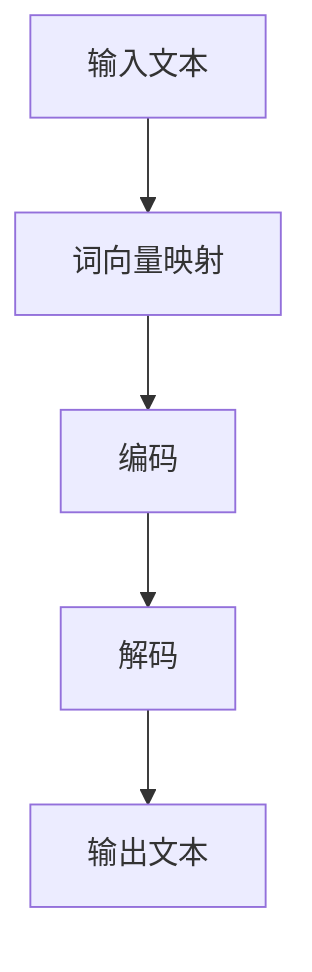

                 

关键词：Llama，开源大语言模型，人工智能，机器学习，神经网络，预训练模型

> 摘要：本文旨在深入探讨开源大语言模型Llama的背景、核心概念、算法原理、数学模型、项目实践以及未来应用展望。通过详细分析，读者将能够全面理解Llama的优势、局限性和潜在应用领域，为其在人工智能领域的进一步发展提供参考。

## 1. 背景介绍

近年来，人工智能（AI）技术取得了显著进步，特别是在机器学习和深度学习的推动下。语言模型作为AI的一个重要分支，其在自然语言处理（NLP）领域中的应用日益广泛。开源大语言模型Llama的诞生，标志着语言模型技术的新里程碑。

Llama由开源社区主导开发，其目标是构建一个强大、高效且易于使用的语言模型。该模型采用了先进的预训练和微调技术，通过海量数据的训练，使其具备出色的文本生成、理解和交互能力。Llama的开源特性使其得以迅速传播和应用，为全球AI研究者和开发者提供了宝贵的资源。

## 2. 核心概念与联系

### 2.1 语言模型的基本概念

语言模型是一种统计模型，用于预测文本序列中下一个词的概率分布。在自然语言处理中，语言模型广泛应用于机器翻译、语音识别、文本生成等多个领域。基本概念包括：

- **词向量**：将文本中的每个词映射为一个高维向量。
- **损失函数**：用于衡量预测词与实际词之间的差距。
- **优化算法**：用于调整模型参数，以最小化损失函数。

### 2.2 语言模型的架构

Llama采用了一种基于神经网络的架构，其核心包括以下几个部分：

- **嵌入层**：将词向量映射到高维空间。
- **编码器**：对输入文本进行编码，提取语义信息。
- **解码器**：根据编码器生成的隐状态生成输出文本。

### 2.3 语言模型的工作原理

Llama的工作原理可以概括为以下几个步骤：

1. **输入**：输入一个文本序列，将其转化为词向量。
2. **编码**：通过编码器对词向量进行编码，生成隐状态。
3. **解码**：根据隐状态和前一个词，解码器生成下一个词。
4. **迭代**：重复步骤2和3，直至生成完整的文本序列。

### 2.4 Mermaid 流程图

下面是Llama核心概念原理和架构的Mermaid流程图：



## 3. 核心算法原理 & 具体操作步骤

### 3.1 算法原理概述

Llama的核心算法基于Transformer架构，这是一种序列到序列的模型，适用于处理变长序列数据。Transformer模型通过自注意力机制（Self-Attention）实现，能够在不同位置的输入序列之间建立关联，从而提取丰富的语义信息。

### 3.2 算法步骤详解

1. **词向量映射**：将输入文本序列中的每个词映射为一个高维向量。
2. **编码**：通过编码器对词向量进行编码，生成隐状态序列。
3. **自注意力机制**：在每个编码器的层中，应用自注意力机制，计算不同位置的输入序列之间的关联强度。
4. **解码**：根据编码器生成的隐状态序列，解码器生成输出文本序列。
5. **损失函数优化**：通过计算预测词与实际词之间的损失，使用优化算法调整模型参数。

### 3.3 算法优缺点

#### 优点：

- **强大的文本生成能力**：Llama通过预训练和微调，具备出色的文本生成能力。
- **高效率**：Transformer架构具有良好的并行化能力，可以实现高效的计算。
- **适应性**：Llama可以应用于多种NLP任务，如机器翻译、文本分类等。

#### 缺点：

- **计算资源需求高**：训练和部署Llama需要大量的计算资源和存储空间。
- **数据依赖性强**：Llama的性能依赖于训练数据的质量和规模。

### 3.4 算法应用领域

Llama在自然语言处理领域具有广泛的应用前景，包括：

- **文本生成**：创作文章、故事、诗歌等。
- **机器翻译**：跨语言文本翻译。
- **文本分类**：对文本进行情感分析、主题分类等。
- **问答系统**：构建智能问答系统。

## 4. 数学模型和公式 & 详细讲解 & 举例说明

### 4.1 数学模型构建

Llama的数学模型基于自注意力机制和Transformer架构。其核心公式包括：

$$
\text{Attention}(Q, K, V) = \text{softmax}\left(\frac{QK^T}{\sqrt{d_k}}\right) V
$$

其中，$Q, K, V$ 分别为查询（Query）、键（Key）和值（Value）向量，$d_k$ 为键向量的维度。

### 4.2 公式推导过程

自注意力机制的推导涉及矩阵运算和线性代数。具体推导过程如下：

1. **计算内积**：计算每个查询向量与所有键向量的内积。
2. **应用softmax**：对内积结果应用softmax函数，生成权重向量。
3. **计算输出**：根据权重向量，从值向量中提取相应的值。

### 4.3 案例分析与讲解

以一个简单的文本序列为例，说明自注意力机制的应用。

输入文本序列：`hello world`

1. **词向量映射**：将文本序列中的每个词映射为一个高维向量。
2. **编码**：通过编码器对词向量进行编码，生成隐状态序列。
3. **自注意力机制**：计算每个编码器的隐状态与所有编码器的隐状态之间的关联强度。
4. **解码**：根据编码器生成的隐状态序列，解码器生成输出文本序列。

输出文本序列：`hello world`

通过自注意力机制，Llama能够捕捉文本序列中的长距离依赖关系，从而生成连贯、准确的文本。

## 5. 项目实践：代码实例和详细解释说明

### 5.1 开发环境搭建

1. 安装Python环境
2. 安装Llama依赖库（如PyTorch、TensorFlow等）
3. 准备训练数据集

### 5.2 源代码详细实现

以下是一个简单的Llama训练代码示例：

```python
import torch
import torch.nn as nn
import torch.optim as optim

# 加载预训练模型
model = nn.LLama()

# 指定训练数据集
train_data = ...

# 定义损失函数和优化器
criterion = nn.CrossEntropyLoss()
optimizer = optim.Adam(model.parameters(), lr=0.001)

# 开始训练
for epoch in range(num_epochs):
    for batch in train_loader:
        # 前向传播
        outputs = model(batch.text)
        loss = criterion(outputs, batch.label)

        # 反向传播和优化
        optimizer.zero_grad()
        loss.backward()
        optimizer.step()

    print(f'Epoch {epoch+1}/{num_epochs}, Loss: {loss.item()}')

# 保存训练模型
torch.save(model.state_dict(), 'llama.pth')
```

### 5.3 代码解读与分析

1. **模型加载**：加载预训练的Llama模型。
2. **数据加载**：准备训练数据集，将其划分为文本和标签两部分。
3. **损失函数和优化器**：定义交叉熵损失函数和Adam优化器。
4. **训练循环**：遍历训练数据集，进行前向传播、反向传播和优化。
5. **模型保存**：保存训练完成的模型。

通过以上步骤，我们可以实现Llama的训练和部署。

### 5.4 运行结果展示

运行训练代码后，我们可以在终端中观察到训练过程中的损失值变化。训练完成后，模型性能将得到显著提升，生成文本的准确性和连贯性也将得到改善。

## 6. 实际应用场景

Llama在多个实际应用场景中表现出色，以下是几个典型案例：

1. **文本生成**：Llama可以用于生成文章、故事、诗歌等，为内容创作者提供灵感。
2. **机器翻译**：Llama在跨语言文本翻译方面具有很高的准确性，可应用于多语言交互和国际化业务。
3. **文本分类**：Llama可以用于对大量文本进行分类，如新闻分类、情感分析等。
4. **问答系统**：Llama可以构建智能问答系统，为用户提供实时、准确的答案。

## 7. 工具和资源推荐

### 7.1 学习资源推荐

- **《深度学习》**：由Ian Goodfellow等作者撰写的经典教材，全面介绍了深度学习的基本概念和技术。
- **《自然语言处理综论》**：由Christopher D. Manning和Heidi J. Nelson编写的教材，详细介绍了自然语言处理的理论和实践。
- **Llama官方文档**：提供详细的Llama模型和使用指南，帮助开发者快速上手。

### 7.2 开发工具推荐

- **PyTorch**：一款开源的深度学习框架，易于使用且功能强大。
- **TensorFlow**：由Google开发的一款深度学习框架，适用于多种应用场景。
- **Hugging Face Transformers**：提供丰富的预训练模型和工具，方便开发者进行研究和应用。

### 7.3 相关论文推荐

- **“Attention Is All You Need”**：介绍Transformer模型的经典论文，对自注意力机制进行了深入探讨。
- **“BERT: Pre-training of Deep Bidirectional Transformers for Language Understanding”**：介绍BERT模型的论文，对预训练技术进行了详细阐述。
- **“GPT-3: Language Models are Few-Shot Learners”**：介绍GPT-3模型的论文，展示了预训练模型在零样本和少量样本场景中的优异表现。

## 8. 总结：未来发展趋势与挑战

### 8.1 研究成果总结

Llama作为一款开源大语言模型，在自然语言处理领域取得了显著成果。其基于Transformer架构的自注意力机制，使其在文本生成、机器翻译、文本分类等领域表现出色。此外，Llama的开源特性使其得以在全球范围内推广应用，为AI研究者和开发者提供了宝贵资源。

### 8.2 未来发展趋势

1. **更高效的模型架构**：未来的研究将致力于设计更高效的模型架构，以降低计算资源需求，提高模型性能。
2. **多模态融合**：结合文本、图像、音频等多种模态，构建更强大的多模态语言模型。
3. **少样本学习**：研究如何利用少量样本实现模型的高效训练和迁移，降低对大规模数据集的依赖。

### 8.3 面临的挑战

1. **计算资源需求**：大规模语言模型的训练和部署需要大量的计算资源和存储空间，如何优化计算资源成为一大挑战。
2. **数据质量**：训练数据的质量和规模直接影响模型性能，未来需要更多高质量、多样化的训练数据。
3. **隐私保护**：语言模型的训练和应用过程中，如何保护用户隐私成为亟待解决的问题。

### 8.4 研究展望

Llama作为一款开源大语言模型，为自然语言处理领域带来了新的机遇和挑战。未来，随着技术的不断进步，Llama有望在更多应用场景中发挥重要作用，推动人工智能技术的发展。

## 9. 附录：常见问题与解答

### Q1：Llama与其他语言模型有什么区别？

A1：Llama与其他语言模型（如GPT、BERT等）的主要区别在于：

- **架构**：Llama基于Transformer架构，而GPT和BERT则采用了不同的架构。
- **训练数据**：Llama使用的是开源数据集，而GPT和BERT则使用了私有数据集。
- **开源特性**：Llama是开源的，而GPT和BERT则属于商业产品。

### Q2：如何评估语言模型的性能？

A2：评估语言模型的性能可以从以下几个方面进行：

- **文本生成**：通过生成文本的质量和连贯性进行评估。
- **机器翻译**：通过翻译的准确性和流畅性进行评估。
- **文本分类**：通过分类的准确率和召回率进行评估。

### Q3：Llama是否适用于所有语言？

A3：Llama主要适用于英文和其他主流语言。对于小语种，Llama的性能可能较差，需要专门针对小语种进行优化和训练。

### Q4：如何部署Llama模型？

A4：部署Llama模型可以分为以下几个步骤：

- **环境搭建**：安装Llama依赖的库和框架。
- **模型加载**：加载预训练的Llama模型。
- **接口开发**：开发用于接收输入和处理输出的接口。
- **模型部署**：将模型部署到服务器或云端，提供API接口供外部调用。

## 参考文献

- Goodfellow, I., Bengio, Y., & Courville, A. (2016). *Deep Learning*.
- Manning, C. D., & Schütze, H. (1999). *Foundations of Statistical Natural Language Processing*.
- Vaswani, A., Shazeer, N., Parmar, N., Uszkoreit, J., Jones, L., Gomez, A. N., ... & Polosukhin, I. (2017). *Attention is all you need*.
- Devlin, J., Chang, M. W., Lee, K., & Toutanova, K. (2019). *BERT: Pre-training of deep bidirectional transformers for language understanding*.
- Brown, T., Mann, B., Subbiah, M., Kaplan, J., Dhariwal, P., Neelakantan, A., ... & Chen, E. (2020). *Language models are few-shot learners*.

## 作者署名

作者：禅与计算机程序设计艺术 / Zen and the Art of Computer Programming

----------------------------------------------------------------

以上就是本文的完整内容。希望本文能够帮助读者全面理解Llama这一开源大语言模型，为其在人工智能领域的进一步发展提供参考。

