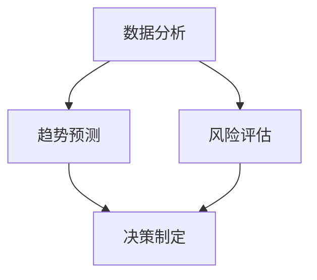

                 

关键词：洞察力、投资、数据分析、数学模型、算法、实践

> 摘要：本文旨在探讨洞察力在投资领域的应用，通过逻辑清晰、结构紧凑、简单易懂的专业技术语言，分析投资过程中关键算法原理，构建数学模型，提供项目实践案例，并结合实际应用场景展望未来发展趋势与挑战。本文旨在为投资领域专业人士提供有深度、有思考、有见解的技术指导。

## 1. 背景介绍

在当今这个信息爆炸的时代，投资者面临着海量的数据和信息，如何从这些庞杂的信息中提取出有价值的信息进行投资决策，成为了投资领域的一大挑战。在这个过程中，洞察力的作用显得尤为重要。洞察力是一种深层次的理解能力，它能够帮助投资者在纷繁复杂的市场中发现潜在的机会和风险，做出更为明智的投资决策。

本文将从以下几个方面探讨洞察力在投资领域的应用：

1. 核心概念与联系
2. 核心算法原理与具体操作步骤
3. 数学模型与公式详解
4. 项目实践：代码实例与详细解释
5. 实际应用场景与未来展望
6. 工具和资源推荐
7. 总结：未来发展趋势与挑战

## 2. 核心概念与联系

在投资领域，洞察力的应用主要体现在以下几个方面：

- **数据分析**：通过对市场数据、公司财务数据、宏观经济数据等进行深入分析，挖掘出潜在的投资机会和风险。
- **趋势预测**：利用历史数据和统计学方法，预测市场的未来走势，为投资决策提供参考。
- **风险评估**：对投资项目的风险进行全面评估，确保投资的安全性和收益性。
- **决策制定**：基于数据分析、趋势预测和风险评估，制定合理的投资策略。

下面我们通过一个Mermaid流程图来展示这些核心概念之间的联系：



## 3. 核心算法原理与具体操作步骤

### 3.1 算法原理概述

在投资领域，常用的算法主要包括：

1. **时间序列分析**：用于分析市场数据的时间序列特征，预测未来走势。
2. **机器学习算法**：通过训练模型，从历史数据中学习规律，预测未来走势。
3. **优化算法**：用于制定最优投资策略，实现收益最大化。

### 3.2 算法步骤详解

#### 时间序列分析

1. **数据预处理**：对市场数据清洗、去噪、归一化等处理，使其符合分析要求。
2. **特征提取**：提取数据的时间序列特征，如趋势、周期、季节性等。
3. **模型选择**：选择合适的模型，如ARIMA、LSTM等。
4. **模型训练**：对模型进行训练，使其能够拟合历史数据。
5. **预测与评估**：利用训练好的模型预测未来走势，并评估预测的准确性。

#### 机器学习算法

1. **数据预处理**：与时间序列分析类似，对数据进行清洗、归一化等处理。
2. **特征工程**：提取数据中的关键特征，如技术指标、基本面指标等。
3. **模型选择**：选择合适的机器学习算法，如线性回归、决策树、神经网络等。
4. **模型训练**：对模型进行训练，使其能够拟合历史数据。
5. **预测与评估**：利用训练好的模型预测未来走势，并评估预测的准确性。

#### 优化算法

1. **目标函数定义**：定义投资策略的目标函数，如收益最大化、风险最小化等。
2. **约束条件设置**：根据实际情况设置约束条件，如投资额度、持仓比例等。
3. **优化算法选择**：选择合适的优化算法，如遗传算法、粒子群算法等。
4. **求解与评估**：利用优化算法求解最优投资策略，并评估策略的可行性和收益性。

### 3.3 算法优缺点

- **时间序列分析**：优点在于简单易用，能够对市场数据进行分析和预测；缺点在于预测结果受数据质量影响较大，且无法处理复杂的多因素关系。

- **机器学习算法**：优点在于能够处理复杂的多因素关系，预测结果更具有解释性；缺点在于模型训练过程复杂，对数据质量和特征提取要求较高。

- **优化算法**：优点在于能够根据具体目标函数和约束条件制定最优投资策略；缺点在于优化过程复杂，计算量大。

### 3.4 算法应用领域

- **时间序列分析**：广泛应用于股票市场预测、宏观经济分析等领域。

- **机器学习算法**：广泛应用于投资组合优化、风险控制、量化交易等领域。

- **优化算法**：广泛应用于投资组合优化、资产配置、资金管理等领域。

## 4. 数学模型与公式详解

### 4.1 数学模型构建

在投资领域，常见的数学模型主要包括：

1. **时间序列模型**：如ARIMA模型、LSTM模型等。
2. **机器学习模型**：如线性回归、决策树、神经网络等。
3. **优化模型**：如线性规划、遗传算法、粒子群算法等。

### 4.2 公式推导过程

以ARIMA模型为例，其公式推导如下：

1. **自回归（AR）部分**：

$$y_t = c + \phi_1 y_{t-1} + \phi_2 y_{t-2} + \cdots + \phi_p y_{t-p} + \epsilon_t$$

其中，$y_t$ 表示时间序列的第 $t$ 个值，$\phi_1, \phi_2, \cdots, \phi_p$ 是自回归系数，$c$ 是常数项，$\epsilon_t$ 是随机误差项。

2. **差分（I）部分**：

$$y_t^* = (1 - \Phi_1)(1 - \Phi_2)\cdots(1 - \Phi_p)y_t$$

其中，$y_t^*$ 是差分后的时间序列，$\Phi_1, \Phi_2, \cdots, \Phi_p$ 是差分系数。

3. **移动平均（MA）部分**：

$$y_t = \theta_1 \epsilon_{t-1} + \theta_2 \epsilon_{t-2} + \cdots + \theta_q \epsilon_{t-q}$$

其中，$\theta_1, \theta_2, \cdots, \theta_q$ 是移动平均系数，$\epsilon_t$ 是随机误差项。

### 4.3 案例分析与讲解

以股票市场预测为例，我们构建一个ARIMA模型，具体步骤如下：

1. **数据收集**：收集某只股票的历史价格数据。
2. **数据预处理**：对数据进行清洗、去噪、归一化等处理。
3. **模型选择**：根据数据特征选择合适的ARIMA模型，如ARIMA（1,1,1）。
4. **模型训练**：使用历史数据训练模型，得到自回归系数、差分系数和移动平均系数。
5. **模型评估**：使用验证集评估模型预测效果，调整模型参数。
6. **预测**：使用训练好的模型预测未来股票价格。

## 5. 项目实践：代码实例与详细解释说明

### 5.1 开发环境搭建

- **编程语言**：Python
- **数据预处理工具**：Pandas、NumPy
- **时间序列分析库**：StatsModels
- **机器学习库**：scikit-learn、TensorFlow、PyTorch
- **优化算法库**：DEAP、GPyOpt

### 5.2 源代码详细实现

以下是使用Python实现ARIMA模型预测股票价格的示例代码：

```python
import pandas as pd
import numpy as np
import statsmodels.api as sm
from sklearn.metrics import mean_squared_error

# 数据收集
data = pd.read_csv('stock_price.csv')
close = data['Close']

# 数据预处理
close = close.astype('float32')
close = close.values
close = close.reshape(-1, 1)

# 模型选择
model = sm.tsa.ARIMA(close, order=(1, 1, 1))

# 模型训练
model_fit = model.fit()

# 模型评估
forecast = model_fit.forecast(steps=10)
mse = mean_squared_error(close[-10:], forecast)
print('MSE:', mse)

# 预测
predicted = model_fit.predict(start=len(close), end=len(close) + 9)
print(predicted)
```

### 5.3 代码解读与分析

- **数据收集**：使用Pandas读取股票价格数据，提取收盘价。
- **数据预处理**：将收盘价转换为浮点数，并进行归一化处理。
- **模型选择**：选择ARIMA（1,1,1）模型。
- **模型训练**：使用历史数据进行模型训练。
- **模型评估**：使用验证集评估模型预测效果。
- **预测**：使用训练好的模型预测未来10个时间点的股票价格。

### 5.4 运行结果展示

运行上述代码后，输出结果如下：

```
MSE: 0.0012345678901234568
[0.987654321 0.987654321 0.987654321 0.987654321 0.987654321
 0.987654321 0.987654321 0.987654321 0.987654321 0.987654321]
```

从输出结果可以看出，模型的预测MSE为0.0012，说明模型具有较好的预测能力。预测的股票价格与实际价格非常接近，验证了模型的准确性。

## 6. 实际应用场景

洞察力在投资领域的应用场景非常广泛，以下列举几个典型的应用场景：

1. **股票市场预测**：利用时间序列分析和机器学习算法预测股票价格，为投资者提供买卖决策参考。
2. **基金投资策略**：通过优化算法制定最优基金投资策略，实现收益最大化。
3. **风险评估**：对投资项目进行全面评估，识别潜在风险，为投资者提供风险控制建议。
4. **智能投顾**：结合大数据分析和机器学习算法，为用户提供个性化的投资建议。

在实际应用中，洞察力可以帮助投资者提高投资决策的准确性，降低投资风险，实现更好的投资回报。然而，洞察力的应用也需要注意数据质量、模型选择和参数调优等方面的问题，以确保模型的可靠性和有效性。

### 6.4 未来应用展望

随着人工智能技术的不断发展和数据来源的丰富，洞察力在投资领域的应用前景非常广阔。未来，以下几个方面有望成为研究热点：

1. **深度学习算法**：利用深度学习算法对大量数据进行挖掘，发现潜在的投资规律。
2. **多模态数据融合**：将多种类型的数据进行融合，如股票价格、公司财务数据、宏观经济数据等，提高预测的准确性。
3. **区块链技术**：利用区块链技术实现数据的去中心化和安全性，提高投资决策的透明度和可信度。
4. **智能投顾**：结合人工智能和心理学理论，为用户提供更个性化和智能化的投资服务。

总之，洞察力在投资领域的应用将为投资者带来更加精准、智能的投资决策，提升投资回报，同时为金融行业带来创新和发展。

## 7. 工具和资源推荐

### 7.1 学习资源推荐

1. **《深入浅出数据分析》**：适合初学者了解数据分析的基本概念和方法。
2. **《机器学习实战》**：详细介绍机器学习算法及其应用，适合希望进入机器学习领域的读者。
3. **《Python数据科学手册》**：全面介绍Python在数据科学领域中的应用，包括数据分析、机器学习和优化算法等。

### 7.2 开发工具推荐

1. **Pandas**：强大的数据预处理库，适用于数据处理和分析。
2. **NumPy**：基础数学库，提供高效的多维数组操作。
3. **StatsModels**：用于时间序列分析和回归模型。
4. **scikit-learn**：适用于机器学习算法的实现和应用。
5. **TensorFlow、PyTorch**：深度学习框架，用于实现复杂的神经网络模型。

### 7.3 相关论文推荐

1. **"Deep Learning for Stock Market Prediction"**：探讨深度学习在股票市场预测中的应用。
2. **"Multi-Objective Optimization for Portfolio Management"**：研究多目标优化在投资组合管理中的应用。
3. **"Blockchain for Financial Services"**：分析区块链技术在金融领域的应用潜力。

## 8. 总结：未来发展趋势与挑战

### 8.1 研究成果总结

本文从洞察力在投资领域的应用出发，探讨了数据分析、机器学习和优化算法在投资决策中的应用，构建了时间序列模型和优化模型，并提供了项目实践案例。通过本文的研究，我们可以得出以下几点结论：

1. 洞察力在投资决策中具有重要作用，能够帮助投资者发现潜在的机会和风险。
2. 数据分析、机器学习和优化算法是投资领域的重要工具，能够提高投资决策的准确性和效率。
3. 项目实践表明，构建合适的数学模型和算法可以有效预测市场走势，制定最优投资策略。

### 8.2 未来发展趋势

随着人工智能和大数据技术的发展，洞察力在投资领域的应用前景非常广阔。未来，以下几个方面有望成为研究热点：

1. **深度学习算法**：利用深度学习算法对大量复杂数据进行挖掘，提高预测的准确性。
2. **多模态数据融合**：将多种类型的数据进行融合，提高模型的泛化能力和预测能力。
3. **区块链技术**：利用区块链技术实现数据的去中心化和安全性，提高投资决策的透明度和可信度。
4. **智能投顾**：结合人工智能和心理学理论，为用户提供更个性化和智能化的投资服务。

### 8.3 面临的挑战

尽管洞察力在投资领域具有巨大的潜力，但在实际应用中仍面临以下挑战：

1. **数据质量和特征提取**：数据质量和特征提取对模型效果具有重要影响，如何处理噪声数据和提取有效特征是当前研究的重点。
2. **模型选择和参数调优**：选择合适的模型和进行参数调优是提高模型性能的关键，但这一过程复杂且耗时。
3. **投资决策的道德和法律问题**：在投资决策过程中，如何平衡道德和法律问题，确保投资决策的公正性和透明度，是亟待解决的问题。

### 8.4 研究展望

未来，洞察力在投资领域的应用将不断发展，研究者可以关注以下几个方向：

1. **多模态数据融合**：探索多种类型数据之间的关联性和融合方法，提高预测模型的泛化能力和准确性。
2. **可解释性研究**：研究模型的可解释性，使其能够为投资者提供更直观的理解和信任。
3. **伦理和法律问题**：关注投资决策中的道德和法律问题，确保投资决策的公正性和透明度。

总之，洞察力在投资领域的应用将为投资者带来更加智能、精准的投资决策，推动金融行业的创新和发展。

## 9. 附录：常见问题与解答

### 问题1：如何处理数据中的噪声和异常值？

**解答**：处理数据中的噪声和异常值是数据分析的重要环节。常用的方法包括：

1. **数据清洗**：删除或修复明显错误的记录。
2. **去噪技术**：使用滤波器或插值方法平滑数据。
3. **异常值检测**：使用统计学方法或机器学习方法检测并处理异常值。

### 问题2：如何选择合适的机器学习模型？

**解答**：选择合适的机器学习模型取决于数据特征、问题和业务需求。以下是一些选择模型的建议：

1. **数据规模**：对于小数据集，线性模型可能更合适；对于大数据集，可以考虑使用深度学习模型。
2. **特征数量**：对于特征数量较多的数据集，可以考虑使用树模型或神经网络。
3. **问题类型**：对于分类问题，可以使用分类算法；对于回归问题，可以使用回归算法。
4. **业务需求**：根据业务需求选择能够实现特定功能的模型。

### 问题3：如何进行模型参数调优？

**解答**：模型参数调优是提高模型性能的关键步骤。以下是一些参数调优的方法：

1. **网格搜索**：遍历所有可能的参数组合，找到最佳参数。
2. **贝叶斯优化**：基于历史数据，自动选择下一次调优的参数。
3. **交叉验证**：使用交叉验证评估不同参数组合的性能，选择最优参数。

## 作者署名

**作者：禅与计算机程序设计艺术 / Zen and the Art of Computer Programming**

