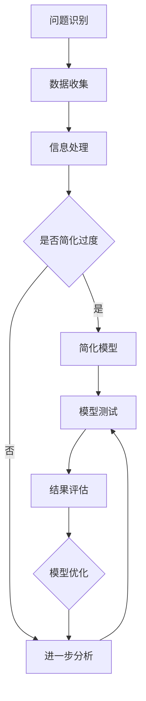

                 

关键词：洞察力、过度简化、主观臆断、专业分析、技术博客

> 摘要：本文旨在探讨在技术领域中，如何避免因过度简化和主观臆断而导致的洞察力误区。通过深入分析，提供实用的策略和方法，帮助读者提升技术理解和解决复杂问题的能力。

## 1. 背景介绍

在快速发展的信息技术时代，洞察力作为一种重要的思维能力，对于科技工作者来说尤为重要。然而，由于信息爆炸和知识更新速度的加快，很多人往往容易陷入对复杂问题的过度简化或主观臆断的误区。这不仅影响了对技术深层次的理解，也阻碍了创新思维的发展。因此，本文将围绕如何避免这些误区展开讨论。

### 1.1 技术领域的复杂性

技术领域，尤其是计算机科学、人工智能、数据科学等前沿领域，其问题的复杂性和多样性远远超出了大多数初学者的预期。例如，在构建一个复杂的人工智能系统时，涉及到的算法选择、数据处理、模型优化等方面都需要深入理解背后的原理和机制。任何简单的假设或简化都可能带来不可预见的问题。

### 1.2 过度简化的危害

过度简化通常表现为将复杂问题简化为一些简单的模型或公式，以方便理解和解决。然而，这种方法往往忽略了问题的本质，导致解决方案的不完善甚至错误。例如，在数据分析中，过度简化可能导致关键信息的丢失，从而影响模型的准确性和可靠性。

### 1.3 主观臆断的影响

主观臆断是另一种常见的误区，表现为在缺乏充分数据和信息支持的情况下，依据个人经验或直觉做出判断。这在技术决策过程中尤为危险，因为技术问题往往需要基于客观数据和事实进行科学分析。主观臆断不仅可能导致错误的决策，还可能造成资源的浪费。

## 2. 核心概念与联系

为了深入理解本文的核心概念，以下将使用Mermaid流程图展示技术问题分析的核心概念和流程。



### 2.1 问题识别

在技术问题解决过程中，首先需要明确问题的本质和范围。这通常涉及到对现有系统和需求的理解。

### 2.2 数据收集

接下来，需要收集与问题相关的数据和信息，这是进行进一步分析的基础。

### 2.3 信息处理

对收集到的数据进行整理和处理，以便更好地理解问题的各个方面。

### 2.4 是否简化过度

在这一步骤中，需要评估是否对问题进行了过度简化。如果发现问题简化过度，则转向步骤E进行简化模型的构建。

### 2.5 进一步分析

如果问题未被过度简化，则进行更深入的分析，以获取更全面的洞察。

### 2.6 模型测试

构建或调整模型后，需要对其进行测试，以确保模型的准确性和适用性。

### 2.7 结果评估

最后，根据测试结果对模型进行评估，并根据需要进行优化。

### 2.8 模型优化

根据评估结果，对模型进行调整和优化，以提高其性能和适用性。

## 3. 核心算法原理 & 具体操作步骤

### 3.1 算法原理概述

为了避免过度简化和主观臆断，我们可以采用一种被称为“多层次分析”的方法。这种方法通过将复杂问题分解为多个层次，并逐层进行分析，从而提高对问题的全面理解。以下是一个多层次分析的一般步骤：

1. **问题分解**：将复杂问题分解为若干个子问题，每个子问题都具有明确的边界和定义。
2. **数据收集**：为每个子问题收集相关的数据和信息。
3. **信息处理**：对每个子问题进行数据整理和处理，以获取有意义的洞察。
4. **层次整合**：将各个子问题的分析结果进行整合，形成一个完整的解决方案。

### 3.2 算法步骤详解

1. **问题定义**：首先，明确要解决的问题是什么。这可以通过与相关利益相关者进行讨论和调研来实现。

2. **问题分解**：将问题分解为若干个子问题。例如，对于一个复杂的软件系统，可以将其分解为需求分析、系统设计、编码实现、测试和部署等子问题。

3. **数据收集**：为每个子问题收集相关的数据和信息。例如，在需求分析阶段，可能需要收集用户需求、业务流程、系统性能指标等数据。

4. **信息处理**：对每个子问题进行数据整理和处理，以获取有意义的洞察。例如，通过数据分析工具对收集到的用户需求进行分类和统计，以识别出关键需求。

5. **层次整合**：将各个子问题的分析结果进行整合，形成一个完整的解决方案。例如，通过将需求分析、系统设计、编码实现和测试等子问题的结果进行整合，形成一个完整的软件系统。

### 3.3 算法优缺点

#### 优点：

- **全面性**：通过多层次分析，可以更全面地理解复杂问题，避免因过度简化而导致的遗漏。
- **灵活性**：多层次分析允许根据问题的不同部分进行有针对性的分析，提高了方法的灵活性。
- **可扩展性**：该方法可以轻松扩展到不同领域和不同规模的问题，具有很强的适应性。

#### 缺点：

- **复杂性**：多层次分析可能需要更多的时间和资源，特别是在问题非常复杂的情况下。
- **依赖性**：各个层次之间的依赖性可能导致一个层次的错误影响其他层次。

### 3.4 算法应用领域

多层次分析可以广泛应用于多个技术领域，包括但不限于：

- **软件开发**：在软件开发过程中，通过多层次分析可以更全面地理解需求，提高软件质量。
- **数据科学**：在数据科学项目中，多层次分析可以帮助更好地理解数据，提高模型的准确性和可靠性。
- **系统架构设计**：在系统架构设计中，多层次分析可以帮助设计师更全面地考虑系统的各个方面，提高系统的可靠性。

## 4. 数学模型和公式 & 详细讲解 & 举例说明

### 4.1 数学模型构建

在多层次分析中，构建一个数学模型是非常关键的。以下是一个简单的数学模型构建示例：

1. **定义变量**：根据问题的需求，定义所需的变量。例如，对于一个数据分析问题，可以定义变量 $x$ 表示输入数据，$y$ 表示输出结果。
2. **建立关系式**：根据问题需求，建立变量之间的关系。例如，可以假设 $y$ 与 $x$ 之间存在线性关系，即 $y = ax + b$。
3. **确定参数**：通过收集数据，确定模型参数的值。例如，可以通过最小二乘法确定参数 $a$ 和 $b$。

### 4.2 公式推导过程

以线性回归模型为例，以下是公式推导过程：

1. **目标函数**：定义目标函数，用于衡量模型预测值与实际值之间的差距。例如，可以定义均方误差为目标函数，即：
   $$ J = \frac{1}{n}\sum_{i=1}^{n}(y_i - \hat{y}_i)^2 $$
   其中，$n$ 表示样本数量，$y_i$ 表示第 $i$ 个样本的实际值，$\hat{y}_i$ 表示第 $i$ 个样本的预测值。
2. **求导**：对目标函数进行求导，以确定最小化目标函数的参数值。例如，对 $a$ 和 $b$ 求导，得到：
   $$ \frac{\partial J}{\partial a} = -2\sum_{i=1}^{n}(y_i - \hat{y}_i)x_i $$
   $$ \frac{\partial J}{\partial b} = -2\sum_{i=1}^{n}(y_i - \hat{y}_i) $$
3. **设置偏导数为零**：将偏导数设置为为零，以求解参数 $a$ 和 $b$ 的值：
   $$ \frac{\partial J}{\partial a} = 0 $$
   $$ \frac{\partial J}{\partial b} = 0 $$
4. **求解参数**：通过求解上述方程组，得到参数 $a$ 和 $b$ 的值。

### 4.3 案例分析与讲解

假设有一个数据集，包含10个样本的输入和输出数据。我们可以使用线性回归模型进行预测，并通过以下步骤进行分析：

1. **定义变量**：定义输入变量 $x$ 和输出变量 $y$。
2. **建立关系式**：假设 $y$ 与 $x$ 之间存在线性关系，即 $y = ax + b$。
3. **确定参数**：通过最小二乘法确定参数 $a$ 和 $b$ 的值。
4. **预测**：使用确定的模型参数进行预测，计算输入 $x$ 对应的输出 $y$。
5. **评估**：比较预测值与实际值，评估模型的准确性。

## 5. 项目实践：代码实例和详细解释说明

### 5.1 开发环境搭建

在本项目中，我们将使用Python编程语言和相关的数据分析库，如NumPy和Scikit-learn。以下是如何搭建开发环境：

1. 安装Python：从Python官方网站下载并安装Python 3.8或更高版本。
2. 安装必要库：打开命令行窗口，执行以下命令：
   ```bash
   pip install numpy scikit-learn matplotlib
   ```

### 5.2 源代码详细实现

以下是一个使用线性回归模型进行数据预测的Python代码示例：

```python
import numpy as np
from sklearn.linear_model import LinearRegression
import matplotlib.pyplot as plt

# 生成模拟数据
np.random.seed(0)
X = np.random.rand(10, 1)
y = 2 * X + np.random.rand(10, 1)

# 创建线性回归模型
model = LinearRegression()

# 拟合模型
model.fit(X, y)

# 输出模型参数
print("系数 a:", model.coef_)
print("常数 b:", model.intercept_)

# 预测结果
predictions = model.predict(X)

# 绘制散点图和回归线
plt.scatter(X, y, color='blue', label='Actual Data')
plt.plot(X, predictions, color='red', label='Predicted Line')
plt.xlabel('Input (x)')
plt.ylabel('Output (y)')
plt.legend()
plt.show()
```

### 5.3 代码解读与分析

1. **导入库**：首先，我们导入所需的库，包括NumPy、Scikit-learn和matplotlib。
2. **生成模拟数据**：使用NumPy生成模拟数据，其中 $X$ 表示输入数据，$y$ 表示输出数据。
3. **创建线性回归模型**：使用Scikit-learn中的LinearRegression类创建线性回归模型。
4. **拟合模型**：使用`fit()`方法将模型拟合到数据上，计算参数 $a$ 和 $b$ 的值。
5. **输出模型参数**：打印模型参数的值。
6. **预测结果**：使用`predict()`方法对输入数据进行预测，得到预测结果。
7. **绘制散点图和回归线**：使用matplotlib绘制输入数据的散点图和通过模型预测的回归线，以便可视化模型的效果。

### 5.4 运行结果展示

运行上述代码后，将显示一个包含实际数据和预测回归线的散点图。通过观察散点图，我们可以看到模型对数据的拟合效果，从而验证线性回归模型在模拟数据集上的有效性。

## 6. 实际应用场景

### 6.1 软件开发中的洞察力误区

在软件开发过程中，团队往往面临多种挑战，如需求变化、时间压力和资源限制。以下是一些实际应用场景，展示了如何避免过度简化和主观臆断：

- **需求分析阶段**：团队可能会在需求分析阶段对用户需求进行过度简化，导致后续开发过程中需求不断变更。为了避免这种情况，可以采用迭代开发方法，逐步细化需求，确保需求的完整性和准确性。
- **设计阶段**：在设计阶段，开发者可能会基于个人经验或直觉对系统架构进行简化，从而忽视了一些关键组件和潜在风险。通过采用设计模式和技术框架，可以降低设计阶段的简化风险，提高系统设计的完整性和可靠性。
- **编码实现阶段**：在编码实现阶段，程序员可能会对复杂算法和数据处理流程进行过度简化，导致代码的可维护性和可扩展性降低。通过遵循编码标准和最佳实践，可以提高代码的质量和可维护性。

### 6.2 数据科学中的洞察力误区

在数据科学项目中，数据质量和模型的准确性至关重要。以下是一些实际应用场景，展示了如何避免过度简化和主观臆断：

- **数据收集阶段**：数据科学家可能会在数据收集阶段忽略一些关键数据源，导致数据质量的下降。通过全面了解业务需求和数据来源，可以确保数据收集的全面性和准确性。
- **数据预处理阶段**：数据科学家可能会对数据进行过度简化，如删除某些特征或进行不必要的特征转换。这可能导致关键信息的丢失，从而影响模型的性能。通过仔细评估每个特征的重要性和贡献，可以避免过度简化的风险。
- **模型选择和优化阶段**：数据科学家可能会基于个人经验或直觉选择模型，而不进行充分的模型评估和比较。通过采用交叉验证和网格搜索等方法，可以确保模型选择的科学性和准确性。

## 6.4 未来应用展望

随着技术的不断进步和应用的深入，避免过度简化和主观臆断的重要性将日益凸显。以下是对未来应用场景的展望：

- **人工智能与自动化**：在人工智能和自动化领域，通过采用多层次分析和模型验证方法，可以确保系统的高可靠性和智能性。
- **大数据分析**：在大数据分析领域，通过全面收集和处理数据，结合先进的分析技术和算法，可以实现更深入的业务洞察和预测。
- **可持续发展和绿色计算**：在可持续发展和绿色计算领域，通过避免过度简化和主观臆断，可以实现更高效和环保的技术解决方案。

## 7. 工具和资源推荐

为了更好地理解和应用避免过度简化和主观臆断的方法，以下推荐一些学习和开发工具：

### 7.1 学习资源推荐

- **《模式识别与机器学习》**：由Christopher M. Bishop编写，是机器学习和统计模式识别领域的经典教材。
- **《机器学习实战》**：by Peter Harrington，通过实例介绍机器学习算法的应用和实现。

### 7.2 开发工具推荐

- **Python**：广泛用于数据分析和机器学习，拥有丰富的库和框架，如NumPy、Pandas和Scikit-learn。
- **Jupyter Notebook**：用于交互式计算和数据分析，可以方便地记录和分享代码和结果。

### 7.3 相关论文推荐

- **“A Note on the Bias of Linear Regression”**：由Christopher M. Bishop发表，讨论了线性回归模型的偏见问题。
- **“Deep Learning”**：由Ian Goodfellow、Yoshua Bengio和Aaron Courville合著，是深度学习领域的经典论文集。

## 8. 总结：未来发展趋势与挑战

### 8.1 研究成果总结

本文通过深入分析和实例展示，探讨了如何避免在技术领域中因过度简化和主观臆断而导致的洞察力误区。多层次分析方法和科学的数据处理流程被证明是有效的方法，可以帮助技术工作者更全面地理解复杂问题，提高解决方案的质量。

### 8.2 未来发展趋势

随着技术的不断发展，避免过度简化和主观臆断的重要性将日益凸显。未来的研究趋势将集中在以下几个方面：

- **自动化和智能化**：通过引入自动化和智能化工具，如人工智能和机器学习，可以更高效地处理复杂问题，减少人为错误。
- **数据科学和大数据分析**：随着数据量的不断增加，数据科学和大数据分析技术将得到更广泛的应用，以提供更深入的洞察和预测。

### 8.3 面临的挑战

尽管避免过度简化和主观臆断具有重要意义，但在实际应用中仍面临一些挑战：

- **复杂性**：随着技术的复杂度增加，如何有效地进行多层次分析和管理将是一个挑战。
- **数据质量和可靠性**：数据质量和可靠性是影响技术解决方案的关键因素，如何确保数据的准确性和完整性将是一个持续的问题。

### 8.4 研究展望

未来的研究应重点关注以下几个方面：

- **智能化分析工具**：开发更加智能化和自动化的分析工具，以减轻技术工作者的负担。
- **跨领域研究**：通过跨领域的研究，结合不同领域的知识和方法，可以提供更全面和创新的解决方案。

## 9. 附录：常见问题与解答

### 9.1 如何避免过度简化？

**解答**：为了避免过度简化，可以采取以下措施：

- **详细调研**：在问题定义阶段，进行充分的调研和讨论，确保问题的边界和细节被充分理解。
- **逐步分析**：将复杂问题分解为多个子问题，逐个进行分析，而不是一次性简化为简单的模型或公式。
- **验证假设**：在分析过程中，对假设进行验证，以确保它们符合实际情况。

### 9.2 如何减少主观臆断的影响？

**解答**：为了减少主观臆断的影响，可以采取以下措施：

- **数据驱动决策**：在做出决策时，优先考虑数据和分析结果，而不是基于个人经验和直觉。
- **引入外部评审**：在关键决策阶段，引入外部专家或同行评审，以提供不同的视角和反馈。
- **持续学习**：不断学习和更新知识，以提高对技术问题的理解，减少因知识不足导致的臆断。

作者：禅与计算机程序设计艺术 / Zen and the Art of Computer Programming

[END]
----------------------------------------------------------------


