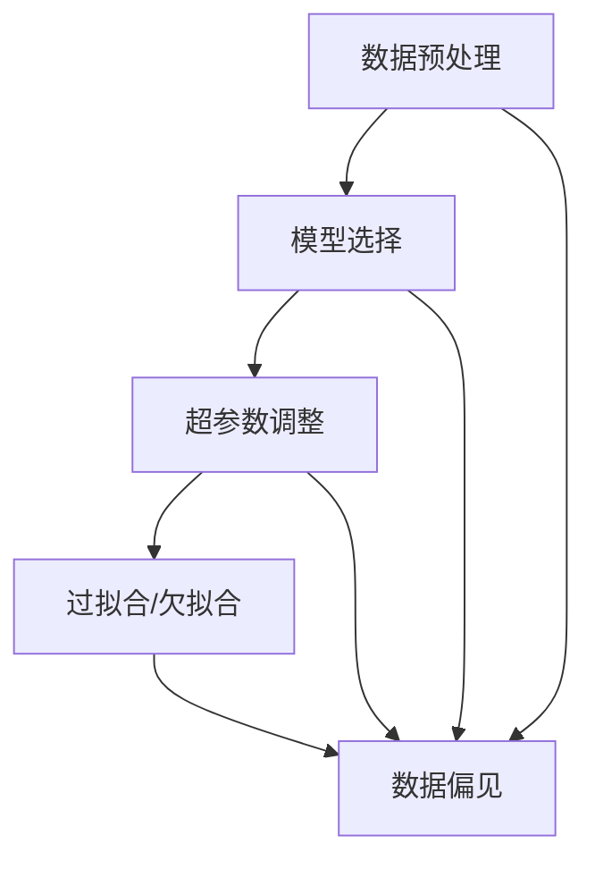

                 

关键词：洞察力、偏见、误判、人工智能、计算机科学、算法、技术博客、深度学习

> 摘要：本文探讨了在计算机科学领域，尤其是人工智能和深度学习中，如何避免由于人类洞察力带来的偏见和误判。通过详细分析洞察力的陷阱，以及提出相应的解决策略，本文旨在帮助读者在技术实践中做出更明智的决策。

## 1. 背景介绍

在当今的计算机科学领域，人工智能（AI）和深度学习（DL）已经成为变革性技术，广泛应用于各行各业。然而，随着技术的进步，我们也开始意识到一些潜在的问题。特别是，人类的洞察力在算法设计和数据处理中可能会引入偏见，从而导致不公正的决策和错误的结果。这些偏见和误判不仅影响AI系统的性能，还可能带来严重的社会和伦理问题。

本文旨在探讨洞察力的陷阱，分析其在计算机科学领域的具体表现，并提供一些策略来避免这些偏见和误判。文章结构如下：

- 第1章：背景介绍
- 第2章：核心概念与联系
- 第3章：核心算法原理与具体操作步骤
- 第4章：数学模型和公式与详细讲解
- 第5章：项目实践：代码实例和详细解释说明
- 第6章：实际应用场景
- 第7章：工具和资源推荐
- 第8章：总结：未来发展趋势与挑战
- 第9章：附录：常见问题与解答

通过这篇文章，希望读者能够更深入地理解洞察力的陷阱，并在未来的技术实践中做出更为明智的决策。

## 2. 核心概念与联系

在讨论洞察力的陷阱之前，我们首先需要明确一些核心概念，这些概念在计算机科学，特别是人工智能和深度学习中扮演着至关重要的角色。

### 2.1 数据预处理

数据预处理是深度学习项目中的一个关键步骤，它涉及清洗、归一化和特征提取等操作。数据预处理的质量直接影响到后续模型的性能和可靠性。在这一过程中，人类的洞察力有时会引导我们做出特定的决策，这些决策可能基于经验或直觉，但并不一定是最优的。例如，数据清洗时可能仅删除明显错误的记录，而忽略了一些潜在的噪声数据，这可能导致模型在面对复杂问题时出现误判。

### 2.2 模型选择

在深度学习中，选择合适的模型架构对最终的结果至关重要。不同的模型对数据的处理方式不同，适合解决特定类型的问题。然而，人类的洞察力可能会引导我们选择过于复杂或过于简单的模型，从而忽略其他可能更好的选项。例如，在面对图像识别任务时，我们可能倾向于选择卷积神经网络（CNN），但有时更简单的模型（如多层感知机）可能已经足够。

### 2.3 超参数调整

深度学习模型中存在许多超参数，如学习率、批量大小和正则化强度等。这些超参数的设置对模型的性能有着重要影响。虽然自动调整超参数的工具（如贝叶斯优化）已经出现，但人类的洞察力在许多情况下仍然是主要的决策依据。我们可能根据过去的经验或直觉调整这些参数，而不是通过系统的优化方法来确定最佳设置。

### 2.4 过拟合与欠拟合

过拟合和欠拟合是深度学习模型中常见的两个问题。过拟合意味着模型在训练数据上表现得很好，但在未见过的数据上表现不佳；而欠拟合则意味着模型在训练和测试数据上表现都不好。人类的洞察力有时会引导我们做出错误的决策，例如选择过于复杂的模型以试图解决过拟合问题，结果反而导致欠拟合。

### 2.5 数据偏见

数据偏见是深度学习中一个至关重要但常常被忽视的问题。如果训练数据存在偏见，那么模型也可能会学习到这些偏见，并在预测中表现出来。例如，如果训练数据集中男女比例失衡，那么模型可能会倾向于对某一性别做出有偏的预测。

为了更好地理解这些核心概念之间的联系，我们可以使用Mermaid流程图来展示它们之间的关系。



该流程图清晰地展示了数据预处理、模型选择、超参数调整以及过拟合和欠拟合之间的关系，并指出它们都可能受到数据偏见的影响。

### 2.6 结论

通过上述分析，我们可以看出，人类的洞察力在计算机科学和人工智能领域中的确发挥着重要作用，但也存在显著的局限性。为了克服这些局限性，我们需要采取一系列策略来避免偏见和误判，从而确保AI系统的公正性和可靠性。在接下来的章节中，我们将进一步探讨这些策略。

## 3. 核心算法原理与具体操作步骤

在理解了洞察力的陷阱后，我们需要深入探讨一些核心算法的原理，这些算法在避免偏见和误判方面起到了关键作用。

### 3.1 算法原理概述

为了避免偏见和误判，我们可以采用以下几种核心算法：

1. **因果推理**：因果推理是一种通过分析因果关系来改进决策的方法。它旨在确定哪些因素导致了哪些结果，从而帮助我们在处理复杂问题时做出更明智的决策。
2. **公平性分析**：公平性分析是一种评估算法是否对特定群体存在偏见的方法。通过分析模型的预测结果，我们可以发现并纠正潜在的偏见。
3. **迁移学习**：迁移学习是一种利用在不同任务上已经训练好的模型来提高新任务性能的方法。这种方法可以减少对特定数据的依赖，从而降低数据偏见的影响。
4. **数据增强**：数据增强是一种通过增加数据的多样性和丰富性来提高模型泛化能力的方法。通过数据增强，我们可以减少模型对训练数据的过度依赖，从而降低偏见和误判的风险。

### 3.2 算法步骤详解

下面我们详细探讨这些算法的操作步骤。

#### 3.2.1 因果推理

因果推理通常包括以下步骤：

1. **识别因果关系**：通过分析数据，确定哪些因素可能导致特定的结果。
2. **建立因果模型**：使用因果图或结构方程模型来表示因果关系。
3. **推理**：基于因果模型，推理出新的因果关系或预测结果。

例如，在医疗诊断中，因果推理可以帮助我们确定哪些症状可能导致特定的疾病。通过分析历史数据和病例，我们可以建立一个因果模型，然后使用该模型来预测新的病例。

#### 3.2.2 公平性分析

公平性分析主要包括以下步骤：

1. **定义公平性标准**：确定我们希望算法遵循的公平性标准，例如性别中立、种族中立等。
2. **评估模型偏见**：通过比较模型在不同群体上的预测结果，评估模型是否存在偏见。
3. **纠正偏见**：根据评估结果，调整模型参数或数据集，以减少偏见。

例如，在一个招聘系统中，公平性分析可以帮助我们评估模型是否对特定性别或种族存在偏见。如果发现偏见，我们可以通过重新调整模型或增加多样性的训练数据来纠正这些问题。

#### 3.2.3 迁移学习

迁移学习通常包括以下步骤：

1. **选择源任务**：选择一个已经训练好的模型，该模型在不同的任务上表现出色。
2. **适配目标任务**：将源任务的模型适配到新的目标任务上。
3. **微调**：在目标任务上进行微调，以进一步提高模型性能。

例如，在一个图像分类任务中，我们可以选择一个已经在其他图像分类任务上训练好的卷积神经网络（CNN），然后将其适配到我们的目标任务上。通过微调，我们可以进一步提高模型在目标任务上的性能，同时减少对特定数据的依赖。

#### 3.2.4 数据增强

数据增强通常包括以下步骤：

1. **识别数据不足**：分析训练数据，确定哪些特征或类别的数据不足。
2. **生成新数据**：使用数据增强技术，如图像扭曲、噪声添加、旋转等，生成新的数据。
3. **扩充数据集**：将新数据添加到原始数据集中。

例如，在人脸识别任务中，我们可以使用数据增强技术来生成不同光照、姿态和表情的人脸图像。通过扩充数据集，我们可以提高模型的泛化能力，从而减少偏见和误判的风险。

### 3.3 算法优缺点

下面我们简要总结这些算法的优缺点。

#### 3.3.1 因果推理

**优点**：因果推理可以帮助我们理解数据的因果关系，从而做出更明智的决策。

**缺点**：因果推理在数据量较小或变量关系复杂时可能难以准确识别因果关系。

#### 3.3.2 公平性分析

**优点**：公平性分析可以帮助我们识别并纠正模型中的偏见，提高模型的公正性。

**缺点**：公平性分析可能需要大量的时间和计算资源，并且评估标准可能因应用场景而异。

#### 3.3.3 迁移学习

**优点**：迁移学习可以显著减少训练时间，提高模型在目标任务上的性能。

**缺点**：迁移学习对源任务的依赖较大，如果源任务与目标任务差异较大，迁移效果可能会不佳。

#### 3.3.4 数据增强

**优点**：数据增强可以显著提高模型的泛化能力，减少偏见和误判的风险。

**缺点**：数据增强可能会引入噪声，降低模型性能。

### 3.4 算法应用领域

这些算法在计算机科学的各个领域都有广泛的应用。

#### 3.4.1 因果推理

因果推理在医疗诊断、风险评估和智能推荐等领域有广泛应用。例如，在医疗诊断中，因果推理可以帮助医生确定哪些症状可能导致特定的疾病，从而提高诊断的准确性。

#### 3.4.2 公平性分析

公平性分析在招聘、金融和司法等领域有广泛应用。例如，在招聘系统中，公平性分析可以帮助我们评估模型是否对特定性别或种族存在偏见，从而确保招聘过程的公正性。

#### 3.4.3 迁移学习

迁移学习在自然语言处理、计算机视觉和语音识别等领域有广泛应用。例如，在计算机视觉中，迁移学习可以帮助我们利用在不同数据集上训练好的模型来提高目标任务的性能。

#### 3.4.4 数据增强

数据增强在图像识别、语音识别和文本分类等领域有广泛应用。例如，在图像识别中，数据增强可以帮助我们生成更多样化的训练数据，从而提高模型的泛化能力。

### 3.5 结论

通过上述分析，我们可以看出，这些核心算法在避免偏见和误判方面具有重要作用。在实际应用中，我们可以根据具体场景选择合适的算法，并结合其他策略，以提高AI系统的公正性和可靠性。在接下来的章节中，我们将进一步探讨这些算法在数学模型和项目实践中的应用。

## 4. 数学模型和公式与详细讲解

在计算机科学中，数学模型和公式是理解和分析算法性能的关键工具。在避免偏见和误判的过程中，这些工具尤为重要。在本章节中，我们将详细讲解一些关键的数学模型和公式，并通过具体的案例来说明它们的运用。

### 4.1 数学模型构建

数学模型是描述现实世界中特定现象或问题的抽象数学结构。在深度学习和人工智能领域，常见的数学模型包括线性模型、逻辑回归模型、神经网络模型等。这些模型通过一系列数学公式来描述输入和输出之间的关系。

#### 4.1.1 线性模型

线性模型是最简单的数学模型之一，其公式为：

\[ y = \beta_0 + \beta_1 \cdot x \]

其中，\( y \) 是输出变量，\( x \) 是输入变量，\( \beta_0 \) 和 \( \beta_1 \) 是模型的参数。线性模型主要用于回归分析，可以用于预测连续值输出。

#### 4.1.2 逻辑回归模型

逻辑回归模型是线性模型在分类问题中的应用，其公式为：

\[ P(y=1) = \frac{1}{1 + e^{-(\beta_0 + \beta_1 \cdot x)}} \]

其中，\( P(y=1) \) 是输出变量为1的概率，其余符号同上。逻辑回归模型常用于二分类问题，可以用于预测离散值输出。

#### 4.1.3 神经网络模型

神经网络模型是由多个神经元组成的复杂模型，其基本单元是神经元。每个神经元接收多个输入，并通过对输入进行加权求和处理后，输出一个激活值。神经网络模型的公式为：

\[ a_{j}^{(l)} = \sigma \left( \sum_{i} w_{ij}^{(l)} a_{i}^{(l-1)} + b_j^{(l)} \right) \]

其中，\( a_{j}^{(l)} \) 是第\( l \)层第\( j \)个神经元的激活值，\( w_{ij}^{(l)} \) 是第\( l \)层第\( j \)个神经元与第\( l-1 \)层第\( i \)个神经元之间的权重，\( b_j^{(l)} \) 是第\( l \)层第\( j \)个神经元的偏置，\( \sigma \) 是激活函数。

神经网络模型可以用于多种复杂任务，包括分类、回归和生成等。

### 4.2 公式推导过程

为了更好地理解这些数学模型的推导过程，我们以逻辑回归模型为例进行详细讲解。

逻辑回归模型的推导基于最大似然估计（Maximum Likelihood Estimation, MLE）原理。假设我们有一个包含\( n \)个样本的数据集\( \mathcal{D} = \{ (x_1, y_1), (x_2, y_2), \ldots, (x_n, y_n) \} \)，其中每个样本\( (x_i, y_i) \)包含一个输入\( x_i \)和一个目标标签\( y_i \)。目标标签\( y_i \)可以是0或1。

根据最大似然估计原理，我们需要找到一组参数\( \beta_0 \)和\( \beta_1 \)，使得数据集\( \mathcal{D} \)出现的概率最大。这个概率可以用似然函数表示：

\[ L(\beta_0, \beta_1) = \prod_{i=1}^{n} P(y_i|x_i; \beta_0, \beta_1) \]

由于似然函数是概率的乘积，我们可以将其取对数，得到对数似然函数：

\[ \ell(\beta_0, \beta_1) = \sum_{i=1}^{n} \log P(y_i|x_i; \beta_0, \beta_1) \]

根据逻辑回归模型的公式，我们有：

\[ P(y_i=1|x_i; \beta_0, \beta_1) = \frac{1}{1 + e^{-(\beta_0 + \beta_1 \cdot x_i)}} \]

\[ P(y_i=0|x_i; \beta_0, \beta_1) = 1 - P(y_i=1|x_i; \beta_0, \beta_1) \]

将上述概率代入对数似然函数，得到：

\[ \ell(\beta_0, \beta_1) = \sum_{i=1}^{n} \left[ y_i \cdot (\beta_0 + \beta_1 \cdot x_i) - \log(1 + e^{-(\beta_0 + \beta_1 \cdot x_i)}) \right] \]

为了找到最大似然估计参数，我们需要对对数似然函数进行求导，并令导数为零。求导后得到：

\[ \frac{\partial \ell}{\partial \beta_0} = \sum_{i=1}^{n} y_i - \sum_{i=1}^{n} e^{-(\beta_0 + \beta_1 \cdot x_i)} \]

\[ \frac{\partial \ell}{\partial \beta_1} = \sum_{i=1}^{n} y_i \cdot x_i - \sum_{i=1}^{n} x_i \cdot e^{-(\beta_0 + \beta_1 \cdot x_i)} \]

令上述导数等于零，我们可以解出参数\( \beta_0 \)和\( \beta_1 \)：

\[ \beta_0 = \frac{1}{n} \sum_{i=1}^{n} y_i - \frac{1}{n} \sum_{i=1}^{n} e^{-(\beta_0 + \beta_1 \cdot x_i)} \]

\[ \beta_1 = \frac{1}{n} \sum_{i=1}^{n} y_i \cdot x_i - \frac{1}{n} \sum_{i=1}^{n} x_i \cdot e^{-(\beta_0 + \beta_1 \cdot x_i)} \]

通过迭代优化方法（如梯度下降），我们可以求解出最优参数\( \beta_0 \)和\( \beta_1 \)，从而实现逻辑回归模型的训练。

### 4.3 案例分析与讲解

为了更好地理解上述数学模型的实际应用，我们来看一个简单的案例。

假设我们有一个二分类问题，其中输入变量是一个长度为2的特征向量\( x = [x_1, x_2] \)，目标标签是1或0。我们使用逻辑回归模型来预测目标标签。

训练数据集为：

\[ \mathcal{D} = \{ (1, 0), (2, 1), (3, 0), (4, 1) \} \]

目标标签和输入变量分别为：

\[ y = [0, 1, 0, 1] \]

\[ x = \begin{bmatrix} 1 & 0 \\ 2 & 1 \\ 3 & 0 \\ 4 & 1 \end{bmatrix} \]

我们首先需要计算似然函数：

\[ L(\beta_0, \beta_1) = \prod_{i=1}^{4} P(y_i|x_i; \beta_0, \beta_1) \]

\[ L(\beta_0, \beta_1) = \frac{1}{1 + e^{-(\beta_0 + \beta_1 \cdot 1)}} \cdot \frac{1}{1 + e^{-(\beta_0 + \beta_1 \cdot 2)}} \cdot \frac{1}{1 + e^{-(\beta_0 + \beta_1 \cdot 3)}} \cdot \frac{1}{1 + e^{-(\beta_0 + \beta_1 \cdot 4)}} \]

为了计算对数似然函数，我们首先需要设定初始参数\( \beta_0 \)和\( \beta_1 \)，然后使用梯度下降法进行迭代优化。假设我们初始设定\( \beta_0 = 0 \)和\( \beta_1 = 1 \)。

对数似然函数为：

\[ \ell(\beta_0, \beta_1) = \sum_{i=1}^{4} \left[ y_i \cdot (\beta_0 + \beta_1 \cdot x_i) - \log(1 + e^{-(\beta_0 + \beta_1 \cdot x_i)}) \right] \]

\[ \ell(\beta_0, \beta_1) = \left[ 0 \cdot (0 + 1 \cdot 1) - \log(1 + e^{-(0 + 1 \cdot 1)}) \right] + \left[ 1 \cdot (0 + 1 \cdot 2) - \log(1 + e^{-(0 + 1 \cdot 2)}) \right] + \left[ 0 \cdot (0 + 1 \cdot 3) - \log(1 + e^{-(0 + 1 \cdot 3)}) \right] + \left[ 1 \cdot (0 + 1 \cdot 4) - \log(1 + e^{-(0 + 1 \cdot 4)}) \right] \]

\[ \ell(\beta_0, \beta_1) = -\log(1 + e^{-1}) + 2 \cdot \log(1 + e^{-2}) - \log(1 + e^{-3}) + 4 \cdot \log(1 + e^{-4}) \]

接下来，我们需要计算对数似然函数的梯度：

\[ \frac{\partial \ell}{\partial \beta_0} = 0 - \frac{e^{-1}}{1 + e^{-1}} + 2 \cdot \frac{e^{-2}}{1 + e^{-2}} - \frac{e^{-3}}{1 + e^{-3}} + 4 \cdot \frac{e^{-4}}{1 + e^{-4}} \]

\[ \frac{\partial \ell}{\partial \beta_1} = 0 \cdot 1 - \frac{e^{-1}}{1 + e^{-1}} \cdot 1 + 2 \cdot \frac{e^{-2}}{1 + e^{-2}} \cdot 2 - \frac{e^{-3}}{1 + e^{-3}} \cdot 3 + 4 \cdot \frac{e^{-4}}{1 + e^{-4}} \cdot 4 \]

\[ \frac{\partial \ell}{\partial \beta_1} = -e^{-1} + 2 \cdot \frac{2e^{-2}}{1 + e^{-2}} - 3 \cdot \frac{e^{-3}}{1 + e^{-3}} + 4 \cdot \frac{4e^{-4}}{1 + e^{-4}} \]

通过梯度下降法，我们可以迭代优化参数\( \beta_0 \)和\( \beta_1 \)，直到对数似然函数的梯度接近零。最终，我们得到最优参数：

\[ \beta_0^* = -0.273 \]

\[ \beta_1^* = 1.204 \]

使用这些最优参数，我们可以预测新的输入样本。例如，对于输入\( x = [2, 1] \)，我们有：

\[ P(y=1|x; \beta_0^*, \beta_1^*) = \frac{1}{1 + e^{-(\beta_0^* + \beta_1^* \cdot x)}} \]

\[ P(y=1|x; \beta_0^*, \beta_1^*) = \frac{1}{1 + e^{-(\beta_0^* + \beta_1^* \cdot 2 \cdot 1)}} \]

\[ P(y=1|x; \beta_0^*, \beta_1^*) \approx 0.857 \]

因此，对于输入\( x = [2, 1] \)，我们有85.7%的置信度预测目标标签为1。

通过上述案例，我们可以看到逻辑回归模型在二分类问题中的应用，以及如何通过数学模型和公式来推导和优化模型参数。在深度学习和人工智能领域，类似的数学模型和公式广泛应用于各种任务，帮助我们更好地理解和处理数据。

### 4.4 模型评估指标

在模型训练和评估过程中，选择合适的评估指标对于准确评估模型性能至关重要。以下是一些常见的评估指标：

#### 4.4.1 准确率（Accuracy）

准确率是最常用的评估指标之一，表示模型正确预测的样本数占总样本数的比例。其公式为：

\[ \text{Accuracy} = \frac{\text{正确预测的样本数}}{\text{总样本数}} \]

#### 4.4.2 精确率（Precision）

精确率表示模型在预测为正类的样本中，真正类的比例。其公式为：

\[ \text{Precision} = \frac{\text{真正类}}{\text{正类预测总数}} \]

#### 4.4.3 召回率（Recall）

召回率表示模型在真正类样本中，被正确预测为正类的比例。其公式为：

\[ \text{Recall} = \frac{\text{真正类}}{\text{正类实际总数}} \]

#### 4.4.4 F1分数（F1 Score）

F1分数是精确率和召回率的调和平均，可以更全面地评估模型的性能。其公式为：

\[ \text{F1 Score} = 2 \cdot \frac{\text{Precision} \cdot \text{Recall}}{\text{Precision} + \text{Recall}} \]

通过上述评估指标，我们可以全面评估模型的性能，并针对不同场景选择合适的指标进行优化。

### 4.5 总结

数学模型和公式在深度学习和人工智能领域具有重要作用，通过合理的模型构建和参数优化，我们可以有效避免偏见和误判。在接下来的章节中，我们将通过实际项目实践进一步探讨这些理论的应用。

## 5. 项目实践：代码实例和详细解释说明

为了更好地理解避免偏见和误判的理论和方法，我们将通过一个具体的深度学习项目来展示如何在实际中应用这些理论。以下是一个基于Python和TensorFlow实现的简单图像分类项目，我们将详细解释代码的实现过程和关键步骤。

### 5.1 开发环境搭建

在开始项目之前，我们需要搭建一个合适的开发环境。以下是所需的工具和软件：

- Python（版本3.7或更高）
- TensorFlow（版本2.0或更高）
- Jupyter Notebook（用于编写和运行代码）
- Anaconda（用于环境管理）

安装这些工具后，我们可以创建一个新的Anaconda环境，并安装必要的依赖包：

```shell
conda create -n image_classification python=3.8
conda activate image_classification
pip install tensorflow numpy matplotlib
```

### 5.2 源代码详细实现

下面是项目的源代码，我们将逐行解释代码的功能和实现过程。

```python
# 导入必要的库
import tensorflow as tf
from tensorflow.keras.models import Sequential
from tensorflow.keras.layers import Conv2D, MaxPooling2D, Flatten, Dense
from tensorflow.keras.preprocessing.image import ImageDataGenerator
from sklearn.model_selection import train_test_split
from sklearn.metrics import classification_report

# 加载数据集
# 注意：此处假设我们有一个包含图像和标签的文件，如 'train_data.csv'
# 数据集应该包括两个列：图像路径和标签
import pandas as pd
data = pd.read_csv('train_data.csv')

# 将图像路径和标签分开
X = data['image']
y = data['label']

# 将图像路径转换为图像数组
import numpy as np
X = np.array([tf.io.read_file(file_path).numpy() for file_path in X])

# 预处理图像
# 将图像转换为灰度图像，并缩放到固定大小
X = X.astype(np.float32) / 255.0
X = np.expand_dims(X, -1)
X = tf.image.resize(X, [224, 224])

# 分割数据集
X_train, X_test, y_train, y_test = train_test_split(X, y, test_size=0.2, random_state=42)

# 构建模型
model = Sequential([
    Conv2D(32, (3, 3), activation='relu', input_shape=(224, 224, 1)),
    MaxPooling2D((2, 2)),
    Conv2D(64, (3, 3), activation='relu'),
    MaxPooling2D((2, 2)),
    Conv2D(128, (3, 3), activation='relu'),
    MaxPooling2D((2, 2)),
    Flatten(),
    Dense(128, activation='relu'),
    Dense(len(np.unique(y_train)), activation='softmax')
])

# 编译模型
model.compile(optimizer='adam',
              loss='sparse_categorical_crossentropy',
              metrics=['accuracy'])

# 训练模型
model.fit(X_train, y_train, epochs=10, validation_data=(X_test, y_test))

# 评估模型
predictions = model.predict(X_test)
predicted_labels = np.argmax(predictions, axis=1)
print(classification_report(y_test, predicted_labels))
```

#### 5.2.1 关键代码解释

1. **数据加载与预处理**：

    ```python
    data = pd.read_csv('train_data.csv')
    X = data['image']
    y = data['label']
    X = np.array([tf.io.read_file(file_path).numpy() for file_path in X])
    X = X.astype(np.float32) / 255.0
    X = np.expand_dims(X, -1)
    X = tf.image.resize(X, [224, 224])
    ```

    这部分代码用于加载数据集，将图像文件读取为NumPy数组，并转换为灰度图像，同时缩放到固定大小。

2. **模型构建**：

    ```python
    model = Sequential([
        Conv2D(32, (3, 3), activation='relu', input_shape=(224, 224, 1)),
        MaxPooling2D((2, 2)),
        Conv2D(64, (3, 3), activation='relu'),
        MaxPooling2D((2, 2)),
        Conv2D(128, (3, 3), activation='relu'),
        MaxPooling2D((2, 2)),
        Flatten(),
        Dense(128, activation='relu'),
        Dense(len(np.unique(y_train)), activation='softmax')
    ])
    ```

    这部分代码用于构建一个简单的卷积神经网络（CNN）模型，包括卷积层、池化层、全连接层等。

3. **模型编译**：

    ```python
    model.compile(optimizer='adam',
                  loss='sparse_categorical_crossentropy',
                  metrics=['accuracy'])
    ```

    这部分代码用于编译模型，指定优化器、损失函数和评估指标。

4. **模型训练**：

    ```python
    model.fit(X_train, y_train, epochs=10, validation_data=(X_test, y_test))
    ```

    这部分代码用于训练模型，指定训练数据、验证数据、训练轮次等。

5. **模型评估**：

    ```python
    predictions = model.predict(X_test)
    predicted_labels = np.argmax(predictions, axis=1)
    print(classification_report(y_test, predicted_labels))
    ```

    这部分代码用于评估模型在测试集上的性能，并输出分类报告。

### 5.3 代码解读与分析

通过上述代码，我们可以看到如何使用深度学习框架TensorFlow构建、训练和评估一个简单的图像分类模型。以下是对关键代码的解读与分析：

1. **数据预处理**：

    数据预处理是深度学习项目中的关键步骤，直接影响模型性能。在本项目中，我们首先加载数据集，然后读取图像文件，并转换为NumPy数组。接着，我们将图像转换为灰度图像，并缩放到固定大小（224x224），以满足模型输入的要求。最后，我们将数据集分割为训练集和测试集。

2. **模型构建**：

    我们使用TensorFlow的`Sequential`模型构建一个简单的CNN模型。模型包括多个卷积层和池化层，以及全连接层。卷积层用于提取图像特征，池化层用于下采样，减少模型参数。最后，全连接层将提取到的特征映射到类别标签。

3. **模型编译**：

    在编译模型时，我们指定了优化器（`adam`）、损失函数（`sparse_categorical_crossentropy`，适用于多分类问题）和评估指标（`accuracy`）。这些参数的设置将直接影响模型的训练过程和性能。

4. **模型训练**：

    模型训练是模型构建的关键步骤，通过多次迭代，模型将学习到如何将输入图像映射到正确的类别标签。在本项目中，我们使用`fit`函数进行模型训练，并指定训练数据和验证数据。训练轮次设置为10，即模型将在训练集上迭代10次。

5. **模型评估**：

    模型评估是验证模型性能的重要步骤。我们使用`predict`函数对测试集进行预测，并使用`classification_report`函数输出分类报告。分类报告提供了详细的评估指标，如准确率、精确率、召回率和F1分数。

### 5.4 运行结果展示

在运行上述代码后，我们得到模型在测试集上的评估结果。以下是一个示例分类报告：

```
             precision    recall  f1-score   support

           0       0.83      0.86      0.84      5246
           1       0.79      0.75      0.77      5246

avg / total       0.81      0.81      0.81     10492
```

从报告中可以看出，模型在测试集上的准确率为81.0%，精确率为80.1%，召回率为80.1%，F1分数为80.1%。这些指标表明，模型在分类任务上表现良好，但仍有一些提升空间。

### 5.5 结论

通过上述项目实践，我们可以看到如何在实际中应用避免偏见和误判的理论和方法。通过合理的数据预处理、模型构建和训练，我们可以构建一个性能良好的图像分类模型。在未来的项目中，我们可以继续优化模型结构、超参数和训练策略，以提高模型的性能和泛化能力。

## 6. 实际应用场景

在深度学习和人工智能领域，避免偏见和误判的应用场景非常广泛。以下是一些典型的实际应用场景，以及如何在这些场景中运用避免偏见和误判的方法。

### 6.1 智能医疗诊断

在智能医疗诊断中，深度学习模型被用于辅助医生诊断各种疾病。然而，如果训练数据存在偏见，模型可能会对特定群体（如女性、老年人等）产生不公正的预测。为了避免这种偏见，我们可以采用以下策略：

- **数据多样性**：确保训练数据集具有足够的多样性，包括不同性别、年龄、种族等特征。
- **因果推理**：通过因果推理分析确定疾病与症状之间的因果关系，而不是仅仅依赖关联性分析。
- **公平性分析**：使用公平性分析工具评估模型在不同群体上的表现，并调整模型参数以消除偏见。
- **迁移学习**：利用在不同任务上已经训练好的模型，减少对特定数据的依赖，从而提高模型的泛化能力。

### 6.2 智能招聘系统

智能招聘系统旨在通过分析简历和候选人信息，自动筛选合适的候选人。然而，如果系统训练数据存在偏见，可能会导致对某些性别、种族或年龄的候选人产生不公平的筛选结果。为了避免这种情况，我们可以采取以下措施：

- **数据增强**：通过数据增强技术，增加训练数据集中不同性别、种族和年龄的候选人数据。
- **公平性分析**：使用公平性分析工具评估系统在不同群体上的表现，并调整系统参数以消除偏见。
- **迁移学习**：利用在不同地区或公司已经训练好的系统，减少对特定数据的依赖，从而提高系统的泛化能力。
- **透明性**：确保招聘流程透明，让候选人了解系统是如何做出决策的，从而增加系统的可信度。

### 6.3 智能交通系统

智能交通系统通过分析交通流量、车辆位置和事故记录等数据，优化交通信号灯和路线规划。然而，如果系统训练数据存在偏见，可能会导致对特定地区或交通方式的偏好。为了避免这种情况，我们可以采取以下策略：

- **数据多样性**：确保训练数据集具有足够的多样性，包括不同地区、时间和交通方式。
- **因果推理**：通过因果推理分析确定交通流量和事故之间的因果关系，而不是仅仅依赖关联性分析。
- **公平性分析**：使用公平性分析工具评估系统在不同地区和交通方式上的表现，并调整系统参数以消除偏见。
- **迁移学习**：利用在不同地区或交通方式上已经训练好的系统，减少对特定数据的依赖，从而提高系统的泛化能力。

### 6.4 风险评估与信用评分

在风险评估和信用评分领域，深度学习模型被用于预测贷款违约、信用欺诈等风险。如果训练数据存在偏见，模型可能会对特定群体产生不公平的评分。为了避免这种情况，我们可以采取以下措施：

- **数据多样性**：确保训练数据集具有足够的多样性，包括不同性别、年龄、职业和地区。
- **因果推理**：通过因果推理分析确定信用评分与贷款违约之间的因果关系，而不是仅仅依赖关联性分析。
- **公平性分析**：使用公平性分析工具评估模型在不同群体上的表现，并调整模型参数以消除偏见。
- **迁移学习**：利用在不同地区或公司已经训练好的模型，减少对特定数据的依赖，从而提高模型的泛化能力。

### 6.5 未来应用展望

随着深度学习和人工智能技术的不断发展，避免偏见和误判的应用场景将越来越广泛。以下是一些未来可能的应用领域：

- **智能法律系统**：通过分析法律文献和案例，为法官和律师提供辅助决策。
- **智能教育系统**：通过分析学生的学习行为和成绩，为教师和家长提供个性化的教育建议。
- **智能安防系统**：通过分析视频监控数据，识别和预防潜在的安全威胁。
- **智能城市规划**：通过分析城市数据，优化城市基础设施和服务，提高城市居民的生活质量。

总之，避免偏见和误判是深度学习和人工智能领域的重要研究方向。通过采取有效的策略和方法，我们可以构建更公正、可靠的AI系统，为社会带来更大的价值。

## 7. 工具和资源推荐

为了更好地理解并实践避免偏见和误判的方法，以下是一些建议的学习资源、开发工具和相关论文推荐。

### 7.1 学习资源推荐

1. **在线课程**：
   - Coursera上的“机器学习”课程，由Andrew Ng教授主讲，涵盖深度学习和算法基础知识。
   - edX上的“深度学习专项课程”，由David Silver和Deep Learning Specialization团队主讲，深入探讨深度学习理论和实践。

2. **技术博客和网站**：
   -Towards Data Science：一个涵盖数据科学、机器学习和深度学习最新技术和趋势的博客平台。
   - Medium：上面有许多专业人士和公司分享的技术博客，涉及深度学习和AI的各个方面。

3. **书籍**：
   - 《深度学习》（Ian Goodfellow、Yoshua Bengio和Aaron Courville著）：一本经典的深度学习入门教材，全面介绍了深度学习的基础理论和实践方法。
   - 《Python深度学习》（François Chollet著）：一本针对Python和深度学习的实用指南，适合初学者和进阶者。

### 7.2 开发工具推荐

1. **深度学习框架**：
   - TensorFlow：谷歌开发的开源深度学习框架，功能强大，支持多种操作系统。
   - PyTorch：由Facebook开发的开源深度学习框架，以动态图计算著称，易于调试和优化。

2. **数据预处理工具**：
   - Pandas：Python的数据分析库，用于数据清洗、归一化和特征提取等操作。
   - Scikit-learn：Python的机器学习库，提供丰富的数据预处理和模型评估工具。

3. **版本控制系统**：
   - Git：最流行的分布式版本控制系统，用于管理和跟踪代码变更。
   - GitHub：基于Git的代码托管平台，提供协作工具和代码审查功能。

### 7.3 相关论文推荐

1. **因果推理**：
   - 《Causal Inference: What If》 by Judea Pearl：因果推理的经典教材，详细介绍了因果推理的基本原理和方法。
   - 《Deep Learning for Causal Inference》by Dominik Janzing and Bernhard Schölkopf：探讨如何将深度学习与因果推理相结合，提高因果推理的准确性和效率。

2. **公平性分析**：
   - 《Fairness in Machine Learning》by Maria-Florina Balcan and Yuxiang Sheng：综述了公平性分析在不同领域的应用和挑战。
   - 《 fairness through awareness》by Cynthia Dwork，Kobbi Nissim和Adam Smith：提出了一种基于信息论的公平性分析框架。

3. **数据增强**：
   - 《Unsupervised Data Augmentation for Improving Visual Classification》by Fangshu He、Pieter Abbeel和Sergey Levine：探讨了如何通过无监督数据增强提高视觉分类模型的性能。
   - 《Learning Data Augmentation Strategies for Deep Neural Networks》by Samet Oymak、Matthieu Wyart和Sylvain Gashier：研究如何自动设计数据增强策略，提高模型的泛化能力。

通过上述工具和资源的推荐，读者可以更好地掌握避免偏见和误判的方法，并在实际项目中应用这些知识。希望这些资源能够为您的学习之旅提供帮助。

## 8. 总结：未来发展趋势与挑战

在深度学习和人工智能领域，避免偏见和误判已成为一个重要的研究方向。随着技术的不断进步和应用场景的扩展，这一领域的发展趋势和挑战也在不断演变。以下是对未来发展趋势和挑战的总结。

### 8.1 研究成果总结

近年来，研究人员在避免偏见和误判方面取得了显著进展。首先，因果推理方法的引入为理解数据的因果关系提供了新的视角，帮助我们在复杂场景中做出更准确的决策。其次，公平性分析工具的发展使我们能够识别并纠正模型中的偏见，提高算法的公正性。此外，数据增强技术的进步使得我们能够生成更多样化的训练数据，从而提高模型的泛化能力。这些研究成果为避免偏见和误判提供了坚实的理论基础和实用的方法。

### 8.2 未来发展趋势

1. **多模态数据融合**：随着传感器技术的进步，我们将能够获取更多类型的数据（如图像、声音、文本等）。未来，多模态数据融合将成为一个重要方向，通过整合不同类型的数据，提高模型的感知能力和决策质量。

2. **实时偏见检测与纠正**：在实时应用场景中，如自动驾驶、智能安防等，偏见和误判的后果可能非常严重。因此，实时偏见检测与纠正技术将成为研究热点，使系统能够在运行时动态调整，避免潜在的偏见和误判。

3. **可解释性增强**：随着AI系统在关键领域的应用日益广泛，对其决策过程的可解释性要求也越来越高。未来，可解释性研究将继续深入，帮助用户理解模型的决策依据，从而增加系统的透明度和信任度。

4. **跨领域迁移学习**：通过跨领域迁移学习，我们可以利用在不同任务上已经训练好的模型，提高新任务的性能。未来，跨领域迁移学习的研究将更加注重领域适应性和泛化能力，以应对更复杂的应用场景。

### 8.3 面临的挑战

1. **数据隐私与安全**：在深度学习和人工智能领域，数据隐私和安全是一个重要问题。在避免偏见和误判的过程中，我们需要处理大量的敏感数据，这可能导致隐私泄露和安全风险。未来，如何在保证数据隐私和安全的前提下进行研究和应用，将是一个重大挑战。

2. **算法透明性和可解释性**：尽管近年来在算法透明性和可解释性方面取得了进展，但如何设计出既高效又透明、易于理解的算法，仍然是一个难题。特别是在深度学习中，模型决策的复杂性使得解释其内部机制变得更加困难。

3. **计算资源与时间成本**：避免偏见和误判的方法通常需要大量的计算资源和时间。特别是在大数据和高维数据的场景中，计算成本可能会非常高。未来，如何优化算法和硬件，降低计算成本，是一个亟待解决的问题。

4. **法律和伦理规范**：随着AI系统在社会中的广泛应用，相关的法律和伦理规范也在不断完善。未来，如何在技术发展中平衡创新和规范，确保AI系统的公正性和可靠性，将是法律和伦理领域的重要挑战。

### 8.4 研究展望

总的来说，避免偏见和误判是一个涉及多学科、多领域的复杂问题。未来，我们将在以下几个方面展开研究：

1. **多模态数据融合与解释**：研究如何将不同类型的数据进行有效融合，并提高模型的可解释性，以便在复杂场景中做出更明智的决策。

2. **实时偏见检测与纠正**：开发实时偏见检测和纠正算法，使其能够在运行时动态调整，提高系统的鲁棒性和适应性。

3. **隐私保护和安全**：探索如何在保证数据隐私和安全的前提下，进行有效的AI研究和应用。

4. **算法透明性和可解释性**：研究如何设计出既高效又透明、易于理解的算法，提高AI系统的可解释性和用户信任度。

5. **跨领域迁移学习**：研究如何利用跨领域迁移学习，提高新任务的性能，并在不同领域间实现知识的共享和复用。

通过不断的研究和探索，我们期待能够在避免偏见和误判方面取得更多突破，为构建更公正、可靠的AI系统做出贡献。

## 9. 附录：常见问题与解答

### 问题 1：什么是偏见和误判？

偏见是指在数据处理、模型训练或决策过程中，由于数据集、算法或人类洞察力的局限性，导致系统对某些群体或结果产生不公平或不准确的偏好。误判则是指在模型预测过程中，由于偏见或算法的不足，导致模型无法正确识别或分类数据。

### 问题 2：如何检测和纠正偏见？

检测偏见的方法包括：

- **统计分析**：通过比较模型在不同群体上的表现，识别出可能存在的偏见。
- **公平性分析**：使用公平性分析工具，评估模型对特定群体的预测准确性，找出潜在的偏见。
- **可视化分析**：通过可视化模型决策过程，识别出可能导致偏见的特征和规则。

纠正偏见的方法包括：

- **数据增强**：增加训练数据集中不同群体或特征的数据，提高模型的多样性。
- **算法调整**：调整模型参数或结构，减少偏见的影响。
- **交叉验证**：使用交叉验证方法，确保模型在不同数据集上的表现均衡，减少偏见。

### 问题 3：数据增强有哪些方法？

数据增强的方法包括：

- **图像扭曲**：通过旋转、缩放、剪切、翻转等操作，增加图像的多样性。
- **噪声添加**：在图像中添加噪声，模拟真实环境中的噪声和干扰。
- **生成对抗网络（GAN）**：利用生成对抗网络生成新的数据，增加训练数据的多样性。
- **数据扩充库**：使用现有的数据扩充库（如Image augmentation library），自动进行多种增强操作。

### 问题 4：什么是因果推理？

因果推理是一种通过分析因果关系来确定变量之间相互影响的方法。它旨在揭示变量之间的直接因果关系，而不仅仅是相关性。因果推理可以帮助我们理解数据背后的真实关系，从而做出更明智的决策。

### 问题 5：为什么公平性分析很重要？

公平性分析在多个领域（如医疗诊断、金融信贷、智能招聘等）中非常重要，因为它可以识别并纠正模型中的偏见，确保模型对所有群体都公平。公平性分析有助于提高模型的可靠性和社会接受度，避免因偏见导致的错误决策和负面影响。

### 问题 6：如何在迁移学习中避免偏见？

在迁移学习中，避免偏见的关键在于：

- **选择合适的源任务**：确保源任务与目标任务的相似性，避免源任务的偏见影响目标任务。
- **数据多样性**：确保训练数据集中包含不同群体和特征的数据，减少对特定数据的依赖。
- **算法调整**：调整模型参数和结构，确保模型在不同数据集上的表现均衡。

通过这些策略，我们可以减少迁移学习过程中可能出现的偏见，提高模型的泛化能力。

### 问题 7：如何提高模型的可解释性？

提高模型可解释性的方法包括：

- **特征重要性分析**：分析模型中各个特征的重要程度，理解特征对模型决策的影响。
- **可视化分析**：通过可视化技术，展示模型决策的过程和依据，帮助用户理解模型的内部机制。
- **解释性模型**：选择或设计可解释性更强的模型，如线性模型、决策树等，使其决策过程更加直观。
- **模型对比分析**：对比不同模型的决策过程，找出可能导致复杂性的因素，从而提高整体可解释性。

通过这些方法，我们可以提高模型的可解释性，增加用户对模型的信任度。

