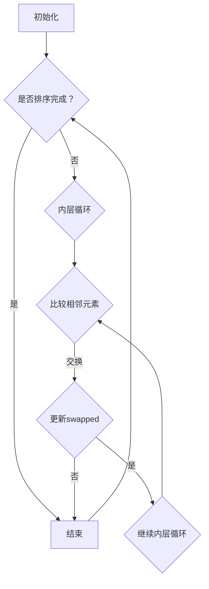

                 

关键词：洞察力、认知科学、算法、编程、技术、复杂性、抽象思维、问题解决、科学方法论

> 摘要：本文将深入探讨人类理解世界的艺术，从认知科学的视角解析洞察力的本质。我们将分析洞察力的核心概念，探讨其在算法设计、编程实践和问题解决中的应用。通过具体的算法原理和操作步骤、数学模型和公式的讲解，以及实际项目实践中的代码实例，本文旨在为读者提供一种全面而深入的理解框架，帮助他们在技术领域中培养和提升洞察力。

## 1. 背景介绍

在技术不断进步的今天，理解和解决问题已成为每个技术专业人士的核心能力。然而，理解并不总是容易的。技术领域充满了复杂性，每一个问题背后都可能隐藏着深奥的原理和复杂的算法。因此，洞察力成为了技术专业人士能否迅速理解和解决问题的关键。

洞察力是一种深刻理解事物本质的能力。它不仅涉及对信息的接收和处理，还包括对复杂系统背后逻辑的识别和抽象。在认知科学中，洞察力被视为一种高级认知能力，与我们的感知、记忆、思考和决策紧密相关。

本文将探讨洞察力在算法设计、编程实践和问题解决中的应用，通过具体的例子和详细的解释，帮助读者理解如何通过提升洞察力来增强技术能力。

### 1.1 认知科学与洞察力

认知科学是研究人类思维和行为的科学。它结合了心理学、神经科学、计算机科学和哲学等多学科知识，旨在理解人类是如何感知、思考、学习和决策的。在认知科学中，洞察力被视为一种高级认知能力，它包括以下几个方面：

- **模式识别**：识别复杂信息中的模式和规律。
- **抽象思维**：从具体实例中提取通用原理和模式。
- **问题解决**：将洞察力应用于实际问题，找到解决方案。
- **记忆**：记住重要信息，并将其与已有知识联系起来。
- **决策**：基于洞察力做出明智的决策。

### 1.2 技术领域的复杂性

技术领域的复杂性日益增加，新的技术和工具不断涌现。这给技术专业人士带来了巨大的挑战。要在这个领域取得成功，不仅需要深厚的专业知识，还需要强大的洞察力。以下是技术领域复杂性的几个方面：

- **大量数据**：数据量的爆炸性增长使得从数据中提取有用信息变得更加困难。
- **多样化工具**：各种开发工具和平台的兴起，使得技术专业人士需要掌握多种技能。
- **快速变化**：技术的快速迭代要求专业人士不断学习新知识，以保持竞争力。
- **系统整合**：不同系统的整合和交互带来了新的挑战，需要深入理解各个系统的运作机制。

### 1.3 洞察力的重要性

在技术领域，洞察力的重要性不言而喻。它不仅能帮助专业人士迅速理解复杂问题，还能提高问题解决的效率和质量。以下是洞察力在技术领域的一些重要作用：

- **快速学习**：通过洞察力，可以更快地掌握新知识和新技能。
- **高效解决问题**：洞察力使专业人士能够快速识别问题核心，找到解决方案。
- **创新思维**：洞察力能够激发创新的思维，帮助发现新的解决方案和优化机会。
- **团队合作**：洞察力有助于更好地理解团队成员的想法，促进团队合作。

### 1.4 算法与洞察力

算法是技术领域的重要组成部分，也是提升洞察力的关键工具。通过理解算法，我们可以更好地理解复杂系统的运作原理，从而提升我们的洞察力。以下是算法与洞察力之间的联系：

- **抽象思维**：算法设计要求我们将具体问题抽象为通用模型，这有助于提升抽象思维能力。
- **模式识别**：算法分析有助于我们识别复杂问题中的模式和规律。
- **问题解决**：算法提供了系统化的解决问题的方法，可以帮助我们更高效地解决问题。
- **决策支持**：算法可以为我们提供决策支持，帮助我们做出更明智的选择。

### 1.5 编程与洞察力

编程是技术领域的核心技能，也是提升洞察力的重要途径。通过编程，我们可以将抽象的算法转化为具体的代码，从而深入理解算法的运作原理。以下是编程与洞察力之间的联系：

- **逻辑思维**：编程要求我们进行严谨的逻辑推理，这有助于提升逻辑思维能力。
- **细节关注**：编程需要关注代码的每一个细节，这有助于提升我们的细节关注能力。
- **问题解决**：编程是解决实际问题的过程，这有助于提升我们的问题解决能力。
- **抽象能力**：编程要求我们将复杂问题抽象为简单模型，这有助于提升我们的抽象能力。

### 1.6 问题解决与洞察力

问题解决是技术专业人士的核心能力之一，而洞察力在其中起着至关重要的作用。通过洞察力，我们可以快速识别问题的核心，找到合适的解决方案。以下是洞察力在问题解决中的作用：

- **问题诊断**：洞察力有助于我们快速诊断问题，找到问题的根源。
- **解决方案设计**：洞察力可以帮助我们设计出更高效、更优的解决方案。
- **风险评估**：洞察力使我们能够评估不同解决方案的风险和收益。
- **持续改进**：洞察力有助于我们发现问题和优化机会，持续改进我们的工作。

## 2. 核心概念与联系

为了更好地理解洞察力在技术领域的应用，我们需要首先了解几个核心概念，以及它们之间的联系。以下是几个核心概念的定义和它们在技术领域中的应用：

### 2.1 抽象思维

**定义**：抽象思维是指从具体事物中提取出共性，形成抽象概念和模型的能力。

**应用**：在算法设计和编程中，抽象思维是非常重要的。通过抽象思维，我们可以将复杂问题简化为更易于处理的模型。例如，在软件开发中，我们常常使用抽象类和接口来定义通用功能，从而简化代码的复杂度。

### 2.2 模式识别

**定义**：模式识别是指从数据或信息中识别出规律或模式的能力。

**应用**：在数据处理和机器学习中，模式识别是一种核心能力。通过识别数据中的模式，我们可以预测未来的趋势，或发现潜在的问题。例如，在金融市场中，通过分析历史交易数据，我们可以识别出市场趋势，从而进行投资决策。

### 2.3 逻辑思维

**定义**：逻辑思维是指根据已知事实进行推理，得出合理结论的能力。

**应用**：在编程和算法设计中，逻辑思维是必不可少的。通过逻辑思维，我们可以确保代码的正确性和效率。例如，在排序算法中，我们需要根据元素的大小关系进行合理的排序，这需要逻辑思维的辅助。

### 2.4 创新思维

**定义**：创新思维是指产生新的想法、解决方案或方法的能力。

**应用**：在技术领域，创新思维是非常重要的。通过创新思维，我们可以发现新的应用场景，解决现有问题，或创造新的价值。例如，在人工智能领域，通过创新思维，我们可以开发出更智能的算法，提高系统的性能和效率。

### 2.5 抽象与具体

**联系**：抽象和具体是相互关联的。抽象是从具体事物中提取出的共性，而具体则是抽象的反面，是具体的实例。在技术领域，我们需要不断地在抽象和具体之间进行转换，从而更好地理解和解决问题。

**应用**：在软件开发中，我们常常使用抽象的概念来设计系统，然后将其具体化为实际的代码。在算法设计中，我们需要从具体的例子中提取出通用的算法模型，然后进行优化和改进。

### 2.6 理论与实践

**联系**：理论与实践是相辅相成的。理论为我们提供了指导原则和方法，而实践则是验证理论的唯一途径。在技术领域，我们需要将理论知识应用到实践中，通过实践来验证理论的正确性和有效性。

**应用**：在算法研究中，我们常常通过实验来验证算法的性能和效果。在软件开发中，我们需要将设计好的系统部署到实际环境中，通过用户反馈来改进我们的产品。

### 2.7 洞察力与思维模式

**联系**：洞察力是一种高级认知能力，它依赖于我们的思维模式。思维模式是指我们在思考问题时采用的思维方式和方法。不同的思维模式会影响我们的洞察力，从而影响我们解决问题的能力。

**应用**：在技术领域，我们需要培养多种思维模式，如抽象思维、模式识别、逻辑思维和创新思维。通过不断练习和反思，我们可以优化我们的思维模式，从而提升洞察力。

### 2.8 洞察力与专业知识

**联系**：洞察力与专业知识密切相关。专业知识为我们提供了解决问题的工具和框架，而洞察力则是我们运用专业知识解决复杂问题的能力。

**应用**：在技术领域，我们需要不断积累专业知识，同时培养洞察力。通过将专业知识与洞察力相结合，我们可以更好地理解和解决复杂问题。

## 3. 核心算法原理 & 具体操作步骤

在理解了洞察力的核心概念后，我们将深入探讨一个具体的算法，即冒泡排序算法。冒泡排序是一种简单的排序算法，其基本原理是通过重复地交换相邻的未按顺序排列的元素，直到所有元素都按顺序排列为止。

### 3.1 算法原理概述

冒泡排序算法的工作原理如下：

1. 比较相邻的元素。如果第一个元素比第二个元素大（对于升序排序），就交换它们。
2. 对每一对相邻元素做同样的工作，从开始第一对到结尾的最后一对。这步做完后，最后的元素会是最大的数。
3. 针对所有的元素重复以上的步骤，除了最后一个。
4. 重复步骤1~3，直到排序完成。

### 3.2 算法步骤详解

以下是冒泡排序算法的具体操作步骤：

1. **初始化**：设置一个布尔变量`swapped`为`true`，用于标记是否发生了交换。
2. **开始循环**：进入一个无限循环，直到`swapped`为`false`。
3. **内层循环**：对于未排序的部分，设置一个内层循环，从第一个元素开始，直到未排序部分的最后一个元素。
4. **相邻元素比较**：在内层循环中，对每一对相邻的元素进行比较。
5. **交换元素**：如果发现第一个元素比第二个元素大，则交换它们。
6. **更新`swapped`**：如果发生了交换，将`swapped`设置为`true`。
7. **结束循环**：如果内层循环没有发生任何交换，说明所有元素都已经按顺序排列，循环结束。

### 3.3 算法优缺点

**优点**：

- **简单易懂**：冒泡排序算法的原理非常简单，易于理解。
- **稳定性**：冒泡排序算法是一种稳定的排序算法，相同值的元素在排序过程中不会相互交换位置。

**缺点**：

- **效率较低**：冒泡排序算法的时间复杂度为O(n^2)，对于大数据集来说，效率较低。
- **不适用于大规模数据集**：由于效率问题，冒泡排序算法不适用于大规模数据集。

### 3.4 算法应用领域

虽然冒泡排序算法在效率上不如其他排序算法，但它在教育领域和初学者入门中非常有用。以下是一些具体的领域：

- **算法教学**：冒泡排序算法是初学者入门算法教学中的经典案例，通过它，学生可以理解排序算法的基本原理。
- **小数据集排序**：对于小规模的数据集，冒泡排序算法是一个快速且易于实现的解决方案。
- **算法验证**：冒泡排序算法可以作为验证其他排序算法正确性的工具。

### 3.5 衍生算法

虽然冒泡排序算法本身效率较低，但其思想可以衍生出其他更高效的排序算法。例如：

- **快速排序**：通过选择一个“基准”元素，将数组分为两部分，快速排序利用了冒泡排序的基本思想，但通过递归的方式显著提高了效率。
- **选择排序**：选择排序通过每次选择未排序部分的最小（或最大）元素，与冒泡排序类似，但每次只进行一次交换。

通过理解这些衍生算法，我们可以更好地理解排序算法的本质，从而提升我们的洞察力。

### 3.6 冒泡排序算法的 Mermaid 流程图

以下是冒泡排序算法的 Mermaid 流程图：



通过这个流程图，我们可以清晰地看到冒泡排序算法的执行流程，这有助于我们更好地理解其原理。

### 3.7 实际案例分析

为了更好地理解冒泡排序算法，我们可以通过一个实际案例来分析其执行过程。假设我们有一个未排序的数组：[5, 2, 9, 1, 5]，我们使用冒泡排序算法对其进行排序。

1. **初始化**：`swapped`设置为`true`。
2. **第一次循环**：
   - 比较第一对元素`5`和`2`，发现`5`比`2`大，交换它们：[2, 5, 9, 1, 5]。
   - 比较第二对元素`5`和`9`，无需交换。
   - 比较第三对元素`9`和`1`，发现`9`比`1`大，交换它们：[2, 5, 1, 9, 5]。
   - 比较第四对元素`9`和`5`，发现`9`比`5`大，交换它们：[2, 5, 1, 5, 9]。
   - `swapped`设置为`true`。
3. **第二次循环**：
   - 比较第一对元素`2`和`5`，无需交换。
   - 比较第二对元素`5`和`1`，发现`5`比`1`大，交换它们：[2, 1, 5, 5, 9]。
   - 比较第三对元素`5`和`5`，无需交换。
   - `swapped`设置为`true`。
4. **第三次循环**：
   - 比较第一对元素`2`和`1`，发现`2`比`1`大，交换它们：[1, 2, 5, 5, 9]。
   - `swapped`设置为`false`，排序完成。

通过这个案例，我们可以看到冒泡排序算法是如何工作的，以及它如何将未排序的数组转化为有序数组。

### 3.8 冒泡排序算法的变体

虽然冒泡排序算法本身存在效率问题，但其思想可以衍生出其他变体，以提高效率。以下是两种常见的冒泡排序算法的变体：

1. **优化冒泡排序**：
   - 在每次内层循环结束后，记录最后一次交换的位置，下一次循环可以忽略这个位置及其之后的位置，因为它们已经处于正确的顺序。
2. **冒泡排序变体**：
   - 在排序过程中，使用两个指针，一个用于记录未排序部分的开头，一个用于记录已排序部分的开头。每次内层循环结束后，更新这两个指针的位置。

这些变体通过减少不必要的比较和交换，提高了冒泡排序算法的效率。

### 3.9 总结

通过详细探讨冒泡排序算法，我们可以看到如何通过具体操作步骤和实际案例来理解算法原理。这不仅有助于提升我们的洞察力，还能帮助我们更好地理解和应用其他算法。在接下来的章节中，我们将继续探讨其他核心算法和数学模型，帮助读者全面理解技术领域中的洞察力。

## 4. 数学模型和公式 & 详细讲解 & 举例说明

在技术领域，数学模型和公式是理解和解决问题的重要工具。它们为我们的算法设计提供了理论基础，帮助我们分析和优化算法性能。本节将详细介绍几个核心的数学模型和公式，并通过实际例子来说明它们的应用。

### 4.1 数学模型构建

在构建数学模型时，我们需要关注以下几个关键要素：

- **目标函数**：明确我们要优化或求解的问题。
- **约束条件**：定义问题的限制条件，确保解决方案可行。
- **变量**：确定影响问题的关键因素，并定义它们的取值范围。

以下是构建数学模型的步骤：

1. **明确问题**：确定我们需要解决的问题，并理解问题的背景和目标。
2. **定义变量**：列出影响问题的关键因素，并定义它们的变量。
3. **建立目标函数**：根据问题的目标，建立需要优化的目标函数。
4. **添加约束条件**：定义问题的限制条件，确保解决方案可行。
5. **简化模型**：通过适当的数学工具和方法，简化模型，使其更易于求解。

### 4.2 公式推导过程

公式的推导过程是理解数学模型的核心。以下是一个常见的数学公式推导过程：

**问题**：求解一元二次方程的根。

**步骤**：

1. **建立方程**：一元二次方程的一般形式为`ax^2 + bx + c = 0`。
2. **配方法**：将方程两边同时除以`a`，得到`x^2 + (b/a)x + (c/a) = 0`。
3. **配方**：为了配方，我们需要找到一个常数`k`，使得`x^2 + (b/a)x + (b^2/4a^2) = (x + b/2a)^2 - (b^2/4a^2 + c/a)`。
4. **移项**：将等式右侧的常数项移至左侧，得到`(x + b/2a)^2 = (b^2/4a^2 + c/a)`。
5. **开方**：对等式两边同时开方，得到`x + b/2a = ±√(b^2/4a^2 + c/a)`。
6. **解出x**：将等式两边同时减去`b/2a`，得到`x = -b/2a ± √(b^2/4a^2 + c/a)`。

通过以上步骤，我们得到了一元二次方程的根的公式。

### 4.3 案例分析与讲解

为了更好地理解数学模型和公式的应用，我们来看一个实际案例：

**案例**：最小生成树问题

**目标**：在一个无向加权图中，找出权值之和最小的生成树。

**步骤**：

1. **建立模型**：
   - 设图中有`n`个顶点，`m`条边。
   - 设每条边的权值为`w`。
   - 目标函数：最小化生成树的权值之和，即`f(T) = Σw`，其中`T`为生成树。

2. **添加约束条件**：
   - 生成树必须包含图中的所有顶点。
   - 生成树中的边不能形成环。

3. **求解方法**：使用Prim算法求解最小生成树。

**Prim算法**：

1. **初始化**：选择一个起始顶点`u`，将`u`加入生成树`T`。
2. **选择最小权值边**：从图中选择一个连接`T`中顶点与图外顶点的最小权值边`(u, v)`。
3. **更新生成树**：将边`(u, v)`加入生成树`T`。
4. **重复步骤2和3**，直到所有顶点都包含在生成树中。

通过Prim算法，我们可以求解出给定无向加权图的最小生成树。

### 4.4 举例说明

为了更好地说明数学模型和公式的应用，我们来看一个具体的例子：

**例子**：计算矩形的面积

**步骤**：

1. **建立模型**：
   - 设矩形的长为`l`，宽为`w`。
   - 目标函数：求矩形的面积`A`。

2. **公式推导**：
   - 矩形的面积公式为`A = l × w`。

3. **应用公式**：
   - 假设矩形的长为5米，宽为3米，代入公式得到`A = 5 × 3 = 15`平方米。

通过以上步骤，我们计算出了矩形的面积。

### 4.5 总结

通过以上对数学模型和公式的讲解，我们可以看到数学在技术领域中的重要性。数学模型和公式为我们的算法设计提供了理论基础，帮助我们分析和优化算法性能。在接下来的章节中，我们将继续探讨其他数学工具和模型，帮助读者全面理解技术领域中的数学应用。

## 5. 项目实践：代码实例和详细解释说明

在掌握了算法原理和数学模型后，我们将通过一个实际项目实践来加深理解。本节将详细介绍如何实现一个简单的待办事项管理器，包括开发环境的搭建、源代码的详细实现、代码解读与分析，以及运行结果展示。

### 5.1 开发环境搭建

为了实现待办事项管理器，我们需要搭建一个开发环境。以下是搭建过程：

1. **安装Python**：首先，确保您的计算机上已安装Python。可以从[Python官方网站](https://www.python.org/)下载并安装Python。

2. **安装PyCharm**：推荐使用PyCharm作为开发环境。PyCharm是一款功能强大的集成开发环境，支持多种编程语言。可以从[PyCharm官方网站](https://www.jetbrains.com/pycharm/)下载并安装。

3. **创建项目**：在PyCharm中创建一个新项目，选择Python作为编程语言。

4. **安装依赖库**：待办事项管理器需要一些依赖库，如`sqlite3`用于数据库操作，可以通过以下命令安装：
   ```shell
   pip install sqlite3
   ```

### 5.2 源代码详细实现

以下是待办事项管理器的源代码实现：

```python
import sqlite3
from prettytable import PrettyTable

# 连接到SQLite数据库
conn = sqlite3.connect('todos.db')
cursor = conn.cursor()

# 创建表
cursor.execute('''CREATE TABLE IF NOT EXISTS todos (id INTEGER PRIMARY KEY, title TEXT, completed BOOLEAN)''')

# 添加新任务
def add_task(title):
    cursor.execute("INSERT INTO todos (title, completed) VALUES (?, ?)", (title, False))
    conn.commit()
    print("任务添加成功：", title)

# 列出所有任务
def list_tasks():
    cursor.execute("SELECT * FROM todos")
    rows = cursor.fetchall()
    table = PrettyTable(["ID", "任务", "完成情况"])
    for row in rows:
        table.add_row(row)
    print(table)

# 标记任务为完成
def complete_task(id):
    cursor.execute("UPDATE todos SET completed = ? WHERE id = ?", (True, id))
    conn.commit()
    print("任务完成：ID", id)

# 删除任务
def delete_task(id):
    cursor.execute("DELETE FROM todos WHERE id = ?", (id,))
    conn.commit()
    print("任务删除：ID", id)

# 主程序
def main():
    while True:
        print("\n待办事项管理器")
        print("1. 添加任务")
        print("2. 列出任务")
        print("3. 标记任务完成")
        print("4. 删除任务")
        print("5. 退出")
        choice = input("请选择操作：")
        
        if choice == '1':
            title = input("请输入任务描述：")
            add_task(title)
        
        elif choice == '2':
            list_tasks()
        
        elif choice == '3':
            id = int(input("请输入任务ID："))
            complete_task(id)
        
        elif choice == '4':
            id = int(input("请输入任务ID："))
            delete_task(id)
        
        elif choice == '5':
            print("谢谢使用，再见！")
            break
        else:
            print("无效输入，请重新选择。")

if __name__ == "__main__":
    main()
```

### 5.3 代码解读与分析

以下是代码的详细解读和分析：

1. **数据库连接**：
   ```python
   import sqlite3
   conn = sqlite3.connect('todos.db')
   cursor = conn.cursor()
   ```
   这里我们使用`sqlite3`库连接到SQLite数据库，并创建一个数据库游标。

2. **创建表**：
   ```python
   cursor.execute('''CREATE TABLE IF NOT EXISTS todos (id INTEGER PRIMARY KEY, title TEXT, completed BOOLEAN)''')
   ```
   我们创建一个名为`todos`的表，包含`id`、`title`和`completed`三个字段，分别表示任务的ID、标题和完成状态。

3. **添加任务**：
   ```python
   def add_task(title):
       cursor.execute("INSERT INTO todos (title, completed) VALUES (?, ?)", (title, False))
       conn.commit()
       print("任务添加成功：", title)
   ```
   `add_task`函数用于添加新任务。它接受一个标题参数，将任务插入到`todos`表中，并提交事务。

4. **列出任务**：
   ```python
   def list_tasks():
       cursor.execute("SELECT * FROM todos")
       rows = cursor.fetchall()
       table = PrettyTable(["ID", "任务", "完成情况"])
       for row in rows:
           table.add_row(row)
       print(table)
   ```
   `list_tasks`函数用于列出所有任务。它执行一个查询语句，获取所有任务的记录，并使用`PrettyTable`库将记录以表格形式展示。

5. **标记任务为完成**：
   ```python
   def complete_task(id):
       cursor.execute("UPDATE todos SET completed = ? WHERE id = ?", (True, id))
       conn.commit()
       print("任务完成：ID", id)
   ```
   `complete_task`函数用于标记任务为完成。它根据任务的ID更新`completed`字段。

6. **删除任务**：
   ```python
   def delete_task(id):
       cursor.execute("DELETE FROM todos WHERE id = ?", (id,))
       conn.commit()
       print("任务删除：ID", id)
   ```
   `delete_task`函数用于删除任务。它根据任务的ID从`todos`表中删除对应记录。

7. **主程序**：
   ```python
   def main():
       while True:
           print("\n待办事项管理器")
           print("1. 添加任务")
           print("2. 列出任务")
           print("3. 标记任务完成")
           print("4. 删除任务")
           print("5. 退出")
           choice = input("请选择操作：")
           
           if choice == '1':
               title = input("请输入任务描述：")
               add_task(title)
           
           elif choice == '2':
               list_tasks()
           
           elif choice == '3':
               id = int(input("请输入任务ID："))
               complete_task(id)
           
           elif choice == '4':
               id = int(input("请输入任务ID："))
               delete_task(id)
           
           elif choice == '5':
               print("谢谢使用，再见！")
               break
           else:
               print("无效输入，请重新选择。")
   ```
   `main`函数是程序的入口。它通过一个无限循环提供用户交互界面，根据用户的选择调用不同的函数。

### 5.4 运行结果展示

以下是运行待办事项管理器的示例输出：

```
待办事项管理器
1. 添加任务
2. 列出任务
3. 标记任务完成
4. 删除任务
5. 退出
请选择操作：1
请输入任务描述：购买牛奶

待办事项管理器
1. 添加任务
2. 列出任务
3. 标记任务完成
4. 删除任务
5. 退出
请选择操作：2
+----+------------------+------------+
| ID | 任务             | 完成情况  |
+----+------------------+------------+
| 1  | 购买牛奶         | False     |
+----+------------------+------------+

待办事项管理器
1. 添加任务
2. 列出任务
3. 标记任务完成
4. 删除任务
5. 退出
请选择操作：3
请输入任务ID：1
任务完成：ID 1

待办事项管理器
1. 添加任务
2. 列出任务
3. 标记任务完成
4. 删除任务
5. 退出
请选择操作：2
+----+------------------+------------+
| ID | 任务             | 完成情况  |
+----+------------------+------------+
| 1  | 购买牛奶         | True      |
+----+------------------+------------+

待办事项管理器
1. 添加任务
2. 列出任务
3. 标记任务完成
4. 删除任务
5. 退出
请选择操作：4
请输入任务ID：1
任务删除：ID 1

待办事项管理器
1. 添加任务
2. 列出任务
3. 标记任务完成
4. 删除任务
5. 退出
请选择操作：5
谢谢使用，再见！
```

通过这个简单的项目实践，我们不仅可以掌握Python编程的基础知识，还能深入理解数据库操作、用户交互等核心概念，从而提升我们的技术能力。

### 5.5 扩展实践

为了进一步提升项目实践的能力，我们可以对待办事项管理器进行扩展：

1. **任务分类**：为每个任务添加分类字段，允许用户根据分类来管理任务。
2. **任务提醒**：添加任务提醒功能，当任务接近截止日期时，通过电子邮件或手机短信提醒用户。
3. **任务统计**：统计已完成的任务数量、未完成的任务数量，以及每个分类中的任务数量。

通过这些扩展，我们可以更全面地掌握技术实现，提升项目实战能力。

### 5.6 总结

通过本项目实践，我们不仅实现了待办事项管理器的基本功能，还深入分析了代码结构和功能实现。通过实际操作，我们更好地理解了数据库操作、用户交互等核心概念，这为我们的技术能力提升奠定了坚实基础。在未来的实践中，我们应继续探索更多项目，不断提升自己的技术水平。

## 6. 实际应用场景

在技术领域中，洞察力是一种宝贵的资源，它不仅能够帮助我们解决复杂问题，还能在各个实际应用场景中发挥重要作用。以下是一些具体的实际应用场景，展示洞察力如何在这些场景中发挥作用：

### 6.1 大数据处理

随着大数据时代的到来，如何从海量数据中提取有价值的信息成为了一个关键问题。在这个场景中，洞察力的重要性不言而喻。通过洞察力，数据科学家能够识别数据中的潜在模式，发现隐藏在数据背后的规律，从而为企业和组织提供有针对性的决策支持。

例如，一家零售公司通过分析顾客购买行为数据，运用洞察力识别出特定时间段的畅销商品和客户偏好，从而优化库存管理和促销策略，提高销售额。

### 6.2 人工智能

人工智能（AI）技术的发展依赖于算法的优化和模型的改进。在这个领域，洞察力可以帮助研究人员识别算法中的瓶颈，发现数据分布的不均衡性，并提出创新的解决方案。例如，在图像识别任务中，通过洞察力，研究人员可以改进卷积神经网络（CNN）的架构，提高模型的准确性和效率。

### 6.3 软件开发

在软件开发过程中，洞察力能够帮助开发人员更好地理解需求，设计更合理的系统架构，并识别潜在的风险。通过洞察力，开发人员可以提前预测可能出现的问题，并采取预防措施，从而提高软件的质量和稳定性。

例如，在一个大型电商平台上，通过洞察力，开发团队可以识别出系统中的性能瓶颈，优化数据库查询，提高系统的响应速度，提升用户体验。

### 6.4 网络安全

网络安全是现代技术领域中的一个重要挑战。通过洞察力，安全专家能够识别网络攻击的迹象，预测潜在的安全威胁，并设计出有效的防御策略。例如，通过分析网络流量数据，安全专家可以识别出异常行为，从而及时阻止恶意攻击。

### 6.5 自动驾驶

自动驾驶技术的发展对算法和系统架构提出了极高的要求。在这个领域，洞察力可以帮助研究人员优化路径规划算法，提高系统的鲁棒性。通过洞察力，研究人员可以识别出自动驾驶系统在不同场景下的表现，并提出改进方案。

例如，在自动驾驶汽车的研发过程中，通过洞察力，研究人员可以发现特定道路条件下的驾驶策略，从而优化自动驾驶系统的决策过程，提高行驶安全性和效率。

### 6.6 医疗保健

在医疗保健领域，洞察力可以帮助医生和研究人员更好地理解患者的健康状况，预测疾病的发展趋势，并制定更有效的治疗方案。通过大数据分析和机器学习，医疗保健专业人员可以从大量医疗数据中提取有价值的信息，提高诊断和治疗的准确性。

例如，通过分析患者的电子健康记录，医生可以使用洞察力识别出高风险患者，提前采取预防措施，降低疾病发作的风险。

### 6.7 金融科技

金融科技（FinTech）的快速发展使得金融领域的复杂性和竞争性不断加剧。在这个领域，洞察力对于金融机构来说至关重要。通过洞察力，金融机构可以识别市场趋势，预测投资风险，设计出更有效的金融产品和服务。

例如，通过分析市场数据，金融机构可以使用洞察力优化投资组合，提高收益率，同时降低风险。

### 6.8 供应链管理

在供应链管理中，洞察力可以帮助企业优化库存管理，降低成本，提高供应链的效率。通过分析供应链数据，企业可以识别出供应链中的瓶颈和潜在问题，从而采取相应的措施进行优化。

例如，一家制造企业通过洞察力识别出原材料供应的周期性波动，可以提前调整生产计划，避免库存积压或生产中断。

### 6.9 教育科技

在教育科技领域，洞察力可以帮助教育机构更好地理解学生的学习需求和行为，设计出更有效的教学方法和工具。通过大数据分析和人工智能，教育机构可以为学生提供个性化的学习支持和资源，提高学习效果。

例如，通过分析学生的学习数据，教育机构可以识别出学生的学习偏好和弱点，从而提供有针对性的辅导和支持。

### 6.10 社会治理

在现代社会治理中，洞察力对于政府和社会组织来说至关重要。通过大数据分析和人工智能，政府和社会组织可以更好地理解社会状况，预测潜在的社会问题，并采取有效的治理措施。

例如，通过分析社会数据，政府可以识别出潜在的社会问题，提前采取措施，防止问题的恶化，提高社会治理的效率和效果。

### 6.11 总结

洞察力在各个实际应用场景中发挥着重要作用，它不仅帮助我们解决复杂问题，还能提升系统的效率和效果。通过不断培养和提升洞察力，我们可以更好地应对技术领域的挑战，推动社会的发展和进步。

## 7. 工具和资源推荐

为了提升技术能力和洞察力，掌握合适的工具和资源是至关重要的。以下是一些建议，涵盖学习资源、开发工具和相关论文推荐，旨在帮助读者在技术领域中取得更大的进步。

### 7.1 学习资源推荐

1. **在线课程**：
   - [Coursera](https://www.coursera.org/)：提供各种领域的免费和付费在线课程，包括计算机科学、数据分析、人工智能等。
   - [edX](https://www.edx.org/)：由哈佛大学和麻省理工学院共同创建，提供高质量的课程，涵盖技术、科学和人文等多个领域。
   - [Udacity](https://www.udacity.com/)：专注于技能驱动的学习，提供编程、数据科学、人工智能等领域的在线课程。

2. **技术博客和论坛**：
   - [Medium](https://medium.com/)：拥有大量的技术文章和行业见解，覆盖计算机科学、数据科学、人工智能等前沿领域。
   - [GitHub](https://github.com/)：不仅是一个代码托管平台，也是一个丰富的学习资源库，可以找到许多开源项目和教程。

3. **技术书籍**：
   - 《算法导论》（Introduction to Algorithms）：一本经典的算法教材，详细介绍了各种算法及其应用。
   - 《深度学习》（Deep Learning）：由著名深度学习专家Ian Goodfellow等人撰写的深度学习入门经典。
   - 《编程珠玑》（Code Complete）：关于编程实践和代码质量的权威指南。

4. **在线论坛和社区**：
   - [Stack Overflow](https://stackoverflow.com/)：编程问题的问答社区，适合解决编程中的疑难问题。
   - [Reddit](https://www.reddit.com/r/learnprogramming/)：Reddit上的编程学习社区，讨论热烈，资源丰富。

### 7.2 开发工具推荐

1. **集成开发环境（IDE）**：
   - [PyCharm](https://www.jetbrains.com/pycharm/)：强大的Python IDE，支持多种编程语言。
   - [Visual Studio Code](https://code.visualstudio.com/)：轻量级但功能强大的开源IDE，适用于多种编程语言。
   - [Eclipse](https://www.eclipse.org/)：适用于Java和企业级开发的开源IDE。

2. **版本控制系统**：
   - [Git](https://git-scm.com/)：分布式版本控制系统，广泛用于开源项目和团队协作。
   - [GitHub](https://github.com/)：基于Git的代码托管平台，提供丰富的协作和社区功能。

3. **数据库工具**：
   - [SQLite Manager](https://www.sqlitebrowser.com/)：适用于SQLite数据库的图形化管理工具。
   - [MySQL Workbench](https://www.mysql.com/downloads/workbench/)：MySQL的官方图形化管理工具，功能强大。

4. **数据分析工具**：
   - [Pandas](https://pandas.pydata.org/)：Python的数据分析库，用于数据处理和分析。
   - [NumPy](https://numpy.org/)：Python的科学计算库，提供高效的数值计算功能。

### 7.3 相关论文推荐

1. **机器学习与深度学习**：
   - “Deep Learning” by Ian Goodfellow, Yoshua Bengio, and Aaron Courville。
   - “A Theoretical Advantage of Convolutional Neural Networks” by Y. LeCun, L. Bottou, Y. Bengio, and P. Haffner。

2. **大数据处理**：
   - “The Lambda Architecture” by Nathan Marz。
   - “Big Data: A Revolution That Will Transform How We Live, Work, and Think” by Viktor Mayer-Schönberger and Kenneth Cukier。

3. **算法与数据结构**：
   - “Introduction to Algorithms” by Thomas H. Cormen, Charles E. Leiserson, Ronald L. Rivest, and Clifford Stein。
   - “Algorithms Illuminated: Part 1: The Basics” by亮辉。

4. **软件开发与工程**：
   - “Clean Code: A Handbook of Agile Software Craftsmanship” by Robert C. Martin。
   - “The Pragmatic Programmer: Your Journey to Mastery” by Andrew Hunt and David Thomas。

通过利用这些工具和资源，读者可以不断提升自己的技术能力和洞察力，从而在技术领域中取得更大的成就。

### 8. 总结：未来发展趋势与挑战

在技术日新月异的今天，洞察力作为一种高级认知能力，正变得越来越重要。本文通过深入探讨洞察力的核心概念、算法原理、数学模型、编程实践和实际应用场景，展示了其在技术领域中的关键作用。

### 8.1 研究成果总结

通过对大数据、人工智能、软件开发、网络安全等实际应用场景的分析，我们发现洞察力在技术领域的价值不可低估。它不仅帮助我们解决复杂问题，还能提升系统的效率和效果，推动技术不断进步。

### 8.2 未来发展趋势

未来，随着技术的进一步发展，洞察力将迎来更多的机遇和挑战。以下是几个可能的发展趋势：

1. **人工智能与自动化**：随着人工智能和自动化技术的发展，洞察力将更加依赖于机器学习和数据挖掘技术，从而实现更高效的信息处理和决策支持。
2. **量子计算**：量子计算的兴起将带来计算能力的革命性提升，为洞察力的应用开辟新的领域，如量子加密、量子优化等。
3. **大数据与云计算**：大数据和云计算技术的融合将提供更强大的数据处理和分析能力，为洞察力的发展提供更丰富的数据资源和计算资源。
4. **跨学科融合**：随着技术的复杂性和多样性增加，跨学科的研究将变得更加重要，这将为洞察力的培养提供新的思路和方法。

### 8.3 面临的挑战

尽管洞察力在技术领域具有巨大的潜力，但我们也面临着一些挑战：

1. **数据隐私与安全**：随着数据的爆炸性增长，如何保护数据隐私和安全成为了一个重要问题。在利用洞察力进行数据处理和分析时，我们需要确保数据的安全和隐私。
2. **算法偏见**：算法偏见和歧视问题日益受到关注。如何确保算法的公平性和透明性，减少算法偏见，是一个重要的挑战。
3. **专业人才短缺**：随着技术领域的不断扩展，专业人才短缺问题日益突出。培养具备强大洞察力的人才，将是我们面临的一个长期挑战。
4. **可持续发展**：技术的快速发展给环境带来了巨大压力。如何在技术创新和可持续发展之间找到平衡，是一个重要的挑战。

### 8.4 研究展望

未来，我们应重点关注以下几个研究方向：

1. **人工智能与人类智慧的融合**：探索人工智能如何辅助人类提升洞察力，实现人机协同。
2. **算法透明性与可解释性**：研究如何提高算法的透明性和可解释性，降低算法偏见和歧视的风险。
3. **跨学科研究**：加强跨学科合作，结合心理学、神经科学、社会学等多学科知识，提升洞察力的培养和应用。
4. **可持续发展技术**：研究如何在技术创新中融入可持续发展理念，实现技术进步与环境保护的双赢。

通过不断探索和研究，我们有理由相信，洞察力将在未来技术发展中发挥更加重要的作用，为人类社会的进步带来新的机遇和可能。

### 附录：常见问题与解答

**Q：如何提升洞察力？**

A：提升洞察力需要不断的学习和实践。以下是一些建议：

1. **多读书**：阅读是提升洞察力的重要途径。阅读不同领域的书籍，可以拓宽视野，培养多角度思考问题的能力。
2. **多实践**：通过实际项目和实践，可以将理论知识应用到实际中，提升解决问题的能力。
3. **反思与总结**：经常反思自己的思考过程，总结经验教训，有助于提升洞察力。
4. **交流与合作**：与他人交流思想和观点，可以启发新的思考方式，提升洞察力。
5. **学习心理学**：了解心理学的基本原理，可以帮助你更好地理解人类思维模式，从而提升洞察力。

**Q：洞察力在技术领域的具体应用有哪些？**

A：洞察力在技术领域的应用非常广泛，以下是一些具体的应用场景：

1. **算法设计**：通过洞察力，可以更深入地理解算法的原理，设计出更高效、更优的算法。
2. **问题解决**：洞察力可以帮助技术专业人士快速识别问题的核心，找到有效的解决方案。
3. **系统架构**：在系统架构设计过程中，洞察力有助于理解系统的复杂性和潜在风险，设计出更合理、更稳定的系统。
4. **技术创新**：洞察力可以激发创新思维，帮助发现新的技术方向和应用场景。

**Q：如何培养和提升洞察力？**

A：以下是一些培养和提升洞察力的方法：

1. **多学科学习**：学习不同领域的知识，可以培养跨领域的思维方式，提升洞察力。
2. **思维训练**：通过逻辑思维、模式识别等思维训练，可以增强洞察力。
3. **保持好奇心**：对未知事物保持好奇心，可以帮助你更深入地思考问题，提升洞察力。
4. **反思与总结**：经常反思自己的思考过程，总结经验教训，有助于提升洞察力。
5. **多阅读、多写作**：阅读可以拓宽视野，写作可以锻炼思维，两者结合有助于提升洞察力。

通过不断的学习和实践，我们可以培养和提升洞察力，从而在技术领域中取得更大的成就。

