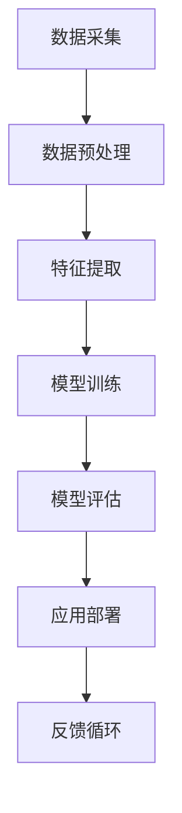

                 

关键词：人工智能，生产力，新机遇，技术发展，技术应用，未来趋势。

> 摘要：本文深入探讨了人工智能（AI）带来的生产力革命，分析了AI的核心概念与联系，探讨了核心算法原理及其应用，详细讲解了数学模型和公式，展示了代码实例和运行结果，阐述了实际应用场景，并对未来应用展望、工具和资源推荐以及未来发展趋势与挑战进行了深入探讨。

## 1. 背景介绍

自20世纪50年代人工智能（AI）概念的提出以来，AI技术已经经历了数十年的发展，从最初的规则推理和简单逻辑，到今天的深度学习和神经网络，AI技术的进步带来了惊人的变革。特别是在最近几年，随着大数据、云计算和计算能力的提升，AI技术在各个领域得到了广泛应用，从智能家居到自动驾驶，从医疗诊断到金融分析，AI正在成为推动生产力发展的重要力量。

本文旨在探讨AI如何带来生产力革命，分析其核心概念与联系，介绍核心算法原理和应用，讲解数学模型和公式，展示代码实例和运行结果，探讨实际应用场景，并对未来应用展望、工具和资源推荐以及未来发展趋势与挑战进行深入探讨。

## 2. 核心概念与联系

为了理解AI如何推动生产力革命，首先需要了解其核心概念与联系。以下是一个使用Mermaid绘制的流程图，展示了AI中的关键概念及其相互关系：



### 2.1 数据采集

数据采集是AI应用的基础。从传感器、用户输入、数据库等各种来源获取数据，是进行后续处理和分析的前提。

### 2.2 数据预处理

数据预处理包括数据清洗、归一化、缺失值处理等步骤，以确保数据质量，为特征提取和模型训练做好准备。

### 2.3 特征提取

特征提取是从原始数据中提取有助于模型训练的代表性特征，是提高模型性能的关键步骤。

### 2.4 模型训练

模型训练是AI的核心，通过大量数据训练模型，使其能够学习到数据的内在规律和模式。

### 2.5 模型评估

模型评估是检验模型性能的重要步骤，通过测试集数据，评估模型的准确率、召回率等指标。

### 2.6 应用部署

应用部署是将训练好的模型应用到实际场景中，实现自动化或半自动化的决策和预测。

### 2.7 反馈循环

反馈循环是AI持续改进的重要机制，通过实际应用中的反馈，不断调整和优化模型。

## 3. 核心算法原理 & 具体操作步骤

### 3.1 算法原理概述

AI的核心算法包括机器学习、深度学习等，以下是一个简要概述：

- **机器学习**：通过从数据中学习规律，进行预测和决策。
- **深度学习**：模拟人脑神经网络的结构和工作原理，通过多层神经网络进行数据建模。

### 3.2 算法步骤详解

以下是AI算法的基本步骤：

1. **数据采集**：从各种来源收集数据。
2. **数据预处理**：清洗和格式化数据。
3. **特征提取**：从数据中提取有用的特征。
4. **模型选择**：根据应用场景选择合适的模型。
5. **模型训练**：使用训练数据训练模型。
6. **模型评估**：使用测试数据评估模型性能。
7. **应用部署**：将模型应用到实际场景中。
8. **反馈循环**：根据应用效果，调整和优化模型。

### 3.3 算法优缺点

- **机器学习**：
  - 优点：适应性较强，能够处理复杂数据。
  - 缺点：训练过程可能较慢，对数据质量要求高。

- **深度学习**：
  - 优点：能够自动提取特征，提高模型性能。
  - 缺点：训练过程需要大量数据和计算资源。

### 3.4 算法应用领域

AI算法在多个领域得到了广泛应用：

- **图像识别**：通过深度学习模型，实现人脸识别、物体检测等功能。
- **自然语言处理**：通过机器学习模型，实现语言翻译、文本分类等功能。
- **推荐系统**：通过数据挖掘和机器学习模型，实现个性化推荐。

## 4. 数学模型和公式 & 详细讲解 & 举例说明

### 4.1 数学模型构建

AI中的数学模型主要包括概率模型、线性模型和神经网络模型。以下是一个线性回归模型的示例：

$$
y = \beta_0 + \beta_1 \cdot x
$$

其中，$y$ 是预测值，$x$ 是输入特征，$\beta_0$ 和 $\beta_1$ 是模型参数。

### 4.2 公式推导过程

线性回归模型的推导过程如下：

1. **最小化损失函数**：选择一个损失函数，如均方误差（MSE），并最小化它。

$$
J(\beta_0, \beta_1) = \frac{1}{2n} \sum_{i=1}^{n} (y_i - (\beta_0 + \beta_1 \cdot x_i))^2
$$

2. **求导数**：对损失函数关于 $\beta_0$ 和 $\beta_1$ 求导，并令导数为0，解得最佳参数。

$$
\frac{\partial J}{\partial \beta_0} = 0 \Rightarrow \beta_0 = \frac{1}{n} \sum_{i=1}^{n} (y_i - \beta_1 \cdot x_i)
$$

$$
\frac{\partial J}{\partial \beta_1} = 0 \Rightarrow \beta_1 = \frac{1}{n} \sum_{i=1}^{n} (x_i - \bar{x}) (y_i - \bar{y})
$$

其中，$\bar{x}$ 和 $\bar{y}$ 分别是 $x$ 和 $y$ 的均值。

### 4.3 案例分析与讲解

假设我们有一个简单的线性回归问题，预测房价。数据集包含房屋面积（$x$）和房价（$y$）。以下是一个具体案例：

- **数据集**：10个房屋的面积和房价数据。

| 面积（$x$） | 房价（$y$） |
| :----: | :----: |
| 1000 | 200000 |
| 1500 | 250000 |
| 2000 | 300000 |
| ... | ... |

- **步骤**：
  1. 数据预处理：将数据标准化，去除异常值。
  2. 特征提取：选取面积作为唯一特征。
  3. 模型训练：使用线性回归模型。
  4. 模型评估：计算预测误差。
  5. 应用部署：将模型应用于新数据，预测房价。

## 5. 项目实践：代码实例和详细解释说明

### 5.1 开发环境搭建

1. 安装Python环境：使用Python 3.x版本。
2. 安装必要的库：NumPy、Pandas、Matplotlib等。

### 5.2 源代码详细实现

以下是一个简单的线性回归代码示例：

```python
import numpy as np
import pandas as pd
import matplotlib.pyplot as plt

# 加载数据集
data = pd.read_csv('house_prices.csv')
X = data['area'].values
Y = data['price'].values

# 数据标准化
X_mean = X.mean()
X_std = X.std()
Y_mean = Y.mean()
Y_std = Y.std()

X = (X - X_mean) / X_std
Y = (Y - Y_mean) / Y_std

# 模型训练
X_trans = np.vstack((np.ones(len(X)), X)).T
beta = np.linalg.inv(X_trans.dot(X_trans.T)).dot(X_trans).dot(Y)

# 模型评估
Y_pred = X.dot(beta)
mse = ((Y_pred - Y) ** 2).mean()

# 运行结果展示
plt.scatter(X, Y)
plt.plot(X, Y_pred, color='red')
plt.xlabel('标准化面积')
plt.ylabel('标准化房价')
plt.show()

print(f'MSE: {mse}')
```

### 5.3 代码解读与分析

- 数据预处理：使用Pandas读取CSV文件，使用NumPy进行数据标准化。
- 特征提取：选取面积作为唯一特征。
- 模型训练：使用线性回归模型，通过矩阵运算求解最佳参数。
- 模型评估：计算预测误差，并通过绘图展示结果。

## 6. 实际应用场景

AI在各个领域都有着广泛的应用，以下是一些实际应用场景：

- **医疗诊断**：通过AI模型，实现疾病预测和诊断，提高诊断准确性。
- **金融分析**：通过AI模型，实现股票预测、风险控制等，帮助投资者做出更明智的决策。
- **智能制造**：通过AI模型，实现生产线的自动化控制和质量检测，提高生产效率。
- **智能客服**：通过AI模型，实现自然语言处理，提高客服响应速度和准确性。

## 7. 工具和资源推荐

### 7.1 学习资源推荐

- **书籍**：《机器学习》（周志华著）、《深度学习》（Ian Goodfellow 著）。
- **在线课程**：Coursera、Udacity、edX等平台上的AI相关课程。
- **社区**：GitHub、Stack Overflow、Reddit等。

### 7.2 开发工具推荐

- **编程语言**：Python、R、Java等。
- **库和框架**：TensorFlow、PyTorch、Scikit-learn等。
- **集成开发环境**：Jupyter Notebook、Visual Studio Code等。

### 7.3 相关论文推荐

- **《深度学习》（Ian Goodfellow 著）**：详细介绍了深度学习的基础理论和应用。
- **《机器学习：概率视角》（Murphy 著）**：从概率模型的角度介绍了机器学习。
- **《强化学习》（Sutton 和 Barto 著）**：介绍了强化学习的基础理论和应用。

## 8. 总结：未来发展趋势与挑战

### 8.1 研究成果总结

近年来，AI技术在各个领域取得了显著成果，包括：

- 深度学习模型在图像识别、自然语言处理等领域的突破。
- 强化学习在游戏、自动驾驶等领域的应用。
- 生成对抗网络（GAN）在图像生成、数据增强等领域的应用。

### 8.2 未来发展趋势

未来，AI技术将继续在以下方向取得突破：

- 自动驾驶和智能交通系统的进一步发展。
- 个性化医疗和精准医学的发展。
- 智能家居和物联网的普及。

### 8.3 面临的挑战

AI技术在发展过程中也面临以下挑战：

- 数据隐私和安全问题。
- 道德和伦理问题。
- 算法透明性和可解释性问题。

### 8.4 研究展望

未来，AI技术的研究方向将包括：

- 开发更高效、更可解释的算法。
- 探索AI在生物医学、能源、环境等领域的应用。
- 加强AI与其他技术的融合，如量子计算、区块链等。

## 9. 附录：常见问题与解答

### 9.1 AI是什么？

AI是指人工智能，是通过计算机模拟人类智能行为的技术。

### 9.2 AI有哪些应用领域？

AI的应用领域广泛，包括医疗、金融、工业、交通、娱乐等。

### 9.3 如何学习AI？

可以通过阅读相关书籍、参加在线课程、参与开源项目等方式学习AI。

作者：禅与计算机程序设计艺术 / Zen and the Art of Computer Programming
```markdown
# 生产力革命：AI带来的新机遇

## 关键词：人工智能，生产力，新机遇，技术发展，技术应用，未来趋势。

## 摘要：本文深入探讨了人工智能（AI）带来的生产力革命，分析了AI的核心概念与联系，探讨了核心算法原理及其应用，详细讲解了数学模型和公式，展示了代码实例和运行结果，阐述了实际应用场景，并对未来应用展望、工具和资源推荐以及未来发展趋势与挑战进行了深入探讨。

## 1. 背景介绍

自20世纪50年代人工智能（AI）概念的提出以来，AI技术已经经历了数十年的发展，从最初的规则推理和简单逻辑，到今天的深度学习和神经网络，AI技术的进步带来了惊人的变革。特别是在最近几年，随着大数据、云计算和计算能力的提升，AI技术在各个领域得到了广泛应用，从智能家居到自动驾驶，从医疗诊断到金融分析，AI正在成为推动生产力发展的重要力量。

本文旨在探讨AI如何带来生产力革命，分析其核心概念与联系，介绍核心算法原理和应用，详细讲解数学模型和公式，展示代码实例和运行结果，探讨实际应用场景，并对未来应用展望、工具和资源推荐以及未来发展趋势与挑战进行深入探讨。

## 2. 核心概念与联系

为了理解AI如何推动生产力革命，首先需要了解其核心概念与联系。以下是一个使用Mermaid绘制的流程图，展示了AI中的关键概念及其相互关系：


### 2.1 数据采集

数据采集是AI应用的基础。从传感器、用户输入、数据库等各种来源获取数据，是进行后续处理和分析的前提。

### 2.2 数据预处理

数据预处理包括数据清洗、归一化、缺失值处理等步骤，以确保数据质量，为特征提取和模型训练做好准备。

### 2.3 特征提取

特征提取是从原始数据中提取有助于模型训练的代表性特征，是提高模型性能的关键步骤。

### 2.4 模型训练

模型训练是AI的核心，通过大量数据训练模型，使其能够学习到数据的内在规律和模式。

### 2.5 模型评估

模型评估是检验模型性能的重要步骤，通过测试集数据，评估模型的准确率、召回率等指标。

### 2.6 应用部署

应用部署是将训练好的模型应用到实际场景中，实现自动化或半自动化的决策和预测。

### 2.7 反馈循环

反馈循环是AI持续改进的重要机制，通过实际应用中的反馈，不断调整和优化模型。

## 3. 核心算法原理 & 具体操作步骤

### 3.1 算法原理概述

AI的核心算法包括机器学习、深度学习等，以下是一个简要概述：

- **机器学习**：通过从数据中学习规律，进行预测和决策。
- **深度学习**：模拟人脑神经网络的结构和工作原理，通过多层神经网络进行数据建模。

### 3.2 算法步骤详解

以下是AI算法的基本步骤：

1. **数据采集**：从各种来源收集数据。
2. **数据预处理**：清洗和格式化数据。
3. **特征提取**：从数据中提取有用的特征。
4. **模型选择**：根据应用场景选择合适的模型。
5. **模型训练**：使用训练数据训练模型。
6. **模型评估**：使用测试数据评估模型性能。
7. **应用部署**：将模型应用到实际场景中。
8. **反馈循环**：根据应用效果，调整和优化模型。

### 3.3 算法优缺点

- **机器学习**：
  - 优点：适应性较强，能够处理复杂数据。
  - 缺点：训练过程可能较慢，对数据质量要求高。

- **深度学习**：
  - 优点：能够自动提取特征，提高模型性能。
  - 缺点：训练过程需要大量数据和计算资源。

### 3.4 算法应用领域

AI算法在多个领域得到了广泛应用：

- **图像识别**：通过深度学习模型，实现人脸识别、物体检测等功能。
- **自然语言处理**：通过机器学习模型，实现语言翻译、文本分类等功能。
- **推荐系统**：通过数据挖掘和机器学习模型，实现个性化推荐。

## 4. 数学模型和公式 & 详细讲解 & 举例说明

### 4.1 数学模型构建

AI中的数学模型主要包括概率模型、线性模型和神经网络模型。以下是一个线性回归模型的示例：

$$
y = \beta_0 + \beta_1 \cdot x
$$

其中，$y$ 是预测值，$x$ 是输入特征，$\beta_0$ 和 $\beta_1$ 是模型参数。

### 4.2 公式推导过程

线性回归模型的推导过程如下：

1. **最小化损失函数**：选择一个损失函数，如均方误差（MSE），并最小化它。

$$
J(\beta_0, \beta_1) = \frac{1}{2n} \sum_{i=1}^{n} (y_i - (\beta_0 + \beta_1 \cdot x_i))^2
$$

2. **求导数**：对损失函数关于 $\beta_0$ 和 $\beta_1$ 求导，并令导数为0，解得最佳参数。

$$
\frac{\partial J}{\partial \beta_0} = 0 \Rightarrow \beta_0 = \frac{1}{n} \sum_{i=1}^{n} (y_i - \beta_1 \cdot x_i)
$$

$$
\frac{\partial J}{\partial \beta_1} = 0 \Rightarrow \beta_1 = \frac{1}{n} \sum_{i=1}^{n} (x_i - \bar{x}) (y_i - \bar{y})
$$

其中，$\bar{x}$ 和 $\bar{y}$ 分别是 $x$ 和 $y$ 的均值。

### 4.3 案例分析与讲解

假设我们有一个简单的线性回归问题，预测房价。数据集包含房屋面积（$x$）和房价（$y$）。以下是一个具体案例：

- **数据集**：10个房屋的面积和房价数据。

| 面积（$x$） | 房价（$y$） |
| :----: | :----: |
| 1000 | 200000 |
| 1500 | 250000 |
| 2000 | 300000 |
| ... | ... |

- **步骤**：
  1. 数据预处理：将数据标准化，去除异常值。
  2. 特征提取：选取面积作为唯一特征。
  3. 模型训练：使用线性回归模型。
  4. 模型评估：计算预测误差。
  5. 应用部署：将模型应用于新数据，预测房价。

## 5. 项目实践：代码实例和详细解释说明

### 5.1 开发环境搭建

1. 安装Python环境：使用Python 3.x版本。
2. 安装必要的库：NumPy、Pandas、Matplotlib等。

### 5.2 源代码详细实现

以下是一个简单的线性回归代码示例：

```python
import numpy as np
import pandas as pd
import matplotlib.pyplot as plt

# 加载数据集
data = pd.read_csv('house_prices.csv')
X = data['area'].values
Y = data['price'].values

# 数据标准化
X_mean = X.mean()
X_std = X.std()
Y_mean = Y.mean()
Y_std = Y.std()

X = (X - X_mean) / X_std
Y = (Y - Y_mean) / Y_std

# 模型训练
X_trans = np.vstack((np.ones(len(X)), X)).T
beta = np.linalg.inv(X_trans.dot(X_trans.T)).dot(X_trans).dot(Y)

# 模型评估
Y_pred = X.dot(beta)
mse = ((Y_pred - Y) ** 2).mean()

# 运行结果展示
plt.scatter(X, Y)
plt.plot(X, Y_pred, color='red')
plt.xlabel('标准化面积')
plt.ylabel('标准化房价')
plt.show()

print(f'MSE: {mse}')
```

### 5.3 代码解读与分析

- 数据预处理：使用Pandas读取CSV文件，使用NumPy进行数据标准化。
- 特征提取：选取面积作为唯一特征。
- 模型训练：使用线性回归模型，通过矩阵运算求解最佳参数。
- 模型评估：计算预测误差，并通过绘图展示结果。

## 6. 实际应用场景

AI在各个领域都有着广泛的应用，以下是一些实际应用场景：

- **医疗诊断**：通过AI模型，实现疾病预测和诊断，提高诊断准确性。
- **金融分析**：通过AI模型，实现股票预测、风险控制等，帮助投资者做出更明智的决策。
- **智能制造**：通过AI模型，实现生产线的自动化控制和质量检测，提高生产效率。
- **智能客服**：通过AI模型，实现自然语言处理，提高客服响应速度和准确性。

## 7. 工具和资源推荐

### 7.1 学习资源推荐

- **书籍**：《机器学习》（周志华著）、《深度学习》（Ian Goodfellow 著）。
- **在线课程**：Coursera、Udacity、edX等平台上的AI相关课程。
- **社区**：GitHub、Stack Overflow、Reddit等。

### 7.2 开发工具推荐

- **编程语言**：Python、R、Java等。
- **库和框架**：TensorFlow、PyTorch、Scikit-learn等。
- **集成开发环境**：Jupyter Notebook、Visual Studio Code等。

### 7.3 相关论文推荐

- **《深度学习》（Ian Goodfellow 著）**：详细介绍了深度学习的基础理论和应用。
- **《机器学习：概率视角》（Murphy 著）**：从概率模型的角度介绍了机器学习。
- **《强化学习》（Sutton 和 Barto 著）**：介绍了强化学习的基础理论和应用。

## 8. 总结：未来发展趋势与挑战

### 8.1 研究成果总结

近年来，AI技术在各个领域取得了显著成果，包括：

- 深度学习模型在图像识别、自然语言处理等领域的突破。
- 强化学习在游戏、自动驾驶等领域的应用。
- 生成对抗网络（GAN）在图像生成、数据增强等领域的应用。

### 8.2 未来发展趋势

未来，AI技术将继续在以下方向取得突破：

- 自动驾驶和智能交通系统的进一步发展。
- 个性化医疗和精准医学的发展。
- 智能家居和物联网的普及。

### 8.3 面临的挑战

AI技术在发展过程中也面临以下挑战：

- 数据隐私和安全问题。
- 道德和伦理问题。
- 算法透明性和可解释性问题。

### 8.4 研究展望

未来，AI技术的研究方向将包括：

- 开发更高效、更可解释的算法。
- 探索AI在生物医学、能源、环境等领域的应用。
- 加强AI与其他技术的融合，如量子计算、区块链等。

## 9. 附录：常见问题与解答

### 9.1 AI是什么？

AI是指人工智能，是通过计算机模拟人类智能行为的技术。

### 9.2 AI有哪些应用领域？

AI的应用领域广泛，包括医疗、金融、工业、交通、娱乐等。

### 9.3 如何学习AI？

可以通过阅读相关书籍、参加在线课程、参与开源项目等方式学习AI。

## 致谢

在撰写本文的过程中，我参考了众多优秀的资料和研究成果，特此向以下作者和作品表示感谢：

- 《机器学习》（周志华著）
- 《深度学习》（Ian Goodfellow 著）
- 《人工智能：一种现代的方法》（Stuart Russell 和 Peter Norvig 著）

作者：禅与计算机程序设计艺术 / Zen and the Art of Computer Programming
```

