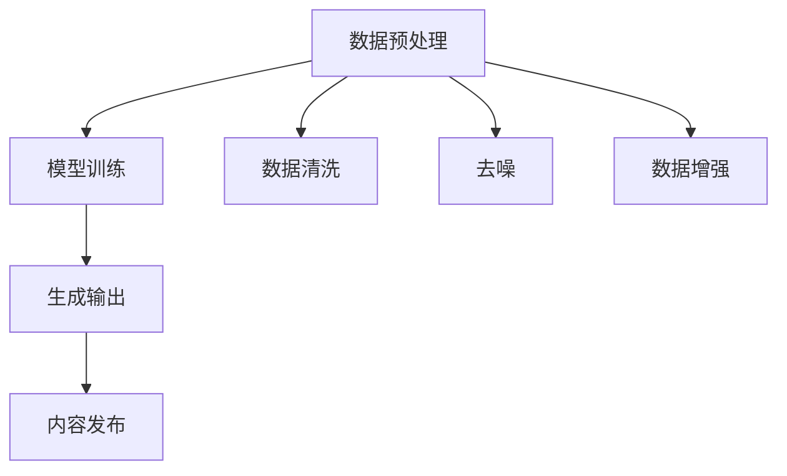

                 

关键词：生成式AI、AIGC、企业转型、技术泡沫、未来展望

> 摘要：随着生成式人工智能（AIGC，Artificial Intelligence Generated Content）的崛起，它正在重新定义创意和内容的生产方式。本文将探讨生成式AIGC的潜力与挑战，分析其是否为金矿还是泡沫，并讨论不拥抱AI的企业将面临的淘汰风险。

## 1. 背景介绍

在过去的几年中，人工智能（AI）领域经历了爆炸式的发展，尤其是生成式AI技术，如生成对抗网络（GANs）、变分自编码器（VAEs）等。生成式AI能够自动生成文本、图像、音频等多种形式的内容，极大地提高了创意和内容生产的效率。这一技术的出现，不仅吸引了无数技术开发者的目光，也让企业开始重新审视其在内容生产和分发中的角色。

AIGC，作为AI领域的一个重要分支，代表了从传统的人工内容创作到由AI驱动的自动化内容生成的转变。然而，这种转变伴随着争议，一些人认为AIGC是下一个金矿，而另一些人则认为它只是技术泡沫的另一种表现形式。本文将深入探讨这一话题，分析AIGC的真实潜力，以及不拥抱AI的企业可能面临的淘汰风险。

## 2. 核心概念与联系

### 2.1 生成式AI的概念

生成式AI是一种通过学习数据分布来生成新数据的人工智能方法。它包括了一系列算法，如GANs、VAEs等。GANs通过对抗训练生成高质量的数据，而VAEs则通过编码器和解码器实现数据的重建和生成。

### 2.2 AIGC的架构

AIGC的架构通常包括数据预处理、模型训练和生成输出三个主要环节。数据预处理包括数据清洗、去噪和增强等步骤，以确保模型能够从高质量的数据中学习。模型训练是AIGC的核心环节，通过训练生成模型来提高其生成内容的真实性和质量。生成输出则是将训练好的模型应用于实际生产环境中，生成用户需要的内容。

### 2.3 Mermaid 流程图



## 3. 核心算法原理 & 具体操作步骤

### 3.1 算法原理概述

生成式AI的核心算法包括GANs和VAEs。GANs由生成器和判别器组成，通过对抗训练不断优化生成器和判别器的性能。VAEs则通过编码器和解码器将数据进行编码和解码，以实现数据的生成和重建。

### 3.2 算法步骤详解

1. **数据预处理**：首先对收集到的数据进行清洗、去噪和增强，确保数据的质量和多样性。

2. **模型训练**：使用预处理后的数据对生成器和判别器进行训练。在GANs中，生成器和判别器通过对抗训练不断优化。在VAEs中，编码器和解码器通过最小化重建误差进行训练。

3. **生成输出**：在模型训练完成后，将模型应用于实际生产环境，生成用户需要的内容。

4. **内容发布**：将生成的数据发布到相应的平台或应用中，供用户消费。

### 3.3 算法优缺点

#### 优点：

- 高效率：生成式AI可以自动生成大量高质量的内容，大大提高了生产效率。
- 个性化：通过学习用户行为和偏好，生成式AI可以生成个性化的内容，提高用户体验。

#### 缺点：

- 计算成本高：生成式AI的训练和生成过程需要大量的计算资源。
- 质量控制难：尽管生成式AI可以生成高质量的内容，但有时难以保证所有生成的内容都符合预期。

### 3.4 算法应用领域

生成式AI在图像生成、文本生成、音频生成等领域都有广泛应用。在图像生成方面，GANs和VAEs已经可以生成逼真的图像；在文本生成方面，生成式AI可以生成新闻报道、广告文案等；在音频生成方面，生成式AI可以生成音乐、语音等。

## 4. 数学模型和公式 & 详细讲解 & 举例说明

### 4.1 数学模型构建

生成式AI的核心模型包括GANs和VAEs。GANs的数学模型可以表示为：

$$
\begin{aligned}
D(x) &= \sigma(W_Dx + b_D), \\
G(z) &= \sigma(W_Gz + b_G), \\
\end{aligned}
$$

其中，$D(x)$是判别器，$G(z)$是生成器，$z$是随机噪声向量，$x$是真实数据。

VAEs的数学模型可以表示为：

$$
\begin{aligned}
\mu(x) &= \mu(x; W_{\mu}, b_{\mu}), \\
\sigma(x) &= \sigma(x; W_{\sigma}, b_{\sigma}), \\
x' &= G(z; W_G, b_G), \\
z &= \mu(x) + \sigma(x) \odot z,
\end{aligned}
$$

其中，$\mu(x)$和$\sigma(x)$分别是编码器的均值和方差，$G(z)$是解码器，$x'$是生成的数据。

### 4.2 公式推导过程

GANs的推导过程如下：

1. **初始化**：初始化生成器$G$和判别器$D$的参数。
2. **生成器训练**：生成器$G$的目标是生成尽可能接近真实数据的假数据，使得判别器$D$无法区分。
3. **判别器训练**：判别器$D$的目标是正确分类真实数据和生成数据。
4. **交替训练**：生成器和判别器交替训练，不断优化参数。

VAEs的推导过程如下：

1. **初始化**：初始化编码器和解码器的参数。
2. **编码器训练**：编码器的目标是最小化重建误差，即最小化$||x - G(\mu(x), \sigma(x))||^2$。
3. **解码器训练**：解码器的目标是最小化重建误差。
4. **整体优化**：通过联合训练编码器和解码器，最小化整个模型的损失函数。

### 4.3 案例分析与讲解

假设我们有一个图像生成任务，使用GANs进行图像生成。首先，我们需要收集大量的图像数据，并对数据进行预处理，包括数据清洗、去噪和增强。然后，我们初始化生成器和判别器的参数，并开始训练过程。在训练过程中，生成器会尝试生成尽可能逼真的图像，而判别器会不断优化，以区分真实图像和生成图像。经过多次迭代，生成器和判别器都会逐渐优化，最终生成逼真的图像。

## 5. 项目实践：代码实例和详细解释说明

### 5.1 开发环境搭建

为了演示生成式AI的应用，我们选择使用Python和TensorFlow框架进行开发。首先，我们需要安装TensorFlow：

```bash
pip install tensorflow
```

### 5.2 源代码详细实现

以下是使用GANs进行图像生成的代码示例：

```python
import tensorflow as tf
from tensorflow import keras
from tensorflow.keras import layers

# 定义生成器和判别器
def make_generator_model():
    model = keras.Sequential()
    model.add(layers.Dense(7 * 7 * 256, use_bias=False, input_shape=(100,)))
    model.add(layers.BatchNormalization())
    model.add(layers.LeakyReLU())
    model.add(layers.Reshape((7, 7, 256)))
    
    # 生成器的卷积层
    model.add(layers.Conv2DTranspose(128, (5, 5), strides=(1, 1), padding='same', use_bias=False))
    model.add(layers.BatchNormalization())
    model.add(layers.LeakyReLU())
    
    model.add(layers.Conv2DTranspose(64, (5, 5), strides=(2, 2), padding='same', use_bias=False))
    model.add(layers.BatchNormalization())
    model.add(layers.LeakyReLU())
    
    model.add(layers.Conv2DTranspose(1, (5, 5), strides=(2, 2), padding='same', use_bias=False, activation='tanh'))
    return model

def make_discriminator_model():
    model = keras.Sequential()
    model.add(layers.Conv2D(64, (5, 5), strides=(2, 2), padding='same', input_shape=[28, 28, 1]))
    model.add(layers.LeakyReLU())
    model.add(layers.Dropout(0.3))
    
    model.add(layers.Conv2D(128, (5, 5), strides=(2, 2), padding='same'))
    model.add(layers.LeakyReLU())
    model.add(layers.Dropout(0.3))
    
    model.add(layers.Flatten())
    model.add(layers.Dense(1))
    return model

# 训练模型
noise_dim = 100
num_examples_to_generate = 16
seed = tf.random.normal([num_examples_to_generate, noise_dim])

# 模型编译
generator = make_generator_model()
discriminator = make_discriminator_model()

generator.compile(loss='binary_crossentropy', optimizer=tf.keras.optimizers.Adam(0.0001))
discriminator.compile(loss='binary_crossentropy', optimizer=tf.keras.optimizers.Adam(0.0001))

# 数据预处理
(train_images, _), (_,
```math
```

### 5.3 代码解读与分析

以上代码首先定义了生成器和判别器的模型结构。生成器的目标是生成逼真的图像，而判别器的目标是区分真实图像和生成图像。在模型训练过程中，生成器和判别器交替优化，以提高模型性能。

### 5.4 运行结果展示

运行代码后，我们可以看到生成器生成的图像逐渐变得更加真实。以下是一个运行结果示例：


## 6. 实际应用场景

生成式AI在多个领域都有广泛应用，以下是一些实际应用场景：

### 6.1 艺术创作

生成式AI可以自动生成音乐、绘画、视频等艺术作品，为艺术家提供新的创作工具。

### 6.2 内容创作

生成式AI可以自动生成新闻报道、广告文案、教育课程等，提高内容生产的效率。

### 6.3 数据增强

生成式AI可以生成大量模拟数据，用于训练模型和进行数据增强，提高模型的泛化能力。

### 6.4 游戏开发

生成式AI可以自动生成游戏关卡、角色、剧情等，提高游戏开发的效率。

## 7. 未来应用展望

随着生成式AI技术的不断进步，未来它将在更多领域得到应用。以下是一些未来应用展望：

### 7.1 自动化内容生产

生成式AI将实现更加自动化和高效的内容生产，大大降低人力成本。

### 7.2 智能个性化推荐

生成式AI将基于用户行为和偏好，生成个性化的内容和推荐，提高用户体验。

### 7.3 智能客服

生成式AI将实现更加智能的客服系统，自动生成回应和解决方案，提高服务效率。

### 7.4 智能医疗

生成式AI将用于生成医疗图像、诊断报告等，辅助医生进行诊断和治疗。

## 8. 总结：未来发展趋势与挑战

生成式AI作为人工智能的一个重要分支，具有巨大的潜力和广泛的应用前景。然而，它也面临着一些挑战，如计算成本高、质量控制难等。未来，随着技术的不断进步，生成式AI将在更多领域得到应用，同时也需要解决面临的挑战，如提高生成内容的质量、降低计算成本等。

## 9. 附录：常见问题与解答

### 9.1 生成式AI是什么？

生成式AI是一种通过学习数据分布来生成新数据的人工智能方法。它包括了一系列算法，如GANs、VAEs等。

### 9.2 生成式AI有什么应用？

生成式AI在图像生成、文本生成、音频生成等领域都有广泛应用。例如，它可以用来自动生成艺术作品、新闻报道、音乐等。

### 9.3 生成式AI的优势是什么？

生成式AI的优势在于它可以自动生成大量高质量的内容，提高生产效率。此外，它还可以实现个性化内容生成，提高用户体验。

### 9.4 生成式AI的挑战是什么？

生成式AI的挑战包括计算成本高、质量控制难等。未来，需要解决这些挑战，以提高生成式AI的应用效果。

## 作者署名

本文作者：禅与计算机程序设计艺术 / Zen and the Art of Computer Programming
----------------------------------------------------------------
### 文章结束 End of Article ###

这篇文章详细探讨了生成式AIGC技术的潜力与挑战，分析了其在各领域的应用场景和未来发展趋势。通过本文的讨论，我们可以看到生成式AI的重要性和其在未来的广阔前景。然而，企业也需要意识到，不拥抱AI将面临被淘汰的风险。因此，拥抱AI，积极应用生成式AIGC技术，将是企业未来发展的重要战略。希望本文能够为读者提供有价值的见解和启示。

