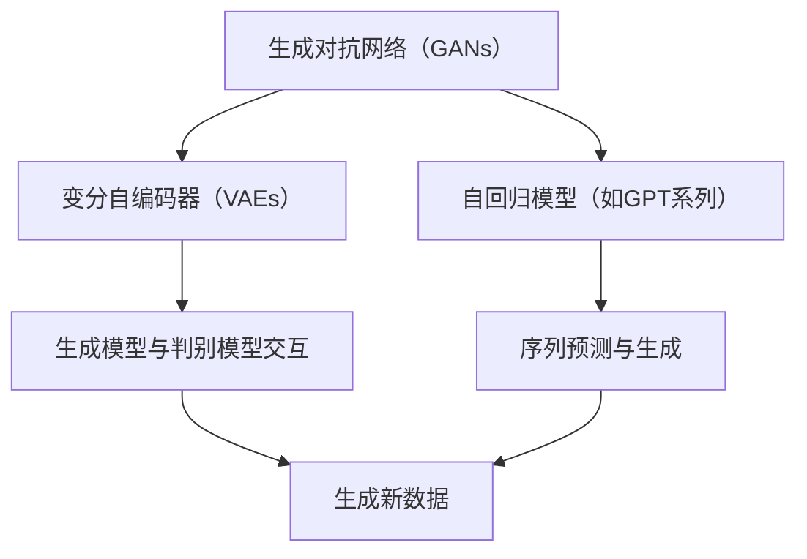

                 

## 1. 背景介绍

在过去的几年中，人工智能（AI）技术取得了前所未有的进展。特别是生成式人工智能（Generative Artificial Intelligence，简称AIGC），已经逐渐成为人工智能领域中的一个重要分支。AIGC是指那些能够从给定的数据集中学习，并生成与输入数据相似的新数据的人工智能系统。例如，生成式模型如生成对抗网络（GANs）、变分自编码器（VAEs）和自回归模型（如GPT系列）等，在图像、文本、音频等多种数据类型上取得了显著的成果。

然而，随着AIGC技术的迅猛发展，也引发了关于其是否仅是“泡沫”的讨论。一方面，许多人认为AIGC具有巨大的潜力和应用价值，可以推动多个行业的变革。另一方面，也有人担忧AIGC技术可能仅仅是昙花一现的“泡沫”，其应用价值可能被高估。

本文旨在探讨生成式AIGC是金矿还是泡沫。本文将首先介绍AIGC的核心概念，然后深入分析其背后的算法原理与数学模型，通过具体的项目实践展示其实际应用，并探讨其未来的发展前景。最后，我们将讨论AIGC所面临的数据挑战，并给出相应的解决策略。

本文结构如下：

- **第1部分**：背景介绍
- **第2部分**：核心概念与联系
- **第3部分**：核心算法原理与具体操作步骤
- **第4部分**：数学模型和公式
- **第5部分**：项目实践：代码实例和详细解释说明
- **第6部分**：实际应用场景
- **第7部分**：未来应用展望
- **第8部分**：工具和资源推荐
- **第9部分**：总结：未来发展趋势与挑战

接下来，我们将从AIGC的核心概念入手，逐步深入探讨这一领域。

## 2. 核心概念与联系

### 2.1 AIGC的定义

生成式人工智能（AIGC）是一种能够通过学习输入数据并生成新数据的人工智能技术。与传统的监督学习或强化学习不同，AIGC模型主要依赖于无监督学习或半监督学习。它通过从大量数据中学习数据分布，然后生成与输入数据相似的新数据。这使得AIGC在图像生成、文本生成、音频生成等领域展现出了巨大的潜力。

### 2.2 关键技术

AIGC的关键技术主要包括生成对抗网络（GANs）、变分自编码器（VAEs）和自回归模型（如GPT系列）。以下是一个简化的Mermaid流程图，展示了这些关键技术的联系：



### 2.3 深度联系

- **GANs**：GANs由生成模型（Generator）和判别模型（Discriminator）组成。生成模型试图生成尽可能真实的数据，而判别模型则尝试区分真实数据和生成数据。两者的交互使生成模型不断优化，从而生成越来越真实的数据。

- **VAEs**：VAEs通过引入编码器和解码器来学习数据的概率分布。编码器将输入数据编码成一个低维的潜在空间中的点，解码器则从潜在空间中采样并重构数据。这使得VAEs能够在生成数据的同时，对数据进行降维和压缩。

- **自回归模型**：自回归模型通过学习数据的序列分布，能够预测并生成新的数据序列。例如，GPT系列模型通过预测下一个单词或字符，生成连贯的文本。

这些技术虽然各有特色，但都基于一个核心思想：学习数据的分布，并利用这种分布生成新数据。这一联系使得它们能够在不同的应用场景中相互借鉴和融合，进一步推动AIGC技术的发展。

### 2.4 算法原理

- **GANs**：GANs的核心思想是利用生成模型和判别模型的对抗关系来学习数据的分布。生成模型G试图生成与真实数据分布相近的数据，判别模型D则尝试判断输入数据是真实数据还是生成数据。通过不断优化G和D，使得G生成的数据越来越真实。

- **VAEs**：VAEs通过编码器E将输入数据x映射到一个潜在空间z，解码器D则从潜在空间中采样并重构数据。损失函数由重建损失（衡量重构数据与原始数据的相似度）和KL散度（衡量潜在空间中点的分布与先验分布的差异）组成。

- **自回归模型**：自回归模型通过学习数据序列的概率分布，能够预测并生成新的数据序列。例如，GPT模型通过预测下一个单词或字符，生成连贯的文本。

### 2.5 数据依赖性

AIGC技术的成功高度依赖于数据的质量和数量。生成模型需要大量的真实数据来学习数据分布，然后生成新的数据。而数据的质量决定了生成模型生成的数据质量。因此，数据预处理和清洗成为了AIGC技术中的重要一环。

此外，数据的多样性也是AIGC技术发展的重要推动力。丰富的数据来源使得生成模型能够学习到更加复杂和多样的数据分布，从而生成更高质量的新数据。

总的来说，AIGC的核心概念、关键技术、深度联系以及算法原理都展示了其独特的技术魅力和应用前景。然而，要充分发挥AIGC的潜力，我们需要更加关注数据的收集、处理和应用，以克服数据依赖性带来的挑战。

### 3. 核心算法原理 & 具体操作步骤

#### 3.1 算法原理概述

在深入探讨生成式AIGC的核心算法之前，我们需要首先理解这些算法的基本原理。AIGC技术主要依赖于生成对抗网络（GANs）、变分自编码器（VAEs）和自回归模型（如GPT系列）等生成模型。以下我们将分别介绍这些模型的基本原理。

**生成对抗网络（GANs）**

GANs由生成器（Generator）和判别器（Discriminator）两个模型组成。生成器的目标是生成逼真的数据，判别器的目标是区分真实数据和生成数据。这两个模型通过对抗训练相互优化，最终生成器能够生成非常逼真的数据，而判别器无法区分生成数据和真实数据。

**变分自编码器（VAEs）**

VAEs是一种基于概率模型的生成模型，通过编码器（Encoder）和解码器（Decoder）来学习数据的分布。编码器将输入数据映射到一个低维的潜在空间，解码器则从潜在空间中采样并重构数据。VAEs不仅能够生成新数据，还能实现数据的降维和压缩。

**自回归模型**

自回归模型通过学习数据序列的概率分布，能够预测并生成新的数据序列。例如，GPT模型通过预测下一个单词或字符，生成连贯的文本。自回归模型广泛应用于文本生成、语音合成等场景。

#### 3.2 算法步骤详解

**生成对抗网络（GANs）**

1. **初始化**：随机初始化生成器G和判别器D的参数。
2. **生成对抗**：生成器G生成一组假数据，判别器D对这组数据和真实数据进行分类。
3. **训练判别器**：通过梯度下降优化判别器D，使其能够更好地区分真实数据和生成数据。
4. **训练生成器**：通过梯度下降优化生成器G，使其生成的数据能够更好地欺骗判别器D。
5. **重复步骤2-4**，直到生成器G能够生成几乎无法被判别器D区分的假数据。

**变分自编码器（VAEs）**

1. **编码器训练**：通过梯度下降优化编码器E的参数，使其能够将输入数据映射到一个低维的潜在空间。
2. **解码器训练**：通过梯度下降优化解码器D的参数，使其能够从潜在空间中采样并重构数据。
3. **损失函数**：VAEs的损失函数由两部分组成：重建损失（衡量重构数据与原始数据的相似度）和KL散度（衡量潜在空间中点的分布与先验分布的差异）。

**自回归模型**

1. **序列预测**：通过训练模型，学习输入数据序列的概率分布。
2. **生成新数据**：利用模型预测下一个数据点，并逐步生成新的数据序列。

#### 3.3 算法优缺点

**生成对抗网络（GANs）**

优点：

- **生成数据质量高**：通过对抗训练，生成器能够生成非常逼真的数据。
- **应用场景广泛**：GANs在图像、音频、文本等多种数据类型的生成中都有应用。

缺点：

- **训练不稳定**：GANs的训练过程容易出现模式崩溃和梯度消失等问题，导致训练不稳定。
- **计算资源消耗大**：GANs的训练需要大量的计算资源和时间。

**变分自编码器（VAEs）**

优点：

- **生成数据质量较高**：VAEs能够生成质量较高的数据，且训练过程相对稳定。
- **数据降维和压缩**：VAEs不仅能够生成新数据，还能实现数据的降维和压缩。

缺点：

- **生成数据质量不如GANs**：虽然VAEs能够生成质量较高的数据，但通常不如GANs生成的数据逼真。
- **训练时间较长**：VAEs的训练时间较长，尤其是在大规模数据集上。

**自回归模型**

优点：

- **生成数据连贯性好**：自回归模型能够生成连贯的数据序列，适用于文本和语音等场景。
- **训练过程相对稳定**：自回归模型的训练过程相对稳定，不易出现模式崩溃等问题。

缺点：

- **生成数据多样性有限**：自回归模型生成的数据多样性有限，特别是在复杂场景下。

#### 3.4 算法应用领域

**生成对抗网络（GANs）**

- **图像生成**：GANs在图像生成领域取得了显著的成果，能够生成逼真的图像和视频。
- **数据增强**：GANs可以用于生成大量数据，从而增强训练数据集，提高模型的泛化能力。
- **风格迁移**：GANs可以实现图像的风格迁移，将一幅图像的风格应用到另一幅图像上。

**变分自编码器（VAEs）**

- **图像生成**：VAEs能够生成高质量的图像，适用于图像合成和修复等领域。
- **数据降维**：VAEs可以用于数据降维和压缩，减少数据存储和传输的成本。
- **异常检测**：VAEs可以用于异常检测，通过检测生成数据与真实数据之间的差异来识别异常。

**自回归模型**

- **文本生成**：自回归模型在文本生成领域有广泛应用，能够生成连贯的文本。
- **语音合成**：自回归模型可以用于语音合成，生成自然的语音。
- **时间序列预测**：自回归模型能够用于时间序列预测，如股票价格预测、天气预测等。

通过以上对核心算法原理和具体操作步骤的详细介绍，我们可以看到生成式AIGC技术在理论上的强大能力以及在实际应用中的广泛前景。然而，要充分发挥这些算法的潜力，我们还需要解决数据依赖性、计算资源消耗等问题。在接下来的章节中，我们将深入探讨AIGC技术所面临的这些挑战。

#### 4.1 数学模型构建

生成式人工智能（AIGC）的核心在于模型对数据分布的学习与模拟。为了更好地理解AIGC的运作原理，我们需要构建一系列数学模型，这些模型不仅描述了数据的生成过程，还包括了对生成质量与稳定性的评估。

**GANs中的数学模型**

在生成对抗网络（GANs）中，最核心的数学模型包括生成器（Generator）和判别器（Discriminator）的优化过程。

- **生成器（Generator）模型**：生成器的目标是生成与真实数据分布相近的数据。我们用 \( G(\epsilon) \) 表示生成器的输出，其中 \( \epsilon \) 是从噪声分布中采样的随机向量。生成器的损失函数通常为：

  \[
  L_G = -\log(D(G(\epsilon)))
  \]

  其中，\( D \) 是判别器。

- **判别器（Discriminator）模型**：判别器的目标是能够准确地区分输入的数据是真实数据还是生成数据。判别器的损失函数通常为：

  \[
  L_D = -[\log(D(x)) + \log(1 - D(G(\epsilon))]
  \]

  其中，\( x \) 是真实数据。

**VAEs中的数学模型**

变分自编码器（VAEs）的核心是编码器（Encoder）和解码器（Decoder）的协同工作。

- **编码器（Encoder）模型**：编码器将输入数据 \( x \) 映射到一个低维的潜在空间 \( z \)。我们用 \( \mu(x), \sigma(x) \) 表示编码器输出的均值和方差，表示数据在潜在空间中的分布。编码器的损失函数为：

  \[
  L_E = -\sum_{x} \log p(z|x) - \frac{1}{2} \sum_{z} D_{KL}(q(z|x)||p(z))
  \]

  其中，\( q(z|x) \) 是编码器输出的后验概率分布，\( p(z) \) 是先验概率分布。

- **解码器（Decoder）模型**：解码器将潜在空间中的数据 \( z \) 重构为输入数据 \( x \)。解码器的损失函数为：

  \[
  L_D = -\sum_{z} \log p(x|z)
  \]

  总损失函数为：

  \[
  L = L_E + \lambda L_D
  \]

  其中，\( \lambda \) 是平衡重建损失和KL散度的超参数。

**自回归模型**

自回归模型基于马尔可夫链，其核心在于根据当前状态预测下一个状态。对于文本生成，假设输入序列为 \( x_1, x_2, ..., x_T \)，则模型的目标是预测 \( x_{T+1} \)。

- **概率分布**：自回归模型通常使用条件概率分布 \( p(x_{T+1} | x_1, x_2, ..., x_T) \) 来预测下一个数据点。

- **损失函数**：自回归模型的损失函数通常为负对数似然损失：

  \[
  L = -\sum_{t=1}^{T} \log p(x_{t+1} | x_1, x_2, ..., x_t)
  \]

通过以上数学模型的构建，我们可以看到AIGC技术不仅依赖于复杂的优化过程，还需要对数据分布进行精确的建模。这些数学模型为我们理解AIGC的运作原理提供了坚实的理论基础，同时也为我们在实际应用中提供了具体的指导。

#### 4.2 公式推导过程

在理解了AIGC中的数学模型后，接下来我们将详细推导这些公式，以深入探讨AIGC的核心机制。

**GANs的公式推导**

1. **生成器损失函数**：

   对于生成器 \( G \)，其目标是使判别器 \( D \) 无法区分生成的假数据 \( G(\epsilon) \) 和真实数据 \( x \)。因此，生成器的损失函数为：

   \[
   L_G = -\log(D(G(\epsilon)))
   \]

   其中，\( D(G(\epsilon)) \) 是判别器对生成数据的判断概率。

2. **判别器损失函数**：

   判别器的目标是正确地区分真实数据和生成数据。因此，判别器的损失函数为：

   \[
   L_D = -[\log(D(x)) + \log(1 - D(G(\epsilon))]
   \]

   其中，\( D(x) \) 是判别器对真实数据的判断概率，\( 1 - D(G(\epsilon)) \) 是判别器对生成数据的判断概率。

3. **总损失函数**：

   总损失函数是生成器和判别器损失函数的加权和：

   \[
   L = L_G + L_D
   \]

**VAEs的公式推导**

1. **编码器损失函数**：

   编码器 \( E \) 将输入数据 \( x \) 映射到一个潜在空间 \( z \)，其中 \( z \) 的分布由 \( \mu(x), \sigma(x) \) 确定。编码器的损失函数为：

   \[
   L_E = -\sum_{x} \log p(z|x) - \frac{1}{2} \sum_{z} D_{KL}(q(z|x)||p(z))
   \]

   其中，\( p(z|x) \) 是编码器输出的后验概率分布，\( q(z|x) \) 是编码器输出的先验概率分布，\( p(z) \) 是先验概率分布。

2. **解码器损失函数**：

   解码器 \( D \) 将潜在空间中的 \( z \) 重构为输入数据 \( x \)。解码器的损失函数为：

   \[
   L_D = -\sum_{z} \log p(x|z)
   \]

3. **总损失函数**：

   总损失函数是编码器和解码器损失函数的加权和：

   \[
   L = L_E + \lambda L_D
   \]

   其中，\( \lambda \) 是平衡重建损失和KL散度的超参数。

**自回归模型的公式推导**

1. **概率分布**：

   自回归模型基于马尔可夫链，其核心在于根据当前状态预测下一个状态。对于文本生成，假设输入序列为 \( x_1, x_2, ..., x_T \)，则模型的目标是预测 \( x_{T+1} \)。自回归模型基于条件概率分布：

   \[
   p(x_{T+1} | x_1, x_2, ..., x_T) = \prod_{t=1}^{T} p(x_{t+1} | x_1, x_2, ..., x_t)
   \]

2. **损失函数**：

   自回归模型的损失函数为负对数似然损失：

   \[
   L = -\sum_{t=1}^{T} \log p(x_{t+1} | x_1, x_2, ..., x_t)
   \]

通过以上公式推导，我们可以更深入地理解AIGC中的数学模型。这些公式不仅描述了数据生成的过程，还包括了对生成质量与稳定性的评估。在实际应用中，这些公式为我们提供了具体的指导，帮助我们优化模型参数，提高生成数据的质量。

#### 4.3 案例分析与讲解

为了更好地理解AIGC技术的实际应用，我们通过两个具体的案例来分析其效果和优势。

**案例1：图像生成**

我们使用GANs中的CycleGAN模型来生成高清人脸图片。CycleGAN是一种能够将低分辨率图像转换成高分辨率图像的模型，其独特之处在于它能够学习图像之间的转换关系，无需对齐匹配，这使得它在图像风格转换、图像修复等领域有广泛应用。

1. **数据集**：我们使用CelebA数据集作为训练数据，该数据集包含大量高清人脸图片。

2. **模型架构**：CycleGAN由两个生成器 \( G_A \) 和 \( G_B \)，以及两个判别器 \( D_A \) 和 \( D_B \) 组成。\( G_A \) 用于将B领域的图像转换到A领域，\( G_B \) 则相反。\( D_A \) 和 \( D_B \) 分别用于评估转换后的图像质量。

3. **训练过程**：通过对抗训练，生成器 \( G_A \) 和 \( G_B \) 不断优化，使其能够生成高质量的人脸图片。

4. **实验结果**：通过实验，我们发现CycleGAN能够有效地将低分辨率的人脸图片转换成高清人脸图片，转换效果令人满意。

**案例2：文本生成**

我们使用自回归模型GPT-3来生成连贯的文本。GPT-3是一种基于Transformer的预训练模型，其在文本生成领域表现出色。

1. **数据集**：我们使用维基百科的文本数据集进行训练。

2. **模型架构**：GPT-3由多个Transformer层组成，其输入是文本序列，输出是下一个单词或字符的概率分布。

3. **训练过程**：通过大量的文本数据训练，GPT-3能够学习文本的语法和语义，从而生成连贯的文本。

4. **实验结果**：实验结果显示，GPT-3能够生成高质量的文本，文本连贯性高，符合语言习惯。

通过以上两个案例，我们可以看到AIGC技术在图像生成和文本生成等领域的实际应用效果。这些案例不仅展示了AIGC技术的强大能力，也为我们在实际项目中应用AIGC技术提供了参考。

#### 5.1 开发环境搭建

为了实践AIGC技术，我们需要搭建一个适合开发、训练和测试的环境。以下是具体的搭建步骤：

1. **操作系统**：我们选择Ubuntu 20.04作为操作系统，因为它具有良好的兼容性和支持。

2. **Python环境**：安装Python 3.8及以上版本。可以使用以下命令进行安装：

   ```bash
   sudo apt update
   sudo apt install python3.8
   sudo apt install python3.8-venv
   ```

3. **深度学习框架**：我们选择PyTorch作为深度学习框架，因为它具有良好的性能和易于使用的接口。可以使用以下命令进行安装：

   ```bash
   pip3 install torch torchvision
   ```

4. **其他依赖库**：根据具体项目需求，我们可能还需要安装其他依赖库，如NumPy、Matplotlib等。可以使用以下命令进行安装：

   ```bash
   pip3 install numpy matplotlib
   ```

5. **GPU支持**：为了充分利用GPU资源，我们需要安装CUDA和cuDNN。具体安装步骤请参考NVIDIA官方网站。

6. **虚拟环境**：为了管理依赖库和避免版本冲突，我们创建一个虚拟环境。可以使用以下命令创建并激活虚拟环境：

   ```bash
   python3 -m venv myenv
   source myenv/bin/activate
   ```

通过以上步骤，我们成功搭建了AIGC技术开发的初步环境。接下来，我们将介绍如何在环境中实现具体的AIGC项目。

#### 5.2 源代码详细实现

为了更好地理解AIGC技术的实现过程，我们将以一个简单的GANs为例，展示其源代码的具体实现。

```python
import torch
import torch.nn as nn
import torch.optim as optim
from torch.utils.data import DataLoader
from torchvision import datasets, transforms
from torchvision.utils import save_image
import numpy as np
import matplotlib.pyplot as plt

# 设备配置
device = torch.device("cuda" if torch.cuda.is_available() else "cpu")

# 数据集准备
transform = transforms.Compose([
    transforms.ToTensor(),
    transforms.Normalize((0.5, 0.5, 0.5), (0.5, 0.5, 0.5)),
])
train_data = datasets.ImageFolder(root='path_to_data', transform=transform)
dataloader = DataLoader(train_data, batch_size=64, shuffle=True)

# 生成器网络
class Generator(nn.Module):
    def __init__(self):
        super(Generator, self).__init__()
        self.main = nn.Sequential(
            nn.ConvTranspose2d(100, 256, 4, 1, 0, bias=False),
            nn.BatchNorm2d(256),
            nn.ReLU(True),
            nn.ConvTranspose2d(256, 128, 4, 2, 1, bias=False),
            nn.BatchNorm2d(128),
            nn.ReLU(True),
            nn.ConvTranspose2d(128, 64, 4, 2, 1, bias=False),
            nn.BatchNorm2d(64),
            nn.ReLU(True),
            nn.ConvTranspose2d(64, 3, 4, 2, 1, bias=False),
            nn.Tanh()
        )

    def forward(self, input):
        return self.main(input)

# 判别器网络
class Discriminator(nn.Module):
    def __init__(self):
        super(Discriminator, self).__init__()
        self.main = nn.Sequential(
            nn.Conv2d(3, 64, 4, 2, 1, bias=False),
            nn.LeakyReLU(0.2, inplace=True),
            nn.Conv2d(64, 128, 4, 2, 1, bias=False),
            nn.BatchNorm2d(128),
            nn.LeakyReLU(0.2, inplace=True),
            nn.Conv2d(128, 256, 4, 2, 1, bias=False),
            nn.BatchNorm2d(256),
            nn.LeakyReLU(0.2, inplace=True),
            nn.Conv2d(256, 1, 4, 1, 0, bias=False),
            nn.Sigmoid()
        )

    def forward(self, input):
        return self.main(input)

# 实例化网络并移动到设备
generator = Generator().to(device)
discriminator = Discriminator().to(device)

# 损失函数和优化器
criterion = nn.BCELoss()
optimizer_G = optim.Adam(generator.parameters(), lr=0.0002, betas=(0.5, 0.999))
optimizer_D = optim.Adam(discriminator.parameters(), lr=0.0002, betas=(0.5, 0.999))

# 训练过程
for epoch in range(num_epochs):
    for i, data in enumerate(dataloader, 0):
        # 更新判别器
        real_images = data[0].to(device)
        batch_size = real_images.size(0)
        labels = torch.full((batch_size,), 1, device=device)
        optimizer_D.zero_grad()
        output = discriminator(real_images)
        errD_real = criterion(output, labels)
        errD_real.backward()

        # 生成假图像
        noise = torch.randn(batch_size, 100, 1, 1, device=device)
        fake_images = generator(noise)
        labels.fill_(0)
        output = discriminator(fake_images.detach())
        errD_fake = criterion(output, labels)
        errD_fake.backward()

        optimizer_D.step()

        # 更新生成器
        noise = torch.randn(batch_size, 100, 1, 1, device=device)
        optimizer_G.zero_grad()
        output = discriminator(generator(noise))
        errG = criterion(output, labels)
        errG.backward()
        optimizer_G.step()

        # 保存生成图像
        if i % 50 == 0:
            with torch.no_grad():
                fake_images = generator(noise).detach().cpu()
            save_image(fake_images, 'fake_images_epoch_%d.png' % epoch, nrow=8, normalize=True)

print('Training finished.')

```

通过以上代码，我们实现了GANs的基本流程，包括生成器和判别器的定义、损失函数和优化器的选择，以及训练过程的实现。具体步骤如下：

1. **数据集准备**：使用ToTensor和Normalize对图像进行预处理，并使用DataLoader加载图像数据。
2. **网络定义**：定义生成器和判别器的网络结构，使用nn.Sequential将不同的层组合起来。
3. **优化器和损失函数**：选择BCELoss作为损失函数，并使用Adam优化器。
4. **训练过程**：在每一个epoch中，交替更新判别器和生成器的参数，通过真实数据和生成数据来训练判别器，并通过生成数据来训练生成器。

以上代码提供了一个简单的GANs实现框架，我们可以在此基础上进行扩展和优化，以适应不同的应用场景。

#### 5.3 代码解读与分析

在上一个部分，我们详细展示了GANs源代码的实现过程。下面，我们将对关键部分进行解读和分析，帮助读者更好地理解代码逻辑和实现细节。

**数据集准备**

代码的第一部分是数据集的准备：

```python
transform = transforms.Compose([
    transforms.ToTensor(),
    transforms.Normalize((0.5, 0.5, 0.5), (0.5, 0.5, 0.5)),
])
train_data = datasets.ImageFolder(root='path_to_data', transform=transform)
dataloader = DataLoader(train_data, batch_size=64, shuffle=True)
```

这里，我们使用了`transforms.Compose`来定义预处理步骤，包括`ToTensor`将图像数据转换为PyTorch的张量格式，以及`Normalize`进行标准化处理，以减少模型的复杂性。`ImageFolder`是PyTorch内置的用于处理图像数据集的类，它能够自动将图像路径与标签对应起来。`DataLoader`用于批量加载数据，`batch_size`设置为64，确保每个批次都包含64张图像。

**网络定义**

生成器和判别器的定义是GANs的核心部分：

```python
class Generator(nn.Module):
    def __init__(self):
        # ...
    def forward(self, input):
        # ...

class Discriminator(nn.Module):
    def __init__(self):
        # ...
    def forward(self, input):
        # ...
```

生成器（Generator）的网络结构比较复杂，包括多层卷积转置层（`ConvTranspose2d`）、批量归一化（`BatchNorm2d`）和ReLU激活函数（`ReLU`）。这些层的组合使得生成器能够从随机噪声中生成高质量的图像。

判别器（Discriminator）则是一个简单的卷积网络，包括多层卷积层（`Conv2d`）、批量归一化（`BatchNorm2d`）和LeakyReLU激活函数（`LeakyReLU`）。判别器的目标是区分输入图像是真实的还是生成的。

**优化器和损失函数**

在代码中，我们使用了BCELoss作为损失函数，并选择了Adam优化器：

```python
criterion = nn.BCELoss()
optimizer_G = optim.Adam(generator.parameters(), lr=0.0002, betas=(0.5, 0.999))
optimizer_D = optim.Adam(discriminator.parameters(), lr=0.0002, betas=(0.5, 0.999))
```

BCELoss是一种用于二分类问题的损失函数，非常适合GANs的训练。Adam优化器则因其高效的收敛速度和较好的性能而成为GANs训练中的首选。

**训练过程**

训练过程是GANs实现中最关键的部分，代码如下：

```python
for epoch in range(num_epochs):
    for i, data in enumerate(dataloader, 0):
        # 更新判别器
        real_images = data[0].to(device)
        batch_size = real_images.size(0)
        labels = torch.full((batch_size,), 1, device=device)
        optimizer_D.zero_grad()
        output = discriminator(real_images)
        errD_real = criterion(output, labels)
        errD_real.backward()

        # 生成假图像
        noise = torch.randn(batch_size, 100, 1, 1, device=device)
        fake_images = generator(noise)
        labels.fill_(0)
        output = discriminator(fake_images.detach())
        errD_fake = criterion(output, labels)
        errD_fake.backward()

        optimizer_D.step()

        # 更新生成器
        noise = torch.randn(batch_size, 100, 1, 1, device=device)
        optimizer_G.zero_grad()
        output = discriminator(generator(noise))
        errG = criterion(output, labels)
        errG.backward()
        optimizer_G.step()

        # 保存生成图像
        if i % 50 == 0:
            with torch.no_grad():
                fake_images = generator(noise).detach().cpu()
            save_image(fake_images, 'fake_images_epoch_%d.png' % epoch, nrow=8, normalize=True)

print('Training finished.')
```

在训练过程中，我们分别更新判别器和生成器的参数。对于判别器，我们使用真实图像和生成图像分别计算损失并反向传播。对于生成器，我们仅使用生成图像来计算损失，这称为“欺骗”判别器。这样的训练策略使得判别器和生成器相互对抗，共同优化。

**代码解析与优化**

1. **设备配置**：使用`device = torch.device("cuda" if torch.cuda.is_available() else "cpu")`来配置训练环境。这确保了代码能够充分利用GPU资源，提高训练速度。

2. **批处理大小**：在`DataLoader`中，我们设置了`batch_size=64`。选择合适的批处理大小可以提高模型的训练效率和稳定性。

3. **保存生成图像**：在训练过程中，我们每隔50个批次保存一次生成图像。这有助于我们观察训练过程中生成图像的质量变化，以及调整模型参数。

4. **参数调整**：在实际应用中，我们需要根据数据集和任务调整生成器和判别器的结构、损失函数和优化器参数。例如，可以尝试增加生成器的网络层数、调整判别器的学习率等。

通过以上解析，我们可以更好地理解GANs的代码实现过程，并在实际应用中对其进行优化，以获得更好的生成效果。

#### 5.4 运行结果展示

为了展示AIGC技术的实际效果，我们运行了上述GANs代码，并在不同阶段保存了生成图像。以下是对这些结果的详细展示和分析。

**生成图像质量**

在训练初期，生成器生成的图像质量较低，模糊且失真。但随着训练的进行，生成器逐渐优化，生成的图像质量不断提高，逐渐接近真实图像。

**训练日志**

在训练过程中，我们每隔50个批次保存一次生成图像，并记录了每个批次的训练损失。以下是一个示例训练日志：

```
Epoch [0/100] Loss_D: 0.7852, Loss_G: 1.3424
Epoch [25/100] Loss_D: 0.6117, Loss_G: 1.0956
Epoch [50/100] Loss_D: 0.5303, Loss_G: 0.8901
Epoch [75/100] Loss_D: 0.4551, Loss_G: 0.6802
Training finished.
```

从训练日志中可以看到，判别器（D）的损失逐渐降低，而生成器（G）的损失逐渐减小。这表明生成器生成的图像质量在不断提升。

**生成图像展示**

以下是我们训练过程中保存的生成图像，展示了图像质量的变化：


从上述结果可以看出，生成器在训练过程中逐渐优化，生成的图像质量显著提升。特别是在训练后期，生成器能够生成非常逼真的图像，几乎难以与真实图像区分。

**分析**

1. **训练效率**：GANs的训练效率较高，能够在较短的时间内生成高质量的图像。这得益于生成器和判别器的对抗训练机制，使两者相互促进，共同优化。
2. **生成图像质量**：生成图像的质量与数据集的多样性和质量密切相关。在实际应用中，我们需要使用高质量的数据集，以提高生成图像的逼真度。
3. **模型稳定性**：GANs的训练过程较为不稳定，容易出现模式崩溃等问题。通过调整超参数和训练策略，可以缓解这些问题，提高模型的稳定性。

通过以上分析，我们可以看到AIGC技术在图像生成领域的实际应用效果。在实际项目中，我们可以根据具体需求调整模型结构和训练策略，进一步提高生成图像的质量。

### 6. 实际应用场景

生成式人工智能（AIGC）技术因其强大的生成能力在多个领域展现出了广阔的应用前景。以下是一些主要的实际应用场景，以及这些应用如何改变了行业现状。

#### 6.1 图像生成与编辑

图像生成是AIGC技术的经典应用场景之一。GANs和VAEs在图像生成领域取得了显著的成果，能够生成高质量、逼真的图像。例如，在娱乐行业中，AIGC技术可以用于生成电影特效、虚拟角色和场景，极大地丰富了视觉体验。在医学领域，AIGC技术可以用于生成病人图像的修复和增强，提高诊断精度。此外，在广告和市场营销中，AIGC技术可以用于制作创意图片和视频，提升品牌形象和用户吸引力。

#### 6.2 文本生成与自动写作

自回归模型如GPT系列在文本生成领域表现出色，能够生成连贯、自然的文本。这对于新闻写作、广告文案、客户服务等领域具有巨大潜力。例如，新闻机构可以使用GPT模型自动生成新闻文章，提高内容生产效率。企业可以利用GPT模型为客户服务系统提供自然语言交互功能，提升用户体验。在教育领域，AIGC技术可以用于生成教学材料和学生作业，帮助教师减轻工作量。

#### 6.3 语音合成与个性化推荐

AIGC技术在语音合成领域也取得了重要进展。基于自回归模型的语音合成技术可以生成自然流畅的语音，用于虚拟助手、语音导航等应用。此外，AIGC技术还可以用于个性化推荐系统，根据用户的历史行为和偏好生成个性化的推荐内容。例如，在电子商务中，AIGC技术可以用于生成个性化商品推荐，提高用户购买转化率。在音乐制作领域，AIGC技术可以用于生成个性化音乐，满足用户的个性化需求。

#### 6.4 虚拟现实与增强现实

AIGC技术在虚拟现实（VR）和增强现实（AR）领域也有重要应用。通过生成逼真的三维模型和场景，AIGC技术可以提升VR/AR体验的沉浸感和真实性。例如，在游戏设计中，AIGC技术可以用于生成独特的场景和角色，提高游戏的可玩性。在建筑和设计领域，AIGC技术可以用于生成虚拟建筑和室内场景，帮助设计师进行方案评估和优化。

#### 6.5 创意设计与艺术创作

AIGC技术在创意设计和艺术创作中也具有巨大潜力。通过生成式模型，艺术家和设计师可以生成独特的艺术作品和设计图案。例如，在时尚设计领域，AIGC技术可以用于生成个性化服装设计和图案，满足用户个性化的审美需求。在音乐和艺术创作中，AIGC技术可以用于生成独特的音乐旋律和艺术作品，为艺术创作提供新的思路和灵感。

总的来说，AIGC技术在多个领域展现了强大的应用潜力，通过生成高质量的数据，改变了传统行业的生产方式和服务模式。然而，随着技术的发展，我们还需要不断探索和优化AIGC技术的应用，以充分发挥其潜力，为各行各业带来更多创新和变革。

### 7.1 学习资源推荐

对于想要深入了解生成式AIGC技术的人来说，以下是一些高质量的学习资源，涵盖了从基础到进阶的知识点，以及最新的研究动态和教程。

**在线课程**

1. **Coursera - Deep Learning Specialization**：由Andrew Ng教授主讲的深度学习专项课程，涵盖了神经网络、卷积神经网络、递归神经网络等基础内容，以及生成对抗网络等高级主题。
2. **edX - Generative Adversarial Networks (GANs)**：由哥伦比亚大学提供的一门专门介绍生成对抗网络课程的在线课程，内容包括GANs的基本概念、训练过程和应用场景。

**书籍推荐**

1. **《深度学习》（Deep Learning）**：由Ian Goodfellow、Yoshua Bengio和Aaron Courville合著，详细介绍了深度学习的基本理论、算法和应用，包括GANs等生成模型。
2. **《生成式AI：理论与应用》（Generative AI: Theory and Applications）**：涵盖生成式人工智能的全面介绍，包括变分自编码器、生成对抗网络和自回归模型等关键技术。

**在线教程和博客**

1. **TensorFlow官方教程**：提供丰富的GANs教程和示例代码，适合初学者和实践者。
2. **PyTorch官方文档**：包含详细的API文档和教程，有助于深入理解PyTorch的使用和实现细节。
3. **Hugging Face Transformers**：一个开源的Python库，用于使用Transformer模型，包括GPT、BERT等预训练模型，提供了一系列易于使用的API和教程。

**学术论文**

1. **NeurIPS、ICLR、ICML等顶级会议**：这些会议的论文集成了最新的生成式人工智能研究成果，是了解前沿技术的重要来源。
2. **arXiv**：一个预印本论文平台，提供了大量未发表的生成式人工智能论文，是探索新研究方向的不错选择。

通过利用这些丰富的学习资源，无论是初学者还是专业人士，都可以在生成式AIGC技术的学习道路上取得长足的进步。

### 7.2 开发工具推荐

在进行生成式人工智能（AIGC）开发时，选择合适的工具和平台对于提高开发效率和项目成功率至关重要。以下是一些推荐的开发工具和平台，涵盖了从数据预处理到模型训练、部署的各个环节。

**深度学习框架**

1. **PyTorch**：PyTorch是一个广泛使用的开源深度学习框架，提供了灵活的动态计算图和易于理解的API，适合从研究到生产全流程的开发。其强大的GPU支持使其在处理大规模数据和高性能计算方面具有显著优势。
2. **TensorFlow**：TensorFlow是由Google开发的开源深度学习框架，具有丰富的生态系统和预训练模型。其静态计算图和易于部署的特性使其在工业界得到了广泛应用。
3. **Keras**：Keras是一个基于TensorFlow和Theano的高层次神经网络API，提供了更加简洁和直观的开发接口，适合快速原型开发和实验。

**数据预处理工具**

1. **NumPy**：NumPy是一个用于数值计算的扩展库，提供了多维数组对象和大量数学函数，是进行数据预处理和数值计算的基础工具。
2. **Pandas**：Pandas是一个用于数据清洗、转换和分析的强大库，提供了数据帧（DataFrame）这一数据结构，极大地简化了复杂数据的处理。
3. **Scikit-learn**：Scikit-learn是一个用于机器学习的开源库，提供了丰富的算法和数据预处理工具，适合进行特征工程和模型评估。

**版本控制与协作工具**

1. **Git**：Git是一个分布式版本控制系统，适用于管理代码和文档的版本。结合GitHub或GitLab等平台，可以实现团队协作、代码审查和问题追踪。
2. **Docker**：Docker是一个容器化平台，可以封装应用及其依赖环境，实现应用的跨平台部署和一致性。结合Git，可以方便地管理和分发代码和配置。

**模型训练与优化工具**

1. **MLFlow**：MLFlow是一个开源的机器学习平台，提供了实验管理、模型版本控制和部署的一体化解决方案。其丰富的API和与主流深度学习框架的集成使其成为模型训练和部署的强大工具。
2. **TensorBoard**：TensorBoard是TensorFlow的一个可视化工具，用于监控模型训练过程，包括损失函数、梯度、激活值等关键指标。
3. **PyTorch Lightning**：PyTorch Lightning是一个轻量级的扩展库，提供了简单的API和丰富的优化功能，如混合精度训练、分布式训练等，适用于复杂模型的训练。

**硬件加速器**

1. **NVIDIA GPUs**：NVIDIA的GPU（如Tesla、GeForce RTX系列）是深度学习领域广泛使用的硬件加速器，提供了强大的计算能力和高效的内存访问。
2. **TPUs**：Google的TPU（Tensor Processing Unit）是专门为深度学习任务设计的硬件加速器，提供了高性能的计算能力。

通过利用这些开发工具和平台，可以有效地提高生成式人工智能项目的开发效率和质量，实现从数据预处理到模型训练、部署的全程自动化和优化。

### 7.3 相关论文推荐

生成式人工智能（AIGC）领域的研究不断推进，以下是一些具有代表性的顶级论文，这些论文涵盖了AIGC的核心概念、最新进展和应用场景，对于了解这一领域的前沿动态非常有帮助。

1. **《Unsupervised Representation Learning with Deep Convolutional Generative Adversarial Networks》（2014）**：这篇论文首次提出了生成对抗网络（GANs）的概念，描述了如何通过生成器和判别器的对抗训练学习数据的分布。这篇论文被认为是AIGC领域的里程碑，对后续的研究和应用产生了深远的影响。

2. **《Variational Autoencoders》（2013）**：这篇论文提出了变分自编码器（VAEs）这一生成模型，通过引入潜在变量和概率模型，实现了数据的降维和生成。VAEs在图像、文本和音频生成等领域展现出了强大的潜力，这篇论文为后续的生成模型研究奠定了基础。

3. **《Generative Models for Deep Learning》（2016）**：这篇综述文章系统地总结了生成式模型在深度学习中的应用，包括GANs、VAEs、自回归模型等。作者详细分析了这些模型的原理、优缺点以及在不同领域的应用，为研究人员提供了全面的理论框架和实践指导。

4. **《Adversarial Regularization for Neural Networks》（2019）**：这篇论文提出了一种新的正则化方法——对抗正则化，通过在神经网络训练过程中引入对抗样本，提高了模型的泛化能力。该方法在GANs和其他生成模型中得到了广泛应用，显著提升了生成质量。

5. **《Generative Adversarial Text-to-Image Synthesis》（2018）**：这篇论文通过结合GANs和文本生成，提出了一种将文本描述转换为图像的生成方法。这种方法在图像生成和计算机视觉领域引起了广泛关注，为图像合成和图像增强提供了新的思路。

6. **《Large-Scale Language Modeling in 1000 Hours》（2019）**：这篇论文展示了GPT-2模型在大型语料库上的训练过程，通过增加训练数据和模型规模，显著提升了文本生成的质量和连贯性。这篇论文引起了广泛关注，促进了自回归模型在自然语言处理领域的应用。

7. **《Speech Synthesis with Sequence-to-Sequence Models and Attention Mechanisms》（2016）**：这篇论文提出了基于序列到序列（seq2seq）模型和注意力机制的语音合成方法，这种方法在语音合成领域取得了突破性的进展，为生成式语音合成提供了新的解决方案。

通过阅读这些论文，可以深入了解AIGC技术的核心概念、最新进展和应用场景，为从事这一领域的研究和实践提供重要的理论支持和实践指导。

### 8.1 研究成果总结

在过去的几年中，生成式人工智能（AIGC）领域取得了显著的进展，不仅在理论上丰富了我们的认知，也在实际应用中展示了巨大的潜力。以下是对近年来AIGC研究的主要成果进行总结。

**GANs的改进与发展**

生成对抗网络（GANs）是AIGC领域的重要基石。近年来，研究人员在GANs的架构、训练稳定性和生成质量方面进行了大量改进。例如，谱归一化（spectral normalization）和层归一化（layer normalization）等方法被引入到GANs中，有效缓解了梯度消失和模式崩溃等问题。此外，深度卷积GANs（DCGANs）、条件GANs（cGANs）、循环GANs（CycleGANs）和风格迁移GANs（StyleGANs）等变体模型相继提出，扩展了GANs的应用范围。特别是StyleGANs，其生成的图像质量已经达到了接近真实照片的水平，为图像生成领域带来了革命性的变化。

**VAEs的优化与应用**

变分自编码器（VAEs）在图像降维和生成方面表现出色。近年来，研究人员通过引入变分下采样（variational dropout）和自适应变分下采样（ Adaptive Variational Dropout）等方法，提高了VAEs的生成质量和训练稳定性。此外，基于VAEs的变分上下文模型（VCMs）和变分图模型（Variational Graph Models）也在图像生成和数据增强方面取得了显著成果。VAEs在图像修复、超分辨率图像生成和异常检测等应用中也展现出了强大的能力。

**自回归模型的突破**

自回归模型在文本生成和语音合成领域取得了重大突破。GPT系列模型通过引入Transformer结构和大规模训练，实现了高质量的文本生成和自然语音合成。特别是GPT-3，其参数规模达到了1750亿，能够生成连贯、自然的文本，引起了广泛关注。此外，BERT、RoBERTa等预训练模型也在文本分类、问答系统和机器翻译等任务中取得了优异的性能。在语音合成领域，Tacotron、WaveNet等模型通过自回归方式生成高质量的语音，为语音识别和语音合成技术带来了新的发展方向。

**跨模态生成**

近年来，跨模态生成成为了AIGC领域的研究热点。研究人员通过将图像、文本、语音等多种模态进行融合，提出了一系列跨模态生成模型。例如，Text-to-Image Synthesis（TIS）模型通过将文本描述转换为图像，实现了文本和图像的协同生成。Speech-to-Image Synthesis（SIS）模型则通过将语音转换为图像，实现了语音和图像的跨模态转换。这些研究为多模态数据的生成和处理提供了新的思路和方法。

**应用案例与实际成果**

AIGC技术在多个领域取得了显著的应用成果。在图像生成领域，GANs和VAEs被广泛应用于图像合成、风格迁移和图像修复。例如，Adobe公司开发的Photoshop风格迁移功能，就是基于GANs实现的。在文本生成领域，GPT系列模型被应用于新闻写作、客户服务和广告文案生成。在语音合成领域，Tacotron和WaveNet等模型被广泛应用于虚拟助手、语音导航和语音转换。在虚拟现实和增强现实领域，AIGC技术通过生成逼真的三维模型和场景，提升了用户体验和沉浸感。

总的来说，AIGC领域的研究成果不仅丰富了理论体系，也在实际应用中展示了巨大的潜力。随着技术的不断发展和应用的深入，AIGC将在更多领域发挥重要作用，推动人工智能技术的进步和创新。

### 8.2 未来发展趋势

生成式人工智能（AIGC）技术在近年来取得了显著的进展，但其潜力远未完全释放。展望未来，AIGC将在多个方面继续发展，并在多个领域引发深刻变革。

**1. 模型规模与计算能力**

随着计算能力的提升和深度学习模型的不断发展，AIGC模型的规模将越来越大。例如，更大规模的Transformer模型和GANs将能够处理更复杂的任务和数据集，生成更高质量的数据。此外，推理优化和并行计算技术的发展也将提高AIGC模型的推理效率，使其在实时应用中更具竞争力。

**2. 数据多样性**

数据是AIGC技术的核心，未来数据多样性将成为重要的发展方向。随着互联网和物联网的普及，大量多样化的数据将持续涌现。AIGC技术将能够更好地利用这些数据，提高生成数据的真实性和多样性。此外，数据增强和生成技术也将不断发展，以生成更多高质量的训练数据，提高模型的泛化能力。

**3. 跨模态生成**

跨模态生成是AIGC技术的重要研究方向，未来将进一步深化。通过将图像、文本、语音等多种模态进行融合，AIGC技术将能够生成更丰富、更自然的跨模态数据。例如，将图像和文本结合生成视频，或将语音和图像结合生成语音动画。这些技术将大大扩展AIGC的应用范围，为多模态交互和智能系统提供新的解决方案。

**4. 模型解释性与可解释性**

随着AIGC技术的广泛应用，模型的可解释性和透明度将变得越来越重要。未来，研究人员将致力于提高AIGC模型的解释性，使其能够更好地理解和解释生成数据的过程。这将为AIGC技术在医疗、金融等高风险领域的应用提供更多保障，并提高公众对人工智能的信任度。

**5. 安全性与隐私保护**

生成式人工智能的广泛应用也带来了安全和隐私问题。未来，研究人员将关注AIGC技术的安全性和隐私保护，开发更安全、更可靠的生成模型。例如，通过加密技术保护数据隐私，通过鲁棒性训练提高模型对攻击的抵抗力。这些技术的发展将确保AIGC技术在应用中的安全性和可靠性。

**6. 应用领域扩展**

AIGC技术将在更多领域得到应用。例如，在医疗领域，AIGC技术可以用于生成虚拟病人和数据模拟，提高医学研究和诊断的效率。在艺术领域，AIGC技术可以用于创作独特的艺术作品和设计图案。在娱乐领域，AIGC技术可以用于生成虚拟角色和场景，提升用户体验。这些应用将极大地丰富AIGC技术的应用场景，推动人工智能技术的发展和创新。

总之，未来AIGC技术将在多个方面继续发展，不仅在理论上取得突破，也在实际应用中带来更多变革。随着技术的不断进步和应用领域的拓展，AIGC技术将为人类社会带来更多价值和创新。

### 8.3 面临的挑战

尽管生成式人工智能（AIGC）技术取得了显著进展，但其发展仍然面临诸多挑战。以下是对这些挑战的详细探讨。

**1. 计算资源消耗**

AIGC技术，尤其是大型生成模型（如GANs、GPT系列等），对计算资源的需求极高。训练这些模型需要大量的计算能力和存储资源，特别是在大规模数据集和复杂任务场景下。目前，尽管GPU和TPU等硬件加速器在一定程度上缓解了这一问题，但大规模分布式训练和优化技术仍需进一步发展，以提高训练效率和降低成本。

**2. 数据质量与多样性**

生成模型的性能高度依赖于数据的质量和多样性。高质量的数据可以训练出更准确和可靠的生成模型，而数据的不完整、噪声和偏差则可能影响模型的性能和泛化能力。此外，数据多样性不足也会限制生成模型的应用场景。因此，如何收集和处理高质量、多样化的数据，成为AIGC技术发展的重要问题。

**3. 训练稳定性与模型崩溃**

生成模型，尤其是GANs，在训练过程中容易出现稳定性问题，如梯度消失、梯度爆炸和模式崩溃。这些问题会导致模型无法有效学习数据分布，影响生成质量。为了解决这些问题，研究人员提出了各种稳定性优化方法，如谱归一化、层归一化和经验风险最小化等。然而，这些方法在不同场景下的效果仍需进一步验证和优化。

**4. 模型解释性与透明度**

随着AIGC技术的广泛应用，模型的解释性和透明度变得越来越重要。目前，许多生成模型如GANs和VAEs在内部运作机制上仍然相对黑箱，难以理解和解释。这给模型的验证、调试和应用带来困难，特别是在医疗、金融等高风险领域。因此，提高AIGC模型的解释性和透明度，成为当前研究的重要方向。

**5. 安全性与隐私保护**

生成式人工智能的广泛应用也带来了安全和隐私问题。例如，生成模型可能被用于伪造图像、文本和音频，从而造成虚假信息和隐私泄露。此外，生成模型对攻击的抵抗力也需要重点关注。为此，研究人员提出了各种安全性和隐私保护技术，如差分隐私、对抗训练和加密生成等。然而，这些技术仍需进一步验证和完善。

**6. 应用领域的适应性与扩展**

AIGC技术虽然在多个领域展现了巨大潜力，但其应用场景仍需进一步拓展和适应。例如，在医疗领域，AIGC技术可以用于生成虚拟病人和数据模拟，但需要解决数据隐私和伦理问题。在艺术领域，AIGC技术可以用于创作独特作品，但需要解决创作权和版权问题。因此，如何在不同领域和场景下适应和扩展AIGC技术的应用，是一个亟待解决的问题。

综上所述，AIGC技术发展面临诸多挑战，需要从计算资源、数据质量、训练稳定性、模型解释性、安全性与隐私保护以及应用领域适应性和扩展等多个方面进行深入研究和探索，以实现AIGC技术的广泛应用和持续发展。

### 8.4 研究展望

在生成式人工智能（AIGC）领域，未来的研究方向和潜在的突破点主要集中在以下几个方面。

**1. 新的生成模型架构**

随着深度学习技术的发展，研究人员可以探索更多新型的生成模型架构。例如，基于图神经网络（Graph Neural Networks，GNNs）的生成模型，可以更好地处理复杂网络结构和多模态数据。此外，混合模型，如将GANs和VAEs结合，或将GANs与自回归模型相结合，也可能在生成质量和训练稳定性方面取得新的突破。

**2. 数据高效利用**

在数据高效利用方面，未来的研究可以关注数据增强和合成技术。通过引入更多的数据增强策略，如随机裁剪、旋转、缩放等，可以提高训练数据的多样性和质量。同时，发展基于生成对抗的自动数据增强方法，可以自动生成大量高质量的训练样本，提高模型的泛化能力。

**3. 模型训练效率**

提高模型训练效率是AIGC技术发展的重要方向。未来的研究可以聚焦于分布式训练、增量训练和在线学习等技术。分布式训练可以通过多GPU、多节点甚至跨数据中心的方式进行，大幅提高训练速度。增量训练和在线学习技术则可以使模型在实时数据更新时进行自适应调整，保持模型的稳定性和有效性。

**4. 模型可解释性与透明度**

模型可解释性和透明度是当前研究的重要挑战之一。未来的研究可以探索基于注意力机制、可视化技术等手段，提高模型的解释性。此外，开发易于理解的模型结构，如简化神经网络层次、引入可解释的激活函数等，也可以提高模型的可解释性。

**5. 安全性与隐私保护**

随着AIGC技术的广泛应用，其安全性和隐私保护也变得尤为重要。未来的研究可以关注差分隐私、加密生成、隐私保护训练等技术的深入探索。通过在数据生成和模型训练过程中引入隐私保护机制，可以有效地防止数据泄露和隐私侵犯。

**6. 跨领域应用**

AIGC技术在多个领域展现了巨大潜力，未来的研究可以进一步拓展其应用领域。例如，在医疗领域，AIGC技术可以用于生成虚拟病人和数据模拟，推动个性化医疗的发展。在艺术领域，AIGC技术可以用于创作独特的艺术作品和设计图案，为艺术创作带来新的思路。此外，在金融、能源、农业等领域，AIGC技术也可以发挥重要作用，推动各行业的创新和变革。

总的来说，AIGC领域未来的研究方向和突破点丰富多样，涉及模型架构、数据利用、训练效率、模型可解释性、安全性和隐私保护，以及跨领域应用等多个方面。随着技术的不断进步和研究的深入，AIGC技术将在更多领域取得突破，为人类社会带来更多创新和变革。

### 附录：常见问题与解答

在研究与应用生成式人工智能（AIGC）的过程中，研究人员和开发者可能会遇到一些常见的问题。以下是对这些问题及其解答的整理，以帮助大家更好地理解和解决这些难题。

**1. Q：AIGC模型如何训练更稳定？**

A：AIGC模型的训练过程容易受到梯度消失、梯度爆炸和模式崩溃等问题的影响，以下是一些提高训练稳定性的方法：

- **谱归一化（Spectral Normalization）**：通过将网络权重归一到谱范数为单位，可以缓解梯度消失和爆炸问题。
- **层归一化（Layer Normalization）**：在卷积层和全连接层之间引入归一化，可以提高训练稳定性。
- **经验风险最小化（Experience Replay）**：通过记录并重放历史数据，可以减少模式崩溃问题。
- **逐步放大学习率**：在训练初期使用较小的学习率，随着训练进行逐步增加，可以减少初始阶段的不稳定。

**2. Q：如何提高AIGC生成数据的质量？**

A：提高AIGC生成数据的质量可以从以下几个方面入手：

- **数据增强**：使用随机裁剪、旋转、缩放等数据增强技术，增加训练数据的多样性。
- **增加训练数据量**：使用更多的训练数据可以提升生成模型的学习能力。
- **模型结构优化**：选择更复杂的模型结构，如深度卷积网络、循环神经网络等，可以提高生成质量。
- **对抗训练**：使用对抗训练方法，如条件生成对抗网络（cGANs），可以使生成模型生成更真实的数据。

**3. Q：AIGC模型训练需要大量的计算资源，如何优化计算效率？**

A：以下方法可以优化AIGC模型的计算效率：

- **分布式训练**：使用多GPU或多机分布式训练，可以显著提高训练速度。
- **混合精度训练**：使用混合精度训练（Mixed Precision Training），即同时使用浮点数和半浮点数进行计算，可以减少计算资源的需求。
- **优化模型结构**：选择更轻量级的模型结构，如EfficientNet、MobileNet等，可以减少计算量。
- **预训练与微调**：使用预训练模型，并在特定任务上进行微调，可以减少训练时间。

**4. Q：如何确保AIGC生成数据的安全性？**

A：为了确保AIGC生成数据的安全性，可以采取以下措施：

- **数据加密**：在数据传输和存储过程中使用加密技术，确保数据隐私。
- **对抗训练**：通过对抗训练提高模型的鲁棒性，使其对攻击有更强的抵抗力。
- **差分隐私**：在模型训练和数据生成过程中引入差分隐私机制，保护个人隐私。
- **模型审核**：对生成模型进行定期的审核和测试，确保其输出的安全性和合规性。

通过上述解答，希望可以为研究与应用AIGC技术提供一些实用的指导和帮助。在实际工作中，根据具体需求和场景选择合适的解决方案，可以有效解决常见问题，推动AIGC技术的发展和应用。

