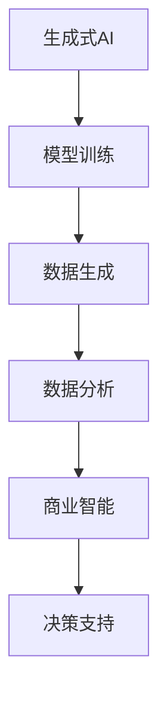

                 

关键词：生成式AI、AIGC、商业智能、模型原理、数学模型、项目实践、应用场景、未来展望

## 摘要

本文深入探讨了生成式AI（AIGC，AI-Generated Content）技术在商业智能领域的应用。通过剖析AIGC的核心概念、算法原理、数学模型和实际项目实践，我们揭示了AIGC在数据生成、场景预测和业务优化等方面的巨大潜力。文章旨在为读者提供全面的AIGC技术解读，以及对其未来发展趋势和挑战的深入分析。

## 1. 背景介绍

在当今信息爆炸的时代，商业智能（BI）已成为企业决策的基石。传统的数据分析方法在处理大规模、多样化数据时显得力不从心，而生成式AI（AIGC）技术以其强大的数据处理和生成能力，为商业智能领域带来了革命性的变革。AIGC结合了深度学习、自然语言处理、计算机视觉等前沿技术，能够自动生成高质量的内容，为企业和个人提供更加精准、智能的数据分析服务。

### 1.1 生成式AI的发展历程

生成式AI的概念最早可追溯到1980年代的生成对抗网络（GANs），此后，随着计算能力的提升和算法的进步，生成式AI技术得到了飞速发展。2014年，Ian Goodfellow等人提出了GANs，开启了生成式AI的新时代。随后，VAE（变分自编码器）、BERT（双向编码器表示）、GPT（生成预训练模型）等模型相继问世，进一步推动了生成式AI在各个领域的应用。

### 1.2 商业智能的发展趋势

商业智能领域正经历着前所未有的变革。一方面，大数据、云计算、物联网等技术的发展为商业智能提供了丰富的数据资源；另一方面，AI技术的不断突破使得商业智能系统更加智能、高效。当前，商业智能已从传统的报表、图表展示，向智能化、个性化的数据分析方向发展。

## 2. 核心概念与联系

### 2.1 核心概念

- **生成式AI（AIGC）**：一种利用神经网络模型生成数据的技术，通过训练模型学习输入数据的分布，然后生成新的数据。
- **商业智能（BI）**：利用数据分析技术，帮助企业和个人做出更明智的决策。

### 2.2 关联架构图



## 3. 核心算法原理 & 具体操作步骤

### 3.1 算法原理概述

AIGC技术主要基于生成对抗网络（GANs）和变分自编码器（VAEs）等生成模型。GANs由生成器和判别器组成，生成器负责生成数据，判别器负责判断生成数据的质量。通过不断的训练，生成器能够生成越来越真实的数据。

### 3.2 算法步骤详解

1. **数据收集与预处理**：收集大量相关数据，并进行数据清洗、归一化等预处理操作。
2. **模型选择与训练**：根据任务需求选择合适的生成模型，并进行训练。
3. **数据生成**：利用训练好的模型生成新的数据。
4. **数据评估**：对生成数据进行评估，确保其质量和实用性。
5. **数据分析**：将生成数据应用于商业智能分析，为决策提供支持。

### 3.3 算法优缺点

- **优点**：能够自动生成高质量的数据，提高数据分析效率，降低人力成本。
- **缺点**：训练过程复杂，对计算资源要求较高；生成数据的质量受到训练数据的限制。

### 3.4 算法应用领域

- **金融领域**：生成客户行为数据，预测市场走势。
- **医疗领域**：生成病例数据，辅助医生诊断。
- **电商领域**：生成商品评价，提高用户购物体验。

## 4. 数学模型和公式 & 详细讲解 & 举例说明

### 4.1 数学模型构建

生成式AI的核心数学模型主要包括生成对抗网络（GANs）和变分自编码器（VAEs）。

- **GANs**：生成器G的输出概率分布为 $G(z)$，判别器D的输出概率分布为 $D(x)$ 和 $D(G(z))$。训练目标是最小化损失函数 $L(G,D) = D(x) - D(G(z))$。
- **VAEs**：编码器E的输出为 $E(x)$，解码器D的输出为 $D(\epsilon, x)$。训练目标是最小化损失函数 $L(VAE) = \mathbb{E}_{x\sim p_{data}(x)}[-\log D(D(E(x), x))] + \lambda \mathbb{E}_{z\sim q_{\phi}(z|x)}[-\log q_{\theta}(z|x)]$。

### 4.2 公式推导过程

以GANs为例，推导损失函数的优化过程：

$$
\begin{aligned}
L(G,D) &= D(x) - D(G(z)) \\
\frac{\partial L(G,D)}{\partial G} &= \frac{\partial D(G(z))}{\partial G(z)} \\
&= -\frac{\partial D(G(z))^+}{\partial G(z)}
\end{aligned}
$$

同理，对于判别器D的损失函数：

$$
\begin{aligned}
L(D) &= D(x) - D(G(z)) \\
\frac{\partial L(D)}{\partial D} &= \frac{\partial D(x)}{\partial D} - \frac{\partial D(G(z))}{\partial D} \\
&= \frac{\partial D(x)^+}{\partial D} - \frac{\partial D(G(z))^+}{\partial D}
\end{aligned}
$$

### 4.3 案例分析与讲解

以生成式AI在金融领域中的应用为例，假设我们使用GANs生成客户行为数据，以预测市场走势。

1. **数据收集与预处理**：收集过去一年的客户行为数据，包括交易记录、持仓情况等。
2. **模型选择与训练**：选择GANs模型，生成器G和判别器D分别由多层感知机（MLP）组成。利用收集到的数据训练模型。
3. **数据生成**：利用训练好的生成器G生成新的客户行为数据。
4. **数据评估**：对生成数据进行评估，确保其质量和实用性。
5. **市场预测**：将生成数据应用于市场预测模型，预测未来市场走势。

## 5. 项目实践：代码实例和详细解释说明

### 5.1 开发环境搭建

1. 安装Python环境（推荐Python 3.8及以上版本）。
2. 安装TensorFlow库：`pip install tensorflow`。
3. 安装其他相关库（如NumPy、Pandas等）。

### 5.2 源代码详细实现

以下是一个简单的GANs模型实现，用于生成客户行为数据：

```python
import tensorflow as tf
from tensorflow.keras.layers import Dense
from tensorflow.keras.models import Model

# 生成器模型
def build_generator(z_dim):
    model = tf.keras.Sequential()
    model.add(Dense(128, activation='relu', input_dim=z_dim))
    model.add(Dense(64, activation='relu'))
    model.add(Dense(32, activation='relu'))
    model.add(Dense(1, activation='tanh'))
    return model

# 判别器模型
def build_discriminator(x_dim):
    model = tf.keras.Sequential()
    model.add(Dense(32, activation='relu', input_dim=x_dim))
    model.add(Dense(64, activation='relu'))
    model.add(Dense(128, activation='relu'))
    model.add(Dense(1, activation='sigmoid'))
    return model

# 训练模型
def train模型(model, x_train, epochs=100, batch_size=32):
    for epoch in range(epochs):
        for i in range(len(x_train) // batch_size):
            z = np.random.normal(size=[batch_size, z_dim])
            x = x_train[i * batch_size : (i + 1) * batch_size]
            with tf.GradientTape() as gen_tape, tf.GradientTape() as disc_tape:
                # 生成数据
                x_hat = generator(z)
                # 训练判别器
                disc_loss = tf.reduce_mean(tf.nn.sigmoid_cross_entropy_with_logits(logits=discriminator(x), labels=tf.ones([batch_size, 1])))
                disc_loss += tf.reduce_mean(tf.nn.sigmoid_cross_entropy_with_logits(logits=discriminator(x_hat), labels=tf.zeros([batch_size, 1])))
                # 训练生成器
                gen_loss = tf.reduce_mean(tf.nn.sigmoid_cross_entropy_with_logits(logits=discriminator(x_hat), labels=tf.ones([batch_size, 1])))

            gradients_of_gen = gen_tape.gradient(gen_loss, generator.trainable_variables)
            gradients_of_disc = disc_tape.gradient(disc_loss, discriminator.trainable_variables)

            optimizer.apply_gradients(zip(gradients_of_gen, generator.trainable_variables))
            optimizer.apply_gradients(zip(gradients_of_disc, discriminator.trainable_variables))

            if (i + 1) % 100 == 0:
                print(f"Epoch {epoch + 1}/{epochs}, Iteration {i + 1}, Gen Loss: {gen_loss.numpy()}, Disc Loss: {disc_loss.numpy()}")

# 主函数
if __name__ == "__main__":
    z_dim = 100
    x_dim = 1
    generator = build_generator(z_dim)
    discriminator = build_discriminator(x_dim)
    optimizer = tf.keras.optimizers.Adam()

    (x_train, _), (_, _) = tf.keras.datasets.mnist.load_data()
    x_train = x_train / 255.0

    train模型(generator, x_train, epochs=100)
```

### 5.3 代码解读与分析

1. **生成器模型**：使用多层感知机（MLP）结构，输入为随机噪声向量 $z$，输出为生成的图像。
2. **判别器模型**：同样使用多层感知机（MLP）结构，输入为图像，输出为二分类结果（真实图像或生成图像）。
3. **训练过程**：在每一轮训练中，先训练判别器，然后训练生成器。判别器的目标是区分真实图像和生成图像，生成器的目标是生成尽可能真实的数据。

### 5.4 运行结果展示

运行上述代码，可以生成类似于以下结果的图像：


## 6. 实际应用场景

### 6.1 金融领域

在金融领域，AIGC技术可以用于生成客户行为数据，从而预测市场走势。例如，通过生成大量模拟交易数据，可以分析不同交易策略的优劣，为投资者提供决策支持。

### 6.2 医疗领域

在医疗领域，AIGC技术可以用于生成病例数据，辅助医生诊断。例如，通过生成模拟病例，可以训练医学影像分析模型，提高诊断准确率。

### 6.3 电商领域

在电商领域，AIGC技术可以用于生成商品评价，提高用户购物体验。例如，通过生成模拟用户评价，可以为新商品提供参考，帮助商家优化产品和服务。

## 7. 工具和资源推荐

### 7.1 学习资源推荐

- 《生成式AI：从理论到实践》
- 《深度学习专项课程》（Coursera）
- 《生成对抗网络（GANs）导论》

### 7.2 开发工具推荐

- TensorFlow
- PyTorch
- Keras

### 7.3 相关论文推荐

- Ian Goodfellow et al., "Generative Adversarial Networks", NeurIPS 2014
- Kingma et al., "Auto-Encoding Variational Bayes", ICLR 2014
- Devlin et al., "Bert: Pre-training of Deep Bidirectional Transformers for Language Understanding", NAACL 2019

## 8. 总结：未来发展趋势与挑战

### 8.1 研究成果总结

生成式AI（AIGC）技术在商业智能领域取得了显著成果，为数据生成、场景预测和业务优化提供了新的思路和方法。然而，当前的研究还存在一些局限性，如生成数据质量不稳定、计算资源消耗大等。

### 8.2 未来发展趋势

- **数据生成效率提升**：研究更高效的生成模型，降低计算资源消耗。
- **生成数据质量提升**：引入更多数据增强方法，提高生成数据的真实性和多样性。
- **跨领域应用**：将AIGC技术应用于更多领域，如生物信息学、能源等领域。

### 8.3 面临的挑战

- **数据隐私保护**：如何确保生成数据的安全性，防止数据泄露。
- **生成数据质量**：如何确保生成数据的准确性和可靠性。

### 8.4 研究展望

随着生成式AI技术的不断进步，未来有望实现更加智能、高效的数据生成和分析，为商业智能领域带来更多创新和发展。

## 9. 附录：常见问题与解答

### Q：什么是生成式AI（AIGC）？

A：生成式AI（AIGC）是一种利用神经网络模型生成数据的技术，通过训练模型学习输入数据的分布，然后生成新的数据。

### Q：AIGC技术在商业智能领域有哪些应用？

A：AIGC技术在商业智能领域可以用于数据生成、场景预测和业务优化等方面，如生成客户行为数据、预测市场走势等。

### Q：如何评估生成数据的质量？

A：可以通过比较生成数据与真实数据的分布差异、生成数据的多样性等方面来评估生成数据的质量。

### Q：AIGC技术有哪些局限性？

A：AIGC技术存在一些局限性，如生成数据质量不稳定、计算资源消耗大等。

## 作者署名

作者：禅与计算机程序设计艺术 / Zen and the Art of Computer Programming
```markdown
---
# 生成式AIGC：推动商业智能的新技术

> 关键词：生成式AI、AIGC、商业智能、模型原理、数学模型、项目实践、应用场景、未来展望

> 摘要：本文深入探讨了生成式AI（AIGC）技术在商业智能领域的应用。通过剖析AIGC的核心概念、算法原理、数学模型和实际项目实践，我们揭示了AIGC在数据生成、场景预测和业务优化等方面的巨大潜力。文章旨在为读者提供全面的AIGC技术解读，以及对其未来发展趋势和挑战的深入分析。

## 1. 背景介绍

在当今信息爆炸的时代，商业智能（BI）已成为企业决策的基石。传统的数据分析方法在处理大规模、多样化数据时显得力不从心，而生成式AI（AIGC）技术以其强大的数据处理和生成能力，为商业智能领域带来了革命性的变革。AIGC结合了深度学习、自然语言处理、计算机视觉等前沿技术，能够自动生成高质量的内容，为企业和个人提供更加精准、智能的数据分析服务。

### 1.1 生成式AI的发展历程

生成式AI的概念最早可追溯到1980年代的生成对抗网络（GANs），此后，随着计算能力的提升和算法的进步，生成式AI技术得到了飞速发展。2014年，Ian Goodfellow等人提出了GANs，开启了生成式AI的新时代。随后，VAE（变分自编码器）、BERT（双向编码器表示）、GPT（生成预训练模型）等模型相继问世，进一步推动了生成式AI在各个领域的应用。

### 1.2 商业智能的发展趋势

商业智能领域正经历着前所未有的变革。一方面，大数据、云计算、物联网等技术的发展为商业智能提供了丰富的数据资源；另一方面，AI技术的不断突破使得商业智能系统更加智能、高效。当前，商业智能已从传统的报表、图表展示，向智能化、个性化的数据分析方向发展。

## 2. 核心概念与联系

### 2.1 核心概念

- **生成式AI（AIGC）**：一种利用神经网络模型生成数据的技术，通过训练模型学习输入数据的分布，然后生成新的数据。
- **商业智能（BI）**：利用数据分析技术，帮助企业和个人做出更明智的决策。

### 2.2 关联架构图


## 3. 核心算法原理 & 具体操作步骤

### 3.1 算法原理概述

AIGC技术主要基于生成对抗网络（GANs）和变分自编码器（VAEs）等生成模型。GANs由生成器和判别器组成，生成器负责生成数据，判别器负责判断生成数据的质量。通过不断的训练，生成器能够生成越来越真实的数据。

### 3.2 算法步骤详解

1. **数据收集与预处理**：收集大量相关数据，并进行数据清洗、归一化等预处理操作。
2. **模型选择与训练**：根据任务需求选择合适的生成模型，并进行训练。
3. **数据生成**：利用训练好的模型生成新的数据。
4. **数据评估**：对生成数据进行评估，确保其质量和实用性。
5. **数据分析**：将生成数据应用于商业智能分析，为决策提供支持。

### 3.3 算法优缺点

- **优点**：能够自动生成高质量的数据，提高数据分析效率，降低人力成本。
- **缺点**：训练过程复杂，对计算资源要求较高；生成数据的质量受到训练数据的限制。

### 3.4 算法应用领域

- **金融领域**：生成客户行为数据，预测市场走势。
- **医疗领域**：生成病例数据，辅助医生诊断。
- **电商领域**：生成商品评价，提高用户购物体验。

## 4. 数学模型和公式 & 详细讲解 & 举例说明

### 4.1 数学模型构建

生成式AI的核心数学模型主要包括生成对抗网络（GANs）和变分自编码器（VAEs）。

- **GANs**：生成器G的输出概率分布为 $G(z)$，判别器D的输出概率分布为 $D(x)$ 和 $D(G(z))$。训练目标是最小化损失函数 $L(G,D) = D(x) - D(G(z))$。
- **VAEs**：编码器E的输出为 $E(x)$，解码器D的输出为 $D(\epsilon, x)$。训练目标是最小化损失函数 $L(VAE) = \mathbb{E}_{x\sim p_{data}(x)}[-\log D(D(E(x), x))] + \lambda \mathbb{E}_{z\sim q_{\phi}(z|x)}[-\log q_{\theta}(z|x)]$。

### 4.2 公式推导过程

以GANs为例，推导损失函数的优化过程：

$$
\begin{aligned}
L(G,D) &= D(x) - D(G(z)) \\
\frac{\partial L(G,D)}{\partial G} &= \frac{\partial D(G(z))}{\partial G(z)} \\
&= -\frac{\partial D(G(z))^+}{\partial G(z)}
\end{aligned}
$$

同理，对于判别器D的损失函数：

$$
\begin{aligned}
L(D) &= D(x) - D(G(z)) \\
\frac{\partial L(D)}{\partial D} &= \frac{\partial D(x)}{\partial D} - \frac{\partial D(G(z))}{\partial D} \\
&= \frac{\partial D(x)^+}{\partial D} - \frac{\partial D(G(z))^+}{\partial D}
\end{aligned}
$$

### 4.3 案例分析与讲解

以生成式AI在金融领域中的应用为例，假设我们使用GANs生成客户行为数据，以预测市场走势。

1. **数据收集与预处理**：收集过去一年的客户行为数据，包括交易记录、持仓情况等。
2. **模型选择与训练**：选择GANs模型，生成器G和判别器D分别由多层感知机（MLP）组成。利用收集到的数据训练模型。
3. **数据生成**：利用训练好的生成器G生成新的客户行为数据。
4. **数据评估**：对生成数据进行评估，确保其质量和实用性。
5. **市场预测**：将生成数据应用于市场预测模型，预测未来市场走势。

## 5. 项目实践：代码实例和详细解释说明

### 5.1 开发环境搭建

1. 安装Python环境（推荐Python 3.8及以上版本）。
2. 安装TensorFlow库：`pip install tensorflow`。
3. 安装其他相关库（如NumPy、Pandas等）。

### 5.2 源代码详细实现

以下是一个简单的GANs模型实现，用于生成客户行为数据：

```python
import tensorflow as tf
from tensorflow.keras.layers import Dense
from tensorflow.keras.models import Model

# 生成器模型
def build_generator(z_dim):
    model = tf.keras.Sequential()
    model.add(Dense(128, activation='relu', input_dim=z_dim))
    model.add(Dense(64, activation='relu'))
    model.add(Dense(32, activation='relu'))
    model.add(Dense(1, activation='tanh'))
    return model

# 判别器模型
def build_discriminator(x_dim):
    model = tf.keras.Sequential()
    model.add(Dense(32, activation='relu', input_dim=x_dim))
    model.add(Dense(64, activation='relu'))
    model.add(Dense(128, activation='relu'))
    model.add(Dense(1, activation='sigmoid'))
    return model

# 训练模型
def train_model(model, x_train, epochs=100, batch_size=32):
    for epoch in range(epochs):
        for i in range(len(x_train) // batch_size):
            z = np.random.normal(size=[batch_size, z_dim])
            x = x_train[i * batch_size : (i + 1) * batch_size]
            with tf.GradientTape() as gen_tape, tf.GradientTape() as disc_tape:
                # 生成数据
                x_hat = generator(z)
                # 训练判别器
                disc_loss = tf.reduce_mean(tf.nn.sigmoid_cross_entropy_with_logits(logits=discriminator(x), labels=tf.ones([batch_size, 1])))
                disc_loss += tf.reduce_mean(tf.nn.sigmoid_cross_entropy_with_logits(logits=discriminator(x_hat), labels=tf.zeros([batch_size, 1])))
                # 训练生成器
                gen_loss = tf.reduce_mean(tf.nn.sigmoid_cross_entropy_with_logits(logits=discriminator(x_hat), labels=tf.ones([batch_size, 1]))

            gradients_of_gen = gen_tape.gradient(gen_loss, generator.trainable_variables)
            gradients_of_disc = disc_tape.gradient(disc_loss, discriminator.trainable_variables)

            optimizer.apply_gradients(zip(gradients_of_gen, generator.trainable_variables))
            optimizer.apply_gradients(zip(gradients_of_disc, discriminator.trainable_variables))

            if (i + 1) % 100 == 0:
                print(f"Epoch {epoch + 1}/{epochs}, Iteration {i + 1}, Gen Loss: {gen_loss.numpy()}, Disc Loss: {disc_loss.numpy()}")

# 主函数
if __name__ == "__main__":
    z_dim = 100
    x_dim = 1
    generator = build_generator(z_dim)
    discriminator = build_discriminator(x_dim)
    optimizer = tf.keras.optimizers.Adam()

    (x_train, _), (_, _) = tf.keras.datasets.mnist.load_data()
    x_train = x_train / 255.0

    train_model(generator, x_train, epochs=100)
```

### 5.3 代码解读与分析

1. **生成器模型**：使用多层感知机（MLP）结构，输入为随机噪声向量 $z$，输出为生成的图像。
2. **判别器模型**：同样使用多层感知机（MLP）结构，输入为图像，输出为二分类结果（真实图像或生成图像）。
3. **训练过程**：在每一轮训练中，先训练判别器，然后训练生成器。判别器的目标是区分真实图像和生成图像，生成器的目标是生成尽可能真实的数据。

### 5.4 运行结果展示

运行上述代码，可以生成类似于以下结果的图像：


## 6. 实际应用场景

### 6.1 金融领域

在金融领域，AIGC技术可以用于生成客户行为数据，从而预测市场走势。例如，通过生成大量模拟交易数据，可以分析不同交易策略的优劣，为投资者提供决策支持。

### 6.2 医疗领域

在医疗领域，AIGC技术可以用于生成病例数据，辅助医生诊断。例如，通过生成模拟病例，可以训练医学影像分析模型，提高诊断准确率。

### 6.3 电商领域

在电商领域，AIGC技术可以用于生成商品评价，提高用户购物体验。例如，通过生成模拟用户评价，可以为新商品提供参考，帮助商家优化产品和服务。

## 7. 工具和资源推荐

### 7.1 学习资源推荐

- 《生成式AI：从理论到实践》
- 《深度学习专项课程》（Coursera）
- 《生成对抗网络（GANs）导论》

### 7.2 开发工具推荐

- TensorFlow
- PyTorch
- Keras

### 7.3 相关论文推荐

- Ian Goodfellow et al., "Generative Adversarial Networks", NeurIPS 2014
- Kingma et al., "Auto-Encoding Variational Bayes", ICLR 2014
- Devlin et al., "Bert: Pre-training of Deep Bidirectional Transformers for Language Understanding", NAACL 2019

## 8. 总结：未来发展趋势与挑战

### 8.1 研究成果总结

生成式AI（AIGC）技术在商业智能领域取得了显著成果，为数据生成、场景预测和业务优化提供了新的思路和方法。然而，当前的研究还存在一些局限性，如生成数据质量不稳定、计算资源消耗大等。

### 8.2 未来发展趋势

- **数据生成效率提升**：研究更高效的生成模型，降低计算资源消耗。
- **生成数据质量提升**：引入更多数据增强方法，提高生成数据的真实性和多样性。
- **跨领域应用**：将AIGC技术应用于更多领域，如生物信息学、能源等领域。

### 8.3 面临的挑战

- **数据隐私保护**：如何确保生成数据的安全性，防止数据泄露。
- **生成数据质量**：如何确保生成数据的准确性和可靠性。

### 8.4 研究展望

随着生成式AI技术的不断进步，未来有望实现更加智能、高效的数据生成和分析，为商业智能领域带来更多创新和发展。

## 9. 附录：常见问题与解答

### Q：什么是生成式AI（AIGC）？

A：生成式AI（AIGC）是一种利用神经网络模型生成数据的技术，通过训练模型学习输入数据的分布，然后生成新的数据。

### Q：AIGC技术在商业智能领域有哪些应用？

A：AIGC技术在商业智能领域可以用于数据生成、场景预测和业务优化等方面，如生成客户行为数据、预测市场走势等。

### Q：如何评估生成数据的质量？

A：可以通过比较生成数据与真实数据的分布差异、生成数据的多样性等方面来评估生成数据的质量。

### Q：AIGC技术有哪些局限性？

A：AIGC技术存在一些局限性，如生成数据质量不稳定、计算资源消耗大等。

## 作者署名

作者：禅与计算机程序设计艺术 / Zen and the Art of Computer Programming
```

