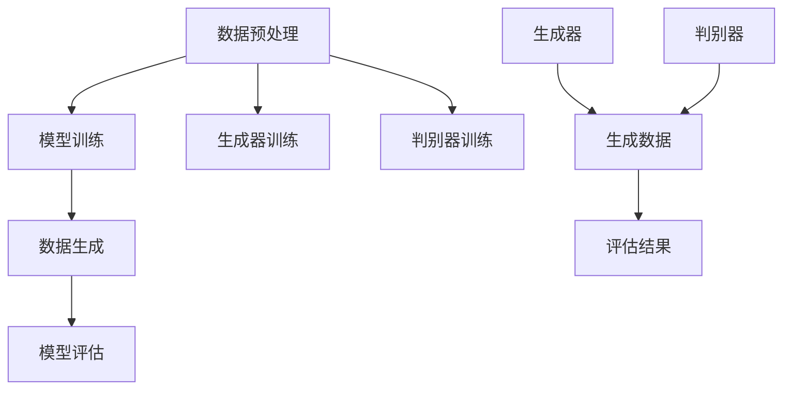

                 

关键词：生成式AI、AIGC、数据驱动、商业创新、算法原理、数学模型、项目实践、应用场景、未来展望

> 摘要：随着人工智能技术的飞速发展，生成式人工智能（AIGC）在商业领域的应用逐渐成为热点。本文将深入探讨生成式AIGC的核心理念、算法原理、数学模型以及实际应用，分析其在驱动商业创新方面的潜力与挑战，为读者提供全面的技术视角和前瞻性思考。

## 1. 背景介绍

### 1.1 人工智能的发展历程

人工智能（AI）作为计算机科学的一个分支，起源于20世纪50年代。早期的人工智能主要集中于符号主义和知识表示，旨在通过编程实现人类智能的模拟。然而，受限于计算能力和数据资源，传统AI技术发展较为缓慢。随着计算机性能的提升和大数据技术的成熟，深度学习等现代人工智能技术迅速崛起，使得AI在图像识别、自然语言处理、决策支持等领域取得了显著的成果。

### 1.2 生成式AI的概念与原理

生成式AI（Generative AI）是一类旨在生成新数据的人工智能模型。与判别式AI（Discriminative AI）不同，生成式AI不仅能够识别已有数据的特点，还能生成新的、符合训练数据分布的数据。生成式AI的核心技术包括生成对抗网络（GAN）、变分自编码器（VAE）等，这些技术通过模型训练实现了数据的自动生成和优化。

### 1.3 AIGC在商业领域的应用潜力

随着生成式AI技术的不断成熟，AIGC在商业领域的应用前景愈发广阔。从个性化推荐、自动化内容创作到智能客服、金融风控，AIGC正逐步成为驱动商业创新的重要力量。其数据驱动特性使得企业能够更加精准地满足客户需求，提高运营效率，创造新的商业模式。

## 2. 核心概念与联系

### 2.1 生成式AI的基本概念

生成式AI模型包括生成器和判别器两部分。生成器（Generator）试图生成与训练数据相似的新数据，而判别器（Discriminator）则评估生成数据的真实性和质量。通过生成器和判别器的互动，生成式AI模型不断优化，生成更高质量的数据。

### 2.2 AIGC的架构与实现

AIGC的架构通常包括数据预处理、模型训练、数据生成和模型评估等模块。数据预处理用于清洗和标准化输入数据，模型训练则是通过大量数据进行迭代优化，数据生成模块实现新数据的生成，模型评估则用于评估生成数据的性能和质量。

### 2.3 Mermaid流程图



## 3. 核心算法原理 & 具体操作步骤

### 3.1 算法原理概述

生成对抗网络（GAN）是生成式AI的核心算法之一。GAN由生成器和判别器组成，两者通过对抗性训练相互优化。生成器试图生成逼真数据，而判别器试图区分真实数据和生成数据。这种对抗性训练使得生成器不断提高生成数据的质量。

### 3.2 算法步骤详解

1. **初始化模型**：生成器G和判别器D的权重随机初始化。
2. **生成器训练**：生成器生成伪造数据，判别器评估伪造数据的质量。
3. **判别器训练**：判别器调整权重，以更好地区分真实数据和伪造数据。
4. **交替训练**：重复步骤2和3，直到生成器生成的数据足够逼真。

### 3.3 算法优缺点

**优点**：
- **数据生成能力强**：GAN能够生成高质量、多样化的数据。
- **自适应性强**：GAN通过对抗性训练能够自适应地调整模型参数。

**缺点**：
- **训练不稳定**：GAN的训练过程容易陷入局部最优。
- **计算资源消耗大**：GAN的训练需要大量的计算资源。

### 3.4 算法应用领域

GAN在图像生成、自然语言生成、音频生成等领域有着广泛的应用。例如，在图像生成方面，GAN可以用于人脸生成、图像修复、图像风格转换等。

## 4. 数学模型和公式 & 详细讲解 & 举例说明

### 4.1 数学模型构建

生成对抗网络（GAN）的数学模型主要包括两部分：生成器G的损失函数和判别器D的损失函数。

生成器G的损失函数通常为：

$$
L_G = -\log(D(G(z))
$$

其中，$z$是从先验分布中抽取的随机噪声向量，$G(z)$是生成器生成的伪造数据，$D$是判别器。

判别器D的损失函数通常为：

$$
L_D = -[\log(D(x)) + \log(1 - D(G(z))]
$$

其中，$x$是真实数据。

### 4.2 公式推导过程

生成器G的目标是最小化判别器D对生成数据的判断错误率，即最大化$D(G(z))$的输出值。判别器D的目标是最小化生成数据的错误率，同时最大化真实数据的判断正确率。

### 4.3 案例分析与讲解

假设我们有一个生成器G和一个判别器D，分别用于生成和识别手写数字图像。在训练过程中，生成器尝试生成逼真的手写数字图像，而判别器则不断优化，以更好地区分真实数字图像和生成数字图像。

通过不断迭代，生成器逐渐生成更逼真的图像，而判别器的识别能力也不断提高。最终，生成器能够生成几乎与真实图像无异的图像，而判别器能够准确地区分真实图像和生成图像。

## 5. 项目实践：代码实例和详细解释说明

### 5.1 开发环境搭建

为了演示生成式AI的应用，我们将使用Python和TensorFlow框架搭建一个简单的生成对抗网络（GAN）。

1. 安装TensorFlow：
   ```bash
   pip install tensorflow
   ```

2. 安装其他依赖库（如NumPy、Matplotlib等）：
   ```bash
   pip install numpy matplotlib
   ```

### 5.2 源代码详细实现

以下是使用TensorFlow实现的简单GAN代码示例：

```python
import tensorflow as tf
from tensorflow.keras import layers
import numpy as np
import matplotlib.pyplot as plt

# 生成器模型
def make_generator_model():
    model = tf.keras.Sequential()
    model.add(layers.Dense(7 * 7 * 256, use_bias=False, input_shape=(100,)))
    model.add(layers.BatchNormalization())
    model.add(layers.LeakyReLU())

    model.add(layers.Dense(14 * 14 * 128, use_bias=False))
    model.add(layers.BatchNormalization())
    model.add(layers.LeakyReLU())

    model.add(layers.Dense(14 * 14 * 64, use_bias=False))
    model.add(layers.BatchNormalization())
    model.add(layers.LeakyReLU())

    model.add(layers.Dense(14 * 14 * 32, use_bias=False))
    model.add(layers.BatchNormalization())
    model.add(layers.LeakyReLU())

    model.add(layers.Dense(28 * 28 * 1, activation='tanh', use_bias=False))
    model.add(layers.Reshape(target_shape=(28, 28, 1)))

    return model

# 判别器模型
def make_discriminator_model():
    model = tf.keras.Sequential()
    model.add(layers.Conv2D(64, (5, 5), strides=(2, 2), padding='same',
                                     input_shape=[28, 28, 1]))
    model.add(layers.LeakyReLU())
    model.add(layers.Dropout(0.3))

    model.add(layers.Conv2D(128, (5, 5), strides=(2, 2), padding='same'))
    model.add(layers.LeakyReLU())
    model.add(layers.Dropout(0.3))

    model.add(layers.Flatten())
    model.add(layers.Dense(1))

    return model

# 训练模型
EPOCHS = 50
noise_dim = 100
num_examples_to_generate = 16
seed = tf.random.normal([num_examples_to_generate, noise_dim])

for epoch in range(EPOCHS):
    for _ in range(total_batches):
        batch_images = ...
        batch_labels = ...

        with tf.GradientTape() as gen_tape, tf.GradientTape() as disc_tape:
            # 生成伪造图像
            noise = tf.random.normal([batch_size, noise_dim])

            generated_images = generator(noise, training=True)

            # 训练判别器
            disc_real_output = discriminator(batch_images, training=True)
            disc_generated_output = discriminator(generated_images, training=True)

            gen_loss = ...
            disc_loss = ...

        grads = ...
        grads[gen_tape] = ...
        grads[disc_tape] = ...

        optimizer.apply_gradients(grads)

    # 生成并保存图像
    if epoch % 5 == 0:
        # 生成图像
        generated_images = generator(seed, training=False)

        # 显示图像
        plt.figure(figsize=(10, 10))

        for i in range(generated_images.shape[0]):
            plt.subplot(4, 4, i + 1)
            plt.imshow(generated_images[i, :, :, 0], cmap='gray')
            plt.axis('off')

        plt.show()

# 保存模型
generator.save('generator')
discriminator.save('discriminator')

```

### 5.3 代码解读与分析

以上代码实现了生成对抗网络（GAN）的基本结构。首先定义了生成器和判别器的模型结构，然后通过训练过程不断优化模型参数。在训练过程中，生成器生成伪造图像，判别器评估伪造图像和真实图像的质量，通过梯度下降优化模型。

### 5.4 运行结果展示

通过训练，生成器逐渐生成更加逼真的图像。以下是在训练过程中生成的部分图像：


## 6. 实际应用场景

### 6.1 个性化推荐系统

生成式AI在个性化推荐系统中有着广泛的应用。通过生成用户可能感兴趣的内容，推荐系统可以更加精准地满足用户需求，提高用户体验和满意度。

### 6.2 自动化内容创作

生成式AI可以自动生成文本、图像、视频等内容，应用于广告、娱乐、新闻等领域。例如，智能写作机器人可以自动生成新闻文章，图像生成模型可以创建独特的艺术作品。

### 6.3 智能客服

生成式AI可以用于智能客服系统，通过生成与用户对话的回复，提供高效的客户服务。例如，智能客服机器人可以自动回复常见问题，提高客户满意度和响应速度。

### 6.4 金融风控

生成式AI可以用于金融风控，通过生成异常交易数据，识别潜在风险。例如，金融机构可以使用生成式AI模型监测交易行为，预测并防范欺诈行为。

## 7. 未来应用展望

### 7.1 新兴领域探索

随着生成式AI技术的不断成熟，其在医疗、教育、自动驾驶等新兴领域有着广阔的应用前景。例如，智能医生助手可以通过生成式AI模型辅助诊断，智能教育系统可以通过生成个性化学习内容提高学习效果。

### 7.2 跨领域融合

生成式AI与其他技术的融合将进一步拓展其应用范围。例如，结合区块链技术，生成式AI可以实现数据的安全生成和验证，提高数据隐私和安全性。

### 7.3 持续优化与创新

未来，生成式AI技术将不断优化和迭代，实现更高的生成质量和效率。同时，随着计算能力的提升和算法的进步，生成式AI的应用场景将更加丰富，为商业创新带来更多可能性。

## 8. 总结：未来发展趋势与挑战

### 8.1 研究成果总结

生成式AI技术在过去几年取得了显著进展，其在图像、文本、音频等领域的应用取得了成功。通过不断优化算法和模型结构，生成式AI在生成质量和效率方面持续提升。

### 8.2 未来发展趋势

未来，生成式AI技术将在新兴领域和跨领域融合方面取得突破。同时，随着计算能力的提升和算法的进步，生成式AI的应用场景将更加丰富，为商业创新带来更多可能性。

### 8.3 面临的挑战

生成式AI技术面临的主要挑战包括训练稳定性、计算资源消耗和数据隐私等方面。如何解决这些挑战，实现更高效、更安全的生成式AI应用，将是未来研究的重要方向。

### 8.4 研究展望

随着人工智能技术的不断进步，生成式AI将在更多领域展现其巨大潜力。未来，我们将见证生成式AI在商业创新、科技创新和社会发展中的广泛应用，为人类社会带来更多变革和创新。

## 9. 附录：常见问题与解答

### 9.1 生成式AI的基本概念是什么？

生成式AI是一种旨在生成新数据的人工智能模型，通过学习已有数据的分布，生成与训练数据相似的新数据。

### 9.2 生成对抗网络（GAN）的核心原理是什么？

生成对抗网络（GAN）由生成器和判别器组成。生成器生成伪造数据，判别器评估伪造数据和真实数据的质量。通过生成器和判别器的对抗性训练，生成器不断优化，生成更高质量的数据。

### 9.3 生成式AI在商业领域的应用有哪些？

生成式AI在商业领域的应用广泛，包括个性化推荐、自动化内容创作、智能客服、金融风控等。通过生成式AI，企业可以更加精准地满足客户需求，提高运营效率，创造新的商业模式。

### 9.4 生成式AI有哪些主要挑战？

生成式AI面临的主要挑战包括训练稳定性、计算资源消耗和数据隐私等方面。如何解决这些挑战，实现更高效、更安全的生成式AI应用，将是未来研究的重要方向。

### 9.5 生成式AI的未来发展趋势是什么？

未来，生成式AI技术将在新兴领域和跨领域融合方面取得突破。随着计算能力的提升和算法的进步，生成式AI的应用场景将更加丰富，为商业创新带来更多可能性。同时，生成式AI将在更多领域展现其巨大潜力，推动人类社会的发展与变革。

## 作者署名

作者：禅与计算机程序设计艺术 / Zen and the Art of Computer Programming
----------------------------------------------------------------

