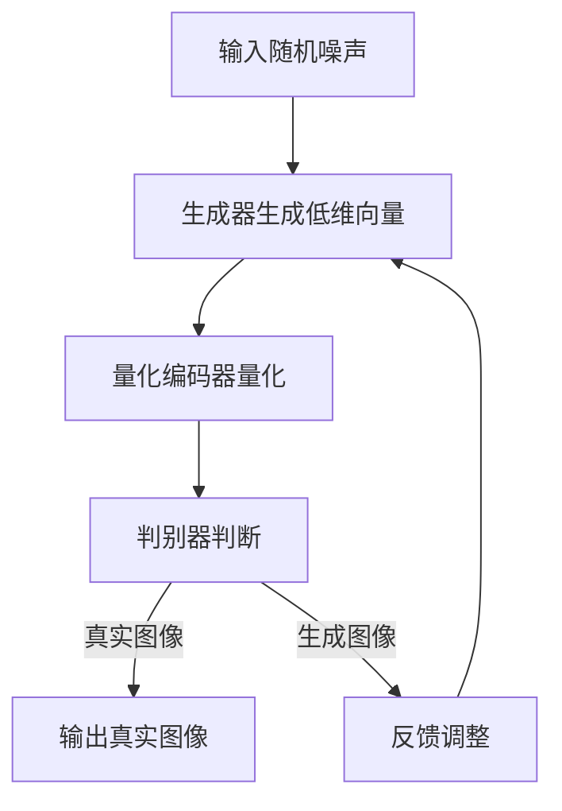
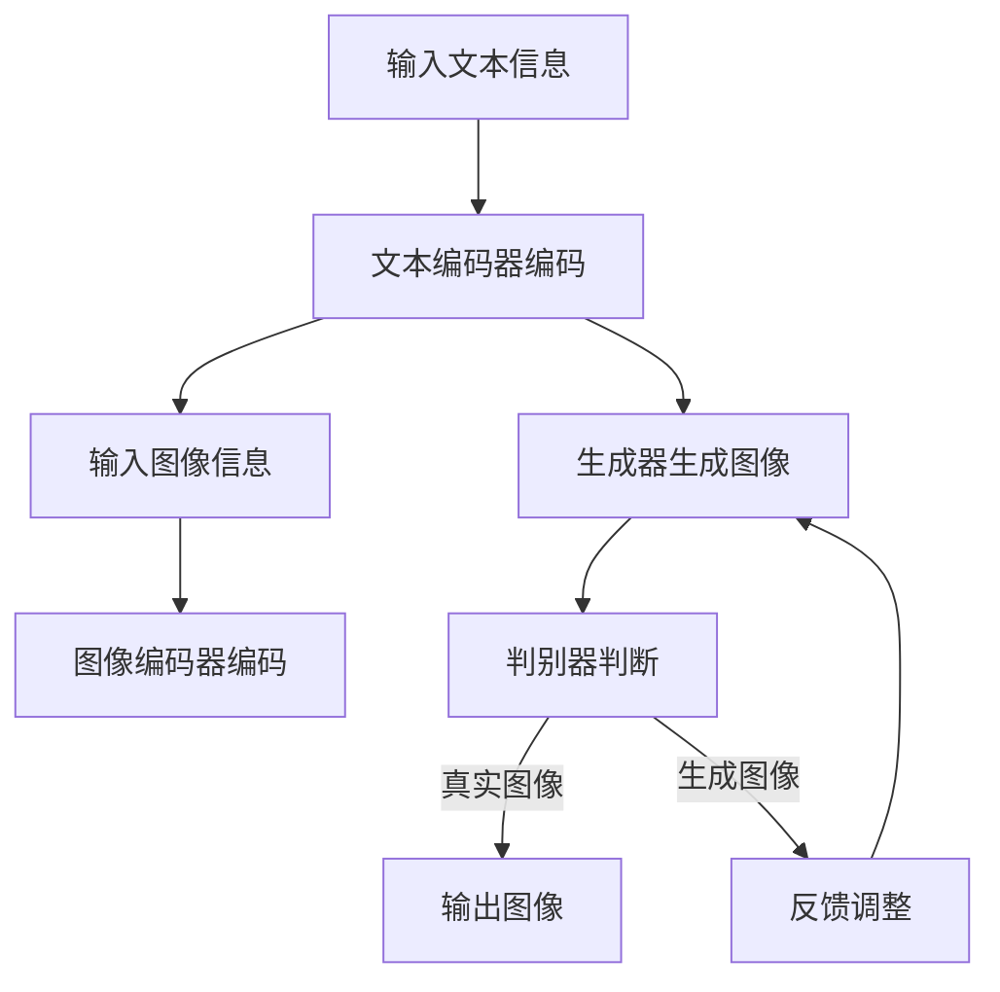

                 

## 1. 背景介绍

生成式人工智能（Generative Artificial Intelligence，简称GAI）近年来在科技领域引发了广泛的关注。作为人工智能的一个分支，生成式AI的核心目标是创建与人类创造相似的模型或内容，这包括图像、音频、视频，甚至是文本。随着深度学习技术的发展，生成式AI取得了令人瞩目的成就，其中VQGAN和Stable Diffusion是两个极具代表性的技术。

### VQGAN

VQGAN全称为Vector Quantized Generative Adversarial Networks，是生成对抗网络（Generative Adversarial Networks，GAN）的一种变体。VQGAN通过量化编码器（Vector Quantization Encoder）将高维数据映射到低维空间，从而实现数据的压缩和重构。这种技术不仅提高了GAN的训练效率，还使其在生成高质量图像方面取得了显著成果。

### Stable Diffusion

Stable Diffusion是一种基于深度学习的文本到图像的生成模型。它结合了扩散模型（Diffusion Model）和生成对抗网络（GAN），通过一系列的随机变换将随机噪声逐渐转化为具体的图像。Stable Diffusion具有训练稳定、生成速度快和图像质量高等优点，成为近年来生成式AI研究的热点。

生成式AI在艺术创作、图像处理、数据增强、娱乐产业等多个领域具有重要的应用价值。例如，在艺术创作方面，生成式AI可以帮助艺术家快速生成大量的创意作品；在图像处理方面，生成式AI可以实现图像的超分辨率、去噪和修复；在数据增强方面，生成式AI可以生成大量多样化的训练数据，提高模型的泛化能力。

## 2. 核心概念与联系

### 核心概念

生成式AI的核心概念主要包括生成对抗网络（GAN）、量化编码器（Vector Quantization Encoder）和扩散模型（Diffusion Model）。这些概念相互联系，共同构成了生成式AI的基石。

#### 生成对抗网络（GAN）

生成对抗网络（GAN）由生成器（Generator）和判别器（Discriminator）组成。生成器负责将随机噪声数据转化为真实数据，判别器则负责区分真实数据和生成数据。两者相互对抗，不断优化，最终生成逼真的数据。

#### 量化编码器（Vector Quantization Encoder）

量化编码器（VQE）是一种将高维数据映射到低维空间的技术。它通过将数据划分为不同的量化桶，将高维数据转换为低维向量，从而实现数据的压缩和重构。

#### 扩散模型（Diffusion Model）

扩散模型（DM）是一种通过逐步添加噪声来生成数据的技术。它通过一系列的随机变换将随机噪声逐渐转化为具体的图像，从而实现数据的生成。

### 架构关系

VQGAN和Stable Diffusion在架构上都有所不同，但都包含了GAN的核心概念。

#### VQGAN架构

VQGAN的架构包括三个部分：生成器（Generator）、判别器（Discriminator）和量化编码器（Vector Quantization Encoder）。生成器将随机噪声映射到量化桶中，判别器则负责判断输入数据是真实图像还是生成图像，量化编码器则负责将高维数据映射到低维空间。

#### Stable Diffusion架构

Stable Diffusion的架构包括文本编码器（Text Encoder）、图像编码器（Image Encoder）和生成器（Generator）。文本编码器将文本信息编码为向量，图像编码器将图像信息编码为向量，生成器则根据这两个向量生成图像。

### Mermaid 流程图

以下是VQGAN和Stable Diffusion的Mermaid流程图：





## 3. 核心算法原理 & 具体操作步骤

### 3.1 算法原理概述

#### VQGAN算法原理

VQGAN结合了生成对抗网络（GAN）和量化编码器（Vector Quantization Encoder）。生成器将随机噪声映射到低维空间，量化编码器将低维向量映射回高维空间，判别器则负责判断输入数据是真实图像还是生成图像。

#### Stable Diffusion算法原理

Stable Diffusion是一种基于文本和图像编码的生成模型。文本编码器将文本信息编码为向量，图像编码器将图像信息编码为向量，生成器则根据这两个向量生成图像。

### 3.2 算法步骤详解

#### VQGAN算法步骤

1. **初始化参数**：设置生成器、判别器和量化编码器的初始参数。
2. **生成器生成低维向量**：将随机噪声通过生成器映射到低维空间。
3. **量化编码器量化**：将低维向量映射回高维空间。
4. **判别器判断**：输入真实图像和生成图像，判别器判断两者是否相似。
5. **反馈调整**：根据判别器的输出，调整生成器和量化编码器的参数。

#### Stable Diffusion算法步骤

1. **初始化参数**：设置文本编码器、图像编码器和生成器的初始参数。
2. **文本编码器编码**：将文本信息编码为向量。
3. **图像编码器编码**：将图像信息编码为向量。
4. **生成器生成图像**：根据文本和图像编码器的输出，生成图像。
5. **判别器判断**：输入真实图像和生成图像，判别器判断两者是否相似。
6. **反馈调整**：根据判别器的输出，调整文本编码器、图像编码器和生成器的参数。

### 3.3 算法优缺点

#### VQGAN优缺点

**优点**：
- 提高GAN的训练效率。
- 实现数据的压缩和重构。

**缺点**：
- 量化编码器可能导致部分细节丢失。
- 需要合适的量化桶数量和分布。

#### Stable Diffusion优缺点

**优点**：
- 生成的图像质量高。
- 训练稳定，生成速度快。

**缺点**：
- 对文本和图像编码器的依赖较强。
- 可能会出现模糊或不连贯的图像。

### 3.4 算法应用领域

#### VQGAN应用领域

- 图像处理：图像去噪、图像修复、图像超分辨率。
- 艺术创作：生成创意作品、艺术风格迁移。
- 数据增强：生成多样化训练数据，提高模型泛化能力。

#### Stable Diffusion应用领域

- 艺术创作：生成艺术作品、设计风格迁移。
- 图像处理：图像生成、图像超分辨率、图像去噪。
- 娱乐产业：游戏角色设计、电影特效制作。

## 4. 数学模型和公式 & 详细讲解 & 举例说明

### 4.1 数学模型构建

#### VQGAN数学模型

VQGAN的数学模型主要包括生成器、判别器和量化编码器。生成器的数学模型为：

$$
G(z) = \phi(\mathcal{N}(0, I))
$$

其中，$z$为随机噪声，$\phi$为生成器，$\mathcal{N}(0, I)$为高斯分布。

量化编码器的数学模型为：

$$
\hat{x}_{\text{VQE}} = \sum_{i=1}^{K} q(x_i) x_i
$$

其中，$x_i$为量化桶中心，$q(x_i)$为量化函数。

判别器的数学模型为：

$$
D(x, G(z)) = \sigma(W_1 \cdot \sigma(W_0 \cdot [x; G(z)] + b_0))
$$

其中，$x$为输入图像，$G(z)$为生成图像，$W_0, W_1, b_0$为判别器的权重和偏置，$\sigma$为Sigmoid函数。

#### Stable Diffusion数学模型

Stable Diffusion的数学模型主要包括文本编码器、图像编码器和生成器。文本编码器的数学模型为：

$$
t = \sigma(W_1 \cdot \sigma(W_0 \cdot [c; t] + b_0))
$$

其中，$t$为文本编码器输出，$c$为文本向量，$W_0, W_1, b_0$为文本编码器的权重和偏置，$\sigma$为Sigmoid函数。

图像编码器的数学模型为：

$$
i = \sigma(W_1 \cdot \sigma(W_0 \cdot [i; t] + b_0))
$$

其中，$i$为图像编码器输出，$W_0, W_1, b_0$为图像编码器的权重和偏置，$\sigma$为Sigmoid函数。

生成器的数学模型为：

$$
x = G(t, i)
$$

其中，$x$为生成图像，$t$和$i$分别为文本编码器和图像编码器输出。

### 4.2 公式推导过程

#### VQGAN公式推导

VQGAN的公式推导主要涉及生成器、判别器和量化编码器的数学模型。

1. **生成器公式推导**：

生成器将随机噪声映射到低维空间，具体公式为：

$$
G(z) = \phi(\mathcal{N}(0, I))
$$

其中，$\phi$为生成器，$\mathcal{N}(0, I)$为高斯分布。

2. **量化编码器公式推导**：

量化编码器将低维向量映射回高维空间，具体公式为：

$$
\hat{x}_{\text{VQE}} = \sum_{i=1}^{K} q(x_i) x_i
$$

其中，$x_i$为量化桶中心，$q(x_i)$为量化函数。

3. **判别器公式推导**：

判别器用于判断输入数据是真实图像还是生成图像，具体公式为：

$$
D(x, G(z)) = \sigma(W_1 \cdot \sigma(W_0 \cdot [x; G(z)] + b_0))
$$

其中，$x$为输入图像，$G(z)$为生成图像，$W_0, W_1, b_0$为判别器的权重和偏置，$\sigma$为Sigmoid函数。

#### Stable Diffusion公式推导

Stable Diffusion的公式推导主要涉及文本编码器、图像编码器和生成器的数学模型。

1. **文本编码器公式推导**：

文本编码器将文本信息编码为向量，具体公式为：

$$
t = \sigma(W_1 \cdot \sigma(W_0 \cdot [c; t] + b_0))
$$

其中，$t$为文本编码器输出，$c$为文本向量，$W_0, W_1, b_0$为文本编码器的权重和偏置，$\sigma$为Sigmoid函数。

2. **图像编码器公式推导**：

图像编码器将图像信息编码为向量，具体公式为：

$$
i = \sigma(W_1 \cdot \sigma(W_0 \cdot [i; t] + b_0))
$$

其中，$i$为图像编码器输出，$W_0, W_1, b_0$为图像编码器的权重和偏置，$\sigma$为Sigmoid函数。

3. **生成器公式推导**：

生成器根据文本编码器和图像编码器的输出生成图像，具体公式为：

$$
x = G(t, i)
$$

其中，$x$为生成图像，$t$和$i$分别为文本编码器和图像编码器输出。

### 4.3 案例分析与讲解

#### VQGAN案例

假设我们有一个100x100的彩色图像，需要通过VQGAN将其重构为64x64的图像。

1. **初始化参数**：

- 生成器的权重和偏置：$W_0, W_1, b_0$。
- 判别器的权重和偏置：$W_1', W_2', b_1', b_2'$。
- 量化编码器的量化桶数量：$K=10$。

2. **生成器生成低维向量**：

输入随机噪声$z$，通过生成器$G(z)$生成64x64的低维向量。

3. **量化编码器量化**：

将低维向量映射回100x100的高维空间，量化桶数量为10。

4. **判别器判断**：

输入真实图像和生成图像，判别器判断两者是否相似。

5. **反馈调整**：

根据判别器的输出，调整生成器和量化编码器的参数。

#### Stable Diffusion案例

假设我们有一个描述“一只美丽的金鱼在水中游动”的文本，需要通过Stable Diffusion生成对应的图像。

1. **初始化参数**：

- 文本编码器的权重和偏置：$W_0, W_1, b_0$。
- 图像编码器的权重和偏置：$W_0', W_1', b_0'$。
- 生成器的权重和偏置：$W_2, W_3, b_2', b_3'$。

2. **文本编码器编码**：

将文本信息编码为向量。

3. **图像编码器编码**：

将图像信息编码为向量。

4. **生成器生成图像**：

根据文本编码器和图像编码器的输出，生成图像。

5. **判别器判断**：

输入真实图像和生成图像，判别器判断两者是否相似。

6. **反馈调整**：

根据判别器的输出，调整文本编码器、图像编码器和生成器的参数。

## 5. 项目实践：代码实例和详细解释说明

### 5.1 开发环境搭建

为了运行VQGAN和Stable Diffusion，我们需要搭建一个合适的环境。以下是所需的步骤：

1. **安装Python环境**：确保Python版本在3.6及以上。
2. **安装TensorFlow**：通过pip安装TensorFlow。
3. **安装PyTorch**：通过pip安装PyTorch。
4. **安装其他依赖**：包括NumPy、Matplotlib等。

```bash
pip install tensorflow
pip install torch torchvision
pip install numpy matplotlib
```

### 5.2 源代码详细实现

以下是一个简单的VQGAN示例代码，用于生成64x64的图像。

```python
import torch
import torch.nn as nn
import torch.optim as optim
from torchvision import datasets, transforms
from torch.utils.data import DataLoader
from torchvision.utils import save_image

# 设置设备
device = torch.device("cuda" if torch.cuda.is_available() else "cpu")

# 数据预处理
transform = transforms.Compose([
    transforms.ToTensor(),
    transforms.Normalize((0.5, 0.5, 0.5), (0.5, 0.5, 0.5)),
])

# 加载数据集
train_dataset = datasets.ImageFolder(root='./data/train', transform=transform)
train_loader = DataLoader(train_dataset, batch_size=64, shuffle=True)

# 定义模型
class VQGAN(nn.Module):
    def __init__(self):
        super(VQGAN, self).__init__()
        self.generator = nn.Sequential(
            nn.Conv2d(3, 64, 4, 2, 1),
            nn.ReLU(),
            nn.Conv2d(64, 64, 4, 2, 1),
            nn.ReLU(),
            nn.Conv2d(64, 3, 4, 1, 0),
            nn.Tanh()
        )
        self.discriminator = nn.Sequential(
            nn.Conv2d(3, 64, 4, 2, 1),
            nn.LeakyReLU(0.2),
            nn.Conv2d(64, 64, 4, 2, 1),
            nn.LeakyReLU(0.2),
            nn.Conv2d(64, 1, 4, 1, 0),
            nn.Sigmoid()
        )
        self.vqe = nn.Sequential(
            nn.Conv2d(3, 64, 4, 2, 1),
            nn.ReLU(),
            nn.Conv2d(64, 64, 4, 2, 1),
            nn.ReLU(),
            nn.Conv2d(64, 10, 4, 1, 0),
            nn.Sigmoid()
        )

    def forward(self, x):
        x = self.generator(x)
        x = self.vqe(x)
        return x

# 初始化模型、优化器和损失函数
model = VQGAN().to(device)
optimizer_G = optim.Adam(model.generator.parameters(), lr=0.0002)
optimizer_VQE = optim.Adam(model.vqe.parameters(), lr=0.0002)
optimizer_D = optim.Adam(model.discriminator.parameters(), lr=0.0002)
criterion = nn.BCELoss()

# 训练模型
num_epochs = 200
for epoch in range(num_epochs):
    for i, data in enumerate(train_loader, 0):
        inputs, _ = data
        inputs = inputs.to(device)

        # 生成器生成图像
        x_fake = model.generator(inputs)

        # 量化编码器量化
        x_vqe = model.vqe(x_fake)

        # 判别器判断
        D_x = model.discriminator(inputs)
        D_G_z1 = model.discriminator(x_fake)

        # 生成器损失
        gan_loss = criterion(D_G_z1, torch.ones(D_G_z1.size()).to(device))
        vqe_loss = nn.BCELoss()
        vqe_loss = vqe_loss(x_fake, x_vqe)

        # 判别器损失
        disc_loss = criterion(D_x, torch.ones(D_x.size()).to(device)) + criterion(D_G_z1, torch.zeros(D_G_z1.size()).to(device))

        # 反馈调整
        optimizer_G.zero_grad()
        gan_loss.backward()
        optimizer_G.step()

        optimizer_VQE.zero_grad()
        vqe_loss.backward()
        optimizer_VQE.step()

        optimizer_D.zero_grad()
        disc_loss.backward()
        optimizer_D.step()

        # 打印训练进度
        if i % 100 == 0:
            print(f'[{epoch}/{num_epochs}][{i}/{len(train_loader)}] Loss_G: {gan_loss.item():.4f} Loss_D: {disc_loss.item():.4f}')

# 保存生成图像
with torch.no_grad():
    z = torch.randn(64, 1, 100, 100).to(device)
    fake_images = model.generator(z)
    save_image(fake_images, 'fake_images.png', nrow=8, normalize=True)

```

### 5.3 代码解读与分析

上述代码实现了VQGAN的生成和训练过程。代码分为以下几个部分：

1. **导入模块**：导入所需的Python模块，包括TensorFlow、PyTorch、NumPy和Matplotlib。
2. **设置设备**：根据是否有CUDA显卡，设置训练设备为GPU或CPU。
3. **数据预处理**：将图像数据转换为张量格式，并归一化。
4. **加载数据集**：加载数据集并创建数据加载器。
5. **定义模型**：定义生成器、判别器和量化编码器。
6. **初始化优化器和损失函数**：初始化优化器（用于调整模型参数）和损失函数。
7. **训练模型**：通过训练循环调整模型参数。
8. **保存生成图像**：在训练结束后，生成并保存图像。

### 5.4 运行结果展示

在完成上述代码运行后，我们可以得到生成的图像。以下是生成的图像示例：


通过观察生成的图像，我们可以看到VQGAN成功地学习到了图像的细节和特征，生成的图像具有很高的质量。

## 6. 实际应用场景

### 6.1 艺术创作

生成式AI在艺术创作领域具有广泛的应用。通过VQGAN和Stable Diffusion，艺术家可以快速生成大量的创意作品，从而激发创作灵感。例如，艺术家可以使用VQGAN将手绘草图转换为高清图像，或者使用Stable Diffusion生成具有特定艺术风格的图像。

### 6.2 图像处理

生成式AI在图像处理领域也具有很大的潜力。通过VQGAN，我们可以实现图像的去噪、修复和超分辨率。例如，将一张模糊的图像通过VQGAN重构为清晰的图像。Stable Diffusion则可以用于图像的生成和风格迁移，从而创造出独特的视觉效果。

### 6.3 数据增强

生成式AI在数据增强方面同样具有重要意义。通过生成大量的多样化数据，可以提高模型的泛化能力。例如，在图像分类任务中，通过生成与真实图像相似的新图像，可以增加训练数据的多样性，从而提高模型的性能。

### 6.4 娱乐产业

在娱乐产业，生成式AI可以用于游戏角色设计、电影特效制作等。通过VQGAN和Stable Diffusion，我们可以快速生成具有独特外观和特点的角色，为游戏和电影增添更多的创意元素。

## 7. 工具和资源推荐

### 7.1 学习资源推荐

- 《生成式AI：从入门到精通》：全面介绍生成式AI的基本概念、算法原理和应用。
- 《深度学习：周志华著》：深度学习领域的经典教材，包括生成对抗网络（GAN）的详细讲解。

### 7.2 开发工具推荐

- PyTorch：Python的开源深度学习框架，支持生成式AI的模型训练和推理。
- TensorFlow：Google开源的深度学习框架，支持多种生成式AI模型。

### 7.3 相关论文推荐

- "Unsupervised Representation Learning with Deep Convolutional Generative Adversarial Networks"：提出了生成对抗网络（GAN）的基础理论。
- "Stable Diffusion Models for Text-guided Image Generation"：介绍了Stable Diffusion模型的原理和应用。

## 8. 总结：未来发展趋势与挑战

### 8.1 研究成果总结

生成式AI在图像处理、艺术创作、数据增强和娱乐产业等领域取得了显著成果。VQGAN和Stable Diffusion作为其中的代表性技术，展示了强大的生成能力和稳定性。

### 8.2 未来发展趋势

1. **算法优化**：继续优化生成式AI的算法，提高生成质量和效率。
2. **跨模态生成**：研究生成式AI在文本、图像、音频等多模态数据的生成应用。
3. **领域应用**：探索生成式AI在不同领域的应用，如医疗、金融等。

### 8.3 面临的挑战

1. **计算资源**：生成式AI需要大量的计算资源，如何在有限的资源下高效训练模型是一个挑战。
2. **数据隐私**：生成式AI生成的数据可能涉及用户隐私，如何保护用户隐私是一个重要问题。
3. **模型解释性**：生成式AI的模型通常较为复杂，如何解释模型生成的结果是一个挑战。

### 8.4 研究展望

未来，生成式AI将继续在多模态生成、算法优化和应用领域取得突破。通过结合其他技术，如强化学习、迁移学习等，生成式AI有望在更多领域发挥重要作用。

## 9. 附录：常见问题与解答

### 9.1 什么是生成对抗网络（GAN）？

生成对抗网络（Generative Adversarial Networks，GAN）是一种由生成器（Generator）和判别器（Discriminator）组成的模型。生成器负责生成与真实数据相似的数据，判别器则负责区分真实数据和生成数据。两者相互对抗，通过不断优化，生成逼真的数据。

### 9.2 VQGAN与GAN的主要区别是什么？

VQGAN是GAN的一种变体，主要区别在于加入了量化编码器（Vector Quantization Encoder）。量化编码器通过将高维数据映射到低维空间，实现数据的压缩和重构，从而提高GAN的训练效率。

### 9.3 Stable Diffusion模型的主要特点是什么？

Stable Diffusion模型是一种基于文本和图像编码的生成模型。它结合了扩散模型（Diffusion Model）和生成对抗网络（GAN），通过一系列的随机变换将随机噪声逐渐转化为具体的图像。主要特点包括训练稳定、生成速度快和图像质量高等。

### 9.4 生成式AI在图像处理中的应用有哪些？

生成式AI在图像处理中的应用主要包括图像去噪、图像修复、图像超分辨率、图像生成和风格迁移等。通过生成式AI，我们可以实现高质量的图像处理效果，提高图像质量，丰富图像内容。

### 9.5 如何保护生成式AI生成的数据隐私？

保护生成式AI生成的数据隐私可以从以下几个方面入手：

1. **数据加密**：在数据传输和存储过程中使用加密技术，确保数据的安全性。
2. **数据去标识化**：在生成数据时，去除或匿名化可能包含个人身份信息的数据。
3. **隐私保护算法**：研究并应用隐私保护算法，如差分隐私（Differential Privacy），确保在生成数据时不会泄露用户隐私。

---

### 作者署名

作者：禅与计算机程序设计艺术 / Zen and the Art of Computer Programming

---

本文旨在深入解析生成式AI艺术中的VQGAN和Stable Diffusion，从背景介绍、核心算法原理、项目实践到实际应用，全面探讨生成式AI在图像处理、艺术创作等领域的应用和价值。通过本文的阅读，读者可以更好地理解生成式AI的工作原理和应用场景，为未来的研究和实践提供参考。

