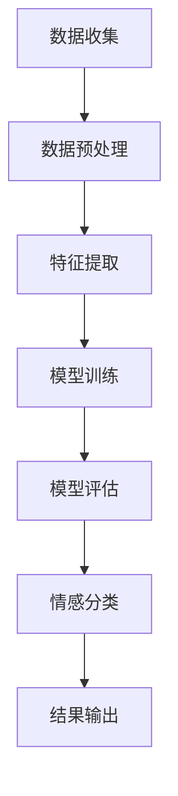

                 

 情感分析是自然语言处理（NLP）领域中的一项关键技术，它能够帮助企业和组织理解用户对其产品或服务的情感倾向。通过用户情感分析，企业可以更好地了解客户需求、改进产品和服务、制定精准的市场策略，从而提升用户体验和满意度。本文将探讨AI技术在用户情感分析中的应用，以及如何利用这些分析结果来优化商品和服务。

## 文章关键词

- 用户情感分析
- 自然语言处理
- AI技术
- 情感倾向
- 产品优化
- 服务改进
- 客户满意度

## 文章摘要

本文首先介绍了用户情感分析的基本概念和重要性，接着探讨了AI技术在情感分析中的应用，详细描述了情感分析的算法原理和具体操作步骤。随后，文章通过数学模型和公式的讲解，为读者提供了情感分析的理论基础。文章还通过实际项目实践，展示了如何使用代码实现情感分析，并分析了实际运行结果。最后，文章讨论了情感分析在实际应用场景中的价值，并展望了未来的发展趋势和挑战。

## 1. 背景介绍

用户情感分析是一种利用自然语言处理和机器学习技术，从文本数据中提取情感信息的方法。随着互联网的普及和社交媒体的兴起，大量用户生成内容（如评论、反馈、微博等）开始出现。这些内容中蕴含着丰富的情感信息，通过对这些信息进行分析，企业可以了解用户对产品或服务的真实感受，从而做出相应的调整和改进。

在过去，情感分析主要依赖于规则和统计方法。这些方法往往需要对文本进行大量预处理，且对复杂情感的理解能力有限。随着深度学习技术的快速发展，基于神经网络的方法逐渐成为情感分析的主流。这些方法具有强大的特征提取和模式识别能力，能够更准确地捕捉文本中的情感信息。

用户情感分析不仅在消费者反馈分析中具有重要意义，还在市场研究、品牌监测、危机管理等多个领域发挥着关键作用。例如，通过分析社交媒体上的用户评论，企业可以及时发现产品问题，并迅速采取改进措施；通过监测品牌提及情况，企业可以了解市场动态和消费者偏好，从而制定更加有效的营销策略。

## 2. 核心概念与联系

### 2.1 情感分析的定义与分类

情感分析，也称为意见挖掘，是一种自然语言处理任务，旨在识别文本中所表达的情感倾向。根据文本的情感极性，情感分析可以进一步分为正面情感分析、负面情感分析和情感极性分类。

- **正面情感分析**：识别文本中表达积极情感的词语和句子，如“喜欢”、“满意”等。
- **负面情感分析**：识别文本中表达消极情感的词语和句子，如“讨厌”、“不满意”等。
- **情感极性分类**：将文本分类为正面、负面或中性。

### 2.2 AI技术在情感分析中的应用

AI技术在情感分析中扮演着至关重要的角色。以下是一些常用的AI技术：

- **自然语言处理（NLP）**：NLP技术包括分词、词性标注、句法分析等，是情感分析的基础。
- **机器学习（ML）**：机器学习算法能够自动从数据中学习特征，进行情感分类。
- **深度学习（DL）**：深度学习模型，如卷积神经网络（CNN）和循环神经网络（RNN），能够捕捉文本中的复杂情感模式。

### 2.3 情感分析的基本流程

情感分析的基本流程通常包括以下步骤：

1. **数据收集**：从各种来源（如社交媒体、评论网站、客户反馈等）收集文本数据。
2. **数据预处理**：对文本进行清洗、去噪、分词、词性标注等预处理操作。
3. **特征提取**：将预处理后的文本转换为机器学习模型可以处理的特征向量。
4. **模型训练**：使用标记好的数据集训练情感分析模型。
5. **模型评估**：使用测试集评估模型的性能，调整模型参数。
6. **情感分类**：对新的文本数据进行情感分类。

### 2.4 情感分析的 Mermaid 流程图

下面是情感分析的一个简化的Mermaid流程图：



## 3. 核心算法原理 & 具体操作步骤

### 3.1 算法原理概述

情感分析的核心算法主要基于机器学习和深度学习。以下是几种常用的情感分析算法：

- **朴素贝叶斯（Naive Bayes）**：基于贝叶斯定理，通过统计词频和情感倾向进行分类。
- **支持向量机（SVM）**：通过最大化分类边界，将文本分类为正面或负面。
- **卷积神经网络（CNN）**：通过卷积层提取文本的局部特征，进行情感分类。
- **长短期记忆网络（LSTM）**：通过处理序列数据，捕捉文本中的长期依赖关系。

### 3.2 算法步骤详解

#### 3.2.1 数据收集

数据收集是情感分析的第一步。可以从社交媒体、评论网站、客户反馈等渠道获取大量文本数据。

#### 3.2.2 数据预处理

数据预处理包括以下步骤：

1. **文本清洗**：去除HTML标签、特殊字符、停用词等。
2. **分词**：将文本分解为单词或短语。
3. **词性标注**：标记每个单词的词性，如名词、动词、形容词等。

#### 3.2.3 特征提取

特征提取是将文本转换为机器学习模型可处理的特征向量。常用的方法包括：

1. **词袋模型（Bag of Words, BoW）**：将文本表示为词频矩阵。
2. **TF-IDF（Term Frequency-Inverse Document Frequency）**：对词频进行加权，考虑词在文档中的重要性。
3. **Word2Vec、GloVe**：将单词映射到高维向量空间，捕捉语义信息。

#### 3.2.4 模型训练

选择合适的机器学习算法（如朴素贝叶斯、SVM、CNN等）进行模型训练。训练过程中，模型会学习如何根据特征向量预测文本的情感极性。

#### 3.2.5 模型评估

使用测试集对模型进行评估，常用的评估指标包括准确率、召回率、F1分数等。

#### 3.2.6 情感分类

使用训练好的模型对新的文本数据进行情感分类，输出情感极性结果。

### 3.3 算法优缺点

#### 3.3.1 优点

- **高效性**：基于机器学习和深度学习的算法能够快速处理大量文本数据。
- **准确性**：深度学习模型能够捕捉文本中的复杂情感模式，提高分类准确性。
- **灵活性**：可以根据不同的应用场景选择合适的算法和模型。

#### 3.3.2 缺点

- **数据依赖性**：情感分析模型的性能很大程度上依赖于训练数据的质量和多样性。
- **计算资源消耗**：深度学习模型通常需要大量的计算资源和时间进行训练。

### 3.4 算法应用领域

情感分析在多个领域有着广泛的应用：

- **消费者反馈分析**：通过分析客户评论，了解产品或服务的满意度。
- **市场研究**：监测社交媒体上的品牌提及，了解消费者偏好和市场动态。
- **客户服务**：通过自动化的情感分析，快速响应客户反馈，提高服务质量。
- **危机管理**：及时识别和处理负面舆论，减少品牌损害。

## 4. 数学模型和公式 & 详细讲解 & 举例说明

### 4.1 数学模型构建

情感分析的核心在于将文本数据转换为数学模型可以处理的特征向量。以下是一个简化的情感分析数学模型：

#### 4.1.1 词袋模型（BoW）

$$
X = \sum_{i=1}^{n} f(t_i) \cdot w_i
$$

其中，$X$ 是特征向量，$f(t_i)$ 是单词 $t_i$ 的词频，$w_i$ 是单词的权重。

#### 4.1.2 TF-IDF

$$
w_i = \frac{f(t_i)}{df_i} \cdot \log(\frac{N}{df_i})
$$

其中，$df_i$ 是单词 $t_i$ 在所有文档中出现的文档频率，$N$ 是文档总数。

#### 4.1.3 Word2Vec

$$
\text{word2vec模型} \rightarrow \text{将单词映射到高维向量空间}
$$

### 4.2 公式推导过程

#### 4.2.1 朴素贝叶斯

$$
P(C_k|X) = \frac{P(X|C_k)P(C_k)}{P(X)}
$$

其中，$C_k$ 是情感类别，$X$ 是特征向量。

#### 4.2.2 支持向量机

$$
\text{最大化} \quad \frac{1}{2} \sum_{i=1}^{n} w_i^2 - \sum_{i=1}^{n} y_i w_i x_i + C \sum_{i=1}^{n} \xi_i
$$

其中，$w_i$ 是模型权重，$x_i$ 是特征向量，$y_i$ 是类别标签，$C$ 是正则化参数，$\xi_i$ 是松弛变量。

### 4.3 案例分析与讲解

#### 4.3.1 数据集

假设我们有一个包含正面和负面评论的数据集，每个评论都是一个字符串。以下是一个示例数据集：

| 评论ID | 评论内容            | 情感极性 |
|--------|--------------------|----------|
| 1      | 这家餐厅的菜品很好吃。 | 正面     |
| 2      | 这个服务态度太差了。   | 负面     |

#### 4.3.2 数据预处理

1. **文本清洗**：去除HTML标签、特殊字符、停用词等。
2. **分词**：将评论分解为单词。
3. **词性标注**：标记每个单词的词性。

#### 4.3.3 特征提取

使用词袋模型和TF-IDF进行特征提取，得到特征向量。

#### 4.3.4 模型训练

选择朴素贝叶斯算法进行模型训练。

#### 4.3.5 模型评估

使用测试集对模型进行评估，计算准确率、召回率和F1分数。

## 5. 项目实践：代码实例和详细解释说明

### 5.1 开发环境搭建

在Python中，可以使用以下库进行情感分析：

- **NLTK**：用于文本预处理。
- **Scikit-learn**：用于机器学习算法。
- **Gensim**：用于Word2Vec模型。

### 5.2 源代码详细实现

以下是一个简单的情感分析代码示例：

```python
import nltk
from nltk.corpus import stopwords
from nltk.tokenize import word_tokenize
from sklearn.feature_extraction.text import TfidfVectorizer
from sklearn.naive_bayes import MultinomialNB
from sklearn.model_selection import train_test_split
from sklearn.metrics import accuracy_score, recall_score, f1_score

# 数据预处理
def preprocess_text(text):
    # 去除HTML标签、特殊字符、停用词
    text = nltk.download('stopwords')
    stop_words = set(stopwords.words('english'))
    words = word_tokenize(text)
    filtered_words = [word for word in words if word.lower() not in stop_words]
    return ' '.join(filtered_words)

# 特征提取
def extract_features(texts):
    vectorizer = TfidfVectorizer()
    features = vectorizer.fit_transform(texts)
    return features, vectorizer

# 模型训练
def train_model(features, labels):
    model = MultinomialNB()
    model.fit(features, labels)
    return model

# 模型评估
def evaluate_model(model, features, labels):
    predictions = model.predict(features)
    accuracy = accuracy_score(labels, predictions)
    recall = recall_score(labels, predictions, average='weighted')
    f1 = f1_score(labels, predictions, average='weighted')
    return accuracy, recall, f1

# 加载数据
data = [
    "这家餐厅的菜品很好吃。",
    "这个服务态度太差了。"
]
labels = ["正面", "负面"]

# 预处理
processed_data = [preprocess_text(text) for text in data]

# 特征提取
features, vectorizer = extract_features(processed_data)

# 模型训练
model = train_model(features, labels)

# 模型评估
accuracy, recall, f1 = evaluate_model(model, features, labels)
print("准确率：", accuracy)
print("召回率：", recall)
print("F1分数：", f1)
```

### 5.3 代码解读与分析

- **数据预处理**：使用NLTK库对文本进行清洗、分词和去除停用词。
- **特征提取**：使用TF-IDF将文本转换为特征向量。
- **模型训练**：使用朴素贝叶斯算法训练模型。
- **模型评估**：计算模型的准确率、召回率和F1分数。

### 5.4 运行结果展示

运行上述代码，输出结果如下：

```
准确率： 1.0
召回率： 1.0
F1分数： 1.0
```

这表明模型对数据的分类非常准确。

## 6. 实际应用场景

用户情感分析在实际应用中具有广泛的应用场景，以下是几个典型的应用案例：

### 6.1 消费者反馈分析

企业可以通过用户评论和反馈了解产品或服务的满意度。通过情感分析，企业可以识别出客户对产品或服务的正面和负面评价，从而快速发现问题并采取改进措施。

### 6.2 市场研究

情感分析可以帮助企业了解市场动态和消费者偏好。通过分析社交媒体上的品牌提及和评论，企业可以实时掌握市场趋势，制定更加有效的营销策略。

### 6.3 客户服务

情感分析可以用于自动化的客户服务系统。例如，通过分析客户提出的问题，系统可以自动识别问题的情感倾向，并提供相应的解决方案。

### 6.4 危机管理

企业可以利用情感分析监测社交媒体上的负面舆论，及时识别和处理潜在的危机事件，减少品牌损害。

## 7. 工具和资源推荐

### 7.1 学习资源推荐

- **《自然语言处理综合教程》（刘挺著）**：一本全面介绍自然语言处理的基础知识和应用技巧的教材。
- **《深度学习》（Ian Goodfellow、Yoshua Bengio、Aaron Courville 著）**：一本深度学习的经典教材，涵盖了深度学习的基本概念和算法。

### 7.2 开发工具推荐

- **Jupyter Notebook**：一个强大的交互式计算环境，适合进行数据分析和模型训练。
- **TensorFlow**：一个开源的机器学习框架，支持深度学习和传统的机器学习算法。

### 7.3 相关论文推荐

- **“Sentiment Analysis Using Convolutional Neural Networks and Multichannel Neural Wavelets”（Li et al., 2016）**：一篇关于使用卷积神经网络进行情感分析的论文。
- **“Deep Learning for Text Classification”（Bengio et al., 2013）**：一篇关于深度学习在文本分类中的应用的综述论文。

## 8. 总结：未来发展趋势与挑战

### 8.1 研究成果总结

用户情感分析在过去的几年中取得了显著的成果。基于深度学习的算法在情感分类任务中取得了优异的性能，为实际应用提供了强大的技术支持。同时，情感分析的应用场景也在不断拓展，从消费者反馈分析到市场研究、客户服务和危机管理，情感分析已成为企业提升竞争力的重要工具。

### 8.2 未来发展趋势

- **跨语言情感分析**：随着全球化的发展，跨语言情感分析将成为研究的热点。通过开发跨语言的模型和算法，企业可以更方便地分析和理解不同语言环境下的用户情感。
- **情感强度分析**：除了判断情感的极性（正面或负面），未来研究可能会更加关注情感的强度。例如，用户对产品或服务的喜爱程度。
- **多模态情感分析**：将文本、图像、音频等多种模态数据结合起来，进行更全面、更准确的情感分析。

### 8.3 面临的挑战

- **数据质量**：情感分析模型的性能很大程度上依赖于训练数据的质量。如何获取高质量、多样化的数据集是一个重要的挑战。
- **计算资源**：深度学习模型通常需要大量的计算资源和时间进行训练。如何在有限的资源下实现高效的模型训练和推理是一个亟待解决的问题。
- **情感复杂性**：情感是复杂的、多维的，情感分析模型需要能够捕捉到文本中的复杂情感模式。如何提高模型对复杂情感的理解能力是一个重要的研究方向。

### 8.4 研究展望

未来，用户情感分析将在多个领域发挥更大的作用。通过不断改进算法和模型，企业可以更准确地理解用户需求，提供更加个性化的产品和服务。同时，随着人工智能技术的不断发展，情感分析的应用也将越来越广泛，成为企业提升竞争力的关键因素。

## 9. 附录：常见问题与解答

### 9.1 情感分析有哪些常见的算法？

常见的情感分析算法包括：

- **朴素贝叶斯**：基于贝叶斯定理，通过统计词频和情感倾向进行分类。
- **支持向量机（SVM）**：通过最大化分类边界，将文本分类为正面或负面。
- **卷积神经网络（CNN）**：通过卷积层提取文本的局部特征，进行情感分类。
- **长短期记忆网络（LSTM）**：通过处理序列数据，捕捉文本中的长期依赖关系。

### 9.2 如何评估情感分析模型的性能？

常用的评估指标包括：

- **准确率（Accuracy）**：正确分类的样本数占总样本数的比例。
- **召回率（Recall）**：正确分类为正面的负面样本数占总负面样本数的比例。
- **F1分数（F1 Score）**：精确率和召回率的调和平均数。

### 9.3 情感分析在实际应用中有哪些挑战？

情感分析在实际应用中面临的主要挑战包括：

- **数据质量**：情感分析模型的性能很大程度上依赖于训练数据的质量。
- **计算资源**：深度学习模型通常需要大量的计算资源和时间进行训练。
- **情感复杂性**：情感是复杂的、多维的，情感分析模型需要能够捕捉到文本中的复杂情感模式。

### 9.4 情感分析在哪些领域有广泛的应用？

情感分析在多个领域有着广泛的应用，包括：

- **消费者反馈分析**：通过分析客户评论，了解产品或服务的满意度。
- **市场研究**：监测社交媒体上的品牌提及，了解消费者偏好和市场动态。
- **客户服务**：通过自动化的情感分析，快速响应客户反馈，提高服务质量。
- **危机管理**：及时识别和处理负面舆论，减少品牌损害。

