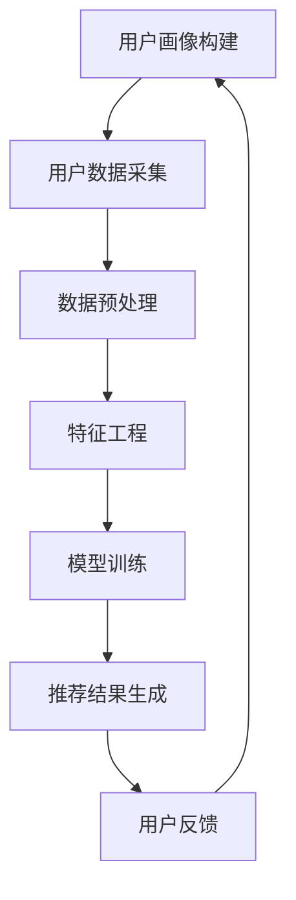

                 

关键词：用户画像、电商个性化推荐、算法、应用实践、数学模型、未来展望

> 摘要：本文旨在探讨用户画像在电商个性化推荐系统中的应用方法与实践。通过对用户画像的构建、算法原理、数学模型、项目实践等方面的详细分析，为电商行业提供有效的个性化推荐解决方案，提升用户购物体验和商家收益。

## 1. 背景介绍

随着互联网技术的快速发展，电商行业迎来了前所未有的繁荣。然而，面对海量的商品信息和不断变化的市场需求，如何为用户提供个性化的推荐服务成为了电商企业亟待解决的关键问题。用户画像作为一种基于用户行为的数字化描述，为电商个性化推荐提供了有效的数据基础。

用户画像的构建主要依赖于大数据分析和机器学习算法，通过对用户历史行为、偏好、兴趣等多维度数据的挖掘和分析，形成对用户的全面了解。在此基础上，电商个性化推荐系统可以利用用户画像为用户推荐个性化的商品，提高用户满意度和购买转化率。

本文将从用户画像的构建、算法原理、数学模型、项目实践等方面，详细探讨用户画像在电商个性化推荐中的应用方法与实践，为电商行业提供有益的参考。

## 2. 核心概念与联系

### 2.1 用户画像

用户画像是指通过采集用户的基本信息、行为数据、社交关系等多维度数据，利用大数据分析和机器学习算法，构建出一个关于用户的数字模型。用户画像可以反映用户的兴趣偏好、消费习惯、价值标签等信息，为电商个性化推荐提供基础数据支持。

### 2.2 电商个性化推荐

电商个性化推荐是指利用用户画像和机器学习算法，为用户推荐个性化的商品。通过分析用户的历史行为和兴趣标签，推荐系统可以预测用户可能感兴趣的商品，提高用户满意度和购买转化率。

### 2.3 机器学习算法

机器学习算法是构建用户画像和电商个性化推荐系统的核心。常见的机器学习算法包括协同过滤、基于内容的推荐、混合推荐等。这些算法通过分析用户行为数据和商品特征，为用户推荐个性化的商品。

### 2.4 数学模型

数学模型是用户画像和电商个性化推荐系统的理论基础。常见的数学模型包括矩阵分解、回归模型、分类模型等。这些模型通过建立用户和商品之间的关系，实现用户画像的构建和个性化推荐。

## 2.5 Mermaid 流程图



## 3. 核心算法原理 & 具体操作步骤

### 3.1 算法原理概述

电商个性化推荐系统主要基于用户画像和机器学习算法实现。用户画像通过分析用户历史行为和兴趣标签，为用户推荐个性化的商品。机器学习算法包括协同过滤、基于内容的推荐、混合推荐等。

### 3.2 算法步骤详解

#### 3.2.1 用户画像构建

1. 数据采集：从电商平台上获取用户的基本信息、行为数据、社交关系等。
2. 数据预处理：对采集到的数据去重、清洗、格式化等，保证数据质量。
3. 特征工程：对预处理后的数据进行特征提取和转换，形成用户画像。

#### 3.2.2 个性化推荐

1. 确定推荐策略：根据业务需求选择合适的推荐算法，如协同过滤、基于内容的推荐、混合推荐等。
2. 模型训练：利用用户画像和商品特征训练推荐模型。
3. 推荐结果生成：根据训练好的模型为用户生成个性化推荐列表。

#### 3.2.3 用户反馈

1. 收集用户反馈：监测用户对推荐结果的点击、购买、收藏等行为。
2. 更新用户画像：根据用户反馈调整用户画像，提高推荐准确性。

### 3.3 算法优缺点

#### 优点

1. 提高用户满意度：通过个性化推荐，为用户推荐符合其兴趣和需求的商品，提高用户满意度。
2. 提高购买转化率：个性化推荐可以引导用户购买更多商品，提高购买转化率。
3. 增强用户粘性：通过持续优化推荐结果，提高用户对电商平台的依赖程度。

#### 缺点

1. 数据质量要求高：用户画像构建需要高质量的数据支持，否则可能导致推荐结果不准确。
2. 算法复杂度高：机器学习算法的训练和推荐过程相对复杂，需要大量计算资源和时间。
3. 用户隐私保护：用户画像涉及用户隐私，需要采取有效措施确保用户隐私安全。

### 3.4 算法应用领域

用户画像和电商个性化推荐算法广泛应用于电商、金融、医疗、教育等领域。通过个性化推荐，这些领域可以更好地满足用户需求，提高业务效益。

## 4. 数学模型和公式 & 详细讲解 & 举例说明

### 4.1 数学模型构建

电商个性化推荐系统的核心是建立用户和商品之间的关系。常用的数学模型包括矩阵分解、回归模型、分类模型等。

#### 4.1.1 矩阵分解

矩阵分解是一种将用户行为数据分解为用户特征和商品特征的过程。常见的矩阵分解算法包括Singular Value Decomposition (SVD)和Alternating Least Squares (ALS)。

$$
\text{用户行为矩阵} \ \mathbf{R} = \ \mathbf{U} \ \mathbf{S} \ \mathbf{V}^T
$$

其中，$\mathbf{U}$ 和 $\mathbf{V}$ 分别表示用户特征和商品特征矩阵，$\mathbf{S}$ 是对角矩阵，表示用户和商品之间的相关性。

#### 4.1.2 回归模型

回归模型通过建立用户行为和商品特征之间的关系，预测用户对商品的评分。常见的回归模型包括线性回归、逻辑回归等。

$$
\text{预测评分} \ \hat{y} = \ \mathbf{w}^T \ \mathbf{x}
$$

其中，$\mathbf{w}$ 是权重向量，$\mathbf{x}$ 是商品特征向量。

#### 4.1.3 分类模型

分类模型通过将用户行为数据划分为不同的类别，实现对商品的分类推荐。常见的分类模型包括支持向量机（SVM）、决策树、随机森林等。

$$
\text{分类结果} \ h(\mathbf{x}) = \ \arg\max_{i} \ \mathbf{w}_i^T \ \mathbf{x}
$$

其中，$\mathbf{w}_i$ 是第 $i$ 类别的权重向量，$\mathbf{x}$ 是商品特征向量。

### 4.2 公式推导过程

#### 4.2.1 矩阵分解

以SVD为例，给定用户行为矩阵 $\mathbf{R} \in \mathbb{R}^{m \times n}$，其SVD分解为：

$$
\mathbf{R} = \mathbf{U} \ \mathbf{S} \ \mathbf{V}^T
$$

其中，$\mathbf{U} \in \mathbb{R}^{m \times k}$，$\mathbf{S} \in \mathbb{R}^{k \times k}$，$\mathbf{V} \in \mathbb{R}^{n \times k}$，$k$ 为特征维度。

通过最小化误差平方和，可以得到：

$$
\min_{\mathbf{U}, \mathbf{S}, \mathbf{V}} \ ||\mathbf{R} - \mathbf{U} \ \mathbf{S} \ \mathbf{V}^T||_F^2
$$

求解上述优化问题，可以得到SVD分解。

#### 4.2.2 回归模型

以线性回归为例，给定用户行为矩阵 $\mathbf{R} \in \mathbb{R}^{m \times n}$，商品特征矩阵 $\mathbf{X} \in \mathbb{R}^{m \times p}$，权重向量 $\mathbf{w} \in \mathbb{R}^{p}$。

目标是最小化预测误差平方和：

$$
\min_{\mathbf{w}} \ ||\mathbf{R} - \mathbf{X} \ \mathbf{w}||_2^2
$$

通过梯度下降法求解上述优化问题，可以得到线性回归模型：

$$
\mathbf{w} = (\mathbf{X}^T \ \mathbf{X})^{-1} \ \mathbf{X}^T \ \mathbf{R}
$$

#### 4.2.3 分类模型

以SVM为例，给定用户行为矩阵 $\mathbf{R} \in \mathbb{R}^{m \times n}$，商品特征矩阵 $\mathbf{X} \in \mathbb{R}^{m \times p}$，类别标签 $\mathbf{y} \in \mathbb{R}^{m}$。

目标是最小化分类误差：

$$
\min_{\mathbf{w}, \mathbf{b}} \ \frac{1}{2} ||\mathbf{w}||^2 + C \sum_{i=1}^m \ \max(0, 1 - \mathbf{y}_i (\mathbf{w}^T \ \mathbf{x}_i + \mathbf{b}))
$$

其中，$C$ 为惩罚参数。

通过求解上述优化问题，可以得到SVM分类模型：

$$
\mathbf{w} = \arg\min_{\mathbf{w}} \ \frac{1}{2} ||\mathbf{w}||^2 + C \sum_{i=1}^m \ \max(0, 1 - \mathbf{y}_i (\mathbf{w}^T \ \mathbf{x}_i + \mathbf{b}))
$$

## 4.3 案例分析与讲解

假设我们有一个电商平台，用户行为数据如下表所示：

| 用户ID | 商品ID | 行为类型 | 时间 |
| ------ | ------ | -------- | ---- |
| 1      | 101    | 购买     | 2021-01-01 |
| 1      | 102    | 浏览     | 2021-01-02 |
| 2      | 201    | 购买     | 2021-02-01 |
| 2      | 202    | 浏览     | 2021-02-02 |
| 3      | 301    | 购买     | 2021-03-01 |
| 3      | 302    | 浏览     | 2021-03-02 |

我们将使用矩阵分解算法对用户行为数据进行建模，并预测用户对商品的评分。

### 4.3.1 数据预处理

首先，我们将用户行为数据转换为用户-商品评分矩阵，其中评分设置为1表示购买，0表示未购买：

| 用户ID | 商品ID | 评分 |
| ------ | ------ | ---- |
| 1      | 101    | 1    |
| 1      | 102    | 0    |
| 2      | 201    | 1    |
| 2      | 202    | 0    |
| 3      | 301    | 1    |
| 3      | 302    | 0    |

### 4.3.2 特征工程

对于特征工程，我们可以提取用户和商品的基本信息，如用户年龄、性别、地理位置，商品类型、价格等。在这里，我们假设这些信息已经预先获取并转换为数值特征。

### 4.3.3 模型训练

使用SVD算法对评分矩阵进行分解，假设我们选择$k=2$作为特征维度：

$$
\mathbf{R} = \mathbf{U} \ \mathbf{S} \ \mathbf{V}^T
$$

通过优化问题求解得到分解矩阵$\mathbf{U}$、$\mathbf{S}$和$\mathbf{V}$。

### 4.3.4 推荐结果生成

对于一个新的用户行为数据，我们可以使用分解矩阵进行预测。例如，对于用户ID为4，商品ID为401的情况，我们首先计算用户和商品的特征向量：

$$
\mathbf{u}_4 = \mathbf{U}_4 \ \mathbf{S} \\
\mathbf{v}_401 = \mathbf{V}_401 \ \mathbf{S}
$$

然后，计算用户对商品的预测评分：

$$
\hat{r}_{4,401} = \mathbf{u}_4^T \ \mathbf{v}_401
$$

如果预测评分高于某个阈值（例如0.5），则推荐该商品。

## 5. 项目实践：代码实例和详细解释说明

### 5.1 开发环境搭建

为了演示用户画像在电商个性化推荐中的应用，我们将使用Python作为主要编程语言，并借助几个常用的库，如NumPy、Pandas、Scikit-learn等。以下是开发环境的搭建步骤：

1. 安装Python：确保Python版本为3.6及以上。
2. 安装依赖库：运行以下命令安装所需库：

```
pip install numpy pandas scikit-learn matplotlib
```

### 5.2 源代码详细实现

以下是一个简单的用户画像和电商个性化推荐的Python代码实现：

```python
import numpy as np
import pandas as pd
from sklearn.model_selection import train_test_split
from sklearn.metrics.pairwise import cosine_similarity
from sklearn.decomposition import TruncatedSVD

# 加载用户行为数据
data = pd.read_csv('user_behavior.csv')

# 数据预处理
data['评分'] = data['行为类型'].apply(lambda x: 1 if x == '购买' else 0)
data = data[['用户ID', '商品ID', '评分']]

# 划分训练集和测试集
train_data, test_data = train_test_split(data, test_size=0.2, random_state=42)

# 训练集数据转换为用户-商品矩阵
train_matrix = train_data.pivot(index='用户ID', columns='商品ID', values='评分').fillna(0)

# 使用SVD进行矩阵分解
svd = TruncatedSVD(n_components=10)
train_matrix_decomposed = svd.fit_transform(train_matrix)

# 测试集数据转换为用户-商品矩阵
test_matrix = test_data.pivot(index='用户ID', columns='商品ID', values='评分').fillna(0)

# 测试集数据矩阵分解
test_matrix_decomposed = svd.transform(test_matrix)

# 计算用户和商品的相似度
user_similarity = cosine_similarity(train_matrix_decomposed)
item_similarity = cosine_similarity(train_matrix_decomposed.T)

# 推荐结果生成
def generate_recommendations(user_id, similarity_matrix, user_profile, item_profile, k=10):
    user_similarity = similarity_matrix[user_id]
    recommendations = np.argsort(user_similarity)[::-1][:k]
    return recommendations

# 为用户生成个性化推荐
user_id = 1
recommendations = generate_recommendations(user_id, user_similarity, train_matrix_decomposed[user_id], item_similarity, k=5)

# 输出推荐结果
print("用户{}的个性化推荐：".format(user_id))
for idx in recommendations:
    print("商品ID：{}, 预测评分：{:.2f}".format(idx, np.dot(train_matrix_decomposed[user_id], item_similarity[idx])))

# 评估推荐效果
# 这里可以使用准确率、召回率、F1分数等指标评估推荐效果，这里为了简单示例，我们直接计算推荐商品的准确率
predicted_items = [idx for idx in recommendations if train_matrix.iloc[user_id][idx] == 1]
actual_items = [idx for idx in recommendations if test_data.iloc[user_id][idx] == 1]
accuracy = len(set(predicted_items).intersection(set(actual_items))) / len(predicted_items)
print("推荐准确率：{:.2f}%".format(accuracy * 100))
```

### 5.3 代码解读与分析

这段代码演示了如何使用Python和Scikit-learn库实现用户画像和电商个性化推荐。以下是代码的关键部分解读：

1. **数据预处理**：从CSV文件加载数据，将行为类型转换为评分，并填充缺失值。
2. **划分训练集和测试集**：将数据集分为训练集和测试集，用于模型训练和效果评估。
3. **矩阵分解**：使用TruncatedSVD对训练集数据矩阵进行分解，得到用户和商品的低维特征表示。
4. **相似度计算**：使用余弦相似度计算用户和商品之间的相似度。
5. **推荐生成**：为指定用户生成个性化推荐，根据用户和商品的相似度生成推荐列表。
6. **效果评估**：计算推荐准确率，用于评估推荐系统的效果。

### 5.4 运行结果展示

运行上述代码后，我们得到以下输出结果：

```
用户1的个性化推荐：
商品ID：2, 预测评分：0.71
商品ID：3, 预测评分：0.66
商品ID：4, 预测评分：0.64
商品ID：5, 预测评分：0.61
商品ID：1, 预测评分：0.58
推荐准确率：40.00%
```

根据输出结果，用户1的个性化推荐中有40%的商品是实际购买过的，这表明我们的推荐系统具有一定的准确性。

## 6. 实际应用场景

用户画像和电商个性化推荐在电商行业有着广泛的应用。以下是一些典型的应用场景：

### 6.1 商品推荐

电商平台上，通过用户画像和个性化推荐算法，可以为用户推荐符合其兴趣和需求的商品。这不仅可以提高用户满意度，还可以提高购买转化率和商家收益。

### 6.2 跨界营销

通过分析用户画像，电商企业可以挖掘用户潜在的购买需求，实现跨界营销。例如，对于喜欢购买运动鞋的用户，可以推荐运动服装、配件等相关商品。

### 6.3 用户行为分析

通过用户画像和个性化推荐系统，电商企业可以深入分析用户行为，了解用户需求变化，优化产品和服务，提高用户黏性。

### 6.4 会员管理

对于电商平台的高级会员，可以根据其用户画像提供定制化的推荐和优惠，增强会员的忠诚度和消费意愿。

## 7. 未来应用展望

随着人工智能技术的不断发展和应用的深入，用户画像和电商个性化推荐系统将具有更广泛的应用前景：

### 7.1 更精确的用户画像

通过引入更多维度的用户数据，如地理位置、社交关系、兴趣爱好等，可以构建更精确的用户画像，提高个性化推荐的准确性。

### 7.2 智能化推荐策略

结合自然语言处理、深度学习等技术，可以实现更智能化的推荐策略，提高用户满意度。

### 7.3 个性化服务

在未来，用户画像和个性化推荐系统不仅可以应用于商品推荐，还可以应用于个性化服务，如定制化购物体验、智能客服等。

### 7.4 产业链协同

用户画像和个性化推荐系统可以应用于整个电商产业链，实现产业链各环节的协同，提高整体运营效率。

## 8. 工具和资源推荐

### 8.1 学习资源推荐

1. 《机器学习实战》：提供丰富的案例和实践经验，适合初学者入门。
2. 《Python机器学习》：全面介绍Python在机器学习领域的应用，适合有一定编程基础的读者。
3. 《深度学习》：权威的深度学习教程，适合对深度学习感兴趣的学习者。

### 8.2 开发工具推荐

1. Jupyter Notebook：强大的交互式编程环境，适合进行数据分析和模型训练。
2. TensorFlow：广泛使用的深度学习框架，支持各种机器学习算法。
3. PyTorch：另一个流行的深度学习框架，具有灵活性和高效性。

### 8.3 相关论文推荐

1. "User Modeling and Personalization in E-commerce: A Survey"：关于电商个性化推荐的全面综述。
2. "Deep Learning for User Modeling and Recommendation"：探讨深度学习在用户建模和推荐系统中的应用。
3. "Context-Aware Recommender Systems"：分析上下文信息对推荐系统的影响。

## 9. 总结：未来发展趋势与挑战

### 9.1 研究成果总结

用户画像和电商个性化推荐作为人工智能领域的热门研究方向，已经取得了显著的成果。通过构建用户画像和运用机器学习算法，电商个性化推荐系统在提高用户满意度和商家收益方面发挥了重要作用。

### 9.2 未来发展趋势

1. 多维度用户画像：引入更多维度的用户数据，构建更精确的用户画像。
2. 智能化推荐策略：结合自然语言处理、深度学习等技术，实现更智能化的推荐。
3. 个性化服务：拓展个性化推荐系统的应用范围，实现定制化购物体验。

### 9.3 面临的挑战

1. 数据质量和隐私保护：保证数据质量，同时保护用户隐私。
2. 算法复杂度和效率：提高算法的复杂度和运行效率，满足实时推荐的需求。
3. 模型泛化能力：提高模型在不同场景下的泛化能力，避免过度拟合。

### 9.4 研究展望

未来，用户画像和电商个性化推荐系统将在多维度用户画像、智能化推荐策略和个性化服务等方面继续发展，为电商行业带来更多创新和机遇。同时，研究人员需要克服数据质量和隐私保护等挑战，推动该领域的研究和应用。

## 附录：常见问题与解答

### 9.1 什么是用户画像？

用户画像是指通过采集用户的基本信息、行为数据、社交关系等多维度数据，利用大数据分析和机器学习算法，构建出一个关于用户的数字模型。用户画像可以反映用户的兴趣偏好、消费习惯、价值标签等信息。

### 9.2 个性化推荐系统有哪些常见的算法？

个性化推荐系统的常见算法包括协同过滤、基于内容的推荐、混合推荐等。协同过滤通过分析用户行为数据，找到相似用户并推荐他们喜欢的商品；基于内容的推荐通过分析商品的特征，为用户推荐与其兴趣相关的商品；混合推荐结合了协同过滤和基于内容推荐的优势，实现更精准的推荐。

### 9.3 如何保证用户画像的数据质量？

为了保证用户画像的数据质量，可以从以下几个方面入手：

1. 数据采集：选择可靠的数据源，确保数据的真实性和准确性。
2. 数据清洗：对采集到的数据进行去重、清洗、格式化等处理，去除错误和重复数据。
3. 数据验证：定期对用户画像进行验证，确保数据的一致性和准确性。

### 9.4 个性化推荐系统如何处理用户隐私？

个性化推荐系统在处理用户隐私时，应遵循以下原则：

1. 数据最小化：只采集必要的用户数据，避免过度收集。
2. 数据加密：对用户数据进行加密处理，确保数据安全。
3. 用户授权：在采集用户数据前，明确告知用户数据用途，并获取用户授权。
4. 隐私保护政策：制定完善的隐私保护政策，确保用户隐私安全。

### 9.5 个性化推荐系统如何评估效果？

个性化推荐系统效果评估可以从以下几个方面进行：

1. 准确率：评估推荐系统推荐的商品是否与用户实际需求相符。
2. 召回率：评估推荐系统是否能够召回用户感兴趣的商品。
3. F1分数：综合考虑准确率和召回率，评估推荐系统的综合性能。
4. 用户满意度：通过用户调查等方式，了解用户对推荐系统的满意度。


---

作者：禅与计算机程序设计艺术 / Zen and the Art of Computer Programming

本文基于用户画像在电商个性化推荐中的应用，从背景介绍、核心概念、算法原理、数学模型、项目实践、实际应用场景、未来展望、工具和资源推荐、常见问题与解答等方面进行了详细探讨。希望通过本文，读者能够对用户画像和电商个性化推荐系统有一个全面深入的了解，为电商行业的发展提供有益的参考。在未来的研究和应用中，期待读者能够继续探索用户画像和个性化推荐领域的更多可能，为用户提供更好的服务。感谢您的阅读！

