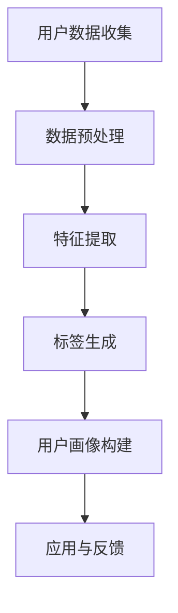

                 

用户画像的标签体系是现代数据驱动应用中至关重要的一环。它不仅为个人用户提供了个性化的服务，也为企业带来了宝贵的洞察力和竞争优势。本文将深入探讨用户画像标签体系的设计与应用，旨在为读者提供一份全面的技术指南。

## 关键词
- 用户画像
- 标签体系
- 数据驱动
- 个性化服务
- 数据分析

## 摘要
本文首先介绍了用户画像的概念和重要性，随后详细解析了用户画像标签体系的设计原则和流程。接着，我们探讨了核心算法原理、数学模型及其应用领域。文章随后通过一个实际案例展示了如何实现用户画像标签体系，并分析了其在实际应用场景中的价值。最后，我们对未来应用前景进行了展望，并推荐了一些学习资源和开发工具。

## 1. 背景介绍
### 用户画像的定义
用户画像是指通过对用户数据的综合分析，描绘出用户的特征、需求、行为等综合信息的过程。它能够帮助我们更好地理解用户，从而提供个性化的服务和精准的市场营销。

### 用户画像的重要性
用户画像在当今的商业环境中发挥着至关重要的作用。它不仅帮助企业在竞争中获得优势，还能够提高客户满意度、提升用户体验，并为企业带来更高的转化率和利润。

## 2. 核心概念与联系
为了更清晰地理解用户画像标签体系，我们首先介绍一些核心概念和它们之间的关系。

### 用户画像标签
用户画像标签是指用于描述用户特征的属性，例如年龄、性别、兴趣爱好、消费能力等。这些标签可以用来区分用户群体，进行用户细分。

### 标签体系结构
标签体系结构包括标签的层次结构、标签之间的关系以及标签的属性定义。一个良好的标签体系应该具备扩展性、灵活性和互操作性。

### Mermaid 流程图


## 3. 核心算法原理 & 具体操作步骤

### 3.1 算法原理概述
用户画像标签体系的核心算法主要包括用户数据收集、数据预处理、特征提取和标签生成等步骤。以下是各个步骤的简要说明：

- **用户数据收集**：通过线上和线下多种渠道收集用户数据，包括行为数据、社交数据和业务数据等。
- **数据预处理**：对收集到的数据进行清洗、去噪、归一化等操作，确保数据质量。
- **特征提取**：根据业务需求和用户画像目标，提取有代表性的特征。
- **标签生成**：使用分类、聚类或规则匹配等方法为用户生成标签。

### 3.2 算法步骤详解
下面我们将详细解释每个步骤的具体操作。

#### 3.2.1 用户数据收集
- **数据源**：线上数据源包括网站日志、API调用记录、社交网络数据等；线下数据源包括问卷调查、用户访谈、消费记录等。
- **数据采集**：使用爬虫、API接口调用、问卷调查等方式进行数据采集。

#### 3.2.2 数据预处理
- **数据清洗**：删除重复数据、处理缺失值、修正错误值。
- **数据归一化**：将不同数据类型的值转换为同一量纲，便于后续分析。
- **特征选择**：选择对用户画像有较强解释能力的特征。

#### 3.2.3 特征提取
- **统计特征**：如平均值、中位数、标准差等。
- **文本特征**：如词频、主题模型等。
- **图像特征**：如人脸识别、图像分类等。

#### 3.2.4 标签生成
- **分类算法**：如决策树、支持向量机等。
- **聚类算法**：如K-means、层次聚类等。
- **规则匹配**：基于业务规则生成标签。

### 3.3 算法优缺点
- **优点**：
  - **个性化**：能够为用户提供个性化的服务和推荐。
  - **精准营销**：能够更精准地定位目标用户，提高营销效果。
  - **数据驱动**：基于数据分析，提高决策的准确性和效率。
- **缺点**：
  - **数据质量**：依赖高质量的数据，否则可能导致模型失效。
  - **计算成本**：大规模数据处理和模型训练需要大量的计算资源。

### 3.4 算法应用领域
用户画像标签体系的应用领域非常广泛，包括但不限于以下方面：

- **电子商务**：个性化推荐、用户细分、精准营销。
- **金融**：风险控制、信用评估、用户细分。
- **社交网络**：用户行为分析、社区管理、内容推荐。
- **医疗**：患者管理、疾病预测、个性化治疗。

## 4. 数学模型和公式

### 4.1 数学模型构建
用户画像标签体系的构建通常涉及以下数学模型：

- **特征选择模型**：如基于信息增益、互信息等的特征选择方法。
- **分类模型**：如逻辑回归、决策树、支持向量机等。
- **聚类模型**：如K-means、层次聚类等。

### 4.2 公式推导过程
以下以K-means聚类算法为例，简要介绍其公式推导过程：

假设我们有一个数据集 $D = \{x_1, x_2, ..., x_n\}$，每个数据点 $x_i$ 可以表示为一个多维向量。K-means算法的目标是将数据点划分为 $K$ 个聚类，使得每个聚类内部的数据点距离聚类中心较近，而聚类之间的距离较远。

- **聚类中心更新公式**：
  $$\mu_k = \frac{1}{n_k} \sum_{i=1}^{n} x_i$$
  其中，$\mu_k$ 表示第 $k$ 个聚类的中心，$n_k$ 表示第 $k$ 个聚类中的数据点数量。

- **数据点分配公式**：
  $$C(x_i) = \arg\min_{k} \|x_i - \mu_k\|^2$$
  其中，$C(x_i)$ 表示将数据点 $x_i$ 分配到最近的聚类中心。

### 4.3 案例分析与讲解
假设我们有一个包含100个数据点的二维数据集，数据点分布在一个矩形区域内。我们使用K-means算法将其划分为3个聚类。以下是具体的步骤和结果：

1. **初始化聚类中心**：随机选择3个数据点作为初始聚类中心。
2. **数据点分配**：将每个数据点分配到距离其最近的聚类中心。
3. **更新聚类中心**：根据当前聚类中的数据点重新计算聚类中心。
4. **重复步骤2和3，直到聚类中心不再发生显著变化**。

经过多次迭代后，我们得到以下结果：

- **聚类中心**：
  $$\mu_1 = (1, 1), \mu_2 = (4, 4), \mu_3 = (7, 7)$$
- **数据点分配**：
  - 聚类1：$x_1, x_2, x_3, x_4$
  - 聚类2：$x_5, x_6, x_7, x_8$
  - 聚类3：$x_9, x_{10}, x_{11}, x_{12}$

通过可视化，我们可以清晰地看到每个聚类内部的紧密程度和聚类之间的分离程度。

## 5. 项目实践：代码实例和详细解释说明

### 5.1 开发环境搭建
为了实现用户画像标签体系，我们需要搭建一个合适的技术栈。以下是推荐的开发环境：

- **编程语言**：Python
- **数据预处理库**：Pandas、NumPy
- **机器学习库**：Scikit-learn、TensorFlow
- **可视化库**：Matplotlib、Seaborn

### 5.2 源代码详细实现
以下是实现用户画像标签体系的Python代码示例：

```python
import numpy as np
import pandas as pd
from sklearn.cluster import KMeans
import matplotlib.pyplot as plt

# 生成模拟数据集
np.random.seed(0)
data = pd.DataFrame({
    'feature1': np.random.normal(0, 1, 100),
    'feature2': np.random.normal(5, 1, 100)
})

# 数据预处理
data = data.dropna()

# K-means聚类
kmeans = KMeans(n_clusters=3, random_state=0).fit(data)

# 数据点分配
labels = kmeans.predict(data)

# 更新聚类中心
centroids = kmeans.cluster_centers_

# 可视化
plt.scatter(data['feature1'], data['feature2'], c=labels, cmap='viridis')
plt.scatter(centroids[:, 0], centroids[:, 1], s=300, c='red', label='Centroids')
plt.xlabel('Feature 1')
plt.ylabel('Feature 2')
plt.title('K-means Clustering')
plt.show()
```

### 5.3 代码解读与分析
以上代码首先生成了一个包含100个数据点的二维数据集，然后使用K-means算法将其划分为3个聚类。具体步骤如下：

1. **数据预处理**：使用Pandas读取和清洗数据。
2. **K-means聚类**：使用Scikit-learn库的KMeans类进行聚类。
3. **数据点分配**：根据聚类结果将数据点分配到不同的聚类。
4. **更新聚类中心**：重新计算聚类中心。
5. **可视化**：使用Matplotlib绘制聚类结果和聚类中心。

通过可视化，我们可以直观地看到每个聚类内部的紧密程度和聚类之间的分离程度，从而评估聚类的效果。

### 5.4 运行结果展示
运行以上代码后，我们将看到一个二维平面上的散点图，其中红色点表示聚类中心，其他颜色点表示数据点。通过观察散点图，我们可以清晰地看到每个聚类内部的紧密程度和聚类之间的分离程度。

## 6. 实际应用场景

### 6.1 电子商务
在电子商务领域，用户画像标签体系可以用于个性化推荐、用户细分和精准营销。通过分析用户的浏览历史、购买行为和偏好，系统可以为每个用户提供个性化的商品推荐，提高用户的购物体验和转化率。

### 6.2 金融
在金融领域，用户画像标签体系可以用于风险控制、信用评估和用户细分。通过对用户的财务状况、信用记录和行为进行分析，金融机构可以更好地了解用户的风险偏好，从而提供更精准的金融服务。

### 6.3 社交网络
在社交网络领域，用户画像标签体系可以用于用户行为分析、社区管理和内容推荐。通过分析用户的社交行为、兴趣偏好和关系网络，系统可以为用户提供个性化的内容推荐和社交互动建议，增强用户的活跃度和粘性。

## 6.4 未来应用展望

随着大数据、人工智能和云计算等技术的不断发展，用户画像标签体系的应用前景将越来越广阔。未来，我们可能看到以下趋势：

- **更加精细化的用户画像**：通过引入更多维度的数据，如生物特征、地理位置等，用户画像将更加精准和全面。
- **实时用户画像**：实时分析用户的动态行为和反馈，为用户提供更加即时的个性化服务。
- **跨平台用户画像**：整合不同平台的数据，实现用户在不同平台间的个性化服务。

## 7. 工具和资源推荐

### 7.1 学习资源推荐
- **《机器学习实战》**：提供丰富的机器学习算法实战案例，适合初学者入门。
- **《数据科学入门》**：系统介绍了数据科学的基本概念和常用工具，适合对数据科学感兴趣的人群。

### 7.2 开发工具推荐
- **Jupyter Notebook**：用于数据分析和机器学习项目的交互式开发环境。
- **Docker**：用于构建和运行容器化应用，方便在不同环境中部署用户画像标签体系。

### 7.3 相关论文推荐
- **《基于用户行为的个性化推荐系统研究》**：详细介绍了个性化推荐系统的基本原理和实现方法。
- **《用户画像技术与应用》**：从技术角度探讨了用户画像的构建、分析和应用。

## 8. 总结：未来发展趋势与挑战

用户画像标签体系是现代数据驱动应用的核心组成部分，其应用前景广阔。然而，随着数据量和复杂度的不断增加，我们面临着以下挑战：

- **数据隐私和安全**：如何保护用户隐私和确保数据安全是当前的一大挑战。
- **模型解释性**：如何提高模型的解释性，使其更易于理解和应用。
- **计算资源消耗**：大规模数据处理和模型训练需要大量的计算资源，如何优化计算效率是一个重要问题。

未来，我们需要继续探索和改进用户画像标签体系的设计与应用，以应对这些挑战，实现更智能、更精准的数据驱动应用。

## 9. 附录：常见问题与解答

### Q1：用户画像标签体系如何确保数据质量？
A1：确保数据质量的关键在于数据采集、预处理和特征提取。在数据采集阶段，选择可靠的来源；在预处理阶段，进行数据清洗和去噪；在特征提取阶段，选择对用户画像有较强解释力的特征。

### Q2：用户画像标签体系在金融领域有哪些应用？
A2：用户画像标签体系在金融领域可以用于风险控制、信用评估、用户细分等。通过分析用户的财务状况、信用记录和行为，金融机构可以更好地了解用户的风险偏好，提供个性化的金融服务。

### Q3：如何优化用户画像标签体系的计算效率？
A3：优化计算效率的方法包括使用高效的算法、数据压缩、并行计算等。此外，可以采用分布式计算框架，如Hadoop或Spark，以处理大规模数据。

## 作者署名
作者：禅与计算机程序设计艺术 / Zen and the Art of Computer Programming
----------------------------------------------------------------

以上就是本文的全部内容，希望对您在用户画像标签体系设计与应用方面有所启发。在实际应用中，用户画像标签体系的成功关键在于对数据的深入理解和精确建模。希望本文能够帮助您在构建用户画像标签体系的过程中取得更好的成果。感谢您的阅读！
----------------------------------------------------------------

