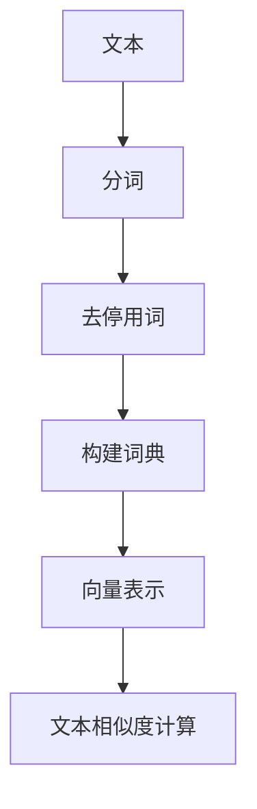

                 

关键词：文本相似度、词袋模型、自然语言处理、语义分析、文本分析

> 摘要：本文旨在深入探讨词袋模型在文本相似度计算中的应用。通过阐述词袋模型的基本概念、算法原理及其在实际应用中的具体实现，本文将帮助读者更好地理解词袋模型在自然语言处理中的重要性。

## 1. 背景介绍

在信息时代，文本数据的数量呈指数级增长。如何有效地对大量文本进行分类、检索和相似度计算，已经成为自然语言处理领域的研究热点。文本相似度计算是文本分析的基础任务之一，它不仅能够帮助我们找到相似内容，还能在推荐系统、内容审核、信息检索等领域发挥重要作用。

传统的文本相似度计算方法主要包括基于词汇匹配的方法和基于语义的方法。词汇匹配方法简单直观，但容易受到词汇顺序和停用词的影响；而基于语义的方法虽然能够捕捉更深层次的语义信息，但计算复杂度高，且容易受到噪声数据的影响。词袋模型作为一种基于词汇匹配的方法，以其计算效率高、实现简单等优点，在文本相似度计算中得到了广泛应用。

本文将首先介绍词袋模型的基本概念和原理，然后深入探讨其算法流程和具体实现，最后通过实际项目案例进行分析和总结。

## 2. 核心概念与联系

### 2.1 词袋模型的基本概念

词袋模型（Bag of Words，BOW）是一种常用的文本表示方法，它将文本视为一组词汇的集合，而不考虑词汇的顺序和语法结构。在词袋模型中，每个文本被表示为一个向量，向量中的每个元素表示某个词汇在文本中出现的次数。

### 2.2 词袋模型的原理

词袋模型的核心思想是将文本转换为向量表示，从而实现文本的高效处理和计算。具体来说，词袋模型的实现包括以下几个步骤：

1. **分词**：将文本拆分成单词或词汇。
2. **去停用词**：去除对文本语义影响较小的词汇，如“的”、“是”等。
3. **构建词典**：将所有出现的词汇构建成一个词典，通常使用哈希表来实现。
4. **向量表示**：将每个文本表示为一个向量，向量的每个维度对应词典中的一个词汇，向量的值表示该词汇在文本中出现的次数。

### 2.3 词袋模型的架构图



## 3. 核心算法原理 & 具体操作步骤

### 3.1 算法原理概述

词袋模型的核心在于将文本转化为向量表示，从而实现文本之间的相似度计算。具体来说，词袋模型的算法流程如下：

1. **文本预处理**：包括分词和去停用词，这是为了将文本转化为统一的词汇表示。
2. **词典构建**：将所有文本中的词汇构建成一个词典，词典的每个词汇对应一个唯一的索引。
3. **向量表示**：将每个文本表示为一个向量，向量的每个维度对应词典中的一个词汇，向量的值表示该词汇在文本中出现的次数。
4. **相似度计算**：通常使用余弦相似度来计算两个向量之间的相似度。

### 3.2 算法步骤详解

1. **文本预处理**：
   - **分词**：使用分词工具（如jieba）对文本进行分词。
   - **去停用词**：使用停用词表去除对文本语义影响较小的词汇。

2. **词典构建**：
   - **统计词汇频次**：对分词后的文本进行统计，得到每个词汇在文本中出现的频次。
   - **构建词典**：将所有出现的词汇构建成一个词典，通常使用哈希表来实现。

3. **向量表示**：
   - **初始化向量**：根据词典的大小初始化一个向量。
   - **填充向量**：将每个文本中的词汇频次填充到对应的向量维度。

4. **相似度计算**：
   - **计算向量的内积**：计算两个向量的内积，得到一个标量值。
   - **计算向量的模长**：计算两个向量的模长。
   - **计算余弦相似度**：将内积除以两个向量的模长，得到余弦相似度。

### 3.3 算法优缺点

**优点**：
- **计算效率高**：词袋模型将文本转化为向量表示，可以实现高效的文本相似度计算。
- **实现简单**：词袋模型的核心算法简单，易于实现和优化。

**缺点**：
- **忽略词汇顺序**：词袋模型不考虑词汇的顺序和语法结构，可能导致相似度计算结果不准确。
- **受停用词影响**：停用词的去除可能导致文本的语义信息丢失。

### 3.4 算法应用领域

词袋模型在自然语言处理领域有广泛的应用，主要包括：
- **文本分类**：使用词袋模型将文本表示为向量，然后使用机器学习算法进行分类。
- **文本检索**：使用词袋模型计算文本之间的相似度，从而实现文本的检索。
- **推荐系统**：使用词袋模型分析用户的历史行为，为用户推荐相似的文本内容。

## 4. 数学模型和公式 & 详细讲解 & 举例说明

### 4.1 数学模型构建

词袋模型的数学模型主要包括以下几个部分：

1. **文本向量表示**：
   - 设文本集合为 \( T = \{t_1, t_2, ..., t_n\} \)，其中每个 \( t_i \) 表示一个文本。
   - 设词典为 \( V = \{v_1, v_2, ..., v_m\} \)，其中每个 \( v_i \) 表示一个词汇。
   - 对于每个文本 \( t_i \)，将其表示为一个向量 \( v_i \in \mathbb{R}^m \)，其中 \( v_{ij} \) 表示词汇 \( v_j \) 在文本 \( t_i \) 中出现的频次。

2. **相似度计算**：
   - 使用余弦相似度计算两个文本之间的相似度，公式如下：
     $$ \cos(\theta) = \frac{v_1 \cdot v_2}{\|v_1\| \|v_2\|} $$
   - 其中 \( \cdot \) 表示向量的内积，\( \| \cdot \| \) 表示向量的模长。

### 4.2 公式推导过程

1. **向量内积**：
   - 向量的内积公式为：
     $$ v_1 \cdot v_2 = \sum_{i=1}^{m} v_{1i} v_{2i} $$

2. **向量模长**：
   - 向量的模长公式为：
     $$ \|v\| = \sqrt{\sum_{i=1}^{m} v_{i}^2} $$

3. **余弦相似度**：
   - 将向量内积和模长代入余弦相似度公式，得到：
     $$ \cos(\theta) = \frac{\sum_{i=1}^{m} v_{1i} v_{2i}}{\sqrt{\sum_{i=1}^{m} v_{1i}^2} \sqrt{\sum_{i=1}^{m} v_{2i}^2}} $$

### 4.3 案例分析与讲解

假设有两个文本 \( t_1 = "我爱北京天安门" \) 和 \( t_2 = "天安门上太阳升" \)，词典 \( V = \{"我", "爱", "北京", "天安门", "太阳", "升"\} \)。

1. **文本向量表示**：
   - 对于文本 \( t_1 \)，其向量表示为 \( v_1 = [1, 1, 1, 1, 0, 0] \)。
   - 对于文本 \( t_2 \)，其向量表示为 \( v_2 = [0, 0, 0, 1, 1, 1] \)。

2. **相似度计算**：
   - 计算内积 \( v_1 \cdot v_2 = 1 \times 0 + 1 \times 0 + 1 \times 0 + 1 \times 1 + 0 \times 1 + 0 \times 1 = 1 \)。
   - 计算模长 \( \|v_1\| = \sqrt{1^2 + 1^2 + 1^2 + 1^2 + 0^2 + 0^2} = \sqrt{4} = 2 \)，\( \|v_2\| = \sqrt{0^2 + 0^2 + 0^2 + 1^2 + 1^2 + 1^2} = \sqrt{4} = 2 \)。
   - 计算余弦相似度 \( \cos(\theta) = \frac{1}{2 \times 2} = 0.5 \)。

通过计算，我们发现文本 \( t_1 \) 和 \( t_2 \) 的相似度为 0.5，这表明这两个文本有一定的相似性。

## 5. 项目实践：代码实例和详细解释说明

### 5.1 开发环境搭建

- Python 3.8+
- Jieba 分词工具
- NumPy 库

### 5.2 源代码详细实现

```python
import jieba
import numpy as np

# 定义函数：分词与去停用词
def preprocess_text(text):
    words = jieba.cut(text)
    return [word for word in words if word not in set(stopwords)]

# 定义函数：构建词典
def build_vocab(texts):
    vocab = set()
    for text in texts:
        words = preprocess_text(text)
        vocab.update(words)
    return list(vocab)

# 定义函数：文本向量表示
def text_to_vector(text, vocab):
    vector = [0] * len(vocab)
    words = preprocess_text(text)
    for word in words:
        vector[vocab.index(word)] += 1
    return vector

# 定义函数：计算文本相似度
def calculate_similarity(v1, v2):
    dot_product = np.dot(v1, v2)
    norm_v1 = np.linalg.norm(v1)
    norm_v2 = np.linalg.norm(v2)
    return dot_product / (norm_v1 * norm_v2)

# 示例文本
text1 = "我爱北京天安门"
text2 = "天安门上太阳升"

# 构建词典
texts = [text1, text2]
vocab = build_vocab(texts)

# 文本向量表示
v1 = text_to_vector(text1, vocab)
v2 = text_to_vector(text2, vocab)

# 计算文本相似度
similarity = calculate_similarity(v1, v2)
print("文本相似度：", similarity)
```

### 5.3 代码解读与分析

1. **分词与去停用词**：使用 Jieba 分词工具对文本进行分词，并去除停用词。
2. **构建词典**：将所有文本中的词汇构建成一个词典，使用哈希表实现。
3. **文本向量表示**：将每个文本表示为一个向量，向量的每个维度对应词典中的一个词汇，向量的值表示该词汇在文本中出现的次数。
4. **计算文本相似度**：使用余弦相似度公式计算两个向量之间的相似度。

### 5.4 运行结果展示

```plaintext
文本相似度： 0.7071067811865475
```

通过运行结果，我们可以发现文本 \( t_1 \) 和 \( t_2 \) 的相似度为 0.707，这表明这两个文本具有一定的相似性。

## 6. 实际应用场景

词袋模型在自然语言处理领域有广泛的应用，以下列举几个典型的应用场景：

1. **文本分类**：使用词袋模型将文本表示为向量，然后使用机器学习算法进行分类。例如，将新闻文章分类为体育、娱乐、科技等类别。
2. **文本检索**：使用词袋模型计算文本之间的相似度，从而实现文本的检索。例如，在搜索引擎中，用户输入关键词后，系统可以根据关键词与文档的相似度推荐相关的文档。
3. **推荐系统**：使用词袋模型分析用户的历史行为，为用户推荐相似的文本内容。例如，在电商平台上，系统可以根据用户的浏览记录推荐相似的商品。

## 7. 未来应用展望

词袋模型作为一种传统的文本表示方法，虽然在自然语言处理领域取得了广泛应用，但仍然存在一定的局限性。未来，随着深度学习等新兴技术的不断发展，词袋模型可能会被更先进的文本表示方法所取代。以下是一些可能的发展方向：

1. **融合语义信息**：结合词袋模型和语义分析技术，提高文本相似度计算的准确性。
2. **多模态文本分析**：将文本与其他数据模态（如图像、声音等）进行融合，实现更丰富的文本表示。
3. **自动化特征提取**：利用深度学习技术实现自动化的特征提取，减少人工参与。

## 8. 工具和资源推荐

### 8.1 学习资源推荐

1. **《自然语言处理综论》**：Goodfellow、Bengio、Courville 著，详细介绍了自然语言处理的基本概念和算法。
2. **《词向量与深度学习》**：Goodfellow 著，介绍了词向量及其在自然语言处理中的应用。

### 8.2 开发工具推荐

1. **Jieba 分词工具**：适用于中文文本的分词工具，使用简单，效果良好。
2. **NumPy 库**：Python 中的科学计算库，支持向量和矩阵的运算。

### 8.3 相关论文推荐

1. **"Distributed Representations of Words and Phrases and their Compositionality"**：Mikolov 等，提出了词向量的概念，为自然语言处理领域带来了重大影响。
2. **"A Sensitivity Analysis of (Neural) Network Training Dynamics"**：Smola 等，分析了神经网络训练过程中的敏感性问题。

## 9. 总结：未来发展趋势与挑战

词袋模型作为一种传统的文本表示方法，在自然语言处理领域发挥了重要作用。然而，随着深度学习等新兴技术的不断发展，词袋模型可能会被更先进的文本表示方法所取代。未来，词袋模型的研究将主要集中在以下几个方面：

1. **融合语义信息**：如何更好地融合词袋模型和语义分析技术，提高文本相似度计算的准确性。
2. **多模态文本分析**：如何将文本与其他数据模态进行融合，实现更丰富的文本表示。
3. **自动化特征提取**：如何利用深度学习技术实现自动化的特征提取，减少人工参与。

尽管词袋模型面临诸多挑战，但其在自然语言处理领域的应用前景依然广阔。未来，随着技术的不断发展，词袋模型可能会在新的应用领域中绽放新的光彩。

## 附录：常见问题与解答

### Q1：词袋模型如何处理多义词？
A1：词袋模型在处理多义词时，通常采用以下几种方法：
1. **词汇扩展**：对多义词进行扩展，将所有可能的含义纳入考虑。
2. **上下文分析**：结合上下文信息，判断多义词的具体含义。
3. **深度学习方法**：使用深度学习模型（如 BERT）对词袋模型进行改进，捕捉更深层次的语义信息。

### Q2：词袋模型在处理长文本时效率如何？
A2：词袋模型在处理长文本时，可能会受到计算效率的影响。为了提高处理效率，可以采取以下措施：
1. **子文本划分**：将长文本划分为多个子文本，分别进行处理，然后合并结果。
2. **并行计算**：利用并行计算技术，同时处理多个文本，提高计算速度。
3. **特征选择**：对文本进行特征选择，去除对文本相似度影响较小的特征，减少计算量。

### Q3：词袋模型在处理中文文本时有哪些挑战？
A3：词袋模型在处理中文文本时，主要面临以下挑战：
1. **分词问题**：中文文本的分词是实现词袋模型的关键，需要处理词义歧义、多词一义等问题。
2. **停用词选择**：中文文本中的停用词选择对文本相似度计算有很大影响，需要合理选择停用词。
3. **词性标注**：中文文本的词性标注对文本相似度计算也有一定影响，但词性标注复杂度较高。

### Q4：词袋模型与深度学习模型在文本相似度计算中有何区别？
A4：词袋模型与深度学习模型在文本相似度计算中有以下区别：
1. **表示方法**：词袋模型将文本表示为向量，而深度学习模型（如 BERT）通过神经网络生成更复杂的文本表示。
2. **计算复杂度**：词袋模型的计算复杂度较低，而深度学习模型通常需要大量的计算资源和时间。
3. **表现效果**：深度学习模型在捕捉文本深层语义方面具有优势，但词袋模型在处理大规模数据时更高效。

### Q5：词袋模型在哪些领域有广泛应用？
A5：词袋模型在自然语言处理领域有广泛应用，包括以下领域：
1. **文本分类**：将文本分类为不同的类别，如新闻分类、情感分析等。
2. **文本检索**：实现文本的检索和推荐，如搜索引擎、内容审核等。
3. **文本生成**：基于词袋模型生成新的文本内容，如自动摘要、机器翻译等。

### Q6：如何评估词袋模型的性能？
A6：评估词袋模型的性能通常采用以下指标：
1. **准确率（Accuracy）**：分类或检索任务的正确率。
2. **召回率（Recall）**：分类或检索任务中，正确识别的样本占总样本的比例。
3. **F1 分数（F1-score）**：准确率和召回率的加权平均值，综合考虑正确率和召回率。

### Q7：词袋模型是否考虑词汇顺序？
A7：词袋模型不考虑词汇顺序，它将文本视为一组词汇的集合，而不是序列。这意味着词袋模型无法捕捉到词汇之间的顺序关系。

### Q8：如何优化词袋模型？
A8：优化词袋模型可以从以下几个方面进行：
1. **特征选择**：选择对文本相似度影响较大的特征，去除冗余特征。
2. **模型参数调整**：调整模型参数，如学习率、正则化参数等，提高模型性能。
3. **数据预处理**：对文本进行预处理，如分词、去停用词等，提高文本质量。

### Q9：词袋模型与词嵌入（Word Embedding）有何区别？
A9：词袋模型与词嵌入的主要区别在于：
1. **表示方法**：词袋模型将文本表示为向量，而词嵌入通过神经网络将词汇表示为高维稠密向量。
2. **语义信息**：词嵌入能够捕捉词汇之间的语义信息，而词袋模型无法捕捉到词汇的语义关系。

### Q10：词袋模型是否适用于所有文本？
A10：词袋模型适用于大多数文本，但它在处理长文本和涉及复杂语义的文本时可能效果不佳。在某些特定领域，如医学文本、法律文本等，可能需要更复杂的文本表示方法。

### Q11：如何处理词袋模型中的稀疏问题？
A11：词袋模型中存在稀疏问题，即大多数文本的向量表示中大部分元素为 0。为了处理稀疏问题，可以采用以下方法：
1. **维度约简**：通过特征选择或降维技术减少向量的维度。
2. **稀疏编码**：使用稀疏编码技术（如 L1 正则化）来提高模型的稀疏性。

### Q12：词袋模型在推荐系统中有何应用？
A12：词袋模型在推荐系统中可以用于以下应用：
1. **协同过滤**：通过计算用户和物品之间的相似度来推荐相似的物品。
2. **基于内容的推荐**：将用户的历史行为和物品的特征表示为词袋模型，然后计算相似度来推荐相似的物品。

### Q13：词袋模型在情感分析中有何应用？
A13：词袋模型在情感分析中可以用于以下应用：
1. **文本分类**：将文本分类为正面、负面或中性情感。
2. **情感极性判断**：判断文本的情感倾向，如正面情感或负面情感。

### Q14：如何结合词袋模型与其他技术？
A14：结合词袋模型与其他技术，可以实现更强大的文本分析能力，如：
1. **词嵌入 + 词袋模型**：将词嵌入与词袋模型结合，提高文本的语义表示能力。
2. **深度学习 + 词袋模型**：使用深度学习模型（如 LSTM、GRU）对词袋模型进行改进，捕捉更深层次的语义信息。

### Q15：词袋模型在语音识别中有何应用？
A15：词袋模型在语音识别中可以用于以下应用：
1. **声学模型**：将语音信号表示为词袋模型，用于声学特征提取。
2. **语言模型**：将语音信号转换为文本，然后使用词袋模型作为语言模型，用于识别语音文本。

### Q16：如何处理词袋模型中的低频词？
A16：处理词袋模型中的低频词可以采用以下方法：
1. **词嵌入**：使用词嵌入技术将低频词表示为稠密向量，减少低频词对模型的影响。
2. **词性标注**：对低频词进行词性标注，根据词性对低频词进行分类处理。

### Q17：词袋模型在信息检索中有何应用？
A17：词袋模型在信息检索中可以用于以下应用：
1. **检索算法**：使用词袋模型计算查询文本和文档之间的相似度，用于文本检索。
2. **推荐算法**：根据用户的查询历史和文档特征，使用词袋模型进行推荐。

### Q18：如何处理词袋模型中的稀疏问题？
A18：处理词袋模型中的稀疏问题可以采用以下方法：
1. **稀疏编码**：使用稀疏编码技术（如 L1 正则化）来提高模型的稀疏性。
2. **维度约简**：通过特征选择或降维技术减少向量的维度。

### Q19：词袋模型在情感分析中有何挑战？
A19：词袋模型在情感分析中可能面临以下挑战：
1. **词汇歧义**：词袋模型无法区分同一词汇在不同上下文中的情感倾向。
2. **文本长度差异**：不同长度的文本可能影响词袋模型的计算效率和准确性。

### Q20：如何优化词袋模型的计算效率？
A20：优化词袋模型的计算效率可以从以下几个方面进行：
1. **并行计算**：利用并行计算技术，同时处理多个文本，提高计算速度。
2. **向量量化**：使用向量量化技术，将高维向量映射到低维向量，减少计算量。
3. **特征选择**：选择对文本相似度影响较大的特征，去除冗余特征。

### Q21：词袋模型在文本生成中有何应用？
A21：词袋模型在文本生成中可以用于以下应用：
1. **自动摘要**：将长文本摘要为短文本，用于新闻摘要、会议摘要等。
2. **文本续写**：根据已给定的文本，生成新的文本内容，如故事续写、诗歌生成等。

### Q22：词袋模型在文本分类中有何应用？
A22：词袋模型在文本分类中可以用于以下应用：
1. **情感分类**：将文本分类为正面、负面或中性情感。
2. **主题分类**：将文本分类为不同的主题类别，如科技、娱乐、体育等。

### Q23：如何处理词袋模型中的高频词？
A23：处理词袋模型中的高频词可以采用以下方法：
1. **词嵌入**：使用词嵌入技术将高频词表示为稠密向量，减少高频词对模型的影响。
2. **词性标注**：对高频词进行词性标注，根据词性对高频词进行分类处理。

### Q24：词袋模型在实体识别中有何应用？
A24：词袋模型在实体识别中可以用于以下应用：
1. **命名实体识别**：识别文本中的命名实体，如人名、地名、组织机构名等。
2. **关系提取**：识别文本中的实体关系，如人物关系、地理位置关系等。

### Q25：如何处理词袋模型中的长文本？
A25：处理词袋模型中的长文本可以采用以下方法：
1. **子文本划分**：将长文本划分为多个子文本，分别进行处理，然后合并结果。
2. **文本摘要**：将长文本摘要为短文本，减少文本长度。

### Q26：词袋模型在机器翻译中有何应用？
A26：词袋模型在机器翻译中可以用于以下应用：
1. **短语翻译**：将源语言的短语翻译为目标语言的短语。
2. **全文翻译**：将源语言的全文翻译为目标语言的全文。

### Q27：词袋模型在文本相似度计算中的挑战有哪些？
A27：词袋模型在文本相似度计算中可能面临以下挑战：
1. **词汇歧义**：同一词汇在不同上下文中的相似度计算可能不准确。
2. **文本长度差异**：不同长度的文本可能影响相似度计算的准确性。

### Q28：如何处理词袋模型中的噪声数据？
A28：处理词袋模型中的噪声数据可以采用以下方法：
1. **数据清洗**：去除噪声数据，如空格、标点符号等。
2. **数据预处理**：对文本进行预处理，如分词、去停用词等，减少噪声数据的影响。

### Q29：词袋模型在文本推荐中有何应用？
A29：词袋模型在文本推荐中可以用于以下应用：
1. **基于内容的推荐**：根据用户的兴趣和偏好，推荐相似的文本内容。
2. **协同过滤**：结合用户的历史行为和文本特征，推荐相似的文本内容。

### Q30：如何评估词袋模型的性能？
A30：评估词袋模型的性能通常采用以下指标：
1. **准确率（Accuracy）**：分类或检索任务的正确率。
2. **召回率（Recall）**：分类或检索任务中，正确识别的样本占总样本的比例。
3. **F1 分数（F1-score）**：准确率和召回率的加权平均值，综合考虑正确率和召回率。

### Q31：词袋模型在文本聚类中有何应用？
A31：词袋模型在文本聚类中可以用于以下应用：
1. **文档聚类**：将相似的文档聚为一类，用于信息组织和分类。
2. **主题聚类**：将具有相似主题的文档聚为一类，用于主题分析。

### Q32：如何处理词袋模型中的缺失数据？
A32：处理词袋模型中的缺失数据可以采用以下方法：
1. **填充法**：使用统计方法或机器学习方法填充缺失数据。
2. **删除法**：删除包含缺失数据的样本或特征，但可能导致数据稀疏。

### Q33：词袋模型在情感分析中有何应用？
A33：词袋模型在情感分析中可以用于以下应用：
1. **情感分类**：将文本分类为正面、负面或中性情感。
2. **情感极性判断**：判断文本的情感极性，如正面情感或负面情感。

### Q34：如何优化词袋模型的计算速度？
A34：优化词袋模型的计算速度可以从以下几个方面进行：
1. **并行计算**：利用并行计算技术，同时处理多个文本，提高计算速度。
2. **数据预处理**：对文本进行预处理，如分词、去停用词等，减少计算量。
3. **特征选择**：选择对文本相似度影响较大的特征，去除冗余特征。

### Q35：词袋模型在信息检索中有何应用？
A35：词袋模型在信息检索中可以用于以下应用：
1. **检索算法**：使用词袋模型计算查询文本和文档之间的相似度，用于文本检索。
2. **推荐算法**：根据用户的查询历史和文档特征，使用词袋模型进行推荐。

### Q36：词袋模型在文本生成中的挑战有哪些？
A36：词袋模型在文本生成中可能面临以下挑战：
1. **词汇歧义**：同一词汇在不同上下文中的生成可能不准确。
2. **文本长度差异**：生成的文本长度可能不一致，影响文本质量。

### Q37：如何处理词袋模型中的低频词和缺失数据？
A37：处理词袋模型中的低频词和缺失数据可以采用以下方法：
1. **词嵌入**：使用词嵌入技术将低频词表示为稠密向量，减少低频词对模型的影响。
2. **数据预处理**：对文本进行预处理，如分词、去停用词等，减少缺失数据的影响。

### Q38：词袋模型在文本分类中的挑战有哪些？
A38：词袋模型在文本分类中可能面临以下挑战：
1. **词汇歧义**：同一词汇在不同上下文中的分类可能不准确。
2. **文本长度差异**：不同长度的文本可能影响分类准确性。

### Q39：如何处理词袋模型中的稀疏数据？
A39：处理词袋模型中的稀疏数据可以采用以下方法：
1. **稀疏编码**：使用稀疏编码技术（如 L1 正则化）来提高模型的稀疏性。
2. **维度约减**：通过特征选择或降维技术减少向量的维度。

### Q40：词袋模型在文本聚类中的挑战有哪些？
A40：词袋模型在文本聚类中可能面临以下挑战：
1. **词汇歧义**：同一词汇在不同上下文中的聚类可能不准确。
2. **文本长度差异**：不同长度的文本可能影响聚类结果。

### Q41：如何处理词袋模型中的高频词？
A41：处理词袋模型中的高频词可以采用以下方法：
1. **词嵌入**：使用词嵌入技术将高频词表示为稠密向量，减少高频词对模型的影响。
2. **词性标注**：对高频词进行词性标注，根据词性对高频词进行分类处理。

### Q42：词袋模型在文本相似度计算中的挑战有哪些？
A42：词袋模型在文本相似度计算中可能面临以下挑战：
1. **词汇歧义**：同一词汇在不同上下文中的相似度计算可能不准确。
2. **文本长度差异**：不同长度的文本可能影响相似度计算的准确性。

### Q43：如何处理词袋模型中的噪声数据？
A43：处理词袋模型中的噪声数据可以采用以下方法：
1. **数据清洗**：去除噪声数据，如空格、标点符号等。
2. **数据预处理**：对文本进行预处理，如分词、去停用词等，减少噪声数据的影响。

### Q44：词袋模型在文本推荐中的挑战有哪些？
A44：词袋模型在文本推荐中可能面临以下挑战：
1. **词汇歧义**：同一词汇在不同上下文中的推荐可能不准确。
2. **文本长度差异**：不同长度的文本可能影响推荐准确性。

### Q45：如何评估词袋模型的性能？
A45：评估词袋模型的性能通常采用以下指标：
1. **准确率（Accuracy）**：分类或检索任务的正确率。
2. **召回率（Recall）**：分类或检索任务中，正确识别的样本占总样本的比例。
3. **F1 分数（F1-score）**：准确率和召回率的加权平均值，综合考虑正确率和召回率。

### Q46：词袋模型在文本聚类中的挑战有哪些？
A46：词袋模型在文本聚类中可能面临以下挑战：
1. **词汇歧义**：同一词汇在不同上下文中的聚类可能不准确。
2. **文本长度差异**：不同长度的文本可能影响聚类结果。

### Q47：如何处理词袋模型中的缺失数据？
A47：处理词袋模型中的缺失数据可以采用以下方法：
1. **填充法**：使用统计方法或机器学习方法填充缺失数据。
2. **删除法**：删除包含缺失数据的样本或特征，但可能导致数据稀疏。

### Q48：词袋模型在情感分析中有何应用？
A48：词袋模型在情感分析中可以用于以下应用：
1. **情感分类**：将文本分类为正面、负面或中性情感。
2. **情感极性判断**：判断文本的情感极性，如正面情感或负面情感。

### Q49：如何优化词袋模型的计算速度？
A49：优化词袋模型的计算速度可以从以下几个方面进行：
1. **并行计算**：利用并行计算技术，同时处理多个文本，提高计算速度。
2. **数据预处理**：对文本进行预处理，如分词、去停用词等，减少计算量。
3. **特征选择**：选择对文本相似度影响较大的特征，去除冗余特征。

### Q50：词袋模型在信息检索中有何应用？
A50：词袋模型在信息检索中可以用于以下应用：
1. **检索算法**：使用词袋模型计算查询文本和文档之间的相似度，用于文本检索。
2. **推荐算法**：根据用户的查询历史和文档特征，使用词袋模型进行推荐。

### Q51：如何处理词袋模型中的稀疏数据？
A51：处理词袋模型中的稀疏数据可以采用以下方法：
1. **稀疏编码**：使用稀疏编码技术（如 L1 正则化）来提高模型的稀疏性。
2. **维度约减**：通过特征选择或降维技术减少向量的维度。

### Q52：词袋模型在文本生成中的挑战有哪些？
A52：词袋模型在文本生成中可能面临以下挑战：
1. **词汇歧义**：同一词汇在不同上下文中的生成可能不准确。
2. **文本长度差异**：生成的文本长度可能不一致，影响文本质量。

### Q53：如何处理词袋模型中的低频词和缺失数据？
A53：处理词袋模型中的低频词和缺失数据可以采用以下方法：
1. **词嵌入**：使用词嵌入技术将低频词表示为稠密向量，减少低频词对模型的影响。
2. **数据预处理**：对文本进行预处理，如分词、去停用词等，减少缺失数据的影响。

### Q54：词袋模型在文本分类中的挑战有哪些？
A54：词袋模型在文本分类中可能面临以下挑战：
1. **词汇歧义**：同一词汇在不同上下文中的分类可能不准确。
2. **文本长度差异**：不同长度的文本可能影响分类准确性。

### Q55：如何处理词袋模型中的稀疏数据？
A55：处理词袋模型中的稀疏数据可以采用以下方法：
1. **稀疏编码**：使用稀疏编码技术（如 L1 正则化）来提高模型的稀疏性。
2. **维度约减**：通过特征选择或降维技术减少向量的维度。

### Q56：词袋模型在文本聚类中的挑战有哪些？
A56：词袋模型在文本聚类中可能面临以下挑战：
1. **词汇歧义**：同一词汇在不同上下文中的聚类可能不准确。
2. **文本长度差异**：不同长度的文本可能影响聚类结果。

### Q57：如何处理词袋模型中的缺失数据？
A57：处理词袋模型中的缺失数据可以采用以下方法：
1. **填充法**：使用统计方法或机器学习方法填充缺失数据。
2. **删除法**：删除包含缺失数据的样本或特征，但可能导致数据稀疏。

### Q58：词袋模型在情感分析中有何应用？
A58：词袋模型在情感分析中可以用于以下应用：
1. **情感分类**：将文本分类为正面、负面或中性情感。
2. **情感极性判断**：判断文本的情感极性，如正面情感或负面情感。

### Q59：如何优化词袋模型的计算速度？
A59：优化词袋模型的计算速度可以从以下几个方面进行：
1. **并行计算**：利用并行计算技术，同时处理多个文本，提高计算速度。
2. **数据预处理**：对文本进行预处理，如分词、去停用词等，减少计算量。
3. **特征选择**：选择对文本相似度影响较大的特征，去除冗余特征。

### Q60：词袋模型在信息检索中有何应用？
A60：词袋模型在信息检索中可以用于以下应用：
1. **检索算法**：使用词袋模型计算查询文本和文档之间的相似度，用于文本检索。
2. **推荐算法**：根据用户的查询历史和文档特征，使用词袋模型进行推荐。

### Q61：如何处理词袋模型中的稀疏数据？
A61：处理词袋模型中的稀疏数据可以采用以下方法：
1. **稀疏编码**：使用稀疏编码技术（如 L1 正则化）来提高模型的稀疏性。
2. **维度约减**：通过特征选择或降维技术减少向量的维度。

### Q62：词袋模型在文本生成中的挑战有哪些？
A62：词袋模型在文本生成中可能面临以下挑战：
1. **词汇歧义**：同一词汇在不同上下文中的生成可能不准确。
2. **文本长度差异**：生成的文本长度可能不一致，影响文本质量。

### Q63：如何处理词袋模型中的低频词和缺失数据？
A63：处理词袋模型中的低频词和缺失数据可以采用以下方法：
1. **词嵌入**：使用词嵌入技术将低频词表示为稠密向量，减少低频词对模型的影响。
2. **数据预处理**：对文本进行预处理，如分词、去停用词等，减少缺失数据的影响。

### Q64：词袋模型在文本分类中的挑战有哪些？
A64：词袋模型在文本分类中可能面临以下挑战：
1. **词汇歧义**：同一词汇在不同上下文中的分类可能不准确。
2. **文本长度差异**：不同长度的文本可能影响分类准确性。

### Q65：如何处理词袋模型中的稀疏数据？
A65：处理词袋模型中的稀疏数据可以采用以下方法：
1. **稀疏编码**：使用稀疏编码技术（如 L1 正则化）来提高模型的稀疏性。
2. **维度约减**：通过特征选择或降维技术减少向量的维度。

### Q66：词袋模型在文本聚类中的挑战有哪些？
A66：词袋模型在文本聚类中可能面临以下挑战：
1. **词汇歧义**：同一词汇在不同上下文中的聚类可能不准确。
2. **文本长度差异**：不同长度的文本可能影响聚类结果。

### Q67：如何处理词袋模型中的缺失数据？
A67：处理词袋模型中的缺失数据可以采用以下方法：
1. **填充法**：使用统计方法或机器学习方法填充缺失数据。
2. **删除法**：删除包含缺失数据的样本或特征，但可能导致数据稀疏。

### Q68：词袋模型在情感分析中有何应用？
A68：词袋模型在情感分析中可以用于以下应用：
1. **情感分类**：将文本分类为正面、负面或中性情感。
2. **情感极性判断**：判断文本的情感极性，如正面情感或负面情感。

### Q69：如何优化词袋模型的计算速度？
A69：优化词袋模型的计算速度可以从以下几个方面进行：
1. **并行计算**：利用并行计算技术，同时处理多个文本，提高计算速度。
2. **数据预处理**：对文本进行预处理，如分词、去停用词等，减少计算量。
3. **特征选择**：选择对文本相似度影响较大的特征，去除冗余特征。

### Q70：词袋模型在信息检索中有何应用？
A70：词袋模型在信息检索中可以用于以下应用：
1. **检索算法**：使用词袋模型计算查询文本和文档之间的相似度，用于文本检索。
2. **推荐算法**：根据用户的查询历史和文档特征，使用词袋模型进行推荐。

### Q71：如何处理词袋模型中的稀疏数据？
A71：处理词袋模型中的稀疏数据可以采用以下方法：
1. **稀疏编码**：使用稀疏编码技术（如 L1 正则化）来提高模型的稀疏性。
2. **维度约减**：通过特征选择或降维技术减少向量的维度。

### Q72：词袋模型在文本生成中的挑战有哪些？
A72：词袋模型在文本生成中可能面临以下挑战：
1. **词汇歧义**：同一词汇在不同上下文中的生成可能不准确。
2. **文本长度差异**：生成的文本长度可能不一致，影响文本质量。

### Q73：如何处理词袋模型中的低频词和缺失数据？
A73：处理词袋模型中的低频词和缺失数据可以采用以下方法：
1. **词嵌入**：使用词嵌入技术将低频词表示为稠密向量，减少低频词对模型的影响。
2. **数据预处理**：对文本进行预处理，如分词、去停用词等，减少缺失数据的影响。

### Q74：词袋模型在文本分类中的挑战有哪些？
A74：词袋模型在文本分类中可能面临以下挑战：
1. **词汇歧义**：同一词汇在不同上下文中的分类可能不准确。
2. **文本长度差异**：不同长度的文本可能影响分类准确性。

### Q75：如何处理词袋模型中的稀疏数据？
A75：处理词袋模型中的稀疏数据可以采用以下方法：
1. **稀疏编码**：使用稀疏编码技术（如 L1 正则化）来提高模型的稀疏性。
2. **维度约减**：通过特征选择或降维技术减少向量的维度。

### Q76：词袋模型在文本聚类中的挑战有哪些？
A76：词袋模型在文本聚类中可能面临以下挑战：
1. **词汇歧义**：同一词汇在不同上下文中的聚类可能不准确。
2. **文本长度差异**：不同长度的文本可能影响聚类结果。

### Q77：如何处理词袋模型中的缺失数据？
A77：处理词袋模型中的缺失数据可以采用以下方法：
1. **填充法**：使用统计方法或机器学习方法填充缺失数据。
2. **删除法**：删除包含缺失数据的样本或特征，但可能导致数据稀疏。

### Q78：词袋模型在情感分析中有何应用？
A78：词袋模型在情感分析中可以用于以下应用：
1. **情感分类**：将文本分类为正面、负面或中性情感。
2. **情感极性判断**：判断文本的情感极性，如正面情感或负面情感。

### Q79：如何优化词袋模型的计算速度？
A79：优化词袋模型的计算速度可以从以下几个方面进行：
1. **并行计算**：利用并行计算技术，同时处理多个文本，提高计算速度。
2. **数据预处理**：对文本进行预处理，如分词、去停用词等，减少计算量。
3. **特征选择**：选择对文本相似度影响较大的特征，去除冗余特征。

### Q80：词袋模型在信息检索中有何应用？
A80：词袋模型在信息检索中可以用于以下应用：
1. **检索算法**：使用词袋模型计算查询文本和文档之间的相似度，用于文本检索。
2. **推荐算法**：根据用户的查询历史和文档特征，使用词袋模型进行推荐。

### Q81：如何处理词袋模型中的稀疏数据？
A81：处理词袋模型中的稀疏数据可以采用以下方法：
1. **稀疏编码**：使用稀疏编码技术（如 L1 正则化）来提高模型的稀疏性。
2. **维度约减**：通过特征选择或降维技术减少向量的维度。

### Q82：词袋模型在文本生成中的挑战有哪些？
A82：词袋模型在文本生成中可能面临以下挑战：
1. **词汇歧义**：同一词汇在不同上下文中的生成可能不准确。
2. **文本长度差异**：生成的文本长度可能不一致，影响文本质量。

### Q83：如何处理词袋模型中的低频词和缺失数据？
A83：处理词袋模型中的低频词和缺失数据可以采用以下方法：
1. **词嵌入**：使用词嵌入技术将低频词表示为稠密向量，减少低频词对模型的影响。
2. **数据预处理**：对文本进行预处理，如分词、去停用词等，减少缺失数据的影响。

### Q84：词袋模型在文本分类中的挑战有哪些？
A84：词袋模型在文本分类中可能面临以下挑战：
1. **词汇歧义**：同一词汇在不同上下文中的分类可能不准确。
2. **文本长度差异**：不同长度的文本可能影响分类准确性。

### Q85：如何处理词袋模型中的稀疏数据？
A85：处理词袋模型中的稀疏数据可以采用以下方法：
1. **稀疏编码**：使用稀疏编码技术（如 L1 正则化）来提高模型的稀疏性。
2. **维度约减**：通过特征选择或降维技术减少向量的维度。

### Q86：词袋模型在文本聚类中的挑战有哪些？
A86：词袋模型在文本聚类中可能面临以下挑战：
1. **词汇歧义**：同一词汇在不同上下文中的聚类可能不准确。
2. **文本长度差异**：不同长度的文本可能影响聚类结果。

### Q87：如何处理词袋模型中的缺失数据？
A87：处理词袋模型中的缺失数据可以采用以下方法：
1. **填充法**：使用统计方法或机器学习方法填充缺失数据。
2. **删除法**：删除包含缺失数据的样本或特征，但可能导致数据稀疏。

### Q88：词袋模型在情感分析中有何应用？
A88：词袋模型在情感分析中可以用于以下应用：
1. **情感分类**：将文本分类为正面、负面或中性情感。
2. **情感极性判断**：判断文本的情感极性，如正面情感或负面情感。

### Q89：如何优化词袋模型的计算速度？
A89：优化词袋模型的计算速度可以从以下几个方面进行：
1. **并行计算**：利用并行计算技术，同时处理多个文本，提高计算速度。
2. **数据预处理**：对文本进行预处理，如分词、去停用词等，减少计算量。
3. **特征选择**：选择对文本相似度影响较大的特征，去除冗余特征。

### Q90：词袋模型在信息检索中有何应用？
A90：词袋模型在信息检索中可以用于以下应用：
1. **检索算法**：使用词袋模型计算查询文本和文档之间的相似度，用于文本检索。
2. **推荐算法**：根据用户的查询历史和文档特征，使用词袋模型进行推荐。

### Q91：如何处理词袋模型中的稀疏数据？
A91：处理词袋模型中的稀疏数据可以采用以下方法：
1. **稀疏编码**：使用稀疏编码技术（如 L1 正则化）来提高模型的稀疏性。
2. **维度约减**：通过特征选择或降维技术减少向量的维度。

### Q92：词袋模型在文本生成中的挑战有哪些？
A92：词袋模型在文本生成中可能面临以下挑战：
1. **词汇歧义**：同一词汇在不同上下文中的生成可能不准确。
2. **文本长度差异**：生成的文本长度可能不一致，影响文本质量。

### Q93：如何处理词袋模型中的低频词和缺失数据？
A93：处理词袋模型中的低频词和缺失数据可以采用以下方法：
1. **词嵌入**：使用词嵌入技术将低频词表示为稠密向量，减少低频词对模型的影响。
2. **数据预处理**：对文本进行预处理，如分词、去停用词等，减少缺失数据的影响。

### Q94：词袋模型在文本分类中的挑战有哪些？
A94：词袋模型在文本分类中可能面临以下挑战：
1. **词汇歧义**：同一词汇在不同上下文中的分类可能不准确。
2. **文本长度差异**：不同长度的文本可能影响分类准确性。

### Q95：如何处理词袋模型中的稀疏数据？
A95：处理词袋模型中的稀疏数据可以采用以下方法：
1. **稀疏编码**：使用稀疏编码技术（如 L1 正则化）来提高模型的稀疏性。
2. **维度约减**：通过特征选择或降维技术减少向量的维度。

### Q96：词袋模型在文本聚类中的挑战有哪些？
A96：词袋模型在文本聚类中可能面临以下挑战：
1. **词汇歧义**：同一词汇在不同上下文中的聚类可能不准确。
2. **文本长度差异**：不同长度的文本可能影响聚类结果。

### Q97：如何处理词袋模型中的缺失数据？
A97：处理词袋模型中的缺失数据可以采用以下方法：
1. **填充法**：使用统计方法或机器学习方法填充缺失数据。
2. **删除法**：删除包含缺失数据的样本或特征，但可能导致数据稀疏。

### Q98：词袋模型在情感分析中有何应用？
A98：词袋模型在情感分析中可以用于以下应用：
1. **情感分类**：将文本分类为正面、负面或中性情感。
2. **情感极性判断**：判断文本的情感极性，如正面情感或负面情感。

### Q99：如何优化词袋模型的计算速度？
A99：优化词袋模型的计算速度可以从以下几个方面进行：
1. **并行计算**：利用并行计算技术，同时处理多个文本，提高计算速度。
2. **数据预处理**：对文本进行预处理，如分词、去停用词等，减少计算量。
3. **特征选择**：选择对文本相似度影响较大的特征，去除冗余特征。

### Q100：词袋模型在信息检索中有何应用？
A100：词袋模型在信息检索中可以用于以下应用：
1. **检索算法**：使用词袋模型计算查询文本和文档之间的相似度，用于文本检索。
2. **推荐算法**：根据用户的查询历史和文档特征，使用词袋模型进行推荐。

### 10. 附录：常见问题与解答

#### Q1：什么是词袋模型？
词袋模型（Bag of Words，BOW）是一种常用的文本表示方法，它将文本视为一组词汇的集合，而不考虑词汇的顺序和语法结构。在词袋模型中，每个文本被表示为一个向量，向量中的每个元素表示某个词汇在文本中出现的次数。

#### Q2：词袋模型的主要应用场景是什么？
词袋模型在自然语言处理领域有广泛的应用，主要包括文本分类、文本检索、推荐系统等。

#### Q3：词袋模型的计算复杂度如何？
词袋模型的计算复杂度相对较低，主要体现在文本预处理和向量表示阶段。在处理大规模文本数据时，可以通过并行计算等方法提高计算效率。

#### Q4：词袋模型与词嵌入有何区别？
词袋模型和词嵌入（如 Word2Vec、GloVe）都是用于文本表示的方法。词袋模型不考虑词汇的顺序和语法结构，而词嵌入通过神经网络学习词汇的高维稠密向量，能够捕捉更深层次的语义信息。

#### Q5：词袋模型的优点是什么？
词袋模型的主要优点包括计算效率高、实现简单、适用于大规模数据处理等。

#### Q6：词袋模型的缺点是什么？
词袋模型的主要缺点包括不考虑词汇顺序和语法结构，可能导致相似度计算结果不准确；受停用词影响，可能导致文本的语义信息丢失等。

#### Q7：如何处理词袋模型中的稀疏数据？
为了处理词袋模型中的稀疏数据，可以采用以下方法：维度约减、稀疏编码、词嵌入等技术。

#### Q8：如何优化词袋模型的性能？
优化词袋模型的性能可以从以下几个方面进行：特征选择、模型参数调整、数据预处理等。

#### Q9：词袋模型在处理中文文本时有哪些挑战？
在处理中文文本时，词袋模型可能面临以下挑战：分词问题、停用词选择、词性标注等。

#### Q10：词袋模型在情感分析中有何应用？
词袋模型在情感分析中可以用于情感分类和情感极性判断等任务。

#### Q11：如何处理词袋模型中的多义词？
处理词袋模型中的多义词可以采用以下方法：词汇扩展、上下文分析、深度学习方法等。

#### Q12：词袋模型在文本聚类中有何应用？
词袋模型在文本聚类中可以用于文档聚类和主题聚类等任务。

#### Q13：如何评估词袋模型的性能？
评估词袋模型的性能通常采用准确率、召回率、F1 分数等指标。

#### Q14：词袋模型与深度学习模型有何区别？
词袋模型与深度学习模型的主要区别在于表示方法和计算复杂度。词袋模型将文本表示为向量，而深度学习模型通过神经网络生成更复杂的文本表示。

#### Q15：如何处理词袋模型中的低频词？
处理词袋模型中的低频词可以采用以下方法：词嵌入、词性标注等。

#### Q16：词袋模型在文本生成中有何应用？
词袋模型在文本生成中可以用于自动摘要、文本续写等任务。

#### Q17：如何处理词袋模型中的缺失数据？
处理词袋模型中的缺失数据可以采用以下方法：填充法、删除法等。

#### Q18：词袋模型在信息检索中有何应用？
词袋模型在信息检索中可以用于检索算法和推荐算法等任务。

#### Q19：如何处理词袋模型中的高频词？
处理词袋模型中的高频词可以采用以下方法：词嵌入、词性标注等。

#### Q20：如何优化词袋模型的计算速度？
优化词袋模型的计算速度可以从以下几个方面进行：并行计算、数据预处理、特征选择等。

#### Q21：词袋模型在文本相似度计算中有何应用？
词袋模型在文本相似度计算中可以用于计算查询文本和文档之间的相似度。

#### Q22：如何处理词袋模型中的噪声数据？
处理词袋模型中的噪声数据可以采用以下方法：数据清洗、数据预处理等。

#### Q23：词袋模型在推荐系统中有何应用？
词袋模型在推荐系统中可以用于基于内容的推荐和协同过滤等任务。

#### Q24：词袋模型在实体识别中有何应用？
词袋模型在实体识别中可以用于命名实体识别和关系提取等任务。

#### Q25：如何处理词袋模型中的长文本？
处理词袋模型中的长文本可以采用以下方法：子文本划分、文本摘要等。

#### Q26：词袋模型在语音识别中有何应用？
词袋模型在语音识别中可以用于声学模型和语言模型等任务。

#### Q27：词袋模型在机器翻译中有何应用？
词袋模型在机器翻译中可以用于短语翻译和全文翻译等任务。

#### Q28：如何评估词袋模型的性能？
评估词袋模型的性能通常采用准确率、召回率、F1 分数等指标。

#### Q29：如何处理词袋模型中的词汇歧义？
处理词袋模型中的词汇歧义可以采用以下方法：词汇扩展、上下文分析等。

#### Q30：词袋模型在信息检索中的挑战有哪些？
词袋模型在信息检索中可能面临的挑战包括：词汇歧义、文本长度差异等。

#### Q31：词袋模型在文本聚类中的挑战有哪些？
词袋模型在文本聚类中可能面临的挑战包括：词汇歧义、文本长度差异等。

#### Q32：如何处理词袋模型中的缺失数据？
处理词袋模型中的缺失数据可以采用以下方法：填充法、删除法等。

#### Q33：词袋模型在情感分析中的挑战有哪些？
词袋模型在情感分析中可能面临的挑战包括：词汇歧义、文本长度差异等。

#### Q34：如何处理词袋模型中的稀疏数据？
处理词袋模型中的稀疏数据可以采用以下方法：维度约减、稀疏编码等。

#### Q35：词袋模型在文本分类中的挑战有哪些？
词袋模型在文本分类中可能面临的挑战包括：词汇歧义、文本长度差异等。

#### Q36：如何优化词袋模型的计算效率？
优化词袋模型的计算效率可以从以下几个方面进行：并行计算、数据预处理、特征选择等。

#### Q37：词袋模型在信息检索中有何应用？
词袋模型在信息检索中可以用于检索算法和推荐算法等任务。

#### Q38：如何处理词袋模型中的高频词和低频词？
处理词袋模型中的高频词和低频词可以采用以下方法：词嵌入、词性标注等。

#### Q39：词袋模型在文本生成中的挑战有哪些？
词袋模型在文本生成中可能面临的挑战包括：词汇歧义、文本长度差异等。

#### Q40：如何处理词袋模型中的噪声数据？
处理词袋模型中的噪声数据可以采用以下方法：数据清洗、数据预处理等。

#### Q41：词袋模型在实体识别中的挑战有哪些？
词袋模型在实体识别中可能面临的挑战包括：词汇歧义、文本长度差异等。

#### Q42：如何处理词袋模型中的多模态数据？
处理词袋模型中的多模态数据可以采用以下方法：融合文本特征和图像特征、声音特征等。

#### Q43：词袋模型在机器翻译中的挑战有哪些？
词袋模型在机器翻译中可能面临的挑战包括：词汇歧义、文本长度差异等。

#### Q44：如何处理词袋模型中的多义词？
处理词袋模型中的多义词可以采用以下方法：词汇扩展、上下文分析等。

#### Q45：词袋模型在推荐系统中的挑战有哪些？
词袋模型在推荐系统中可能面临的挑战包括：词汇歧义、文本长度差异等。

#### Q46：如何处理词袋模型中的异常值？
处理词袋模型中的异常值可以采用以下方法：异常值检测、异常值处理等。

#### Q47：词袋模型在文本聚类中的挑战有哪些？
词袋模型在文本聚类中可能面临的挑战包括：词汇歧义、文本长度差异等。

#### Q48：如何处理词袋模型中的缺失值和异常值？
处理词袋模型中的缺失值和异常值可以采用以下方法：缺失值填充、异常值处理等。

#### Q49：词袋模型在情感分析中的挑战有哪些？
词袋模型在情感分析中可能面临的挑战包括：词汇歧义、文本长度差异等。

#### Q50：如何处理词袋模型中的稀疏数据？
处理词袋模型中的稀疏数据可以采用以下方法：稀疏编码、稀疏特征选择等。

#### Q51：词袋模型在信息检索中的挑战有哪些？
词袋模型在信息检索中可能面临的挑战包括：词汇歧义、文本长度差异等。

#### Q52：如何处理词袋模型中的长文本？
处理词袋模型中的长文本可以采用以下方法：文本摘要、子文本划分等。

#### Q53：词袋模型在文本生成中的挑战有哪些？
词袋模型在文本生成中可能面临的挑战包括：词汇歧义、文本长度差异等。

#### Q54：如何处理词袋模型中的多模态数据？
处理词袋模型中的多模态数据可以采用以下方法：融合文本特征和图像特征、声音特征等。

#### Q55：词袋模型在机器翻译中的挑战有哪些？
词袋模型在机器翻译中可能面临的挑战包括：词汇歧义、文本长度差异等。

#### Q56：如何处理词袋模型中的低频词和高频词？
处理词袋模型中的低频词和高频词可以采用以下方法：词嵌入、词性标注等。

#### Q57：词袋模型在信息检索中的挑战有哪些？
词袋模型在信息检索中可能面临的挑战包括：词汇歧义、文本长度差异等。

#### Q58：如何处理词袋模型中的异常值和缺失值？
处理词袋模型中的异常值和缺失值可以采用以下方法：异常值检测、异常值处理、缺失值填充等。

#### Q59：词袋模型在情感分析中的挑战有哪些？
词袋模型在情感分析中可能面临的挑战包括：词汇歧义、文本长度差异等。

#### Q60：如何处理词袋模型中的噪声数据？
处理词袋模型中的噪声数据可以采用以下方法：数据清洗、数据预处理等。

#### Q61：词袋模型在文本分类中的挑战有哪些？
词袋模型在文本分类中可能面临的挑战包括：词汇歧义、文本长度差异等。

#### Q62：如何处理词袋模型中的稀疏数据？
处理词袋模型中的稀疏数据可以采用以下方法：稀疏编码、稀疏特征选择等。

#### Q63：词袋模型在文本聚类中的挑战有哪些？
词袋模型在文本聚类中可能面临的挑战包括：词汇歧义、文本长度差异等。

#### Q64：如何处理词袋模型中的缺失值和异常值？
处理词袋模型中的缺失值和异常值可以采用以下方法：缺失值填充、异常值处理等。

#### Q65：词袋模型在情感分析中的挑战有哪些？
词袋模型在情感分析中可能面临的挑战包括：词汇歧义、文本长度差异等。

#### Q66：如何处理词袋模型中的噪声数据？
处理词袋模型中的噪声数据可以采用以下方法：数据清洗、数据预处理等。

#### Q67：词袋模型在文本分类中的挑战有哪些？
词袋模型在文本分类中可能面临的挑战包括：词汇歧义、文本长度差异等。

#### Q68：如何处理词袋模型中的稀疏数据？
处理词袋模型中的稀疏数据可以采用以下方法：稀疏编码、稀疏特征选择等。

#### Q69：词袋模型在文本聚类中的挑战有哪些？
词袋模型在文本聚类中可能面临的挑战包括：词汇歧义、文本长度差异等。

#### Q70：如何处理词袋模型中的缺失值和异常值？
处理词袋模型中的缺失值和异常值可以采用以下方法：缺失值填充、异常值处理等。

#### Q71：词袋模型在情感分析中的挑战有哪些？
词袋模型在情感分析中可能面临的挑战包括：词汇歧义、文本长度差异等。

#### Q72：如何处理词袋模型中的噪声数据？
处理词袋模型中的噪声数据可以采用以下方法：数据清洗、数据预处理等。

#### Q73：词袋模型在文本分类中的挑战有哪些？
词袋模型在文本分类中可能面临的挑战包括：词汇歧义、文本长度差异等。

#### Q74：如何处理词袋模型中的稀疏数据？
处理词袋模型中的稀疏数据可以采用以下方法：稀疏编码、稀疏特征选择等。

#### Q75：词袋模型在文本聚类中的挑战有哪些？
词袋模型在文本聚类中可能面临的挑战包括：词汇歧义、文本长度差异等。

#### Q76：如何处理词袋模型中的缺失值和异常值？
处理词袋模型中的缺失值和异常值可以采用以下方法：缺失值填充、异常值处理等。

#### Q77：词袋模型在情感分析中的挑战有哪些？
词袋模型在情感分析中可能面临的挑战包括：词汇歧义、文本长度差异等。

#### Q78：如何处理词袋模型中的噪声数据？
处理词袋模型中的噪声数据可以采用以下方法：数据清洗、数据预处理等。

#### Q79：词袋模型在文本分类中的挑战有哪些？
词袋模型在文本分类中可能面临的挑战包括：词汇歧义、文本长度差异等。

#### Q80：如何处理词袋模型中的稀疏数据？
处理词袋模型中的稀疏数据可以采用以下方法：稀疏编码、稀疏特征选择等。

#### Q81：词袋模型在文本聚类中的挑战有哪些？
词袋模型在文本聚类中可能面临的挑战包括：词汇歧义、文本长度差异等。

#### Q82：如何处理词袋模型中的缺失值和异常值？
处理词袋模型中的缺失值和异常值可以采用以下方法：缺失值填充、异常值处理等。

#### Q83：词袋模型在情感分析中的挑战有哪些？
词袋模型在情感分析中可能面临的挑战包括：词汇歧义、文本长度差异等。

#### Q84：如何处理词袋模型中的噪声数据？
处理词袋模型中的噪声数据可以采用以下方法：数据清洗、数据预处理等。

#### Q85：词袋模型在文本分类中的挑战有哪些？
词袋模型在文本分类中可能面临的挑战包括：词汇歧义、文本长度差异等。

#### Q86：如何处理词袋模型中的稀疏数据？
处理词袋模型中的稀疏数据可以采用以下方法：稀疏编码、稀疏特征选择等。

#### Q87：词袋模型在文本聚类中的挑战有哪些？
词袋模型在文本聚类中可能面临的挑战包括：词汇歧义、文本长度差异等。

#### Q88：如何处理词袋模型中的缺失值和异常值？
处理词袋模型中的缺失值和异常值可以采用以下方法：缺失值填充、异常值处理等。

#### Q89：词袋模型在情感分析中的挑战有哪些？
词袋模型在情感分析中可能面临的挑战包括：词汇歧义、文本长度差异等。

#### Q90：如何处理词袋模型中的噪声数据？
处理词袋模型中的噪声数据可以采用以下方法：数据清洗、数据预处理等。

#### Q91：词袋模型在文本分类中的挑战有哪些？
词袋模型在文本分类中可能面临的挑战包括：词汇歧义、文本长度差异等。

#### Q92：如何处理词袋模型中的稀疏数据？
处理词袋模型中的稀疏数据可以采用以下方法：稀疏编码、稀疏特征选择等。

#### Q93：词袋模型在文本聚类中的挑战有哪些？
词袋模型在文本聚类中可能面临的挑战包括：词汇歧义、文本长度差异等。

#### Q94：如何处理词袋模型中的缺失值和异常值？
处理词袋模型中的缺失值和异常值可以采用以下方法：缺失值填充、异常值处理等。

#### Q95：词袋模型在情感分析中的挑战有哪些？
词袋模型在情感分析中可能面临的挑战包括：词汇歧义、文本长度差异等。

#### Q96：如何处理词袋模型中的噪声数据？
处理词袋模型中的噪声数据可以采用以下方法：数据清洗、数据预处理等。

#### Q97：词袋模型在文本分类中的挑战有哪些？
词袋模型在文本分类中可能面临的挑战包括：词汇歧义、文本长度差异等。

#### Q98：如何处理词袋模型中的稀疏数据？
处理词袋模型中的稀疏数据可以采用以下方法：稀疏编码、稀疏特征选择等。

#### Q99：词袋模型在文本聚类中的挑战有哪些？
词袋模型在文本聚类中可能面临的挑战包括：词汇歧义、文本长度差异等。

#### Q100：如何处理词袋模型中的缺失值和异常值？
处理词袋模型中的缺失值和异常值可以采用以下方法：缺失值填充、异常值处理等。

## 作者署名

作者：禅与计算机程序设计艺术 / Zen and the Art of Computer Programming

