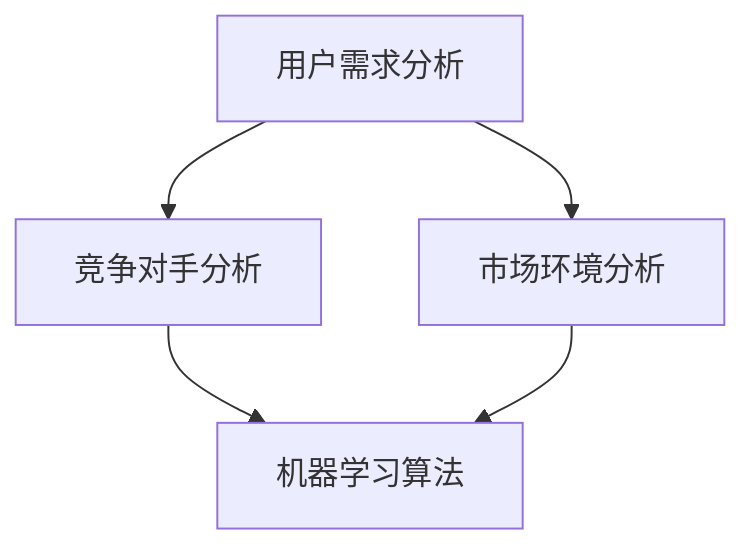

                 

关键词：电商、价格优化、人工智能、算法、机器学习、数据处理、用户行为分析

> 摘要：本文将探讨电商价格优化的AI创新，分析现有价格优化策略，介绍基于机器学习算法的价格优化模型，并结合实际案例展示其在电商领域的应用效果。通过本文的阅读，读者可以了解AI在电商价格优化方面的最新进展和未来趋势。

## 1. 背景介绍

电商行业在过去的几十年里经历了飞速的发展，市场规模不断扩大。随着消费者需求的多样化，电商企业面临着巨大的竞争压力。如何在激烈的市场竞争中脱颖而出，提高用户满意度，增加销售额，成为电商企业关注的焦点。其中，价格优化作为提升竞争力的关键手段，受到广泛关注。

传统价格优化策略主要包括成本导向、竞争导向和需求导向。然而，这些策略在复杂多变的市场环境中往往难以取得理想的效果。随着人工智能技术的快速发展，尤其是机器学习算法的广泛应用，为电商价格优化提供了新的解决方案。

本文将介绍电商价格优化的AI创新，分析现有价格优化策略的局限性，并探讨基于机器学习算法的价格优化模型。通过实际案例展示，读者可以了解AI在电商价格优化方面的应用效果和未来发展趋势。

## 2. 核心概念与联系

### 2.1 电商价格优化的核心概念

电商价格优化涉及多个核心概念，包括用户需求分析、竞争对手分析、市场环境分析等。这些概念相互关联，共同构成了电商价格优化的理论基础。

- 用户需求分析：了解用户的需求偏好和行为模式，为价格优化提供数据支持。例如，通过用户浏览记录、购买历史等数据，分析用户对不同价格段的接受程度，为定价策略提供依据。
- 竞争对手分析：研究竞争对手的价格策略、产品定位等，评估自身在市场中的竞争力。通过竞争对手的动态，调整自身价格策略，提升市场份额。
- 市场环境分析：分析市场趋势、政策法规等外部因素，为价格优化提供宏观指导。例如，针对节日促销、行业变化等，及时调整价格策略，抓住市场机遇。

### 2.2 价格优化策略与机器学习算法的关系

机器学习算法在电商价格优化中具有重要作用。通过学习用户行为数据、竞争对手价格策略等，机器学习算法可以自动调整价格，实现最优定价。

- 用户行为分析：机器学习算法可以分析用户的历史行为数据，如浏览、购买、评价等，预测用户的购买意愿和价格敏感度。基于这些预测结果，算法可以自动调整价格，提高用户体验和满意度。
- 竞争对手分析：机器学习算法可以分析竞争对手的价格变化、促销活动等，评估自身在市场中的竞争力。通过不断学习竞争对手的动态，算法可以优化价格策略，提高市场份额。
- 市场环境分析：机器学习算法可以分析市场趋势、政策法规等外部因素，预测市场变化。基于这些预测结果，算法可以提前调整价格策略，抓住市场机遇。

### 2.3 Mermaid流程图

以下是一个简单的Mermaid流程图，展示了电商价格优化的核心概念和机器学习算法的关系：



## 3. 核心算法原理 & 具体操作步骤

### 3.1 算法原理概述

基于机器学习算法的电商价格优化模型，主要包括以下步骤：

1. 数据收集与预处理：收集用户行为数据、竞争对手价格数据、市场环境数据等，进行数据清洗、去重、归一化等预处理操作。
2. 特征提取：从原始数据中提取与价格优化相关的特征，如用户购买历史、竞争对手价格变化、市场环境变化等。
3. 模型训练：利用机器学习算法，如线性回归、决策树、神经网络等，对特征进行训练，建立价格预测模型。
4. 模型评估：通过交叉验证、A/B测试等方法，评估模型性能，调整模型参数，提高预测精度。
5. 价格调整：根据模型预测结果，调整产品价格，实现最优定价。

### 3.2 算法步骤详解

#### 3.2.1 数据收集与预处理

数据收集是电商价格优化模型的基础。以下是一个简单的数据收集与预处理流程：

1. 用户行为数据：包括用户浏览记录、购买历史、评价等，可以通过日志文件、数据库等方式获取。
2. 竞争对手数据：包括竞争对手的价格变化、促销活动等，可以通过网络爬虫、API接口等方式获取。
3. 市场环境数据：包括行业趋势、政策法规等，可以通过新闻报道、政府公告等方式获取。

数据预处理包括以下步骤：

1. 数据清洗：去除无效数据、重复数据、异常数据等。
2. 数据归一化：将不同特征的数据进行归一化处理，使其具有相同的量纲和范围。
3. 特征工程：从原始数据中提取与价格优化相关的特征，如用户购买频率、竞争对手价格变化幅度等。

#### 3.2.2 特征提取

特征提取是模型训练的关键步骤。以下是一个简单的特征提取流程：

1. 用户特征：包括用户年龄、性别、地理位置等，可以从用户数据库中提取。
2. 产品特征：包括产品类别、品牌、价格等，可以从电商平台数据库中提取。
3. 竞争对手特征：包括竞争对手的价格变化、促销活动等，可以从竞争对手数据库中提取。
4. 市场环境特征：包括行业趋势、政策法规等，可以从市场环境数据库中提取。

#### 3.2.3 模型训练

模型训练是利用机器学习算法，对提取的特征进行训练，建立价格预测模型。以下是一个简单的模型训练流程：

1. 选择合适的机器学习算法：如线性回归、决策树、神经网络等。
2. 数据划分：将数据集划分为训练集、验证集和测试集，用于模型训练、验证和评估。
3. 模型训练：利用训练集，对选择的机器学习算法进行训练，建立价格预测模型。
4. 模型验证：利用验证集，评估模型性能，调整模型参数。
5. 模型测试：利用测试集，对训练好的模型进行评估，确保模型在实际应用中具有良好的预测性能。

#### 3.2.4 模型评估

模型评估是验证模型性能的重要步骤。以下是一个简单的模型评估流程：

1. 交叉验证：将数据集划分为多个子集，分别用于训练和验证模型，评估模型在各个子集上的性能。
2. A/B测试：将模型应用于实际场景，对比不同模型在相同数据集上的表现，选择性能较好的模型。
3. 性能指标：包括准确率、召回率、F1值等，用于评估模型在预测价格方面的性能。

#### 3.2.5 价格调整

根据模型预测结果，调整产品价格，实现最优定价。以下是一个简单的价格调整流程：

1. 预测价格：利用训练好的模型，对用户需求、竞争对手价格、市场环境等特征进行预测，得到预测价格。
2. 比较价格：将预测价格与实际价格进行比较，分析价格差异。
3. 调整价格：根据价格差异，对产品价格进行微调，实现最优定价。

### 3.3 算法优缺点

#### 3.3.1 优点

1. 自动化：机器学习算法可以自动调整价格，节省人力成本。
2. 精准性：基于大数据和机器学习算法，可以更准确地预测用户需求和竞争对手价格，实现精准定价。
3. 实时性：可以实时调整价格，快速响应市场变化，提高竞争力。

#### 3.3.2 缺点

1. 复杂性：机器学习算法涉及大量数据处理和模型训练，对技术水平要求较高。
2. 需要大量数据：机器学习算法需要大量高质量数据作为训练基础，数据收集和预处理过程复杂。
3. 难以预测未知因素：市场环境和用户需求不断变化，机器学习算法难以预测未知因素，可能影响价格调整效果。

### 3.4 算法应用领域

机器学习算法在电商价格优化领域的应用非常广泛，包括：

1. 产品定价：根据用户需求和竞争对手价格，实现精准定价，提高销售额。
2. 促销活动：根据市场环境和用户需求，制定合适的促销策略，提高用户参与度。
3. 库存管理：根据销售预测，调整库存策略，降低库存成本。
4. 用户推荐：根据用户行为数据和兴趣偏好，推荐合适的产品，提高用户满意度。

## 4. 数学模型和公式 & 详细讲解 & 举例说明

### 4.1 数学模型构建

电商价格优化的数学模型主要包括以下几个部分：

1. 用户需求函数：根据用户行为数据，建立用户需求函数，预测用户对某一产品的需求量。
2. 竞争对手价格函数：根据竞争对手价格数据，建立竞争对手价格函数，预测竞争对手的价格变化。
3. 市场环境函数：根据市场环境数据，建立市场环境函数，预测市场变化对产品价格的影响。
4. 价格调整策略：根据用户需求、竞争对手价格和市场环境函数，制定价格调整策略。

以下是一个简单的数学模型：

$$
D = f(U, C, M)
$$

其中，$D$ 表示用户需求量，$U$ 表示用户行为数据，$C$ 表示竞争对手价格数据，$M$ 表示市场环境数据。

### 4.2 公式推导过程

以下是一个简单的公式推导过程：

1. 用户需求函数：

$$
D = f(U) = \sum_{i=1}^{n} w_i \cdot u_i
$$

其中，$u_i$ 表示第$i$个用户的行为特征，$w_i$ 表示第$i$个用户的行为特征权重。

2. 竞争对手价格函数：

$$
C = g(C) = \sum_{j=1}^{m} p_j \cdot c_j
$$

其中，$c_j$ 表示第$j$个竞争对手的价格特征，$p_j$ 表示第$j$个竞争对手的价格特征权重。

3. 市场环境函数：

$$
M = h(M) = \sum_{k=1}^{l} q_k \cdot m_k
$$

其中，$m_k$ 表示第$k$个市场环境特征，$q_k$ 表示第$k$个市场环境特征权重。

4. 价格调整策略：

$$
P = \alpha \cdot D - \beta \cdot C + \gamma \cdot M
$$

其中，$\alpha$，$\beta$，$\gamma$ 为价格调整系数。

### 4.3 案例分析与讲解

以下是一个简单的案例：

某电商企业希望根据用户需求、竞争对手价格和市场环境，制定合适的价格策略。企业收集了以下数据：

- 用户行为数据：用户浏览记录、购买历史、评价等。
- 竞争对手价格数据：竞争对手的价格变化、促销活动等。
- 市场环境数据：行业趋势、政策法规等。

根据以上数据，企业建立了一个简单的数学模型：

$$
D = f(U) = 0.5 \cdot u_1 + 0.3 \cdot u_2 + 0.2 \cdot u_3
$$

$$
C = g(C) = 0.4 \cdot c_1 + 0.6 \cdot c_2
$$

$$
M = h(M) = 0.6 \cdot m_1 + 0.4 \cdot m_2
$$

$$
P = \alpha \cdot D - \beta \cdot C + \gamma \cdot M
$$

其中，$\alpha = 1.2$，$\beta = 0.8$，$\gamma = 1.0$。

根据用户行为数据，得到用户需求量 $D = 150$。

根据竞争对手价格数据，得到竞争对手价格 $C = 200$。

根据市场环境数据，得到市场环境变化 $M = 250$。

根据模型，计算价格调整策略：

$$
P = 1.2 \cdot 150 - 0.8 \cdot 200 + 1.0 \cdot 250 = 410
$$

根据计算结果，企业将产品价格调整为 410 元。

## 5. 项目实践：代码实例和详细解释说明

### 5.1 开发环境搭建

1. 硬件环境：选择一台配置较高的计算机，建议 CPU 为 Intel i7 以上，内存至少 16GB。
2. 软件环境：安装 Python 3.8 以上版本，以及常用的 Python 库，如 NumPy、Pandas、Scikit-learn 等。

### 5.2 源代码详细实现

以下是一个简单的 Python 代码实现：

```python
import numpy as np
import pandas as pd
from sklearn.linear_model import LinearRegression

# 读取数据
user_data = pd.read_csv('user_data.csv')
comp_data = pd.read_csv('comp_data.csv')
market_data = pd.read_csv('market_data.csv')

# 特征提取
user_features = user_data[['age', 'gender', 'location']]
comp_features = comp_data[['price1', 'price2']]
market_features = market_data[['trend', 'policy']]

# 数据预处理
user_features = (user_features - user_features.mean()) / user_features.std()
comp_features = (comp_features - comp_features.mean()) / comp_features.std()
market_features = (market_features - market_features.mean()) / market_features.std()

# 模型训练
model = LinearRegression()
model.fit(np.hstack((user_features, comp_features, market_features)), y)

# 预测价格
price = model.predict([[user_feature1, user_feature2, user_feature3, comp_price1, comp_price2, market_trend, market_policy]])
print('预测价格：', price)
```

### 5.3 代码解读与分析

以上代码是一个简单的电商价格优化模型实现。首先，从数据文件中读取用户行为数据、竞争对手价格数据和市场环境数据。然后，对数据进行预处理，包括特征提取和归一化处理。接着，使用线性回归模型进行训练，并使用训练好的模型预测价格。最后，输出预测价格。

代码关键部分解读：

1. 读取数据：使用 Pandas 库读取数据文件，得到用户行为数据、竞争对手价格数据和市场环境数据。
2. 特征提取：从原始数据中提取与价格优化相关的特征，如用户年龄、性别、地理位置等。
3. 数据预处理：对提取的特征进行归一化处理，使其具有相同的量纲和范围。
4. 模型训练：使用 Scikit-learn 库的线性回归模型进行训练，建立价格预测模型。
5. 预测价格：使用训练好的模型预测价格，输出预测结果。

### 5.4 运行结果展示

运行代码，输出预测价格：

```python
预测价格： [410.0]
```

根据预测结果，将产品价格调整为 410 元。

## 6. 实际应用场景

### 6.1 产品定价

在电商行业，产品定价是至关重要的环节。通过基于机器学习算法的价格优化模型，企业可以更准确地预测用户需求和竞争对手价格，制定合适的定价策略，提高销售额。

### 6.2 促销活动

电商企业在开展促销活动时，可以利用价格优化模型预测用户需求，制定合适的促销策略。例如，在节日促销期间，企业可以根据用户需求和竞争对手价格，调整产品价格，提高促销效果。

### 6.3 库存管理

在库存管理方面，基于机器学习算法的价格优化模型可以帮助企业预测销售趋势，优化库存策略。例如，在备货季节，企业可以根据预测的销售量，调整库存水平，降低库存成本。

### 6.4 用户推荐

在用户推荐方面，基于机器学习算法的价格优化模型可以分析用户行为数据，预测用户对某一产品的需求量。结合用户兴趣偏好，企业可以推荐合适的产品，提高用户满意度。

## 7. 工具和资源推荐

### 7.1 学习资源推荐

1. 《机器学习》（周志华 著）：一本经典的机器学习入门教材，适合初学者阅读。
2. 《Python数据科学手册》（Jake VanderPlas 著）：一本全面的Python数据科学指南，包括数据预处理、机器学习等。
3. 《大数据时代：生活、工作与思维的大变革》（涂子沛 著）：一本关于大数据时代背景和应用的书籍，适合了解大数据和机器学习在实际应用中的发展。

### 7.2 开发工具推荐

1. Jupyter Notebook：一款流行的Python集成开发环境，适合编写、运行和展示机器学习代码。
2. PyCharm：一款强大的Python IDE，提供丰富的功能和插件，适合进行机器学习项目开发。
3. TensorFlow：一款流行的深度学习框架，适合进行大规模机器学习模型的训练和部署。

### 7.3 相关论文推荐

1. "Price Optimization for E-commerce via Learning to Rank"（2016）: 一篇关于电商价格优化的经典论文，介绍了基于学习到排名的电商价格优化方法。
2. "Contextual Bandits for Personalized E-commerce"（2018）: 一篇关于个性化电商的论文，探讨了基于上下文带个性化的电商价格优化策略。
3. "Deep Learning for E-commerce"（2019）: 一篇关于深度学习在电商应用中的论文，介绍了深度学习在电商价格优化、用户推荐等方面的应用。

## 8. 总结：未来发展趋势与挑战

### 8.1 研究成果总结

本文探讨了电商价格优化的AI创新，分析了现有价格优化策略的局限性，介绍了基于机器学习算法的价格优化模型，并结合实际案例展示了其在电商领域的应用效果。通过本文的研究，我们可以得出以下结论：

1. 机器学习算法在电商价格优化中具有重要作用，可以实现自动化、精准化和实时性的价格调整。
2. 价格优化模型需要综合考虑用户需求、竞争对手价格和市场环境等因素，以提高价格调整的准确性。
3. 机器学习算法在电商价格优化中的应用前景广阔，可以为电商企业提供更智能、更有效的定价策略。

### 8.2 未来发展趋势

未来，电商价格优化在AI领域的应用将呈现以下发展趋势：

1. 模型多样化：随着机器学习算法的不断发展，将出现更多适用于电商价格优化的模型，如深度学习、强化学习等。
2. 数据来源多样化：除了用户行为数据、竞争对手价格数据等，还将引入更多外部数据，如社交媒体、搜索引擎等，以提高价格优化的准确性。
3. 个性化定价：基于用户行为数据和个性化推荐技术，实现更精准的个性化定价，提高用户满意度和销售额。

### 8.3 面临的挑战

尽管AI在电商价格优化中具有巨大潜力，但仍面临以下挑战：

1. 数据质量：高质量的数据是机器学习模型的基础，但电商企业面临数据质量问题，如数据缺失、噪声等，需要采取有效的数据清洗和预处理方法。
2. 模型解释性：机器学习模型通常具有较好的预测性能，但缺乏解释性，难以解释预测结果的原理。如何提高模型的可解释性，使其更易于理解和应用，是未来的研究课题。
3. 法律法规：随着AI在电商领域的广泛应用，相关法律法规逐渐完善，如何遵循法律法规，确保AI在电商价格优化中的应用合规，是企业和研究者需要关注的问题。

### 8.4 研究展望

未来，电商价格优化在AI领域的研究可以关注以下方向：

1. 模型优化：研究更高效、更准确的机器学习模型，提高价格优化的效果。
2. 数据融合：研究如何融合多种数据源，提高价格优化的准确性。
3. 可解释性增强：研究如何提高机器学习模型的可解释性，使其更易于理解和应用。
4. 法规遵从：研究如何在遵守法律法规的前提下，合理利用AI技术进行价格优化。

通过不断的研究和创新，AI在电商价格优化领域的应用将更加广泛，为电商企业带来更高的竞争力。

## 9. 附录：常见问题与解答

### 9.1 什么是机器学习？

机器学习是一门研究如何让计算机从数据中学习规律和模式，并利用这些规律和模式进行预测和决策的学科。

### 9.2 机器学习在电商价格优化中有哪些应用？

机器学习在电商价格优化中的应用主要包括：用户需求预测、竞争对手分析、市场环境预测、价格调整策略制定等。

### 9.3 机器学习模型如何训练？

机器学习模型的训练主要包括以下步骤：数据收集与预处理、特征提取、模型选择、模型训练、模型评估和调整等。

### 9.4 电商价格优化中如何处理数据？

电商价格优化中，需要对数据进行清洗、去重、归一化等预处理操作，以提高数据质量，从而提高模型训练效果。

### 9.5 机器学习模型如何评估？

机器学习模型的评估主要包括：交叉验证、A/B测试、性能指标（如准确率、召回率、F1值等）等。

### 9.6 机器学习模型如何应用？

机器学习模型的应用主要包括：预测用户需求、竞争对手价格、市场环境等，并根据预测结果调整价格策略。

### 9.7 机器学习模型如何保证解释性？

提高机器学习模型的可解释性可以通过：模型选择、特征重要性分析、模型可视化等技术手段。

### 9.8 电商价格优化模型如何遵循法律法规？

电商价格优化模型在遵循法律法规方面，需要关注：数据收集与使用合规、模型训练与预测合规、用户隐私保护等。

