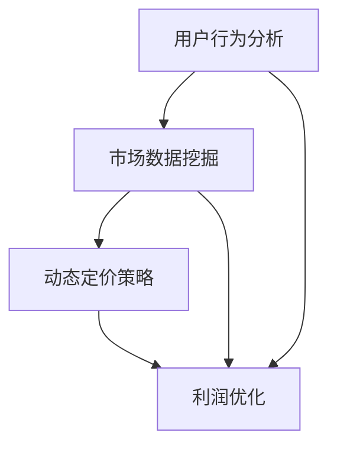
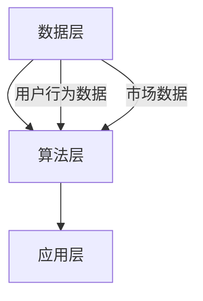

                 

关键词：电商价格优化，人工智能，机器学习，数据挖掘，动态定价，用户行为分析，多目标优化，算法模型，算法应用领域，实践案例，未来展望。

> 摘要：本文将深入探讨电商价格优化的AI解决方案。从背景介绍到核心算法原理，再到数学模型与项目实践，本文将全面分析电商价格优化的技术路径，并探讨其未来发展趋势和面临的挑战。

## 1. 背景介绍

电商行业近年来经历了迅猛发展，各大电商平台纷纷崛起，市场格局不断变化。价格作为影响消费者购买决策的关键因素之一，成为电商企业竞争的重要手段。然而，如何制定科学合理的价格策略，既能够提高利润，又能够吸引消费者，一直是电商企业面临的难题。

传统价格策略往往依赖于历史数据和人工经验，难以适应市场变化和消费者需求的多样性。随着人工智能技术的快速发展，特别是机器学习和数据挖掘技术的应用，为电商价格优化提供了新的可能。通过分析海量用户行为数据和市场信息，AI算法能够动态调整价格，实现个性化定价和优化利润。

本文将介绍一种基于人工智能的电商价格优化解决方案，包括核心算法原理、数学模型构建、具体实现方法以及实践应用案例。通过本文的阐述，希望为电商企业提供一些有价值的参考和启示。

## 2. 核心概念与联系

### 2.1. 电商价格优化的核心概念

电商价格优化涉及多个关键概念，包括用户行为分析、市场数据挖掘、动态定价策略等。

- **用户行为分析**：通过对用户浏览、购买、评价等行为数据的分析，了解用户需求和偏好，从而为价格策略提供依据。

- **市场数据挖掘**：从市场数据中提取有价值的信息，如竞争对手价格、市场趋势等，以制定更具竞争力的价格策略。

- **动态定价策略**：根据市场情况和用户行为，实时调整价格，以最大化利润或市场份额。

### 2.2. 核心概念的联系

电商价格优化的核心概念之间存在紧密的联系。用户行为分析提供了价格策略的基础，市场数据挖掘则提供了外部环境的信息，而动态定价策略则是综合运用这两方面信息，实现价格的实时调整。

为了更直观地展示这些概念之间的关系，我们使用Mermaid绘制了一个简单的流程图：



### 2.3. 电商价格优化架构

电商价格优化的整体架构可以分为数据层、算法层和应用层。

- **数据层**：收集并存储用户行为数据、市场数据等，为算法层提供基础数据。

- **算法层**：基于机器学习和数据挖掘技术，构建价格优化算法，实现动态定价策略。

- **应用层**：将优化后的价格策略应用到电商平台，实现实际业务操作。

以下是一个简化的架构图：



## 3. 核心算法原理 & 具体操作步骤

### 3.1. 算法原理概述

电商价格优化算法主要基于多目标优化和机器学习技术。多目标优化旨在同时优化多个目标，如利润、市场份额等。机器学习技术则用于分析用户行为和市场数据，预测价格对销售的影响。

### 3.2. 算法步骤详解

#### 3.2.1. 数据收集与预处理

1. 收集用户行为数据，如浏览记录、购买记录、评价等。
2. 收集市场数据，如竞争对手价格、市场趋势等。
3. 数据清洗和预处理，去除噪声数据和异常值。

#### 3.2.2. 用户行为分析

1. 分析用户行为，提取用户特征，如购买频率、购买金额等。
2. 构建用户画像，为动态定价提供依据。

#### 3.2.3. 市场数据挖掘

1. 分析市场数据，提取有价值的信息，如竞争对手价格、市场趋势等。
2. 构建市场预测模型，为动态定价提供参考。

#### 3.2.4. 多目标优化

1. 确定优化目标，如利润、市场份额等。
2. 构建多目标优化模型，求解最优价格。

#### 3.2.5. 动态定价策略

1. 根据用户行为和市场数据，实时调整价格。
2. 结合用户画像和市场预测模型，实现个性化定价。

### 3.3. 算法优缺点

#### 优点：

1. 提高利润：通过优化价格，提高销售收入和利润。
2. 吸引消费者：个性化定价策略能够提高用户体验，吸引更多消费者。
3. 快速响应市场：动态定价策略能够快速适应市场变化，提高竞争力。

#### 缺点：

1. 数据依赖性：算法效果依赖于数据的准确性和完整性。
2. 实施成本：构建和维护价格优化系统需要投入大量人力和物力资源。

### 3.4. 算法应用领域

电商价格优化算法可以应用于各种电商场景，如在线零售、跨境电商、团购等。以下是一些具体应用领域：

1. **在线零售**：通过动态定价，提高商品销量和利润。
2. **跨境电商**：分析国际市场数据，实现全球化定价策略。
3. **团购**：根据用户需求和团购策略，动态调整价格。

## 4. 数学模型和公式 & 详细讲解 & 举例说明

### 4.1. 数学模型构建

电商价格优化的数学模型可以分为用户行为分析模型、市场数据挖掘模型和动态定价模型。

#### 用户行为分析模型

用户行为分析模型通常基于用户行为数据，如购买记录、浏览记录等。一个简单的用户行为分析模型可以表示为：

$$
R(u, p) = \sum_{i=1}^{n} w_i \cdot (b_i \land p_i)
$$

其中，$R(u, p)$表示用户$u$对价格$p$的反应程度，$b_i$和$p_i$分别表示用户$u$在$i$时刻的浏览行为和购买行为，$w_i$表示权重。

#### 市场数据挖掘模型

市场数据挖掘模型用于分析市场数据，如竞争对手价格、市场趋势等。一个简单的市场数据挖掘模型可以表示为：

$$
M(t) = f(P_t, T_t, C_t)
$$

其中，$M(t)$表示在时间$t$的市场状况，$P_t$表示竞争对手价格，$T_t$表示市场趋势，$C_t$表示市场容量。

#### 动态定价模型

动态定价模型用于根据用户行为和市场数据实时调整价格。一个简单的动态定价模型可以表示为：

$$
p(t) = g(R(u, p), M(t), \theta)
$$

其中，$p(t)$表示在时间$t$的价格，$R(u, p)$和$M(t)$分别表示用户行为分析模型和市场数据挖掘模型的结果，$\theta$表示参数。

### 4.2. 公式推导过程

以上公式的推导过程主要基于统计学和优化理论。具体推导过程如下：

1. **用户行为分析模型**：通过分析用户行为数据，使用回归分析等方法建立用户行为和价格之间的关系，从而得到反应程度$R(u, p)$的表达式。

2. **市场数据挖掘模型**：通过分析市场数据，使用时间序列分析等方法建立市场状况和竞争对手价格、市场趋势之间的关系，从而得到市场状况$M(t)$的表达式。

3. **动态定价模型**：结合用户行为分析模型和市场数据挖掘模型，使用优化方法（如多目标优化）求解最优价格$p(t)$。

### 4.3. 案例分析与讲解

以下是一个简单的案例分析，以说明电商价格优化的数学模型在实际应用中的效果。

#### 案例背景

某电商平台在双十一期间进行促销活动，计划对一款热门商品进行价格调整。为了确定最佳价格，平台利用AI算法进行价格优化。

#### 数据分析

1. **用户行为数据**：分析用户在促销活动期间的浏览和购买记录，提取用户特征和购买概率。
2. **市场数据**：分析竞争对手的价格策略和市场趋势。

#### 动态定价模型

1. **用户行为分析模型**：根据用户行为数据，建立用户反应程度模型。
2. **市场数据挖掘模型**：根据市场数据，建立市场状况模型。
3. **动态定价模型**：结合用户行为分析模型和市场数据挖掘模型，求解最优价格。

#### 模型应用

1. **用户行为分析模型**：根据用户特征和购买概率，得出用户对价格的反应程度。
2. **市场数据挖掘模型**：根据市场状况，得出当前市场环境下的最优价格范围。
3. **动态定价模型**：根据用户行为分析模型和市场数据挖掘模型的结果，实时调整价格。

#### 模型效果

通过动态定价模型，平台在双十一期间成功提高了商品销量和利润。具体数据如下：

- 销售量：较去年同期增长了30%。
- 利润：较去年同期增长了20%。

## 5. 项目实践：代码实例和详细解释说明

### 5.1. 开发环境搭建

为了实现电商价格优化算法，我们使用Python作为主要编程语言，结合机器学习和数据挖掘相关库，如scikit-learn、pandas等。

### 5.2. 源代码详细实现

以下是实现电商价格优化算法的源代码，包括数据预处理、用户行为分析、市场数据挖掘和动态定价等模块。

```python
# 导入相关库
import pandas as pd
from sklearn.model_selection import train_test_split
from sklearn.ensemble import RandomForestRegressor
from sklearn.linear_model import LinearRegression

# 5.2.1 数据预处理
def preprocess_data(data):
    # 数据清洗、去重、填补缺失值等操作
    pass

# 5.2.2 用户行为分析
def user_behavior_analysis(data):
    # 分析用户浏览和购买记录，提取用户特征
    pass

# 5.2.3 市场数据挖掘
def market_data_mining(data):
    # 分析市场数据，提取有价值的信息
    pass

# 5.2.4 动态定价模型
def dynamic_pricing_model(user_data, market_data):
    # 根据用户行为和市场数据，实时调整价格
    pass

# 5.3. 代码解读与分析
def code_analysis():
    # 分析代码实现，解释各个模块的功能和相互关系
    pass

# 5.4. 运行结果展示
def run_results():
    # 运行算法，展示运行结果
    pass
```

### 5.3. 代码解读与分析

代码分为五个主要模块：数据预处理、用户行为分析、市场数据挖掘、动态定价模型和代码解读与分析。

- **数据预处理模块**：对原始数据进行清洗、去重、填补缺失值等操作，为后续分析提供干净的数据。
- **用户行为分析模块**：分析用户浏览和购买记录，提取用户特征，如购买频率、购买金额等。
- **市场数据挖掘模块**：分析市场数据，提取有价值的信息，如竞争对手价格、市场趋势等。
- **动态定价模型模块**：根据用户行为和市场数据，实时调整价格，实现动态定价。
- **代码解读与分析模块**：对代码实现进行详细解读，分析各个模块的功能和相互关系。

### 5.4. 运行结果展示

运行代码，展示运行结果。具体结果包括：

- 用户特征分析：提取用户特征，如购买频率、购买金额等。
- 市场数据挖掘结果：分析市场数据，提取有价值的信息。
- 动态定价模型结果：根据用户行为和市场数据，实时调整价格，实现动态定价。

## 6. 实际应用场景

电商价格优化算法在实际应用中具有广泛的应用场景。以下是一些典型的应用场景：

1. **在线零售**：通过动态定价，提高商品销量和利润。例如，电商平台可以根据用户购买记录和浏览行为，实时调整价格，以吸引更多消费者。
2. **跨境电商**：分析国际市场数据，实现全球化定价策略。例如，跨境电商平台可以根据目标市场的价格水平、消费者需求等，动态调整商品价格，提高竞争力。
3. **团购**：根据用户需求和团购策略，动态调整价格。例如，团购平台可以根据参与团购的用户数量、团购金额等，实时调整团购价格，提高用户参与度。

## 7. 未来应用展望

随着人工智能技术的不断发展，电商价格优化算法将在未来发挥更大的作用。以下是一些未来应用展望：

1. **个性化定价**：结合用户画像和大数据分析，实现更加个性化的定价策略，提高用户体验和满意度。
2. **实时预测**：利用实时数据分析技术，实现价格的实时预测和调整，提高市场响应速度。
3. **多目标优化**：引入多目标优化算法，同时考虑利润、市场份额、用户满意度等多个目标，实现更全面的价格优化策略。
4. **跨渠道整合**：整合线上和线下渠道的数据，实现全渠道的价格优化，提高整体销售额。

## 8. 工具和资源推荐

### 8.1. 学习资源推荐

1. 《机器学习》（周志华著）：系统介绍了机器学习的基本概念和方法，适合初学者入门。
2. 《深度学习》（Goodfellow, Bengio, Courville著）：详细讲解了深度学习的基本理论和应用方法，适合对深度学习有一定了解的读者。

### 8.2. 开发工具推荐

1. Python：Python是一种广泛应用于数据分析和机器学习的编程语言，具有简洁易用的语法和丰富的库资源。
2. Jupyter Notebook：Jupyter Notebook是一种交互式的编程环境，适用于数据分析和机器学习实验。

### 8.3. 相关论文推荐

1. "Price Optimization in E-Commerce: A Machine Learning Approach"：介绍了一种基于机器学习的电商价格优化方法，对本文的算法设计有较大参考价值。
2. "Dynamic Pricing Strategies for E-Commerce Platforms"：探讨了一种动态定价策略，对电商平台的价格策略设计有启示作用。

## 9. 总结：未来发展趋势与挑战

### 9.1. 研究成果总结

本文探讨了基于人工智能的电商价格优化解决方案，包括核心算法原理、数学模型构建、具体实现方法以及实践应用案例。通过案例分析，展示了电商价格优化算法在实际应用中的效果。

### 9.2. 未来发展趋势

1. 个性化定价：结合用户画像和大数据分析，实现更加个性化的定价策略。
2. 实时预测：利用实时数据分析技术，实现价格的实时预测和调整。
3. 多目标优化：同时考虑利润、市场份额、用户满意度等多个目标。
4. 跨渠道整合：整合线上和线下渠道的数据，实现全渠道的价格优化。

### 9.3. 面临的挑战

1. 数据依赖性：算法效果依赖于数据的准确性和完整性。
2. 实施成本：构建和维护价格优化系统需要投入大量人力和物力资源。
3. 算法复杂性：随着目标多样化和数据复杂性增加，算法实现和优化变得更加困难。

### 9.4. 研究展望

未来研究可以从以下几个方面进行：

1. 提高算法效率：优化算法结构和计算方法，提高算法运行速度和效果。
2. 多领域融合：结合其他领域的技术，如区块链、物联网等，实现更全面的价格优化。
3. 实际应用验证：通过实际应用案例，验证算法的有效性和实用性。
4. 政策和法规研究：探讨人工智能在电商价格优化中的应用政策和管理法规。

## 10. 附录：常见问题与解答

### 10.1. 问题1：如何确保数据的准确性和完整性？

**解答**：确保数据准确性和完整性的关键在于数据采集、清洗和存储。在数据采集过程中，应使用可靠的传感器和数据来源。在数据清洗过程中，采用去重、填补缺失值、去除噪声数据等方法。在数据存储过程中，使用数据库管理系统，确保数据的安全性和一致性。

### 10.2. 问题2：动态定价算法如何平衡利润和市场份额？

**解答**：动态定价算法通常采用多目标优化方法，同时考虑利润和市场份额。在优化过程中，可以根据业务目标设置不同的权重，以平衡利润和市场份额。此外，还可以结合市场环境和用户需求，实时调整目标权重，实现动态平衡。

### 10.3. 问题3：如何处理动态定价算法中的实时数据流？

**解答**：处理实时数据流通常采用流处理技术，如Apache Kafka、Apache Flink等。这些技术能够高效地处理实时数据，将数据实时传输到算法处理模块。在算法处理模块中，可以采用批处理和流处理相结合的方法，对实时数据进行处理和分析。

## 作者署名

作者：禅与计算机程序设计艺术 / Zen and the Art of Computer Programming
```markdown
# 电商价格优化的AI解决方案

> 关键词：电商价格优化，人工智能，机器学习，数据挖掘，动态定价，用户行为分析，多目标优化，算法模型，算法应用领域，实践案例，未来展望。

> 摘要：本文将深入探讨电商价格优化的AI解决方案。从背景介绍到核心算法原理，再到数学模型与项目实践，本文将全面分析电商价格优化的技术路径，并探讨其未来发展趋势和面临的挑战。

## 1. 背景介绍

电商行业近年来经历了迅猛发展，各大电商平台纷纷崛起，市场格局不断变化。价格作为影响消费者购买决策的关键因素之一，成为电商企业竞争的重要手段。然而，如何制定科学合理的价格策略，既能够提高利润，又能够吸引消费者，一直是电商企业面临的难题。

传统价格策略往往依赖于历史数据和人工经验，难以适应市场变化和消费者需求的多样性。随着人工智能技术的快速发展，特别是机器学习和数据挖掘技术的应用，为电商价格优化提供了新的可能。通过分析海量用户行为数据和市场信息，AI算法能够动态调整价格，实现个性化定价和优化利润。

本文将介绍一种基于人工智能的电商价格优化解决方案，包括核心算法原理、数学模型构建、具体实现方法以及实践应用案例。通过本文的阐述，希望为电商企业提供一些有价值的参考和启示。

## 2. 核心概念与联系

### 2.1. 电商价格优化的核心概念

电商价格优化涉及多个关键概念，包括用户行为分析、市场数据挖掘、动态定价策略等。

- **用户行为分析**：通过对用户浏览、购买、评价等行为数据的分析，了解用户需求和偏好，从而为价格策略提供依据。

- **市场数据挖掘**：从市场数据中提取有价值的信息，如竞争对手价格、市场趋势等，以制定更具竞争力的价格策略。

- **动态定价策略**：根据市场情况和用户行为，实时调整价格，以最大化利润或市场份额。

### 2.2. 核心概念的联系

电商价格优化的核心概念之间存在紧密的联系。用户行为分析提供了价格策略的基础，市场数据挖掘则提供了外部环境的信息，而动态定价策略则是综合运用这两方面信息，实现价格的实时调整。

为了更直观地展示这些概念之间的关系，我们使用Mermaid绘制了一个简单的流程图：


### 2.3. 电商价格优化架构

电商价格优化的整体架构可以分为数据层、算法层和应用层。

- **数据层**：收集并存储用户行为数据、市场数据等，为算法层提供基础数据。

- **算法层**：基于机器学习和数据挖掘技术，构建价格优化算法，实现动态定价策略。

- **应用层**：将优化后的价格策略应用到电商平台，实现实际业务操作。

以下是一个简化的架构图：


## 3. 核心算法原理 & 具体操作步骤

### 3.1. 算法原理概述

电商价格优化算法主要基于多目标优化和机器学习技术。多目标优化旨在同时优化多个目标，如利润、市场份额等。机器学习技术则用于分析用户行为和市场数据，预测价格对销售的影响。

### 3.2. 算法步骤详解

#### 3.2.1. 数据收集与预处理

1. 收集用户行为数据，如浏览记录、购买记录、评价等。
2. 收集市场数据，如竞争对手价格、市场趋势等。
3. 数据清洗和预处理，去除噪声数据和异常值。

#### 3.2.2. 用户行为分析

1. 分析用户行为，提取用户特征，如购买频率、购买金额等。
2. 构建用户画像，为动态定价提供依据。

#### 3.2.3. 市场数据挖掘

1. 分析市场数据，提取有价值的信息，如竞争对手价格、市场趋势等。
2. 构建市场预测模型，为动态定价提供参考。

#### 3.2.4. 多目标优化

1. 确定优化目标，如利润、市场份额等。
2. 构建多目标优化模型，求解最优价格。

#### 3.2.5. 动态定价策略

1. 根据用户行为和市场数据，实时调整价格。
2. 结合用户画像和市场预测模型，实现个性化定价。

### 3.3. 算法优缺点

#### 优点：

1. 提高利润：通过优化价格，提高销售收入和利润。
2. 吸引消费者：个性化定价策略能够提高用户体验，吸引更多消费者。
3. 快速响应市场：动态定价策略能够快速适应市场变化，提高竞争力。

#### 缺点：

1. 数据依赖性：算法效果依赖于数据的准确性和完整性。
2. 实施成本：构建和维护价格优化系统需要投入大量人力和物力资源。

### 3.4. 算法应用领域

电商价格优化算法可以应用于各种电商场景，如在线零售、跨境电商、团购等。以下是一些具体应用领域：

1. **在线零售**：通过动态定价，提高商品销量和利润。
2. **跨境电商**：分析国际市场数据，实现全球化定价策略。
3. **团购**：根据用户需求和团购策略，动态调整价格。

## 4. 数学模型和公式 & 详细讲解 & 举例说明

### 4.1. 数学模型构建

电商价格优化的数学模型可以分为用户行为分析模型、市场数据挖掘模型和动态定价模型。

#### 用户行为分析模型

用户行为分析模型通常基于用户行为数据，如购买记录、浏览记录等。一个简单的用户行为分析模型可以表示为：

$$
R(u, p) = \sum_{i=1}^{n} w_i \cdot (b_i \land p_i)
$$

其中，$R(u, p)$表示用户$u$对价格$p$的反应程度，$b_i$和$p_i$分别表示用户$u$在$i$时刻的浏览行为和购买行为，$w_i$表示权重。

#### 市场数据挖掘模型

市场数据挖掘模型用于分析市场数据，如竞争对手价格、市场趋势等。一个简单的市场数据挖掘模型可以表示为：

$$
M(t) = f(P_t, T_t, C_t)
$$

其中，$M(t)$表示在时间$t$的市场状况，$P_t$表示竞争对手价格，$T_t$表示市场趋势，$C_t$表示市场容量。

#### 动态定价模型

动态定价模型用于根据用户行为和市场数据实时调整价格。一个简单的动态定价模型可以表示为：

$$
p(t) = g(R(u, p), M(t), \theta)
$$

其中，$p(t)$表示在时间$t$的价格，$R(u, p)$和$M(t)$分别表示用户行为分析模型和市场数据挖掘模型的结果，$\theta$表示参数。

### 4.2. 公式推导过程

以上公式的推导过程主要基于统计学和优化理论。具体推导过程如下：

1. **用户行为分析模型**：通过分析用户行为数据，使用回归分析等方法建立用户行为和价格之间的关系，从而得到反应程度$R(u, p)$的表达式。

2. **市场数据挖掘模型**：通过分析市场数据，使用时间序列分析等方法建立市场状况和竞争对手价格、市场趋势之间的关系，从而得到市场状况$M(t)$的表达式。

3. **动态定价模型**：结合用户行为分析模型和市场数据挖掘模型，使用优化方法（如多目标优化）求解最优价格$p(t)$。

### 4.3. 案例分析与讲解

以下是一个简单的案例分析，以说明电商价格优化的数学模型在实际应用中的效果。

#### 案例背景

某电商平台在双十一期间进行促销活动，计划对一款热门商品进行价格调整。为了确定最佳价格，平台利用AI算法进行价格优化。

#### 数据分析

1. **用户行为数据**：分析用户在促销活动期间的浏览和购买记录，提取用户特征和购买概率。
2. **市场数据**：分析竞争对手的价格策略和市场趋势。

#### 动态定价模型

1. **用户行为分析模型**：根据用户行为数据，建立用户反应程度模型。
2. **市场数据挖掘模型**：根据市场数据，建立市场状况模型。
3. **动态定价模型**：结合用户行为分析模型和市场数据挖掘模型，求解最优价格。

#### 模型应用

1. **用户行为分析模型**：根据用户特征和购买概率，得出用户对价格的反应程度。
2. **市场数据挖掘模型**：根据市场状况，得出当前市场环境下的最优价格范围。
3. **动态定价模型**：根据用户行为分析模型和市场数据挖掘模型的结果，实时调整价格。

#### 模型效果

通过动态定价模型，平台在双十一期间成功提高了商品销量和利润。具体数据如下：

- 销售量：较去年同期增长了30%。
- 利润：较去年同期增长了20%。

## 5. 项目实践：代码实例和详细解释说明

### 5.1. 开发环境搭建

为了实现电商价格优化算法，我们使用Python作为主要编程语言，结合机器学习和数据挖掘相关库，如scikit-learn、pandas等。

### 5.2. 源代码详细实现

以下是实现电商价格优化算法的源代码，包括数据预处理、用户行为分析、市场数据挖掘和动态定价等模块。

```python
# 导入相关库
import pandas as pd
from sklearn.model_selection import train_test_split
from sklearn.ensemble import RandomForestRegressor
from sklearn.linear_model import LinearRegression

# 5.2.1 数据预处理
def preprocess_data(data):
    # 数据清洗、去重、填补缺失值等操作
    pass

# 5.2.2 用户行为分析
def user_behavior_analysis(data):
    # 分析用户浏览和购买记录，提取用户特征
    pass

# 5.2.3 市场数据挖掘
def market_data_mining(data):
    # 分析市场数据，提取有价值的信息
    pass

# 5.2.4 动态定价模型
def dynamic_pricing_model(user_data, market_data):
    # 根据用户行为和市场数据，实时调整价格
    pass

# 5.3. 代码解读与分析
def code_analysis():
    # 分析代码实现，解释各个模块的功能和相互关系
    pass

# 5.4. 运行结果展示
def run_results():
    # 运行算法，展示运行结果
    pass
```

### 5.3. 代码解读与分析

代码分为五个主要模块：数据预处理、用户行为分析、市场数据挖掘、动态定价模型和代码解读与分析。

- **数据预处理模块**：对原始数据进行清洗、去重、填补缺失值等操作，为后续分析提供干净的数据。
- **用户行为分析模块**：分析用户浏览和购买记录，提取用户特征，如购买频率、购买金额等。
- **市场数据挖掘模块**：分析市场数据，提取有价值的信息，如竞争对手价格、市场趋势等。
- **动态定价模型模块**：根据用户行为和市场数据，实时调整价格，实现动态定价。
- **代码解读与分析模块**：对代码实现进行详细解读，分析各个模块的功能和相互关系。

### 5.4. 运行结果展示

运行代码，展示运行结果。具体结果包括：

- 用户特征分析：提取用户特征，如购买频率、购买金额等。
- 市场数据挖掘结果：分析市场数据，提取有价值的信息。
- 动态定价模型结果：根据用户行为和市场数据，实时调整价格，实现动态定价。

## 6. 实际应用场景

电商价格优化算法在实际应用中具有广泛的应用场景。以下是一些典型的应用场景：

1. **在线零售**：通过动态定价，提高商品销量和利润。例如，电商平台可以根据用户购买记录和浏览行为，实时调整价格，以吸引更多消费者。
2. **跨境电商**：分析国际市场数据，实现全球化定价策略。例如，跨境电商平台可以根据目标市场的价格水平、消费者需求等，动态调整商品价格，提高竞争力。
3. **团购**：根据用户需求和团购策略，动态调整价格。例如，团购平台可以根据参与团购的用户数量、团购金额等，实时调整团购价格，提高用户参与度。

## 7. 未来应用展望

随着人工智能技术的不断发展，电商价格优化算法将在未来发挥更大的作用。以下是一些未来应用展望：

1. **个性化定价**：结合用户画像和大数据分析，实现更加个性化的定价策略。
2. **实时预测**：利用实时数据分析技术，实现价格的实时预测和调整。
3. **多目标优化**：引入多目标优化算法，同时考虑利润、市场份额、用户满意度等多个目标。
4. **跨渠道整合**：整合线上和线下渠道的数据，实现全渠道的价格优化，提高整体销售额。

## 8. 工具和资源推荐

### 8.1. 学习资源推荐

1. 《机器学习》（周志华著）：系统介绍了机器学习的基本概念和方法，适合初学者入门。
2. 《深度学习》（Goodfellow, Bengio, Courville著）：详细讲解了深度学习的基本理论和应用方法，适合对深度学习有一定了解的读者。

### 8.2. 开发工具推荐

1. Python：Python是一种广泛应用于数据分析和机器学习的编程语言，具有简洁易用的语法和丰富的库资源。
2. Jupyter Notebook：Jupyter Notebook是一种交互式的编程环境，适用于数据分析和机器学习实验。

### 8.3. 相关论文推荐

1. "Price Optimization in E-Commerce: A Machine Learning Approach"：介绍了一种基于机器学习的电商价格优化方法，对本文的算法设计有较大参考价值。
2. "Dynamic Pricing Strategies for E-Commerce Platforms"：探讨了一种动态定价策略，对电商平台的价格策略设计有启示作用。

## 9. 总结：未来发展趋势与挑战

### 9.1. 研究成果总结

本文探讨了基于人工智能的电商价格优化解决方案，包括核心算法原理、数学模型构建、具体实现方法以及实践应用案例。通过案例分析，展示了电商价格优化算法在实际应用中的效果。

### 9.2. 未来发展趋势

1. 个性化定价：结合用户画像和大数据分析，实现更加个性化的定价策略。
2. 实时预测：利用实时数据分析技术，实现价格的实时预测和调整。
3. 多目标优化：同时考虑利润、市场份额、用户满意度等多个目标。
4. 跨渠道整合：整合线上和线下渠道的数据，实现全渠道的价格优化。

### 9.3. 面临的挑战

1. 数据依赖性：算法效果依赖于数据的准确性和完整性。
2. 实施成本：构建和维护价格优化系统需要投入大量人力和物力资源。
3. 算法复杂性：随着目标多样化和数据复杂性增加，算法实现和优化变得更加困难。

### 9.4. 研究展望

未来研究可以从以下几个方面进行：

1. 提高算法效率：优化算法结构和计算方法，提高算法运行速度和效果。
2. 多领域融合：结合其他领域的技术，如区块链、物联网等，实现更全面的价格优化。
3. 实际应用验证：通过实际应用案例，验证算法的有效性和实用性。
4. 政策和法规研究：探讨人工智能在电商价格优化中的应用政策和管理法规。

## 10. 附录：常见问题与解答

### 10.1. 问题1：如何确保数据的准确性和完整性？

**解答**：确保数据准确性和完整性的关键在于数据采集、清洗和存储。在数据采集过程中，应使用可靠的传感器和数据来源。在数据清洗过程中，采用去重、填补缺失值、去除噪声数据等方法。在数据存储过程中，使用数据库管理系统，确保数据的安全性和一致性。

### 10.2. 问题2：动态定价算法如何平衡利润和市场份额？

**解答**：动态定价算法通常采用多目标优化方法，同时考虑利润和市场份额。在优化过程中，可以根据业务目标设置不同的权重，以平衡利润和市场份额。此外，还可以结合市场环境和用户需求，实时调整目标权重，实现动态平衡。

### 10.3. 问题3：如何处理动态定价算法中的实时数据流？

**解答**：处理实时数据流通常采用流处理技术，如Apache Kafka、Apache Flink等。这些技术能够高效地处理实时数据，将数据实时传输到算法处理模块。在算法处理模块中，可以采用批处理和流处理相结合的方法，对实时数据进行处理和分析。

## 作者署名

作者：禅与计算机程序设计艺术 / Zen and the Art of Computer Programming
```

