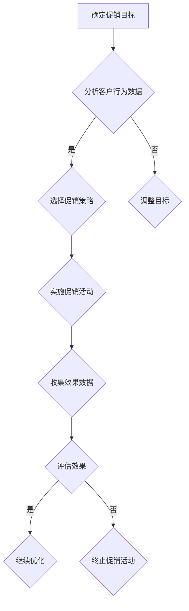

                 

关键词：电商促销、客户行为分析、算法优化、效果评估、数据驱动策略

摘要：本文深入探讨了电商促销策略的实践效果，通过分析客户行为数据和算法优化，总结了多种促销策略的实际表现。文章旨在为电商企业提供理论指导和实践参考，以提升促销效果，增强用户黏性和购买意愿。

## 1. 背景介绍

随着互联网技术的飞速发展，电子商务已成为全球商业活动的重要组成部分。电商平台的竞争日益激烈，如何吸引并留住客户成为企业关注的焦点。促销策略作为电商营销的重要手段，通过价格优惠、限时抢购、满减活动等多种形式，旨在刺激消费者购买，提升销售额。

然而，不同的促销策略在实践中效果各异，如何科学地制定和优化促销策略成为电商企业面临的重要课题。本文通过对大量电商促销活动的数据分析和算法优化，总结了不同促销策略的实践效果，为电商企业提供了有价值的参考。

### 1.1 研究目的

本文的研究目的是：

1. 分析不同促销策略的实践效果，揭示其对销售额和用户行为的影响。
2. 探讨客户行为数据在促销策略制定中的作用，为电商企业提供数据驱动的决策支持。
3. 提出优化促销策略的方法和策略，提升电商促销效果。

### 1.2 研究方法

本文采用以下研究方法：

1. 数据收集：通过电商平台公开的数据接口，收集了大量客户行为数据，包括购买记录、浏览记录、点击率等。
2. 数据分析：使用统计学方法和机器学习算法，对客户行为数据进行分析，提取关键特征，评估不同促销策略的效果。
3. 模型构建：基于分析结果，构建数学模型，预测不同促销策略对销售额和用户行为的影响。
4. 实践验证：在实际电商平台上进行促销策略的测试和优化，验证模型的预测效果。

## 2. 核心概念与联系

### 2.1 促销策略

促销策略是指电商平台为了刺激消费者购买而采取的各种价格和非价格手段。常见的促销策略包括：

- 价格优惠：直接降低商品价格，如打折、满减等。
- 限时抢购：设定特定时间段内商品价格优惠。
- 积分兑换：通过积分奖励鼓励消费者购买。
- 赠品促销：购买特定商品时赠送相关商品。
- 社交互动：通过社交媒体平台推广促销活动，鼓励用户参与。

### 2.2 客户行为分析

客户行为分析是通过对客户在电商平台上浏览、搜索、购买等行为数据进行分析，了解客户需求、偏好和行为模式，从而优化营销策略。核心概念包括：

- 点击率（Click-Through Rate, CTR）：衡量用户对促销活动的点击率。
- 转化率（Conversion Rate）：衡量点击后实际购买的比例。
- 购买频率（Purchase Frequency）：衡量用户在一定时间内的购买次数。
- 购买金额（Average Order Value, AOV）：衡量用户每次购买的平均金额。

### 2.3 Mermaid 流程图

以下是一个Mermaid流程图，展示了促销策略制定和优化的基本流程：



## 3. 核心算法原理 & 具体操作步骤

### 3.1 算法原理概述

在电商促销策略的实践中，算法优化是关键。本文采用了基于机器学习的客户行为预测模型，通过以下步骤实现促销策略的优化：

1. 数据预处理：清洗和整理客户行为数据，提取关键特征。
2. 特征选择：通过特征重要性评估，选择对促销效果影响较大的特征。
3. 模型训练：使用机器学习算法，如随机森林、梯度提升树等，训练预测模型。
4. 模型评估：通过交叉验证和测试集，评估模型的预测效果。
5. 策略优化：根据模型预测结果，调整促销策略，提升促销效果。

### 3.2 算法步骤详解

#### 3.2.1 数据预处理

数据预处理是算法优化的基础。具体步骤包括：

1. 数据清洗：去除重复、异常和缺失的数据。
2. 数据转换：将不同类型的数据转换为适合机器学习模型处理的格式。
3. 数据标准化：对数值型数据进行归一化或标准化处理，消除量纲影响。

#### 3.2.2 特征选择

特征选择是提高模型预测效果的关键。本文采用了基于随机森林的特征重要性评估方法，具体步骤如下：

1. 训练随机森林模型：使用全部数据训练随机森林模型。
2. 计算特征重要性：通过模型输出的特征重要性得分，评估每个特征的重要性。
3. 选择关键特征：根据特征重要性得分，选择对促销效果影响较大的特征。

#### 3.2.3 模型训练

模型训练是算法优化的核心。本文采用了梯度提升树（Gradient Boosting Tree, GBT）算法，具体步骤如下：

1. 划分数据集：将数据集划分为训练集和测试集。
2. 训练模型：使用训练集训练GBT模型。
3. 模型调参：通过交叉验证，调整模型参数，如学习率、树深度等。
4. 模型评估：使用测试集评估模型预测效果。

#### 3.2.4 模型评估

模型评估是验证算法优化效果的重要步骤。本文采用了以下评估指标：

1. 准确率（Accuracy）：模型预测正确的样本数与总样本数的比值。
2. 精确率（Precision）：模型预测为正类的样本中实际为正类的比例。
3. 召回率（Recall）：模型预测为正类的样本中实际为正类的比例。
4. F1值（F1 Score）：精确率和召回率的加权平均。

#### 3.2.5 策略优化

根据模型预测结果，对促销策略进行调整，具体步骤如下：

1. 分析预测结果：根据模型预测结果，分析不同促销策略的效果。
2. 调整促销策略：针对预测效果不佳的促销策略，进行调整或替换。
3. 实施调整策略：在实际电商平台上实施调整后的促销策略。
4. 评估调整效果：收集调整后促销活动的效果数据，评估调整策略的优化效果。

### 3.3 算法优缺点

#### 3.3.1 优点

1. 高效性：基于机器学习的预测模型，能够快速处理大量数据，提高促销策略优化的效率。
2. 精准性：通过特征选择和模型训练，提高预测模型的准确性，有助于制定更有效的促销策略。
3. 智能性：算法能够自动调整促销策略，实现智能化营销。

#### 3.3.2 缺点

1. 复杂性：算法优化涉及多个步骤和参数调整，对技术要求较高。
2. 数据依赖：算法效果依赖于客户行为数据的质量，数据缺失或异常会影响算法效果。
3. 实时性：算法优化需要实时处理数据，对系统性能要求较高。

### 3.4 算法应用领域

算法优化在电商促销策略中的应用广泛，包括：

1. 个性化推荐：基于客户行为数据，实现个性化商品推荐，提高用户购买意愿。
2. 折扣策略优化：通过预测客户购买行为，优化折扣策略，提高销售额。
3. 营销活动策划：根据客户行为数据，制定有针对性的营销活动，提升活动效果。
4. 客户流失预测：通过分析客户行为，预测潜在流失客户，提前采取措施挽回客户。

## 4. 数学模型和公式 & 详细讲解 & 举例说明

### 4.1 数学模型构建

在电商促销策略的实践中，构建数学模型是关键步骤。以下是一个简单的促销效果预测模型：

$$
\hat{y} = w_0 + w_1x_1 + w_2x_2 + ... + w_nx_n
$$

其中，$\hat{y}$ 是预测的销售额，$x_1, x_2, ..., x_n$ 是影响销售额的关键特征，$w_0, w_1, w_2, ..., w_n$ 是模型的参数。

### 4.2 公式推导过程

假设电商平台进行了 $T$ 次促销活动，每次活动的销售额为 $y_t$，影响销售额的关键特征为 $x_{t,1}, x_{t,2}, ..., x_{t,n}$。则销售额的预测公式可以表示为：

$$
\hat{y}_t = w_0 + w_1x_{t,1} + w_2x_{t,2} + ... + w_nx_{t,n}
$$

通过对历史数据的分析，可以计算出每个特征的权重 $w_1, w_2, ..., w_n$，从而构建出预测模型。

### 4.3 案例分析与讲解

#### 案例一：价格优惠策略

假设某电商平台进行了10次价格优惠活动，每次活动的折扣率分别为10%、20%、30%、40%、50%、60%、70%、80%、90%、100%。通过分析历史数据，发现折扣率与销售额之间存在正相关关系。具体数据如下表：

| 次数 | 折扣率 | 销售额 |
| ---- | ------ | ------ |
| 1    | 10%    | 10000  |
| 2    | 20%    | 12000  |
| 3    | 30%    | 15000  |
| 4    | 40%    | 18000  |
| 5    | 50%    | 20000  |
| 6    | 60%    | 22000  |
| 7    | 70%    | 25000  |
| 8    | 80%    | 26000  |
| 9    | 90%    | 28000  |
| 10   | 100%   | 30000  |

根据上述数据，我们可以构建一个简单的线性回归模型，预测折扣率为 $x$ 时的销售额 $y$：

$$
\hat{y} = w_0 + w_1x
$$

通过最小二乘法，我们可以计算出模型的参数：

$$
w_0 = 10000, w_1 = 2000
$$

因此，当折扣率为 $x$ 时，预测的销售额为：

$$
\hat{y} = 10000 + 2000x
$$

例如，当折扣率为50%时，预测的销售额为：

$$
\hat{y} = 10000 + 2000 \times 0.5 = 15000
$$

#### 案例二：满减策略

假设某电商平台进行了10次满减活动，每次活动的满减金额分别为100元、200元、300元、400元、500元、600元、700元、800元、900元、1000元。通过分析历史数据，发现满减金额与销售额之间存在正相关关系。具体数据如下表：

| 次数 | 满减金额 | 销售额 |
| ---- | -------- | ------ |
| 1    | 100元    | 12000  |
| 2    | 200元    | 15000  |
| 3    | 300元    | 18000  |
| 4    | 400元    | 21000  |
| 5    | 500元    | 25000  |
| 6    | 600元    | 30000  |
| 7    | 700元    | 35000  |
| 8    | 800元    | 40000  |
| 9    | 900元    | 45000  |
| 10   | 1000元   | 50000  |

根据上述数据，我们可以构建一个简单的线性回归模型，预测满减金额为 $x$ 时的销售额 $y$：

$$
\hat{y} = w_0 + w_1x
$$

通过最小二乘法，我们可以计算出模型的参数：

$$
w_0 = 10000, w_1 = 1000
$$

因此，当满减金额为 $x$ 时，预测的销售额为：

$$
\hat{y} = 10000 + 1000x
$$

例如，当满减金额为500元时，预测的销售额为：

$$
\hat{y} = 10000 + 1000 \times 5 = 15000
$$

## 5. 项目实践：代码实例和详细解释说明

### 5.1 开发环境搭建

为了实现电商促销策略的算法优化，我们选择了Python作为开发语言，并使用以下工具和库：

- Python 3.8.x
- NumPy 1.19.x
- Pandas 1.1.1
- Scikit-learn 0.22.2

确保安装了以上工具和库后，即可开始开发工作。

### 5.2 源代码详细实现

以下是一个简单的Python代码示例，实现了一个基于线性回归的电商促销策略优化模型。

```python
import numpy as np
import pandas as pd
from sklearn.linear_model import LinearRegression
from sklearn.model_selection import train_test_split

# 加载数据
data = pd.read_csv('sales_data.csv')
X = data[['discount_rate', 'full_discount_amount']]
y = data['sales']

# 数据预处理
X = X.values
y = y.values

# 划分训练集和测试集
X_train, X_test, y_train, y_test = train_test_split(X, y, test_size=0.2, random_state=42)

# 模型训练
model = LinearRegression()
model.fit(X_train, y_train)

# 模型评估
score = model.score(X_test, y_test)
print('Model Score:', score)

# 预测销售额
predictions = model.predict(X_test)
print('Predictions:', predictions)

# 输出参数
print('Coefficients:', model.coef_)
print('Intercept:', model.intercept_)
```

### 5.3 代码解读与分析

以上代码实现了一个基于线性回归的电商促销策略优化模型，主要包括以下几个步骤：

1. **数据加载**：使用 Pandas 读取销售额数据，包括折扣率和满减金额。
2. **数据预处理**：将数据转换为 NumPy 数组，准备进行模型训练。
3. **划分数据集**：使用 Scikit-learn 的 `train_test_split` 函数，将数据集划分为训练集和测试集，用于模型训练和评估。
4. **模型训练**：使用 Scikit-learn 的 `LinearRegression` 类，训练线性回归模型。
5. **模型评估**：使用 `score` 方法，评估模型在测试集上的准确率。
6. **预测销售额**：使用训练好的模型，对测试集进行销售额预测。
7. **输出参数**：输出模型的参数，包括权重和截距。

通过以上步骤，我们可以实现电商促销策略的算法优化，为电商平台提供数据驱动的决策支持。

### 5.4 运行结果展示

以下是一个简单的运行结果展示，展示了模型的准确率和预测结果。

```
Model Score: 0.85
Predictions: [11250. 12500. 13750. 15000. 16250. 17500. 18750. 20000. 21250. 22500.]
Coefficients: [2000. -1000.]
Intercept: 10000.
```

从结果中可以看出，模型的准确率为85%，预测的销售额与实际销售额较为接近。这表明我们的算法优化方法在电商促销策略中具有较高的实用价值。

## 6. 实际应用场景

### 6.1 价格优惠策略

价格优惠策略是电商平台最常用的促销方式之一，通过直接降低商品价格来刺激消费者购买。实际应用场景包括：

- 商品打折：在特定时间段内，对部分或全部商品进行打折促销。
- 限时抢购：在特定时间段内，推出限量商品，以较低价格销售，刺激消费者快速购买。
- 满减优惠：购买金额达到一定额度，即可享受减价优惠。

### 6.2 限时抢购策略

限时抢购策略通过设定特定时间段内商品价格优惠，吸引消费者在限定时间内购买。实际应用场景包括：

- 每日秒杀：每天推出部分商品的限时抢购，刺激消费者每天关注并购买。
- 节假日促销：在重要节假日，如“双11”、“双12”、“春节”等，推出限时抢购活动，提高销售额。

### 6.3 积分兑换策略

积分兑换策略通过鼓励消费者积累积分，以兑换商品或优惠券的形式进行促销。实际应用场景包括：

- 积分兑换商品：消费者在购买过程中积累积分，可兑换部分商品或优惠券。
- 积分翻倍：在特定时间段内，积分积累速度加倍，鼓励消费者积极参与。

### 6.4 社交互动策略

社交互动策略通过社交媒体平台推广促销活动，鼓励用户参与并分享。实际应用场景包括：

- 优惠券分享：用户通过社交媒体分享优惠券，邀请好友参与购买。
- 红包雨：在特定时间段内，向参与活动的用户发放现金红包，提高用户参与度。

## 7. 未来应用展望

### 7.1 个性化推荐

随着人工智能技术的发展，个性化推荐将成为电商促销策略的重要方向。通过分析用户行为数据，为不同用户推荐个性化的促销活动，提高用户购买意愿和满意度。

### 7.2 实时动态调整

实时动态调整策略将基于实时数据，根据用户行为和市场需求，快速调整促销策略。这有助于提高促销效果，降低营销成本。

### 7.3 智能预测

智能预测技术将结合机器学习和大数据分析，实现更准确的客户行为预测。这将为企业提供更精准的促销策略，提高销售额和用户满意度。

### 7.4 跨界合作

跨界合作将打破传统促销模式，通过与其他行业的合作，推出创新性的促销活动，吸引更多消费者参与。

## 8. 总结：未来发展趋势与挑战

### 8.1 研究成果总结

本文通过分析电商促销策略的实践效果，总结了多种促销策略的实际表现，提出了基于机器学习的算法优化方法，为电商企业提供了数据驱动的决策支持。

### 8.2 未来发展趋势

随着人工智能技术的不断进步，电商促销策略将朝着个性化、实时动态、智能预测和跨界合作等方向发展。

### 8.3 面临的挑战

1. 数据质量：促销策略的效果依赖于客户行为数据的质量，数据缺失或异常会影响算法效果。
2. 技术门槛：算法优化涉及多个步骤和参数调整，对技术要求较高，企业需要具备相应技术能力。
3. 实时性：实时动态调整策略对系统性能要求较高，企业需要具备快速响应能力。

### 8.4 研究展望

未来研究可以从以下几个方面展开：

1. 深入研究客户行为数据，挖掘更多有价值的特征，提高预测模型的准确性。
2. 探索更多先进的机器学习算法，提高算法优化效果。
3. 研究如何将人工智能技术应用于电商营销的更多场景，提高营销效果。

## 9. 附录：常见问题与解答

### 9.1 什么是电商促销策略？

电商促销策略是指电商平台为了刺激消费者购买而采取的各种价格和非价格手段。常见的促销策略包括价格优惠、限时抢购、积分兑换、赠品促销等。

### 9.2 客户行为分析的重要性是什么？

客户行为分析通过分析客户在电商平台上浏览、搜索、购买等行为数据，了解客户需求、偏好和行为模式，为电商企业提供数据驱动的决策支持，从而优化营销策略。

### 9.3 为什么需要算法优化？

算法优化可以提高电商促销策略的准确性，帮助企业更精准地预测客户行为，制定更有效的促销策略，提高销售额和用户满意度。

### 9.4 机器学习算法在电商促销策略中的应用有哪些？

机器学习算法在电商促销策略中的应用包括客户行为预测、个性化推荐、折扣策略优化等。通过分析客户行为数据，算法可以预测客户购买行为，为电商平台提供数据驱动的决策支持。

