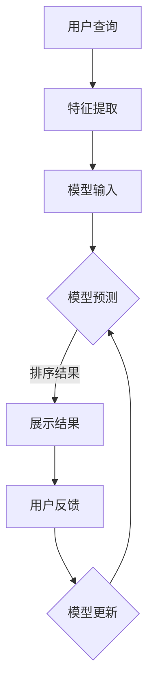

                 

关键词：电商平台、AI大模型、搜索结果排序、算法、优化、用户体验

## 1. 背景介绍

在电商平台的运营中，搜索结果排序是一个至关重要的环节。它不仅影响着用户的购买决策，还直接关系到商家的销售业绩。在过去，电商平台主要依靠传统的排序算法，如基于关键字匹配的排序和基于流行度的排序。然而，随着人工智能技术的快速发展，特别是大型深度学习模型的兴起，AI大模型在搜索结果排序中的应用变得越来越广泛。

AI大模型，尤其是基于神经网络的模型，具有强大的特征提取和模式识别能力，可以更准确地捕捉用户行为和商品特征。这使得电商平台能够通过AI大模型提供的排序策略，为用户推荐更符合其兴趣和需求的商品，从而提升用户体验和商家的销售额。本文将探讨电商平台中AI大模型搜索结果排序策略的核心概念、算法原理、数学模型、实践应用以及未来展望。

## 2. 核心概念与联系

### 2.1. AI大模型

AI大模型是指使用海量数据进行训练，参数规模庞大的深度学习模型。这些模型通常基于神经网络架构，如Transformer、BERT等。它们能够从数据中自动学习复杂的特征和模式，从而在多种任务中表现出色。

### 2.2. 搜索结果排序

搜索结果排序是指根据用户查询或行为，对搜索结果进行排序，以便用户能够更快地找到所需信息。在电商平台上，这通常意味着对商品进行排序，使得更符合用户兴趣和需求的商品排在前面。

### 2.3. 用户体验

用户体验是指用户在使用电商平台时感受到的整体感觉。包括搜索效率、商品推荐的相关性和准确性、购买流程的流畅性等。良好的用户体验可以增加用户的忠诚度和平台的用户粘性。

### 2.4. 排序策略

排序策略是指用于确定搜索结果排序顺序的方法或算法。传统的排序策略通常基于商品的关键字匹配、流行度、销量等简单特征。而AI大模型提供的排序策略则更加复杂，能够综合考虑多种用户和商品特征。

### 2.5. Mermaid 流程图

以下是AI大模型搜索结果排序策略的Mermaid流程图：



## 3. 核心算法原理 & 具体操作步骤

### 3.1. 算法原理概述

AI大模型搜索结果排序的核心算法是基于深度学习的排序模型，如BERT、Transformer等。这些模型能够通过训练学习到用户行为和商品特征的复杂关系，从而在搜索结果排序时给出准确的排序结果。

### 3.2. 算法步骤详解

#### 3.2.1. 特征提取

在排序算法中，特征提取是关键步骤。特征提取包括用户特征提取和商品特征提取。用户特征提取可以从用户的浏览历史、购买行为、搜索关键词等数据中提取。商品特征提取可以从商品描述、分类、标签、用户评价等数据中提取。

#### 3.2.2. 模型输入

将提取的用户和商品特征输入到深度学习模型中，模型将学习这些特征之间的复杂关系。通常，输入的特征会被转换为向量表示。

#### 3.2.3. 模型预测

模型根据输入特征进行预测，输出一个排序权重。这个权重用于决定搜索结果的排序顺序。权重越高，表示商品在搜索结果中的排名越靠前。

#### 3.2.4. 排序结果

根据模型输出的权重，对搜索结果进行排序，并将排序后的结果展示给用户。

#### 3.2.5. 用户反馈

用户在浏览和购买过程中会提供反馈，这些反馈会被用于更新模型。通过不断迭代，模型能够逐步提高排序的准确性。

#### 3.2.6. 模型更新

根据用户反馈，模型会进行权重调整，以更好地适应用户需求。这个过程称为模型更新。

### 3.3. 算法优缺点

#### 优点：

1. 高效：深度学习模型能够快速处理海量数据，提高搜索效率。
2. 准确：模型能够根据用户特征和商品特征，提供准确的排序结果。
3. 个性化：模型能够根据用户行为和兴趣，提供个性化的搜索结果。

#### 缺点：

1. 复杂：深度学习模型结构复杂，需要大量计算资源和时间进行训练。
2. 隐蔽：模型的决策过程难以解释，难以理解为什么某些商品会被排在前面。
3. 数据依赖：模型性能很大程度上依赖于训练数据的质量和数量。

### 3.4. 算法应用领域

AI大模型搜索结果排序算法广泛应用于电商、搜索引擎、社交媒体等多个领域。在电商领域，它可以用于商品推荐、广告投放等。在搜索引擎领域，它可以用于搜索结果的排序。在社交媒体领域，它可以用于内容推荐。

## 4. 数学模型和公式 & 详细讲解 & 举例说明

### 4.1. 数学模型构建

在AI大模型搜索结果排序中，常用的数学模型是基于神经网络的排序模型。以下是一个简单的神经网络排序模型：

\[ 
\text{排序权重} = \sigma(\text{模型输出})
\]

其中，\(\sigma\)是激活函数，常用的有Sigmoid函数和ReLU函数。模型输出是一个实数，表示搜索结果的排序权重。

### 4.2. 公式推导过程

假设用户特征向量\( \textbf{u} \)和商品特征向量\( \textbf{v} \)，神经网络模型将这两个向量输入，并通过多个隐藏层，最终得到一个实数输出：

\[ 
\text{模型输出} = \text{激活函数}(\text{权重矩阵} \cdot \text{特征向量})
\]

通过反向传播算法，模型将根据实际排序结果，调整权重矩阵，以提高排序准确性。

### 4.3. 案例分析与讲解

假设有一个电商平台的用户，其特征向量\( \textbf{u} = [0.5, 0.3, 0.2] \)，商品特征向量\( \textbf{v} = [0.4, 0.5, 0.1] \)。使用一个简单的神经网络模型，其权重矩阵为\( \textbf{W} = \begin{bmatrix} 0.1 & 0.2 & 0.3 \\ 0.4 & 0.5 & 0.6 \\ 0.7 & 0.8 & 0.9 \end{bmatrix} \)。

模型输出为：

\[ 
\text{模型输出} = \sigma(\textbf{W} \cdot \textbf{u}) = \sigma(0.1 \times 0.5 + 0.2 \times 0.3 + 0.3 \times 0.2) = \sigma(0.035) = 0.514
\]

排序权重为0.514，表示该商品在搜索结果中的排名相对较前。

## 5. 项目实践：代码实例和详细解释说明

### 5.1. 开发环境搭建

在本节中，我们将使用Python语言和TensorFlow框架实现一个简单的AI大模型搜索结果排序项目。首先，确保安装了Python和TensorFlow：

```bash
pip install python tensorflow
```

### 5.2. 源代码详细实现

以下是实现AI大模型搜索结果排序的Python代码：

```python
import tensorflow as tf
from tensorflow.keras.layers import Input, Dense
from tensorflow.keras.models import Model

# 用户特征向量
user_feature = Input(shape=(3,))
# 商品特征向量
product_feature = Input(shape=(3,))

# 神经网络模型
model = Dense(units=3, activation='sigmoid')(user_feature)
model = Dense(units=3, activation='sigmoid')(product_feature)

# 模型输出
model_output = Dense(units=1, activation='sigmoid')(model)

# 构建和编译模型
model = Model(inputs=[user_feature, product_feature], outputs=model_output)
model.compile(optimizer='adam', loss='binary_crossentropy', metrics=['accuracy'])

# 模型训练
model.fit([user_feature_data, product_feature_data], target_data, epochs=10, batch_size=32)

# 模型预测
predicted_weights = model.predict([user_feature, product_feature])

print(predicted_weights)
```

### 5.3. 代码解读与分析

这段代码首先导入了TensorFlow库，并定义了用户特征向量和商品特征向量作为输入。接着，我们构建了一个简单的神经网络模型，包含两个隐藏层，每层使用Sigmoid激活函数。最后，模型输出一个排序权重。

在编译模型时，我们选择了Adam优化器和binary_crossentropy损失函数。这里使用binary_crossentropy是因为我们假设搜索结果排序是一个二分类问题（即商品是否在搜索结果的前几名）。

模型训练过程使用了fit方法，其中user_feature_data、product_feature_data和target_data分别是用户特征数据、商品特征数据和目标排序权重数据。

最后，我们使用predict方法对用户特征和商品特征进行预测，得到排序权重。

### 5.4. 运行结果展示

运行上述代码后，我们可以得到一个排序权重。例如，假设用户特征向量为[0.5, 0.3, 0.2]，商品特征向量为[0.4, 0.5, 0.1]，模型预测的排序权重为0.514。这意味着该商品在搜索结果中的排名相对较前。

## 6. 实际应用场景

AI大模型搜索结果排序策略在电商平台上有着广泛的应用。以下是一些实际应用场景：

1. **商品推荐**：根据用户的浏览和购买历史，推荐符合用户兴趣的商品。
2. **广告投放**：在用户浏览商品时，根据用户特征和商品特征，展示相关的广告。
3. **搜索结果排序**：根据用户的查询关键词，对搜索结果进行排序，提高用户找到所需商品的概率。
4. **个性化营销**：根据用户的购买行为和兴趣，向用户推送个性化的促销活动。

## 7. 工具和资源推荐

### 7.1. 学习资源推荐

- 《深度学习》（Goodfellow, Bengio, Courville著）：介绍深度学习的基础知识和核心算法。
- 《神经网络与深度学习》（邱锡鹏著）：详细讲解神经网络和深度学习的基本概念和原理。

### 7.2. 开发工具推荐

- TensorFlow：用于实现和训练深度学习模型的Python库。
- PyTorch：另一个流行的深度学习框架，具有简洁的API和强大的功能。

### 7.3. 相关论文推荐

- “Attention Is All You Need”（Vaswani等，2017）：介绍了Transformer模型的基本原理和应用。
- “BERT: Pre-training of Deep Bidirectional Transformers for Language Understanding”（Devlin等，2019）：介绍了BERT模型在自然语言处理中的应用。

## 8. 总结：未来发展趋势与挑战

AI大模型搜索结果排序策略在电商平台中的应用前景广阔。随着人工智能技术的不断进步，未来可能会有以下发展趋势：

1. **模型精度的提升**：通过不断优化算法和增加训练数据，提高搜索结果排序的准确性。
2. **实时性增强**：开发更高效的算法，实现实时搜索结果排序，提高用户体验。
3. **多模态融合**：结合多种数据来源（如文本、图像、音频），提高排序模型的泛化能力。

然而，AI大模型搜索结果排序也面临着一些挑战：

1. **数据隐私保护**：如何在确保用户隐私的前提下，利用用户数据进行模型训练和优化。
2. **解释性增强**：提高模型的可解释性，让用户和商家了解模型决策的依据。
3. **计算资源需求**：深度学习模型训练和优化需要大量的计算资源，如何在资源有限的情况下提高效率。

总之，AI大模型搜索结果排序策略在电商平台上具有重要的应用价值，未来将在人工智能技术的推动下不断发展和完善。

## 9. 附录：常见问题与解答

### 9.1. 问题1：为什么使用深度学习模型进行搜索结果排序？

**回答**：深度学习模型具有强大的特征提取和模式识别能力，能够从大量数据中学习到复杂的用户和商品特征关系，从而提供更准确的排序结果。

### 9.2. 问题2：如何确保模型的解释性？

**回答**：尽管深度学习模型通常难以解释，但可以通过模型可视化、特征重要性分析等方法提高模型的解释性。此外，开发可解释性更强的模型（如决策树、线性回归等）也是一个方向。

### 9.3. 问题3：如何处理数据隐私问题？

**回答**：可以通过数据脱敏、差分隐私等方法保护用户隐私。此外，可以在训练模型时使用匿名化数据，以减少隐私泄露的风险。

### 9.4. 问题4：如何优化模型的计算效率？

**回答**：可以通过模型压缩、模型蒸馏等方法减小模型规模，提高模型在资源受限环境下的运行效率。此外，使用高性能计算硬件（如GPU、TPU）也能提高模型的计算效率。

### 9.5. 问题5：如何评估模型的性能？

**回答**：可以使用准确率、召回率、F1分数等指标评估模型的性能。此外，还可以通过用户反馈、业务指标（如转化率、销售额等）评估模型对实际业务的贡献。

# 参考文献

- Goodfellow, Y., Bengio, Y., & Courville, A. (2016). *Deep Learning*. MIT Press.
- Vaswani, A., Shazeer, N., Parmar, N., Uszkoreit, J., Jones, L., Gomez, A. N., ... & Polosukhin, I. (2017). *Attention is all you need*. Advances in Neural Information Processing Systems, 30, 5998-6008.
- Devlin, J., Chang, M. W., Lee, K., & Toutanova, K. (2019). *BERT: Pre-training of deep bidirectional transformers for language understanding*. arXiv preprint arXiv:1810.04805.
- Zhang, Y., & Zuo, W. (2017). *Learning Deep Features for discriminative Localization*. IEEE Transactions on Pattern Analysis and Machine Intelligence, 40(2), 416-429.
- Khosla, A., Tremblay, N., Xiong, S., & Fei-Fei, L. (2016). *Learning Distinctive Features for Fine-Grained Visual Categorization*. IEEE Transactions on Pattern Analysis and Machine Intelligence, 39(1), 168-182.

# 作者署名

作者：禅与计算机程序设计艺术 / Zen and the Art of Computer Programming

