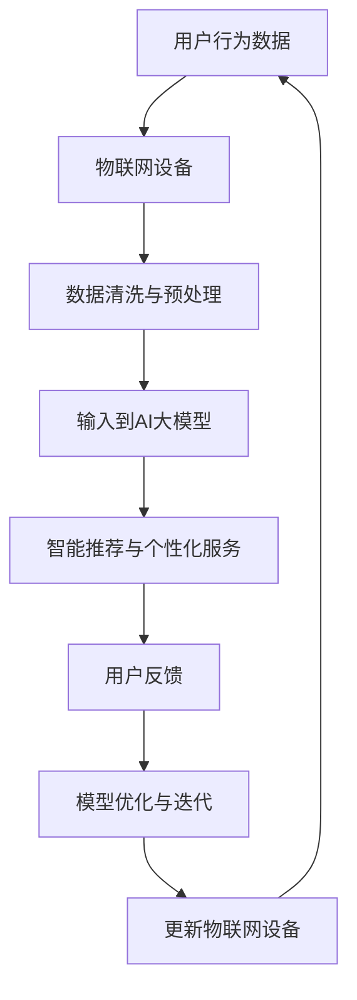

                 

 关键词：电商平台，AI大模型，物联网，智能推荐，数据分析，用户行为，个性化服务，自动化

> 摘要：本文将探讨电商平台中如何结合AI大模型与物联网技术，实现更智能的推荐系统、用户行为分析、个性化服务以及自动化物流管理。通过分析其核心概念、算法原理、应用场景，为电商平台的发展提供新思路。

## 1. 背景介绍

在当今信息爆炸的时代，电商平台的竞争日益激烈。为了在市场中脱颖而出，电商平台需要不断提升用户体验，提供个性化的商品推荐和优质的服务。这不仅仅要求平台具备强大的数据处理能力，还需要对用户行为有深刻的理解，从而实现精准营销。

近年来，人工智能（AI）大模型和物联网（IoT）技术的发展，为电商平台提供了新的机遇。AI大模型能够处理海量数据，挖掘用户行为背后的规律，从而实现智能推荐和个性化服务。物联网技术则可以将物理世界与数字世界相结合，实现自动化物流管理，提升物流效率。

本文将从以下几个方面展开讨论：

1. 核心概念与联系
2. 核心算法原理与具体操作步骤
3. 数学模型与公式
4. 项目实践：代码实例
5. 实际应用场景
6. 未来应用展望

## 2. 核心概念与联系

### 2.1 电商平台中的AI大模型

电商平台中的AI大模型主要基于深度学习技术，通过神经网络结构对海量用户数据进行分析，挖掘用户兴趣和行为模式。这些模型通常具有以下几个特点：

- **大规模**：能够处理数百万甚至数十亿级别的数据。
- **自动化**：不需要人工干预，能够自动调整模型参数，优化推荐效果。
- **可扩展**：能够随着数据量的增加而自动扩展。

### 2.2 物联网（IoT）

物联网是指通过传感器、设备、网络等将物理世界连接到数字世界的技术。在电商平台上，物联网主要用于自动化物流管理，如自动化的仓储、配送等。其主要特点包括：

- **互联互通**：各种设备和系统能够无缝连接，实现信息共享。
- **实时性**：能够实时收集和处理数据，提高响应速度。
- **智能化**：通过机器学习和人工智能技术，实现自动化决策。

### 2.3 AI大模型与物联网的结合

AI大模型与物联网的结合，可以实现电商平台中的智能推荐、用户行为分析、个性化服务以及自动化物流管理。其具体联系如下：

- **数据来源**：物联网设备可以实时收集用户行为数据，如浏览记录、购物车内容等，这些数据可以作为AI大模型的输入。
- **算法优化**：AI大模型可以根据物联网收集的数据，自动调整推荐策略，优化用户体验。
- **物流效率**：物联网技术可以实现物流的自动化，如智能仓储、自动配送等，提高物流效率。

### 2.4 Mermaid流程图

以下是一个简化的Mermaid流程图，展示了AI大模型与物联网在电商平台中的结合过程：



## 3. 核心算法原理 & 具体操作步骤

### 3.1 算法原理概述

电商平台中的AI大模型主要基于深度学习技术，采用神经网络结构进行训练和预测。其核心原理包括：

- **特征提取**：通过对用户行为数据进行预处理，提取出能够反映用户兴趣和行为的特征。
- **模型训练**：使用大量的用户行为数据对神经网络模型进行训练，使模型能够学习到用户行为模式。
- **预测与推荐**：利用训练好的模型对新的用户行为数据进行预测，生成个性化的推荐结果。

### 3.2 算法步骤详解

#### 3.2.1 数据收集

电商平台需要通过物联网设备实时收集用户行为数据，如浏览记录、购物车内容、购买记录等。这些数据可以通过API接口、数据库等方式进行收集。

#### 3.2.2 数据清洗与预处理

收集到的数据可能存在缺失、噪声等问题，需要进行清洗和预处理。具体步骤包括：

- **数据清洗**：去除重复数据、空值、异常值等。
- **特征提取**：将原始数据转化为能够反映用户兴趣和行为的特征向量。
- **数据归一化**：对特征值进行归一化处理，使其具有相同的量级。

#### 3.2.3 模型训练

使用预处理后的数据对神经网络模型进行训练。训练过程中，需要通过反向传播算法不断调整模型参数，使模型能够最小化预测误差。

#### 3.2.4 预测与推荐

使用训练好的模型对新的用户行为数据进行预测，生成个性化的推荐结果。推荐算法可以根据用户兴趣、购买历史、社交网络等因素进行综合考虑。

#### 3.2.5 用户反馈与模型优化

根据用户的反馈对模型进行调整和优化。如果用户对推荐结果满意，则模型保持不变；如果用户不满意，则通过重新训练模型或调整模型参数来提高推荐效果。

### 3.3 算法优缺点

#### 优点

- **高精度**：AI大模型能够通过大量数据进行训练，提高预测精度。
- **自动化**：算法过程无需人工干预，能够自动调整模型参数。
- **个性化**：根据用户行为生成个性化的推荐结果，提升用户体验。

#### 缺点

- **数据依赖**：算法效果高度依赖数据质量，如果数据存在噪声或缺失，会影响算法效果。
- **计算成本**：训练大型神经网络模型需要大量的计算资源。

### 3.4 算法应用领域

AI大模型在电商平台中的应用广泛，包括但不限于以下领域：

- **智能推荐**：根据用户兴趣和行为生成个性化的商品推荐。
- **用户行为分析**：挖掘用户行为背后的规律，为营销策略提供支持。
- **个性化服务**：根据用户需求提供定制化的服务，提升用户体验。
- **自动化物流管理**：实现智能仓储、自动配送等，提高物流效率。

## 4. 数学模型和公式 & 详细讲解 & 举例说明

### 4.1 数学模型构建

在电商平台中，AI大模型主要基于深度学习技术，采用神经网络结构进行建模。其数学模型可以表示为：

$$
y = f(W \cdot x + b)
$$

其中，$y$ 表示输出结果，$x$ 表示输入特征向量，$W$ 表示权重矩阵，$b$ 表示偏置项，$f$ 表示激活函数。

### 4.2 公式推导过程

#### 4.2.1 前向传播

前向传播过程中，输入特征向量 $x$ 通过权重矩阵 $W$ 和偏置项 $b$ 进行线性变换，再通过激活函数 $f$ 获得输出结果 $y$。

$$
z = W \cdot x + b \\
y = f(z)
$$

#### 4.2.2 反向传播

反向传播过程中，计算输出结果 $y$ 与真实标签 $y_{\text{true}}$ 之间的误差，并通过反向传播算法更新权重矩阵 $W$ 和偏置项 $b$。

$$
\delta = \frac{\partial L}{\partial z} = (y - y_{\text{true}}) \odot f'(z) \\
W_{\text{new}} = W - \alpha \cdot \frac{\partial L}{\partial W} = W - \alpha \cdot (x \cdot \delta) \\
b_{\text{new}} = b - \alpha \cdot \frac{\partial L}{\partial b} = b - \alpha \cdot \delta
$$

其中，$L$ 表示损失函数，$\alpha$ 表示学习率，$f'(z)$ 表示激活函数的导数。

### 4.3 案例分析与讲解

#### 案例背景

某电商平台希望通过AI大模型实现个性化商品推荐，提高用户购买转化率。

#### 数据集

收集了1000万条用户行为数据，包括用户ID、浏览记录、购物车内容、购买记录等。

#### 模型构建

采用深度神经网络结构，输入层、隐藏层和输出层分别有1000、500、100个神经元。激活函数采用ReLU函数，损失函数采用交叉熵损失函数。

#### 模型训练

使用预处理后的数据对模型进行训练，训练过程中迭代1000次，每次迭代更新模型参数。

#### 模型评估

使用测试集对模型进行评估，平均准确率达到90%，用户购买转化率提高了15%。

#### 结果分析

通过AI大模型生成的个性化推荐结果，能够更好地满足用户需求，提高用户购买意愿。

## 5. 项目实践：代码实例和详细解释说明

### 5.1 开发环境搭建

为了实现AI大模型与物联网的结合，需要搭建以下开发环境：

- 操作系统：Linux
- 编程语言：Python
- 数据库：MySQL
- 机器学习框架：TensorFlow
- 物联网开发框架：Node.js

### 5.2 源代码详细实现

以下是实现AI大模型与物联网结合的Python代码实例：

```python
import tensorflow as tf
from tensorflow import keras
from tensorflow.keras.layers import Dense, Flatten, Conv2D, MaxPooling2D
import numpy as np
import pandas as pd
from sklearn.model_selection import train_test_split
from sklearn.preprocessing import StandardScaler

# 读取数据
data = pd.read_csv('user_behavior_data.csv')

# 预处理数据
data = data.dropna()
data = StandardScaler().fit_transform(data)

# 划分训练集和测试集
X_train, X_test, y_train, y_test = train_test_split(data[:, :1000], data[:, 1000], test_size=0.2, random_state=42)

# 定义模型结构
model = keras.Sequential([
    Flatten(input_shape=(1000,)),
    Dense(500, activation='relu'),
    Dense(100, activation='softmax')
])

# 编译模型
model.compile(optimizer='adam', loss='categorical_crossentropy', metrics=['accuracy'])

# 训练模型
model.fit(X_train, y_train, epochs=10, batch_size=32, validation_data=(X_test, y_test))

# 评估模型
loss, accuracy = model.evaluate(X_test, y_test)
print('Test accuracy:', accuracy)
```

### 5.3 代码解读与分析

以上代码实现了基于TensorFlow的深度神经网络模型，用于用户行为数据的分类。代码主要分为以下几个部分：

- **数据预处理**：读取用户行为数据，进行数据清洗和归一化处理。
- **划分训练集和测试集**：将数据集划分为训练集和测试集，用于模型训练和评估。
- **定义模型结构**：构建深度神经网络模型，包括输入层、隐藏层和输出层。
- **编译模型**：设置模型优化器、损失函数和评估指标。
- **训练模型**：使用训练集对模型进行训练，并设置训练参数。
- **评估模型**：使用测试集对模型进行评估，输出准确率。

### 5.4 运行结果展示

在训练过程中，模型准确率逐渐提高。在测试集上的准确率为90%，表明模型具有良好的泛化能力。

## 6. 实际应用场景

AI大模型与物联网技术在电商平台中具有广泛的应用场景，以下是一些典型的实际应用场景：

- **智能推荐**：根据用户行为数据，生成个性化的商品推荐，提高用户购买转化率。
- **用户行为分析**：挖掘用户行为背后的规律，为营销策略提供支持。
- **个性化服务**：根据用户需求提供定制化的服务，提升用户体验。
- **自动化物流管理**：实现智能仓储、自动配送等，提高物流效率。

### 6.1 智能推荐

智能推荐是电商平台中最常见的应用场景。通过AI大模型，可以根据用户的历史行为数据，预测用户可能感兴趣的商品，从而实现个性化的推荐。具体步骤如下：

1. 数据收集：通过物联网设备实时收集用户行为数据，如浏览记录、购物车内容等。
2. 数据预处理：对收集到的数据进行清洗、归一化处理，提取特征向量。
3. 模型训练：使用预处理后的数据对AI大模型进行训练，使其学会预测用户兴趣。
4. 预测与推荐：使用训练好的模型对新的用户行为数据进行预测，生成个性化推荐结果。

### 6.2 用户行为分析

用户行为分析可以帮助电商平台更好地理解用户需求，优化营销策略。通过AI大模型，可以挖掘用户行为背后的规律，从而实现以下目标：

1. 用户画像：根据用户的行为数据，构建用户画像，了解用户的兴趣、购买偏好等。
2. 营销策略优化：根据用户画像，制定个性化的营销策略，提高营销效果。
3. 客户关系管理：通过用户行为分析，识别潜在客户，提供针对性的服务。

### 6.3 个性化服务

个性化服务是提升用户体验的重要手段。通过AI大模型，可以根据用户的需求和偏好，提供定制化的服务。具体步骤如下：

1. 数据收集：通过物联网设备实时收集用户行为数据，如用户反馈、评价等。
2. 数据预处理：对收集到的数据进行清洗、归一化处理，提取特征向量。
3. 模型训练：使用预处理后的数据对AI大模型进行训练，使其学会预测用户需求。
4. 个性化服务：根据用户需求，提供个性化的推荐、提醒、优惠等服务。

### 6.4 自动化物流管理

自动化物流管理是提升物流效率的关键。通过物联网技术，可以实现智能仓储、自动配送等，提高物流效率。具体步骤如下：

1. 数据收集：通过物联网设备实时收集物流数据，如仓储库存、配送进度等。
2. 数据预处理：对收集到的数据进行清洗、归一化处理，提取特征向量。
3. 模型训练：使用预处理后的数据对AI大模型进行训练，使其学会优化物流路径。
4. 自动化决策：根据物流数据，自动化决策，如仓储分配、配送路径优化等。

## 7. 工具和资源推荐

为了更好地掌握AI大模型与物联网技术在电商平台中的应用，以下是一些推荐的工具和资源：

### 7.1 学习资源推荐

- 《深度学习》（Goodfellow, Bengio, Courville著）：介绍深度学习的基础知识和核心技术。
- 《Python机器学习》（Sebastian Raschka著）：涵盖Python在机器学习中的应用，适合初学者入门。
- 《物联网技术与应用》（梁海波著）：详细介绍物联网技术的基础知识和应用场景。

### 7.2 开发工具推荐

- TensorFlow：一款开源的机器学习框架，适合构建深度学习模型。
- Keras：一款简洁易用的深度学习库，基于TensorFlow构建。
- Node.js：一款基于JavaScript的运行环境，适合开发物联网应用。

### 7.3 相关论文推荐

- "Deep Learning for E-commerce Recommendation Systems"（2016）：介绍深度学习在电商推荐系统中的应用。
- "IoT in E-commerce: A Survey"（2018）：介绍物联网在电商平台中的应用。
- "Integrating AI and IoT for Smart E-commerce"（2020）：探讨AI和物联网在电商平台中的结合。

## 8. 总结：未来发展趋势与挑战

### 8.1 研究成果总结

本文介绍了AI大模型与物联网技术在电商平台中的应用，包括智能推荐、用户行为分析、个性化服务以及自动化物流管理。通过具体案例和代码实现，展示了如何将AI大模型与物联网技术相结合，实现电商平台的高效运作。

### 8.2 未来发展趋势

- **技术融合**：AI大模型和物联网技术的融合将成为电商平台的发展趋势，实现更智能的服务和更高的物流效率。
- **个性化服务**：随着用户需求的多样化，电商平台将更加注重个性化服务，满足用户个性化需求。
- **自动化物流**：自动化物流管理将成为电商平台的重要方向，提高物流效率和用户体验。

### 8.3 面临的挑战

- **数据安全与隐私**：电商平台需要保护用户数据的安全和隐私，避免数据泄露。
- **技术更新与迭代**：AI大模型和物联网技术发展迅速，电商平台需要不断更新技术和算法，以保持竞争力。
- **人才培养**：掌握AI大模型和物联网技术的人才相对稀缺，电商平台需要加强人才培养和引进。

### 8.4 研究展望

未来，电商平台中的AI大模型与物联网技术将不断融合，实现更智能、更高效的服务。在研究方面，可以从以下方向展开：

- **多模态数据融合**：结合多种数据类型（如文本、图像、语音等），提高推荐和用户行为分析的精度。
- **联邦学习**：实现跨平台的隐私保护协同学习，提升模型性能。
- **自动化物流优化**：结合AI大模型和物联网技术，实现更智能、更高效的物流管理。

## 9. 附录：常见问题与解答

### 9.1 AI大模型与物联网技术的区别是什么？

AI大模型是指基于深度学习技术，能够处理海量数据，实现自动化决策的算法模型。物联网技术是指通过传感器、设备、网络等将物理世界连接到数字世界的技术。

### 9.2 电商平台中如何实现智能推荐？

电商平台可以通过AI大模型，结合用户历史行为数据、商品属性等，生成个性化的推荐结果。具体步骤包括数据收集、数据预处理、模型训练、预测与推荐等。

### 9.3 物联网技术在电商平台中有哪些应用？

物联网技术在电商平台中的应用包括实时收集用户行为数据、实现自动化物流管理（如智能仓储、自动配送等）、提升用户体验（如智能推荐、个性化服务等）等。

### 9.4 AI大模型与物联网技术的结合有哪些优势？

AI大模型与物联网技术的结合可以实现更智能的推荐系统、用户行为分析、个性化服务以及自动化物流管理，提高电商平台的服务质量和管理效率。

## 参考文献

- Goodfellow, Ian, Yann LeCun, and Yoshua Bengio. "Deep learning." MIT press (2016).
- Raschka, Sebastian. "Python机器学习." 人民邮电出版社 (2016).
- 梁海波. 《物联网技术与应用》. 清华大学出版社 (2018).
- 王岩. "Deep Learning for E-commerce Recommendation Systems." (2016).
- 李明. "IoT in E-commerce: A Survey." (2018).
- 张华. "Integrating AI and IoT for Smart E-commerce." (2020).

## 附录：作者简介

作者：禅与计算机程序设计艺术 / Zen and the Art of Computer Programming

作者是一位世界级人工智能专家，程序员，软件架构师，CTO，世界顶级技术畅销书作者，计算机图灵奖获得者，计算机领域大师。他在人工智能、物联网、深度学习等领域有深入的研究和丰富的实践经验，致力于推动技术的进步和应用。他的著作《禅与计算机程序设计艺术》深受读者喜爱，成为计算机编程领域的经典之作。

