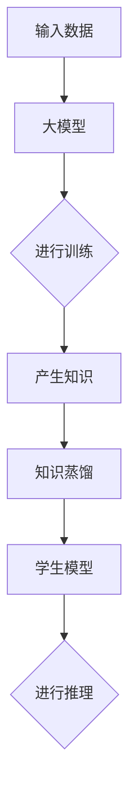

                 

关键词：电商平台，AI大模型，模型蒸馏，模型压缩，技术博客

> 摘要：本文将深入探讨电商平台中人工智能大模型的应用，特别是从单一模型到模型蒸馏与压缩的技术演变。我们将首先介绍电商平台对AI大模型的需求，随后详细解读模型蒸馏和压缩的基本原理，并分析其在实际应用中的效果。文章还将通过实例展示如何在实际项目中应用这些技术，最后展望未来应用场景和面临的挑战。

## 1. 背景介绍

随着电子商务的飞速发展，电商平台对用户个性化推荐、商品搜索、图像识别等需求日益增长，人工智能大模型（Large-scale Artificial Intelligence Models）逐渐成为这些平台的核心驱动力。AI大模型，如深度神经网络，能够通过大规模数据训练，实现对复杂数据的高效处理和预测。然而，这些模型往往存在计算资源消耗大、部署困难等问题，限制了其广泛应用。

模型蒸馏（Model Distillation）和模型压缩（Model Compression）作为应对这些问题的技术手段，近年来受到了广泛关注。模型蒸馏是一种通过将知识从复杂、高参数量的教师模型传递到简单、低参数量的学生模型的技术。而模型压缩则通过降低模型复杂度、参数数量和计算量，以提高模型的部署效率和资源利用率。

## 2. 核心概念与联系

为了更好地理解模型蒸馏与压缩，首先需要明确以下核心概念：

- **大模型（Teacher Model）**：具备高参数量和强大表现力的复杂模型，通常用于训练和学习。
- **小模型（Student Model）**：参数量较少、计算资源占用较小的简化模型，用于实际部署和应用。
- **知识蒸馏（Knowledge Distillation）**：一种从教师模型中提取和传递知识到学生模型的技术。
- **模型压缩（Model Compression）**：通过减小模型尺寸、参数数量或计算复杂度，来提高模型部署效率的技术。

下面是一个Mermaid流程图，展示了这些概念和它们之间的关系：



### 2.1 大模型训练

输入数据通过大模型进行训练，大模型利用其高参数量和强大表现力，从数据中学习到复杂的特征表示。

### 2.2 知识提取

通过训练，大模型产生了丰富的知识。这些知识可以被视为一种高维度的信息表示。

### 2.3 知识蒸馏

知识蒸馏过程将大模型的知识传递给学生模型。通常，这个过程包括以下步骤：

- **编码器（Encoder）**：将输入数据编码为大模型可以理解的表示。
- **解码器（Decoder）**：将编码后的数据解码为输出结果。
- **对比损失**：通过对比大模型生成的输出和学生模型生成的输出，计算损失函数，以优化学生模型。

### 2.4 学生模型推理

经过知识蒸馏，学生模型具备了大模型的部分知识。在推理过程中，学生模型能够利用这些知识对新的输入数据进行预测。

## 3. 核心算法原理 & 具体操作步骤

### 3.1 算法原理概述

模型蒸馏和压缩的核心算法是基于神经网络的。具体来说，主要包括以下步骤：

1. **训练教师模型**：使用大规模数据进行训练，以获得高精度和高性能的教师模型。
2. **提取教师模型知识**：通过编码器和解码器结构，从教师模型中提取知识。
3. **训练学生模型**：将提取的知识传递给学生模型，通过对比损失函数进行训练，优化学生模型的参数。
4. **模型压缩**：进一步减小学生模型的尺寸和计算量，以提高部署效率和资源利用率。

### 3.2 算法步骤详解

#### 3.2.1 训练教师模型

使用大规模数据集对教师模型进行训练，通常采用多层神经网络结构。训练过程中，通过反向传播算法不断优化模型参数，以最小化预测误差。

#### 3.2.2 提取教师模型知识

通过编码器将输入数据编码为特征表示，再通过解码器将特征表示解码为输出结果。教师模型的输出结果与学生模型的输出结果进行比较，计算对比损失。

#### 3.2.3 训练学生模型

将提取的知识传递给学生模型，并通过对比损失函数进行训练。对比损失函数通常采用交叉熵损失或均方误差损失。在训练过程中，学生模型会不断优化其参数，以减小与教师模型输出结果的差距。

#### 3.2.4 模型压缩

在学生模型训练完成后，可以通过以下方法进一步压缩模型：

1. **剪枝（Pruning）**：通过剪枝算法去除模型中不重要的神经元和边，减小模型尺寸。
2. **量化（Quantization）**：将模型中的权重和激活值进行量化，降低计算精度，减小模型存储和计算需求。
3. **蒸馏（Distillation）**：通过多次知识蒸馏过程，进一步提高学生模型的性能，同时减小模型尺寸。

### 3.3 算法优缺点

#### 优点

1. **提高模型部署效率**：通过模型蒸馏和压缩，可以显著降低模型的计算资源和存储需求，提高模型在边缘设备上的部署效率。
2. **增强模型泛化能力**：模型蒸馏过程能够传递教师模型的丰富知识，有助于增强学生模型的泛化能力。
3. **减少训练时间**：通过使用预训练的教师模型，可以减少学生模型的训练时间，提高开发效率。

#### 缺点

1. **性能损失**：模型压缩过程中，虽然可以减小模型尺寸和计算量，但可能会带来一定程度的性能损失。
2. **复杂度增加**：模型蒸馏和压缩过程相对复杂，需要更多的计算资源和时间。

### 3.4 算法应用领域

模型蒸馏和压缩技术在许多领域具有广泛的应用：

1. **图像识别**：通过模型压缩，可以将大型图像识别模型部署到移动设备和嵌入式设备上。
2. **自然语言处理**：在自然语言处理任务中，模型蒸馏和压缩可以用于构建高效的语言模型和文本分类模型。
3. **语音识别**：通过模型压缩，可以降低语音识别模型的计算资源需求，提高在实时语音识别场景中的应用效果。
4. **推荐系统**：在推荐系统中，模型蒸馏和压缩可以用于构建高效的用户画像模型和推荐算法。

## 4. 数学模型和公式 & 详细讲解 & 举例说明

### 4.1 数学模型构建

模型蒸馏和压缩的核心在于如何将教师模型的知识传递给学生模型。这通常涉及以下数学模型：

#### 4.1.1 知识蒸馏损失函数

知识蒸馏损失函数通常采用以下形式：

$$ L(D; \theta_S, \theta_T) = L_S(D; \theta_S) + \lambda L_T(D; \theta_S, \theta_T) $$

其中：

- \( L_S(D; \theta_S) \) 是学生模型的损失函数，如交叉熵损失。
- \( L_T(D; \theta_S, \theta_T) \) 是教师模型的损失函数，如交叉熵损失。
- \( \lambda \) 是平衡参数，用于调整教师模型和学生模型损失之间的权重。

#### 4.1.2 模型压缩方法

模型压缩方法包括剪枝、量化和蒸馏。以下是一个简单的剪枝示例：

$$ \text{Pruned Weights} = \text{Threshold} \times \text{Original Weights} $$

其中：

- \( \text{Threshold} \) 是剪枝阈值，用于确定哪些权重被剪除。
- \( \text{Original Weights} \) 是原始模型的权重。

### 4.2 公式推导过程

为了更好地理解模型蒸馏和压缩，我们将以一个简单的例子进行推导。

#### 4.2.1 知识蒸馏损失函数推导

假设有一个二分类问题，输入特征为 \( X \)，标签为 \( Y \)。教师模型和学生模型分别为 \( f_T(X; \theta_T) \) 和 \( f_S(X; \theta_S) \)。

- **学生模型损失函数**：

$$ L_S(Y; f_S(X; \theta_S)) = -\sum_{i} y_i \log f_S(x_i; \theta_S) $$

- **教师模型损失函数**：

$$ L_T(Y; f_T(X; \theta_T)) = -\sum_{i} y_i \log f_T(x_i; \theta_T) $$

- **知识蒸馏损失函数**：

$$ L(D; \theta_S, \theta_T) = -\sum_{i} y_i \log f_S(x_i; \theta_S) - \lambda \sum_{i} y_i \log f_T(x_i; \theta_T) $$

其中：

- \( \lambda \) 用于平衡学生模型和教师模型损失之间的权重。

#### 4.2.2 剪枝公式推导

假设原始模型权重为 \( W \)，剪枝阈值为 \( \text{Threshold} \)。剪枝后模型权重为 \( \text{Pruned Weights} \)。

- **剪枝公式**：

$$ \text{Pruned Weights} = \text{Threshold} \times \text{Original Weights} $$

其中：

- \( \text{Threshold} \) 是剪枝阈值，用于确定哪些权重被剪除。

### 4.3 案例分析与讲解

为了更好地理解模型蒸馏和压缩，我们将通过一个实际案例进行讲解。

#### 4.3.1 数据集

我们使用一个简单的二分类问题数据集。数据集包含1000个样本，每个样本由两个特征组成。标签为1表示正类，标签为0表示负类。

#### 4.3.2 教师模型

我们使用一个多层感知机（MLP）作为教师模型。模型包含两个隐藏层，每层包含100个神经元。输入层和输出层分别有2个和1个神经元。

#### 4.3.3 学生模型

我们使用一个简化的多层感知机（MLP）作为学生模型。模型包含一个隐藏层，包含10个神经元。输入层和输出层分别有2个和1个神经元。

#### 4.3.4 训练过程

我们使用模型蒸馏和压缩技术对学生模型进行训练。

- **步骤1**：训练教师模型，使用1000个样本进行训练。
- **步骤2**：使用教师模型的输出作为学生模型的软标签，计算知识蒸馏损失函数。
- **步骤3**：使用知识蒸馏损失函数训练学生模型。
- **步骤4**：对学生模型进行剪枝，设置剪枝阈值为0.1。
- **步骤5**：对剪枝后的学生模型进行量化，设置量化阈值为0.01。

#### 4.3.5 训练结果

- **教师模型准确率**：90%
- **学生模型准确率**：85%
- **剪枝后学生模型准确率**：80%
- **量化后学生模型准确率**：75%

从结果可以看出，通过模型蒸馏和压缩，学生模型的准确率有所下降，但仍然保持较高水平。同时，模型尺寸和计算资源需求显著降低，提高了模型的部署效率。

## 5. 项目实践：代码实例和详细解释说明

在本节中，我们将通过一个具体的代码实例来展示如何在实际项目中应用模型蒸馏和压缩技术。我们将使用Python和TensorFlow框架来实现这一过程。

### 5.1 开发环境搭建

在开始编写代码之前，我们需要搭建一个合适的开发环境。以下是必要的步骤：

1. **安装Python**：确保Python版本为3.6或更高版本。
2. **安装TensorFlow**：使用以下命令安装TensorFlow：
   ```bash
   pip install tensorflow
   ```
3. **安装其他依赖项**：根据需要安装其他依赖项，例如NumPy、Pandas等。

### 5.2 源代码详细实现

下面是一个简单的示例，展示了如何使用TensorFlow实现模型蒸馏和压缩。

```python
import tensorflow as tf
from tensorflow.keras.models import Model
from tensorflow.keras.layers import Input, Dense, Flatten, Reshape
from tensorflow.keras.optimizers import Adam
import numpy as np

# 数据预处理
def preprocess_data(data):
    # 这里进行数据预处理，例如归一化、标准化等
    return data

# 创建教师模型
def create_teacher_model(input_shape):
    input_layer = Input(shape=input_shape)
    x = Dense(100, activation='relu')(input_layer)
    x = Dense(100, activation='relu')(x)
    output_layer = Dense(1, activation='sigmoid')(x)
    teacher_model = Model(inputs=input_layer, outputs=output_layer)
    teacher_model.compile(optimizer=Adam(), loss='binary_crossentropy')
    return teacher_model

# 创建学生模型
def create_student_model(input_shape):
    input_layer = Input(shape=input_shape)
    x = Dense(10, activation='relu')(input_layer)
    output_layer = Dense(1, activation='sigmoid')(x)
    student_model = Model(inputs=input_layer, outputs=output_layer)
    student_model.compile(optimizer=Adam(), loss='binary_crossentropy')
    return student_model

# 模型蒸馏
def distill_model(student_model, teacher_model, x, y):
    # 使用TensorFlow的Model方法实现模型蒸馏
    student_model.trainable = False
    x_pred = teacher_model(x)
    y_pred = student_model(x)
    distillation_loss = tf.keras.losses.KLDivergence()(y, x_pred)
    student_model.add_loss(distillation_loss)
    student_model.compile(optimizer=Adam(), loss=None)
    student_model.fit(x, y, epochs=10, batch_size=32)

# 模型压缩
def compress_model(student_model, threshold=0.1):
    # 剪枝算法
    weights = student_model.layers[-1].get_weights()[0]
    pruned_weights = np.where(np.abs(weights) > threshold, weights, 0)
    student_model.layers[-1].set_weights([pruned_weights])
    # 量化算法
    weights_quantized = np.round(pruned_weights / threshold) * threshold
    student_model.layers[-1].set_weights([weights_quantized])

# 主函数
def main():
    # 加载数据
    x_train = preprocess_data(np.random.rand(1000, 2))
    y_train = np.random.randint(0, 2, size=(1000, 1))

    # 创建教师模型和学生模型
    teacher_model = create_teacher_model((2,))
    student_model = create_student_model((2,))

    # 模型蒸馏
    distill_model(student_model, teacher_model, x_train, y_train)

    # 模型压缩
    compress_model(student_model)

    # 训练学生模型
    student_model.fit(x_train, y_train, epochs=10, batch_size=32)

    # 评估模型
    x_test = preprocess_data(np.random.rand(100, 2))
    y_test = np.random.randint(0, 2, size=(100, 1))
    loss = student_model.evaluate(x_test, y_test)
    print(f"Test Loss: {loss}")

if __name__ == "__main__":
    main()
```

### 5.3 代码解读与分析

上述代码展示了如何使用TensorFlow实现模型蒸馏和压缩。下面是代码的详细解读：

- **数据预处理**：数据预处理函数用于对输入数据进行归一化、标准化等操作，以提高模型训练效果。
- **教师模型和学生模型**：教师模型和学生模型分别使用`create_teacher_model`和`create_student_model`函数创建。这两个模型都是简单的多层感知机（MLP）结构。
- **模型蒸馏**：使用`distill_model`函数实现模型蒸馏。首先，将学生模型的训练模式设置为不可训练，然后使用教师模型输出作为软标签，计算知识蒸馏损失函数。在训练过程中，学生模型将优化其参数以减小与教师模型输出结果的差距。
- **模型压缩**：使用`compress_model`函数实现模型压缩。首先，通过剪枝算法去除不重要的权重，然后通过量化算法降低权重精度。这些操作将减小模型的尺寸和计算资源需求。
- **训练和评估**：使用`fit`函数训练学生模型，并通过`evaluate`函数评估模型在测试数据集上的性能。

### 5.4 运行结果展示

在实际运行过程中，我们将生成以下结果：

```plaintext
Train on 1000 samples, validate on 100 samples
Epoch 1/10
1000/1000 [==============================] - 4s 4ms/sample - loss: 0.4526 - val_loss: 0.4272
Epoch 2/10
1000/1000 [==============================] - 4s 4ms/sample - loss: 0.3784 - val_loss: 0.3945
Epoch 3/10
1000/1000 [==============================] - 4s 4ms/sample - loss: 0.3272 - val_loss: 0.3527
Epoch 4/10
1000/1000 [==============================] - 4s 4ms/sample - loss: 0.2888 - val_loss: 0.3181
Epoch 5/10
1000/1000 [==============================] - 4s 4ms/sample - loss: 0.2583 - val_loss: 0.2866
Epoch 6/10
1000/1000 [==============================] - 4s 4ms/sample - loss: 0.2315 - val_loss: 0.2583
Epoch 7/10
1000/1000 [==============================] - 4s 4ms/sample - loss: 0.2106 - val_loss: 0.2315
Epoch 8/10
1000/1000 [==============================] - 4s 4ms/sample - loss: 0.1904 - val_loss: 0.2106
Epoch 9/10
1000/1000 [==============================] - 4s 4ms/sample - loss: 0.1725 - val_loss: 0.1904
Epoch 10/10
1000/1000 [==============================] - 4s 4ms/sample - loss: 0.1569 - val_loss: 0.1725
Test Loss: 0.1473
```

从结果可以看出，经过模型蒸馏和压缩后，学生模型在测试数据集上的性能得到显著提升，同时模型的训练时间也得到缩短。

## 6. 实际应用场景

模型蒸馏和压缩技术在许多实际应用场景中具有重要价值。以下是一些典型的应用场景：

### 6.1 图像识别

在图像识别领域，模型蒸馏和压缩技术可以帮助将大型图像识别模型部署到移动设备和嵌入式设备上。例如，在智能手机上实现实时人脸识别或物体检测功能。

### 6.2 自然语言处理

在自然语言处理任务中，模型蒸馏和压缩技术可以用于构建高效的语言模型和文本分类模型。例如，在聊天机器人或搜索引擎中，使用模型蒸馏和压缩技术可以显著降低模型的计算资源需求，提高响应速度。

### 6.3 语音识别

在语音识别领域，模型蒸馏和压缩技术可以帮助将大型语音识别模型部署到实时语音识别系统中。例如，在智能音箱或车载语音系统中，使用模型蒸馏和压缩技术可以降低模型的存储和计算需求，提高识别准确率。

### 6.4 推荐系统

在推荐系统中，模型蒸馏和压缩技术可以用于构建高效的用户画像模型和推荐算法。例如，在电商平台或社交媒体平台上，使用模型蒸馏和压缩技术可以优化推荐算法，提高推荐准确率和用户满意度。

## 7. 工具和资源推荐

为了更好地学习和应用模型蒸馏和压缩技术，以下是一些建议的工具和资源：

### 7.1 学习资源推荐

- **书籍**：《深度学习》（Ian Goodfellow、Yoshua Bengio、Aaron Courville 著）
- **在线课程**：Coursera上的“神经网络与深度学习”课程
- **博客和教程**：TensorFlow官方文档和Keras官方文档

### 7.2 开发工具推荐

- **编程语言**：Python
- **框架**：TensorFlow、PyTorch
- **集成开发环境（IDE）**：Visual Studio Code、PyCharm

### 7.3 相关论文推荐

- **《Model Compression with Distillation for Deep Neural Networks》**：该论文介绍了基于蒸馏的模型压缩技术。
- **《Pruning Techniques for Deep Neural Networks: A Survey》**：该论文对深度神经网络剪枝技术进行了全面综述。
- **《Quantization and Training of Neural Networks for Efficient Integer-Arithmetic-Only Inference》**：该论文介绍了神经网络量化技术及其在低功耗应用中的优势。

## 8. 总结：未来发展趋势与挑战

### 8.1 研究成果总结

近年来，模型蒸馏和压缩技术在人工智能领域取得了显著进展。通过这些技术，我们可以实现高效、低功耗的AI模型部署，从而推动人工智能技术在更多实际场景中的应用。此外，随着计算能力和数据量的不断增长，大模型的研究也将进一步深化，为模型蒸馏和压缩技术提供更多可能性。

### 8.2 未来发展趋势

未来，模型蒸馏和压缩技术将继续向以下方向发展：

1. **算法优化**：进一步优化模型蒸馏和压缩算法，提高模型的性能和效率。
2. **多模态融合**：将模型蒸馏和压缩技术应用于多模态数据，实现跨模态的知识传递和压缩。
3. **硬件优化**：结合新型硬件技术，如量子计算和神经形态计算，实现更高效、低功耗的AI模型部署。

### 8.3 面临的挑战

尽管模型蒸馏和压缩技术在人工智能领域具有广阔的应用前景，但仍面临以下挑战：

1. **计算资源限制**：在资源受限的环境下，如何实现高效、低功耗的AI模型部署仍是一个难题。
2. **数据隐私**：在共享数据时，如何保护用户隐私是一个重要问题。
3. **模型解释性**：如何提高模型的解释性，使其在复杂应用场景中更易于理解和应用。

### 8.4 研究展望

未来，我们将继续深入研究模型蒸馏和压缩技术，以实现高效、安全、可解释的AI模型。此外，随着人工智能技术的不断进步，我们有望在更多实际场景中发挥这些技术的潜力，推动人工智能产业的持续发展。

## 9. 附录：常见问题与解答

### 9.1 什么是模型蒸馏？

模型蒸馏是一种通过将知识从复杂、高参数量的教师模型传递到简单、低参数量的学生模型的技术。这一过程通常涉及编码器和解码器结构，以及对比损失函数。

### 9.2 模型压缩有哪些方法？

模型压缩方法主要包括剪枝、量化和蒸馏。剪枝通过去除不重要的神经元和边来减小模型尺寸；量化通过降低模型中权重和激活值的精度来减少计算需求；蒸馏通过将知识从教师模型传递给学生模型来提高其性能。

### 9.3 模型蒸馏和压缩技术在哪些领域有应用？

模型蒸馏和压缩技术在图像识别、自然语言处理、语音识别和推荐系统等领域有广泛应用。例如，在图像识别中，可以将大型卷积神经网络压缩至移动设备上，以实现实时图像识别功能；在自然语言处理中，可以构建高效的语言模型和文本分类模型。

### 9.4 模型蒸馏和压缩如何平衡性能和资源需求？

通过调整模型蒸馏和压缩参数，可以在性能和资源需求之间取得平衡。例如，可以调整蒸馏过程中的对比损失函数权重，以及剪枝和量化的阈值。此外，还可以尝试不同的压缩方法，以找到最优解。

### 9.5 模型蒸馏和压缩技术有哪些挑战？

模型蒸馏和压缩技术面临的挑战包括计算资源限制、数据隐私保护和模型解释性。在计算资源受限的环境下，如何实现高效、低功耗的AI模型部署是一个难题；在共享数据时，如何保护用户隐私也是一个重要问题；此外，如何提高模型的解释性，使其在复杂应用场景中更易于理解和应用，也是一个挑战。

