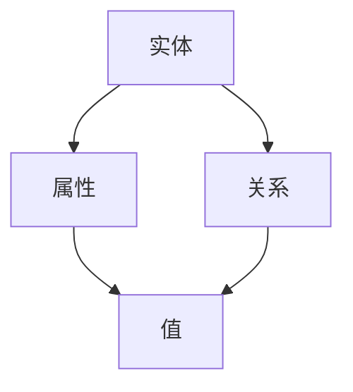

                 

关键词：电商平台，商品知识图谱，构建，应用，算法原理，数学模型，代码实例

> 摘要：本文旨在探讨在电商平台中构建商品知识图谱的重要性和应用，通过详细介绍核心概念、算法原理、数学模型以及实际应用案例，阐述商品知识图谱在现代电子商务领域中的关键作用。文章还将讨论未来发展趋势、面临的挑战，并推荐相关学习资源和工具。

## 1. 背景介绍

在电子商务迅速发展的今天，商品信息的管理和搜索变得尤为重要。传统的数据库管理系统已经难以满足用户对商品信息查询的多样性和实时性的需求。为了应对这一挑战，商品知识图谱（Product Knowledge Graph）作为一种新型的数据管理技术，逐渐成为电商平台优化用户体验、提升运营效率的重要工具。

商品知识图谱通过将商品及其相关的属性、分类、品牌、用户评价等实体及其之间的关系进行结构化存储，构建出一个高度互联的知识网络。这种网络结构不仅能够增强数据的语义理解，还能实现复杂查询的快速响应，从而提升用户在电商平台的购物体验。

本文将围绕商品知识图谱的构建与应用展开讨论，首先介绍其核心概念和联系，然后深入剖析核心算法原理和具体操作步骤，接着展示数学模型和公式，并分享一个实际项目的代码实例。最后，我们将探讨商品知识图谱的实际应用场景，以及未来的发展趋势和挑战。

## 2. 核心概念与联系

### 2.1 定义

商品知识图谱是一个基于图形数据库的知识管理系统，用于存储和表示电商平台上商品及其相关属性和关系。它由节点和边组成，其中节点表示商品实体或属性，边表示节点之间的关系。

### 2.2 架构

商品知识图谱的架构通常包括以下三个核心部分：

#### 2.2.1 实体（Entities）

实体是知识图谱中最基本的构成单元，可以是一个商品、品牌、分类等。每个实体都有一个唯一的标识符（ID）和一组属性。

#### 2.2.2 关系（Relationships）

关系连接两个实体，表示它们之间的语义关联。例如，一个商品实体可以与它的品牌实体通过“属于”关系连接。

#### 2.2.3 属性（Properties）

属性描述实体的特征，如价格、库存量、评价等。属性可以是离散的，也可以是连续的。

### 2.3 Mermaid 流程图

以下是商品知识图谱的基本构建流程的 Mermaid 流程图：



- **A（实体）**：定义商品、品牌、分类等实体。
- **B（属性）**：为实体添加属性，如名称、描述、价格等。
- **C（关系）**：建立实体之间的关系，如商品属于某个分类，品牌生产商品等。
- **D（值）**：属性的具体值。

## 3. 核心算法原理 & 具体操作步骤

### 3.1 算法原理概述

商品知识图谱的构建主要依赖于图数据库和图算法。以下是一些关键算法和概念：

#### 3.1.1 RDF（Resource Description Framework）

RDF是一种用于表示实体和关系的语义模型，它使用URI来标识实体和属性，并使用三元组（主体，关系，客体）来表示关系。

#### 3.1.2 SPARQL（SPARQL Protocol and RDF Query Language）

SPARQL是一种用于查询知识图谱的查询语言，类似于SQL，但针对图结构设计。

#### 3.1.3 PGQL（Property Graph Query Language）

PGQL是一种专为属性图数据库设计的查询语言，支持复杂路径查询和属性筛选。

### 3.2 算法步骤详解

以下是构建商品知识图谱的基本步骤：

#### 3.2.1 数据收集

从电商平台的各种数据源（如数据库、API、日志等）收集商品信息。

#### 3.2.2 数据预处理

清洗和整合收集到的数据，确保数据的质量和一致性。

#### 3.2.3 实体识别

使用自然语言处理技术（如命名实体识别、实体链接等）将文本数据转化为实体和属性。

#### 3.2.4 关系抽取

从实体识别结果中抽取关系，如商品与分类、品牌与商品之间的关系。

#### 3.2.5 构建图谱

使用图数据库（如Neo4j、Apache TinkerPop等）将实体和关系存储为图形结构。

#### 3.2.6 查询优化

针对常见的查询场景，优化图谱查询性能，如使用索引、缓存等技术。

### 3.3 算法优缺点

#### 优点：

- **高扩展性**：能够轻松处理大量商品和关系。
- **复杂查询**：支持复杂路径查询和属性筛选，满足多样化查询需求。
- **数据质量**：通过数据预处理和实体识别，提高数据质量。

#### 缺点：

- **性能瓶颈**：在大规模数据下，查询性能可能成为瓶颈。
- **维护成本**：图谱维护和优化需要专业知识和技能。

### 3.4 算法应用领域

商品知识图谱在电商平台的多个领域都有广泛的应用：

- **推荐系统**：基于用户行为和商品关系进行个性化推荐。
- **搜索优化**：提高搜索精度和响应速度。
- **数据挖掘**：发现潜在的用户需求和市场趋势。

## 4. 数学模型和公式 & 详细讲解 & 举例说明

### 4.1 数学模型构建

商品知识图谱的核心是图结构，可以用图论中的数学模型来表示。以下是一个简化的数学模型：

#### 4.1.1 节点表示

节点可以表示为 \(V = \{v_1, v_2, ..., v_n\}\)，其中 \(v_i\) 是第 \(i\) 个节点。

#### 4.1.2 边表示

边可以表示为 \(E = \{e_{ij}\}\)，其中 \(e_{ij}\) 表示节点 \(v_i\) 和节点 \(v_j\) 之间的关系。

#### 4.1.3 图表示

整个图可以用 \(G = (V, E)\) 表示。

### 4.2 公式推导过程

在构建商品知识图谱时，可以使用一些基本的图算法来优化查询性能。以下是一个简化的推导过程：

#### 4.2.1 最短路径算法

使用Dijkstra算法计算两个节点之间的最短路径。

#### 公式：

$$
d(v_i, v_j) = \min_{k \in \{1, 2, ..., n\}} (d(v_i, v_k) + w(v_k, v_j))
$$

其中，\(d(v_i, v_j)\) 是节点 \(v_i\) 和节点 \(v_j\) 之间的最短路径长度，\(w(v_k, v_j)\) 是节点 \(v_k\) 和节点 \(v_j\) 之间的权重。

#### 4.2.2 聚类算法

使用社区发现算法（如Girvan-Newman算法）将节点分组，以优化查询路径。

#### 公式：

$$
C_i = \{v_j | w(v_i, v_j) > \theta\}
$$

其中，\(C_i\) 是与节点 \(v_i\) 相关联的节点集合，\(\theta\) 是设定的阈值。

### 4.3 案例分析与讲解

假设我们有一个电商平台的商品知识图谱，其中包含商品、分类、品牌等节点，以及它们之间的关系。以下是一个简单的案例分析：

#### 案例描述

用户A搜索某款手机，电商平台需要根据用户的浏览历史和商品关系，推荐相关商品。

#### 分析过程

1. **用户行为分析**：

   根据用户A的历史浏览记录，识别其感兴趣的手机品牌和型号。

2. **图谱查询**：

   使用最短路径算法计算用户A当前浏览商品与其感兴趣品牌和型号之间的最短路径。

3. **推荐生成**：

   根据查询结果，推荐路径上的其他商品。

4. **优化**：

   使用聚类算法优化查询路径，提高查询效率。

#### 公式应用

- **最短路径查询**：

  $$
  d(A, B) = \min_{k \in \{1, 2, ..., n\}} (d(A, k) + w(k, B))
  $$

- **聚类分析**：

  $$
  C_B = \{B', w(B, B') > \theta\}
  $$

## 5. 项目实践：代码实例和详细解释说明

### 5.1 开发环境搭建

为了构建商品知识图谱，我们选择使用Neo4j作为图数据库，以及Python作为编程语言。以下是开发环境的搭建步骤：

1. **安装Neo4j**：

   从Neo4j官网下载社区版，并按照说明进行安装。

2. **安装Python**：

   如果未安装Python，从Python官网下载并安装最新版本的Python。

3. **安装Neo4j Python驱动**：

   使用pip命令安装neo4j包：

   $$
   pip install neo4j
   $$

### 5.2 源代码详细实现

以下是一个简单的商品知识图谱构建示例，包含数据收集、预处理、实体识别、关系抽取和图谱构建等步骤。

```python
from neo4j import GraphDatabase
from py2neo import Node, Relationship

# 连接到Neo4j数据库
driver = GraphDatabase.driver("bolt://localhost:7687", auth=("neo4j", "password"))

def create_node(label, properties):
    with driver.session() as session:
        node = Node(label, **properties)
        session.run("CREATE (n:" + label + " " + properties["type"] + ") RETURN n", properties=properties)

def create_relationship(start_node, end_node, relationship_type, properties=None):
    with driver.session() as session:
        relationship = Relationship(start_node, relationship_type, end_node, **properties)
        session.run("MATCH (a:" + start_node + "), (b:" + end_node + ") CREATE (a)-[:" + relationship_type + "]->(b)", properties=properties)

# 数据收集
def collect_data():
    # 这里可以根据实际需求从不同的数据源（如API、数据库等）收集数据
    # 例如，从商品API获取商品信息
    products = get_product_data_from_api()
    categories = get_category_data_from_api()
    brands = get_brand_data_from_api()

# 数据预处理
def preprocess_data(products, categories, brands):
    # 这里进行数据清洗、去重、格式转换等操作
    # 例如，将商品名称统一转换为小写
    products = [{**product, "name": product["name"].lower()} for product in products]
    categories = [{**category, "name": category["name"].lower()} for category in categories]
    brands = [{**brand, "name": brand["name"].lower()} for brand in brands]
    return products, categories, brands

# 实体识别和关系抽取
def build_knowledge_graph(products, categories, brands):
    for product in products:
        create_node("Product", product)
        for category in categories:
            if product["category_id"] == category["id"]:
                create_relationship(product["name"], category["name"], "BELONGS_TO")
        for brand in brands:
            if product["brand_id"] == brand["id"]:
                create_relationship(product["name"], brand["name"], "PRODUCED_BY")

# 运行示例
collect_data()
products, categories, brands = preprocess_data(products, categories, brands)
build_knowledge_graph(products, categories, brands)
```

### 5.3 代码解读与分析

1. **连接Neo4j数据库**：

   使用`GraphDatabase.driver`方法连接到本地Neo4j数据库。

2. **创建节点**：

   `create_node`函数用于创建实体节点，通过传递节点类型和属性参数，调用Neo4j的CREATE语句创建节点。

3. **创建关系**：

   `create_relationship`函数用于创建实体之间的关系，通过传递起点、终点和关系类型参数，调用Neo4j的CREATE语句创建关系。

4. **数据收集**：

   `collect_data`函数从API或其他数据源收集商品、分类和品牌数据。

5. **数据预处理**：

   `preprocess_data`函数对收集到的数据进行清洗和格式转换，确保数据的一致性和准确性。

6. **构建知识图谱**：

   `build_knowledge_graph`函数根据预处理后的数据构建商品知识图谱，将实体和关系存储到Neo4j数据库中。

### 5.4 运行结果展示

在完成代码编写和数据库连接后，可以启动Neo4j数据库，并运行上述脚本。成功构建商品知识图谱后，可以使用Neo4j的Cypher查询语言进行验证和测试。

```cypher
MATCH (p:Product)-[:BELONGS_TO]->(c:Category)
RETURN p.name, c.name
```

运行结果将返回商品与其所属分类的名称。

## 6. 实际应用场景

### 6.1 商品推荐

基于商品知识图谱，电商平台可以实现更加精准的商品推荐。通过分析用户的历史行为和商品之间的关系，系统可以推荐与用户兴趣高度相关的商品，提高用户满意度和购买转化率。

### 6.2 搜索优化

商品知识图谱可以优化电商平台的搜索功能。通过图谱中的关系链接，系统可以提供更加精确的搜索结果，并支持复杂的查询场景，如模糊查询、多条件筛选等。

### 6.3 数据挖掘

商品知识图谱为电商平台提供了丰富的数据资源，可以通过数据挖掘技术发现潜在的市场趋势和用户需求。例如，分析热门商品、品牌和分类，预测未来的销售趋势，为营销策略提供支持。

### 6.4 供应链管理

商品知识图谱可以用于优化供应链管理。通过图谱中的商品和品牌关系，企业可以更好地掌握供应链上的各个节点，提高供应链的透明度和效率。

## 7. 工具和资源推荐

### 7.1 学习资源推荐

- **书籍**：
  - 《图计算：原理、算法与实践》
  - 《知识图谱：概念、方法与应用》

- **在线课程**：
  - Coursera上的“知识图谱与图计算”课程
  - edX上的“图论与网络分析”课程

### 7.2 开发工具推荐

- **图数据库**：
  - Neo4j
  - Apache TinkerPop

- **编程语言**：
  - Python
  - Java

### 7.3 相关论文推荐

- “Knowledge Graph Construction and Its Applications in E-commerce” （知识图谱构建及其在电子商务中的应用）
- “A Survey of Knowledge Graph” （知识图谱综述）
- “Graph Neural Networks: A Review of Methods and Applications” （图神经网络：方法与应用综述）

## 8. 总结：未来发展趋势与挑战

### 8.1 研究成果总结

商品知识图谱在电商平台中的应用取得了显著成果，不仅提升了用户体验和运营效率，还为数据挖掘和推荐系统提供了强有力的支持。未来，随着人工智能和大数据技术的发展，商品知识图谱的应用前景将更加广阔。

### 8.2 未来发展趋势

- **智能化**：通过引入人工智能技术，实现更加智能化的商品推荐和搜索。
- **多模态**：结合文本、图像、音频等多模态数据，构建更加丰富的商品知识图谱。
- **实时性**：提高图谱构建和查询的实时性，以满足电商平台的快速响应需求。

### 8.3 面临的挑战

- **数据质量**：确保数据的一致性和准确性，是构建高质量知识图谱的关键。
- **性能优化**：在大规模数据下，优化查询性能，提高系统响应速度。
- **隐私保护**：在处理用户数据时，保障用户隐私和安全。

### 8.4 研究展望

未来，商品知识图谱的研究将朝着更加智能化、多模态和实时化的方向发展。通过不断创新和优化，商品知识图谱将为电商平台带来更多的价值，推动电子商务领域的持续进步。

## 9. 附录：常见问题与解答

### Q：商品知识图谱与传统数据库相比有哪些优势？

A：商品知识图谱通过结构化的图形数据模型，能够更好地表示实体及其关系，支持复杂查询和数据分析。与传统数据库相比，它具有更高的扩展性、复杂查询能力和数据关联分析能力。

### Q：如何保证商品知识图谱的数据质量？

A：保证数据质量的关键在于数据收集、清洗和预处理。通过建立数据标准、使用数据校验技术和定期数据审查，可以有效提高知识图谱的数据质量。

### Q：商品知识图谱在电商平台的推荐系统中如何应用？

A：商品知识图谱可以通过分析用户行为和商品关系，为推荐系统提供更精准的推荐。通过最短路径算法、社区发现算法等技术，系统可以识别用户的兴趣偏好，推荐与用户兴趣高度相关的商品。

### Q：构建商品知识图谱需要哪些技术和工具？

A：构建商品知识图谱需要图数据库（如Neo4j）、自然语言处理工具（如spaCy）、实体识别工具（如BERT）和图算法库（如Apache TinkerPop）。此外，还需要编程语言（如Python、Java）和开发环境（如Jupyter Notebook）。

