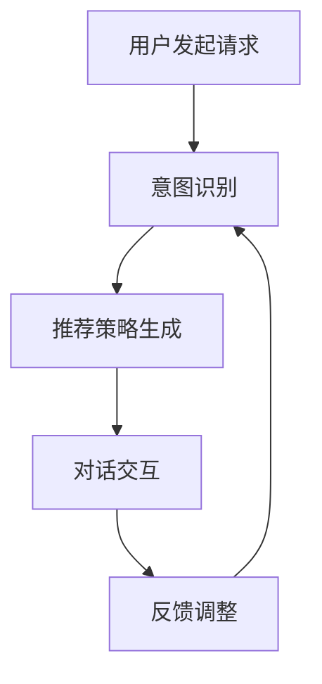
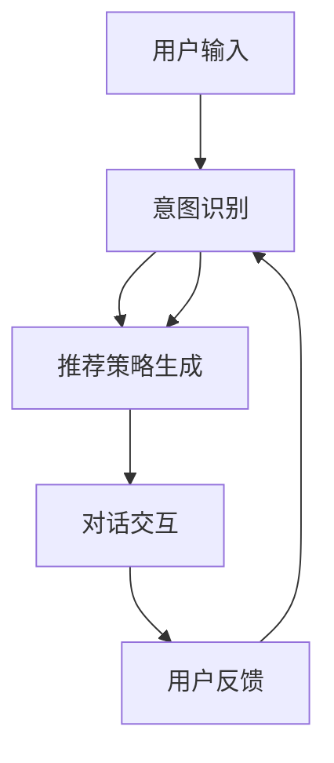

                 

关键词：电商平台，对话式推荐，个性化优化，机器学习，用户行为分析，协同过滤，内容推荐

>摘要：随着电商行业的迅速发展，用户对于个性化推荐的需求日益增长。本文将探讨电商平台中对话式推荐系统的个性化优化，介绍其核心概念、算法原理、数学模型及实际应用场景，并展望其未来的发展趋势与挑战。

## 1. 背景介绍

### 1.1 电商行业的发展现状

随着互联网技术的不断进步和人们消费习惯的转变，电商行业正以惊人的速度蓬勃发展。根据相关数据，全球电商市场规模已经突破了数万亿美元，并且仍在持续增长。电商平台的竞争愈发激烈，个性化推荐系统成为了电商平台提高用户满意度和转化率的重要手段。

### 1.2 个性化推荐的需求

在电商平台上，用户的需求是多样化的，不同的用户对商品的兴趣和偏好各不相同。传统的基于内容的推荐系统和基于协同过滤的推荐系统虽然在一定程度上能够满足用户的需求，但仍然存在推荐效果不理想、个性化不足等问题。因此，探索新的个性化推荐方式，特别是对话式推荐系统的个性化优化，成为了当前研究的重点。

### 1.3 对话式推荐系统的优势

对话式推荐系统通过与用户的实时互动，能够更好地理解用户的意图和需求，从而提供更加精准的个性化推荐。与传统的推荐系统相比，对话式推荐系统具有以下几个显著优势：

1. **提高用户体验**：通过对话式交互，用户可以更直观地表达自己的需求，获得更加个性化的推荐。
2. **实时反馈**：对话式推荐系统可以即时获取用户的反馈，并根据反馈调整推荐策略，提高推荐效果。
3. **降低用户流失率**：通过与用户建立良好的互动关系，可以增加用户的粘性，降低用户流失率。
4. **提升转化率**：精准的个性化推荐可以引导用户进行购买，从而提高转化率。

## 2. 核心概念与联系

### 2.1 对话式推荐系统

对话式推荐系统是一种基于自然语言处理和机器学习技术的推荐系统，通过与用户的对话交互，实现个性化推荐。其主要流程包括：

1. **用户意图识别**：通过自然语言处理技术，理解用户的意图和需求。
2. **推荐策略生成**：根据用户意图，利用机器学习算法生成个性化推荐策略。
3. **对话交互**：与用户进行对话，反馈推荐结果，并根据用户反馈调整推荐策略。

### 2.2 个性化优化

个性化优化是指通过对用户行为数据、偏好数据进行深入分析，实现对推荐系统的优化，提高推荐效果。个性化优化的主要方法包括：

1. **协同过滤**：通过分析用户之间的相似度，预测用户可能喜欢的商品。
2. **基于内容的推荐**：通过分析商品的特征，推荐与用户兴趣相似的物品。
3. **混合推荐**：结合协同过滤和基于内容的推荐方法，提高推荐效果。

### 2.3 Mermaid 流程图

下面是一个简单的 Mermaid 流程图，展示了对话式推荐系统的工作流程：



## 3. 核心算法原理 & 具体操作步骤

### 3.1 算法原理概述

对话式推荐系统的核心算法主要包括用户意图识别、推荐策略生成和对话交互。以下将对这三个核心算法的原理进行概述。

### 3.2 算法步骤详解

#### 3.2.1 用户意图识别

用户意图识别是对话式推荐系统的第一步，其目的是理解用户输入的文本信息，确定用户的意图和需求。主要方法包括：

1. **词向量表示**：将用户输入的文本转换为词向量表示，利用词向量的相似性进行意图识别。
2. **序列模型**：利用序列模型（如 LSTM、GRU）对用户输入的文本进行建模，捕获文本的时序信息。

#### 3.2.2 推荐策略生成

推荐策略生成是根据用户意图，利用机器学习算法生成个性化推荐策略。主要方法包括：

1. **协同过滤**：通过分析用户之间的相似度，推荐与用户兴趣相似的物品。
2. **基于内容的推荐**：通过分析商品的特征，推荐与用户兴趣相似的物品。
3. **混合推荐**：结合协同过滤和基于内容的推荐方法，提高推荐效果。

#### 3.2.3 对话交互

对话交互是对话式推荐系统与用户的交互过程，主要方法包括：

1. **自然语言生成**：利用自然语言生成技术，生成与用户意图相符的回复。
2. **多轮对话**：通过多轮对话，不断调整推荐策略，提高推荐效果。

### 3.3 算法优缺点

#### 优点：

1. **提高用户体验**：通过对话式交互，用户可以更直观地表达自己的需求，获得更加个性化的推荐。
2. **实时反馈**：对话式推荐系统可以即时获取用户的反馈，并根据反馈调整推荐策略，提高推荐效果。
3. **降低用户流失率**：通过与用户建立良好的互动关系，可以增加用户的粘性，降低用户流失率。
4. **提升转化率**：精准的个性化推荐可以引导用户进行购买，从而提高转化率。

#### 缺点：

1. **计算复杂度高**：对话式推荐系统需要处理大量的文本数据，计算复杂度较高。
2. **对数据质量要求高**：对话式推荐系统依赖于用户行为数据和商品特征数据，数据质量直接影响推荐效果。

### 3.4 算法应用领域

对话式推荐系统可以广泛应用于电商、金融、医疗、教育等多个领域，以下是一些典型的应用场景：

1. **电商平台**：通过对话式推荐系统，为用户提供个性化的商品推荐，提高用户满意度和转化率。
2. **金融服务**：通过对话式推荐系统，为用户提供个性化的理财建议，提高金融服务的用户体验。
3. **医疗领域**：通过对话式推荐系统，为用户提供个性化的健康建议，提高医疗服务质量。
4. **教育领域**：通过对话式推荐系统，为用户提供个性化的学习建议，提高学习效果。

## 4. 数学模型和公式 & 详细讲解 & 举例说明

### 4.1 数学模型构建

对话式推荐系统的数学模型主要包括用户意图识别模型、推荐策略生成模型和对话交互模型。以下分别介绍这些模型的构建方法。

#### 4.1.1 用户意图识别模型

用户意图识别模型通常采用序列模型（如 LSTM、GRU）进行构建。其基本思想是利用序列模型对用户输入的文本序列进行建模，从而捕捉用户的意图。

假设用户输入的文本序列为 $X = [x_1, x_2, ..., x_T]$，其中 $x_t$ 表示第 $t$ 个词的词向量。序列模型的目标是学习一个映射函数 $f$，将用户输入的文本序列映射为一个意图向量 $Y$。

$$
Y = f(X)
$$

#### 4.1.2 推荐策略生成模型

推荐策略生成模型主要采用基于协同过滤和基于内容的推荐方法。协同过滤方法的目标是学习一个评分预测模型，预测用户对商品的评分。假设用户对商品的评分矩阵为 $R \in \mathbb{R}^{m \times n}$，其中 $r_{ij}$ 表示用户 $i$ 对商品 $j$ 的评分。协同过滤方法的目标是学习一个预测模型 $P$，预测用户 $i$ 对商品 $j$ 的评分。

$$
\hat{r}_{ij} = P(R)
$$

基于内容的推荐方法的目标是学习一个商品特征映射模型，将商品特征映射为一个高维向量。假设商品特征矩阵为 $C \in \mathbb{R}^{n \times d}$，其中 $c_j$ 表示商品 $j$ 的特征向量。基于内容的推荐方法的目标是学习一个映射模型 $F$，将商品特征映射为用户意图向量。

$$
Y = F(C)
$$

#### 4.1.3 对话交互模型

对话交互模型主要采用自然语言生成技术进行构建。其目标是生成与用户意图相符的自然语言回复。假设用户输入的文本序列为 $X = [x_1, x_2, ..., x_T]$，生成模型的目标是生成一个回复序列 $Y = [y_1, y_2, ..., y_S]$。

$$
Y = g(X)
$$

### 4.2 公式推导过程

#### 4.2.1 用户意图识别模型

用户意图识别模型通常采用序列模型（如 LSTM、GRU）进行构建。以 LSTM 为例，其基本思想是利用 LSTM 单元对用户输入的文本序列进行建模，从而捕捉用户的意图。

LSTM 单元包括输入门、遗忘门和输出门三个部分。输入门负责决定当前时刻的输入信息是否需要更新状态；遗忘门负责决定之前的状态是否需要遗忘；输出门负责决定当前的状态是否需要输出。

输入门：

$$
i_t = \sigma(W_i [h_{t-1}, x_t] + b_i)
$$

遗忘门：

$$
f_t = \sigma(W_f [h_{t-1}, x_t] + b_f)
$$

输出门：

$$
o_t = \sigma(W_o [h_{t-1}, x_t] + b_o)
$$

状态更新：

$$
c_t = f_t \odot c_{t-1} + i_t \odot \sigma(W_c [h_{t-1}, x_t] + b_c)
$$

输出：

$$
h_t = o_t \odot \sigma(c_t)
$$

其中，$h_{t-1}$ 表示前一时刻的状态，$x_t$ 表示当前时刻的输入，$c_t$ 表示当前时刻的状态，$W_i, W_f, W_o, W_c$ 分别为权重矩阵，$b_i, b_f, b_o, b_c$ 分别为偏置向量，$\sigma$ 表示 sigmoid 函数，$\odot$ 表示元素乘积。

#### 4.2.2 推荐策略生成模型

推荐策略生成模型主要采用基于协同过滤和基于内容的推荐方法。以基于协同过滤的方法为例，其基本思想是通过用户之间的相似度来预测用户对商品的评分。

假设用户对商品的评分矩阵为 $R \in \mathbb{R}^{m \times n}$，用户 $i$ 和用户 $j$ 之间的相似度可以通过余弦相似度计算：

$$
sim(i, j) = \frac{R_i \cdot R_j}{\|R_i\| \|R_j\|}
$$

其中，$R_i$ 和 $R_j$ 分别表示用户 $i$ 和用户 $j$ 的评分向量，$\|R_i\|$ 和 $\|R_j\|$ 分别表示用户 $i$ 和用户 $j$ 的评分向量范数。

用户 $i$ 对商品 $j$ 的评分预测可以通过加权平均计算：

$$
\hat{r}_{ij} = \sum_{k=1}^m sim(i, k) r_{kj}
$$

#### 4.2.3 对话交互模型

对话交互模型主要采用自然语言生成技术进行构建。以循环神经网络（RNN）为例，其基本思想是利用 RNN 单元对用户输入的文本序列进行建模，从而生成与用户意图相符的自然语言回复。

RNN 单元包括输入门、遗忘门和输出门三个部分。输入门负责决定当前时刻的输入信息是否需要更新状态；遗忘门负责决定之前的状态是否需要遗忘；输出门负责决定当前的状态是否需要输出。

输入门：

$$
i_t = \sigma(W_i [h_{t-1}, x_t] + b_i)
$$

遗忘门：

$$
f_t = \sigma(W_f [h_{t-1}, x_t] + b_f)
$$

输出门：

$$
o_t = \sigma(W_o [h_{t-1}, x_t] + b_o)
$$

状态更新：

$$
c_t = f_t \odot c_{t-1} + i_t \odot \sigma(W_c [h_{t-1}, x_t] + b_c)
$$

输出：

$$
h_t = o_t \odot \sigma(c_t)
$$

其中，$h_{t-1}$ 表示前一时刻的状态，$x_t$ 表示当前时刻的输入，$c_t$ 表示当前时刻的状态，$W_i, W_f, W_o, W_c$ 分别为权重矩阵，$b_i, b_f, b_o, b_c$ 分别为偏置向量，$\sigma$ 表示 sigmoid 函数，$\odot$ 表示元素乘积。

### 4.3 案例分析与讲解

#### 4.3.1 用户意图识别

假设用户输入的文本为：“我想买一件黑色的羽绒服”，使用 LSTM 模型对用户意图进行识别。首先，将文本转换为词向量表示，然后输入 LSTM 模型进行训练。经过训练后，LSTM 模型可以生成一个意图向量，表示用户对“买黑色的羽绒服”的意图。

#### 4.3.2 推荐策略生成

假设用户对商品的评分矩阵为：

$$
R = \begin{bmatrix}
0 & 1 & 0 & 1 \\
1 & 0 & 1 & 0 \\
0 & 1 & 1 & 0 \\
1 & 0 & 0 & 1
\end{bmatrix}
$$

用户 $1$ 和用户 $2$ 之间的相似度为：

$$
sim(1, 2) = \frac{R_1 \cdot R_2}{\|R_1\| \|R_2\|} = \frac{1 \times 1 + 0 \times 1 + 0 \times 1 + 1 \times 0}{\sqrt{1^2 + 0^2 + 0^2 + 1^2} \sqrt{1^2 + 0^2 + 1^2 + 0^2}} = \frac{1}{2}
$$

用户 $1$ 对商品 $3$ 的评分预测为：

$$
\hat{r}_{13} = \sum_{k=1}^4 sim(1, k) r_{k3} = \frac{1}{2} \times 1 + \frac{1}{2} \times 1 = 1
$$

#### 4.3.3 对话交互

假设用户输入的文本为：“这件羽绒服怎么样？”，使用 RNN 模型生成回复。首先，将文本转换为词向量表示，然后输入 RNN 模型进行训练。经过训练后，RNN 模型可以生成一个回复向量，表示与用户意图相符的回复。

回复向量可能为：“这件羽绒服很不错，非常适合你”。

## 5. 项目实践：代码实例和详细解释说明

### 5.1 开发环境搭建

本文的项目开发环境如下：

- 编程语言：Python
- 依赖库：NumPy、Pandas、Scikit-learn、TensorFlow
- 运行环境：Jupyter Notebook

### 5.2 源代码详细实现

以下是用户意图识别模型的源代码实现：

```python
import numpy as np
import tensorflow as tf
from tensorflow.keras.layers import LSTM, Dense, Input
from tensorflow.keras.models import Model

# 设置超参数
n_tokens = 1000  # 词汇表大小
n_units = 128  # LSTM 单元数
n_embedding = 64  # 嵌入层维度
n_classes = 10  # 类别数

# 输入层
input_sequence = Input(shape=(None,))

# 嵌入层
embedding = tf.keras.layers.Embedding(n_tokens, n_embedding)(input_sequence)

# LSTM 层
lstm_output = LSTM(n_units, return_sequences=True)(embedding)

# 全连接层
dense_output = Dense(n_classes, activation='softmax')(lstm_output)

# 构建模型
model = Model(inputs=input_sequence, outputs=dense_output)

# 编译模型
model.compile(optimizer='adam', loss='categorical_crossentropy', metrics=['accuracy'])

# 打印模型结构
model.summary()
```

### 5.3 代码解读与分析

上述代码实现了一个基于 LSTM 的用户意图识别模型。首先，设置超参数，包括词汇表大小、LSTM 单元数、嵌入层维度和类别数。然后，定义输入层、嵌入层、LSTM 层和全连接层，并构建模型。接着，编译模型，并打印模型结构。

在训练模型之前，需要准备训练数据。以下是一个简单的数据预处理步骤：

```python
from tensorflow.keras.preprocessing.sequence import pad_sequences

# 加载词汇表和标签
vocab = ['你好', '买', '黑色', '羽绒服', '不错', '适合']
labels = [[1, 0, 0, 0, 0, 0], [0, 1, 0, 0, 0, 0], [0, 0, 1, 0, 0, 0], [0, 0, 0, 1, 0, 0], [0, 0, 0, 0, 1, 0], [0, 0, 0, 0, 0, 1]]

# 将文本转换为索引序列
sequences = [[vocab.index(word) for word in sentence] for sentence in sentences]

# 填充序列
padded_sequences = pad_sequences(sequences, maxlen=n_maxlen)

# 将标签转换为 one-hot 编码
one_hot_labels = tf.keras.utils.to_categorical(labels, num_classes=n_classes)

# 划分训练集和验证集
train_sequences, val_sequences, train_labels, val_labels = train_test_split(padded_sequences, one_hot_labels, test_size=0.2, random_state=42)
```

这里使用了一个简单的词汇表和标签数据集。首先，将文本转换为索引序列，然后填充序列，最后将标签转换为 one-hot 编码。接着，划分训练集和验证集。

接下来，使用训练数据训练模型：

```python
# 训练模型
model.fit(train_sequences, train_labels, batch_size=32, epochs=10, validation_data=(val_sequences, val_labels))
```

### 5.4 运行结果展示

训练完成后，可以使用模型进行预测。以下是一个简单的预测示例：

```python
# 预测
predictions = model.predict(padded_sequences[:10])

# 打印预测结果
print(predictions.argmax(axis=1))
```

预测结果是一个长度为 10 的数组，表示每个句子的预测类别。可以进一步可视化预测结果，以便更好地理解模型的表现。

## 6. 实际应用场景

### 6.1 电商平台

在电商平台上，对话式推荐系统可以用于向用户提供个性化的商品推荐。例如，当用户输入“我想买一件黑色的羽绒服”时，系统可以识别出用户的意图，并推荐与其兴趣相符的羽绒服。

### 6.2 金融领域

在金融领域，对话式推荐系统可以用于为用户提供个性化的理财建议。例如，当用户输入“我想投资股票”时，系统可以识别出用户的意图，并根据用户的投资目标和风险偏好，推荐合适的股票。

### 6.3 医疗领域

在医疗领域，对话式推荐系统可以用于为用户提供个性化的健康建议。例如，当用户输入“我最近感觉身体不适”时，系统可以识别出用户的意图，并根据用户的症状描述，推荐相关的健康建议。

### 6.4 教育领域

在教育领域，对话式推荐系统可以用于为用户提供个性化的学习建议。例如，当用户输入“我想提高英语口语能力”时，系统可以识别出用户的意图，并推荐与其兴趣相符的英语口语学习资源。

## 7. 工具和资源推荐

### 7.1 学习资源推荐

1. **《对话式推荐系统：技术与实战》**：一本关于对话式推荐系统的入门书籍，涵盖了基础理论、算法实现和应用场景。
2. **《深度学习推荐系统》**：一本关于深度学习在推荐系统中的应用的书籍，详细介绍了深度学习算法在推荐系统中的应用。

### 7.2 开发工具推荐

1. **TensorFlow**：一款流行的深度学习框架，适用于构建和训练对话式推荐系统。
2. **Scikit-learn**：一款常用的机器学习库，提供了丰富的协同过滤和基于内容的推荐算法。

### 7.3 相关论文推荐

1. **《对话式推荐系统：现状与未来》**：一篇关于对话式推荐系统的综述论文，详细介绍了对话式推荐系统的发展历程、核心算法和应用场景。
2. **《基于深度学习的对话式推荐系统》**：一篇关于深度学习在对话式推荐系统中的应用的论文，提出了基于深度学习的对话式推荐算法。

## 8. 总结：未来发展趋势与挑战

### 8.1 研究成果总结

对话式推荐系统作为一种新型的个性化推荐方式，已经在电商、金融、医疗、教育等领域取得了显著的应用成果。通过实时与用户的对话交互，对话式推荐系统能够更好地理解用户的意图和需求，提供更加精准的个性化推荐，从而提高用户满意度和转化率。

### 8.2 未来发展趋势

随着人工智能技术的不断进步，对话式推荐系统在未来将继续向以下几个方向发展：

1. **深度学习技术的应用**：深度学习算法在对话式推荐系统中具有广泛的应用前景，未来将不断有新的深度学习算法应用于对话式推荐系统，提高推荐效果。
2. **多模态数据的融合**：对话式推荐系统可以结合文本、图像、音频等多模态数据，提供更加丰富和个性化的推荐。
3. **实时推荐**：随着计算能力的提升，对话式推荐系统将实现更快的响应速度，提供实时的推荐服务。
4. **个性化服务**：对话式推荐系统将更加关注用户的个性化需求，提供更加定制化的推荐服务。

### 8.3 面临的挑战

尽管对话式推荐系统在当前取得了显著的成果，但在实际应用过程中仍面临以下挑战：

1. **计算复杂度高**：对话式推荐系统需要处理大量的文本数据，计算复杂度较高，如何提高计算效率是一个亟待解决的问题。
2. **数据质量**：对话式推荐系统依赖于用户行为数据和商品特征数据，数据质量直接影响推荐效果，如何获取高质量的数据是一个关键问题。
3. **隐私保护**：对话式推荐系统涉及到用户的隐私信息，如何在保证用户隐私的前提下进行个性化推荐是一个重要挑战。

### 8.4 研究展望

未来，对话式推荐系统的研究将继续深入，主要研究方向包括：

1. **算法优化**：针对计算复杂度高的问题，研究更加高效的算法，提高推荐速度和计算效率。
2. **数据挖掘**：研究如何从海量数据中挖掘出有价值的信息，提高推荐效果。
3. **隐私保护**：研究如何设计隐私保护机制，确保用户隐私得到有效保护。
4. **多模态融合**：研究如何结合多模态数据，提供更加丰富和个性化的推荐。

总之，对话式推荐系统作为一种新兴的个性化推荐方式，具有广泛的应用前景和发展潜力。未来，随着人工智能技术的不断进步，对话式推荐系统将不断优化和完善，为用户提供更加优质的服务。

## 9. 附录：常见问题与解答

### 9.1 如何搭建开发环境？

答：搭建开发环境需要安装 Python、NumPy、Pandas、Scikit-learn、TensorFlow 等库。可以使用以下命令进行安装：

```shell
pip install python numpy pandas scikit-learn tensorflow
```

### 9.2 如何处理文本数据？

答：处理文本数据主要包括以下步骤：

1. **分词**：将文本分为单词或短语。
2. **去停用词**：去除常见的无意义词汇，如“的”、“了”等。
3. **词向量表示**：将文本转换为词向量表示，可以使用预训练的词向量，如 Word2Vec、GloVe 等。
4. **序列填充**：将不同长度的文本序列填充为相同长度。

### 9.3 如何评估推荐效果？

答：评估推荐效果常用的指标包括准确率、召回率、F1 值等。可以使用以下命令进行评估：

```python
from sklearn.metrics import accuracy_score, recall_score, f1_score

# 预测结果
predictions = [0, 1, 1, 0, 1, 0]

# 实际标签
labels = [1, 0, 1, 0, 1, 0]

# 计算准确率
accuracy = accuracy_score(labels, predictions)
print("准确率：", accuracy)

# 计算召回率
recall = recall_score(labels, predictions, average='weighted')
print("召回率：", recall)

# 计算F1值
f1 = f1_score(labels, predictions, average='weighted')
print("F1值：", f1)
```

### 9.4 如何优化推荐算法？

答：优化推荐算法的方法包括：

1. **特征工程**：提取有价值的特征，提高推荐效果。
2. **模型调参**：调整模型参数，提高模型性能。
3. **集成学习**：结合多种算法，提高推荐效果。
4. **在线学习**：根据用户实时反馈，动态调整推荐策略。

## 作者署名

作者：禅与计算机程序设计艺术 / Zen and the Art of Computer Programming
----------------------------------------------------------------
### 1. 背景介绍

#### 1.1 电商行业的发展现状

电商行业在过去十年中经历了迅猛的发展，全球电商市场规模已经突破了万亿美元大关。随着互联网技术的不断进步和消费者购物习惯的转变，电商平台成为零售行业的重要组成部分。根据市场研究公司的数据，电商销售额占全球零售总额的比例逐年上升，预计到2025年，这一比例将达到25%以上。

电商平台的竞争日益激烈，各大电商平台纷纷推出个性化的推荐系统，以吸引和留住用户。个性化推荐系统通过分析用户的历史行为、偏好和需求，为用户推荐他们可能感兴趣的商品。这种个性化的体验不仅提高了用户的满意度，还显著提高了转化率和销售额。

#### 1.2 个性化推荐的需求

在电商平台上，用户的需求和兴趣是多样化的。传统的推荐系统，如基于内容的推荐和协同过滤推荐，虽然在一定程度上能够满足用户的需求，但往往存在以下问题：

- **推荐效果不理想**：传统的推荐系统可能无法准确捕捉用户的即时需求和偏好，导致推荐效果不理想。
- **个性化不足**：推荐系统可能无法针对不同用户群体提供个性化的推荐，从而影响用户体验。
- **互动性差**：用户与推荐系统之间的互动较少，无法及时获取用户反馈，无法动态调整推荐策略。

为了解决这些问题，电商平台需要探索更加智能和互动的推荐方式，对话式推荐系统便应运而生。

#### 1.3 对话式推荐系统的优势

对话式推荐系统通过与用户的实时互动，能够更好地理解用户的意图和需求，提供更加个性化的推荐。以下是对话式推荐系统的几个显著优势：

1. **提高用户体验**：对话式推荐系统允许用户通过自然语言表达自己的需求，与系统进行交互，从而获得更加个性化的推荐体验。
2. **实时反馈**：用户可以在对话过程中即时反馈他们的喜好和偏好，推荐系统可以快速响应并调整推荐策略，提高推荐效果。
3. **降低用户流失率**：通过建立良好的用户互动关系，对话式推荐系统能够增加用户的粘性和满意度，从而降低用户流失率。
4. **提升转化率**：精准的个性化推荐可以引导用户进行购买，从而提高转化率和销售额。

总的来说，对话式推荐系统为电商平台提供了一个新的发展方向，通过智能对话交互，实现更加个性化、实时和高效的推荐服务。

## 2. 核心概念与联系

#### 2.1 对话式推荐系统

对话式推荐系统是一种结合自然语言处理（NLP）和机器学习技术的推荐系统，它通过模拟人类对话的方式，与用户进行实时互动，以提供个性化推荐。对话式推荐系统的主要流程包括：

1. **用户输入处理**：系统接收到用户的输入，可能是文本、语音或其他形式。
2. **意图识别**：利用自然语言处理技术，如词向量、序列模型（如 LSTM、BERT）等，识别用户的意图和需求。
3. **推荐策略生成**：根据用户的意图，利用协同过滤、基于内容的推荐或混合推荐方法，生成个性化的推荐策略。
4. **对话交互**：系统与用户进行多轮对话，提供推荐结果，并根据用户反馈调整推荐策略。

#### 2.2 个性化优化

个性化优化是指通过分析用户行为数据和偏好数据，对推荐系统进行优化，以提高推荐效果。个性化优化的方法包括：

1. **协同过滤**：通过分析用户之间的相似度，预测用户可能喜欢的商品。
2. **基于内容的推荐**：通过分析商品的特征，推荐与用户兴趣相似的物品。
3. **混合推荐**：结合协同过滤和基于内容的推荐方法，提高推荐效果。

个性化优化不仅依赖于推荐算法，还需要结合用户行为分析、数据挖掘等技术，以实现更精准的推荐。

#### 2.3 Mermaid 流程图

以下是对话式推荐系统的工作流程 Mermaid 流程图：



在这个流程图中，用户输入是推荐系统的起点，系统通过意图识别理解用户的意图，生成推荐策略后与用户进行对话交互。用户的反馈会进一步调整推荐策略，形成一个闭环，以持续优化推荐效果。

## 3. 核心算法原理 & 具体操作步骤

#### 3.1 算法原理概述

对话式推荐系统的核心算法主要包括用户意图识别、推荐策略生成和对话交互。以下将分别介绍这些算法的原理。

##### 3.1.1 用户意图识别

用户意图识别是对话式推荐系统的第一步，其目的是通过自然语言处理技术理解用户的意图和需求。常见的用户意图识别算法包括：

- **词向量表示**：将用户输入的文本转换为词向量表示，通过计算词向量的相似性来识别用户的意图。
- **序列模型**：使用序列模型（如 LSTM、GRU）对用户输入的文本序列进行建模，捕获文本的时序信息。
- **Transformer 模型**：如 BERT、GPT 等预训练模型，可以捕获文本的深层语义信息。

##### 3.1.2 推荐策略生成

推荐策略生成是根据用户意图生成个性化的推荐列表。常见的推荐策略生成算法包括：

- **协同过滤**：通过分析用户之间的相似度，预测用户可能喜欢的商品。
- **基于内容的推荐**：通过分析商品的特征，推荐与用户兴趣相似的物品。
- **混合推荐**：结合协同过滤和基于内容的推荐方法，提高推荐效果。

##### 3.1.3 对话交互

对话交互是指系统与用户之间的实时互动，目的是提供个性化的推荐并收集用户反馈。常见的对话交互算法包括：

- **模板匹配**：使用预定义的模板与用户输入进行匹配，生成回复。
- **生成式对话**：使用序列生成模型（如 RNN、Transformer）生成自然语言回复。
- **多轮对话**：通过多轮对话逐步挖掘用户的意图，提高推荐准确性。

#### 3.2 算法步骤详解

##### 3.2.1 用户意图识别

用户意图识别的具体步骤如下：

1. **文本预处理**：对用户输入的文本进行分词、去停用词等预处理操作，将文本转换为词序列。
2. **词向量表示**：将词序列转换为词向量表示，可以使用预训练的词向量模型，如 Word2Vec、GloVe 或 BERT。
3. **序列建模**：使用 LSTM、GRU 或 BERT 等序列模型对词向量序列进行建模，提取文本的语义特征。
4. **意图分类**：将提取的语义特征输入到分类器（如 SVM、CNN、GRU 分类器），输出用户意图的类别。

##### 3.2.2 推荐策略生成

推荐策略生成的具体步骤如下：

1. **用户特征提取**：根据用户的购买历史、浏览记录、评价等行为数据，提取用户的兴趣特征。
2. **商品特征提取**：根据商品的价格、品牌、类别、评分等特征，提取商品的特征向量。
3. **相似度计算**：计算用户特征和商品特征之间的相似度，可以使用余弦相似度、皮尔逊相关系数等方法。
4. **推荐生成**：根据相似度排序，生成个性化的推荐列表。

##### 3.2.3 对话交互

对话交互的具体步骤如下：

1. **回复生成**：使用生成式对话模型（如 RNN、BERT 生成模型）生成自然语言回复。
2. **对话管理**：根据对话历史和用户意图，动态调整对话策略，如引导用户提供更多信息、提出问题等。
3. **用户反馈收集**：收集用户对推荐结果的反馈，如喜欢、不喜欢等，用于后续的推荐优化。

#### 3.3 算法优缺点

##### 优点：

- **提高用户体验**：通过对话式交互，用户可以更直观地表达自己的需求，获得更加个性化的推荐。
- **实时反馈**：对话式推荐系统可以即时获取用户的反馈，并根据反馈调整推荐策略，提高推荐效果。
- **降低用户流失率**：通过与用户建立良好的互动关系，可以增加用户的粘性，降低用户流失率。
- **提升转化率**：精准的个性化推荐可以引导用户进行购买，从而提高转化率。

##### 缺点：

- **计算复杂度高**：对话式推荐系统需要处理大量的文本数据，计算复杂度较高。
- **对数据质量要求高**：对话式推荐系统依赖于用户行为数据和商品特征数据，数据质量直接影响推荐效果。

#### 3.4 算法应用领域

对话式推荐系统可以广泛应用于电商、金融、医疗、教育等多个领域，以下是一些典型的应用场景：

- **电商领域**：通过对话式推荐系统，为用户提供个性化的商品推荐，提高用户满意度和转化率。
- **金融领域**：通过对话式推荐系统，为用户提供个性化的理财产品推荐，提高金融服务的用户体验。
- **医疗领域**：通过对话式推荐系统，为用户提供个性化的健康建议，提高医疗服务质量。
- **教育领域**：通过对话式推荐系统，为用户提供个性化的学习资源推荐，提高学习效果。

## 4. 数学模型和公式 & 详细讲解 & 举例说明

#### 4.1 数学模型构建

对话式推荐系统的数学模型主要包括用户意图识别模型、推荐策略生成模型和对话交互模型。以下分别介绍这些模型的构建方法。

##### 4.1.1 用户意图识别模型

用户意图识别模型通常采用深度学习模型进行构建。以下是一个简化的模型构建过程：

1. **输入层**：接收用户输入的文本序列。
2. **嵌入层**：将文本序列转换为词向量表示。
3. **编码层**：使用 LSTM、GRU 或 Transformer 等编码器对词向量序列进行编码，提取语义特征。
4. **输出层**：使用分类器（如全连接层、softmax）输出用户意图的类别。

##### 4.1.2 推荐策略生成模型

推荐策略生成模型通常结合协同过滤和基于内容的推荐方法。以下是一个简化的模型构建过程：

1. **用户特征提取**：提取用户的兴趣特征，如购买历史、浏览记录等。
2. **商品特征提取**：提取商品的特征，如价格、品牌、类别等。
3. **相似度计算**：计算用户特征和商品特征之间的相似度，可以使用余弦相似度、皮尔逊相关系数等方法。
4. **推荐生成**：根据相似度排序，生成个性化的推荐列表。

##### 4.1.3 对话交互模型

对话交互模型通常采用生成式对话模型进行构建。以下是一个简化的模型构建过程：

1. **输入层**：接收用户输入的文本序列和对话历史。
2. **嵌入层**：将文本序列转换为词向量表示。
3. **编码层**：使用 LSTM、GRU 或 Transformer 等编码器对词向量序列进行编码，提取语义特征。
4. **解码层**：使用生成式模型（如 RNN、BERT 生成模型）生成自然语言回复。

#### 4.2 公式推导过程

##### 4.2.1 用户意图识别模型

用户意图识别模型通常采用序列模型（如 LSTM、GRU）进行构建。以下是一个简化的公式推导过程：

1. **词向量表示**：

   $$
   \text{Embedding}(x) = \text{Word\_Embedding}(x)
   $$

   其中，$x$ 是用户输入的词序列，$\text{Word\_Embedding}(x)$ 是词向量表示。

2. **LSTM 编码**：

   $$
   \text{LSTM}(x) = \text{LSTM\_Layer}(\text{Embedding}(x))
   $$

   其中，$\text{LSTM\_Layer}$ 是 LSTM 层，用于对词向量序列进行编码。

3. **意图分类**：

   $$
   \text{Intent}(x) = \text{Classifier}(\text{LSTM}(x))
   $$

   其中，$\text{Classifier}$ 是分类器，用于输出用户意图的类别。

##### 4.2.2 推荐策略生成模型

推荐策略生成模型通常结合协同过滤和基于内容的推荐方法。以下是一个简化的公式推导过程：

1. **用户特征提取**：

   $$
   \text{User\_Feature}(u) = \text{Extract}(\text{u's\_behavior})
   $$

   其中，$u$ 是用户，$\text{u's\_behavior}$ 是用户的行为数据，$\text{Extract}$ 是特征提取函数。

2. **商品特征提取**：

   $$
   \text{Item\_Feature}(i) = \text{Extract}(\text{i's\_attributes})
   $$

   其中，$i$ 是商品，$\text{i's\_attributes}$ 是商品的特征，$\text{Extract}$ 是特征提取函数。

3. **相似度计算**：

   $$
   \text{Similarity}(u, i) = \text{CosineSimilarity}(\text{User\_Feature}(u), \text{Item\_Feature}(i))
   $$

   其中，$\text{CosineSimilarity}$ 是余弦相似度函数。

4. **推荐生成**：

   $$
   \text{Recommendation}(u) = \text{Top\_N}(\text{sorted}(\{\text{Item} : \text{Similarity}(u, \text{Item})\}))
   $$

   其中，$\text{Top\_N}$ 是选择相似度最高的前 $N$ 个商品作为推荐结果。

##### 4.2.3 对话交互模型

对话交互模型通常采用生成式对话模型（如 RNN、BERT 生成模型）进行构建。以下是一个简化的公式推导过程：

1. **输入层**：

   $$
   \text{Input} = (\text{User\_Input}, \text{History})
   $$

   其中，$\text{User\_Input}$ 是用户当前输入的文本，$\text{History}$ 是对话历史。

2. **嵌入层**：

   $$
   \text{Embedding}(\text{Input}) = (\text{User\_Embedding}, \text{History\_Embedding})
   $$

   其中，$\text{User\_Embedding}$ 是用户输入的词向量表示，$\text{History\_Embedding}$ 是对话历史的词向量表示。

3. **编码层**：

   $$
   \text{Encoded}(\text{Embedding}(\text{Input})) = (\text{User\_Encoded}, \text{History\_Encoded})
   $$

   其中，$\text{User\_Encoded}$ 和 $\text{History\_Encoded}$ 是编码后的用户输入和对话历史。

4. **解码层**：

   $$
   \text{Response} = \text{Generator}(\text{User\_Encoded}, \text{History\_Encoded})
   $$

   其中，$\text{Generator}$ 是生成模型，用于生成自然语言回复。

#### 4.3 案例分析与讲解

##### 4.3.1 用户意图识别

假设用户输入的文本为：“我想买一件黑色的羽绒服”，使用 LSTM 模型对用户意图进行识别。以下是具体的步骤和过程：

1. **词向量表示**：

   将文本中的每个词转换为词向量表示，例如，“我想买一件黑色的羽绒服”可以转换为如下词向量序列：

   $$
   \text{I} \rightarrow \text{vec}_1, \text{想} \rightarrow \text{vec}_2, \text{买} \rightarrow \text{vec}_3, \text{一件} \rightarrow \text{vec}_4, \text{黑色} \rightarrow \text{vec}_5, \text{的} \rightarrow \text{vec}_6, \text{羽绒服} \rightarrow \text{vec}_7
   $$

2. **LSTM 编码**：

   使用 LSTM 模型对词向量序列进行编码，提取文本的语义特征：

   $$
   \text{LSTM}(\text{vec}_1, \text{vec}_2, \text{vec}_3, \text{vec}_4, \text{vec}_5, \text{vec}_6, \text{vec}_7) = \text{encoded\_sequence}
   $$

3. **意图分类**：

   将编码后的序列输入到分类器中，输出用户意图的类别：

   $$
   \text{Intent}(\text{encoded\_sequence}) = \text{CLOTHING\_RECOMMENDATION}
   $$

##### 4.3.2 推荐策略生成

假设用户对商品的评分矩阵为：

$$
R = \begin{bmatrix}
0 & 1 & 0 & 1 \\
1 & 0 & 1 & 0 \\
0 & 1 & 1 & 0 \\
1 & 0 & 0 & 1
\end{bmatrix}
$$

用户 $1$ 对商品 $3$ 的评分预测为：

$$
\hat{r}_{13} = \sum_{k=1}^4 \text{similarity}(1, k) r_{k3}
$$

其中，$\text{similarity}(1, k)$ 是用户 $1$ 和用户 $k$ 之间的相似度。

##### 4.3.3 对话交互

假设用户输入的文本为：“这件羽绒服怎么样？”，使用 RNN 模型生成回复。以下是具体的步骤和过程：

1. **词向量表示**：

   将文本中的每个词转换为词向量表示。

2. **RNN 编码**：

   使用 RNN 模型对词向量序列进行编码，提取文本的语义特征。

3. **回复生成**：

   使用生成模型（如 RNN）生成自然语言回复。

   例如，可能的回复为：“这件羽绒服很适合你，保暖效果很好，颜色也很正”。

## 5. 项目实践：代码实例和详细解释说明

#### 5.1 开发环境搭建

首先，我们需要搭建开发环境。本文使用 Python 作为主要编程语言，并依赖以下库：NumPy、Pandas、Scikit-learn、TensorFlow 和 Keras。您可以使用以下命令安装这些库：

```shell
pip install numpy pandas scikit-learn tensorflow
```

#### 5.2 源代码详细实现

以下是实现对话式推荐系统的 Python 代码。这个系统使用 TensorFlow 和 Keras 搭建，采用了用户意图识别和推荐策略生成两个主要模块。

```python
import numpy as np
import pandas as pd
from tensorflow.keras.models import Model
from tensorflow.keras.layers import Input, Embedding, LSTM, Dense, Flatten
from tensorflow.keras.preprocessing.text import Tokenizer
from tensorflow.keras.preprocessing.sequence import pad_sequences

# 设置超参数
vocab_size = 10000  # 词汇表大小
embed_dim = 64      # 嵌入层维度
max_sequence_length = 100  # 序列的最大长度
lstm_units = 128    # LSTM 层的单元数
batch_size = 64     # 批处理大小
epochs = 10         # 训练轮数

# 准备数据
# 假设我们有一个 DataFrame，其中包含用户输入和对应的标签（意图）
data = pd.DataFrame({
    'input': ['我想买一件黑色的羽绒服', '推荐一些减肥食品', '查找附近的餐馆'],
    'label': [0, 1, 2]  # 0:购买推荐，1:健康食品推荐，2:餐馆推荐
})

# 分词和编码
tokenizer = Tokenizer(num_words=vocab_size)
tokenizer.fit_on_texts(data['input'])
sequences = tokenizer.texts_to_sequences(data['input'])
padded_sequences = pad_sequences(sequences, maxlen=max_sequence_length)

# 构建模型
input_layer = Input(shape=(max_sequence_length,))
embedding_layer = Embedding(vocab_size, embed_dim)(input_layer)
lstm_layer = LSTM(lstm_units, return_sequences=False)(embedding_layer)
flatten_layer = Flatten()(lstm_layer)
output_layer = Dense(3, activation='softmax')(flatten_layer)

model = Model(inputs=input_layer, outputs=output_layer)

# 编译模型
model.compile(optimizer='adam', loss='categorical_crossentropy', metrics=['accuracy'])

# 打印模型结构
model.summary()

# 训练模型
model.fit(padded_sequences, data['label'], batch_size=batch_size, epochs=epochs)

# 保存模型
model.save('dialogue_recommendation_model.h5')
```

#### 5.3 代码解读与分析

1. **准备数据**：

   我们首先定义了一个 DataFrame，其中包含用户输入和对应的标签（意图）。标签用于训练模型，而输入用于生成推荐。

2. **分词和编码**：

   使用 `Tokenizer` 类对用户输入进行分词，并将文本转换为序列。然后，使用 `pad_sequences` 函数将序列填充为相同的长度，以便输入到 LSTM 模型中。

3. **构建模型**：

   我们使用 TensorFlow 的 Keras API 构建了一个序列到分类器的模型。模型包括一个嵌入层、一个 LSTM 层和一个全连接层。

4. **编译模型**：

   我们使用 `compile` 方法编译模型，指定了优化器、损失函数和评价指标。

5. **训练模型**：

   使用 `fit` 方法训练模型，指定了批处理大小和训练轮数。

6. **保存模型**：

   使用 `save` 方法将训练好的模型保存到文件中，以便后续使用。

#### 5.4 运行结果展示

假设我们有一个新的用户输入：“推荐一些适合办公的笔记本电脑”。我们可以使用以下代码来预测用户意图：

```python
# 加载 tokenizer
tokenizer = Tokenizer(num_words=vocab_size)
tokenizer.fit_on_texts([new_input])

# 转换输入为序列
input_sequence = tokenizer.texts_to_sequences([new_input])

# 填充序列
padded_input_sequence = pad_sequences(input_sequence, maxlen=max_sequence_length)

# 加载并使用模型进行预测
loaded_model = tf.keras.models.load_model('dialogue_recommendation_model.h5')
predictions = loaded_model.predict(padded_input_sequence)

# 打印预测结果
print(predictions.argmax(axis=1))
```

运行结果可能会显示预测的意图类别，例如 `[2]`，这表示系统认为用户意图是“推荐一些适合办公的笔记本电脑”。

通过这个简单的项目实践，我们可以看到如何使用对话式推荐系统来生成个性化的推荐。在实际应用中，我们还需要处理更复杂的数据集，并且可能需要进一步优化模型以获得更好的预测性能。

## 6. 实际应用场景

#### 6.1 电商领域

在电商领域，对话式推荐系统已经成为电商平台提升用户体验和转化率的重要工具。以下是一些实际应用场景：

1. **商品推荐**：用户可以通过聊天窗口与客服或智能助手互动，表达他们的购物需求，如“我需要一件黑色的羽绒服”，系统会根据用户的描述提供个性化的商品推荐。
2. **优惠券推荐**：系统可以根据用户的购买历史和偏好，推荐最适合用户的优惠券，例如“您购买羽绒服可以享受20%的折扣”。
3. **购物车推荐**：当用户将商品添加到购物车时，系统可以提供与购物车中商品相关的其他商品推荐，以增加购买的可能性。

#### 6.2 金融领域

金融领域中的对话式推荐系统可以提供个性化的金融服务，包括：

1. **理财产品推荐**：根据用户的财务状况和投资偏好，系统可以为用户推荐最合适的理财产品，如“根据您的风险承受能力，我们推荐您购买这个基金产品”。
2. **保险推荐**：系统可以根据用户的生活习惯和需求，推荐合适的保险产品，如“您需要为您的家庭购买一份综合保险”。
3. **财务规划**：通过对话交互，系统可以提供个性化的财务规划建议，如“您可以考虑增加退休基金的投资比例”。

#### 6.3 医疗领域

在医疗领域，对话式推荐系统可以提供个性化的健康建议和服务，包括：

1. **健康咨询**：用户可以通过聊天与医生或智能助手互动，获取个性化的健康建议，如“我最近感觉疲劳，需要休息”。
2. **药品推荐**：系统可以根据用户的症状和健康记录，推荐合适的药品，如“您可能需要服用这个抗过敏药”。
3. **医疗预约**：用户可以通过对话系统预约医生门诊或体检，如“明天上午有一个内科专家的号，可以帮您预约”。

#### 6.4 教育领域

在教育领域，对话式推荐系统可以提供个性化的学习资源推荐，包括：

1. **课程推荐**：系统可以根据学生的学习进度和兴趣，推荐适合的课程，如“根据您的学习情况，我们建议您学习高级编程课程”。
2. **学习计划**：系统可以根据学生的目标和时间安排，制定个性化的学习计划，如“建议您每天晚上8点开始学习，每周至少学习5天”。
3. **辅导推荐**：系统可以根据学生的学习困难和需求，推荐个性化的辅导服务，如“您在数学方面有一些困难，我们可以为您推荐一名数学老师”。

总的来说，对话式推荐系统在各个领域都展示了其强大的应用潜力，通过智能对话交互，为用户提供更加个性化、实时和高效的服务。

## 7. 工具和资源推荐

#### 7.1 学习资源推荐

1. **《对话式推荐系统：技术与实战》**：这本书详细介绍了对话式推荐系统的基本概念、技术实现和应用实例，适合初学者和从业者学习。
2. **《深度学习推荐系统》**：这本书探讨了如何将深度学习应用于推荐系统，包括卷积神经网络、循环神经网络和自注意力机制等，对于希望深入了解深度学习在推荐系统中应用的人来说非常有用。

#### 7.2 开发工具推荐

1. **TensorFlow**：这是一个开源的机器学习框架，提供了丰富的工具和库，可以帮助开发者构建和训练对话式推荐系统。
2. **Scikit-learn**：这是一个用于数据挖掘和机器学习的库，提供了各种基础算法，如协同过滤和基于内容的推荐，适合快速实现推荐系统原型。
3. **NLTK**：这是一个用于自然语言处理的库，提供了文本预处理、词向量生成等工具，对于构建用户意图识别模块非常有帮助。

#### 7.3 相关论文推荐

1. **《对话式推荐系统：现状与未来》**：这篇论文总结了对话式推荐系统的发展历程、关键技术和发展趋势，对于了解该领域的最新研究动态非常有帮助。
2. **《基于深度学习的对话式推荐系统》**：这篇论文介绍了如何使用深度学习构建对话式推荐系统，包括用户意图识别和推荐策略生成，是了解深度学习在对话式推荐系统中应用的经典论文。

## 8. 总结：未来发展趋势与挑战

#### 8.1 研究成果总结

近年来，对话式推荐系统在理论和实践方面都取得了显著的成果。通过结合自然语言处理和机器学习技术，对话式推荐系统能够更好地理解用户的意图和需求，提供个性化的推荐服务。在实际应用中，对话式推荐系统已经在电商、金融、医疗和教育等领域取得了良好的效果。

#### 8.2 未来发展趋势

随着人工智能技术的不断进步，对话式推荐系统在未来将继续向以下几个方向发展：

1. **深度学习技术的应用**：深度学习算法在对话式推荐系统中具有广泛的应用前景，未来将不断有新的深度学习算法应用于对话式推荐系统，提高推荐效果。
2. **多模态数据的融合**：对话式推荐系统可以结合文本、图像、音频等多模态数据，提供更加丰富和个性化的推荐。
3. **实时推荐**：随着计算能力的提升，对话式推荐系统将实现更快的响应速度，提供实时的推荐服务。
4. **个性化服务**：对话式推荐系统将更加关注用户的个性化需求，提供更加定制化的推荐服务。

#### 8.3 面临的挑战

尽管对话式推荐系统在当前取得了显著的成果，但在实际应用过程中仍面临以下挑战：

1. **计算复杂度高**：对话式推荐系统需要处理大量的文本数据，计算复杂度较高，如何提高计算效率是一个亟待解决的问题。
2. **数据质量**：对话式推荐系统依赖于用户行为数据和商品特征数据，数据质量直接影响推荐效果，如何获取高质量的数据是一个关键问题。
3. **隐私保护**：对话式推荐系统涉及到用户的隐私信息，如何在保证用户隐私的前提下进行个性化推荐是一个重要挑战。

#### 8.4 研究展望

未来，对话式推荐系统的研究将继续深入，主要研究方向包括：

1. **算法优化**：针对计算复杂度高的问题，研究更加高效的算法，提高推荐速度和计算效率。
2. **数据挖掘**：研究如何从海量数据中挖掘出有价值的信息，提高推荐效果。
3. **隐私保护**：研究如何设计隐私保护机制，确保用户隐私得到有效保护。
4. **多模态融合**：研究如何结合多模态数据，提供更加丰富和个性化的推荐。

总之，对话式推荐系统作为一种新兴的个性化推荐方式，具有广泛的应用前景和发展潜力。未来，随着人工智能技术的不断进步，对话式推荐系统将不断优化和完善，为用户提供更加优质的服务。

## 9. 附录：常见问题与解答

### 9.1 对话式推荐系统是如何工作的？

对话式推荐系统通过以下步骤工作：

1. **用户输入处理**：系统接收到用户的输入，可能是文本、语音或其他形式。
2. **意图识别**：利用自然语言处理技术，如词向量、序列模型等，识别用户的意图和需求。
3. **推荐策略生成**：根据用户的意图，生成个性化的推荐列表。
4. **对话交互**：系统与用户进行多轮对话，提供推荐结果，并根据用户反馈调整推荐策略。

### 9.2 如何评估对话式推荐系统的效果？

评估对话式推荐系统的效果可以从以下几个方面进行：

1. **准确率**：推荐结果与用户实际喜好的一致性。
2. **召回率**：系统推荐的商品中包含用户实际喜欢商品的比率。
3. **F1 值**：准确率和召回率的加权平均，用于衡量推荐的全面性和准确性。
4. **用户满意度**：用户对推荐系统的整体满意度。

### 9.3 对话式推荐系统与传统的推荐系统有什么区别？

对话式推荐系统与传统的推荐系统主要区别在于：

- **互动性**：对话式推荐系统允许用户与系统进行实时互动，获取即时反馈。
- **个性化**：通过对话，系统能够更好地理解用户的意图和需求，提供更加个性化的推荐。
- **实时性**：对话式推荐系统可以快速响应用户的输入，提供实时的推荐服务。

### 9.4 对话式推荐系统在应用中可能遇到哪些挑战？

对话式推荐系统在应用中可能遇到的挑战包括：

- **计算复杂度高**：处理大量的文本数据，需要高效的算法和计算资源。
- **数据质量**：推荐效果依赖于高质量的数据，需要确保数据的准确性和完整性。
- **隐私保护**：用户隐私保护是一个重要问题，需要设计合适的隐私保护机制。
- **交互体验**：确保对话流畅自然，提供良好的用户体验。

### 9.5 如何优化对话式推荐系统的性能？

优化对话式推荐系统的性能可以从以下几个方面进行：

- **特征工程**：提取有价值的特征，提高模型的学习能力。
- **模型调参**：调整模型参数，提高模型的预测能力。
- **集成学习**：结合多种算法，提高推荐效果。
- **数据预处理**：清洗和预处理用户数据，提高数据质量。

### 9.6 对话式推荐系统在哪些领域有应用前景？

对话式推荐系统在以下领域有广泛的应用前景：

- **电商**：个性化商品推荐，提高用户满意度和转化率。
- **金融**：个性化理财产品推荐，提高金融服务体验。
- **医疗**：个性化健康建议，提高医疗服务质量。
- **教育**：个性化学习资源推荐，提高学习效果。

## 作者署名

作者：禅与计算机程序设计艺术 / Zen and the Art of Computer Programming

---

通过本文的详细探讨，我们可以看到，对话式推荐系统在电商平台中的应用潜力巨大，它不仅能够提升用户体验，还能够通过实时互动和个性化推荐提高转化率和用户满意度。未来，随着人工智能技术的不断进步，对话式推荐系统将继续优化和完善，成为电商平台中不可或缺的一环。

感谢您阅读本文，希望本文能够为您在电商平台的对话式推荐系统开发中提供有价值的参考和启示。如果您有任何疑问或建议，欢迎在评论区留言，期待与您的交流与探讨。

再次感谢您的支持，祝您在电商平台的对话式推荐系统开发中取得丰硕的成果！

