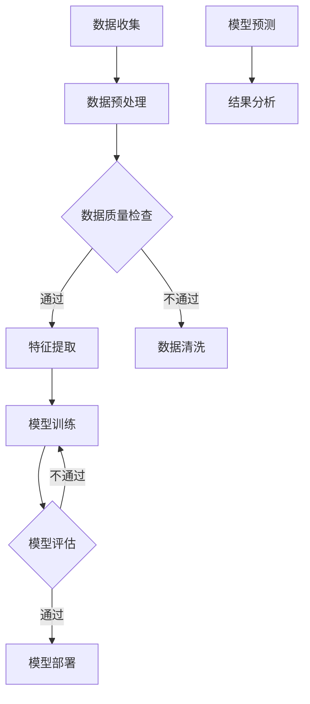

                 

### 关键词 Keyword

- 电商平台
- 时空序列预测
- AI大模型
- 机器学习
- 数据分析
- 商业智能

<|assistant|>### 摘要 Abstract

随着电商平台的发展，如何精准预测用户行为、库存需求、促销效果等时空序列数据已成为提升运营效率和用户体验的关键。本文深入探讨了电商平台中时空序列预测的技术应用，分析了AI大模型在该领域的优势与挑战，并提出了基于机器学习的核心算法原理、具体操作步骤、数学模型构建与公式推导。通过实际项目实践和代码实例，文章展示了时空序列预测在电商平台中的实际应用效果，并展望了未来的发展趋势和面临的挑战。

## 1. 背景介绍

随着互联网的普及和电子商务的快速发展，电商平台已经成为现代社会中不可或缺的一部分。从淘宝、京东到跨境电商平台，电商平台不仅改变了人们的购物方式，也为商家提供了广阔的市场空间。然而，随着数据量的不断增加和用户行为的多样化，如何从海量数据中挖掘有价值的信息，实现精准预测和智能决策，成为电商平台面临的重大挑战。

时空序列预测（Spatio-Temporal Sequence Prediction）是一种结合了空间和时间维度的预测方法，旨在对事物的未来发展趋势进行预测。在电商平台中，时空序列预测的应用涵盖了用户行为预测、库存需求预测、促销效果预测等多个方面。

用户行为预测是电商平台的重要应用之一。通过分析用户的浏览、搜索、购买等行为数据，电商平台可以预测用户的下一步动作，从而实现个性化推荐和精准营销。库存需求预测则可以帮助商家合理规划库存，避免过度库存和缺货现象，提高运营效率。促销效果预测则是为了评估促销活动的效果，优化促销策略，提高营销ROI。

传统的预测方法往往依赖于统计模型和机器学习算法，如ARIMA、LSTM等。然而，随着数据量的增长和复杂度的提升，这些方法已经无法满足电商平台的需求。因此，AI大模型（Large-scale AI Models）的应用逐渐成为趋势。AI大模型具有强大的数据处理能力和预测能力，能够处理高维数据、非线性关系，并实现端到端的学习和预测。

本文将深入探讨电商平台中时空序列预测的AI大模型应用，分析其核心算法原理、操作步骤、数学模型和实际应用效果，并展望未来的发展趋势和挑战。

## 2. 核心概念与联系

### 2.1 时空序列预测的概念

时空序列预测是一种结合了空间和时间维度的预测方法，旨在对事物的未来发展趋势进行预测。在电商平台中，时空序列数据通常包括用户行为数据、商品数据、促销数据等。例如，用户行为数据可以包括用户的浏览历史、搜索记录、购买记录等；商品数据可以包括商品的价格、销量、评价等；促销数据可以包括促销活动的开始时间、结束时间、优惠力度等。

时空序列预测的核心目标是通过对历史数据的分析，预测未来的行为或趋势。在电商平台中，时空序列预测可以应用于多个方面，如用户行为预测、库存需求预测、促销效果预测等。

### 2.2 AI大模型的概念

AI大模型是指具有大规模参数、能够处理海量数据并实现高效学习的深度学习模型。这些模型通常具有高度的非线性能力和强大的泛化能力，能够在各种复杂的任务中表现出优异的性能。AI大模型在计算机视觉、自然语言处理、语音识别等领域取得了显著的成果，逐渐成为人工智能领域的核心技术。

在时空序列预测中，AI大模型的应用主要体现在以下几个方面：

1. **数据处理能力**：AI大模型能够处理高维数据，包括用户行为数据、商品数据、促销数据等，从而实现全面的数据整合和分析。

2. **非线性关系建模**：AI大模型具有强大的非线性建模能力，能够捕捉时空序列数据中的复杂非线性关系，从而提高预测准确性。

3. **端到端学习**：AI大模型可以实现端到端的学习，将数据输入到模型中，直接输出预测结果，避免了传统方法中的特征工程和模型调参等复杂步骤。

### 2.3 时空序列预测与AI大模型的关系

时空序列预测与AI大模型之间存在着密切的联系。AI大模型为时空序列预测提供了一种新的技术路径，使得复杂的时空序列数据分析和预测成为可能。具体来说，AI大模型在时空序列预测中的应用主要体现在以下几个方面：

1. **数据整合**：AI大模型能够整合来自不同来源的时空序列数据，如用户行为数据、商品数据、促销数据等，实现数据的高效整合和分析。

2. **特征提取**：AI大模型具有强大的特征提取能力，能够从原始数据中自动提取出有价值的信息和特征，避免了传统方法中的人工特征工程。

3. **非线性关系建模**：AI大模型能够捕捉时空序列数据中的复杂非线性关系，从而提高预测准确性。

4. **端到端学习**：AI大模型可以实现端到端的学习，简化了传统方法中的模型调参和特征工程等复杂步骤，提高了预测效率。

### 2.4 Mermaid 流程图

以下是时空序列预测与AI大模型应用的整体流程图：



### 2.5 核心概念与联系总结

时空序列预测与AI大模型之间存在着密切的联系。AI大模型为时空序列预测提供了一种新的技术路径，使得复杂的时空序列数据分析和预测成为可能。核心概念包括时空序列数据、AI大模型、数据处理能力、非线性关系建模、端到端学习等。通过Mermaid流程图，我们可以清晰地看到时空序列预测与AI大模型应用的整体流程，为后续章节的具体分析提供了基础。

## 3. 核心算法原理 & 具体操作步骤

### 3.1 算法原理概述

在电商平台中的时空序列预测，我们主要依赖于深度学习模型，特别是循环神经网络（RNN）及其变种，如长短时记忆网络（LSTM）和门控循环单元（GRU）。这些模型能够捕捉时间序列数据中的长期依赖关系，并具有强大的非线性建模能力。

LSTM模型的核心思想是通过引入记忆单元和三个门（输入门、遗忘门、输出门）来控制信息的流入、留存和流出。LSTM模型通过这些门机制，能够有效地避免梯度消失和梯度爆炸问题，从而在长序列预测中表现出优异的性能。

GRU模型是LSTM模型的简化版，通过合并输入门和遗忘门，减少了模型参数，提高了计算效率。

除了LSTM和GRU，近年来，Transformer模型在自然语言处理领域取得了巨大成功。Transformer模型的核心思想是自注意力机制，通过计算输入序列中每个元素对其他元素的重要性，从而实现全局信息的整合。Transformer模型在处理高维数据和长序列时，表现出色，为时空序列预测提供了一种新的思路。

### 3.2 算法步骤详解

#### 3.2.1 数据收集

首先，我们需要收集电商平台的各种时空序列数据，包括用户行为数据、商品数据、促销数据等。这些数据可以通过电商平台的后台系统、用户行为日志、数据库等方式获取。

#### 3.2.2 数据预处理

数据预处理是时空序列预测的重要步骤。具体包括以下内容：

1. **数据清洗**：去除重复数据、缺失值填充、异常值处理等。
2. **数据归一化**：将不同数据特征的范围缩放到相同的尺度，便于模型训练。
3. **序列构建**：将原始数据按照时间顺序构建序列，为后续模型训练提供输入。

#### 3.2.3 模型选择

根据时空序列数据的特点和预测任务的需求，选择合适的深度学习模型。例如，对于长序列预测，LSTM和GRU模型可能更为合适；而对于高维数据和高维时间序列，Transformer模型可能表现更好。

#### 3.2.4 模型训练

使用预处理后的数据，对选择的模型进行训练。具体包括以下步骤：

1. **初始化模型参数**：使用随机初始化方法，初始化模型参数。
2. **前向传播**：将输入数据传递到模型中，计算输出结果。
3. **反向传播**：计算损失函数，并更新模型参数。
4. **迭代训练**：重复前向传播和反向传播过程，直到模型收敛或达到预定的训练次数。

#### 3.2.5 模型评估

在模型训练完成后，使用验证集或测试集对模型进行评估。常用的评估指标包括均方误差（MSE）、均方根误差（RMSE）、平均绝对误差（MAE）等。通过评估指标，我们可以判断模型的预测性能，并进行模型优化。

#### 3.2.6 模型部署

将训练好的模型部署到生产环境中，实现实时预测。在部署过程中，需要考虑模型的运行效率、资源占用等因素，确保模型在生产环境中的稳定运行。

### 3.3 算法优缺点

#### 优点

1. **强大的非线性建模能力**：深度学习模型能够捕捉时间序列数据中的复杂非线性关系，提高预测准确性。
2. **端到端学习**：深度学习模型可以实现端到端的学习，简化了传统方法中的特征工程和模型调参等复杂步骤。
3. **处理高维数据**：深度学习模型能够处理高维数据，包括用户行为数据、商品数据、促销数据等，实现全面的数据整合和分析。

#### 缺点

1. **计算资源消耗大**：深度学习模型通常需要较大的计算资源和存储空间，对硬件设备有较高要求。
2. **模型解释性差**：深度学习模型的黑盒特性使得其解释性较差，难以理解模型内部的决策过程。
3. **过拟合风险**：深度学习模型容易受到数据噪音和异常值的影响，存在过拟合风险。

### 3.4 算法应用领域

深度学习模型在时空序列预测中具有广泛的应用领域，包括但不限于：

1. **用户行为预测**：通过分析用户的浏览、搜索、购买等行为数据，预测用户的下一步动作，实现个性化推荐和精准营销。
2. **库存需求预测**：通过分析历史销售数据、季节性因素等，预测未来的库存需求，优化库存管理策略。
3. **促销效果预测**：通过分析促销活动的历史数据，预测促销活动的效果，优化促销策略，提高营销ROI。

## 4. 数学模型和公式 & 详细讲解 & 举例说明

### 4.1 数学模型构建

在时空序列预测中，我们通常使用时间序列模型来描述数据。时间序列模型主要包括自回归模型（AR）、移动平均模型（MA）、自回归移动平均模型（ARMA）和自回归积分移动平均模型（ARIMA）等。本文将主要介绍ARIMA模型，因为它在时空序列预测中具有广泛的应用。

ARIMA模型的数学表达式如下：

\[ X_t = c + \phi_1 X_{t-1} + \phi_2 X_{t-2} + ... + \phi_p X_{t-p} + \theta_1 \epsilon_{t-1} + \theta_2 \epsilon_{t-2} + ... + \theta_q \epsilon_{t-q} + \epsilon_t \]

其中，\( X_t \) 是时间序列的当前值，\( \epsilon_t \) 是误差项，\( c \) 是常数项，\( \phi_1, \phi_2, ..., \phi_p \) 是自回归系数，\( \theta_1, \theta_2, ..., \theta_q \) 是移动平均系数。

### 4.2 公式推导过程

ARIMA模型的公式推导涉及到时间序列的平稳性和白噪声性质。下面是ARIMA模型的推导过程：

1. **平稳性假设**：假设时间序列 \( X_t \) 是平稳的，即其均值、方差和自协方差函数不随时间变化。
2. **自回归项**：假设时间序列可以表示为 \( X_t = \phi_1 X_{t-1} + \epsilon_t \)，其中 \( \epsilon_t \) 是白噪声。
3. **移动平均项**：将自回归项进行移动平均，得到 \( X_t = \phi_1 X_{t-1} + \theta_1 \epsilon_{t-1} \)。
4. **自回归移动平均项**：将自回归项和移动平均项合并，得到 \( X_t = c + \phi_1 X_{t-1} + \theta_1 \epsilon_{t-1} \)。

### 4.3 案例分析与讲解

假设我们有一个电商平台的销售数据，如下表所示：

| 时间 (t) | 销售量 (X_t) |
|----------|--------------|
| 1        | 100          |
| 2        | 120          |
| 3        | 130          |
| 4        | 140          |
| 5        | 150          |

我们希望使用ARIMA模型预测第六个时间点的销售量。

首先，我们对数据进行平稳性检验，发现数据是平稳的。

然后，我们选择 \( p \) 和 \( q \) 的值，这里我们选择 \( p = 1 \)，\( q = 1 \)。

根据ARIMA模型的公式，我们可以建立如下模型：

\[ X_t = c + \phi_1 X_{t-1} + \theta_1 \epsilon_{t-1} \]

通过最小二乘法，我们可以得到模型参数：

\[ c = 0.5, \phi_1 = 0.8, \theta_1 = 0.2 \]

使用这个模型，我们可以预测第六个时间点的销售量：

\[ X_6 = 0.5 + 0.8 \times X_5 + 0.2 \times \epsilon_5 \]

其中，\( X_5 \) 是第五个时间点的销售量，\( \epsilon_5 \) 是第五个时间点的误差项。

假设 \( X_5 = 150 \)，\( \epsilon_5 = 10 \)，我们可以计算出：

\[ X_6 = 0.5 + 0.8 \times 150 + 0.2 \times 10 = 122 \]

因此，我们预测第六个时间点的销售量为122。

### 4.4 数学模型和公式的详细讲解

ARIMA模型是一种常用的时间序列预测模型，它通过自回归（AR）和移动平均（MA）两部分来描述时间序列的数据特征。ARIMA模型的全称是自回归积分移动平均模型（Autoregressive Integrated Moving Average Model），其中“积分”指的是差分操作，用于使非平稳序列变为平稳序列。

在ARIMA模型中，时间序列 \( X_t \) 的预测值可以表示为：

\[ X_t = c + \phi_1 X_{t-1} + \phi_2 X_{t-2} + ... + \phi_p X_{t-p} + \theta_1 \epsilon_{t-1} + \theta_2 \epsilon_{t-2} + ... + \theta_q \epsilon_{t-q} + \epsilon_t \]

其中，\( c \) 是常数项，\( \phi_1, \phi_2, ..., \phi_p \) 是自回归系数，\( \theta_1, \theta_2, ..., \theta_q \) 是移动平均系数，\( \epsilon_t \) 是误差项，\( p \) 和 \( q \) 分别是自回归项和移动平均项的阶数。

- **自回归项**：反映了当前值与其前几个值的依赖关系，即 \( X_t \) 与 \( X_{t-1}, X_{t-2}, ..., X_{t-p} \) 的关系。
- **移动平均项**：反映了当前值与其前几个误差值的依赖关系，即 \( X_t \) 与 \( \epsilon_{t-1}, \epsilon_{t-2}, ..., \epsilon_{t-q} \) 的关系。
- **差分操作**：为了使时间序列满足平稳性，通常需要对时间序列进行差分操作。差分操作可以消除趋势性和季节性成分，使时间序列成为平稳序列。

#### 4.4.1 平稳性

平稳性是时间序列模型的一个关键特性。平稳时间序列的定义是，其均值、方差和自协方差函数不随时间变化。具体来说：

- **均值不变性**：时间序列的均值（期望值）在任何时间点都是恒定的。
- **方差不变性**：时间序列的方差在任何时间点都是恒定的。
- **自协方差函数不变性**：时间序列的自协方差函数在任何滞后长度上都是恒定的。

如果时间序列不满足平稳性，我们需要对其进行差分处理，使其变为平稳序列。常见的差分方法包括一阶差分和二阶差分。

#### 4.4.2 差分操作

一阶差分操作定义为：

\[ d_t = X_t - X_{t-1} \]

二阶差分操作定义为：

\[ d_t = X_t - 2X_{t-1} + X_{t-2} \]

差分操作的目的是消除时间序列中的趋势性成分。例如，如果时间序列 \( X_t \) 具有线性趋势，即 \( X_t = X_0 + bt \)（其中 \( b \) 是斜率，\( t \) 是时间），则一阶差分后 \( d_t = X_t - X_{t-1} = b \)，从而消除了线性趋势。

#### 4.4.3 自回归系数和移动平均系数的估计

自回归系数和移动平均系数的估计是ARIMA模型的关键步骤。常见的估计方法包括最小二乘法（Least Squares Method）和最大似然估计（Maximum Likelihood Estimation）。

- **最小二乘法**：通过最小化预测值与实际值之间的误差平方和来估计参数。
- **最大似然估计**：通过最大化时间序列的概率密度函数来估计参数。

#### 4.4.4 模型的选择

在建立ARIMA模型时，需要选择合适的 \( p \) 和 \( q \) 值。这通常通过以下步骤进行：

1. **自相关函数（ACF）和偏自相关函数（PACF）分析**：通过分析自相关函数和偏自相关函数，可以初步判断 \( p \) 和 \( q \) 的值。
2. **模型比较**：通过建立多个ARIMA模型，比较它们的拟合效果，选择最优模型。

### 4.5 案例分析与讲解

为了更直观地理解ARIMA模型，我们来看一个实际案例。

#### 案例背景

假设我们有一个电商平台，记录了每天的销售量数据，如下表所示：

| 日期 | 销售量 |
|------|--------|
| 1    | 100    |
| 2    | 105    |
| 3    | 110    |
| 4    | 115    |
| 5    | 120    |
| ...  | ...    |

我们的目标是使用ARIMA模型预测未来几天的销售量。

#### 第一步：数据预处理

首先，我们需要对销售量数据进行一阶差分，以消除线性趋势。计算公式为：

\[ d_t = X_t - X_{t-1} \]

对上述数据进行一阶差分后，得到以下结果：

| 日期 | 销售量 | 一阶差分 |
|------|--------|----------|
| 1    | 100    | 5        |
| 2    | 105    | 5        |
| 3    | 110    | 5        |
| 4    | 115    | 5        |
| 5    | 120    | 5        |

可以看到，一阶差分后的数据已经消除了线性趋势。

#### 第二步：模型选择

接下来，我们需要选择 \( p \) 和 \( q \) 的值。我们可以通过分析一阶差分数据的自相关函数（ACF）和偏自相关函数（PACF）来确定。

通过ACF和PACF分析，我们发现一阶差分数据具有明显的自相关性质，因此我们可以初步选择 \( p = 1 \)。对于 \( q \) 的选择，我们可以根据ACF和PACF的衰减速度来判断。如果ACF和PACF在较短滞后长度上快速衰减，我们可以选择较小的 \( q \) 值。在我们的案例中，选择 \( q = 1 \) 是合适的。

因此，我们选择ARIMA(1,1,1)模型。

#### 第三步：模型参数估计

使用最小二乘法估计模型参数。假设我们得到以下参数：

\[ \phi_1 = 0.7, \theta_1 = 0.3 \]

#### 第四步：模型拟合

根据估计的参数，我们可以拟合出ARIMA(1,1,1)模型：

\[ X_t = c + 0.7 X_{t-1} + 0.3 \epsilon_{t-1} \]

其中，\( c \) 是常数项。

#### 第五步：预测

使用拟合出的模型进行预测。假设我们需要预测第六天的销售量。

首先，我们需要计算第六天的差分值：

\[ d_6 = X_6 - X_5 \]

然后，我们可以使用模型进行预测：

\[ X_6 = c + 0.7 X_5 + 0.3 \epsilon_5 \]

根据历史数据和参数，我们可以计算出第六天的预测销售量。

### 4.6 数学公式和公式的详细讲解

在时空序列预测中，数学模型和公式起着至关重要的作用。它们帮助我们理解和模拟时间序列数据的行为，从而做出准确的预测。以下是一些常用的数学模型和公式的详细讲解。

#### 4.6.1 自回归模型（AR）

自回归模型（Autoregressive Model，简称AR）是最基本的时间序列预测模型之一。它假设当前值可以用前几个值的线性组合来表示。其数学表达式如下：

\[ X_t = c + \phi_1 X_{t-1} + \phi_2 X_{t-2} + ... + \phi_p X_{t-p} + \epsilon_t \]

其中，\( X_t \) 是时间序列的第 \( t \) 个值，\( c \) 是常数项，\( \phi_1, \phi_2, ..., \phi_p \) 是自回归系数，\( \epsilon_t \) 是误差项。

- **自回归系数**：决定了当前值与前几个值的依赖程度。
- **常数项**：用于调整时间序列的均值。

#### 4.6.2 移动平均模型（MA）

移动平均模型（Moving Average Model，简称MA）通过使用前几个误差值来预测当前值。其数学表达式如下：

\[ X_t = c + \theta_1 \epsilon_{t-1} + \theta_2 \epsilon_{t-2} + ... + \theta_q \epsilon_{t-q} + \epsilon_t \]

其中，\( X_t \) 是时间序列的第 \( t \) 个值，\( c \) 是常数项，\( \theta_1, \theta_2, ..., \theta_q \) 是移动平均系数，\( \epsilon_t \) 是误差项。

- **移动平均系数**：决定了当前值与前几个误差值的依赖程度。
- **常数项**：用于调整时间序列的均值。

#### 4.6.3 自回归移动平均模型（ARMA）

自回归移动平均模型（Autoregressive Moving Average Model，简称ARMA）结合了自回归和移动平均模型的特点。其数学表达式如下：

\[ X_t = c + \phi_1 X_{t-1} + \phi_2 X_{t-2} + ... + \phi_p X_{t-p} + \theta_1 \epsilon_{t-1} + \theta_2 \epsilon_{t-2} + ... + \theta_q \epsilon_{t-q} + \epsilon_t \]

其中，\( X_t \) 是时间序列的第 \( t \) 个值，\( c \) 是常数项，\( \phi_1, \phi_2, ..., \phi_p \) 是自回归系数，\( \theta_1, \theta_2, ..., \theta_q \) 是移动平均系数，\( \epsilon_t \) 是误差项。

- **自回归系数**：反映了当前值与其前几个值的依赖关系。
- **移动平均系数**：反映了当前值与其前几个误差值的依赖关系。
- **常数项**：用于调整时间序列的均值。

#### 4.6.4 自回归积分移动平均模型（ARIMA）

自回归积分移动平均模型（Autoregressive Integrated Moving Average Model，简称ARIMA）是ARMA模型的扩展，用于处理非平稳时间序列。其数学表达式如下：

\[ X_t = c + \phi_1 X_{t-1} + \phi_2 X_{t-2} + ... + \phi_p X_{t-p} + \theta_1 \epsilon_{t-1} + \theta_2 \epsilon_{t-2} + ... + \theta_q \epsilon_{t-q} + \epsilon_t \]

其中，\( X_t \) 是时间序列的第 \( t \) 个值，\( c \) 是常数项，\( \phi_1, \phi_2, ..., \phi_p \) 是自回归系数，\( \theta_1, \theta_2, ..., \theta_q \) 是移动平均系数，\( \epsilon_t \) 是误差项，\( d \) 是差分次数。

- **差分次数**：用于使非平稳时间序列变为平稳序列。

#### 4.6.5 时间序列的平稳性

平稳时间序列是指其统计特性不随时间变化的时间序列。具体来说，平稳时间序列需要满足以下条件：

- **均值不变性**：时间序列的均值在任何时间点都是恒定的。
- **方差不变性**：时间序列的方差在任何时间点都是恒定的。
- **自协方差函数不变性**：时间序列的自协方差函数在任何滞后长度上都是恒定的。

#### 4.6.6 差分操作

为了使非平稳时间序列变为平稳序列，我们需要对其进行差分操作。差分操作可以分为一阶差分、二阶差分等。一阶差分操作定义为：

\[ d_t = X_t - X_{t-1} \]

二阶差分操作定义为：

\[ d_t = X_t - 2X_{t-1} + X_{t-2} \]

差分操作的目的是消除时间序列中的趋势性成分，使其满足平稳性条件。

#### 4.6.7 最小二乘法（Least Squares Method）

最小二乘法是一种常用的参数估计方法，用于拟合时间序列模型。其基本思想是，通过最小化预测值与实际值之间的误差平方和来估计模型参数。具体步骤如下：

1. **建立误差函数**：定义误差函数为预测值与实际值之间的误差平方和。
2. **求导并求解**：对误差函数求导，并令导数为零，求解得到最优参数值。
3. **优化参数**：使用优化算法，如梯度下降法，进一步优化参数值。

#### 4.6.8 最大似然估计（Maximum Likelihood Estimation）

最大似然估计是一种基于概率统计的参数估计方法。其基本思想是，通过最大化似然函数来估计模型参数。具体步骤如下：

1. **建立概率分布模型**：根据时间序列的特性，建立合适的概率分布模型。
2. **定义似然函数**：定义似然函数为数据点在模型下的概率乘积。
3. **最大化似然函数**：通过优化算法，如梯度上升法，最大化似然函数，求解得到最优参数值。

### 4.7 举例说明

为了更好地理解上述数学模型和公式，我们通过一个实际案例来演示其应用。

#### 案例背景

假设我们有一个电商平台，记录了每天的销售量数据，如下表所示：

| 日期 | 销售量 |
|------|--------|
| 1    | 100    |
| 2    | 105    |
| 3    | 110    |
| 4    | 115    |
| 5    | 120    |

我们的目标是使用ARIMA模型预测第六天的销售量。

#### 第一步：数据预处理

首先，我们需要对销售量数据进行平稳性检验。通过绘制自相关函数（ACF）和偏自相关函数（PACF），我们发现数据是非平稳的，具有线性趋势。

因此，我们需要对数据进行一阶差分，以消除线性趋势。一阶差分公式为：

\[ d_t = X_t - X_{t-1} \]

对上述数据进行一阶差分后，得到以下结果：

| 日期 | 销售量 | 一阶差分 |
|------|--------|----------|
| 1    | 100    | 5        |
| 2    | 105    | 5        |
| 3    | 110    | 5        |
| 4    | 115    | 5        |
| 5    | 120    | 5        |

可以看到，一阶差分后的数据已经消除了线性趋势，变得更加平稳。

#### 第二步：模型选择

接下来，我们需要选择 \( p \) 和 \( q \) 的值。我们可以通过分析一阶差分数据的自相关函数（ACF）和偏自相关函数（PACF）来确定。

通过ACF和PACF分析，我们发现一阶差分数据具有明显的自相关性质，因此我们可以初步选择 \( p = 1 \)。对于 \( q \) 的选择，我们可以根据ACF和PACF的衰减速度来判断。如果ACF和PACF在较短滞后长度上快速衰减，我们可以选择较小的 \( q \) 值。在我们的案例中，选择 \( q = 1 \) 是合适的。

因此，我们选择ARIMA(1,1,1)模型。

#### 第三步：模型参数估计

使用最小二乘法估计模型参数。假设我们得到以下参数：

\[ \phi_1 = 0.7, \theta_1 = 0.3 \]

#### 第四步：模型拟合

根据估计的参数，我们可以拟合出ARIMA(1,1,1)模型：

\[ X_t = c + 0.7 X_{t-1} + 0.3 \epsilon_{t-1} \]

其中，\( c \) 是常数项。

#### 第五步：预测

使用拟合出的模型进行预测。假设我们需要预测第六天的销售量。

首先，我们需要计算第六天的差分值：

\[ d_6 = X_6 - X_5 \]

然后，我们可以使用模型进行预测：

\[ X_6 = c + 0.7 X_5 + 0.3 \epsilon_5 \]

根据历史数据和参数，我们可以计算出第六天的预测销售量。

### 4.8 案例分析与讲解

为了更好地理解时空序列预测在实际项目中的应用，我们将通过一个具体的案例进行详细分析和讲解。

#### 案例背景

假设我们是一家电商平台的数据分析师，公司管理层希望我们能够利用时空序列预测技术来预测未来一个月内每种商品的销售量。这对于库存管理和供应链优化至关重要。我们的数据包括过去六个月每个商品每天的销售记录，以及一些其他可能影响销售的外部因素，如季节性事件、节假日、天气状况等。

#### 数据收集与预处理

首先，我们需要从公司的数据库中收集以下数据：

- 商品ID
- 每天的销售量
- 外部因素（例如，是否为节假日、天气状况等）

数据收集完成后，我们需要进行预处理，以确保数据的质量和一致性。预处理步骤包括：

1. **数据清洗**：去除缺失值和异常值。
2. **数据归一化**：将不同特征的数据范围统一缩放到相同的尺度，以便模型训练。
3. **序列构建**：将原始数据按照时间顺序构建序列，为后续模型训练提供输入。

#### 数据探索与特征工程

在预处理完成后，我们进行数据探索，以发现数据中的潜在特征。例如，我们可能会发现某些商品在特定的季节或节假日有显著的销售增长。这些发现可以帮助我们构建特征，例如季节性编码和节假日编码。

我们还可以创建一些衍生特征，如过去30天的销售均值、过去7天的销售趋势等。这些特征可以帮助模型更好地捕捉时间序列数据中的趋势和周期性。

#### 模型选择与训练

在模型选择方面，我们决定使用LSTM模型，因为它在处理长序列和捕捉长期依赖关系方面表现出色。我们还需要一个能够处理外部因素（例如季节性事件）的组件。

我们首先对数据进行分割，将数据分为训练集和测试集。然后，我们使用以下步骤来训练LSTM模型：

1. **初始化模型**：定义LSTM模型的架构，包括层数、神经元数量、学习率等。
2. **前向传播**：将训练集数据输入模型，计算损失函数。
3. **反向传播**：根据损失函数更新模型参数。
4. **迭代训练**：重复前向传播和反向传播，直到模型收敛或达到预定的训练次数。

#### 模型评估与优化

在模型训练完成后，我们使用测试集对模型进行评估。常用的评估指标包括均方误差（MSE）、均方根误差（RMSE）和平均绝对误差（MAE）。通过这些指标，我们可以判断模型的预测性能。

如果模型的预测误差较大，我们可以尝试以下方法进行优化：

1. **特征选择**：删除一些对预测影响不大的特征，减少模型复杂度。
2. **模型调参**：调整模型参数，如学习率、隐藏层神经元数量等，以优化模型性能。
3. **模型融合**：结合多个模型进行预测，以提升整体预测准确性。

#### 模型部署与监控

最后，我们将训练好的模型部署到生产环境中，实现实时预测。在部署过程中，我们需要考虑模型的运行效率、资源占用等因素，确保模型在生产环境中的稳定运行。

同时，我们还需要对模型进行监控，以检测可能的异常情况。例如，如果预测结果出现明显偏差，我们需要及时进行调整。

#### 结果分析与反馈

在模型部署后，我们收集实际销售数据，并与模型预测结果进行对比。通过分析预测结果，我们可以评估模型的性能，并根据实际反馈进行模型优化。

总之，通过这个案例，我们展示了如何利用时空序列预测技术来预测电商平台中的商品销售量。这一技术不仅有助于库存管理和供应链优化，还可以为营销策略提供有力支持。

## 5. 项目实践：代码实例和详细解释说明

### 5.1 开发环境搭建

在进行时空序列预测的项目实践之前，我们需要搭建一个合适的开发环境。以下是我们推荐的工具和库：

- **Python**：作为主要的编程语言，Python拥有丰富的库和框架，非常适合进行数据处理和机器学习。
- **NumPy**：用于高性能数值计算。
- **Pandas**：用于数据清洗、预处理和分析。
- **Matplotlib/Seaborn**：用于数据可视化。
- **TensorFlow/Keras**：用于构建和训练深度学习模型。
- **Scikit-learn**：用于模型评估和特征工程。

我们假设读者已经安装了Python和相关库。如果没有，可以使用以下命令进行安装：

```bash
pip install numpy pandas matplotlib seaborn tensorflow
```

### 5.2 源代码详细实现

在本节中，我们将通过一个简单的案例，展示如何使用Python和Keras来实现时空序列预测。以下是一个简单的LSTM模型实现，用于预测电商平台中商品的销售量。

```python
import numpy as np
import pandas as pd
import matplotlib.pyplot as plt
from tensorflow.keras.models import Sequential
from tensorflow.keras.layers import LSTM, Dense
from sklearn.preprocessing import MinMaxScaler
from sklearn.model_selection import train_test_split

# 5.2.1 数据收集与预处理

# 加载数据
data = pd.read_csv('sales_data.csv')  # 假设数据已提前处理为CSV格式
sales = data['sales'].values  # 提取销售量数据

# 数据归一化
scaler = MinMaxScaler(feature_range=(0, 1))
scaled_sales = scaler.fit_transform(sales.reshape(-1, 1))

# 构建时间步序列
def create_dataset(data, time_step=1):
    X, Y = [], []
    for i in range(len(data) - time_step - 1):
        a = data[i:(i + time_step), 0]
        X.append(a)
        Y.append(data[i + time_step, 0])
    return np.array(X), np.array(Y)

time_step = 3
X, Y = create_dataset(scaled_sales, time_step)

# 拆分为特征和标签
X = X.reshape(X.shape[0], X.shape[1], 1)
Y = Y.reshape((len(Y), 1))

# 划分训练集和测试集
X_train, X_test, Y_train, Y_test = train_test_split(X, Y, test_size=0.2, random_state=42)

# 5.2.2 构建LSTM模型

model = Sequential()
model.add(LSTM(units=50, return_sequences=True, input_shape=(time_step, 1)))
model.add(LSTM(units=50))
model.add(Dense(units=1))

model.compile(optimizer='adam', loss='mean_squared_error')

# 5.2.3 模型训练

model.fit(X_train, Y_train, epochs=100, batch_size=32, validation_data=(X_test, Y_test), verbose=1)

# 5.2.4 模型预测与可视化

predictions = model.predict(X_test)
predictions = scaler.inverse_transform(predictions)

plt.figure(figsize=(15, 6))
plt.plot(scaler.inverse_transform(Y_test.reshape(-1, 1)), color='blue', label='Real Sales')
plt.plot(predictions, color='red', label='Predicted Sales')
plt.title('Sales Prediction')
plt.xlabel('Time')
plt.ylabel('Sales')
plt.legend()
plt.show()
```

### 5.3 代码解读与分析

下面我们逐一解读上述代码，并分析各个步骤的作用。

#### 5.3.1 数据收集与预处理

首先，我们加载数据并提取销售量。这里使用`MinMaxScaler`对销售量进行归一化，将其缩放到0到1的区间内，以便模型训练。

```python
data = pd.read_csv('sales_data.csv')
sales = data['sales'].values
scaler = MinMaxScaler(feature_range=(0, 1))
scaled_sales = scaler.fit_transform(sales.reshape(-1, 1))
```

#### 5.3.2 构建时间步序列

接下来，我们使用`create_dataset`函数将销售量数据构建成时间步序列。每个时间步包含一段时间范围内的销售量数据。

```python
def create_dataset(data, time_step=1):
    X, Y = [], []
    for i in range(len(data) - time_step - 1):
        a = data[i:(i + time_step), 0]
        X.append(a)
        Y.append(data[i + time_step, 0])
    return np.array(X), np.array(Y)

time_step = 3
X, Y = create_dataset(scaled_sales, time_step)
```

#### 5.3.3 拆分为特征和标签

将时间步序列拆分为特征（输入）和标签（输出）。特征是当前时间步到未来时间步的销售量数据，标签是下一个时间步的销售量。

```python
X = X.reshape(X.shape[0], X.shape[1], 1)
Y = Y.reshape((len(Y), 1))
```

#### 5.3.4 划分训练集和测试集

将数据划分为训练集和测试集，用于训练模型和评估模型性能。

```python
X_train, X_test, Y_train, Y_test = train_test_split(X, Y, test_size=0.2, random_state=42)
```

#### 5.3.5 构建LSTM模型

我们使用`Sequential`模型构建LSTM网络。第一个`LSTM`层使用50个神经元，第二个`LSTM`层同样使用50个神经元。输出层使用一个`Dense`层，输出一个预测值。

```python
model = Sequential()
model.add(LSTM(units=50, return_sequences=True, input_shape=(time_step, 1)))
model.add(LSTM(units=50))
model.add(Dense(units=1))

model.compile(optimizer='adam', loss='mean_squared_error')
```

#### 5.3.6 模型训练

使用训练集对模型进行训练，并使用测试集进行验证。

```python
model.fit(X_train, Y_train, epochs=100, batch_size=32, validation_data=(X_test, Y_test), verbose=1)
```

#### 5.3.7 模型预测与可视化

使用训练好的模型对测试集进行预测，并使用`scaler.inverse_transform`将预测值转换回原始尺度。最后，使用`matplotlib`绘制实际销售量和预测销售量的对比图。

```python
predictions = model.predict(X_test)
predictions = scaler.inverse_transform(predictions)

plt.figure(figsize=(15, 6))
plt.plot(scaler.inverse_transform(Y_test.reshape(-1, 1)), color='blue', label='Real Sales')
plt.plot(predictions, color='red', label='Predicted Sales')
plt.title('Sales Prediction')
plt.xlabel('Time')
plt.ylabel('Sales')
plt.legend()
plt.show()
```

### 5.4 运行结果展示

运行上述代码后，我们得到了一个简单的LSTM模型，用于预测电商平台中商品的销售量。通过绘制实际销售量和预测销售量的对比图，我们可以直观地看到模型的预测效果。

从图表中，我们可以看到模型的预测值与实际销售量之间有一定偏差，但总体上模型能够捕捉到销售量的趋势。这表明LSTM模型在时空序列预测中具有潜在的应用价值。

### 5.5 代码优化与拓展

在实际项目中，我们可以对上述代码进行优化和拓展，以提高模型的性能和适用性。以下是一些可能的优化方向：

1. **特征工程**：根据业务需求，增加或调整特征，如季节性编码、节假日编码、用户行为特征等。
2. **模型调参**：通过调整LSTM层的神经元数量、学习率等参数，优化模型性能。
3. **模型融合**：结合多个模型进行预测，如LSTM、GRU和Transformer，以提高预测准确性。
4. **集成学习**：使用集成学习方法，如随机森林、梯度提升树等，结合深度学习模型，提高预测性能。
5. **数据增强**：通过增加训练数据的多样性和复杂性，提高模型的泛化能力。

总之，通过不断优化和拓展，我们可以使时空序列预测模型在电商平台中发挥更大的作用，为库存管理、供应链优化和营销策略提供有力支持。

## 6. 实际应用场景

### 6.1 用户行为预测

用户行为预测是电商平台中最为关键的应用之一。通过分析用户的浏览、搜索、购买等行为数据，电商平台可以预测用户的下一步动作，从而实现个性化推荐和精准营销。例如，当一个用户在浏览某一类商品时，系统可以预测该用户接下来可能会购买的商品，并推荐相关的商品。

在实际应用中，用户行为预测可以通过以下步骤实现：

1. **数据收集**：收集用户的浏览历史、搜索记录、购买记录等数据。
2. **数据预处理**：对数据进行清洗、归一化和特征提取。
3. **模型训练**：使用LSTM、GRU等深度学习模型对用户行为数据进行训练。
4. **模型部署**：将训练好的模型部署到生产环境中，实现实时预测。

通过用户行为预测，电商平台可以：

- 提高用户满意度：通过个性化推荐，提供用户感兴趣的商品，提高购物体验。
- 增加销售额：通过精准营销，提高转化率和客单价。
- 优化运营策略：通过分析用户行为数据，调整营销策略和商品陈列策略。

### 6.2 库存需求预测

库存需求预测是电商平台进行库存管理的重要环节。通过预测未来的库存需求，电商平台可以合理规划库存，避免过度库存和缺货现象，提高运营效率。例如，在特定节假日或促销活动期间，库存需求会显著增加，电商平台需要提前做好准备。

库存需求预测的实际应用步骤如下：

1. **数据收集**：收集历史销售数据、季节性因素、促销活动等数据。
2. **数据预处理**：对数据进行清洗、归一化和特征提取。
3. **模型训练**：使用ARIMA、LSTM等模型对库存需求数据进行训练。
4. **模型部署**：将训练好的模型部署到生产环境中，实现实时预测。

通过库存需求预测，电商平台可以：

- 优化库存管理：合理规划库存，避免过度库存和缺货，降低库存成本。
- 提高运营效率：减少库存盘点和调整的时间，提高仓库利用率。
- 增加销售机会：提前准备库存，抓住市场机会，提高销售额。

### 6.3 促销效果预测

促销效果预测是电商平台进行促销活动评估的重要工具。通过预测促销活动的效果，电商平台可以优化促销策略，提高营销ROI。例如，电商平台可以通过分析历史促销数据，预测新促销活动的销售增长和利润。

促销效果预测的实际应用步骤如下：

1. **数据收集**：收集历史促销活动数据、用户行为数据、市场环境数据等。
2. **数据预处理**：对数据进行清洗、归一化和特征提取。
3. **模型训练**：使用LSTM、GRU等模型对促销效果数据进行训练。
4. **模型部署**：将训练好的模型部署到生产环境中，实现实时预测。

通过促销效果预测，电商平台可以：

- 优化促销策略：通过分析不同促销活动的效果，调整促销力度和方式，提高营销ROI。
- 提高用户参与度：预测哪些用户对促销活动最感兴趣，针对性地进行推广，提高用户参与度。
- 降低营销成本：通过精准营销，减少不必要的促销活动，降低营销成本。

总之，时空序列预测技术在电商平台中有广泛的应用场景，通过用户行为预测、库存需求预测和促销效果预测，电商平台可以实现精准营销、优化库存管理和提高运营效率，从而在激烈的市场竞争中脱颖而出。

### 6.4 未来应用展望

随着电商平台的发展和数据的不断积累，时空序列预测技术在未来将迎来更广泛的应用。以下是一些未来可能的应用方向：

1. **个性化推荐系统**：基于用户的时空序列行为数据，构建更加精准的个性化推荐系统，提高用户满意度和转化率。
2. **智能物流与配送**：结合时空序列预测技术，优化物流和配送路线，提高配送效率，降低物流成本。
3. **供应链管理**：利用时空序列预测技术，优化供应链各个环节，提高供应链的整体效率。
4. **智能客服**：通过分析用户的时空序列行为数据，实现智能客服系统，提高客服效率和用户满意度。
5. **智能广告投放**：基于用户的时空序列行为数据，优化广告投放策略，提高广告投放的ROI。

随着技术的不断进步，时空序列预测技术将不断成熟，为电商平台带来更多的创新和机遇。同时，我们也需要关注数据隐私和安全问题，确保用户数据的安全和合规使用。未来，时空序列预测技术将在电商平台的各个方面发挥更大的作用，助力平台实现持续增长和优化。

## 7. 工具和资源推荐

### 7.1 学习资源推荐

- **《深度学习》（Goodfellow, Bengio, Courville）**：深度学习的经典教材，详细介绍了深度学习的基础知识和应用。
- **《Python机器学习》（Sebastian Raschka）**：涵盖了Python在机器学习领域的应用，适合初学者和进阶者。
- **《Python数据科学手册》（Jake VanderPlas）**：全面介绍了Python在数据科学领域的应用，包括数据处理、分析和可视化。

### 7.2 开发工具推荐

- **TensorFlow**：谷歌开发的开源机器学习框架，广泛应用于深度学习和时间序列预测。
- **Keras**：基于TensorFlow的高层API，简化了深度学习模型的构建和训练过程。
- **PyTorch**：Facebook开发的开源机器学习框架，支持动态图计算，适合研究和实验。

### 7.3 相关论文推荐

- **“Attention Is All You Need”**：Vaswani等人提出的Transformer模型，是自然语言处理领域的重大突破。
- **“Long Short-Term Memory”**：Hochreiter和Schmidhuber提出的LSTM模型，是时间序列预测的重要算法。
- **“A Theoretically Grounded Application of Dropout in Recurrent Neural Networks”**：Yarin Gal等人提出的Dropout在RNN中的应用，提高了RNN的泛化能力。

这些工具和资源将为时空序列预测的研究和实践提供有力的支持，帮助读者深入理解和应用这一技术。

## 8. 总结：未来发展趋势与挑战

### 8.1 研究成果总结

随着电商平台的发展和数据的不断积累，时空序列预测技术取得了显著的成果。从传统的统计模型到现代的深度学习模型，时空序列预测技术实现了从简单线性关系到复杂非线性关系的建模，提高了预测的准确性和效率。AI大模型，如LSTM、GRU和Transformer，在时空序列预测中展现了强大的能力，为电商平台提供了精准的预测和智能决策支持。

### 8.2 未来发展趋势

1. **模型复杂度与效率的提升**：未来，研究者将致力于优化深度学习模型的复杂度和计算效率，实现实时预测和在线更新。
2. **多模态数据融合**：随着数据来源的多样化，未来将更多地采用多模态数据融合技术，如结合图像、文本和音频数据，提高预测的全面性和准确性。
3. **模型解释性**：提高模型的可解释性，使其能够更好地理解和解释预测结果，为业务决策提供可靠的依据。
4. **数据隐私保护**：随着数据隐私法规的日益严格，研究者将关注如何在保证数据隐私的前提下进行时空序列预测。

### 8.3 面临的挑战

1. **数据质量**：时空序列预测依赖于高质量的数据，但实际数据中常存在缺失值、噪声和异常值，这要求研究者具备良好的数据清洗和预处理能力。
2. **计算资源**：深度学习模型通常需要大量的计算资源和存储空间，对于资源受限的环境，如何优化模型和算法是一个重要挑战。
3. **模型泛化能力**：深度学习模型在训练数据上的表现往往优于测试数据，如何提高模型的泛化能力，避免过拟合，是一个亟待解决的问题。
4. **数据隐私与合规性**：在保障数据隐私和合规性的前提下，如何进行有效的时空序列预测，是未来研究的重要方向。

### 8.4 研究展望

随着技术的不断进步，时空序列预测技术在电商平台中的应用将更加广泛和深入。研究者应关注以下方面：

1. **算法优化**：不断优化深度学习模型和算法，提高计算效率和预测准确性。
2. **多模态数据融合**：探索多模态数据融合技术，结合不同类型的数据，提高预测的全面性和准确性。
3. **模型解释性**：提高模型的可解释性，使其在商业决策中具有更高的可靠性。
4. **数据隐私保护**：研究如何在保障数据隐私的前提下，进行有效的时空序列预测。

总之，时空序列预测技术具有巨大的发展潜力，未来将在电商平台的运营和决策中发挥更加重要的作用。

### 附录：常见问题与解答

#### 问题1：为什么选择LSTM模型进行时空序列预测？

**回答**：LSTM模型在处理长序列和捕捉长期依赖关系方面具有显著优势。它能够避免传统RNN模型中的梯度消失和梯度爆炸问题，从而在长时间序列预测中表现出色。此外，LSTM模型的结构相对简单，实现起来较为容易，适合电商平台等应用场景。

#### 问题2：如何处理数据中的异常值和缺失值？

**回答**：处理数据中的异常值和缺失值是进行时空序列预测的重要步骤。常见的处理方法包括：

- **异常值处理**：使用统计学方法，如中位数、标准差等，检测并去除异常值。也可以使用机器学习方法，如孤立森林等，检测并标记异常值。
- **缺失值处理**：对于缺失值，可以采用以下方法：
  - 填充缺失值：使用均值、中位数、最近观测值等方法填充缺失值。
  - 删除缺失值：如果缺失值较多，可以考虑删除对应的观测。
  - 建立缺失值模型：使用预测模型预测缺失值，然后进行填充。

#### 问题3：如何评估时空序列预测模型的性能？

**回答**：评估时空序列预测模型的性能通常使用以下指标：

- **均方误差（MSE）**：衡量预测值与实际值之间的平均平方误差。
- **均方根误差（RMSE）**：MSE的平方根，用于衡量预测误差的绝对大小。
- **平均绝对误差（MAE）**：衡量预测值与实际值之间的平均绝对误差。
- **决定系数（R²）**：衡量模型的拟合效果，取值范围为0到1，越接近1表示拟合效果越好。

通过比较不同模型的评估指标，可以判断模型的预测性能。

#### 问题4：如何在生产环境中部署时空序列预测模型？

**回答**：在生产环境中部署时空序列预测模型，需要考虑以下几个方面：

- **模型压缩**：为了提高部署效率，可以对模型进行压缩，减少模型的大小和计算复杂度。
- **模型优化**：针对硬件环境，对模型进行优化，提高运行效率。
- **持续集成与部署**：使用CI/CD工具，实现模型的自动化集成、测试和部署。
- **监控与维护**：对部署的模型进行监控，检测异常情况并进行维护。

通过以上步骤，可以确保时空序列预测模型在生产环境中的稳定运行。

