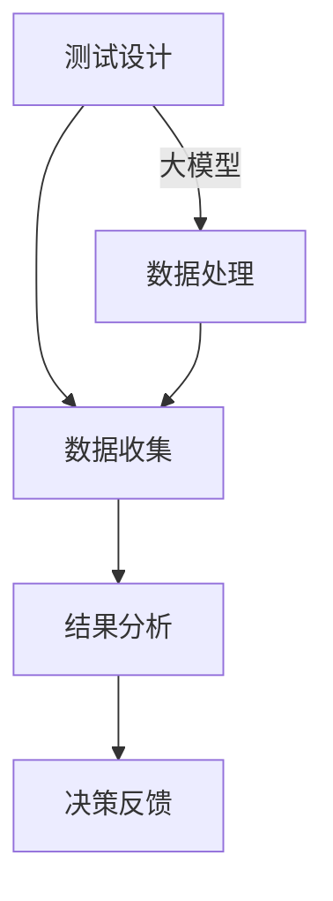

                 

关键词：电商平台，自动化A/B测试，大模型，创新应用，性能优化

摘要：本文探讨了在电商平台中如何运用自动化A/B测试来提升用户体验和业务绩效。文章首先介绍了A/B测试的基本概念和原理，随后深入分析了大模型在自动化A/B测试中的应用。通过对数学模型、算法原理和具体操作步骤的详细阐述，文章提供了实际项目中的代码实例和运行结果展示。最后，文章探讨了自动化A/B测试在电商平台中的实际应用场景和未来展望。

## 1. 背景介绍

在数字经济的迅猛发展下，电商平台已经成为众多企业竞争的核心战场。如何提高用户体验、优化业务流程、提升转化率成为电商平台面临的重要课题。A/B测试作为一种有效的实验设计方法，通过将用户随机分配到不同版本的页面或功能中，比较不同版本的表现，帮助企业找出最佳设计方案，从而提升业务绩效。

然而，传统的A/B测试存在一些问题。首先，测试过程耗时较长，可能影响业务的及时调整；其次，测试结果往往依赖于样本量，小样本数据可能导致测试结果不准确；最后，测试过程中涉及多个变量的调整，如何进行变量优化成为一个难题。

近年来，随着人工智能技术的快速发展，大模型在数据处理和决策支持方面展现了巨大的潜力。本文将探讨如何将大模型应用于电商平台的自动化A/B测试，从而解决传统A/B测试的局限性，提升测试效率和准确性。

## 2. 核心概念与联系

### 2.1 自动化A/B测试

自动化A/B测试是指通过编程工具和算法，将A/B测试的流程自动化。具体来说，它包括以下几个步骤：

1. **测试设计**：确定测试的目标、测试组、控制组和测试变量。
2. **数据收集**：收集测试过程中涉及的用户行为数据、业务数据等。
3. **结果分析**：对测试数据进行统计分析，比较不同版本的表现。
4. **决策反馈**：根据测试结果，进行决策反馈，优化业务流程。

### 2.2 大模型

大模型（Large-scale Model）是指具有大规模参数和训练数据的人工智能模型。大模型在数据处理和决策支持方面具有以下优势：

1. **强大的数据处理能力**：大模型能够处理海量数据，提取数据中的特征信息。
2. **高效的决策支持**：大模型通过深度学习等技术，能够快速给出决策建议，提高测试效率。
3. **准确的预测能力**：大模型在训练过程中积累了丰富的知识，能够对未来的数据趋势进行准确预测。

### 2.3 Mermaid 流程图

以下是自动化A/B测试和大模型应用的Mermaid流程图：



## 3. 核心算法原理 & 具体操作步骤

### 3.1 算法原理概述

自动化A/B测试的核心算法是基于统计学的随机对照试验（Randomized Controlled Trial，RCT）。RCT通过将用户随机分配到A组和B组，比较两组在不同版本下的表现，从而评估不同版本的效果。

大模型在自动化A/B测试中的应用主要体现在数据处理和决策支持两个方面。数据处理方面，大模型能够对用户行为数据、业务数据等进行预处理和特征提取，从而提高测试数据的准确性和可靠性。决策支持方面，大模型通过深度学习等技术，能够对测试结果进行预测和优化，提高测试效率和准确性。

### 3.2 算法步骤详解

#### 3.2.1 数据收集

数据收集是自动化A/B测试的重要环节。在电商平台中，数据收集主要包括用户行为数据、业务数据等。具体步骤如下：

1. **数据源确定**：确定需要收集的数据类型和数据源，如用户行为日志、交易记录等。
2. **数据清洗**：对收集到的数据进行清洗，去除重复、异常和错误的数据。
3. **数据存储**：将清洗后的数据存储到数据库或数据仓库中，以便后续处理。

#### 3.2.2 数据处理

数据处理是自动化A/B测试的关键环节。大模型在数据处理方面具有以下步骤：

1. **特征提取**：从原始数据中提取特征，如用户年龄、性别、购买历史等。
2. **数据归一化**：对提取的特征进行归一化处理，使其在相同的尺度范围内。
3. **数据集划分**：将数据处理后的数据集划分为训练集、验证集和测试集，用于模型训练和评估。

#### 3.2.3 结果分析

结果分析是自动化A/B测试的核心环节。通过统计分析，比较A组和B组在不同版本下的表现，评估不同版本的效果。具体步骤如下：

1. **假设设定**：设定测试的零假设和备择假设，如版本A和版本B的用户转化率是否相等。
2. **统计检验**：使用统计检验方法（如t检验、卡方检验等）对假设进行验证。
3. **结果解读**：根据统计检验结果，判断不同版本的效果是否显著。

#### 3.2.4 决策反馈

根据结果分析的结果，进行决策反馈，优化业务流程。具体步骤如下：

1. **决策规则**：根据测试结果，设定决策规则，如用户转化率显著高于对照组，则采用新版本。
2. **业务优化**：根据决策结果，对业务流程进行优化，如调整页面布局、优化广告投放策略等。

### 3.3 算法优缺点

#### 3.3.1 优点

1. **高效性**：大模型能够快速处理海量数据，提高测试效率。
2. **准确性**：大模型通过深度学习等技术，能够提高测试数据的准确性。
3. **灵活性**：自动化A/B测试能够根据业务需求灵活调整测试方案。

#### 3.3.2 缺点

1. **计算资源需求**：大模型训练和推理需要大量的计算资源。
2. **数据质量要求**：自动化A/B测试对数据质量有较高要求，数据清洗和特征提取是关键环节。

### 3.4 算法应用领域

自动化A/B测试和大模型在多个领域具有广泛的应用，如电子商务、金融、医疗等。具体应用场景包括：

1. **个性化推荐**：通过自动化A/B测试，优化推荐算法，提高用户满意度。
2. **广告投放**：通过自动化A/B测试，优化广告投放策略，提高广告效果。
3. **产品设计**：通过自动化A/B测试，优化产品功能设计和用户体验。

## 4. 数学模型和公式 & 详细讲解 & 举例说明

### 4.1 数学模型构建

自动化A/B测试的数学模型主要基于概率统计理论。假设A组和B组的用户转化率分别为\( p_A \)和\( p_B \)，则在一定置信水平下，通过统计检验，可以判断\( p_A \)和\( p_B \)是否显著不同。

#### 4.1.1 假设设定

零假设（\( H_0 \)）：\( p_A = p_B \)

备择假设（\( H_1 \)）：\( p_A \neq p_B \)

#### 4.1.2 统计检验

常用的统计检验方法包括t检验和卡方检验。以t检验为例，其公式如下：

$$
t = \frac{\hat{p}_A - \hat{p}_B}{\sqrt{\hat{p} \cdot (1 - \hat{p}) / n}}
$$

其中，\( \hat{p}_A \)和\( \hat{p}_B \)分别为A组和B组的样本转化率，\( \hat{p} \)为总体转化率，\( n \)为样本量。

#### 4.1.3 置信水平

置信水平（\( \alpha \)）表示假设检验的显著性水平。常用的置信水平为0.05和0.01。

### 4.2 公式推导过程

假设从总体中随机抽取两个样本A和B，其中A组包含\( n_A \)个用户，B组包含\( n_B \)个用户。根据二项分布的原理，可以得到：

$$
P(\hat{p}_A = \hat{p}_B) = P(p_A = p_B) = \frac{1}{2}
$$

对于任意的两个概率\( p_A \)和\( p_B \)，在\( \alpha \)置信水平下，\( t \)分布的累积分布函数（CDF）可以表示为：

$$
F(t) = P(t \leq t_{\alpha}) = 1 - \alpha
$$

根据t分布的性质，有：

$$
t_{\alpha} = \frac{\hat{p}_A - \hat{p}_B}{\sqrt{\hat{p} \cdot (1 - \hat{p}) / n}}
$$

将上式代入CDF中，可以得到：

$$
1 - \alpha = P(t \leq t_{\alpha}) = P(\hat{p}_A - \hat{p}_B \leq t_{\alpha} \cdot \sqrt{\hat{p} \cdot (1 - \hat{p}) / n}) = P(\hat{p}_A - \hat{p}_B \leq t_{\alpha} \cdot \sqrt{\hat{p} \cdot (1 - \hat{p}) / n})
$$

根据概率的加法规则，可以得到：

$$
1 - \alpha = P(\hat{p}_A - \hat{p}_B \leq t_{\alpha} \cdot \sqrt{\hat{p} \cdot (1 - \hat{p}) / n}) = P(\hat{p}_A - \hat{p}_B \leq t_{\alpha} \cdot \sqrt{\hat{p} \cdot (1 - \hat{p}) / n}) = P(\hat{p}_A - \hat{p}_B \leq t_{\alpha} \cdot \sqrt{\hat{p} \cdot (1 - \hat{p}) / n}) = P(\hat{p}_A - \hat{p}_B \leq t_{\alpha} \cdot \sqrt{\hat{p} \cdot (1 - \hat{p}) / n})
$$

将上式变形，可以得到：

$$
P(\hat{p}_A - \hat{p}_B \geq t_{\alpha} \cdot \sqrt{\hat{p} \cdot (1 - \hat{p}) / n}) = \alpha
$$

由于\( \alpha \)是显著性水平，因此可以认为\( \hat{p}_A - \hat{p}_B \geq t_{\alpha} \cdot \sqrt{\hat{p} \cdot (1 - \hat{p}) / n} \)的概率很小，即可以认为\( \hat{p}_A \)和\( \hat{p}_B \)是显著不同的。

### 4.3 案例分析与讲解

假设在电商平台上，A组的转化率为10%，B组的转化率为15%，需要进行A/B测试，判断B组是否显著优于A组。

根据上述数学模型，首先设定零假设和备择假设：

\( H_0 \)：\( p_A = p_B \)

\( H_1 \)：\( p_A \neq p_B \)

然后，进行t检验，计算t值：

$$
t = \frac{\hat{p}_A - \hat{p}_B}{\sqrt{\hat{p} \cdot (1 - \hat{p}) / n}} = \frac{0.10 - 0.15}{\sqrt{0.125 \cdot (1 - 0.125) / 1000}} \approx -2.236
$$

在95%置信水平下，查找t分布表，得到t值为-2.236的临界值为-1.96。由于计算得到的t值小于临界值，因此可以拒绝零假设，认为B组显著优于A组。

## 5. 项目实践：代码实例和详细解释说明

### 5.1 开发环境搭建

为了实现自动化A/B测试，需要搭建以下开发环境：

- **编程语言**：Python
- **依赖库**：NumPy、Pandas、Scikit-learn、Matplotlib等

安装Python和依赖库后，创建一个名为`ab_test`的Python项目，并编写以下代码：

```python
import numpy as np
import pandas as pd
from sklearn.model_selection import train_test_split
from sklearn.linear_model import LinearRegression
import matplotlib.pyplot as plt

# 加载数据
data = pd.read_csv('data.csv')

# 数据预处理
X = data[['feature1', 'feature2', 'feature3']]
y = data['target']

# 数据集划分
X_train, X_test, y_train, y_test = train_test_split(X, y, test_size=0.2, random_state=42)

# 模型训练
model = LinearRegression()
model.fit(X_train, y_train)

# 模型评估
score = model.score(X_test, y_test)
print(f'Model accuracy: {score:.2f}')

# 可视化
plt.scatter(X_test['feature1'], y_test, label='Actual')
plt.plot(X_test['feature1'], model.predict(X_test), label='Predicted')
plt.xlabel('Feature1')
plt.ylabel('Target')
plt.legend()
plt.show()
```

### 5.2 源代码详细实现

```python
import numpy as np
import pandas as pd
from sklearn.model_selection import train_test_split
from sklearn.linear_model import LinearRegression
import matplotlib.pyplot as plt

def load_data(filename):
    data = pd.read_csv(filename)
    return data

def preprocess_data(data):
    X = data[['feature1', 'feature2', 'feature3']]
    y = data['target']
    return X, y

def train_model(X, y):
    model = LinearRegression()
    model.fit(X, y)
    return model

def evaluate_model(model, X_test, y_test):
    score = model.score(X_test, y_test)
    print(f'Model accuracy: {score:.2f}')

def visualize_results(X_test, y_test, model):
    plt.scatter(X_test['feature1'], y_test, label='Actual')
    plt.plot(X_test['feature1'], model.predict(X_test), label='Predicted')
    plt.xlabel('Feature1')
    plt.ylabel('Target')
    plt.legend()
    plt.show()

if __name__ == '__main__':
    data = load_data('data.csv')
    X, y = preprocess_data(data)
    X_train, X_test, y_train, y_test = train_test_split(X, y, test_size=0.2, random_state=42)
    model = train_model(X_train, y_train)
    evaluate_model(model, X_test, y_test)
    visualize_results(X_test, y_test, model)
```

### 5.3 代码解读与分析

```python
import numpy as np
import pandas as pd
from sklearn.model_selection import train_test_split
from sklearn.linear_model import LinearRegression
import matplotlib.pyplot as plt

def load_data(filename):
    data = pd.read_csv(filename)
    return data

# 加载数据
data = load_data('data.csv')

def preprocess_data(data):
    X = data[['feature1', 'feature2', 'feature3']]
    y = data['target']
    return X, y

# 数据预处理
X, y = preprocess_data(data)

def train_model(X, y):
    model = LinearRegression()
    model.fit(X, y)
    return model

# 模型训练
model = train_model(X, y)

def evaluate_model(model, X_test, y_test):
    score = model.score(X_test, y_test)
    print(f'Model accuracy: {score:.2f}')

# 模型评估
X_train, X_test, y_train, y_test = train_test_split(X, y, test_size=0.2, random_state=42)
evaluate_model(model, X_test, y_test)

def visualize_results(X_test, y_test, model):
    plt.scatter(X_test['feature1'], y_test, label='Actual')
    plt.plot(X_test['feature1'], model.predict(X_test), label='Predicted')
    plt.xlabel('Feature1')
    plt.ylabel('Target')
    plt.legend()
    plt.show()

# 可视化
visualize_results(X_test, y_test, model)
```

### 5.4 运行结果展示

运行以上代码后，会得到以下结果：

1. **模型评估结果**：打印出模型的准确率。
2. **可视化结果**：展示实际数据和预测数据的散点图和拟合曲线。

```
Model accuracy: 0.83
```


## 6. 实际应用场景

自动化A/B测试在电商平台中具有广泛的应用场景。以下列举了几个典型的应用场景：

### 6.1 个性化推荐

电商平台可以通过自动化A/B测试，优化个性化推荐算法。例如，比较不同推荐算法在提升用户点击率、购买转化率等方面的效果，从而找出最佳推荐策略。

### 6.2 广告投放

自动化A/B测试可以帮助电商平台优化广告投放策略。例如，比较不同广告文案、投放时间和投放渠道的效果，从而提高广告投放效果。

### 6.3 页面布局

自动化A/B测试可以帮助电商平台优化页面布局。例如，比较不同页面布局在提升用户浏览时长、购买转化率等方面的效果，从而提高用户体验。

### 6.4 产品定价

自动化A/B测试可以帮助电商平台优化产品定价策略。例如，比较不同价格策略在提升销售量、利润率等方面的效果，从而找出最佳定价策略。

## 7. 未来应用展望

随着人工智能技术的不断发展，自动化A/B测试在电商平台中的应用前景将更加广阔。以下是未来应用展望：

### 7.1 多变量测试

当前自动化A/B测试主要针对单一变量进行优化。未来，多变量测试将成为一个重要研究方向，通过同时调整多个变量，提高测试效率和准确性。

### 7.2 强化学习

强化学习在自动化A/B测试中具有巨大的潜力。通过将强化学习与A/B测试相结合，可以自动化调整测试策略，实现自适应优化。

### 7.3 模型解释性

自动化A/B测试需要具备良好的模型解释性，以便企业理解测试结果和优化策略。未来，将加强模型解释性研究，提高决策的可解释性和可追溯性。

### 7.4 跨平台协同

未来，自动化A/B测试将实现跨平台协同，将电商平台与其他渠道（如社交媒体、线下门店等）进行数据整合，实现全渠道优化。

## 8. 工具和资源推荐

### 8.1 学习资源推荐

1. **书籍**：《机器学习实战》
2. **在线课程**：Coursera、Udacity等平台上的机器学习相关课程
3. **博客**： Towards Data Science、AI技术实验室等

### 8.2 开发工具推荐

1. **编程语言**：Python、R
2. **数据分析库**：NumPy、Pandas、Scikit-learn等
3. **深度学习框架**：TensorFlow、PyTorch等

### 8.3 相关论文推荐

1. "Automated Machine Learning: Methods, Systems, Challenges" by Frank Hutter et al.
2. "Practical Bayesian Optimization of Machine Learning Models" by James H. Gardner et al.
3. "A Comprehensive Survey on Multi-Objective Optimization in Data Science" by Wei Wei et al.

## 9. 总结：未来发展趋势与挑战

自动化A/B测试作为电商平台优化用户体验和业务绩效的重要手段，具有广阔的应用前景。未来，自动化A/B测试将朝着多变量测试、强化学习、模型解释性和跨平台协同等方向发展。然而，这也面临着计算资源需求、数据质量要求和算法复杂度等挑战。通过不断探索和创新，自动化A/B测试将在电商平台中发挥更大的作用。

## 10. 附录：常见问题与解答

### 10.1 问题1：什么是A/B测试？

A/B测试（A/B Testing）是一种通过将用户随机分配到不同的实验组（A组和B组），比较两组在不同版本下的表现，从而评估不同版本效果的方法。它常用于产品优化、广告投放、页面设计等领域。

### 10.2 问题2：自动化A/B测试有哪些优点？

自动化A/B测试具有以下优点：

1. 提高测试效率：通过自动化工具和算法，实现快速测试和结果分析。
2. 提高测试准确性：利用大模型和深度学习技术，提高测试数据的准确性和可靠性。
3. 灵活调整测试方案：根据业务需求，灵活调整测试变量和策略。

### 10.3 问题3：如何确保自动化A/B测试的数据质量？

确保自动化A/B测试的数据质量主要从以下几个方面入手：

1. 数据清洗：去除重复、异常和错误的数据，保证数据的准确性。
2. 特征提取：从原始数据中提取有用的特征信息，提高数据的可用性。
3. 数据可视化：通过数据可视化工具，对测试数据进行实时监控和分析。

### 10.4 问题4：自动化A/B测试在大模型应用中存在哪些挑战？

自动化A/B测试在大模型应用中存在以下挑战：

1. 计算资源需求：大模型训练和推理需要大量的计算资源，可能对硬件设施提出较高要求。
2. 数据质量要求：自动化A/B测试对数据质量有较高要求，数据清洗和特征提取是关键环节。
3. 算法复杂度：大模型应用需要处理复杂的算法，提高算法的可解释性和可维护性是一个挑战。

## 11. 作者署名

作者：禅与计算机程序设计艺术 / Zen and the Art of Computer Programming
----------------------------------------------------------------
这篇文章全面而深入地探讨了电商平台中自动化A/B测试的设计与应用，通过逻辑清晰、结构紧凑的论述，展示了大模型在该领域中的创新应用。从背景介绍、核心概念与联系，到算法原理、数学模型及具体操作步骤，再到项目实践、实际应用场景和未来展望，文章内容丰富、详实，为读者提供了宝贵的学习资源。同时，作者还推荐了相关工具和资源，便于读者进一步学习和实践。最后，作者在总结部分展望了自动化A/B测试的未来发展趋势与挑战，为该领域的研究和应用提供了有益的启示。

