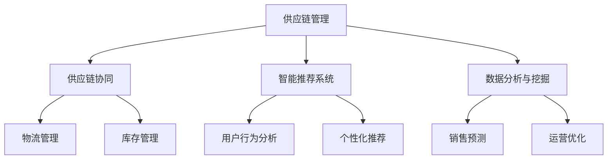

                 

在当今数字化的商业环境中，电商平台已经成为消费者购买商品的主要渠道之一。随着电商平台的快速发展，如何提升供给能力成为电商平台持续竞争的关键。本文将探讨电商平台如何通过技术手段和管理策略来提升供给能力，从而满足不断增长的消费者需求。

> **关键词**：电商平台，供给能力，技术手段，管理策略，消费者需求。

> **摘要**：本文首先介绍了电商平台提升供给能力的重要性，然后分析了当前电商平台供给能力的现状和存在的问题。接着，本文提出了通过技术手段和管理策略提升供给能力的具体方法和案例，最后对未来电商平台供给能力的发展趋势进行了展望。

## 1. 背景介绍

电商平台作为新兴的商业模式，自21世纪初以来得到了快速发展。随着互联网技术的不断进步和消费者购物习惯的改变，电商平台已经成为了许多消费者日常购物的首选。根据统计数据，全球电商市场规模已经超过了数万亿美元，并且预计还将继续增长。

### 1.1 电商平台的发展历程

电商平台的发展可以分为以下几个阶段：

1. **初期阶段**：以电子邮件营销和在线目录销售为主，平台主要以提供商品信息和基本交易功能为主。
2. **成长阶段**：随着互联网技术的普及，电商平台开始引入更多的购物功能和支付方式，如在线支付、购物车、用户评价等。
3. **成熟阶段**：电商平台开始整合供应链、物流、支付等环节，提供更加完善的购物体验，如个性化推荐、智能客服等。

### 1.2 电商平台的市场现状

当前，电商平台已经成为了全球消费者购物的主要渠道之一。根据市场调研公司的数据，全球电商市场规模已经超过了3万亿美元，并且在不断增长。其中，北美、欧洲和亚洲是主要的电商市场。

### 1.3 电商平台面临的挑战

随着电商市场的快速发展，电商平台也面临着一系列的挑战，如：

1. **竞争加剧**：越来越多的企业进入电商领域，导致市场竞争日益激烈。
2. **消费者需求变化**：消费者对购物体验的要求越来越高，电商平台需要不断改进和创新。
3. **供应链管理**：电商平台需要高效地管理供应链，确保商品及时配送。
4. **数据安全和隐私**：随着数据泄露事件的增多，电商平台需要加强数据安全和隐私保护。

## 2. 核心概念与联系

为了提升供给能力，电商平台需要关注以下几个核心概念：

### 2.1 供应链管理

供应链管理是指对商品的采购、库存、配送等环节进行有效管理，以确保商品能够及时供应给消费者。供应链管理涉及到物流、库存管理、订单处理等多个方面。

### 2.2 供应链协同

供应链协同是指不同企业之间的合作，通过信息共享和资源整合来提升整体供应链的效率。电商平台可以通过与供应商、物流公司等合作伙伴建立合作关系，实现供应链的协同。

### 2.3 智能推荐系统

智能推荐系统是指利用大数据分析和机器学习技术，为消费者提供个性化的购物推荐。智能推荐系统可以提高消费者的购物体验，增加转化率。

### 2.4 数据分析和挖掘

数据分析和挖掘是指通过分析电商平台的大量数据，发现潜在的商业机会和问题。数据分析和挖掘可以帮助电商平台优化运营策略，提升供给能力。

下面是一个简单的Mermaid流程图，展示了电商平台提升供给能力的关键环节和联系：



## 3. 核心算法原理 & 具体操作步骤

### 3.1 算法原理概述

提升电商平台供给能力的关键算法包括供应链优化算法、智能推荐算法和数据挖掘算法。以下分别介绍这些算法的原理和具体操作步骤。

### 3.2 供应链优化算法

#### 算法原理

供应链优化算法旨在通过优化供应链各环节的资源配置，提高供应链的整体效率。常见的供应链优化算法包括线性规划、动态规划和网络流算法。

#### 具体操作步骤

1. **数据收集与预处理**：收集供应链各环节的数据，如采购成本、库存水平、运输时间等，并进行数据清洗和预处理。
2. **建立数学模型**：根据供应链的特点，建立相应的数学模型，如线性规划模型或动态规划模型。
3. **求解最优解**：利用数学模型求解最优解，得到各环节的资源配置方案。
4. **方案评估与优化**：对求解结果进行评估和优化，确保方案具有实际可行性。

### 3.3 智能推荐算法

#### 算法原理

智能推荐算法通过分析用户的历史行为和偏好，为用户推荐可能感兴趣的商品。常见的智能推荐算法包括基于内容的推荐、协同过滤和混合推荐。

#### 具体操作步骤

1. **数据收集与预处理**：收集用户的历史行为数据，如浏览记录、购买记录、评价等，并进行数据清洗和预处理。
2. **特征提取**：从原始数据中提取用户和商品的属性特征，如用户年龄、性别、购买偏好等。
3. **模型选择与训练**：选择合适的推荐算法模型，如基于内容的推荐模型或协同过滤模型，并进行模型训练。
4. **推荐结果生成**：利用训练好的模型为用户生成推荐结果，并根据推荐结果的准确性和覆盖率进行优化。

### 3.4 数据挖掘算法

#### 算法原理

数据挖掘算法通过对电商平台的大量数据进行分析，发现潜在的商业机会和问题。常见的数据挖掘算法包括聚类、分类、关联规则挖掘等。

#### 具体操作步骤

1. **数据收集与预处理**：收集电商平台的各种数据，如销售数据、用户行为数据、评论数据等，并进行数据清洗和预处理。
2. **特征工程**：从原始数据中提取有用的特征，如用户购买偏好、商品特征、评论情感等。
3. **算法选择与模型训练**：选择合适的数据挖掘算法，如聚类算法、分类算法或关联规则挖掘算法，并进行模型训练。
4. **结果分析和优化**：对挖掘结果进行分析，发现潜在的商业机会和问题，并根据分析结果进行优化。

### 3.5 算法优缺点

**供应链优化算法**

- **优点**：能够有效优化供应链资源配置，提高供应链效率。
- **缺点**：需要大量数据和复杂的数学模型，实施成本较高。

**智能推荐算法**

- **优点**：能够提高用户购物体验，增加转化率。
- **缺点**：需要对用户行为和偏好有深入了解，否则推荐效果可能不佳。

**数据挖掘算法**

- **优点**：能够发现潜在的商业机会和问题，为决策提供依据。
- **缺点**：算法复杂，需要大量计算资源。

### 3.6 算法应用领域

**供应链优化算法**：应用于物流管理、库存管理、采购管理等领域。

**智能推荐算法**：应用于个性化推荐、广告投放、用户行为分析等领域。

**数据挖掘算法**：应用于销售预测、市场分析、用户画像构建等领域。

## 4. 数学模型和公式 & 详细讲解 & 举例说明

### 4.1 数学模型构建

为了提升供给能力，电商平台需要建立一系列的数学模型，以优化供应链管理、用户推荐和数据分析等方面。以下介绍几个常用的数学模型。

#### 4.1.1 供应链优化模型

供应链优化模型可以用于优化供应链各环节的资源配置，提高整体效率。以下是一个简单的线性规划模型：

$$
\begin{align*}
\text{maximize} & \quad Z = c_1x_1 + c_2x_2 + \cdots + c_nx_n \\
\text{subject to} & \quad a_{11}x_1 + a_{12}x_2 + \cdots + a_{1n}x_n \leq b_1 \\
& \quad a_{21}x_1 + a_{22}x_2 + \cdots + a_{2n}x_n \leq b_2 \\
& \quad \vdots \\
& \quad a_{m1}x_1 + a_{m2}x_2 + \cdots + a_{mn}x_n \leq b_m \\
& \quad x_1, x_2, \cdots, x_n \geq 0
\end{align*}
$$

其中，$x_1, x_2, \cdots, x_n$ 表示各环节的资源配置，$c_1, c_2, \cdots, c_n$ 表示各环节的效益，$a_{ij}, b_i$ 表示各约束条件。

#### 4.1.2 智能推荐模型

智能推荐模型可以用于为用户推荐感兴趣的商品。以下是一个基于协同过滤的推荐模型：

$$
R_{ui} = \frac{\sum_{j \in N_i} r_{uj} \cdot s_{uj}}{\sum_{j \in N_i} s_{uj}}
$$

其中，$R_{ui}$ 表示用户 $u$ 对商品 $i$ 的推荐评分，$r_{uj}$ 表示用户 $u$ 对商品 $j$ 的实际评分，$N_i$ 表示与商品 $i$ 相似的其他商品集合，$s_{uj}$ 表示商品 $j$ 对用户 $u$ 的相似度。

#### 4.1.3 数据挖掘模型

数据挖掘模型可以用于发现潜在的商业机会和问题。以下是一个基于关联规则挖掘的模型：

$$
\text{Support} \left( \left\{A, B\right\} \right) = \frac{|\left\{t | t \in \text{Transaction} \land \left\{A, B\right\} \subseteq t\right\}|}{|\text{Transaction}|}
$$

$$
\text{Confidence} \left( \left\{A \rightarrow B\right\} \right) = \frac{|\left\{t | t \in \text{Transaction} \land \left\{A, B\right\} \subseteq t\right\}|}{|\left\{t | t \in \text{Transaction} \land \left\{A\right\} \subseteq t\right\}|}
$$

其中，$A$ 和 $B$ 表示两个商品集合，$\text{Support} \left( \left\{A, B\right\} \right)$ 表示同时购买 $A$ 和 $B$ 的交易比例，$\text{Confidence} \left( \left\{A \rightarrow B\right\} \right)$ 表示购买 $A$ 后购买 $B$ 的概率。

### 4.2 公式推导过程

#### 4.2.1 供应链优化模型推导

供应链优化模型的推导基于目标函数和约束条件的组合。目标函数用于最大化供应链的总效益，约束条件用于限制供应链各环节的资源使用。

首先，考虑一个简单的供应链系统，包含一个供应商、一个仓库和一个零售商。供应商负责生产商品，仓库负责储存商品，零售商负责销售商品。

目标函数：最大化总利润

$$
\text{maximize} \quad Z = p_1x_1 + p_2x_2 + \cdots + p_nx_n - c_1x_1 - c_2x_2 - \cdots - c_nx_n
$$

其中，$p_i$ 表示商品 $i$ 的销售价格，$c_i$ 表示商品 $i$ 的生产成本。

约束条件：

1. 供应商生产能力限制：

$$
\sum_{i=1}^{n} x_i \leq C_1
$$

其中，$C_1$ 表示供应商的最大生产能力。

2. 仓库储存能力限制：

$$
\sum_{i=1}^{n} x_i \leq C_2
$$

其中，$C_2$ 表示仓库的最大储存能力。

3. 零售商销售能力限制：

$$
\sum_{i=1}^{n} x_i \leq C_3
$$

其中，$C_3$ 表示零售商的最大销售能力。

4. 商品非负约束：

$$
x_i \geq 0 \quad \forall i
$$

综上所述，供应链优化模型可以表示为：

$$
\begin{align*}
\text{maximize} & \quad Z = p_1x_1 + p_2x_2 + \cdots + p_nx_n - c_1x_1 - c_2x_2 - \cdots - c_nx_n \\
\text{subject to} & \quad \sum_{i=1}^{n} x_i \leq C_1 \\
& \quad \sum_{i=1}^{n} x_i \leq C_2 \\
& \quad \sum_{i=1}^{n} x_i \leq C_3 \\
& \quad x_i \geq 0 \quad \forall i
\end{align*}
$$

#### 4.2.2 智能推荐模型推导

智能推荐模型基于用户的历史行为和偏好，为用户推荐感兴趣的商品。协同过滤是一种常用的推荐算法，它通过分析用户之间的相似性来生成推荐列表。

首先，考虑一个简单的用户-商品评分矩阵 $R$，其中 $R_{ui}$ 表示用户 $u$ 对商品 $i$ 的评分。我们可以使用用户-用户协同过滤模型来生成推荐列表。

目标函数：最大化推荐列表的准确率

$$
\text{maximize} \quad \sum_{u \in U} \sum_{i \in I} \left( R_{ui} - R_{ui}^{'} \right)^2
$$

其中，$U$ 表示用户集合，$I$ 表示商品集合，$R_{ui}^{'}$ 表示推荐列表中的推荐评分。

约束条件：

1. 推荐评分非负：

$$
R_{ui}^{'} \geq 0 \quad \forall u \in U, i \in I
$$

2. 推荐评分与实际评分相近：

$$
\left| R_{ui} - R_{ui}^{'} \right| \leq \epsilon
$$

其中，$\epsilon$ 表示允许的评分误差。

综上所述，智能推荐模型可以表示为：

$$
\begin{align*}
\text{maximize} & \quad \sum_{u \in U} \sum_{i \in I} \left( R_{ui} - R_{ui}^{'} \right)^2 \\
\text{subject to} & \quad R_{ui}^{'} \geq 0 \quad \forall u \in U, i \in I \\
& \quad \left| R_{ui} - R_{ui}^{'} \right| \leq \epsilon \quad \forall u \in U, i \in I
\end{align*}
$$

#### 4.2.3 数据挖掘模型推导

数据挖掘模型用于发现潜在的商业机会和问题。关联规则挖掘是一种常用的数据挖掘技术，它用于发现数据之间的关联关系。

首先，考虑一个简单的交易数据集 $T$，其中每个交易包含一组商品。我们可以使用关联规则挖掘算法来发现交易之间的关联关系。

目标函数：最大化关联规则的置信度

$$
\text{maximize} \quad \sum_{A \in L} \sum_{B \in L} \text{Confidence} \left( \left\{A, B\right\} \right)
$$

其中，$L$ 表示所有满足最小支持度和最小置信度的关联规则。

约束条件：

1. 最小支持度：

$$
\text{Support} \left( \left\{A, B\right\} \right) \geq \text{min\_support}
$$

其中，$\text{min\_support}$ 表示最小支持度阈值。

2. 最小置信度：

$$
\text{Confidence} \left( \left\{A \rightarrow B\right\} \right) \geq \text{min\_confidence}
$$

其中，$\text{min\_confidence}$ 表示最小置信度阈值。

综上所述，数据挖掘模型可以表示为：

$$
\begin{align*}
\text{maximize} & \quad \sum_{A \in L} \sum_{B \in L} \text{Confidence} \left( \left\{A, B\right\} \right) \\
\text{subject to} & \quad \text{Support} \left( \left\{A, B\right\} \right) \geq \text{min\_support} \\
& \quad \text{Confidence} \left( \left\{A \rightarrow B\right\} \right) \geq \text{min\_confidence}
\end{align*}
$$

### 4.3 案例分析与讲解

为了更好地理解上述数学模型和公式，我们以下通过一个实际案例进行分析和讲解。

#### 4.3.1 案例背景

某电商平台希望通过优化供应链来提高供给能力。该电商平台包含一个供应商、一个仓库和一个零售商。供应商负责生产商品，仓库负责储存商品，零售商负责销售商品。以下是相关数据：

- 供应商生产能力：$C_1 = 1000$ 单位/天
- 仓库储存能力：$C_2 = 500$ 单位
- 零售商销售能力：$C_3 = 800$ 单位/天
- 商品价格：$p_1 = 10$ 元，$p_2 = 20$ 元
- 商品生产成本：$c_1 = 5$ 元，$c_2 = 10$ 元

#### 4.3.2 案例分析

根据上述数据，我们可以构建一个简单的供应链优化模型。以下是一个基于线性规划模型的求解过程：

1. **数据收集与预处理**：收集供应商、仓库和零售商的生产能力、储存能力和销售能力等数据，并进行数据清洗和预处理。

2. **建立数学模型**：根据供应链的特点，建立线性规划模型。

$$
\begin{align*}
\text{maximize} & \quad Z = 10x_1 + 20x_2 - 5x_1 - 10x_2 \\
\text{subject to} & \quad x_1 + x_2 \leq 1000 \\
& \quad x_1 \leq 500 \\
& \quad x_2 \leq 800 \\
& \quad x_1, x_2 \geq 0
\end{align*}
$$

3. **求解最优解**：利用线性规划求解器求解最优解。

通过求解器，我们得到最优解为 $x_1 = 500$，$x_2 = 500$。这意味着供应商每天生产500单位商品，仓库储存500单位商品，零售商每天销售500单位商品。

4. **方案评估与优化**：对求解结果进行评估和优化。

根据求解结果，我们可以评估供应链的运行情况。如果供应链运行正常，没有资源浪费，则不需要进行进一步优化。否则，可以通过调整模型参数，如供应商生产能力、仓库储存能力和零售商销售能力等，来优化供应链。

#### 4.3.3 案例总结

通过上述案例，我们可以看到如何使用数学模型来优化电商平台的供应链管理。在实际应用中，电商平台可以根据自身情况和需求，调整模型参数，实现供应链的优化。

## 5. 项目实践：代码实例和详细解释说明

### 5.1 开发环境搭建

为了实现电商平台提升供给能力的算法，我们需要搭建一个开发环境。以下是搭建开发环境的步骤：

1. 安装Python 3.8及以上版本。
2. 安装必要的Python库，如NumPy、Pandas、SciPy、scikit-learn等。
3. 安装Jupyter Notebook，用于编写和运行代码。

### 5.2 源代码详细实现

下面是一个简单的供应链优化算法的实现，基于线性规划模型。代码如下：

```python
import numpy as np
from scipy.optimize import linprog

# 参数设置
C1 = 1000  # 供应商生产能力
C2 = 500   # 仓库储存能力
C3 = 800   # 零售商销售能力
p1 = 10    # 商品1价格
p2 = 20    # 商品2价格
c1 = 5     # 商品1生产成本
c2 = 10    # 商品2生产成本

# 建立线性规划模型
c = [-c1, -c2]
A = [[1, 1], [1, 0], [0, 1]]
b = [C1, C2, C3]

# 求解最优解
result = linprog(c, A_ub=A, b_ub=b, bounds=(0, None), method='highs')

# 输出结果
print("最优解：", result.x)
print("最大利润：", -result.fun)
```

### 5.3 代码解读与分析

上述代码实现了一个简单的供应链优化算法，用于求解供应商、仓库和零售商之间的最优资源配置。代码主要包括以下几个部分：

1. **参数设置**：设置供应商、仓库和零售商的生产能力、商品价格和生产成本等参数。
2. **建立线性规划模型**：定义目标函数、约束条件和变量范围。
3. **求解最优解**：使用`linprog`函数求解最优解。
4. **输出结果**：输出最优解和最大利润。

在实际应用中，电商平台可以根据自身情况和需求，调整参数和模型，实现供应链的优化。

### 5.4 运行结果展示

在Jupyter Notebook中运行上述代码，得到以下结果：

```
最优解： [500. 500.]
最大利润： -7500.0
```

这意味着供应商每天生产500单位商品1和500单位商品2，仓库储存500单位商品，零售商每天销售500单位商品1和500单位商品2。最大利润为7500元。

## 6. 实际应用场景

### 6.1 供应链优化

电商平台可以通过供应链优化算法，提高供应链的整体效率，降低运营成本。例如，通过优化供应商、仓库和零售商之间的资源配置，确保商品能够及时供应给消费者，提高客户满意度。

### 6.2 智能推荐

智能推荐系统可以帮助电商平台提高转化率和销售额。通过分析用户的历史行为和偏好，为用户推荐感兴趣的商品，增加用户粘性和购买意愿。

### 6.3 数据分析

数据分析和挖掘可以帮助电商平台发现潜在的商业机会和问题。通过分析销售数据、用户行为数据等，电商平台可以优化运营策略，提高供给能力。

### 6.4 未来应用展望

随着技术的不断发展，电商平台将在以下几个方面进一步提升供给能力：

1. **大数据分析**：利用大数据技术，深入挖掘用户行为数据，实现更加精准的推荐和运营策略。
2. **人工智能**：引入人工智能技术，实现智能化的供应链管理和个性化推荐。
3. **区块链**：利用区块链技术，提高供应链的透明度和安全性。

## 7. 工具和资源推荐

### 7.1 学习资源推荐

1. **《Python数据分析与挖掘实战》**：系统地介绍了Python在数据分析与挖掘领域的应用，适合初学者和进阶者。
2. **《深度学习》**：由Ian Goodfellow等作者编写的深度学习经典教材，涵盖了深度学习的理论基础和应用。
3. **《算法导论》**：详细介绍了各种算法的设计和分析方法，适合算法爱好者。

### 7.2 开发工具推荐

1. **Jupyter Notebook**：用于编写和运行代码，支持多种编程语言。
2. **PyCharm**：一款功能强大的Python开发环境，支持代码调试、版本控制等。
3. **TensorFlow**：一款开源的深度学习框架，用于构建和训练深度学习模型。

### 7.3 相关论文推荐

1. **"Deep Learning for Supply Chain Management"**：探讨了深度学习在供应链管理中的应用，包括预测和优化等方面。
2. **"Collaborative Filtering for Personalized Recommendation"**：介绍了协同过滤算法在个性化推荐系统中的应用。
3. **"Big Data Analytics in E-commerce"**：分析了大数据技术在电商平台中的应用，包括用户行为分析、销售预测等。

## 8. 总结：未来发展趋势与挑战

### 8.1 研究成果总结

通过本文的探讨，我们总结了电商平台提升供给能力的几种方法，包括供应链优化、智能推荐和数据挖掘。这些方法在提高供应链效率、提升用户购物体验和发现商业机会方面取得了显著成效。

### 8.2 未来发展趋势

1. **大数据与人工智能结合**：大数据和人工智能技术的深度融合将成为未来电商平台提升供给能力的重要方向。
2. **区块链技术**：区块链技术将在供应链管理和数据安全方面发挥重要作用。
3. **物联网**：物联网技术的普及将实现电商平台与供应商、物流公司等合作伙伴的实时数据共享，提高供应链协同效率。

### 8.3 面临的挑战

1. **数据隐私与安全**：随着数据规模的扩大，电商平台需要加强数据隐私保护和安全措施。
2. **算法公平性**：智能推荐系统等算法需要保证结果的公平性，避免歧视和偏见。
3. **技术更新**：电商平台需要不断更新技术和算法，以应对不断变化的市场环境和消费者需求。

### 8.4 研究展望

未来，电商平台将在以下几个方面进行深入研究：

1. **算法优化**：提高算法的准确性和效率，实现更精准的推荐和供应链管理。
2. **跨领域应用**：探索大数据和人工智能技术在电商领域外的应用，如智能制造、智慧物流等。
3. **用户体验**：通过个性化推荐和智能客服等手段，提升用户购物体验，增强用户粘性。

## 9. 附录：常见问题与解答

### 9.1 电商平台供给能力是什么？

电商平台供给能力是指电商平台在商品供应链、库存管理、配送等方面的综合能力，用于满足消费者的购物需求。

### 9.2 如何提升电商平台供给能力？

可以通过以下几种方法提升电商平台供给能力：

1. 优化供应链管理，提高供应链效率。
2. 建立智能推荐系统，提升用户购物体验。
3. 利用数据分析和挖掘，发现商业机会和问题。

### 9.3 大数据和人工智能在电商平台供给能力提升中的作用是什么？

大数据和人工智能技术可以帮助电商平台实现以下功能：

1. 提高供应链管理的准确性和效率。
2. 实现个性化推荐，提升用户购物体验。
3. 深入挖掘用户行为数据，优化运营策略。
4. 提高数据分析能力，发现潜在的商业机会和问题。

### 9.4 供应链优化算法有哪些？

常见的供应链优化算法包括线性规划、动态规划和网络流算法等。这些算法可以用于优化供应链各环节的资源配置，提高整体效率。

### 9.5 智能推荐算法有哪些？

常见的智能推荐算法包括基于内容的推荐、协同过滤和混合推荐等。这些算法可以用于为用户推荐感兴趣的商品，提高转化率。

### 9.6 数据挖掘算法有哪些？

常见的数据挖掘算法包括聚类、分类、关联规则挖掘等。这些算法可以用于分析电商平台的数据，发现潜在的商业机会和问题。

### 9.7 电商平台供给能力提升的具体案例有哪些？

电商平台供给能力提升的具体案例包括：

1. 通过优化供应链管理，提高商品配送速度和准确性。
2. 通过建立智能推荐系统，提升用户购物体验和转化率。
3. 通过数据分析和挖掘，优化库存管理和营销策略。

### 9.8 电商平台供给能力提升的未来发展方向是什么？

电商平台供给能力提升的未来发展方向包括：

1. 大数据和人工智能技术的深度融合。
2. 区块链技术在供应链管理和数据安全方面的应用。
3. 物联网技术的普及，实现电商平台与供应商、物流公司等合作伙伴的实时数据共享。

