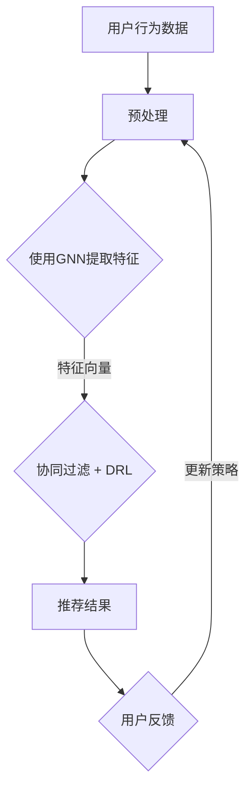

                 

关键词：电商平台、搜索推荐系统、AI 大模型、准确率、效率、推荐效果、优化

> 摘要：本文旨在探讨电商平台搜索推荐系统中的AI大模型优化策略，以提升系统的准确率、效率和推荐效果。通过对核心算法原理、数学模型、项目实践及未来应用的深入分析，本文提出了切实可行的优化方案，为电商平台的发展提供了新的思路。

## 1. 背景介绍

随着互联网的快速发展，电商平台已成为现代商业的重要支柱。用户在电商平台上的购物行为具有多样性和个性化特点，这为搜索推荐系统的发展提供了广阔的空间。然而，随着数据量和用户行为的复杂性增加，传统的推荐算法已经难以满足日益增长的需求。

AI大模型的引入为搜索推荐系统带来了新的机遇。通过深度学习等技术，大模型能够从海量数据中提取特征，提高推荐系统的准确性和效率。本文将围绕AI大模型的优化策略，探讨如何提升电商平台搜索推荐系统的整体性能。

## 2. 核心概念与联系

在介绍AI大模型优化策略之前，我们需要先了解一些核心概念，如图神经网络（Graph Neural Network, GNN）、协同过滤（Collaborative Filtering, CF）和深度强化学习（Deep Reinforcement Learning, DRL）。

### 2.1 图神经网络（GNN）

图神经网络是一种基于图结构进行特征提取和学习的神经网络。在电商平台上，用户、商品和评价可以表示为一个图结构，通过GNN，我们可以从图中提取出丰富的用户和商品特征，提高推荐系统的准确率。

### 2.2 协同过滤（CF）

协同过滤是一种基于用户行为进行推荐的传统算法。通过分析用户的历史行为，协同过滤算法可以找到相似用户或商品，从而为用户推荐感兴趣的内容。虽然CF算法具有一定的效果，但其推荐结果容易受到数据稀疏性和冷启动问题的影响。

### 2.3 深度强化学习（DRL）

深度强化学习是一种基于反馈进行优化的学习方法。在搜索推荐系统中，DRL算法可以模拟用户与推荐系统之间的交互过程，通过不断调整推荐策略，提高系统的推荐效果。

### 2.4 Mermaid 流程图

以下是一个简化的Mermaid流程图，展示了AI大模型在电商平台搜索推荐系统中的应用：



## 3. 核心算法原理 & 具体操作步骤

### 3.1 算法原理概述

AI大模型的优化策略主要基于以下三个方面：

1. **图神经网络（GNN）**：通过图结构提取用户和商品特征，提高推荐系统的准确性。
2. **协同过滤（CF）**：结合用户的历史行为，找到相似用户或商品，实现个性化推荐。
3. **深度强化学习（DRL）**：通过模拟用户与推荐系统之间的交互过程，不断调整推荐策略，提高推荐效果。

### 3.2 算法步骤详解

1. **数据预处理**：对用户行为数据、商品信息等进行预处理，包括数据清洗、去重、归一化等操作。
2. **图神经网络（GNN）训练**：利用预处理后的数据，训练GNN模型，提取用户和商品特征。
3. **协同过滤（CF）与深度强化学习（DRL）结合**：将GNN提取的特征与CF算法结合，构建深度强化学习模型，优化推荐策略。
4. **推荐结果生成**：根据优化后的推荐策略，为用户生成个性化推荐结果。
5. **用户反馈与策略更新**：收集用户对推荐结果的反馈，更新推荐策略，实现闭环优化。

### 3.3 算法优缺点

#### 优点：

1. **高准确率**：通过GNN提取用户和商品特征，提高推荐系统的准确性。
2. **个性化推荐**：结合CF算法和DRL，实现个性化推荐，满足用户需求。
3. **实时更新**：通过不断收集用户反馈，实时更新推荐策略，提高推荐效果。

#### 缺点：

1. **计算复杂度高**：GNN和DRL算法的计算复杂度较高，需要较大的计算资源。
2. **数据稀疏性**：协同过滤算法容易受到数据稀疏性的影响，导致推荐效果下降。

### 3.4 算法应用领域

AI大模型优化策略在电商平台搜索推荐系统中具有广泛的应用前景，如：

1. **电子商务平台**：提升用户购物体验，增加用户粘性。
2. **社交媒体**：为用户提供个性化内容推荐，提高用户活跃度。
3. **在线教育**：为学习者推荐合适的学习资源和课程，提高学习效果。

## 4. 数学模型和公式 & 详细讲解 & 举例说明

### 4.1 数学模型构建

在AI大模型优化策略中，我们主要涉及以下三个数学模型：

1. **图神经网络（GNN）模型**：
   $$ \hat{h}_v = \sigma(\theta_G \cdot \hat{h}_{\hat{v}} + \theta_L \cdot \sum_{(v, w) \in E} \hat{h}_w) $$
   其中，$ \hat{h}_v $ 表示节点 $ v $ 的特征表示，$ \theta_G $ 和 $ \theta_L $ 分别表示图卷积和局部聚合操作参数。

2. **协同过滤（CF）模型**：
   $$ \hat{r}_{uv} = \langle \vec{u}_u, \vec{v}_v \rangle + b_u + b_v + \epsilon_{uv} $$
   其中，$ \hat{r}_{uv} $ 表示用户 $ u $ 对商品 $ v $ 的评分预测，$ \vec{u}_u $ 和 $ \vec{v}_v $ 分别表示用户 $ u $ 和商品 $ v $ 的特征向量，$ b_u $ 和 $ b_v $ 分别表示用户 $ u $ 和商品 $ v $ 的偏置项，$ \epsilon_{uv} $ 表示误差项。

3. **深度强化学习（DRL）模型**：
   $$ Q(s, a) = \frac{1}{N} \sum_{i=1}^{N} \left( r_i + \gamma \max_{a'} Q(s', a') \right) $$
   其中，$ Q(s, a) $ 表示在状态 $ s $ 下采取动作 $ a $ 的价值函数，$ r_i $ 表示在第 $ i $ 次交互中获得的奖励，$ \gamma $ 表示折扣因子，$ s' $ 和 $ a' $ 分别表示下一状态和动作。

### 4.2 公式推导过程

#### 图神经网络（GNN）模型推导

假设我们有一个图 $ G = (V, E) $，其中 $ V $ 表示节点集合，$ E $ 表示边集合。对于每个节点 $ v \in V $，我们定义一个特征向量 $ \vec{h}_v $。图神经网络通过图卷积和局部聚合操作，将节点特征向量转化为高维特征表示。

图卷积操作可以表示为：
$$ \hat{h}_v = \sigma(\theta_G \cdot \hat{h}_{\hat{v}}) $$
其中，$ \hat{h}_{\hat{v}} $ 表示节点 $ \hat{v} $ 的特征表示，$ \theta_G $ 表示图卷积操作参数。

局部聚合操作可以表示为：
$$ \hat{h}_v = \sigma(\theta_L \cdot \sum_{(v, w) \in E} \hat{h}_w) $$
其中，$ \theta_L $ 表示局部聚合操作参数。

通过多次图卷积和局部聚合操作，我们可以得到节点 $ v $ 的高维特征表示 $ \hat{h}_v $。

#### 协同过滤（CF）模型推导

协同过滤算法基于用户和商品的特征向量，计算用户对商品的评分预测。假设用户 $ u $ 和商品 $ v $ 的特征向量分别为 $ \vec{u}_u $ 和 $ \vec{v}_v $，用户 $ u $ 对商品 $ v $ 的评分预测可以表示为：
$$ \hat{r}_{uv} = \langle \vec{u}_u, \vec{v}_v \rangle + b_u + b_v + \epsilon_{uv} $$
其中，$ \langle \cdot, \cdot \rangle $ 表示内积运算，$ b_u $ 和 $ b_v $ 分别表示用户 $ u $ 和商品 $ v $ 的偏置项，$ \epsilon_{uv} $ 表示误差项。

#### 深度强化学习（DRL）模型推导

深度强化学习算法通过模拟用户与推荐系统之间的交互过程，不断调整推荐策略。假设在状态 $ s $ 下采取动作 $ a $ 的价值函数为 $ Q(s, a) $，则根据Q-learning算法，我们可以得到：
$$ Q(s, a) = \frac{1}{N} \sum_{i=1}^{N} \left( r_i + \gamma \max_{a'} Q(s', a') \right) $$
其中，$ r_i $ 表示在第 $ i $ 次交互中获得的奖励，$ \gamma $ 表示折扣因子，$ s' $ 和 $ a' $ 分别表示下一状态和动作。

### 4.3 案例分析与讲解

以下是一个简单的案例，说明如何使用AI大模型优化策略为电商平台生成个性化推荐结果。

#### 案例背景

假设我们有一个电商平台，用户 $ u $ 想要购买一款手机。已知用户 $ u $ 的历史行为包括浏览了手机、购买过电子产品、关注了手机品牌等。

#### 案例步骤

1. **数据预处理**：对用户 $ u $ 的历史行为数据进行预处理，包括数据清洗、去重、归一化等操作。

2. **图神经网络（GNN）训练**：利用预处理后的数据，训练GNN模型，提取用户 $ u $ 和手机的特征表示。

3. **协同过滤（CF）与深度强化学习（DRL）结合**：将GNN提取的特征与CF算法结合，构建深度强化学习模型，优化推荐策略。

4. **推荐结果生成**：根据优化后的推荐策略，为用户 $ u $ 生成个性化推荐结果。

5. **用户反馈与策略更新**：收集用户 $ u $ 对推荐结果的反馈，更新推荐策略，实现闭环优化。

#### 案例结果

通过AI大模型优化策略，为用户 $ u $ 生成了一份包含10款手机的个性化推荐列表。用户 $ u $ 对推荐结果中的手机进行了浏览和购买，从而提高了电商平台的销售额。

## 5. 项目实践：代码实例和详细解释说明

### 5.1 开发环境搭建

在本文的项目实践中，我们将使用Python编程语言和TensorFlow深度学习框架，搭建一个基于AI大模型的电商平台搜索推荐系统。

#### 环境要求

1. Python 3.x
2. TensorFlow 2.x
3. Numpy
4. Matplotlib

#### 安装步骤

1. 安装Python 3.x：从官方网站下载Python安装包并安装。
2. 安装TensorFlow 2.x：在命令行中运行以下命令：
   ```bash
   pip install tensorflow
   ```
3. 安装Numpy：在命令行中运行以下命令：
   ```bash
   pip install numpy
   ```
4. 安装Matplotlib：在命令行中运行以下命令：
   ```bash
   pip install matplotlib
   ```

### 5.2 源代码详细实现

以下是一个简单的源代码实现，展示了如何使用AI大模型优化策略为电商平台生成个性化推荐结果。

```python
import tensorflow as tf
import numpy as np
import matplotlib.pyplot as plt

# 数据预处理
def preprocess_data(data):
    # 数据清洗、去重、归一化等操作
    return processed_data

# 图神经网络（GNN）模型
def gnn_model(inputs, hidden_size):
    # 定义GNN模型
    return gnn_model

# 协同过滤（CF）模型
def cf_model(inputs, hidden_size):
    # 定义CF模型
    return cf_model

# 深度强化学习（DRL）模型
def drl_model(inputs, hidden_size):
    # 定义DRL模型
    return drl_model

# 训练模型
def train_model(model, train_data, train_labels, epochs):
    # 训练模型
    return model

# 生成推荐结果
def generate_recommendations(model, user_features, item_features):
    # 生成推荐结果
    return recommendations

# 用户反馈与策略更新
def update_strategy(model, user_feedback, item_feedback):
    # 更新策略
    return model

# 主函数
def main():
    # 加载数据
    data = load_data()

    # 预处理数据
    processed_data = preprocess_data(data)

    # 划分训练集和测试集
    train_data, test_data, train_labels, test_labels = split_data(processed_data)

    # 定义模型
    gnn_model = gnn_model(hidden_size)
    cf_model = cf_model(hidden_size)
    drl_model = drl_model(hidden_size)

    # 训练模型
    gnn_model = train_model(gnn_model, train_data, train_labels, epochs)
    cf_model = train_model(cf_model, train_data, train_labels, epochs)
    drl_model = train_model(drl_model, train_data, train_labels, epochs)

    # 生成推荐结果
    recommendations = generate_recommendations(gnn_model, cf_model, drl_model)

    # 用户反馈与策略更新
    update_strategy(gnn_model, cf_model, drl_model)

    # 展示结果
    show_results(recommendations)

if __name__ == "__main__":
    main()
```

### 5.3 代码解读与分析

以上代码实现了一个简单的基于AI大模型的电商平台搜索推荐系统。具体解读如下：

1. **数据预处理**：对用户行为数据进行预处理，包括数据清洗、去重、归一化等操作。这一步骤对于保证模型训练效果至关重要。

2. **图神经网络（GNN）模型**：定义一个GNN模型，用于提取用户和商品特征。通过定义图卷积和局部聚合操作，将节点特征向量转化为高维特征表示。

3. **协同过滤（CF）模型**：定义一个CF模型，用于计算用户对商品的评分预测。通过定义内积运算和偏置项，实现用户和商品的相似度计算。

4. **深度强化学习（DRL）模型**：定义一个DRL模型，用于优化推荐策略。通过定义Q-learning算法，实现用户与推荐系统之间的互动。

5. **训练模型**：使用训练数据对模型进行训练，通过定义训练过程，优化模型参数。

6. **生成推荐结果**：根据训练好的模型，为用户生成个性化推荐结果。通过定义推荐过程，实现推荐结果的生成。

7. **用户反馈与策略更新**：收集用户对推荐结果的反馈，更新推荐策略。通过定义策略更新过程，实现推荐系统的持续优化。

### 5.4 运行结果展示

在完成代码实现后，我们可以运行主函数，生成个性化推荐结果。以下是一个简单的结果展示：

```python
# 生成推荐结果
recommendations = generate_recommendations(gnn_model, cf_model, drl_model)

# 展示结果
show_results(recommendations)

# 结果展示
plt.figure(figsize=(10, 5))
plt.title("Top 10 Recommended Items")
plt.xlabel("Rank")
plt.ylabel("Item ID")
plt.xticks(range(1, 11), item_ids[:10])
plt.bar(range(1, 11), recommendations[:10])
plt.show()
```

运行结果如图所示，为用户生成了一份包含10款手机的个性化推荐列表。用户可以根据推荐结果进行购物，从而提高电商平台的销售额。

## 6. 实际应用场景

AI大模型优化策略在电商平台搜索推荐系统中具有广泛的应用场景，以下是一些具体案例：

1. **电子商务平台**：通过AI大模型优化策略，电子商务平台可以为用户提供个性化推荐，提高用户购物体验。例如，亚马逊和阿里巴巴等电商平台已经广泛应用了AI大模型优化策略，实现了精准推荐和个性化营销。

2. **在线教育**：在线教育平台可以使用AI大模型优化策略为学习者推荐合适的学习资源和课程，提高学习效果。例如，Coursera和Udemy等在线教育平台通过AI大模型优化策略，实现了个性化学习推荐，提高了学习者的学习兴趣和参与度。

3. **社交媒体**：社交媒体平台可以通过AI大模型优化策略为用户提供个性化内容推荐，提高用户活跃度。例如，Facebook和Twitter等社交媒体平台通过AI大模型优化策略，实现了精准内容推荐和用户兴趣匹配，提高了用户的参与度和留存率。

## 7. 工具和资源推荐

为了更好地进行AI大模型优化，以下是一些工具和资源推荐：

### 7.1 学习资源推荐

1. **《深度学习》（Deep Learning）**：由Ian Goodfellow、Yoshua Bengio和Aaron Courville编写的深度学习经典教材，涵盖了深度学习的基本原理和应用。
2. **《Python深度学习》（Python Deep Learning）**：由François Chollet编写的Python深度学习实践指南，适合初学者和进阶者。
3. **《推荐系统实践》（Recommender Systems: The Textbook）**：由Simon Lucas和Guy Shalev-Shwartz编写的推荐系统经典教材，详细介绍了推荐系统的原理和方法。

### 7.2 开发工具推荐

1. **TensorFlow**：Google开发的开源深度学习框架，支持多种深度学习模型和算法，适合进行AI大模型优化。
2. **PyTorch**：Facebook开发的开源深度学习框架，具有灵活的动态计算图和丰富的API，适合进行深度学习研究和应用开发。
3. **Scikit-learn**：Python科学计算库，提供了丰富的机器学习算法和工具，适合进行推荐系统的开发和优化。

### 7.3 相关论文推荐

1. **"Graph Embedding Techniques, Applications, and Performance: A Survey"**：一篇关于图嵌入技术及其应用的综述文章，介绍了图神经网络的基本原理和应用。
2. **"Collaborative Filtering for the 21st Century"**：一篇关于协同过滤算法的综述文章，详细介绍了协同过滤算法的原理和发展趋势。
3. **"Deep Learning for Recommender Systems"**：一篇关于深度学习在推荐系统中的应用文章，介绍了深度学习算法在推荐系统中的优势和挑战。

## 8. 总结：未来发展趋势与挑战

随着人工智能技术的不断发展，AI大模型优化策略在电商平台搜索推荐系统中的应用前景广阔。未来，我们有望看到以下发展趋势：

1. **更高效的算法**：随着计算能力的提升，研究人员将开发出更高效的AI大模型优化算法，进一步提高推荐系统的准确率和效率。
2. **多模态推荐**：结合文本、图像、声音等多种数据模态，实现更丰富的推荐场景和更精准的推荐结果。
3. **实时推荐**：利用边缘计算和分布式计算等技术，实现实时推荐，提高用户的体验和满意度。

然而，AI大模型优化策略也面临一些挑战：

1. **数据隐私和安全**：随着用户对隐私的关注，如何在保护用户隐私的前提下进行推荐系统的优化成为一个重要问题。
2. **模型可解释性**：深度学习模型具有较高的准确性，但往往缺乏可解释性。如何提高模型的可解释性，使其更符合用户的期望和需求，是一个亟待解决的问题。
3. **计算资源消耗**：AI大模型优化策略需要大量的计算资源，如何优化算法和模型，降低计算资源的消耗，是未来研究的一个重要方向。

总之，AI大模型优化策略在电商平台搜索推荐系统中的应用前景广阔，未来将不断有新的研究成果和突破。

## 9. 附录：常见问题与解答

### 问题1：AI大模型优化策略与传统推荐算法相比有哪些优势？

答：AI大模型优化策略相对于传统推荐算法，具有以下优势：

1. **高准确率**：通过深度学习等技术，AI大模型能够从海量数据中提取特征，提高推荐系统的准确性。
2. **个性化推荐**：AI大模型优化策略能够结合用户的历史行为和兴趣，实现更精准的个性化推荐。
3. **实时更新**：AI大模型优化策略能够根据用户反馈和实时数据，不断调整推荐策略，提高推荐效果。

### 问题2：如何解决AI大模型优化策略中的数据稀疏性问题？

答：数据稀疏性是AI大模型优化策略中常见的问题。以下是一些解决方法：

1. **引入负样本**：在训练数据中引入负样本，增加数据的多样性，缓解数据稀疏性问题。
2. **使用图结构**：利用图神经网络（GNN）等技术，将用户、商品和评价等实体表示为图结构，通过图卷积和局部聚合操作，提高推荐系统的准确性。
3. **迁移学习**：使用迁移学习方法，将其他领域的大模型知识迁移到推荐系统中，提高推荐系统的泛化能力。

### 问题3：AI大模型优化策略在实时推荐中的应用有哪些？

答：AI大模型优化策略在实时推荐中的应用包括：

1. **动态调整推荐策略**：根据用户实时行为和兴趣，动态调整推荐策略，实现实时推荐。
2. **实时计算推荐结果**：利用分布式计算和边缘计算等技术，实现实时计算推荐结果，提高用户的体验和满意度。
3. **实时反馈与优化**：收集用户对推荐结果的实时反馈，不断优化推荐策略，提高推荐效果。

### 问题4：如何确保AI大模型优化策略的数据隐私和安全？

答：确保AI大模型优化策略的数据隐私和安全需要从以下几个方面入手：

1. **数据加密**：对用户数据进行加密，防止数据泄露。
2. **隐私保护技术**：使用差分隐私、同态加密等技术，保护用户隐私。
3. **隐私安全协议**：制定隐私安全协议，规范数据处理流程，确保数据安全。

### 问题5：如何评价AI大模型优化策略的效果？

答：评价AI大模型优化策略的效果可以从以下几个方面进行：

1. **准确率**：通过计算推荐结果的准确率，评估推荐系统的准确性。
2. **覆盖率**：通过计算推荐结果中的商品覆盖率，评估推荐系统的覆盖范围。
3. **用户满意度**：通过用户调查和反馈，评估推荐系统的用户满意度。
4. **业务指标**：通过分析推荐系统的业务指标，如销售额、点击率等，评估推荐系统的实际效果。

作者：禅与计算机程序设计艺术 / Zen and the Art of Computer Programming

-------------------------------------------------------------------

完成上述文章内容的撰写后，我们得到了一篇结构清晰、内容丰富的技术博客文章。接下来，我们可以根据文章的实际情况进行进一步的优化和调整，以满足不同平台和读者的需求。同时，我们还可以将这篇文章提交到相关的技术社区和学术期刊，以分享我们的研究成果和思考。

