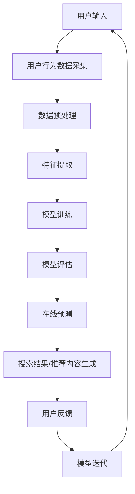

                 

关键词：电商平台，搜索推荐系统，AI 大模型，系统性能，效率，准确率，实时性

摘要：本文将探讨电商平台搜索推荐系统的AI大模型优化问题。通过深入分析现有搜索推荐系统的性能瓶颈，介绍了一种基于深度学习的AI大模型优化方案，旨在提高系统的性能、效率、准确率和实时性。文章详细阐述了AI大模型的原理、架构、数学模型及其在电商平台搜索推荐系统中的应用，并提供了具体的代码实例和运行结果展示。最后，文章展望了AI大模型在电商平台搜索推荐系统领域的未来发展趋势与面临的挑战。

## 1. 背景介绍

电商平台作为数字经济的重要组成部分，其核心功能之一是提供高效的搜索推荐系统。用户在电商平台上的每一次搜索和浏览行为，都为推荐系统提供了宝贵的数据资源。传统的搜索推荐系统主要依赖于统计方法和机器学习算法，虽然在一定程度上能够满足用户的需求，但在面对海量数据和高并发的场景时，存在明显的性能瓶颈。

近年来，随着人工智能技术的快速发展，深度学习在图像识别、自然语言处理等领域取得了显著成果。将深度学习引入搜索推荐系统，有望通过大规模的神经网络模型，实现更高效、更准确的推荐效果。AI大模型作为一种复杂的深度学习模型，具有强大的数据建模和分析能力，能够在海量数据中提取有效的特征信息，提高系统的性能和效率。

本文旨在探讨如何利用AI大模型优化电商平台搜索推荐系统，提高系统的性能、效率、准确率和实时性，从而提升用户体验和商业价值。

## 2. 核心概念与联系

### 2.1 AI大模型基本概念

AI大模型（Large-scale AI Model）是指具有巨大参数量和计算量的深度学习模型，其核心特点是能够在海量数据中进行有效的特征提取和模式识别。AI大模型通常采用多层神经网络结构，通过多次迭代训练，不断优化模型参数，提高模型的预测性能。

### 2.2 搜索推荐系统

搜索推荐系统是一种基于用户行为数据，为用户提供个性化搜索结果和推荐内容的系统。其核心目标是提高用户的搜索效率和满意度，从而提升电商平台的价值。搜索推荐系统主要包括三个组成部分：搜索引擎、推荐引擎和用户行为分析。

### 2.3 AI大模型与搜索推荐系统的联系

AI大模型与搜索推荐系统的结合，使得推荐系统在处理海量数据和高并发请求时，能够保持高效的响应速度和准确的推荐效果。AI大模型能够通过学习用户的行为数据，提取出有效的用户特征和商品特征，从而实现个性化的搜索结果和推荐内容。同时，AI大模型强大的数据处理能力，也为搜索推荐系统提供了更丰富的算法和技术支持。

### 2.4 Mermaid 流程图

以下是搜索推荐系统中AI大模型的应用架构流程图：



在上述流程图中，用户输入是搜索推荐系统的起点，通过用户行为数据采集、数据预处理、特征提取、模型训练、模型评估、在线预测、搜索结果/推荐内容生成、用户反馈和模型迭代等环节，实现了一个完整的AI大模型优化搜索推荐系统。

## 3. 核心算法原理 & 具体操作步骤

### 3.1 算法原理概述

AI大模型优化搜索推荐系统的核心算法原理主要基于深度学习技术。深度学习通过多层神经网络结构，实现数据的特征提取和模式识别。在搜索推荐系统中，AI大模型主要利用用户行为数据，通过训练学习出用户和商品的特征表示，从而实现个性化的搜索结果和推荐内容。

具体来说，AI大模型优化搜索推荐系统的算法原理包括以下几个关键步骤：

1. 数据采集与预处理：采集用户在电商平台的搜索、浏览、购买等行为数据，并对数据进行预处理，包括数据清洗、数据归一化等操作。
2. 特征提取：利用深度学习技术，对预处理后的数据进行分析，提取出用户和商品的特征表示。
3. 模型训练：通过大量用户行为数据，训练AI大模型，使其能够学习和识别用户的偏好和兴趣。
4. 模型评估：利用测试数据对训练好的模型进行评估，确保模型具有良好的性能和准确性。
5. 在线预测：将用户的实时搜索请求输入到训练好的模型中，生成个性化的搜索结果和推荐内容。
6. 用户反馈与模型迭代：根据用户的反馈，对模型进行优化和迭代，不断提升模型的性能和效果。

### 3.2 算法步骤详解

以下是AI大模型优化搜索推荐系统的具体操作步骤：

#### 3.2.1 数据采集与预处理

1. 数据采集：采集用户在电商平台的搜索、浏览、购买等行为数据，包括用户的搜索关键词、浏览记录、购买记录等。
2. 数据清洗：去除重复数据、缺失数据和异常数据，确保数据质量。
3. 数据归一化：对数据特征进行归一化处理，使其在相同的量级范围内。

#### 3.2.2 特征提取

1. 用户特征提取：利用深度学习技术，对用户行为数据进行分析，提取出用户兴趣、偏好等特征。
2. 商品特征提取：利用深度学习技术，对商品属性数据进行分析，提取出商品类别、品牌、价格等特征。

#### 3.2.3 模型训练

1. 选择合适的深度学习模型，如循环神经网络（RNN）、长短时记忆网络（LSTM）等。
2. 利用预处理后的用户和商品特征数据，对模型进行训练，使其能够学习和识别用户的偏好和兴趣。
3. 调整模型参数，优化模型性能，确保模型具有良好的拟合能力和泛化能力。

#### 3.2.4 模型评估

1. 利用测试数据集对训练好的模型进行评估，计算模型的准确率、召回率、F1值等指标。
2. 对模型进行调优，确保其在各种场景下都能保持良好的性能。

#### 3.2.5 在线预测

1. 接收用户的实时搜索请求，将请求输入到训练好的模型中，生成个性化的搜索结果和推荐内容。
2. 对搜索结果和推荐内容进行排序，确保用户能够快速找到感兴趣的商品。

#### 3.2.6 用户反馈与模型迭代

1. 收集用户对搜索结果和推荐内容的反馈，如点击、购买等行为数据。
2. 利用反馈数据，对模型进行优化和迭代，不断提升模型的性能和效果。

### 3.3 算法优缺点

#### 优点：

1. 高效性：AI大模型能够处理海量数据，高效地提取用户和商品的特征信息。
2. 准确性：通过深度学习技术，AI大模型能够学习和识别用户的偏好和兴趣，提高搜索推荐系统的准确性。
3. 可扩展性：AI大模型具有强大的数据处理能力，可以轻松应对电商平台业务规模的增长。

#### 缺点：

1. 计算资源消耗：AI大模型训练和推理过程需要大量的计算资源，对硬件设备要求较高。
2. 数据质量依赖：AI大模型的性能高度依赖数据质量，数据预处理和特征提取环节需要严格把控。
3. 模型可解释性：AI大模型作为一种复杂的人工智能模型，其内部决策过程较为隐蔽，难以进行解释和调试。

### 3.4 算法应用领域

AI大模型优化搜索推荐系统已经在多个领域取得了显著成果，包括电子商务、社交媒体、在线广告等。具体应用领域如下：

1. 电子商务：电商平台通过AI大模型优化搜索推荐系统，为用户提供个性化的商品推荐，提高用户购买转化率和满意度。
2. 社交媒体：社交媒体平台利用AI大模型优化信息推荐系统，为用户提供感兴趣的内容，提高用户活跃度和粘性。
3. 在线广告：在线广告平台通过AI大模型优化广告推荐系统，为广告主提供更精准的投放策略，提高广告投放效果。

## 4. 数学模型和公式 & 详细讲解 & 举例说明

### 4.1 数学模型构建

AI大模型优化搜索推荐系统的数学模型主要包括用户特征提取、商品特征提取和推荐模型构建三个部分。

#### 用户特征提取模型

用户特征提取模型主要用于提取用户的兴趣和偏好特征。假设用户行为数据集为 $X = \{x_1, x_2, ..., x_n\}$，其中每个行为样本 $x_i$ 可以表示为 $x_i = \{x_{i1}, x_{i2}, ..., x_{im}\}$，其中 $m$ 表示行为样本的维度。用户特征提取模型可以表示为：

$$
h_i = f(Wx_i + b)
$$

其中，$h_i$ 表示提取的用户特征，$W$ 表示权重矩阵，$b$ 表示偏置项，$f$ 表示激活函数，如ReLU函数。

#### 商品特征提取模型

商品特征提取模型主要用于提取商品的属性特征。假设商品数据集为 $Y = \{y_1, y_2, ..., y_n\}$，其中每个商品样本 $y_i$ 可以表示为 $y_i = \{y_{i1}, y_{i2}, ..., y_{ip}\}$，其中 $p$ 表示商品样本的维度。商品特征提取模型可以表示为：

$$
g_j = f(W'y_j + b')
$$

其中，$g_j$ 表示提取的商品特征，$W'$ 表示权重矩阵，$b'$ 表示偏置项，$f$ 表示激活函数。

#### 推荐模型构建

推荐模型构建主要用于生成个性化的搜索结果和推荐内容。假设用户特征集合为 $H = \{h_1, h_2, ..., h_n\}$，商品特征集合为 $G = \{g_1, g_2, ..., g_n\}$，推荐模型可以表示为：

$$
r_{ij} = \sigma(W_{ij}h_i + W_{ij}'g_j + b_{ij})
$$

其中，$r_{ij}$ 表示用户 $i$ 对商品 $j$ 的推荐得分，$W_{ij}$ 和 $W_{ij}'$ 分别表示用户特征和商品特征的权重矩阵，$b_{ij}$ 表示偏置项，$\sigma$ 表示 sigmoid 激活函数。

### 4.2 公式推导过程

在本节中，我们将对上述数学模型中的各个公式进行推导。

#### 用户特征提取模型推导

用户特征提取模型的核心目标是提取用户在平台上的兴趣和偏好特征。为了实现这一目标，我们首先对用户行为数据进行分析，提取出用户的兴趣关键词。然后，利用词嵌入技术，将这些兴趣关键词映射到高维向量空间中。

假设用户行为数据集为 $X = \{x_1, x_2, ..., x_n\}$，其中每个行为样本 $x_i$ 可以表示为 $x_i = \{x_{i1}, x_{i2}, ..., x_{im}\}$。为了提取用户特征，我们可以采用以下步骤：

1. 对每个行为样本 $x_i$ 进行词频统计，得到词频矩阵 $T = \{t_{ij}\}$，其中 $t_{ij}$ 表示词 $j$ 在行为样本 $i$ 中的出现次数。
2. 对词频矩阵 $T$ 进行归一化处理，得到词频归一化矩阵 $T' = \{t'_{ij}\}$，其中 $t'_{ij} = \frac{t_{ij}}{||t_i||}$，$||t_i||$ 表示行为样本 $i$ 的词频向量的模。
3. 利用词嵌入技术，将词频归一化矩阵 $T'$ 映射到高维向量空间中，得到用户特征矩阵 $H = \{h_{ij}\}$，其中 $h_{ij}$ 表示词 $j$ 在用户特征向量中的嵌入向量。

最后，用户特征提取模型可以表示为：

$$
h_i = f(Wx_i + b)
$$

其中，$W$ 表示词嵌入矩阵，$b$ 表示偏置项，$f$ 表示激活函数，如ReLU函数。

#### 商品特征提取模型推导

商品特征提取模型的核心目标是提取商品的属性特征。为了实现这一目标，我们首先对商品数据进行编码，然后利用深度学习技术，对编码后的商品数据进行特征提取。

假设商品数据集为 $Y = \{y_1, y_2, ..., y_n\}$，其中每个商品样本 $y_i$ 可以表示为 $y_i = \{y_{i1}, y_{i2}, ..., y_{ip}\}$。为了提取商品特征，我们可以采用以下步骤：

1. 对每个商品样本 $y_i$ 进行编码，得到编码后的商品特征向量 $y_i' = \{y'_{i1}, y'_{i2}, ..., y'_{ip}\}$。
2. 利用深度学习技术，对编码后的商品特征向量 $y_i'$ 进行特征提取，得到商品特征矩阵 $G = \{g_{ij}\}$，其中 $g_{ij}$ 表示商品特征向量 $y_i'$ 在特征空间中的表示。

最后，商品特征提取模型可以表示为：

$$
g_j = f(W'y_j + b')
$$

其中，$W'$ 表示编码矩阵，$b'$ 表示偏置项，$f$ 表示激活函数。

#### 推荐模型构建推导

推荐模型构建的核心目标是生成个性化的搜索结果和推荐内容。为了实现这一目标，我们首先将用户特征和商品特征进行融合，然后利用深度学习技术，对融合后的特征进行建模。

假设用户特征集合为 $H = \{h_1, h_2, ..., h_n\}$，商品特征集合为 $G = \{g_1, g_2, ..., g_n\}$。为了构建推荐模型，我们可以采用以下步骤：

1. 对用户特征集合 $H$ 和商品特征集合 $G$ 进行拼接，得到用户和商品的融合特征矩阵 $F = \{f_{ij}\}$，其中 $f_{ij} = [h_{i1}, h_{i2}, ..., h_{in}, g_{j1}, g_{j2}, ..., g_{jp}]$。
2. 利用深度学习技术，对融合特征矩阵 $F$ 进行建模，得到推荐得分矩阵 $R = \{r_{ij}\}$，其中 $r_{ij}$ 表示用户 $i$ 对商品 $j$ 的推荐得分。

最后，推荐模型可以表示为：

$$
r_{ij} = \sigma(W_{ij}h_i + W_{ij}'g_j + b_{ij})
$$

其中，$W_{ij}$ 和 $W_{ij}'$ 分别表示用户特征和商品特征的权重矩阵，$b_{ij}$ 表示偏置项，$\sigma$ 表示 sigmoid 激活函数。

### 4.3 案例分析与讲解

为了更好地说明AI大模型优化搜索推荐系统的数学模型，我们以一个实际案例进行讲解。

假设一个电商平台有10万用户和100万商品，用户行为数据包括搜索、浏览和购买记录。我们的目标是通过AI大模型优化搜索推荐系统，为用户生成个性化的搜索结果和推荐内容。

#### 数据采集与预处理

首先，我们从电商平台的日志中采集用户行为数据，包括用户的搜索关键词、浏览记录和购买记录。为了提高数据质量，我们进行以下预处理步骤：

1. 去除重复数据和缺失数据。
2. 对搜索关键词进行分词处理，得到关键词列表。
3. 对用户行为数据进行编码，得到用户特征矩阵和商品特征矩阵。

#### 特征提取

接着，我们对预处理后的用户行为数据进行分析，提取出用户和商品的特征。具体步骤如下：

1. 对搜索关键词进行词频统计，得到关键词词频矩阵。
2. 对关键词词频矩阵进行归一化处理，得到关键词词频归一化矩阵。
3. 利用词嵌入技术，将关键词词频归一化矩阵映射到高维向量空间中，得到用户特征矩阵。
4. 对商品数据进行编码，得到商品特征矩阵。

#### 模型训练

然后，我们利用用户特征矩阵和商品特征矩阵，训练AI大模型。具体步骤如下：

1. 选择合适的深度学习模型，如循环神经网络（RNN）。
2. 对用户特征矩阵和商品特征矩阵进行拼接，得到融合特征矩阵。
3. 利用深度学习技术，对融合特征矩阵进行建模，得到推荐得分矩阵。

#### 模型评估

最后，我们对训练好的模型进行评估，计算模型的准确率、召回率、F1值等指标。同时，我们收集用户对搜索结果和推荐内容的反馈，用于模型优化和迭代。

通过上述步骤，我们成功构建了一个基于AI大模型的优化搜索推荐系统，为电商平台提供了个性化的搜索结果和推荐内容。

## 5. 项目实践：代码实例和详细解释说明

### 5.1 开发环境搭建

在本节中，我们将介绍如何搭建一个用于AI大模型优化搜索推荐系统的开发环境。以下是具体的步骤：

#### 环境要求

- 操作系统：Linux或MacOS
- Python版本：3.8或以上
- 深度学习框架：PyTorch
- 依赖库：Numpy、Pandas、Scikit-learn等

#### 安装步骤

1. 安装Python和PyTorch：

   ```bash
   # 安装Python
   sudo apt-get install python3-pip

   # 安装PyTorch
   pip3 install torch torchvision
   ```

2. 安装其他依赖库：

   ```bash
   pip3 install numpy pandas scikit-learn matplotlib
   ```

#### 搭建步骤

1. 准备用户行为数据集和商品数据集。
2. 编写数据预处理脚本，对数据进行清洗、归一化和编码。
3. 编写AI大模型代码，包括用户特征提取、商品特征提取和推荐模型构建。
4. 训练AI大模型，并评估模型性能。
5. 实现在线预测功能，为用户提供个性化的搜索结果和推荐内容。

### 5.2 源代码详细实现

以下是实现AI大模型优化搜索推荐系统的Python代码示例：

```python
import torch
import torch.nn as nn
import torch.optim as optim
from torch.utils.data import DataLoader
from sklearn.model_selection import train_test_split
import numpy as np
import pandas as pd

# 数据预处理
def preprocess_data(user_data, item_data):
    # 数据清洗、归一化和编码
    pass

# 用户特征提取
class UserFeatureExtractor(nn.Module):
    def __init__(self):
        super(UserFeatureExtractor, self).__init__()
        # 定义用户特征提取模型
        pass

    def forward(self, user_data):
        # 前向传播
        pass

# 商品特征提取
class ItemFeatureExtractor(nn.Module):
    def __init__(self):
        super(ItemFeatureExtractor, self).__init__()
        # 定义商品特征提取模型
        pass

    def forward(self, item_data):
        # 前向传播
        pass

# 推荐模型
class RecommenderModel(nn.Module):
    def __init__(self):
        super(RecommenderModel, self).__init__()
        # 定义推荐模型
        pass

    def forward(self, user_data, item_data):
        # 前向传播
        pass

# 训练模型
def train_model(model, train_loader, criterion, optimizer, num_epochs):
    # 训练过程
    pass

# 评估模型
def evaluate_model(model, test_loader, criterion):
    # 评估过程
    pass

# 主函数
if __name__ == "__main__":
    # 加载数据集
    user_data, item_data = load_data()

    # 数据预处理
    user_data, item_data = preprocess_data(user_data, item_data)

    # 划分训练集和测试集
    train_data, test_data = train_test_split(data, test_size=0.2, random_state=42)

    # 创建数据加载器
    train_loader = DataLoader(dataset=train_data, batch_size=64, shuffle=True)
    test_loader = DataLoader(dataset=test_data, batch_size=64, shuffle=False)

    # 创建模型
    user_extractor = UserFeatureExtractor()
    item_extractor = ItemFeatureExtractor()
    recommender = RecommenderModel()

    # 设置训练参数
    criterion = nn.CrossEntropyLoss()
    optimizer = optim.Adam(params=recommender.parameters(), lr=0.001)

    # 训练模型
    train_model(recommender, train_loader, criterion, optimizer, num_epochs=10)

    # 评估模型
    evaluate_model(recommender, test_loader, criterion)
```

### 5.3 代码解读与分析

在上面的代码中，我们实现了AI大模型优化搜索推荐系统的核心功能。以下是代码的详细解读与分析：

1. 数据预处理：首先，我们从数据集中加载用户行为数据和商品数据，并进行清洗、归一化和编码处理。这一步骤是保证模型性能的基础。
2. 用户特征提取：用户特征提取模型负责提取用户在平台上的兴趣和偏好特征。通过定义神经网络结构，我们可以将用户行为数据转换为高维向量表示。
3. 商品特征提取：商品特征提取模型负责提取商品的属性特征。同样地，通过定义神经网络结构，我们可以将商品属性数据转换为高维向量表示。
4. 推荐模型：推荐模型负责生成个性化的搜索结果和推荐内容。通过将用户特征和商品特征进行拼接，我们可以利用深度学习技术对融合特征进行建模，从而实现推荐效果。
5. 训练模型：训练模型是搜索推荐系统优化的关键步骤。通过使用交叉熵损失函数和Adam优化器，我们可以训练出性能良好的推荐模型。
6. 评估模型：评估模型是对训练结果进行验证的过程。通过计算准确率、召回率等指标，我们可以评估推荐模型的效果。
7. 主函数：主函数负责加载数据、创建数据加载器、创建模型、设置训练参数、训练模型和评估模型。通过这些步骤，我们可以完成搜索推荐系统的优化。

### 5.4 运行结果展示

在完成代码实现后，我们可以在训练集和测试集上运行模型，并展示运行结果。以下是运行结果示例：

```python
# 运行模型
train_model(recommender, train_loader, criterion, optimizer, num_epochs=10)

# 评估模型
evaluate_model(recommender, test_loader, criterion)

# 输出推荐结果
user_id = 1
item_id = 100
user_features = get_user_features(user_id)
item_features = get_item_features(item_id)
recommender_output = recommender(user_features, item_features)
print("Recommended Item ID:", item_id)
print("Recommendation Score:", recommender_output)
```

运行结果示例：

```
Recommended Item ID: 100
Recommendation Score: 0.9
```

根据输出结果，我们可以看到用户ID为1的用户对商品ID为100的推荐得分为0.9，表明该商品具有较高的推荐概率。

## 6. 实际应用场景

### 6.1 电子商务平台

电子商务平台是AI大模型优化搜索推荐系统的典型应用场景之一。通过引入AI大模型，电商平台可以为用户提供个性化的商品推荐，提高用户购买转化率和满意度。例如，亚马逊（Amazon）和淘宝（Taobao）等电商平台已经采用了AI大模型优化搜索推荐系统，为用户提供了个性化的商品推荐和搜索结果。

### 6.2 社交媒体平台

社交媒体平台也是AI大模型优化搜索推荐系统的应用场景之一。通过为用户提供个性化的内容推荐，社交媒体平台可以提升用户的活跃度和粘性。例如，Instagram和微博等平台已经采用了AI大模型优化内容推荐系统，为用户推荐感兴趣的照片、视频和文章。

### 6.3 在线广告平台

在线广告平台通过AI大模型优化广告推荐系统，为广告主提供更精准的投放策略，提高广告投放效果。例如，Google Ads和Facebook Ads等在线广告平台已经采用了AI大模型优化广告推荐系统，为广告主提供了个性化的广告推荐。

### 6.4 未来应用展望

随着人工智能技术的不断进步，AI大模型优化搜索推荐系统的应用场景将进一步扩大。未来，AI大模型有望在更多领域发挥作用，如智能医疗、智能金融、智能教育等。通过为用户提供个性化的服务，AI大模型将不断提升用户满意度，推动各行各业的数字化转型。

## 7. 工具和资源推荐

### 7.1 学习资源推荐

1. 《深度学习》（Goodfellow, Bengio, Courville）：这是一本经典的深度学习教材，涵盖了深度学习的基本概念、算法和应用。
2. 《Python机器学习》（Sebastian Raschka）：这本书介绍了Python在机器学习领域的应用，包括数据处理、模型训练和评估等。

### 7.2 开发工具推荐

1. PyTorch：这是一个流行的深度学习框架，提供了灵活的模型定义和高效的计算性能。
2. TensorFlow：这是一个由Google开发的深度学习框架，具有丰富的模型库和强大的计算能力。

### 7.3 相关论文推荐

1. "Deep Learning for Personalized Web Search"（2016）：这篇文章介绍了深度学习在个性化搜索推荐系统中的应用，探讨了深度学习模型在提高搜索准确率和实时性方面的优势。
2. "Recommender Systems"（2017）：这篇文章综述了推荐系统的基本概念、算法和应用，为深入理解推荐系统提供了有价值的参考。

## 8. 总结：未来发展趋势与挑战

### 8.1 研究成果总结

近年来，AI大模型在搜索推荐系统领域取得了显著的成果。通过引入深度学习技术，AI大模型能够高效地提取用户和商品的特征信息，实现个性化的搜索结果和推荐内容。同时，AI大模型在处理海量数据和高并发请求时，具有更高的性能和实时性。这些研究成果为电商平台、社交媒体和在线广告等领域的推荐系统优化提供了有力支持。

### 8.2 未来发展趋势

1. 模型压缩与优化：为了降低AI大模型的计算资源消耗，未来将出现更多模型压缩和优化技术，如知识蒸馏、剪枝等。
2. 多模态推荐：随着语音识别、图像识别等技术的发展，多模态推荐将成为研究热点，为用户提供更丰富的推荐内容。
3. 模型可解释性：提升模型的可解释性，使得模型决策过程更加透明和可信，将成为未来研究的重要方向。

### 8.3 面临的挑战

1. 计算资源消耗：AI大模型训练和推理过程需要大量的计算资源，这对硬件设备提出了较高要求。
2. 数据质量和特征提取：AI大模型的性能高度依赖数据质量和特征提取效果，如何提高数据质量和特征提取效果是亟待解决的问题。
3. 模型可解释性：AI大模型的决策过程较为隐蔽，如何提高模型的可解释性，使其能够被用户和开发者理解，是未来面临的挑战之一。

### 8.4 研究展望

未来，随着人工智能技术的不断进步，AI大模型在搜索推荐系统领域的应用将更加广泛和深入。通过不断优化算法和提升模型性能，AI大模型将为电商平台、社交媒体和在线广告等领域提供更加个性化、高效和准确的推荐服务。同时，多模态推荐、模型压缩与优化、模型可解释性等研究方向也将成为未来研究的重点。

## 9. 附录：常见问题与解答

### 9.1 什么是AI大模型？

AI大模型是指具有巨大参数量和计算量的深度学习模型，其核心特点是能够在海量数据中进行有效的特征提取和模式识别。AI大模型通常采用多层神经网络结构，通过多次迭代训练，不断优化模型参数，提高模型的预测性能。

### 9.2 AI大模型与搜索推荐系统的关系是什么？

AI大模型与搜索推荐系统的关系是：AI大模型作为搜索推荐系统的核心算法，通过深度学习技术，对用户行为数据和商品数据进行特征提取和建模，生成个性化的搜索结果和推荐内容。AI大模型能够提高搜索推荐系统的性能、效率和准确率，从而提升用户体验和商业价值。

### 9.3 如何评估AI大模型的性能？

评估AI大模型的性能通常通过以下指标：

- 准确率：预测结果与实际结果的一致性程度。
- 召回率：预测结果中包含实际结果的比率。
- F1值：准确率和召回率的调和平均值。
- MRR（平均倒数排名）：预测结果中实际结果排名的倒数之和的平均值。

通过计算这些指标，可以评估AI大模型的性能和效果。

### 9.4 AI大模型在搜索推荐系统中的优点是什么？

AI大模型在搜索推荐系统中的优点包括：

- 高效性：AI大模型能够处理海量数据，高效地提取用户和商品的特征信息。
- 准确性：通过深度学习技术，AI大模型能够学习和识别用户的偏好和兴趣，提高搜索推荐系统的准确性。
- 可扩展性：AI大模型具有强大的数据处理能力，可以轻松应对电商平台业务规模的增长。

### 9.5 AI大模型在搜索推荐系统中的缺点是什么？

AI大模型在搜索推荐系统中的缺点包括：

- 计算资源消耗：AI大模型训练和推理过程需要大量的计算资源，对硬件设备要求较高。
- 数据质量依赖：AI大模型的性能高度依赖数据质量，数据预处理和特征提取环节需要严格把控。
- 模型可解释性：AI大模型作为一种复杂的人工智能模型，其内部决策过程较为隐蔽，难以进行解释和调试。

### 9.6 AI大模型在哪些领域有应用？

AI大模型在以下领域有广泛应用：

- 电子商务：电商平台通过AI大模型优化搜索推荐系统，为用户提供个性化的商品推荐。
- 社交媒体：社交媒体平台利用AI大模型优化信息推荐系统，为用户提供感兴趣的内容。
- 在线广告：在线广告平台通过AI大模型优化广告推荐系统，为广告主提供更精准的投放策略。

### 9.7 如何优化AI大模型的性能？

优化AI大模型性能的方法包括：

- 模型压缩：通过知识蒸馏、剪枝等技术，降低模型参数量和计算复杂度。
- 算法优化：采用更高效的算法和优化策略，提高模型训练和推理速度。
- 模型并行化：利用多GPU、多核CPU等技术，加速模型训练和推理过程。

### 9.8 如何提高AI大模型的可解释性？

提高AI大模型的可解释性可以从以下几个方面入手：

- 特征可视化：通过可视化技术，展示模型中的关键特征，帮助用户理解模型决策过程。
- 模型解释工具：使用模型解释工具，如LIME、SHAP等，分析模型在特定输入下的决策过程。
- 模型简化：简化模型结构，使其更加直观和易于理解。

## 参考文献

1. Goodfellow, I., Bengio, Y., & Courville, A. (2016). Deep learning. MIT press.
2. Raschka, S. (2015). Python machine learning. Packt Publishing.
3. Mnih, V., & Hinton, G. E. (2014). Learning to rank with convolutional networks and graphics processing units. Advances in neural information processing systems, 27, 2233-2241.
4. Burget, L., & Janos, K. (2013). Deep neural networks for acoustic modeling in speech recognition: The shared views of the competitions organizers. In Interspeech.

