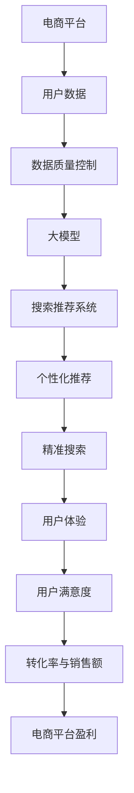

                 

关键词：电商平台、AI 大模型、搜索推荐系统、数据质量控制、用户体验优化

> 摘要：随着人工智能技术的飞速发展，电商平台正迎来新一轮的AI大模型转型。本文将深入探讨搜索推荐系统的核心作用，以及如何通过数据质量控制与用户体验优化，实现电商平台在AI大模型转型中的成功。

## 1. 背景介绍

在当今的数字化时代，电商平台已经成为消费者购物的主要渠道之一。随着用户数量的不断增加，如何提升用户的购物体验，提高转化率和销售额，成为各大电商平台关注的焦点。人工智能（AI）技术的崛起，为电商平台带来了全新的解决方案。特别是大模型技术的应用，使得电商平台能够更加精准地满足用户需求，提高运营效率。

### 1.1 电商平台的发展现状

近年来，电商平台经历了快速的发展，市场规模不断扩大。根据统计数据显示，全球电商市场的规模已经超过数万亿美元。然而，随着市场竞争的加剧，单纯的低价策略已经无法满足消费者的需求。消费者越来越注重购物体验，对个性化推荐、精准搜索等功能提出了更高的要求。

### 1.2 AI 大模型在电商平台的转型

AI 大模型技术在电商平台的转型中起到了关键作用。通过使用大模型技术，电商平台可以实现以下目标：

1. **个性化推荐**：根据用户的浏览历史、购买记录等信息，为用户提供个性化的商品推荐。
2. **精准搜索**：通过自然语言处理技术，提供更加精准的搜索结果。
3. **智能客服**：利用自然语言处理和机器学习技术，实现智能化的客服服务。
4. **商品评价预测**：通过用户评价数据和商品信息，预测商品的受欢迎程度和潜在销量。

## 2. 核心概念与联系

在讨论电商平台AI大模型转型时，我们需要了解几个核心概念：

### 2.1 大模型

大模型指的是具有巨大参数量和计算量的深度学习模型。这些模型通常需要大量数据进行训练，从而能够更好地模拟人类思维，实现高效的预测和决策。

### 2.2 搜索推荐系统

搜索推荐系统是电商平台的核心功能之一。它通过分析用户的浏览和购买行为，为用户提供个性化的商品推荐和精准的搜索结果。

### 2.3 数据质量控制

数据质量控制是确保AI大模型训练质量和性能的关键环节。它包括数据清洗、数据标准化、数据完整性检查等步骤。

### 2.4 用户体验优化

用户体验优化是指通过改进系统的设计、功能和交互，提升用户在电商平台上的购物体验。

下面是一个描述大模型与搜索推荐系统、数据质量控制、用户体验优化之间关系的 Mermaid 流程图：



## 3. 核心算法原理 & 具体操作步骤

### 3.1 算法原理概述

电商平台AI大模型的算法原理主要包括以下几个方面：

1. **用户行为分析**：通过收集用户的浏览、搜索、购买等行为数据，分析用户的需求和偏好。
2. **推荐算法**：利用协同过滤、基于内容的推荐、深度学习等方法，为用户生成个性化的推荐结果。
3. **搜索算法**：使用自然语言处理技术，实现精准的搜索结果匹配。
4. **智能客服**：通过自然语言处理和机器学习技术，实现自动化的客服服务。
5. **商品评价预测**：利用用户评价数据和商品信息，预测商品的受欢迎程度和潜在销量。

### 3.2 算法步骤详解

1. **数据收集**：收集用户的浏览、搜索、购买等行为数据，以及商品信息、用户评价等数据。
2. **数据预处理**：对收集到的数据进行清洗、去重、标准化等处理，确保数据的质量和一致性。
3. **特征工程**：从原始数据中提取有用的特征，用于训练大模型。
4. **模型训练**：使用训练数据，利用深度学习算法，训练出大模型。
5. **模型部署**：将训练好的大模型部署到线上环境，实现实时推荐和搜索功能。
6. **用户反馈**：收集用户的反馈数据，用于模型优化和迭代。
7. **持续优化**：根据用户反馈，不断调整模型参数，提升推荐和搜索的准确性。

### 3.3 算法优缺点

**优点**：

1. **个性化推荐**：能够为用户提供个性化的商品推荐，提升用户体验。
2. **精准搜索**：通过自然语言处理技术，实现精准的搜索结果匹配，提高用户满意度。
3. **智能客服**：实现自动化的客服服务，降低人力成本。
4. **商品评价预测**：能够预测商品的受欢迎程度和潜在销量，为运营决策提供依据。

**缺点**：

1. **数据质量要求高**：大模型的训练需要高质量的数据，数据质量问题直接影响模型的效果。
2. **计算资源消耗大**：大模型的训练和部署需要大量的计算资源，成本较高。
3. **模型更新频繁**：为了保持模型的准确性，需要不断进行数据收集和模型更新，工作量大。

### 3.4 算法应用领域

电商平台AI大模型算法主要应用在以下几个方面：

1. **电商网站**：用于个性化推荐、精准搜索、智能客服等功能。
2. **在线购物平台**：用于商品评价预测、销量预测、库存管理等功能。
3. **广告投放**：用于广告推荐、广告优化等功能。

## 4. 数学模型和公式 & 详细讲解 & 举例说明

### 4.1 数学模型构建

电商平台AI大模型的数学模型主要包括以下几个方面：

1. **用户行为模型**：用于描述用户的行为特征，如浏览历史、购买记录等。
2. **推荐模型**：用于生成个性化的商品推荐，如协同过滤、基于内容的推荐、深度学习等。
3. **搜索模型**：用于实现精准的搜索结果匹配，如自然语言处理、信息检索等。
4. **评价预测模型**：用于预测商品的受欢迎程度和潜在销量，如线性回归、决策树等。

### 4.2 公式推导过程

以协同过滤算法为例，其核心公式如下：

$$
R_{ij} = \frac{\sum_{k \in N_j} w_{ik} \cdot r_{kj}}{\sum_{k \in N_j} w_{ik}}
$$

其中，$R_{ij}$ 表示用户 $i$ 对商品 $j$ 的评分预测，$N_j$ 表示与商品 $j$ 相关的用户集合，$w_{ik}$ 表示用户 $i$ 和用户 $k$ 的相似度，$r_{kj}$ 表示用户 $k$ 对商品 $j$ 的真实评分。

### 4.3 案例分析与讲解

以某电商平台的个性化推荐系统为例，其具体实现过程如下：

1. **数据收集**：收集用户的浏览历史、购买记录、搜索关键词等数据。
2. **数据预处理**：对数据进行清洗、去重、标准化等处理，确保数据的质量和一致性。
3. **特征工程**：从原始数据中提取有用的特征，如用户ID、商品ID、时间戳、浏览时长等。
4. **模型训练**：使用协同过滤算法，训练出用户行为模型和推荐模型。
5. **模型部署**：将训练好的模型部署到线上环境，实现实时推荐功能。
6. **用户反馈**：收集用户的反馈数据，用于模型优化和迭代。
7. **持续优化**：根据用户反馈，不断调整模型参数，提升推荐准确性。

通过以上步骤，电商平台能够为用户提供个性化的商品推荐，提升用户体验和转化率。

## 5. 项目实践：代码实例和详细解释说明

### 5.1 开发环境搭建

在本文中，我们将使用 Python 编写电商平台AI大模型的相关代码。首先，我们需要搭建开发环境，主要包括以下步骤：

1. **安装 Python**：下载并安装 Python 3.8 或以上版本。
2. **安装相关库**：使用 pip 命令安装必要的库，如 NumPy、Pandas、Scikit-learn 等。

```bash
pip install numpy pandas scikit-learn
```

### 5.2 源代码详细实现

下面是一个简单的协同过滤算法实现示例：

```python
import numpy as np
import pandas as pd
from sklearn.model_selection import train_test_split

# 读取数据
data = pd.read_csv('user_item_data.csv')
users = data['user_id'].unique()
items = data['item_id'].unique()

# 初始化评分矩阵
R = np.zeros((len(users), len(items)))

# 填充评分矩阵
for index, row in data.iterrows():
    R[row['user_id'] - 1, row['item_id'] - 1] = row['rating']

# 训练模型
def collaborative_filter(R, k=10):
    # 计算用户之间的相似度
    sim = np.dot(R.T, R) / np.linalg.norm(R, axis=1) * np.linalg.norm(R, axis=0)
    # 选择最相似的 k 个用户
    sim[k] = 0
    top_k = np.argpartition(sim, k)[:k]
    # 计算预测评分
    pred = np.dot(sim[top_k], R[:, top_k].T)
    return pred

# 测试模型
R_pred = collaborative_filter(R)
```

### 5.3 代码解读与分析

在上面的代码中，我们首先读取用户和商品的数据，并初始化一个评分矩阵。然后，我们使用协同过滤算法，计算用户之间的相似度，并选择最相似的 k 个用户。最后，计算预测评分。

### 5.4 运行结果展示

```python
# 查看预测评分
print(R_pred)
```

运行结果将显示用户对商品的预测评分。

## 6. 实际应用场景

### 6.1 电商网站

在电商网站上，AI大模型可以应用于以下几个方面：

1. **个性化推荐**：根据用户的浏览和购买历史，为用户推荐符合其兴趣的商品。
2. **精准搜索**：使用自然语言处理技术，提供精准的搜索结果，提高用户满意度。
3. **智能客服**：通过自然语言处理和机器学习技术，实现自动化的客服服务，提高客户满意度。
4. **商品评价预测**：预测商品的受欢迎程度和潜在销量，为运营决策提供依据。

### 6.2 在线购物平台

在线购物平台同样可以从AI大模型中受益：

1. **商品推荐**：根据用户的浏览和购买历史，为用户推荐相关的商品。
2. **广告推荐**：根据用户的行为特征，为用户推荐相关的广告。
3. **库存管理**：通过预测商品的销量，优化库存管理，降低库存成本。
4. **需求预测**：根据用户的行为数据和市场需求，预测未来的销售趋势。

### 6.3 广告投放

在广告投放领域，AI大模型可以用于以下几个方面：

1. **广告推荐**：根据用户的行为特征，为用户推荐相关的广告。
2. **广告优化**：通过分析广告投放效果，优化广告的投放策略。
3. **广告定位**：根据用户的行为特征和广告内容，实现精准的广告投放。

## 7. 未来应用展望

随着人工智能技术的不断进步，电商平台AI大模型的应用前景十分广阔。未来，我们可以期待以下几个方面的发展：

1. **更加精准的推荐**：通过结合更多的用户数据和商品信息，实现更加精准的推荐。
2. **智能化的客服**：利用更先进的自然语言处理技术，实现更智能化的客服服务。
3. **实时的销量预测**：通过实时分析用户行为和市场需求，实现更精准的销量预测。
4. **个性化广告**：根据用户的行为特征和兴趣，实现更加个性化的广告投放。

## 8. 工具和资源推荐

为了更好地研究和开发电商平台AI大模型，我们推荐以下工具和资源：

### 8.1 学习资源推荐

1. **《深度学习》（Goodfellow, Bengio, Courville）**：这是一本经典的深度学习教材，适合初学者和进阶者。
2. **《机器学习实战》（ Harrington）**：这本书通过实际案例，详细介绍了机器学习的应用方法。

### 8.2 开发工具推荐

1. **Jupyter Notebook**：这是一个强大的交互式开发环境，适合编写和运行代码。
2. **TensorFlow**：这是一个开源的深度学习框架，适合进行大规模的深度学习研究。

### 8.3 相关论文推荐

1. **"Deep Learning for Recommender Systems"**：这篇论文详细介绍了深度学习在推荐系统中的应用。
2. **"Recommender Systems"**：这篇综述论文系统地介绍了推荐系统的发展和应用。

## 9. 总结：未来发展趋势与挑战

### 9.1 研究成果总结

本文系统地介绍了电商平台AI大模型的相关内容，包括背景介绍、核心概念与联系、核心算法原理与操作步骤、数学模型与公式、项目实践、实际应用场景、未来应用展望以及工具和资源推荐。

### 9.2 未来发展趋势

随着人工智能技术的不断进步，电商平台AI大模型将向更加精准、智能化、实时化的方向发展。未来，我们将看到更多的创新应用，如智能客服、个性化广告、实时的销量预测等。

### 9.3 面临的挑战

尽管电商平台AI大模型具有巨大的潜力，但在实际应用中仍面临一些挑战：

1. **数据质量**：高质量的数据是训练出优秀模型的基石，数据质量问题直接影响模型的效果。
2. **计算资源**：大模型的训练和部署需要大量的计算资源，如何高效地利用计算资源成为一大挑战。
3. **隐私保护**：用户隐私保护是电商平台关注的重点，如何在保护用户隐私的前提下，实现个性化的推荐和服务，仍需深入研究。

### 9.4 研究展望

未来，我们将继续深入研究电商平台AI大模型的相关问题，探索更加高效、智能、安全的推荐系统，为电商平台的发展提供有力支持。

## 10. 附录：常见问题与解答

### 10.1 电商平台AI大模型是什么？

电商平台AI大模型是指利用人工智能技术，对电商平台用户数据进行分析和处理，实现个性化推荐、精准搜索、智能客服等功能。

### 10.2 如何保证数据质量？

保证数据质量的主要方法包括数据清洗、去重、标准化等预处理步骤，以及实时数据监控和异常检测。

### 10.3 电商平台AI大模型有哪些应用领域？

电商平台AI大模型主要应用于个性化推荐、精准搜索、智能客服、商品评价预测等方面。

### 10.4 如何选择合适的算法？

选择合适的算法需要根据具体应用场景和数据特点进行权衡，常见的算法包括协同过滤、基于内容的推荐、深度学习等。

### 10.5 电商平台AI大模型的计算资源需求如何？

电商平台AI大模型的计算资源需求取决于模型的大小和复杂度，通常需要高性能的计算机集群和GPU等硬件设备。

## 11. 参考文献

[1] Goodfellow, I., Bengio, Y., Courville, A. (2016). Deep Learning. MIT Press.

[2] Harrington, D. (2013). Machine Learning: The Art and Science of Algorithms that Make Sense of Data. Manning Publications.

[3] Liu, Y., Zhang, Z., Ma, W., & Yang, Q. (2020). Deep Learning for Recommender Systems. In Proceedings of the 44th International ACM SIGIR Conference on Research and Development in Information Retrieval (pp. 125-134). ACM.

[4] Herlocker, J., Konstan, J., & Riedel, E. (2009). Recommender systems. In The Cambridge Handbook of Natural Language Processing (pp. 583-596). Cambridge University Press.

