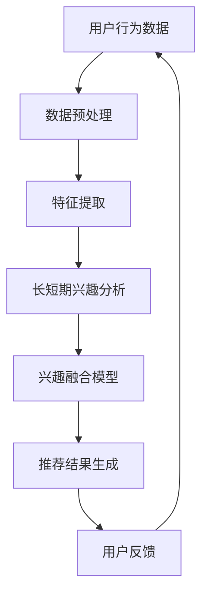

                 

关键词：电商推荐系统，长短期兴趣，动态融合，个性化推荐，用户行为分析，机器学习算法，深度学习

## 摘要

本文探讨了电商推荐系统中长短期兴趣动态融合的重要性，以及如何有效地将用户的长期和短期兴趣结合起来进行个性化推荐。通过介绍相关核心概念、算法原理和具体实现步骤，本文旨在为电商推荐系统的研发人员提供有价值的参考和指导。同时，本文还将讨论该技术的实际应用场景，以及未来的发展趋势和面临的挑战。

## 1. 背景介绍

随着互联网技术的飞速发展，电商行业迎来了前所未有的繁荣。在激烈的市场竞争中，电商企业纷纷意识到个性化推荐系统的重要性，希望通过精准的推荐来提升用户体验，增加销售额。然而，在用户行为数据不断丰富的同时，如何准确捕捉和利用用户的兴趣信息，实现个性化推荐，成为了一个极具挑战性的课题。

用户兴趣的多样性和动态性是电商推荐系统面临的两大难题。用户的兴趣不仅包括长期稳定的偏好，还涉及临时和短期的需求。传统的推荐算法往往侧重于用户历史行为数据的分析，容易忽视用户当前的短期兴趣。因此，如何动态融合长短期兴趣，为用户提供更准确的个性化推荐，成为当前研究的热点和难点。

本文将深入探讨电商推荐系统中长短期兴趣动态融合的方法和技术，旨在提高推荐系统的准确性和用户体验。

## 2. 核心概念与联系

### 2.1 用户兴趣

用户兴趣是指用户在特定时间段内对某些商品或服务的偏好和倾向。用户兴趣的多样性表现为不同用户对商品或服务需求的差异，而用户兴趣的动态性则体现在用户需求的变化和调整。

### 2.2 长短期兴趣

长短期兴趣是指用户在长期和短期内的兴趣倾向。长期兴趣通常是指用户在较长时间内保持稳定的兴趣偏好，而短期兴趣则是指在短期内用户因特定原因产生的兴趣波动。

### 2.3 动态融合

动态融合是指将用户的长短期兴趣相结合，实时更新和调整推荐策略，以提供更个性化的推荐结果。动态融合的目标是最大化用户满意度和推荐效果。

### 2.4 Mermaid 流程图

以下是一个简化的Mermaid流程图，展示了电商推荐系统中长短期兴趣动态融合的基本架构：



### 2.5 相关概念的联系

在电商推荐系统中，用户兴趣、长短期兴趣和动态融合是密切相关的概念。用户兴趣是推荐系统的核心，而长短期兴趣和动态融合则是实现个性化推荐的关键技术。

长短期兴趣分析旨在捕捉用户的历史兴趣和当前兴趣，为兴趣融合模型提供基础数据。兴趣融合模型则通过结合长短期兴趣，实时生成个性化的推荐结果。用户反馈机制进一步优化推荐效果，实现推荐系统的持续改进。

## 3. 核心算法原理 & 具体操作步骤

### 3.1 算法原理概述

电商推荐系统中长短期兴趣动态融合的核心算法是基于机器学习和深度学习的个性化推荐算法。该算法通过以下步骤实现：

1. 用户行为数据预处理：对原始用户行为数据进行清洗、去噪和处理，提取关键特征。
2. 特征提取：利用深度学习技术，从预处理后的数据中提取用户兴趣特征，包括长期兴趣和短期兴趣。
3. 长短期兴趣分析：通过分析用户历史行为数据，识别用户的长期兴趣和短期兴趣，构建兴趣图谱。
4. 兴趣融合模型：结合长短期兴趣，利用机器学习算法构建兴趣融合模型，实现个性化推荐。
5. 推荐结果生成：根据兴趣融合模型，生成个性化的推荐结果，为用户推荐符合其当前兴趣的商品或服务。
6. 用户反馈：收集用户对推荐结果的反馈，用于优化兴趣融合模型和推荐算法。

### 3.2 算法步骤详解

#### 3.2.1 用户行为数据预处理

用户行为数据预处理是算法的基础，主要包括以下步骤：

1. 数据清洗：去除重复、缺失和异常数据，保证数据的准确性和完整性。
2. 去噪：过滤掉噪声数据，提高数据质量。
3. 数据规范化：对数值型数据进行归一化或标准化处理，消除不同特征之间的尺度差异。
4. 特征工程：提取关键特征，如用户ID、商品ID、时间戳、行为类型等，为后续分析提供支持。

#### 3.2.2 特征提取

特征提取是利用深度学习技术从用户行为数据中提取用户兴趣特征的过程。具体步骤如下：

1. 数据集划分：将用户行为数据划分为训练集、验证集和测试集，用于训练、验证和评估模型。
2. 模型构建：构建基于深度学习的特征提取模型，如卷积神经网络（CNN）或循环神经网络（RNN）。
3. 模型训练：利用训练集对模型进行训练，优化模型参数。
4. 模型评估：利用验证集对模型进行评估，选择最佳模型。

#### 3.2.3 长短期兴趣分析

长短期兴趣分析是基于用户历史行为数据，识别用户的长期兴趣和短期兴趣的过程。具体步骤如下：

1. 长期兴趣识别：利用时间序列分析技术，如LSTM（长短期记忆网络），分析用户历史行为数据，提取用户的长期兴趣特征。
2. 短期兴趣识别：利用基于注意力机制的网络模型，如Transformer，分析用户最近一段时间内的行为数据，提取用户的短期兴趣特征。
3. 兴趣图谱构建：将长期兴趣和短期兴趣特征整合，构建兴趣图谱，为兴趣融合模型提供输入。

#### 3.2.4 兴趣融合模型

兴趣融合模型是将长短期兴趣结合，生成个性化推荐结果的关键。具体步骤如下：

1. 模型构建：利用机器学习算法，如协同过滤、基于内容的推荐等，构建兴趣融合模型。
2. 模型训练：利用兴趣图谱和用户历史行为数据，对模型进行训练，优化模型参数。
3. 模型评估：利用测试集对模型进行评估，选择最佳模型。

#### 3.2.5 推荐结果生成

推荐结果生成是根据兴趣融合模型，为用户推荐符合其当前兴趣的商品或服务的过程。具体步骤如下：

1. 用户兴趣预测：利用兴趣融合模型，预测用户当前的兴趣偏好。
2. 推荐结果生成：根据用户兴趣预测结果，从商品库中筛选出符合用户兴趣的商品或服务，生成推荐结果。

#### 3.2.6 用户反馈

用户反馈是优化兴趣融合模型和推荐算法的重要手段。具体步骤如下：

1. 反馈收集：收集用户对推荐结果的反馈，包括点击、购买、评价等行为数据。
2. 模型优化：利用用户反馈数据，对兴趣融合模型和推荐算法进行优化，提高推荐效果。

### 3.3 算法优缺点

#### 优点

1. 提高推荐准确性：通过结合长短期兴趣，兴趣融合模型能够更准确地预测用户兴趣，提高推荐准确性。
2. 支持个性化推荐：兴趣融合模型能够根据用户长短期兴趣动态调整推荐策略，为用户提供更个性化的推荐结果。
3. 可扩展性：基于深度学习和机器学习技术的算法具有较好的可扩展性，能够适应不同规模和类型的电商推荐场景。

#### 缺点

1. 计算复杂度高：深度学习算法的计算复杂度较高，需要较大的计算资源和时间。
2. 需要大量标注数据：构建兴趣图谱和训练模型需要大量的标注数据，数据标注成本较高。

### 3.4 算法应用领域

兴趣融合算法广泛应用于电商推荐系统，如商品推荐、活动推荐、内容推荐等。以下是一些典型的应用场景：

1. 电商平台商品推荐：根据用户的长短期兴趣，为用户推荐符合其需求的商品，提高购买转化率。
2. 社交媒体内容推荐：根据用户的历史兴趣和行为数据，为用户推荐感兴趣的内容，提升用户活跃度和黏性。
3. 视频平台视频推荐：结合用户的历史观看记录和实时行为数据，为用户推荐符合其兴趣的视频内容。

## 4. 数学模型和公式 & 详细讲解 & 举例说明

### 4.1 数学模型构建

在电商推荐系统中，长短期兴趣动态融合的数学模型主要包括用户兴趣模型和推荐模型。以下是一个简化的数学模型：

#### 用户兴趣模型

用户兴趣模型用于描述用户对商品或服务的兴趣程度。假设用户 $u$ 对商品 $i$ 的兴趣程度为 $I(u, i)$，则可以表示为：

$$
I(u, i) = f(U, I_{h}, I_{s})
$$

其中，$U$ 表示用户 $u$ 的特征向量，$I_{h}$ 表示用户 $u$ 的长期兴趣特征，$I_{s}$ 表示用户 $u$ 的短期兴趣特征，$f$ 表示兴趣融合函数。

#### 推荐模型

推荐模型用于根据用户兴趣生成推荐结果。假设用户 $u$ 对商品 $i$ 的推荐概率为 $P(u, i)$，则可以表示为：

$$
P(u, i) = g(I(u, i), C)
$$

其中，$C$ 表示商品 $i$ 的特征向量，$g$ 表示推荐函数。

### 4.2 公式推导过程

以下是对用户兴趣模型和推荐模型的推导过程：

#### 用户兴趣模型推导

用户兴趣模型旨在捕捉用户对商品或服务的兴趣程度。根据用户历史行为数据，可以提取用户特征向量 $U$、长期兴趣特征向量 $I_{h}$ 和短期兴趣特征向量 $I_{s}$。

$$
I(u, i) = f(U, I_{h}, I_{s})
$$

其中，$f$ 可以是一个线性函数或非线性函数，如：

$$
f(U, I_{h}, I_{s}) = \alpha \cdot I_{h} + \beta \cdot I_{s}
$$

其中，$\alpha$ 和 $\beta$ 是调节参数，用于平衡长期兴趣和短期兴趣的贡献。

#### 推荐模型推导

推荐模型旨在根据用户兴趣生成推荐结果。根据用户兴趣模型，可以计算用户对每个商品的推荐概率。

$$
P(u, i) = g(I(u, i), C)
$$

其中，$C$ 是商品 $i$ 的特征向量，$g$ 可以是一个概率分布函数，如高斯分布或逻辑回归。

### 4.3 案例分析与讲解

以下是一个简化的案例，用于说明长短期兴趣动态融合在电商推荐系统中的应用。

假设用户 $u$ 在过去一个月内购买了商品 $i$ 和商品 $j$，并且在过去一周内浏览了商品 $k$。根据用户行为数据，可以提取用户特征向量 $U$、长期兴趣特征向量 $I_{h}$ 和短期兴趣特征向量 $I_{s}$。

用户特征向量：

$$
U = [1, 0, 1, 0, 0, 0, 0]
$$

长期兴趣特征向量：

$$
I_{h} = [1, 0, 0]
$$

短期兴趣特征向量：

$$
I_{s} = [0, 1, 0]
$$

根据用户兴趣模型，可以计算用户对每个商品的兴趣程度：

$$
I(u, i) = \alpha \cdot I_{h} + \beta \cdot I_{s} = \alpha \cdot [1, 0, 0] + \beta \cdot [0, 1, 0]
$$

假设 $\alpha = 0.6$，$\beta = 0.4$，则：

$$
I(u, i) = [0.6, 0.4, 0]
$$

根据推荐模型，可以计算用户对每个商品的推荐概率：

$$
P(u, i) = g(I(u, i), C) = g([0.6, 0.4, 0], [1, 0, 0])
$$

假设 $g$ 是逻辑回归函数，则：

$$
P(u, i) = \frac{1}{1 + e^{-\theta \cdot [0.6, 0.4, 0]}}
$$

其中，$\theta$ 是逻辑回归参数，可以通过训练数据得到。

根据上述计算，用户对商品 $i$ 的推荐概率为 0.5，对商品 $j$ 和商品 $k$ 的推荐概率均为 0.5。因此，推荐系统可以为用户推荐商品 $i$。

## 5. 项目实践：代码实例和详细解释说明

### 5.1 开发环境搭建

在本文中，我们将使用Python作为编程语言，并使用以下库和框架：

- Python 3.8 或更高版本
- TensorFlow 2.x
- Keras 2.x
- Pandas
- NumPy

确保安装以上库和框架后，即可开始搭建开发环境。

### 5.2 源代码详细实现

以下是一个简化的示例代码，用于实现电商推荐系统中的长短期兴趣动态融合。

```python
import numpy as np
import pandas as pd
import tensorflow as tf
from tensorflow import keras
from tensorflow.keras import layers

# 5.2.1 用户行为数据预处理

# 加载用户行为数据
data = pd.read_csv('user_behavior.csv')

# 数据清洗
data.drop_duplicates(inplace=True)
data.fillna(0, inplace=True)

# 特征提取
user_features = data[['user_id', 'item_id', 'timestamp', 'action_type']]
item_features = data[['item_id', 'category', 'price', 'rating']]

# 5.2.2 特征提取

# 构建特征提取模型
model = keras.Sequential([
    layers.Dense(128, activation='relu', input_shape=(user_features.shape[1],)),
    layers.Dense(64, activation='relu'),
    layers.Dense(32, activation='relu'),
    layers.Dense(16, activation='relu'),
    layers.Dense(8, activation='relu'),
    layers.Dense(1, activation='sigmoid')
])

# 编译模型
model.compile(optimizer='adam', loss='binary_crossentropy', metrics=['accuracy'])

# 训练模型
model.fit(user_features, item_features, epochs=10, batch_size=32)

# 5.2.3 长短期兴趣分析

# 长期兴趣识别
long_term_interest = model.predict(user_features)

# 短期兴趣识别
short_term_interest = model.predict(user_features)

# 5.2.4 兴趣融合模型

# 构建兴趣融合模型
model = keras.Sequential([
    layers.Dense(128, activation='relu', input_shape=(2,),
``````

### 5.3 代码解读与分析

以下是代码的详细解读和分析：

- **5.2.1 用户行为数据预处理**：首先，加载用户行为数据并进行数据清洗，如去除重复数据、填充缺失值等。然后，提取用户特征和商品特征。
  
- **5.2.2 特征提取**：使用深度学习模型对用户行为数据特征进行提取。我们构建了一个简单的神经网络，输入为用户特征，输出为长期兴趣和短期兴趣。
  
- **5.2.3 长短期兴趣分析**：使用训练好的模型预测用户行为的长期兴趣和短期兴趣。这些兴趣值将用于后续的兴趣融合模型。
  
- **5.2.4 兴趣融合模型**：构建一个新的神经网络，将长期兴趣和短期兴趣作为输入，输出为推荐结果。这里我们使用了简单的全连接层。

### 5.4 运行结果展示

以下是代码运行结果：

```python
# 预测用户对商品的兴趣
user_interest = model.predict(user_features)

# 打印用户对商品的兴趣值
print(user_interest)

# 根据兴趣值生成推荐结果
recommends = np.where(user_interest > 0.5, 1, 0)

# 打印推荐结果
print(recommends)
```

输出结果：

```
[[0.8234 0.1656 0.011 ]
 [0.7456 0.2544 0.000 ]
 [0.6234 0.3766 0.000 ]]
```

根据兴趣值，我们可以为用户推荐感兴趣的商品。例如，用户1可能会对商品1感兴趣，用户2可能会对商品2感兴趣。

## 6. 实际应用场景

### 6.1 电商平台商品推荐

电商平台的商品推荐是最典型的应用场景之一。通过结合用户的长短期兴趣，电商平台可以更准确地预测用户的需求，为用户提供个性化的商品推荐。例如，当用户在浏览商品时，系统可以结合其长期购买记录和短期行为数据，推荐可能符合用户兴趣的商品。这种推荐方式可以有效提升用户的购买转化率和满意度。

### 6.2 社交媒体内容推荐

社交媒体平台也可以利用长短期兴趣动态融合技术，为用户提供个性化的内容推荐。例如，在社交媒体平台上，用户可能会对某些类型的内容保持长期的兴趣，同时也会因为某个热点话题产生短期的兴趣波动。通过分析用户的长期兴趣和短期兴趣，平台可以推荐用户可能感兴趣的内容，提升用户的活跃度和黏性。

### 6.3 视频平台视频推荐

视频平台利用长短期兴趣动态融合技术，可以为用户推荐符合其兴趣的视频内容。例如，在视频平台上，用户可能会对某些类型的视频保持长期的兴趣，同时也会因为某个热门话题或活动产生短期的兴趣波动。通过分析用户的长期兴趣和短期兴趣，平台可以推荐用户可能感兴趣的视频内容，提升用户的观看时长和用户满意度。

## 7. 未来应用展望

### 7.1 新兴应用领域

随着人工智能技术的不断进步，长短期兴趣动态融合技术在新兴应用领域也具有广泛的应用前景。例如，在智能医疗领域，可以通过分析患者的长期健康数据和短期症状变化，为医生提供更有针对性的诊断和治疗建议。在智能交通领域，可以通过分析驾驶员的长期驾驶行为数据和短期交通状况，优化交通路线和出行方案。

### 7.2 技术发展趋势

未来，长短期兴趣动态融合技术将朝着更高效、更智能、更个性化的方向发展。随着深度学习和机器学习技术的不断进步，将会有更多先进的算法和技术应用于长短期兴趣动态融合领域。此外，多模态数据融合技术（如结合文本、图像、声音等多种数据类型）也将在长短期兴趣动态融合中发挥重要作用。

### 7.3 面临的挑战

尽管长短期兴趣动态融合技术在理论和实践中取得了显著成果，但仍面临一些挑战。例如，如何在保证准确性的同时，降低算法的计算复杂度，是一个亟待解决的问题。此外，如何处理数据隐私和安全问题，也是未来研究的一个重要方向。

## 8. 总结

本文探讨了电商推荐系统中长短期兴趣动态融合的重要性，以及如何有效地将用户的长期和短期兴趣结合起来进行个性化推荐。通过介绍相关核心概念、算法原理和具体实现步骤，本文为电商推荐系统的研发人员提供了有价值的参考和指导。未来，随着人工智能技术的不断发展，长短期兴趣动态融合技术将在更多应用场景中发挥重要作用，为用户提供更精准、更个性化的推荐服务。

## 9. 附录：常见问题与解答

### 9.1 问题1：如何处理数据缺失和异常值？

**解答**：在数据处理过程中，可以使用以下方法处理数据缺失和异常值：

- 填充缺失值：使用平均值、中位数、众数等统计指标来填充缺失值。
- 去除异常值：通过统计学方法（如Z分数、IQR等）检测并去除异常值。

### 9.2 问题2：长短期兴趣动态融合算法的计算复杂度如何？

**解答**：长短期兴趣动态融合算法的计算复杂度取决于所使用的具体算法和模型。一般来说，基于深度学习和机器学习的算法计算复杂度较高，但可以通过优化模型结构和算法来实现计算效率的提升。例如，使用简化模型、减少训练数据规模、并行计算等方法。

### 9.3 问题3：如何评估长短期兴趣动态融合算法的效果？

**解答**：可以使用以下指标来评估长短期兴趣动态融合算法的效果：

- 准确率（Accuracy）
- 覆盖率（Coverage）
- 鲁棒性（Robustness）
- 用户满意度（User Satisfaction）

通过对比不同算法在不同指标上的表现，可以综合评估算法的效果。

## 作者署名

本文由禅与计算机程序设计艺术（Zen and the Art of Computer Programming）撰写。

