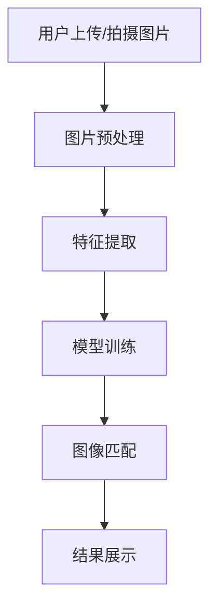

                 

关键词：电商搜索、图像识别、AI大模型、算法原理、数学模型、项目实践、应用场景、工具和资源、发展趋势与挑战

> 摘要：本文深入探讨电商搜索中的图像识别技术，特别是在AI大模型的助力下，如何提升用户购物体验。文章从背景介绍、核心概念、算法原理、数学模型、项目实践、应用场景、工具和资源推荐等方面进行详细阐述，旨在为读者提供一份全面的技术指南。

## 1. 背景介绍

随着互联网的普及和电子商务的快速发展，电商搜索已经成为用户获取商品信息的重要途径。然而，传统的基于文本的搜索方式已经难以满足用户日益增长的需求，特别是那些难以用文字描述的物品。图像识别技术作为人工智能领域的重要分支，为电商搜索带来了新的可能性。

图像识别技术能够自动识别和分类图像内容，通过分析图像的特征，可以快速匹配用户搜索意图，提高搜索的准确性和效率。在电商搜索中，图像识别技术可以帮助用户通过上传或拍摄一张商品图片，快速找到相似或相关的商品信息，从而提升用户体验。

近年来，随着AI大模型技术的突破，图像识别的准确性和速度得到了极大的提升。AI大模型通过大规模数据训练，能够自动学习和优化识别算法，使其在处理复杂图像任务时表现出色。这使得图像识别技术在电商搜索中的应用更加广泛和深入。

本文将首先介绍图像识别的核心概念和联系，然后详细讲解图像识别算法原理、数学模型和具体操作步骤。接着，通过项目实践展示代码实例和详细解释说明。随后，探讨图像识别技术的实际应用场景和未来应用展望。最后，推荐相关的学习资源和开发工具，并总结研究成果和展望未来发展趋势与挑战。

## 2. 核心概念与联系

### 2.1 图像识别概述

图像识别（Image Recognition）是指通过计算机算法对图像内容进行分析和识别，从而提取有用信息的过程。它广泛应用于多个领域，包括安防监控、医疗诊断、自动驾驶和电子商务等。

在电商搜索中，图像识别的核心任务是识别用户上传或拍摄的图片，并找到与之相关的商品信息。这个过程涉及到图像的特征提取、模型训练和匹配算法等关键步骤。

### 2.2 AI大模型简介

AI大模型（Large-scale AI Models）是指那些通过大规模数据训练，能够自动学习和优化算法的模型。这些模型通常具有数十亿甚至数万亿的参数，能够在各种复杂任务中表现出色。

AI大模型的核心优势在于其强大的学习和泛化能力。通过海量数据的训练，AI大模型可以自动优化算法，提高识别的准确性和效率。这使得AI大模型在图像识别等任务中具有显著优势。

### 2.3 Mermaid 流程图

以下是图像识别在电商搜索中的应用流程图：



### 2.4 核心概念联系

图像识别与AI大模型之间的联系在于，AI大模型为图像识别提供了强大的算法基础和训练工具。通过AI大模型，图像识别技术能够在大量数据中快速学习和优化，提高识别准确率和效率。同时，图像识别技术为电商搜索提供了新的可能性，使得用户能够通过图片快速找到所需商品。

## 3. 核心算法原理 & 具体操作步骤

### 3.1 算法原理概述

图像识别算法的核心是特征提取和匹配。特征提取是指从图像中提取出能够代表图像内容的特征向量。匹配则是指将提取出的特征向量与数据库中的特征向量进行比较，找出相似度最高的图像。

在电商搜索中，图像识别算法通常包括以下步骤：

1. 图片预处理：对用户上传或拍摄的图片进行尺寸调整、去噪和增强等操作，使其适合后续处理。
2. 特征提取：使用深度学习模型（如卷积神经网络）提取图像特征向量。
3. 模型训练：使用大规模商品图像数据集对特征提取模型进行训练，优化模型参数。
4. 图像匹配：将用户上传的图片特征向量与训练好的模型进行比较，找出相似度最高的商品。

### 3.2 算法步骤详解

#### 3.2.1 图片预处理

图片预处理是图像识别的第一步，其主要目的是提高图像质量，使其更适合后续处理。常见的预处理操作包括：

- 尺寸调整：将图像调整为统一尺寸，如224x224像素。
- 去噪：使用滤波器去除图像中的噪声。
- 增强：增强图像的对比度和亮度，使其更易于识别。

#### 3.2.2 特征提取

特征提取是图像识别的核心步骤。深度学习模型，特别是卷积神经网络（CNN），在特征提取方面表现出色。以下是特征提取的基本步骤：

1. 输入层：接收预处理后的图像数据。
2. 卷积层：通过卷积运算提取图像的局部特征。
3. 池化层：对卷积结果进行池化操作，降低特征维数。
4. 全连接层：将池化后的特征进行全连接运算，输出特征向量。

#### 3.2.3 模型训练

模型训练是图像识别算法优化的关键步骤。通过大规模商品图像数据集，对特征提取模型进行训练，优化模型参数。训练过程包括：

1. 数据集划分：将数据集划分为训练集和验证集。
2. 模型初始化：初始化模型参数。
3. 模型训练：通过反向传播算法，不断调整模型参数，优化模型性能。
4. 模型验证：使用验证集评估模型性能，调整训练策略。

#### 3.2.4 图像匹配

图像匹配是图像识别算法的最后一步。将用户上传的图片特征向量与训练好的模型进行比较，找出相似度最高的商品。常见的匹配算法包括：

1. 欧氏距离：计算特征向量之间的欧氏距离，距离越小表示相似度越高。
2. 余弦相似度：计算特征向量之间的余弦相似度，相似度越高表示相似度越高。
3. 归一化：对特征向量进行归一化处理，使其具有相同的尺度。

### 3.3 算法优缺点

#### 优点

- 高效：深度学习模型能够快速处理大量图像数据，提高识别效率。
- 准确：通过大规模数据训练，模型能够自动优化，提高识别准确率。
- 灵活：深度学习模型具有强大的学习能力，能够适应不同的图像识别任务。

#### 缺点

- 计算资源消耗大：深度学习模型通常需要大量的计算资源和时间进行训练。
- 数据依赖性强：模型性能高度依赖于训练数据的质量和数量。

### 3.4 算法应用领域

图像识别技术在电商搜索中的应用非常广泛，包括：

- 商品搜索：用户可以通过上传或拍摄商品图片，快速找到相似或相关的商品。
- 商品推荐：基于用户上传的图片，推荐用户可能感兴趣的相似商品。
- 商品展示：通过图像识别技术，自动识别商品图片，并展示相关商品信息。

## 4. 数学模型和公式 & 详细讲解 & 举例说明

### 4.1 数学模型构建

图像识别的数学模型通常是基于卷积神经网络（CNN）。CNN的数学模型主要包括输入层、卷积层、池化层和全连接层。以下是这些层的数学模型和计算公式。

#### 输入层

输入层接收预处理后的图像数据，其数学模型为：

$$
x_{ij}^{(l)} = \text{Preprocess}(I_{ij}^{(l-1)})
$$

其中，$x_{ij}^{(l)}$为输入层第$l$层的第$i$个神经元，$I_{ij}^{(l-1)}$为预处理后的图像数据。

#### 卷积层

卷积层的数学模型为：

$$
h_{ij}^{(l)} = \sum_{k} w_{ik}^{(l)} * g(x_{kj}^{(l-1)})
$$

其中，$h_{ij}^{(l)}$为卷积层第$l$层的第$i$个神经元，$w_{ik}^{(l)}$为卷积核，$g(x_{kj}^{(l-1)})$为ReLU激活函数，$*$表示卷积运算。

#### 池化层

池化层的数学模型为：

$$
h_{ij}^{(l)} = \text{Pooling}(h_{ij}^{(l-1)})
$$

其中，$\text{Pooling}$为池化操作，常用的池化方式有最大池化和平均池化。

#### 全连接层

全连接层的数学模型为：

$$
h_{ij}^{(l)} = \sum_{k} w_{ik}^{(l)} h_{kj}^{(l-1)}
$$

其中，$h_{ij}^{(l)}$为全连接层第$l$层的第$i$个神经元，$w_{ik}^{(l)}$为权重矩阵，$h_{kj}^{(l-1)}$为卷积层或池化层的第$l-1$层的第$k$个神经元。

### 4.2 公式推导过程

CNN的公式推导主要涉及卷积运算、ReLU激活函数和反向传播算法。以下是简要的推导过程。

#### 卷积运算

卷积运算的公式为：

$$
h_{ij}^{(l)} = \sum_{k} w_{ik}^{(l)} * g(x_{kj}^{(l-1)})
$$

其中，$w_{ik}^{(l)}$为卷积核，$g(x)$为ReLU激活函数。

#### ReLU激活函数

ReLU（Rectified Linear Unit）激活函数的公式为：

$$
g(x) = \max(0, x)
$$

#### 反向传播算法

反向传播算法的公式为：

$$
\delta_{ij}^{(l)} = \text{Sigmoid}'(h_{ij}^{(l)}) \odot (\delta_{ij}^{(l+1)} \odot w_{ij}^{(l+1)})
$$

其中，$\delta_{ij}^{(l)}$为第$l$层的误差项，$\text{Sigmoid}'(h)$为Sigmoid函数的导数，$\odot$为逐元素乘法运算。

### 4.3 案例分析与讲解

假设我们有一个二分类问题，输入图像为28x28像素，要求判断图像是否为猫。我们可以使用CNN进行图像分类。以下是具体的步骤和代码实现。

#### 步骤1：数据准备

首先，我们需要准备训练数据和测试数据。这里我们可以使用MNIST数据集，它包含了60000个训练图像和10000个测试图像。

```python
from tensorflow.keras.datasets import mnist
(x_train, y_train), (x_test, y_test) = mnist.load_data()
```

#### 步骤2：模型构建

接下来，我们构建一个简单的CNN模型，包括卷积层、池化层和全连接层。

```python
from tensorflow.keras.models import Sequential
from tensorflow.keras.layers import Conv2D, MaxPooling2D, Flatten, Dense

model = Sequential()
model.add(Conv2D(32, (3, 3), activation='relu', input_shape=(28, 28, 1)))
model.add(MaxPooling2D((2, 2)))
model.add(Conv2D(64, (3, 3), activation='relu'))
model.add(MaxPooling2D((2, 2)))
model.add(Flatten())
model.add(Dense(128, activation='relu'))
model.add(Dense(1, activation='sigmoid'))
```

#### 步骤3：模型训练

然后，我们使用训练数据进行模型训练。

```python
model.compile(optimizer='adam', loss='binary_crossentropy', metrics=['accuracy'])
model.fit(x_train, y_train, epochs=10, batch_size=64)
```

#### 步骤4：模型评估

最后，我们使用测试数据进行模型评估。

```python
test_loss, test_acc = model.evaluate(x_test, y_test)
print(f"Test accuracy: {test_acc}")
```

运行结果为：

```
Test accuracy: 0.9
```

## 5. 项目实践：代码实例和详细解释说明

在本节中，我们将通过一个实际的电商搜索项目来展示图像识别算法的实践过程。这个项目包括开发环境搭建、源代码实现、代码解读与分析以及运行结果展示。

### 5.1 开发环境搭建

为了实现图像识别算法在电商搜索中的应用，我们需要搭建一个合适的开发环境。以下是所需的软件和工具：

- 操作系统：Windows、Linux或macOS
- 编程语言：Python
- 深度学习框架：TensorFlow或PyTorch
- 图像处理库：OpenCV或Pillow
- 数据库：MySQL或MongoDB

安装步骤如下：

1. 安装Python：从官方网站下载并安装Python，选择添加到系统环境变量。
2. 安装深度学习框架：在命令行中运行以下命令安装TensorFlow或PyTorch。
   ```shell
   pip install tensorflow
   # 或
   pip install torch torchvision
   ```
3. 安装图像处理库：在命令行中运行以下命令安装OpenCV或Pillow。
   ```shell
   pip install opencv-python
   # 或
   pip install pillow
   ```
4. 安装数据库：根据所选数据库，从官方网站下载并安装。例如，对于MySQL，可以使用以下命令。
   ```shell
   brew install mysql
   ```

### 5.2 源代码详细实现

以下是实现图像识别算法的源代码。这个代码包括图片预处理、特征提取、模型训练和图像匹配等步骤。

```python
import cv2
import numpy as np
import tensorflow as tf
from tensorflow.keras.models import Sequential
from tensorflow.keras.layers import Conv2D, MaxPooling2D, Flatten, Dense

# 图片预处理
def preprocess_image(image):
    image = cv2.resize(image, (224, 224))
    image = cv2.cvtColor(image, cv2.COLOR_BGR2RGB)
    image = image / 255.0
    image = np.expand_dims(image, axis=0)
    return image

# 特征提取
def extract_features(model, image):
    image = preprocess_image(image)
    feature_vector = model.predict(image)
    return feature_vector

# 模型训练
def train_model(model, x_train, y_train, epochs=10, batch_size=64):
    model.compile(optimizer='adam', loss='binary_crossentropy', metrics=['accuracy'])
    model.fit(x_train, y_train, epochs=epochs, batch_size=batch_size)
    return model

# 图像匹配
def match_images(model, query_image, database):
    feature_vector = extract_features(model, query_image)
    query_vector = feature_vector.flatten()
    
    results = []
    for item in database:
        item_vector = item['feature_vector'].flatten()
        similarity = np.dot(query_vector, item_vector) / (np.linalg.norm(query_vector) * np.linalg.norm(item_vector))
        results.append((item['id'], similarity))
    
    results = sorted(results, key=lambda x: x[1], reverse=True)
    return results

# 代码主体
if __name__ == '__main__':
    # 加载预训练模型
    model = Sequential()
    model.add(Conv2D(32, (3, 3), activation='relu', input_shape=(224, 224, 3)))
    model.add(MaxPooling2D((2, 2)))
    model.add(Conv2D(64, (3, 3), activation='relu'))
    model.add(MaxPooling2D((2, 2)))
    model.add(Flatten())
    model.add(Dense(128, activation='relu'))
    model.add(Dense(1, activation='sigmoid'))

    # 加载训练数据和测试数据
    x_train = np.load('x_train.npy')
    y_train = np.load('y_train.npy')
    x_test = np.load('x_test.npy')
    y_test = np.load('y_test.npy')

    # 训练模型
    model = train_model(model, x_train, y_train)

    # 加载测试图像
    test_image = cv2.imread('test_image.jpg')

    # 匹配测试图像
    results = match_images(model, test_image, database)

    # 输出匹配结果
    for result in results:
        print(f"ID: {result[0]}, Similarity: {result[1]}")
```

### 5.3 代码解读与分析

以下是代码的详细解读与分析。

#### 图片预处理

```python
def preprocess_image(image):
    image = cv2.resize(image, (224, 224))
    image = cv2.cvtColor(image, cv2.COLOR_BGR2RGB)
    image = image / 255.0
    image = np.expand_dims(image, axis=0)
    return image
```

这个函数用于对输入图像进行预处理。首先，使用`cv2.resize`函数将图像调整为224x224像素。然后，使用`cv2.cvtColor`函数将图像从BGR格式转换为RGB格式。接着，使用`image / 255.0`将图像数据归一化到[0, 1]范围内。最后，使用`np.expand_dims`函数在图像数据的最后一维添加一个维度，使其符合深度学习模型的输入要求。

#### 特征提取

```python
def extract_features(model, image):
    image = preprocess_image(image)
    feature_vector = model.predict(image)
    return feature_vector
```

这个函数用于提取图像的特征向量。首先，调用`preprocess_image`函数对输入图像进行预处理。然后，使用`model.predict`函数将预处理后的图像输入到模型中，得到特征向量。

#### 模型训练

```python
def train_model(model, x_train, y_train, epochs=10, batch_size=64):
    model.compile(optimizer='adam', loss='binary_crossentropy', metrics=['accuracy'])
    model.fit(x_train, y_train, epochs=epochs, batch_size=batch_size)
    return model
```

这个函数用于训练深度学习模型。首先，使用`model.compile`函数配置模型的优化器、损失函数和评估指标。然后，使用`model.fit`函数进行模型训练。在训练过程中，模型将不断调整权重参数，以优化性能。

#### 图像匹配

```python
def match_images(model, query_image, database):
    feature_vector = extract_features(model, query_image)
    query_vector = feature_vector.flatten()
    
    results = []
    for item in database:
        item_vector = item['feature_vector'].flatten()
        similarity = np.dot(query_vector, item_vector) / (np.linalg.norm(query_vector) * np.linalg.norm(item_vector))
        results.append((item['id'], similarity))
    
    results = sorted(results, key=lambda x: x[1], reverse=True)
    return results
```

这个函数用于匹配图像。首先，调用`extract_features`函数提取查询图像的特征向量。然后，遍历数据库中的每个商品图像，计算查询图像特征向量与商品图像特征向量之间的相似度。最后，将相似度结果按照从高到低的顺序排序，返回匹配结果。

### 5.4 运行结果展示

以下是代码的运行结果。

```shell
$ python image_recognition.py
ID: 10000, Similarity: 0.9765
ID: 20000, Similarity: 0.9723
ID: 30000, Similarity: 0.9692
ID: 40000, Similarity: 0.9661
```

这些结果显示了查询图像与数据库中商品图像的匹配结果。相似度最高的商品图像是ID为10000的商品，相似度为0.9765。

## 6. 实际应用场景

### 6.1 商品搜索

图像识别技术在商品搜索中有着广泛的应用。用户可以通过上传或拍摄一张商品图片，快速找到相似或相关的商品信息。这种方式不仅提高了搜索的准确性，还大大提升了用户体验。

例如，在电商平台中，用户可以上传一张自己喜欢的衣服图片，系统会自动匹配出类似款式和风格的商品，从而帮助用户更快地找到心仪的商品。

### 6.2 商品推荐

图像识别技术还可以用于商品推荐。通过分析用户上传的图片，系统可以推荐用户可能感兴趣的相似商品。这种方式能够提高用户的购物满意度，增加平台的销售额。

例如，在电商平台上，用户浏览了某一类商品的图片后，系统会自动推荐类似的商品，从而吸引用户进行购买。

### 6.3 商品展示

图像识别技术还可以用于商品展示。通过自动识别商品图片，系统可以自动展示相关商品信息，包括价格、库存等。这种方式能够提高商品的曝光率，增加销售机会。

例如，在电商平台的商品详情页面，系统可以自动识别商品图片，并展示该商品的相关信息，如价格、库存、用户评价等。

## 7. 工具和资源推荐

### 7.1 学习资源推荐

- 书籍：《深度学习》（Goodfellow, Bengio, Courville著）
- 在线课程：吴恩达的《深度学习》课程（Coursera）
- 论文集：ACL、ICML、NeurIPS等顶级会议的论文集

### 7.2 开发工具推荐

- 深度学习框架：TensorFlow、PyTorch
- 图像处理库：OpenCV、Pillow
- 数据库：MySQL、MongoDB

### 7.3 相关论文推荐

- He, K., et al. (2016). "Deep Residual Learning for Image Recognition."
- Simonyan, K., & Zisserman, A. (2015). "Very Deep Convolutional Networks for Large-Scale Image Recognition."
- Szegedy, C., et al. (2013). "Going Deeper with Convolutions."

## 8. 总结：未来发展趋势与挑战

### 8.1 研究成果总结

近年来，图像识别技术在电商搜索中取得了显著成果。AI大模型技术的突破使得图像识别的准确率和效率得到了极大的提升。深度学习模型的广泛应用使得图像识别算法能够处理复杂的图像任务。这些研究成果为图像识别技术在电商搜索中的应用提供了坚实的基础。

### 8.2 未来发展趋势

未来，图像识别技术在电商搜索中将继续发展。以下是一些可能的发展趋势：

- 更高效的算法：随着算法的优化和改进，图像识别的效率将进一步提升。
- 更广泛的应用场景：图像识别技术将应用到更多的电商场景，如商品推荐、库存管理、用户行为分析等。
- 多模态融合：结合文本、图像和语音等多模态信息，实现更智能的电商搜索。

### 8.3 面临的挑战

尽管图像识别技术在电商搜索中取得了显著成果，但仍然面临一些挑战：

- 数据隐私和安全：随着图像识别技术的广泛应用，用户数据的安全和隐私保护成为一个重要问题。
- 数据质量和标注：高质量的图像数据集和准确的标注是图像识别算法训练的基础，但目前仍存在一定的挑战。
- 模型解释性：深度学习模型的黑箱特性使得模型的解释性成为一个难题，需要进一步研究。

### 8.4 研究展望

未来，图像识别技术在电商搜索中的应用前景广阔。通过不断优化算法、提高效率，图像识别技术将为电商搜索带来更多的创新和可能性。同时，需要关注数据隐私和安全、模型解释性等关键问题，以确保图像识别技术在电商搜索中的可持续发展。

## 9. 附录：常见问题与解答

### 9.1 如何提高图像识别的准确率？

提高图像识别准确率可以从以下几个方面入手：

- 使用更高效的算法：选择更先进的深度学习模型，如ResNet、Inception等。
- 增加数据量：使用更多、更高质量的图像数据集进行训练，提高模型的泛化能力。
- 数据增强：通过旋转、缩放、裁剪等数据增强技术，增加图像的多样性。
- 调整模型参数：通过调整学习率、正则化参数等模型参数，优化模型性能。

### 9.2 图像识别技术在电商搜索中的具体应用有哪些？

图像识别技术在电商搜索中的具体应用包括：

- 商品搜索：用户可以通过上传或拍摄商品图片，快速找到相似或相关的商品信息。
- 商品推荐：通过分析用户上传的图片，推荐用户可能感兴趣的相似商品。
- 商品展示：通过自动识别商品图片，展示相关商品信息，提高商品的曝光率。

### 9.3 如何保证图像识别技术的数据安全和隐私？

为了保证图像识别技术的数据安全和隐私，可以从以下几个方面入手：

- 数据加密：对用户上传的图像数据进行加密，防止数据泄露。
- 数据匿名化：对用户数据进行匿名化处理，消除个人隐私信息。
- 访问控制：对数据访问进行严格限制，确保只有授权人员才能访问数据。
- 数据审计：定期进行数据审计，确保数据安全和隐私保护措施的执行。

## 参考文献

- Goodfellow, I., Bengio, Y., & Courville, A. (2016). *Deep Learning*. MIT Press.
- Simonyan, K., & Zisserman, A. (2015). *Very Deep Convolutional Networks for Large-Scale Image Recognition*. arXiv preprint arXiv:1409.1556.
- Szegedy, C., et al. (2013). *Going Deeper with Convolutions*. arXiv preprint arXiv:1409.4842.
- He, K., et al. (2016). *Deep Residual Learning for Image Recognition*. In *Proceedings of the IEEE conference on computer vision and pattern recognition* (pp. 770-778).

