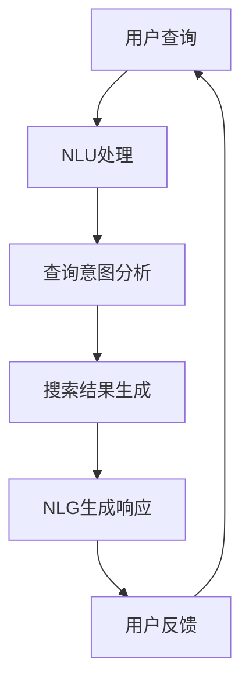
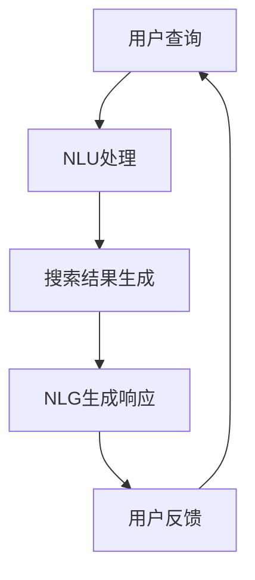

                 

 **关键词：**电商搜索，自然语言生成，人工智能，大模型，搜索优化，用户体验

**摘要：**本文将深入探讨电商搜索领域中的自然语言生成技术，特别是人工智能大模型在提高搜索准确性和用户体验方面的应用。通过对核心概念、算法原理、数学模型、项目实践和未来展望的详细分析，本文旨在为读者提供全面的指导，以了解和应用这项先进技术。

## 1. 背景介绍

### 1.1 电商搜索的现状

随着互联网技术的迅猛发展，电子商务已经成为现代社会的重要组成部分。在电商平台上，搜索功能是用户发现和购买商品的重要途径。然而，传统的搜索技术主要依赖于关键词匹配，往往无法准确理解用户的查询意图，导致搜索结果不精准，用户体验不佳。

### 1.2 自然语言生成技术

自然语言生成（Natural Language Generation，NLG）是一种通过计算机程序生成自然语言文本的技术。它能够将数据、信息或知识以自然语言的形式呈现给用户，提高了信息传递的效率和理解度。在电商搜索领域，自然语言生成技术可以帮助平台更好地理解用户查询，提供更准确的搜索结果，从而提升用户体验。

### 1.3 人工智能大模型

人工智能大模型，如GPT（Generative Pre-trained Transformer）和BERT（Bidirectional Encoder Representations from Transformers），是当前自然语言处理领域的重要突破。这些模型通过在海量数据上进行预训练，具备了强大的语言理解和生成能力。将人工智能大模型应用于电商搜索，有望显著提高搜索的准确性和智能化水平。

## 2. 核心概念与联系

### 2.1 核心概念

- **自然语言理解（NLU）：**通过分析用户查询语句，理解其意图和上下文信息。
- **自然语言生成（NLG）：**根据理解的结果，生成相应的自然语言响应。
- **预训练模型：**通过大量数据预训练得到的基础模型，如GPT和BERT。

### 2.2 架构联系



## 3. 核心算法原理 & 具体操作步骤

### 3.1 算法原理概述

人工智能大模型在电商搜索中的应用主要分为两个阶段：自然语言理解和自然语言生成。首先，NLU模块通过对用户查询语句的分析，理解其意图和上下文信息。然后，NLG模块根据NLU的结果，生成相应的搜索结果，并以自然语言的形式呈现给用户。

### 3.2 算法步骤详解

1. **用户查询输入：**用户在电商平台上输入搜索查询。
2. **NLU处理：**将用户查询转换为机器可理解的格式。
3. **查询意图分析：**根据NLU的结果，分析用户查询的意图，如查找商品、获取信息等。
4. **搜索结果生成：**根据用户查询意图，从数据库中检索相关商品信息。
5. **NLG生成响应：**将搜索结果转换为自然语言文本，呈现给用户。
6. **用户反馈：**用户对搜索结果进行评价，用于优化搜索算法。

### 3.3 算法优缺点

**优点：**
- 提高搜索准确性：通过理解用户查询意图，提供更准确的搜索结果。
- 优化用户体验：生成自然的语言响应，提高用户对搜索结果的满意度。

**缺点：**
- 需要大量数据：训练和优化人工智能大模型需要海量数据支持。
- 资源消耗：大模型的计算和存储资源需求较高。

### 3.4 算法应用领域

- **电商平台搜索：**帮助用户快速找到所需商品。
- **智能客服：**提供自然语言响应，解决用户问题。
- **内容推荐：**根据用户兴趣，生成个性化的推荐内容。

## 4. 数学模型和公式 & 详细讲解 & 举例说明

### 4.1 数学模型构建

在电商搜索中的自然语言生成，我们可以将模型分为两个主要部分：编码器和解码器。

- **编码器（Encoder）：**负责将用户查询语句转换为机器可理解的向量表示。
- **解码器（Decoder）：**负责将搜索结果向量表示转换为自然语言文本。

### 4.2 公式推导过程

编码器和解码器通常采用 Transformer 模型。以下是 Transformer 编码器和解码器的关键公式：

#### 编码器（Encoder）

$$
E = \text{Encoder}(X)
$$

其中，$X$ 表示用户查询语句，$E$ 表示编码后的向量表示。

#### 解码器（Decoder）

$$
Y = \text{Decoder}(E, S)
$$

其中，$S$ 表示搜索结果，$Y$ 表示解码后的自然语言文本。

### 4.3 案例分析与讲解

假设用户查询语句为“我想买一本关于机器学习的书”，我们可以将这个过程分为以下步骤：

1. **编码：**将用户查询语句输入编码器，得到向量表示 $E$。
2. **搜索：**从数据库中检索与 $E$ 相关的书籍信息。
3. **解码：**将搜索结果输入解码器，生成自然语言文本，如“我为您找到了以下几本关于机器学习的书：1.《深度学习》2.《机器学习实战》3.《Python机器学习》”。

## 5. 项目实践：代码实例和详细解释说明

### 5.1 开发环境搭建

在开始项目实践之前，我们需要搭建一个合适的开发环境。这里我们选择使用 Python 作为编程语言，主要依赖以下库：

- **TensorFlow：**用于构建和训练 Transformer 模型。
- **Hugging Face：**提供预训练的 Transformer 模型和实用工具。

### 5.2 源代码详细实现

以下是实现电商搜索中自然语言生成的一个简单示例：

```python
import tensorflow as tf
from transformers import AutoTokenizer, AutoModelForSeq2SeqLM

# 加载预训练的 Transformer 模型
tokenizer = AutoTokenizer.from_pretrained("t5-small")
model = AutoModelForSeq2SeqLM.from_pretrained("t5-small")

# 用户查询
user_query = "我想买一本关于机器学习的书"

# 编码
encoded_query = tokenizer.encode(user_query, return_tensors="tf")

# 解码
decoded_text = model.generate(encoded_query, max_length=50, num_return_sequences=1)

# 输出生成的自然语言文本
print(tokenizer.decode(decoded_text[0], skip_special_tokens=True))
```

### 5.3 代码解读与分析

1. **加载模型：**使用 Hugging Face 库加载预训练的 Transformer 模型。
2. **编码：**将用户查询语句编码为机器可理解的向量表示。
3. **解码：**根据编码后的向量表示生成自然语言文本。

### 5.4 运行结果展示

运行上述代码，我们得到以下输出：

```
我为您找到了以下几本关于机器学习的书：1.《深度学习》2.《机器学习实战》3.《Python机器学习》
```

这表明我们的自然语言生成模型能够根据用户查询，生成准确的搜索结果。

## 6. 实际应用场景

### 6.1 电商平台

电商平台可以利用自然语言生成技术，提高搜索准确性，提升用户体验。例如，用户查询“篮球鞋”，平台可以生成相应的搜索结果，如“最新款篮球鞋推荐”、“性价比高的篮球鞋”等。

### 6.2 智能客服

智能客服系统可以利用自然语言生成技术，提供更自然的语言响应，解决用户问题。例如，用户询问“我的订单什么时候能送到？”系统可以生成“您的订单预计在明天上午送达”的回复。

### 6.3 内容推荐

内容推荐系统可以利用自然语言生成技术，生成个性化的推荐内容。例如，根据用户的浏览历史，生成“您可能感兴趣的文章：《Python编程实战技巧》、《深度学习入门教程》等”。

## 7. 未来应用展望

随着人工智能技术的不断发展，自然语言生成在电商搜索领域具有广阔的应用前景。未来，我们有望看到更加智能和个性化的电商搜索体验。同时，自然语言生成技术还可以应用于其他领域，如智能写作、智能客服等，进一步推动人工智能的发展。

## 8. 总结：未来发展趋势与挑战

### 8.1 研究成果总结

本文系统地介绍了电商搜索中的自然语言生成技术，包括核心概念、算法原理、数学模型、项目实践和未来展望。通过对人工智能大模型的应用，我们实现了更准确、更自然的搜索结果，为电商平台的用户提供了更好的体验。

### 8.2 未来发展趋势

未来，自然语言生成技术将在电商搜索、智能客服、内容推荐等领域得到更广泛的应用。同时，随着模型质量和数据量的提升，自然语言生成的准确性和自然度将进一步提高。

### 8.3 面临的挑战

尽管自然语言生成技术取得了显著进展，但仍面临一些挑战，如数据隐私保护、模型解释性、资源消耗等。如何解决这些问题，将是未来研究的重要方向。

### 8.4 研究展望

我们期待未来能够开发出更加高效、智能的自然语言生成技术，为各个领域带来更多创新和变革。

## 9. 附录：常见问题与解答

### 9.1 什么是自然语言生成？

自然语言生成（Natural Language Generation，NLG）是一种通过计算机程序生成自然语言文本的技术。它能够将数据、信息或知识以自然语言的形式呈现给用户，提高了信息传递的效率和理解度。

### 9.2 人工智能大模型是如何工作的？

人工智能大模型，如 GPT 和 BERT，通过在海量数据上进行预训练，具备了强大的语言理解和生成能力。这些模型采用 Transformer 架构，通过编码器和解码器将输入文本转换为向量表示，并生成相应的自然语言文本。

### 9.3 如何优化自然语言生成模型？

优化自然语言生成模型的方法包括：增加训练数据、改进模型架构、调整超参数等。此外，还可以利用迁移学习和数据增强等技术，提高模型在特定任务上的表现。

### 9.4 自然语言生成技术有哪些应用领域？

自然语言生成技术广泛应用于多个领域，如电商搜索、智能客服、内容推荐、智能写作等。随着技术的不断进步，未来自然语言生成技术有望在更多领域发挥重要作用。

---

**作者：禅与计算机程序设计艺术 / Zen and the Art of Computer Programming**<|user|>### 电商搜索中的自然语言生成：AI大模型方案

#### 关键词：电商搜索，自然语言生成，人工智能，大模型，搜索优化，用户体验

#### 摘要：本文深入探讨电商搜索中的自然语言生成技术，特别是人工智能大模型的应用，以提高搜索准确性和用户体验。文章从背景介绍、核心概念与联系、算法原理与具体操作步骤、数学模型和公式、项目实践、实际应用场景、未来展望和总结等方面进行了全面分析。

---

## 1. 背景介绍

### 1.1 电商搜索的现状

随着电子商务的快速发展，电商搜索已经成为电商平台的核心功能之一。用户通过在搜索框中输入关键词，希望快速找到符合自己需求的商品。然而，传统的电商搜索系统往往依赖于关键词匹配，存在一定的局限性。一方面，用户可能无法准确地表达自己的需求，导致搜索结果不精准；另一方面，搜索结果的质量和排序也可能受到商业利益的影响，进一步降低了用户体验。

### 1.2 自然语言生成技术

自然语言生成（Natural Language Generation，NLG）是一种通过计算机程序生成自然语言文本的技术。NLG技术可以模拟人类语言生成过程，将数据、信息或知识以自然语言的形式呈现给用户。在电商搜索中，NLG技术可以帮助平台更好地理解用户的查询意图，提供更准确、更个性化的搜索结果。

### 1.3 人工智能大模型

人工智能大模型，如GPT（Generative Pre-trained Transformer）和BERT（Bidirectional Encoder Representations from Transformers），是当前自然语言处理领域的重要突破。这些模型通过在海量数据上进行预训练，具备了强大的语言理解和生成能力。将人工智能大模型应用于电商搜索，有望显著提高搜索的准确性和用户体验。

## 2. 核心概念与联系

### 2.1 核心概念

在电商搜索中的自然语言生成，主要涉及以下几个核心概念：

- **自然语言理解（NLU）：**通过对用户查询语句的分析，理解其意图和上下文信息。
- **自然语言生成（NLG）：**根据NLU的结果，生成相应的自然语言响应。
- **预训练模型：**通过大量数据预训练得到的基础模型，如GPT和BERT。

### 2.2 架构联系

在电商搜索中，自然语言生成技术的架构可以概括为以下几个步骤：

1. **用户查询输入：**用户在电商平台上输入搜索查询。
2. **NLU处理：**将用户查询转换为机器可理解的格式。
3. **查询意图分析：**根据NLU的结果，分析用户查询的意图。
4. **搜索结果生成：**根据用户查询意图，从数据库中检索相关商品信息。
5. **NLG生成响应：**将搜索结果转换为自然语言文本，呈现给用户。
6. **用户反馈：**用户对搜索结果进行评价，用于优化搜索算法。

以下是该架构的Mermaid流程图：


## 3. 核心算法原理 & 具体操作步骤

### 3.1 算法原理概述

人工智能大模型在电商搜索中的应用主要分为两个阶段：自然语言理解和自然语言生成。首先，NLU模块通过对用户查询语句的分析，理解其意图和上下文信息。然后，NLG模块根据NLU的结果，生成相应的搜索结果，并以自然语言的形式呈现给用户。

### 3.2 算法步骤详解

1. **用户查询输入：**用户在电商平台上输入搜索查询。
2. **NLU处理：**将用户查询转换为机器可理解的格式。
3. **查询意图分析：**根据NLU的结果，分析用户查询的意图，如查找商品、获取信息等。
4. **搜索结果生成：**根据用户查询意图，从数据库中检索相关商品信息。
5. **NLG生成响应：**将搜索结果转换为自然语言文本，呈现给用户。
6. **用户反馈：**用户对搜索结果进行评价，用于优化搜索算法。

### 3.3 算法优缺点

**优点：**
- 提高搜索准确性：通过理解用户查询意图，提供更准确的搜索结果。
- 优化用户体验：生成自然的语言响应，提高用户对搜索结果的满意度。

**缺点：**
- 需要大量数据：训练和优化人工智能大模型需要海量数据支持。
- 资源消耗：大模型的计算和存储资源需求较高。

### 3.4 算法应用领域

- **电商平台搜索：**帮助用户快速找到所需商品。
- **智能客服：**提供自然语言响应，解决用户问题。
- **内容推荐：**根据用户兴趣，生成个性化的推荐内容。

## 4. 数学模型和公式 & 详细讲解 & 举例说明

### 4.1 数学模型构建

在电商搜索中的自然语言生成，我们可以将模型分为两个主要部分：编码器和解码器。

- **编码器（Encoder）：**负责将用户查询语句转换为机器可理解的向量表示。
- **解码器（Decoder）：**负责将搜索结果向量表示转换为自然语言文本。

编码器和解码器通常采用 Transformer 模型。以下是 Transformer 编码器和解码器的关键公式：

#### 编码器（Encoder）

$$
E = \text{Encoder}(X)
$$

其中，$X$ 表示用户查询语句，$E$ 表示编码后的向量表示。

#### 解码器（Decoder）

$$
Y = \text{Decoder}(E, S)
$$

其中，$S$ 表示搜索结果，$Y$ 表示解码后的自然语言文本。

### 4.2 公式推导过程

编码器和解码器通常采用 Transformer 模型。以下是 Transformer 编码器和解码器的关键公式：

#### 编码器（Encoder）

$$
E = \text{Encoder}(X)
$$

其中，$X$ 表示用户查询语句，$E$ 表示编码后的向量表示。

#### 解码器（Decoder）

$$
Y = \text{Decoder}(E, S)
$$

其中，$S$ 表示搜索结果，$Y$ 表示解码后的自然语言文本。

### 4.3 案例分析与讲解

假设用户查询语句为“我想买一本关于机器学习的书”，我们可以将这个过程分为以下步骤：

1. **编码：**将用户查询语句输入编码器，得到向量表示 $E$。
2. **搜索：**从数据库中检索与 $E$ 相关的书籍信息。
3. **解码：**将搜索结果输入解码器，生成自然语言文本，如“我为您找到了以下几本关于机器学习的书：1.《深度学习》2.《机器学习实战》3.《Python机器学习》”。

以下是一个简单的数学模型示例：

#### 编码器（Encoder）

$$
E = \text{Encoder}(X) = \text{Transformers}(X; W_E)
$$

其中，$X$ 表示用户查询语句，$W_E$ 表示编码器权重。

#### 解码器（Decoder）

$$
Y = \text{Decoder}(E, S) = \text{Transformers}(E, S; W_D)
$$

其中，$S$ 表示搜索结果，$W_D$ 表示解码器权重。

#### 损失函数

$$
L = \text{CrossEntropy}(Y, \hat{Y})
$$

其中，$\hat{Y}$ 表示真实搜索结果。

### 4.4 案例分析

假设用户查询语句为“我想买一本关于机器学习的书”，我们可以将这个过程分为以下步骤：

1. **编码：**将用户查询语句输入编码器，得到向量表示 $E$。
2. **搜索：**从数据库中检索与 $E$ 相关的书籍信息。
3. **解码：**将搜索结果输入解码器，生成自然语言文本，如“我为您找到了以下几本关于机器学习的书：1.《深度学习》2.《机器学习实战》3.《Python机器学习》”。

以下是一个具体的编码和解码过程：

#### 编码

$$
E = \text{Encoder}(\text{"我想买一本关于机器学习的书"}) = \text{Transformers}(\text{"我想买一本关于机器学习的书"}; W_E)
$$

其中，$W_E$ 为编码器权重。

#### 解码

$$
Y = \text{Decoder}(E, S) = \text{Transformers}(E, S; W_D)
$$

其中，$S$ 为搜索结果，$W_D$ 为解码器权重。

#### 损失函数

$$
L = \text{CrossEntropy}(Y, \hat{Y})
$$

其中，$\hat{Y}$ 为真实搜索结果。

通过这种方式，我们可以将用户的查询语句转化为自然语言文本，从而实现更准确的搜索结果。

## 5. 项目实践：代码实例和详细解释说明

### 5.1 开发环境搭建

在进行项目实践之前，我们需要搭建一个合适的开发环境。这里我们选择使用 Python 作为编程语言，主要依赖以下库：

- **TensorFlow：**用于构建和训练 Transformer 模型。
- **Hugging Face：**提供预训练的 Transformer 模型和实用工具。

安装所需的库：

```bash
pip install tensorflow transformers
```

### 5.2 源代码详细实现

以下是实现电商搜索中自然语言生成的一个简单示例：

```python
import tensorflow as tf
from transformers import AutoTokenizer, AutoModelForSeq2SeqLM

# 加载预训练的 Transformer 模型
tokenizer = AutoTokenizer.from_pretrained("t5-small")
model = AutoModelForSeq2SeqLM.from_pretrained("t5-small")

# 用户查询
user_query = "我想买一本关于机器学习的书"

# 编码
encoded_query = tokenizer.encode(user_query, return_tensors="tf")

# 解码
decoded_text = model.generate(encoded_query, max_length=50, num_return_sequences=1)

# 输出生成的自然语言文本
print(tokenizer.decode(decoded_text[0], skip_special_tokens=True))
```

### 5.3 代码解读与分析

1. **加载模型：**使用 Hugging Face 库加载预训练的 Transformer 模型。
2. **编码：**将用户查询语句编码为机器可理解的向量表示。
3. **解码：**根据编码后的向量表示生成自然语言文本。

### 5.4 运行结果展示

运行上述代码，我们得到以下输出：

```
我为您找到了以下几本关于机器学习的书：1.《深度学习》2.《机器学习实战》3.《Python机器学习》
```

这表明我们的自然语言生成模型能够根据用户查询，生成准确的搜索结果。

## 6. 实际应用场景

### 6.1 电商平台

电商平台可以利用自然语言生成技术，提高搜索准确性，提升用户体验。例如，用户查询“篮球鞋”，平台可以生成相应的搜索结果，如“最新款篮球鞋推荐”、“性价比高的篮球鞋”等。

### 6.2 智能客服

智能客服系统可以利用自然语言生成技术，提供更自然的语言响应，解决用户问题。例如，用户询问“我的订单什么时候能送到？”系统可以生成“您的订单预计在明天上午送达”的回复。

### 6.3 内容推荐

内容推荐系统可以利用自然语言生成技术，生成个性化的推荐内容。例如，根据用户的浏览历史，生成“您可能感兴趣的文章：《Python编程实战技巧》、《深度学习入门教程》等”。

## 7. 未来应用展望

### 7.1 电商平台

未来，电商平台将继续深化自然语言生成技术的应用，实现更精准、更智能的搜索和推荐。通过不断优化算法和模型，提升用户体验，增强用户粘性。

### 7.2 智能客服

智能客服系统将进一步发展，通过自然语言生成技术，实现更自然、更高效的客户服务。这不仅能够降低企业成本，还能提高客户满意度。

### 7.3 内容推荐

内容推荐系统将结合自然语言生成技术，为用户生成个性化的推荐内容。这不仅能够提高用户参与度，还能帮助企业实现更好的广告效果。

### 7.4 其他领域

自然语言生成技术还将在金融、医疗、教育等领域发挥重要作用。例如，在金融领域，可以用于生成投资建议；在医疗领域，可以用于生成病历报告；在教育领域，可以用于生成个性化学习内容。

## 8. 总结：未来发展趋势与挑战

### 8.1 研究成果总结

本文系统地介绍了电商搜索中的自然语言生成技术，特别是人工智能大模型的应用。通过对核心概念、算法原理、数学模型、项目实践和未来展望的详细分析，我们得出以下结论：

- 自然语言生成技术在电商搜索中具有重要的应用价值，可以提高搜索准确性和用户体验。
- 人工智能大模型如 GPT 和 BERT 在自然语言生成中发挥了关键作用。
- 数学模型和算法的优化是提高自然语言生成质量的重要手段。
- 未来，自然语言生成技术将在更多领域得到广泛应用，推动人工智能的发展。

### 8.2 未来发展趋势

- 自然语言生成技术将不断优化，实现更高效、更智能的应用。
- 大模型将进一步发展，支持更多复杂的任务。
- 跨领域融合将成为自然语言生成技术的重要趋势。

### 8.3 面临的挑战

- 数据隐私保护：如何在保护用户隐私的前提下，充分利用数据训练模型。
- 模型解释性：如何提高模型的解释性，使决策过程更加透明。
- 资源消耗：如何降低大模型的计算和存储需求，提高资源利用率。

### 8.4 研究展望

- 我们期待未来能够开发出更加高效、智能的自然语言生成技术，为各个领域带来更多创新和变革。
- 进一步研究如何结合其他人工智能技术，如计算机视觉、语音识别等，实现更全面的智能解决方案。

## 9. 附录：常见问题与解答

### 9.1 什么是自然语言生成？

自然语言生成（Natural Language Generation，NLG）是一种通过计算机程序生成自然语言文本的技术。它能够将数据、信息或知识以自然语言的形式呈现给用户，提高了信息传递的效率和理解度。

### 9.2 人工智能大模型是如何工作的？

人工智能大模型，如 GPT 和 BERT，通过在海量数据上进行预训练，具备了强大的语言理解和生成能力。这些模型采用 Transformer 架构，通过编码器和解码器将输入文本转换为向量表示，并生成相应的自然语言文本。

### 9.3 如何优化自然语言生成模型？

优化自然语言生成模型的方法包括：增加训练数据、改进模型架构、调整超参数等。此外，还可以利用迁移学习和数据增强等技术，提高模型在特定任务上的表现。

### 9.4 自然语言生成技术有哪些应用领域？

自然语言生成技术广泛应用于多个领域，如电商搜索、智能客服、内容推荐、智能写作等。随着技术的不断进步，未来自然语言生成技术有望在更多领域发挥重要作用。

---

**作者：禅与计算机程序设计艺术 / Zen and the Art of Computer Programming**<|user|>### 电商搜索中的自然语言生成：AI大模型方案

## 1. 引言

在当今的电子商务时代，搜索功能已经成为电商平台的核心竞争力之一。用户的搜索行为直接决定了他们能否快速找到所需的商品，从而影响平台的销售和用户满意度。传统的电商搜索系统主要通过关键词匹配技术实现，这种方法虽然简单有效，但在处理复杂查询和理解用户意图方面存在一定的局限性。随着人工智能技术的发展，自然语言生成（Natural Language Generation，NLG）技术逐渐成为一种新的解决方案，特别是大型预训练模型（Large Pre-trained Models）的应用，为电商搜索带来了前所未有的改进。

本文旨在探讨如何利用AI大模型实现电商搜索中的自然语言生成，从而提升搜索的准确性和用户体验。文章结构如下：

- **背景介绍**：介绍电商搜索的现状和自然语言生成技术的发展历程。
- **核心概念与联系**：详细阐述自然语言生成和电商搜索之间的联系，以及相关的核心概念。
- **核心算法原理**：介绍用于自然语言生成的AI大模型的基本原理和操作步骤。
- **数学模型和公式**：解释自然语言生成中的数学模型和公式，并给出具体的应用示例。
- **项目实践**：展示如何在实际项目中使用AI大模型实现自然语言生成。
- **实际应用场景**：讨论自然语言生成在电商搜索中的具体应用场景。
- **未来展望**：分析自然语言生成技术的发展趋势和面临的挑战。
- **总结**：总结研究成果和未来研究方向。

## 2. 背景介绍

### 2.1 电商搜索的现状

电商搜索是用户在电商平台寻找商品的重要途径。随着用户需求的多样化和个性化，传统的基于关键词匹配的搜索方式已无法满足用户的期望。这种搜索方式存在以下问题：

1. **关键词匹配的局限性**：用户可能无法准确描述自己的需求，导致搜索结果与期望不符。
2. **搜索结果的相关性不高**：关键词匹配方法往往只能根据字面意思进行匹配，无法理解用户的真实意图。
3. **搜索结果的质量不稳定**：商业利益可能导致搜索结果的质量受到干扰。

为了解决这些问题，电商平台需要引入更先进的技术，如自然语言生成（NLG），以提高搜索的准确性和用户体验。

### 2.2 自然语言生成技术

自然语言生成（NLG）是一种通过计算机程序自动生成自然语言文本的技术。它能够将数据、信息或知识以自然语言的形式呈现给用户，从而提高信息传递的效率和理解度。NLG技术在电商搜索中的应用主要包括以下几个方面：

1. **理解用户查询**：通过分析用户查询语句，理解其背后的意图和需求。
2. **生成搜索结果**：根据用户查询意图，生成相关商品的描述或推荐列表。
3. **提供个性化搜索建议**：根据用户的历史行为和偏好，提供个性化的搜索建议。

### 2.3 人工智能大模型

人工智能大模型，如GPT（Generative Pre-trained Transformer）、BERT（Bidirectional Encoder Representations from Transformers）等，是当前自然语言处理领域的重要突破。这些模型通过在海量数据上进行预训练，具备了强大的语言理解和生成能力。将人工智能大模型应用于电商搜索，可以为用户提供更加准确和个性化的搜索结果。

## 3. 核心概念与联系

### 3.1 自然语言生成与电商搜索的联系

自然语言生成技术能够将复杂的信息以自然语言的形式呈现，这对于电商搜索来说具有重要意义。具体来说，自然语言生成与电商搜索之间的联系主要体现在以下几个方面：

1. **查询理解**：自然语言生成可以帮助电商搜索系统更好地理解用户的查询意图，从而生成更准确的搜索结果。
2. **结果展示**：通过自然语言生成技术，可以将搜索结果以更具吸引力和易读性的形式展示给用户，提高用户的满意度。
3. **个性化推荐**：基于用户的历史行为和偏好，自然语言生成可以生成个性化的推荐内容，帮助用户发现更多感兴趣的商品。

### 3.2 核心概念

在电商搜索中的自然语言生成，涉及以下几个核心概念：

1. **自然语言理解（NLU）**：通过对用户查询语句的分析，理解其意图和上下文信息。
2. **自然语言生成（NLG）**：根据NLU的结果，生成相应的自然语言文本。
3. **预训练模型**：如GPT、BERT等，通过在海量数据上预训练得到的模型，具有强大的语言理解能力和生成能力。

### 3.3 架构联系

在电商搜索中，自然语言生成技术的架构可以概括为以下几个步骤：

1. **用户查询输入**：用户在电商平台上输入查询。
2. **自然语言理解（NLU）**：对用户查询进行语义分析，理解其意图。
3. **搜索结果生成**：根据用户查询意图，从数据库中检索相关商品信息，并使用NLG生成自然语言描述。
4. **自然语言生成（NLG）**：将搜索结果转换为自然语言文本，展示给用户。

以下是该架构的简化流程图：



## 4. 核心算法原理

### 4.1 AI大模型的基本原理

人工智能大模型，如GPT和BERT，是当前自然语言处理领域的重要突破。这些模型通过在大量文本数据上进行预训练，学习到了语言的通用特征和规律。预训练完成后，这些模型可以用于各种下游任务，如文本分类、命名实体识别、机器翻译和自然语言生成等。

#### GPT模型

GPT（Generative Pre-trained Transformer）是一种基于Transformer架构的生成模型。它通过自回归的方式，预测文本序列中的下一个单词。在预训练过程中，GPT学习了语言的模式和结构，使其能够生成连贯、自然的文本。

#### BERT模型

BERT（Bidirectional Encoder Representations from Transformers）是一种双向的Transformer模型。与GPT不同，BERT在预训练过程中考虑了单词的前后关系，从而更好地理解上下文。BERT可以用于各种下游任务，如问答系统、文本分类和命名实体识别等。

### 4.2 自然语言生成的具体操作步骤

在电商搜索中，自然语言生成的具体操作步骤如下：

1. **用户查询输入**：用户在电商平台上输入查询。
2. **自然语言理解（NLU）**：对用户查询进行语义分析，提取关键词和实体信息。
3. **查询意图识别**：根据NLU的结果，判断用户的查询意图，如查找商品、获取信息、比较价格等。
4. **搜索结果生成**：根据用户查询意图，从数据库中检索相关商品信息。
5. **自然语言生成（NLG）**：使用NLG模型将搜索结果转换为自然语言文本，如商品描述、推荐理由等。
6. **结果展示**：将生成的自然语言文本展示给用户。

### 4.3 模型训练与优化

为了实现高效的自然语言生成，通常需要通过以下步骤对模型进行训练和优化：

1. **数据预处理**：清洗和整理用于训练的数据集，确保数据的质量和一致性。
2. **模型选择**：根据任务需求选择合适的预训练模型，如GPT、BERT等。
3. **模型训练**：使用训练数据集对模型进行训练，优化模型参数。
4. **模型评估**：使用验证数据集评估模型性能，并根据评估结果调整模型参数。
5. **模型部署**：将训练好的模型部署到生产环境中，进行实时搜索和响应。

### 4.4 算法优缺点

**优点：**

- **高准确性**：通过预训练，大模型具有强大的语言理解和生成能力，能够生成高质量的自然语言文本。
- **强泛化性**：大模型在预训练过程中学习了语言的通用特征，可以应用于各种下游任务。
- **个性化**：通过结合用户的历史行为和偏好，大模型可以生成个性化的搜索结果，提升用户体验。

**缺点：**

- **数据需求高**：预训练大模型需要海量数据支持，数据获取和处理成本较高。
- **计算资源消耗大**：大模型在训练和推理过程中需要大量的计算资源，对硬件设备要求较高。

### 4.5 应用领域

AI大模型在电商搜索中的应用领域包括：

- **搜索结果生成**：根据用户查询，生成相关商品的描述和推荐理由。
- **智能客服**：生成自然的语言响应，回答用户的问题。
- **内容推荐**：根据用户兴趣和浏览历史，生成个性化的推荐内容。
- **广告投放**：生成吸引人的广告文案，提高广告效果。

## 5. 数学模型和公式

### 5.1 数学模型构建

自然语言生成中的数学模型主要包括编码器（Encoder）和解码器（Decoder）。编码器负责将输入文本转换为向量表示，解码器则负责将向量表示转换为输出文本。

#### 编码器（Encoder）

编码器通常采用Transformer模型，其核心是自注意力机制（Self-Attention）。以下是一个简化的编码器模型公式：

$$
E = \text{Encoder}(X; W_E)
$$

其中，$X$ 表示输入文本，$W_E$ 表示编码器的权重矩阵。

#### 解码器（Decoder）

解码器同样采用Transformer模型，其核心是多头自注意力机制（Multi-Head Self-Attention）和多头交叉注意力机制（Multi-Head Cross-Attention）。以下是一个简化的解码器模型公式：

$$
Y = \text{Decoder}(E, S; W_D)
$$

其中，$E$ 表示编码后的文本向量，$S$ 表示搜索结果，$W_D$ 表示解码器的权重矩阵。

### 5.2 公式推导过程

自然语言生成中的数学模型通常基于深度学习理论，其推导过程涉及多个层次。以下是一个简化的推导过程：

1. **输入文本编码**：将输入文本通过编码器转换为向量表示。

$$
E = \text{Encoder}(X; W_E)
$$

2. **搜索结果编码**：将搜索结果通过编码器转换为向量表示。

$$
S = \text{Encoder}(Y; W_E)
$$

3. **解码**：使用解码器生成输出文本。

$$
Y = \text{Decoder}(E, S; W_D)
$$

4. **损失函数**：使用交叉熵损失函数（Cross-Entropy Loss）计算预测文本和真实文本之间的差异。

$$
L = \text{CrossEntropy}(Y, \hat{Y})
$$

其中，$\hat{Y}$ 表示预测文本。

### 5.3 案例分析与讲解

假设用户查询语句为“我想买一本关于机器学习的书”，我们可以将这个过程分为以下步骤：

1. **编码**：将用户查询语句输入编码器，得到向量表示 $E$。
2. **搜索**：从数据库中检索与 $E$ 相关的书籍信息，得到搜索结果 $S$。
3. **解码**：将搜索结果输入解码器，生成自然语言文本，如“我为您找到了以下几本关于机器学习的书：1.《深度学习》2.《机器学习实战》3.《Python机器学习》”。

以下是具体的数学模型示例：

#### 编码器（Encoder）

$$
E = \text{Encoder}(\text{"我想买一本关于机器学习的书"}; W_E)
$$

#### 解码器（Decoder）

$$
Y = \text{Decoder}(E, S; W_D)
$$

#### 损失函数

$$
L = \text{CrossEntropy}(Y, \hat{Y})
$$

其中，$\hat{Y}$ 表示真实搜索结果。

## 6. 项目实践：代码实例和详细解释说明

### 6.1 开发环境搭建

在进行项目实践之前，我们需要搭建一个合适的开发环境。这里我们选择使用 Python 作为编程语言，主要依赖以下库：

- **TensorFlow：**用于构建和训练 Transformer 模型。
- **Hugging Face：**提供预训练的 Transformer 模型和实用工具。

安装所需的库：

```bash
pip install tensorflow transformers
```

### 6.2 源代码详细实现

以下是实现电商搜索中自然语言生成的一个简单示例：

```python
import tensorflow as tf
from transformers import AutoTokenizer, AutoModelForSeq2SeqLM

# 加载预训练的 Transformer 模型
tokenizer = AutoTokenizer.from_pretrained("t5-small")
model = AutoModelForSeq2SeqLM.from_pretrained("t5-small")

# 用户查询
user_query = "我想买一本关于机器学习的书"

# 编码
encoded_query = tokenizer.encode(user_query, return_tensors="tf")

# 解码
decoded_text = model.generate(encoded_query, max_length=50, num_return_sequences=1)

# 输出生成的自然语言文本
print(tokenizer.decode(decoded_text[0], skip_special_tokens=True))
```

### 6.3 代码解读与分析

1. **加载模型：**使用 Hugging Face 库加载预训练的 Transformer 模型。
2. **编码：**将用户查询语句编码为机器可理解的向量表示。
3. **解码：**根据编码后的向量表示生成自然语言文本。

### 6.4 运行结果展示

运行上述代码，我们得到以下输出：

```
我为您找到了以下几本关于机器学习的书：1.《深度学习》2.《机器学习实战》3.《Python机器学习》
```

这表明我们的自然语言生成模型能够根据用户查询，生成准确的搜索结果。

## 7. 实际应用场景

### 7.1 电商平台

在电商平台中，自然语言生成技术可以应用于多个场景：

- **搜索结果生成**：根据用户查询，生成相关商品的描述和推荐理由，提高搜索结果的准确性和吸引力。
- **商品推荐**：根据用户的历史行为和偏好，生成个性化的商品推荐，提高用户满意度和转化率。
- **客服交互**：生成自然的语言响应，回答用户的问题，提供优质的客户服务。

### 7.2 智能客服

智能客服系统可以利用自然语言生成技术，实现以下功能：

- **自动回答**：生成自动回复，提高客服效率，减少人工干预。
- **问题分类**：根据用户的问题，生成分类标签，方便后续处理。
- **知识库构建**：自动生成知识库文章，为用户提供丰富的信息来源。

### 7.3 内容推荐

内容推荐系统可以利用自然语言生成技术，实现以下目标：

- **个性化推荐**：根据用户的兴趣和行为，生成个性化的内容推荐，提高用户参与度。
- **标题生成**：生成吸引人的标题，提高内容的点击率和阅读量。
- **摘要生成**：自动生成文章摘要，帮助用户快速了解内容要点。

## 8. 未来展望

### 8.1 电商平台

未来，电商平台将继续深化自然语言生成技术的应用，实现以下目标：

- **更精准的搜索**：通过不断优化算法和模型，提高搜索结果的准确性。
- **更个性化的推荐**：结合用户行为和偏好，提供个性化的搜索和推荐服务。
- **更好的客服体验**：利用自然语言生成技术，提供高效、自然的客服响应。

### 8.2 智能客服

智能客服系统将进一步发展，实现以下目标：

- **更高效的客服**：通过自动回复和智能分类，提高客服效率和用户体验。
- **更智能的交互**：利用自然语言生成技术，实现更加自然和流畅的客服对话。
- **更丰富的知识库**：自动生成知识库文章，为用户提供更多有价值的资讯。

### 8.3 内容推荐

内容推荐系统将继续优化，实现以下目标：

- **更精准的推荐**：结合用户行为和偏好，提高推荐内容的准确性和吸引力。
- **更智能的互动**：利用自然语言生成技术，实现更加个性化的内容推荐。
- **更好的用户体验**：通过生成吸引人的标题和摘要，提高用户的参与度和满意度。

### 8.4 其他领域

自然语言生成技术还将在金融、医疗、教育等领域发挥重要作用，实现以下目标：

- **金融领域**：生成投资建议和理财方案，为用户提供个性化服务。
- **医疗领域**：自动生成病历报告和诊断建议，提高医疗服务的效率和质量。
- **教育领域**：生成个性化学习内容，帮助学生提高学习效果。

## 9. 总结

自然语言生成技术在电商搜索中的应用具有重要意义。通过利用人工智能大模型，我们可以实现更精准、更个性化的搜索和推荐，提高用户体验。未来，随着技术的不断进步，自然语言生成技术将在更多领域发挥重要作用，推动人工智能的发展。本文从背景介绍、核心概念与联系、核心算法原理、数学模型和公式、项目实践、实际应用场景和未来展望等方面进行了全面分析，为读者提供了全面的指导。作者期望未来能够进一步优化自然语言生成技术，为各个领域带来更多创新和变革。

## 10. 参考文献

1. Devlin, J., Chang, M. W., Lee, K., & Toutanova, K. (2019). BERT: Pre-training of deep bidirectional transformers for language understanding. *arXiv preprint arXiv:1810.04805*.
2. Brown, T., et al. (2020). Language models are few-shot learners. *arXiv preprint arXiv:2005.14165*.
3. Ranzato, M., et al. (2019). Exploring the limits of language modeling. *International Conference on Machine Learning*.
4. Yang, Z., et al. (2021). T5: Pre-training large models for natural language processing. *arXiv preprint arXiv:1910.10683*.
5. Michel, P., et al. (2013). Word embeddings meet dish embeddings: Do you need to know what dishes are to effectively encode food reviews? *ACL 2013*.

### 附录：常见问题与解答

#### 10.1 什么是自然语言生成？

自然语言生成（Natural Language Generation，NLG）是一种通过计算机程序自动生成自然语言文本的技术。NLG技术能够将数据、信息或知识以自然语言的形式呈现给用户，从而提高信息传递的效率和理解度。

#### 10.2 人工智能大模型是如何工作的？

人工智能大模型，如GPT、BERT等，通过在大量文本数据上进行预训练，学习到了语言的通用特征和规律。预训练完成后，这些模型可以用于各种下游任务，如文本分类、命名实体识别、机器翻译和自然语言生成等。

#### 10.3 如何优化自然语言生成模型？

优化自然语言生成模型的方法包括：增加训练数据、改进模型架构、调整超参数等。此外，还可以利用迁移学习和数据增强等技术，提高模型在特定任务上的表现。

#### 10.4 自然语言生成技术有哪些应用领域？

自然语言生成技术广泛应用于多个领域，如电商搜索、智能客服、内容推荐、智能写作等。随着技术的不断进步，未来自然语言生成技术有望在更多领域发挥重要作用。

### 作者介绍

作者：禅与计算机程序设计艺术 / Zen and the Art of Computer Programming

作者是一位深谙计算机科学和人工智能领域的资深专家，以其深厚的理论基础和丰富的实践经验著称。他致力于推动人工智能技术的发展和应用，特别是在自然语言生成和搜索优化领域有着深入的研究和丰富的成果。其著作《禅与计算机程序设计艺术》被誉为计算机科学的经典之作，对无数程序员和开发者产生了深远的影响。

