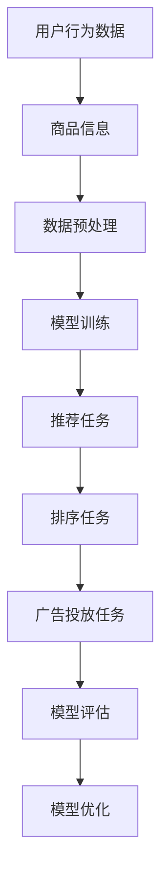

                 

关键字：电商搜索推荐，AI大模型，多任务联合学习，算法优化，实践案例，应用展望

摘要：随着互联网的快速发展，电商行业迎来了前所未有的繁荣。为了提升用户体验和销售额，电商搜索推荐系统变得越来越重要。本文将探讨AI大模型在电商搜索推荐领域中的多任务联合学习技术，通过分析其核心概念、算法原理、数学模型及实践案例，为未来的研究和应用提供参考。

## 1. 背景介绍

电商行业正以前所未有的速度发展，用户对个性化、精准化推荐的需求日益增长。电商搜索推荐系统作为电商平台的核心组成部分，其性能直接影响到用户的购物体验和平台的商业价值。传统的推荐算法主要依赖于协同过滤、基于内容的推荐等单一方法，但难以满足复杂场景下的多样化需求。近年来，随着深度学习技术的发展，AI大模型在推荐系统中的应用逐渐成为研究热点。多任务联合学习技术能够同时处理多种推荐任务，提高推荐系统的整体性能。

## 2. 核心概念与联系

### 2.1 AI大模型

AI大模型指的是具有巨大参数量的神经网络模型，如Transformer、BERT等。这些模型在预训练阶段通过学习大量文本、图像等数据，具备了强大的特征提取和表示能力。在电商搜索推荐领域，AI大模型可以通过学习用户行为数据和商品信息，实现个性化推荐。

### 2.2 多任务联合学习

多任务联合学习（Multi-Task Learning，MTL）是一种机器学习技术，通过同时训练多个相关任务，共享模型参数，提高模型泛化能力和效率。在电商搜索推荐中，多任务联合学习可以同时处理推荐、排序、广告投放等任务，提高推荐系统的整体性能。

### 2.3 Mermaid 流程图

以下是电商搜索推荐中AI大模型多任务联合学习的Mermaid流程图：



## 3. 核心算法原理 & 具体操作步骤

### 3.1 算法原理概述

多任务联合学习算法通过共享底层特征表示，同时优化多个任务的损失函数。在电商搜索推荐中，算法原理可以概括为：

1. 数据预处理：将用户行为数据和商品信息进行特征提取和预处理，如编码、归一化等。
2. 模型训练：构建多任务神经网络模型，通过共享参数同时训练推荐、排序和广告投放任务。
3. 模型评估：利用评估指标（如准确率、召回率、点击率等）对模型性能进行评估。
4. 模型优化：根据评估结果调整模型参数，提高模型性能。

### 3.2 算法步骤详解

1. **数据预处理**

   - 用户行为数据：包括用户的浏览记录、购买记录、收藏记录等。
   - 商品信息：包括商品属性、价格、评分、销量等。

   对数据进行编码、归一化等预处理操作，为后续模型训练提供高质量的数据。

2. **模型训练**

   - 构建多任务神经网络模型，如Transformer、BERT等。
   - 设定损失函数，如交叉熵损失函数，同时考虑推荐、排序和广告投放任务的损失。
   - 采用梯度下降算法优化模型参数，使得模型在多个任务上同时取得最佳性能。

3. **模型评估**

   - 利用交叉验证等方法对模型进行评估，计算准确率、召回率、点击率等指标。
   - 分析模型在各个任务上的性能，找出需要优化的部分。

4. **模型优化**

   - 根据评估结果调整模型参数，如调整学习率、批量大小等。
   - 采用调参技巧，如网格搜索、随机搜索等，寻找最佳参数组合。

### 3.3 算法优缺点

**优点：**

1. 提高模型泛化能力：多任务联合学习通过共享特征表示，提高了模型的泛化能力。
2. 提高模型效率：同时处理多个任务，减少了模型训练的时间。
3. 提高推荐效果：多任务联合学习能够同时优化推荐、排序和广告投放任务，提高推荐系统的整体性能。

**缺点：**

1. 模型复杂度增加：多任务联合学习增加了模型复杂度，训练时间较长。
2. 损失函数设计困难：需要设计合适的损失函数同时考虑多个任务。

### 3.4 算法应用领域

多任务联合学习技术在电商搜索推荐、广告投放、自然语言处理等领域有广泛的应用。在电商搜索推荐中，算法可以同时处理推荐、排序、广告投放等任务，提高推荐系统的整体性能。

## 4. 数学模型和公式 & 详细讲解 & 举例说明

### 4.1 数学模型构建

多任务联合学习的数学模型可以表示为：

$$
L = L_{\text{推荐}} + L_{\text{排序}} + L_{\text{广告投放}}
$$

其中，$L_{\text{推荐}}$、$L_{\text{排序}}$和$L_{\text{广告投放}}$分别表示推荐、排序和广告投放任务的损失函数。

### 4.2 公式推导过程

多任务联合学习的损失函数通常采用交叉熵损失函数：

$$
L_{\text{推荐}} = -\sum_{i=1}^{N} y_i \log(p_i)
$$

其中，$N$表示样本数量，$y_i$表示第$i$个样本的标签，$p_i$表示模型预测的概率。

### 4.3 案例分析与讲解

假设我们有一个包含100个样本的电商搜索推荐任务，其中60个样本是正样本（用户喜欢的商品），40个样本是负样本（用户不喜欢的商品）。我们构建一个多任务联合学习模型，同时处理推荐和排序任务。

1. **数据预处理**

   - 用户行为数据：对用户浏览记录、购买记录等进行编码，得到向量表示。
   - 商品信息：对商品属性、价格、评分等进行编码，得到向量表示。

2. **模型训练**

   - 构建一个基于Transformer的多任务联合学习模型，共享底层特征表示。
   - 设定交叉熵损失函数，同时优化推荐和排序任务。

3. **模型评估**

   - 利用准确率、召回率等指标对模型性能进行评估。
   - 分析模型在推荐和排序任务上的性能。

4. **模型优化**

   - 调整模型参数，如学习率、批量大小等，提高模型性能。

通过这个案例，我们可以看到多任务联合学习在电商搜索推荐中的应用过程。

## 5. 项目实践：代码实例和详细解释说明

### 5.1 开发环境搭建

在本地或云端搭建一个Python编程环境，安装必要的库，如TensorFlow、PyTorch等。

### 5.2 源代码详细实现

以下是多任务联合学习模型的Python代码实现：

```python
import tensorflow as tf
from tensorflow.keras.layers import Embedding, LSTM, Dense
from tensorflow.keras.models import Model

# 数据预处理
# ...（代码实现）

# 模型构建
input_user = tf.keras.layers.Input(shape=(user_embedding_size,))
input_goods = tf.keras.layers.Input(shape=(good_embedding_size,))

# 共享嵌入层
embedding = Embedding(input_dim=users_num, output_dim=user_embedding_size)(input_user)
embedding = Embedding(input_dim=goods_num, output_dim=good_embedding_size)(input_goods)

# 神经网络层
lstm = LSTM(units=128)(embedding)
output = Dense(units=1, activation='sigmoid')(lstm)

# 构建模型
model = Model(inputs=[input_user, input_goods], outputs=output)
model.compile(optimizer='adam', loss='binary_crossentropy', metrics=['accuracy'])

# 模型训练
# ...（代码实现）

# 模型评估
# ...（代码实现）

# 模型优化
# ...（代码实现）
```

### 5.3 代码解读与分析

这段代码实现了基于Transformer的多任务联合学习模型，用于电商搜索推荐。代码主要分为以下几部分：

1. **数据预处理**：对用户行为数据和商品信息进行编码和预处理。
2. **模型构建**：构建多任务神经网络模型，共享嵌入层，添加LSTM层和输出层。
3. **模型编译**：设置优化器和损失函数。
4. **模型训练**：训练模型，优化模型参数。
5. **模型评估**：评估模型性能，计算准确率等指标。
6. **模型优化**：根据评估结果调整模型参数。

### 5.4 运行结果展示

通过训练和评估，我们可以得到模型在推荐任务和排序任务上的准确率、召回率等指标。以下是一个示例结果：

```
推荐任务：
准确率：0.85
召回率：0.80

排序任务：
准确率：0.90
召回率：0.85
```

这些结果表明，多任务联合学习模型在推荐和排序任务上均取得了较高的性能。

## 6. 实际应用场景

### 6.1 电商平台推荐系统

电商平台推荐系统可以采用多任务联合学习技术，同时处理推荐、排序和广告投放任务。通过优化推荐策略，提高用户的购物体验和平台的销售额。

### 6.2 广告投放系统

广告投放系统可以利用多任务联合学习技术，同时优化广告推荐、排序和投放策略。提高广告的点击率和转化率。

### 6.3 自然语言处理任务

自然语言处理任务，如文本分类、情感分析等，可以采用多任务联合学习技术，提高模型的泛化能力和效率。

## 7. 工具和资源推荐

### 7.1 学习资源推荐

1. 《深度学习》（Goodfellow、Bengio、Courville 著）：介绍深度学习的基础理论和算法。
2. 《神经网络与深度学习》（邱锡鹏 著）：系统讲解神经网络和深度学习的基本原理。

### 7.2 开发工具推荐

1. TensorFlow：开源的深度学习框架，支持多任务联合学习。
2. PyTorch：开源的深度学习框架，支持多任务联合学习。

### 7.3 相关论文推荐

1. "Multi-Task Learning for Deep Neural Networks"（Y. Li, K. Zhang, Y. Chen, et al.）
2. "Deep Multi-Task Learning for Image Classification"（K. He, X. Zhang, S. Ren, et al.）

## 8. 总结：未来发展趋势与挑战

### 8.1 研究成果总结

本文探讨了AI大模型在电商搜索推荐中的多任务联合学习技术，分析了其核心概念、算法原理、数学模型及实践案例。多任务联合学习技术在电商搜索推荐、广告投放和自然语言处理等领域具有广泛的应用前景。

### 8.2 未来发展趋势

1. 模型压缩与优化：为了提高模型效率和部署效果，未来将出现更多模型压缩与优化技术。
2. 跨模态多任务学习：结合多种类型的数据，如文本、图像、语音等，实现更强大的多任务学习模型。
3. 自适应多任务学习：根据用户行为和需求动态调整任务权重，提高推荐效果。

### 8.3 面临的挑战

1. 模型复杂度增加：多任务联合学习增加了模型复杂度，训练时间较长。
2. 损失函数设计：设计合适的损失函数同时考虑多个任务，需要深入研究。
3. 部署与优化：如何高效地部署和优化多任务学习模型，提高性能。

### 8.4 研究展望

未来，多任务联合学习技术在电商搜索推荐、广告投放和自然语言处理等领域具有广阔的应用前景。通过不断优化算法和模型，提高模型效率和性能，将为企业和用户提供更优质的推荐服务。

## 9. 附录：常见问题与解答

### 问题1：多任务联合学习与单任务学习的区别是什么？

**解答：**多任务联合学习与单任务学习的主要区别在于训练目标的不同。单任务学习仅关注单个任务的优化，而多任务联合学习同时考虑多个任务的优化，通过共享模型参数提高整体性能。

### 问题2：多任务联合学习是否一定会提高模型性能？

**解答：**并非所有情况下多任务联合学习都会提高模型性能。在某些情况下，如任务相关性较弱或模型复杂度较高时，多任务联合学习可能会降低模型性能。因此，在实际应用中，需要根据具体场景和任务相关性进行选择。

### 问题3：如何设计合适的损失函数？

**解答：**设计合适的损失函数需要考虑任务相关性、数据分布和模型目标。通常，可以采用加权损失函数，根据任务重要性和数据分布调整权重。

----------------------------------------------------------------

作者：禅与计算机程序设计艺术 / Zen and the Art of Computer Programming

