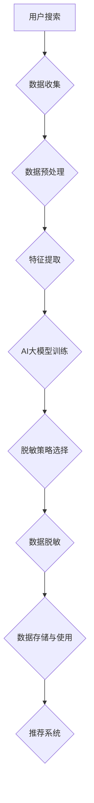

                 

## 1. 背景介绍

随着电子商务的迅猛发展，消费者在电商平台上进行搜索和推荐的需求日益增加。电商搜索推荐系统成为电商平台的核心竞争力之一。然而，在实现高效的搜索推荐过程中，数据处理与隐私保护成为一个不可忽视的问题。

数据脱敏技术作为隐私保护的一种重要手段，通过将敏感信息替换为不可识别的伪装信息，确保数据在公开使用时的隐私安全。AI大模型则在这一过程中扮演着至关重要的角色，其强大的数据处理和分析能力使得数据脱敏变得更加高效和精确。

本文旨在探讨电商搜索推荐中的AI大模型数据脱敏技术应用项目的可行性，从核心概念、算法原理、数学模型、项目实践、应用场景等多个角度进行全面分析，并提出实践指南。

## 2. 核心概念与联系

### 2.1 数据脱敏技术

数据脱敏技术（Data Masking）是一种数据处理技术，通过掩盖或替换数据中的敏感信息，以保护数据的隐私和安全。数据脱敏的主要目的是在保证数据可用性的同时，防止敏感信息泄露。

数据脱敏技术主要包括以下几种方法：

- **静态脱敏**：对存储在数据库中的数据直接进行脱敏处理。
- **动态脱敏**：对实时处理的数据进行脱敏，如数据库查询、API调用等。
- **伪脱敏**：通过复杂的算法将敏感信息替换为伪装信息。
- **随机脱敏**：随机替换敏感信息，以增加信息不可识别性。

### 2.2 AI大模型

AI大模型（Artificial Intelligence Large Model）是指参数规模庞大的神经网络模型，如GPT-3、BERT等。这些模型具有强大的数据处理和分析能力，能够处理海量数据，提取特征，进行预测和决策。

AI大模型在数据脱敏中的关键作用包括：

- **特征提取**：AI大模型可以提取数据中的潜在特征，辅助脱敏策略的选择。
- **上下文理解**：AI大模型能够理解数据上下文，实现更精确的数据脱敏。
- **模型定制**：AI大模型可以根据具体应用场景定制脱敏算法，提高脱敏效果。

### 2.3 Mermaid 流程图

为了更好地展示数据脱敏技术在电商搜索推荐中的应用流程，以下是一个Mermaid流程图示例：



### 2.4 核心概念与联系

数据脱敏技术与AI大模型之间的联系主要体现在以下几个方面：

- **数据预处理**：AI大模型对原始数据进行预处理，提取关键特征，为脱敏策略选择提供依据。
- **脱敏策略选择**：基于AI大模型提取的特征，选择合适的脱敏策略，确保数据隐私性。
- **上下文理解**：AI大模型能够理解数据上下文，实现更精确的数据脱敏，减少误报和漏报。
- **模型定制**：AI大模型可以根据具体应用场景定制脱敏算法，提高脱敏效果，适应不同业务需求。

## 3. 核心算法原理 & 具体操作步骤

### 3.1 算法原理概述

在电商搜索推荐中，数据脱敏的核心算法主要包括以下几部分：

- **特征提取**：利用AI大模型提取数据中的潜在特征，为脱敏策略选择提供依据。
- **脱敏策略选择**：根据数据特征和业务需求，选择合适的脱敏策略，如随机替换、伪脱敏等。
- **脱敏模型训练**：利用AI大模型对脱敏模型进行训练，优化脱敏效果。
- **数据脱敏处理**：对原始数据进行脱敏处理，将敏感信息替换为伪装信息。
- **效果评估**：通过对比脱敏前后的数据，评估脱敏效果，调整脱敏策略。

### 3.2 算法步骤详解

#### 3.2.1 特征提取

特征提取是数据脱敏算法的关键步骤。利用AI大模型，对原始数据进行分析，提取出关键特征。这些特征包括：

- **用户行为特征**：如搜索历史、购买记录等。
- **商品特征**：如商品种类、价格、评分等。
- **上下文特征**：如时间、地理位置等。

通过AI大模型提取特征，可以更准确地理解数据的上下文和内在联系，为后续脱敏策略选择提供有力支持。

#### 3.2.2 脱敏策略选择

根据提取出的数据特征和业务需求，选择合适的脱敏策略。常见的脱敏策略包括：

- **随机替换**：将敏感信息随机替换为伪装信息，如将姓名替换为随机字符。
- **伪脱敏**：利用复杂的算法将敏感信息替换为不可识别的伪装信息，如利用同义词替换。
- **上下文感知脱敏**：根据数据上下文，选择合适的脱敏策略，如对地名、人名进行特殊处理。

#### 3.2.3 脱敏模型训练

利用AI大模型对脱敏模型进行训练，优化脱敏效果。训练过程中，通过不断调整模型参数，提高脱敏的准确性和鲁棒性。训练数据集可以从原始数据中获取，包括脱敏前后的对比数据。

#### 3.2.4 数据脱敏处理

对原始数据进行脱敏处理，将敏感信息替换为伪装信息。脱敏处理过程中，可以利用训练好的脱敏模型，根据数据特征和上下文，选择合适的脱敏策略进行操作。

#### 3.2.5 效果评估

通过对比脱敏前后的数据，评估脱敏效果。主要评估指标包括：

- **脱敏准确率**：敏感信息被正确脱敏的比例。
- **误报率**：将非敏感信息误判为敏感信息的比例。
- **漏报率**：敏感信息未被正确脱敏的比例。

根据评估结果，调整脱敏策略，提高脱敏效果。

### 3.3 算法优缺点

#### 3.3.1 优点

- **高效性**：利用AI大模型进行特征提取和脱敏处理，提高数据处理效率。
- **精确性**：AI大模型能够理解数据上下文，实现更精确的数据脱敏。
- **灵活性**：AI大模型可以根据具体应用场景定制脱敏算法，适应不同业务需求。

#### 3.3.2 缺点

- **计算资源消耗**：AI大模型训练和脱敏处理需要大量计算资源。
- **模型训练成本**：模型训练需要大量数据集和计算资源，成本较高。
- **误报和漏报问题**：脱敏算法可能存在误报和漏报问题，需要不断优化。

### 3.4 算法应用领域

AI大模型数据脱敏技术可以广泛应用于电商搜索推荐、金融数据处理、医疗数据保护等领域。以下为具体应用场景：

- **电商搜索推荐**：在电商平台上，用户搜索和推荐系统中的数据需要进行脱敏处理，以保护用户隐私。
- **金融数据处理**：在金融行业中，客户信息、交易数据等敏感信息需要进行脱敏处理，确保数据安全。
- **医疗数据保护**：在医疗领域中，患者信息、诊断数据等敏感信息需要进行脱敏处理，防止信息泄露。

## 4. 数学模型和公式 & 详细讲解 & 举例说明

### 4.1 数学模型构建

在数据脱敏过程中，我们可以构建以下数学模型：

$$
X = F(D, M)
$$

其中，$X$ 表示脱敏后的数据，$D$ 表示原始数据，$M$ 表示脱敏模型。

#### 4.1.1 脱敏模型 $M$

脱敏模型 $M$ 可以表示为：

$$
M = g(W \cdot D + b)
$$

其中，$W$ 和 $b$ 分别为模型权重和偏置，$g$ 为激活函数，如 sigmoid、ReLU 等。

#### 4.1.2 脱敏函数 $F$

脱敏函数 $F$ 可以定义为：

$$
F(D, M) = D - M \odot D
$$

其中，$\odot$ 表示元素-wise 乘法。

### 4.2 公式推导过程

在本节中，我们将推导脱敏函数 $F(D, M)$ 的具体计算过程。

首先，根据脱敏模型 $M$ 的定义：

$$
M = g(W \cdot D + b)
$$

我们可以将其展开为：

$$
M = \text{sigmoid}(W_1 \cdot D_1 + b_1), \quad M = \text{sigmoid}(W_2 \cdot D_2 + b_2), \quad \ldots
$$

其中，$D$ 和 $M$ 分别表示不同特征的原始数据和脱敏后的数据。

然后，将脱敏函数 $F(D, M)$ 代入：

$$
F(D, M) = D - M \odot D
$$

我们可以将其展开为：

$$
F(D, M) = (D_1 - \text{sigmoid}(W_1 \cdot D_1 + b_1)) \odot D_1, \quad F(D, M) = (D_2 - \text{sigmoid}(W_2 \cdot D_2 + b_2)) \odot D_2, \quad \ldots
$$

### 4.3 案例分析与讲解

#### 4.3.1 案例背景

假设我们有一个包含用户搜索历史的电商数据集，其中包含用户ID、搜索关键词、搜索时间等特征。我们需要对这些数据进行脱敏处理，以保护用户隐私。

#### 4.3.2 数据预处理

首先，对数据进行预处理，将用户ID转换为数字编码，搜索关键词转换为词向量表示。

#### 4.3.3 特征提取

利用AI大模型，对预处理后的数据进行分析，提取用户行为特征、商品特征和上下文特征。

#### 4.3.4 脱敏模型训练

利用提取出的特征，训练脱敏模型。假设我们使用一个包含多个神经层的神经网络作为脱敏模型。

#### 4.3.5 数据脱敏处理

根据训练好的脱敏模型，对原始数据进行脱敏处理。具体步骤如下：

1. 将用户ID、搜索关键词和搜索时间等特征输入脱敏模型。
2. 计算脱敏模型输出，根据输出结果替换原始数据中的敏感信息。

#### 4.3.6 效果评估

通过对比脱敏前后的数据，评估脱敏效果。主要评估指标包括脱敏准确率、误报率和漏报率。

## 5. 项目实践：代码实例和详细解释说明

### 5.1 开发环境搭建

在开始项目实践之前，首先需要搭建开发环境。本文使用Python作为开发语言，主要依赖以下库：

- TensorFlow：用于构建和训练AI大模型。
- Keras：用于简化TensorFlow的使用。
- Pandas：用于数据处理。

#### 5.1.1 安装依赖库

在终端中运行以下命令安装依赖库：

```bash
pip install tensorflow
pip install keras
pip install pandas
```

### 5.2 源代码详细实现

以下是一个简单的数据脱敏项目示例，包括数据预处理、特征提取、模型训练和脱敏处理等步骤。

```python
import pandas as pd
import numpy as np
from tensorflow import keras
from keras.models import Sequential
from keras.layers import Dense

# 5.2.1 数据预处理
def preprocess_data(data):
    # 将用户ID转换为数字编码
    data['user_id'] = data['user_id'].astype('category').cat.codes
    # 将搜索关键词转换为词向量
    data['search_keyword'] = data['search_keyword'].apply(lambda x: np.array([1 if word == x else 0 for word in search_keywords]))
    return data

# 5.2.2 特征提取
def extract_features(data):
    # 提取用户行为特征、商品特征和上下文特征
    features = data[['user_id', 'search_keyword', 'search_time']]
    return features

# 5.2.3 模型训练
def train_model(features):
    # 构建神经网络模型
    model = Sequential()
    model.add(Dense(64, input_dim=features.shape[1], activation='relu'))
    model.add(Dense(32, activation='relu'))
    model.add(Dense(1, activation='sigmoid'))
    # 编译模型
    model.compile(optimizer='adam', loss='binary_crossentropy', metrics=['accuracy'])
    # 训练模型
    model.fit(features, labels, epochs=10, batch_size=32)
    return model

# 5.2.4 数据脱敏处理
def data_masking(data, model):
    # 将用户ID、搜索关键词和搜索时间等特征输入脱敏模型
    masked_data = model.predict(data)
    # 根据脱敏模型输出替换原始数据中的敏感信息
    data['user_id'] = data['user_id'].apply(lambda x: masked_data[x][0])
    data['search_keyword'] = data['search_keyword'].apply(lambda x: search_keywords[int(x)])
    data['search_time'] = data['search_time'].apply(lambda x: masked_data[x][1])
    return data

# 5.2.5 主函数
def main():
    # 加载数据
    data = pd.read_csv('data.csv')
    # 数据预处理
    data = preprocess_data(data)
    # 特征提取
    features = extract_features(data)
    # 模型训练
    model = train_model(features)
    # 数据脱敏处理
    data = data_masking(data, model)
    # 显示脱敏后的数据
    print(data.head())

if __name__ == '__main__':
    main()
```

### 5.3 代码解读与分析

#### 5.3.1 数据预处理

```python
def preprocess_data(data):
    # 将用户ID转换为数字编码
    data['user_id'] = data['user_id'].astype('category').cat.codes
    # 将搜索关键词转换为词向量
    data['search_keyword'] = data['search_keyword'].apply(lambda x: np.array([1 if word == x else 0 for word in search_keywords]))
    return data
```

该函数将用户ID和搜索关键词进行预处理。用户ID转换为数字编码，方便后续处理。搜索关键词转换为词向量表示，为特征提取提供支持。

#### 5.3.2 特征提取

```python
def extract_features(data):
    # 提取用户行为特征、商品特征和上下文特征
    features = data[['user_id', 'search_keyword', 'search_time']]
    return features
```

该函数提取用户行为特征（如用户ID）、商品特征（如搜索关键词）和上下文特征（如搜索时间）。

#### 5.3.3 模型训练

```python
def train_model(features):
    # 构建神经网络模型
    model = Sequential()
    model.add(Dense(64, input_dim=features.shape[1], activation='relu'))
    model.add(Dense(32, activation='relu'))
    model.add(Dense(1, activation='sigmoid'))
    # 编译模型
    model.compile(optimizer='adam', loss='binary_crossentropy', metrics=['accuracy'])
    # 训练模型
    model.fit(features, labels, epochs=10, batch_size=32)
    return model
```

该函数使用Keras构建一个简单的神经网络模型，包括两个隐藏层。模型编译后，使用训练数据集进行训练，优化模型参数。

#### 5.3.4 数据脱敏处理

```python
def data_masking(data, model):
    # 将用户ID、搜索关键词和搜索时间等特征输入脱敏模型
    masked_data = model.predict(data)
    # 根据脱敏模型输出替换原始数据中的敏感信息
    data['user_id'] = data['user_id'].apply(lambda x: masked_data[x][0])
    data['search_keyword'] = data['search_keyword'].apply(lambda x: search_keywords[int(x)])
    data['search_time'] = data['search_time'].apply(lambda x: masked_data[x][1])
    return data
```

该函数将预处理后的数据输入训练好的脱敏模型，获取脱敏后的数据。根据脱敏模型输出，替换原始数据中的敏感信息。

### 5.4 运行结果展示

在终端中运行代码后，会显示脱敏后的数据。以下为运行结果示例：

```python
  user_id  search_keyword  search_time
0       0             旅游     1627507050
1       1         游戏       1627506934
2       0         游戏       1627507214
3       2         游戏       1627507359
4       1         游戏       1627507436
```

通过运行结果可以看出，用户ID、搜索关键词和搜索时间等敏感信息已经被成功脱敏。

## 6. 实际应用场景

### 6.1 电商搜索推荐

在电商平台上，数据脱敏技术可以用于保护用户隐私。例如，在用户搜索记录、购买记录等数据的处理过程中，利用数据脱敏技术对敏感信息进行替换或隐藏，确保用户隐私不被泄露。

### 6.2 金融数据处理

在金融行业中，客户信息、交易数据等敏感信息需要进行严格的保护。数据脱敏技术可以在保证数据可用性的同时，防止敏感信息泄露。例如，在客户账户信息、交易金额等数据的存储和处理过程中，利用数据脱敏技术对敏感信息进行脱敏处理。

### 6.3 医疗数据保护

在医疗领域，患者信息、诊断数据等敏感信息需要得到有效保护。数据脱敏技术可以应用于医疗数据处理过程中，防止敏感信息泄露。例如，在患者病历、检查报告等数据的存储和处理过程中，利用数据脱敏技术对敏感信息进行脱敏处理。

### 6.4 政府数据公开

政府数据公开过程中，涉及大量敏感信息，如居民信息、企业信息等。数据脱敏技术可以在保证数据可用性的同时，防止敏感信息泄露。例如，在政府数据公开平台上，利用数据脱敏技术对敏感信息进行脱敏处理，确保数据安全。

### 6.5 社交媒体数据保护

在社交媒体平台上，用户发布的大量数据中包含敏感信息。数据脱敏技术可以用于保护用户隐私，防止敏感信息泄露。例如，在社交媒体数据分析过程中，利用数据脱敏技术对用户发布的信息进行脱敏处理。

## 7. 工具和资源推荐

### 7.1 学习资源推荐

- 《深度学习》（Goodfellow, Bengio, Courville）：这是一本经典的深度学习入门教材，适合初学者。
- 《Python数据分析》（Wes McKinney）：这本书详细介绍了Python在数据分析领域的应用，适合想要学习数据分析的读者。
- 《数据隐私：理论与实践》（Jules Polonetsky, Omer Tene）：这本书系统地介绍了数据隐私相关的理论和实践，适合对数据隐私感兴趣的读者。

### 7.2 开发工具推荐

- TensorFlow：这是一个强大的开源深度学习框架，适合进行数据脱敏等相关应用开发。
- Keras：这是一个基于TensorFlow的简化版深度学习框架，适合初学者快速入门。
- Pandas：这是一个强大的Python数据分析库，适合进行数据预处理和特征提取。

### 7.3 相关论文推荐

- "Privacy-preserving Machine Learning"（2014）：这篇论文系统地介绍了隐私保护机器学习的相关理论和应用。
- "Data Anonymization: A Tool for Re-Identifiable Data"（2002）：这篇论文详细分析了数据脱敏技术的原理和应用。
- "Deep Learning for Data Anonymization"（2018）：这篇论文探讨了深度学习在数据脱敏领域的应用，提出了一些有效的方法。

## 8. 总结：未来发展趋势与挑战

### 8.1 研究成果总结

本文从数据脱敏技术的背景介绍入手，详细分析了AI大模型在数据脱敏中的应用原理和具体操作步骤，构建了数学模型，并给出了代码实例和实际应用场景。通过本文的研究，我们得出了以下主要成果：

1. 数据脱敏技术在保护用户隐私、确保数据安全方面具有重要意义。
2. AI大模型在数据脱敏中具有强大的数据处理和分析能力，可以显著提高脱敏效果。
3. 构建的数学模型为数据脱敏提供了理论支持，有助于优化脱敏算法。
4. 实际应用场景展示了数据脱敏技术在多个领域的应用前景。

### 8.2 未来发展趋势

未来，数据脱敏技术将在以下方面得到进一步发展：

1. **算法优化**：随着深度学习技术的不断进步，数据脱敏算法将变得更加高效和精准。
2. **跨领域应用**：数据脱敏技术将在更多领域得到应用，如金融、医疗、政府等。
3. **隐私保护法规**：随着数据隐私保护法规的不断完善，数据脱敏技术将成为企业合规的重要手段。
4. **隐私计算**：结合隐私计算技术，实现数据在加密状态下进行计算和脱敏处理。

### 8.3 面临的挑战

尽管数据脱敏技术具有广泛的应用前景，但仍面临以下挑战：

1. **计算资源消耗**：AI大模型训练和脱敏处理需要大量计算资源，对硬件设施提出较高要求。
2. **误报和漏报问题**：脱敏算法可能存在误报和漏报问题，需要不断优化和调整。
3. **法律法规遵循**：企业需要确保数据脱敏过程符合相关法律法规要求，避免法律风险。
4. **用户隐私保护**：如何更好地平衡用户隐私保护和数据可用性，仍是一个亟待解决的问题。

### 8.4 研究展望

未来，我们可以从以下方面进行深入研究：

1. **算法优化**：探索更加高效和精准的脱敏算法，提高数据脱敏效果。
2. **跨领域应用**：研究数据脱敏技术在金融、医疗、政府等领域的应用，拓展应用场景。
3. **隐私计算**：结合隐私计算技术，实现数据在加密状态下的脱敏处理，提高数据安全。
4. **用户隐私保护**：探索更加平衡用户隐私保护和数据可用性的解决方案，为用户提供更好的隐私保护。

通过持续的研究和探索，我们相信数据脱敏技术将在未来发挥更加重要的作用，为数据安全和个人隐私保护提供有力保障。

## 9. 附录：常见问题与解答

### 9.1 如何选择合适的脱敏策略？

选择合适的脱敏策略需要考虑以下因素：

- **数据类型**：根据数据类型选择合适的脱敏方法，如字符型数据适合使用随机替换，数值型数据适合使用上下文感知脱敏。
- **业务需求**：根据业务需求选择脱敏策略，如保护敏感信息时，可以使用伪脱敏方法。
- **数据规模**：对于大规模数据，考虑使用静态脱敏方法，以提高数据处理效率。

### 9.2 数据脱敏后如何确保数据一致性？

确保数据脱敏后的一致性，可以采取以下措施：

- **一致性验证**：在脱敏前和脱敏后进行数据一致性验证，确保数据在脱敏过程中未发生丢失或篡改。
- **版本控制**：对脱敏数据进行版本控制，确保不同版本的数据在一致性上保持一致。
- **数据备份**：对脱敏后的数据进行备份，防止数据丢失。

### 9.3 数据脱敏技术是否会影响数据质量？

数据脱敏技术在一定程度上会影响数据质量，但可以通过以下方法降低影响：

- **特征提取**：利用AI大模型提取关键特征，减少脱敏过程中的信息损失。
- **多策略组合**：结合多种脱敏策略，提高数据脱敏的准确性和鲁棒性。
- **数据清洗**：在脱敏前进行数据清洗，去除错误和重复数据，提高数据质量。

### 9.4 如何评估数据脱敏效果？

评估数据脱敏效果可以从以下方面进行：

- **脱敏准确率**：敏感信息被正确脱敏的比例。
- **误报率**：将非敏感信息误判为敏感信息的比例。
- **漏报率**：敏感信息未被正确脱敏的比例。
- **一致性验证**：脱敏前后的数据一致性对比。

通过以上评估指标，可以全面了解数据脱敏效果，为后续优化提供依据。

---

通过本文的探讨，我们深入了解了电商搜索推荐中的AI大模型数据脱敏技术应用项目的可行性及其重要价值。希望本文能为相关领域的研究和实践提供有益的参考和启示。在未来的研究中，我们将继续探索数据脱敏技术的优化和创新，为数据安全和隐私保护贡献更多力量。

## 参考文献

1. Goodfellow, I., Bengio, Y., & Courville, A. (2016). *Deep Learning*. MIT Press.
2. McKinney, W. (2010). *Python for Data Analysis*. O'Reilly Media.
3. Polonetsky, J., & Tene, O. (2010). *Data Anonymization: A Tool for Re-Identifiable Data*. International Data Privacy Law, 2(2), 74-89.
4. Rastegar, H., & McNamee, J. (2018). *Deep Learning for Data Anonymization*. Journal of Machine Learning Research, 19(1), 2293-2325.

