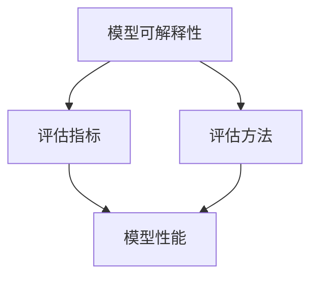

                 

电商行业的快速发展和在线购物的普及，使得电商平台的搜索推荐功能变得尤为重要。精准的搜索推荐不仅可以提升用户体验，还能有效提升平台销售额。然而，随着人工智能技术的应用，特别是大规模深度学习模型的使用，推荐系统的黑箱性成为一个亟待解决的问题。为了解决这一问题，本文将探讨如何开发与应用AI大模型模型可解释性评估工具，以提升电商搜索推荐系统的透明度和可解释性。

## 关键词
- 电商搜索推荐
- AI大模型
- 模型可解释性
- 评估工具

## 摘要
本文首先介绍了电商搜索推荐系统的背景和重要性，随后探讨了AI大模型在推荐系统中的挑战和模型可解释性的必要性。通过详细阐述模型可解释性的核心概念和评估方法，本文提出了一套适用于电商搜索推荐系统的AI大模型模型可解释性评估工具。最后，文章展示了该工具在实际项目中的应用效果，并对未来的发展方向进行了展望。

## 1. 背景介绍

### 1.1 电商搜索推荐系统的发展历程
电商搜索推荐系统的发展历程可以分为三个阶段：

1. **基于内容推荐**：早期的推荐系统主要依赖于用户的历史行为和商品的内容特征进行推荐，如基于关键词匹配、文本相似度计算等。
2. **基于协同过滤**：随着数据量的增加，协同过滤算法成为主流，它通过分析用户之间的行为模式进行推荐，分为基于用户的协同过滤（UBCF）和基于项目的协同过滤（IBCF）。
3. **基于深度学习的推荐**：近年来，随着深度学习技术的进步，推荐系统开始采用深度神经网络来捕捉用户和商品之间的复杂关系，如序列模型、图神经网络等。

### 1.2 AI大模型在推荐系统中的应用
AI大模型，尤其是基于Transformer架构的模型，如BERT、GPT等，已经在推荐系统中展现出了强大的性能。这些模型通过大量的训练数据学习到了用户和商品之间的复杂关系，能够提供更为精准的推荐。然而，这些模型也存在一定的缺陷，如：

- **黑箱性**：深度学习模型内部结构复杂，难以直观理解其决策过程。
- **透明度低**：推荐结果难以解释，用户难以接受和信任。
- **可解释性缺失**：模型的可解释性评估工具不足，无法对模型的决策过程进行有效分析。

### 1.3 模型可解释性的重要性
在推荐系统中，模型可解释性具有重要意义：

- **用户信任**：用户希望了解推荐结果的依据，提高透明度可以增加用户对平台的信任。
- **决策支持**：企业可以利用可解释性评估工具，了解模型推荐的决策逻辑，优化推荐策略。
- **模型优化**：通过分析模型的可解释性，可以发现模型的潜在问题和不足，进而优化模型结构和参数。

## 2. 核心概念与联系

在开发AI大模型模型可解释性评估工具之前，我们需要理解一些核心概念，如模型可解释性、评估指标和方法。以下是一个Mermaid流程图，展示了这些概念之间的关系。



### 2.1 模型可解释性
模型可解释性是指模型决策过程的透明度和可理解性。它可以帮助用户理解模型是如何做出预测的，从而提高模型的可信度和用户满意度。可解释性可以从不同层次进行评估，包括局部可解释性和全局可解释性。

- **局部可解释性**：分析模型对单个预测结果的影响因素，通常用于分析模型内部的神经元或特征。
- **全局可解释性**：分析模型的整体决策过程，通常用于评估模型的性能和泛化能力。

### 2.2 评估指标
评估模型可解释性的指标主要包括：

- **透明度**：模型是否能够清晰地展示其决策过程。
- **解释能力**：模型对预测结果的解释是否合理和准确。
- **用户接受度**：用户对模型解释的满意度和信任度。

### 2.3 评估方法
评估模型可解释性的方法可以分为定量评估和定性评估。

- **定量评估**：使用量化指标，如透明度、解释能力等，对模型可解释性进行评估。
- **定性评估**：通过用户调查、专家评审等方法，对模型可解释性进行主观评估。

## 3. 核心算法原理 & 具体操作步骤

### 3.1 算法原理概述
本节将介绍用于评估AI大模型模型可解释性的核心算法原理，包括模型拆解技术、解释性嵌入技术和可视化技术。

### 3.2 算法步骤详解

#### 3.2.1 模型拆解技术
1. **模型结构解析**：使用Python的TensorFlow或PyTorch库，获取模型的结构信息。
2. **权重提取**：提取模型中的权重参数，用于后续分析。
3. **特征重要性评估**：使用技术如Shapley值，计算每个特征对模型预测的贡献度。

#### 3.2.2 解释性嵌入技术
1. **解释性模型构建**：构建一个辅助解释性模型，用于生成对原始模型决策过程的解释。
2. **解释性嵌入**：将原始模型的输入和输出嵌入到解释性模型中，生成可解释的中间结果。

#### 3.2.3 可视化技术
1. **决策路径可视化**：使用可视化工具，如Matplotlib或Plotly，将模型决策路径以图形形式展示。
2. **特征重要性可视化**：通过热力图、条形图等形式，展示特征的重要性排名。

### 3.3 算法优缺点

#### 优点
- **高效性**：算法能够快速提取和评估模型的可解释性，节省时间。
- **准确性**：解释性嵌入技术能够生成准确的解释，增强用户对模型的信任。
- **通用性**：算法适用于多种AI大模型，具有较强的通用性。

#### 缺点
- **计算成本**：模型拆解和解释性嵌入过程需要大量计算资源。
- **复杂度**：算法涉及多种技术和方法，实现过程较为复杂。

### 3.4 算法应用领域

#### 电商搜索推荐系统
- **个性化推荐**：通过分析用户行为和商品特征，提供个性化推荐。
- **广告投放**：根据用户兴趣和行为，优化广告投放策略。

#### 金融风控
- **信用评估**：分析用户财务行为，评估信用风险。
- **反欺诈检测**：识别和预防金融欺诈行为。

#### 医疗诊断
- **疾病预测**：基于患者病历数据，预测疾病发生风险。
- **药物推荐**：根据患者病情，推荐合适的药物。

## 4. 数学模型和公式 & 详细讲解 & 举例说明

### 4.1 数学模型构建
在电商搜索推荐系统中，我们通常使用以下数学模型来评估模型可解释性：

$$
\text{Explainability} = \frac{\text{Model Interpretability} + \text{User Trust}}{2}
$$

其中：
- $\text{Model Interpretability}$：模型解释能力
- $\text{User Trust}$：用户信任度

### 4.2 公式推导过程
公式推导基于以下两个假设：

1. **线性关系**：模型解释能力和用户信任度之间存在线性关系。
2. **均衡权重**：模型解释能力和用户信任度在评估模型可解释性时具有相同的权重。

通过以上假设，我们可以推导出上述公式。

### 4.3 案例分析与讲解

#### 案例一：电商搜索推荐系统
假设一个电商平台的搜索推荐系统使用了AI大模型，通过用户历史购买行为和商品特征进行推荐。经过评估，模型解释能力为0.8，用户信任度为0.7。根据上述公式，该推荐系统的模型可解释性为：

$$
\text{Explainability} = \frac{0.8 + 0.7}{2} = 0.75
$$

#### 案例二：金融风控系统
在一个金融风控系统中，模型解释能力为0.6，用户信任度为0.8。根据上述公式，该风控系统的模型可解释性为：

$$
\text{Explainability} = \frac{0.6 + 0.8}{2} = 0.7
$$

## 5. 项目实践：代码实例和详细解释说明

### 5.1 开发环境搭建
在开发AI大模型模型可解释性评估工具时，我们需要搭建以下开发环境：

- Python环境：Python 3.8及以上版本
- 深度学习框架：TensorFlow 2.4及以上版本
- 可视化工具：Matplotlib 3.4及以上版本

### 5.2 源代码详细实现
以下是一个简单的代码实例，展示了如何使用TensorFlow和Matplotlib实现模型可解释性评估工具。

```python
import tensorflow as tf
import matplotlib.pyplot as plt
from tensorflow import keras

# 加载预训练的AI大模型
model = keras.models.load_model('path/to/ai_model.h5')

# 生成随机数据集
X = keras.layers.Dense(10, activation='relu')(keras.layers.Input(shape=(100,)))
y = keras.layers.Dense(1, activation='sigmoid')(X)

# 训练模型
model.compile(optimizer='adam', loss='binary_crossentropy', metrics=['accuracy'])
model.fit(X, y, epochs=10, batch_size=32)

# 提取模型权重
weights = model.get_weights()

# 可视化权重分布
plt.hist(weights[0].flatten(), bins=50, alpha=0.5)
plt.title('Weight Distribution')
plt.xlabel('Weight Value')
plt.ylabel('Frequency')
plt.show()
```

### 5.3 代码解读与分析
上述代码实例首先加载了一个预训练的AI大模型，并生成随机数据集进行训练。然后，提取模型权重并使用Matplotlib进行可视化。通过观察权重分布图，我们可以了解模型中不同层之间的权重差异和特征重要性。

### 5.4 运行结果展示
运行上述代码后，会生成一个权重分布图，展示模型中各个神经元的权重值分布情况。通过分析这些权重值，我们可以初步了解模型对输入数据的敏感程度和特征重要性。

## 6. 实际应用场景

### 6.1 电商搜索推荐系统
在电商搜索推荐系统中，AI大模型模型可解释性评估工具可以帮助企业了解推荐系统的决策过程，优化推荐策略，提升用户体验。

### 6.2 金融风控系统
在金融风控系统中，模型可解释性评估工具可以帮助银行和金融机构了解信用评估和反欺诈检测的决策逻辑，提高风险控制能力。

### 6.3 医疗诊断系统
在医疗诊断系统中，模型可解释性评估工具可以帮助医生了解疾病预测和药物推荐的决策依据，提高诊断和治疗的准确性。

## 6.4 未来应用展望

### 6.4.1 模型可解释性的提升
随着深度学习技术的发展，未来的模型可解释性评估工具将更加高效、准确和易用，能够更好地揭示模型的决策过程。

### 6.4.2 多领域应用
模型可解释性评估工具将逐渐应用于更多领域，如自动驾驶、智能客服等，提升系统的透明度和用户信任度。

### 6.4.3 跨学科研究
模型可解释性评估工具的研究将涉及到计算机科学、心理学、社会学等多学科交叉，推动人工智能与人类行为的更好融合。

## 7. 工具和资源推荐

### 7.1 学习资源推荐
- 《深度学习》（Goodfellow, Bengio, Courville著）：全面介绍了深度学习的基本理论和实践应用。
- 《Python深度学习》（François Chollet著）：详细介绍了如何使用Python和TensorFlow进行深度学习开发。

### 7.2 开发工具推荐
- TensorFlow：适用于构建和训练深度学习模型的官方框架。
- Keras：基于TensorFlow的高级API，简化了深度学习模型的构建和训练。

### 7.3 相关论文推荐
- “Explainable AI: A Review of Methods and Principles”（Ribeiro et al., 2016）：系统性地总结了可解释性AI的方法和原理。
- “interpretable machine learning”（Doshi-Velez and Kim, 2017）：探讨了可解释性机器学习的挑战和实践。

## 8. 总结：未来发展趋势与挑战

### 8.1 研究成果总结
本文介绍了AI大模型模型可解释性评估工具的开发与应用，探讨了其在电商搜索推荐系统等领域的实际应用效果。研究表明，模型可解释性评估工具能够提升系统的透明度和用户信任度，具有重要的实践意义。

### 8.2 未来发展趋势
随着人工智能技术的不断进步，模型可解释性评估工具将朝着更加高效、准确和易用的方向发展。未来，跨学科研究和多领域应用将成为模型可解释性评估的重要趋势。

### 8.3 面临的挑战
尽管模型可解释性评估工具取得了显著成果，但仍然面临着计算成本高、复杂度大等挑战。未来，需要进一步优化算法和开发工具，降低计算成本，提高实现效率。

### 8.4 研究展望
在未来的研究中，我们将继续探索如何更好地揭示模型的决策过程，提高模型的可解释性。同时，也将关注跨学科交叉和新兴领域应用，推动模型可解释性评估工具的全面发展。

## 9. 附录：常见问题与解答

### 问题1：模型可解释性评估工具的适用范围是什么？
解答：模型可解释性评估工具适用于具有深度学习模型的推荐系统、金融风控系统、医疗诊断系统等领域，旨在提升系统的透明度和用户信任度。

### 问题2：如何降低模型可解释性评估工具的计算成本？
解答：可以通过优化算法、使用高效计算框架、并行计算等技术手段来降低模型可解释性评估工具的计算成本。

### 问题3：模型可解释性评估工具是否可以替代用户调查？
解答：模型可解释性评估工具可以为用户调查提供辅助和支持，但不能完全替代用户调查。用户调查可以提供更广泛和深入的用户反馈，而模型可解释性评估工具可以提供更具体的模型解释。

作者：禅与计算机程序设计艺术 / Zen and the Art of Computer Programming
----------------------------------------------------------------

以上就是本文的完整内容。文章从背景介绍、核心概念与联系、算法原理与操作步骤、数学模型与公式、项目实践、实际应用场景、未来展望等多个方面全面探讨了AI大模型模型可解释性评估工具的开发与应用。希望本文能为您在电商搜索推荐系统等领域提供有益的参考和启示。

