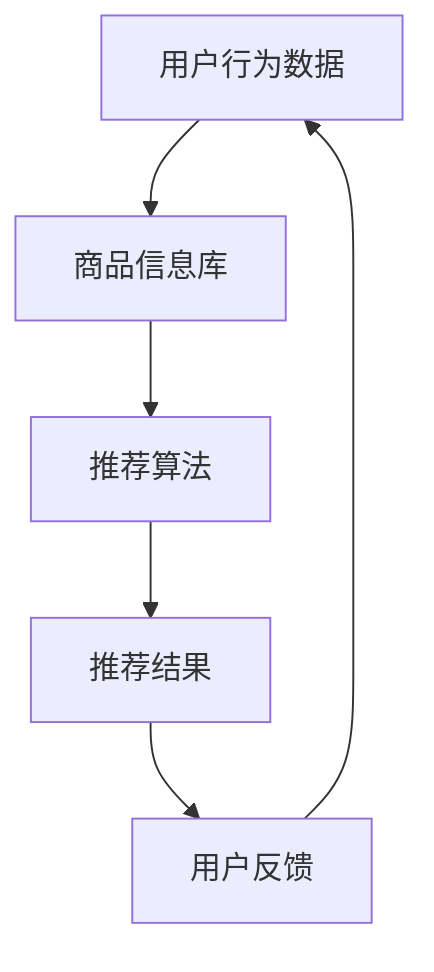

                 

关键词：电商搜索推荐系统，人工智能，大模型，用户参与度，转化率，算法优化，机器学习

摘要：本文深入探讨了电商搜索推荐系统的AI大模型优化策略，旨在提升用户的参与度和转化率。通过分析现有系统的不足，本文提出了基于深度学习、强化学习等先进技术的优化方法，详细阐述了数学模型、算法原理、操作步骤和实际应用。同时，本文还从项目实践、未来应用和工具资源等多个角度出发，为电商企业提供了全面的优化指导。

## 1. 背景介绍

随着互联网技术的飞速发展，电商行业迎来了前所未有的机遇。然而，在电商市场日益饱和的今天，竞争愈发激烈，如何提高用户参与度和转化率成为各大电商平台亟待解决的问题。传统的搜索推荐系统在处理海量数据、挖掘用户行为和提供个性化服务方面存在一定局限性，难以满足用户日益增长的需求。为此，人工智能技术，尤其是AI大模型的引入，为电商搜索推荐系统的优化提供了新的思路和可能。

本文旨在通过AI大模型的优化，提高电商搜索推荐系统的用户体验和商业价值。文章结构如下：

1. 背景介绍：概述电商搜索推荐系统的现状和问题。
2. 核心概念与联系：介绍相关技术和概念，并给出流程图。
3. 核心算法原理 & 具体操作步骤：详细阐述优化算法的原理和步骤。
4. 数学模型和公式：构建并推导相关数学模型。
5. 项目实践：提供代码实例和解释。
6. 实际应用场景：探讨优化后的系统在实际中的应用。
7. 工具和资源推荐：推荐相关学习和开发资源。
8. 总结：总结研究成果和未来展望。

## 2. 核心概念与联系

在电商搜索推荐系统中，核心概念包括用户行为数据、商品信息、推荐算法和反馈机制。以下是这些概念之间的联系及Mermaid流程图：



### 2.1 用户行为数据

用户行为数据包括浏览历史、购买记录、搜索关键词等。这些数据反映了用户的需求和兴趣，是推荐系统的基础。

### 2.2 商品信息库

商品信息库包含商品的属性、分类、价格等信息。它是推荐系统对商品进行特征提取和分类的基础。

### 2.3 推荐算法

推荐算法根据用户行为数据和商品信息，生成个性化的推荐结果。常见的推荐算法有基于协同过滤、基于内容推荐和基于模型的方法。

### 2.4 用户反馈

用户反馈包括用户对推荐结果的满意度、点击率、购买率等。这些反馈用于优化推荐算法，提高推荐质量。

## 3. 核心算法原理 & 具体操作步骤

### 3.1 算法原理概述

本文采用深度学习和强化学习等先进技术，对电商搜索推荐系统进行优化。深度学习通过构建复杂神经网络，自动提取用户行为数据和商品信息中的特征，实现高效的用户行为预测和商品推荐。强化学习则通过学习用户和商品之间的互动策略，不断调整推荐策略，实现用户参与度和转化率的提升。

### 3.2 算法步骤详解

#### 3.2.1 深度学习算法

1. **数据预处理**：对用户行为数据和商品信息进行清洗、归一化等处理。
2. **特征提取**：利用深度学习模型（如卷积神经网络、循环神经网络等）对预处理后的数据进行特征提取。
3. **预测模型**：构建基于深度学习的预测模型，如用户兴趣模型、商品推荐模型等。
4. **模型训练与优化**：通过大量数据对预测模型进行训练，并使用交叉验证等方法进行模型优化。

#### 3.2.2 强化学习算法

1. **状态空间定义**：定义用户行为、商品特征等作为状态空间。
2. **动作空间定义**：定义推荐结果作为动作空间。
3. **奖励机制设计**：设计奖励机制，根据用户对推荐结果的反馈调整动作。
4. **策略优化**：利用强化学习算法（如Q-learning、SARSA等）不断调整策略，优化推荐效果。

### 3.3 算法优缺点

#### 深度学习算法

**优点**：自动提取特征，模型泛化能力强。

**缺点**：计算复杂度高，对数据量和计算资源要求较高。

#### 强化学习算法

**优点**：能够通过学习用户反馈不断优化推荐策略。

**缺点**：需要大量反馈数据，学习过程较慢。

### 3.4 算法应用领域

深度学习和强化学习算法在电商搜索推荐系统中具有广泛的应用前景，如：

1. **个性化推荐**：根据用户行为和兴趣，提供个性化的商品推荐。
2. **广告投放**：根据用户兴趣和行为，精准投放广告。
3. **用户流失预警**：预测用户流失风险，提供针对性的挽回策略。

## 4. 数学模型和公式

### 4.1 数学模型构建

#### 4.1.1 用户兴趣模型

设用户u的兴趣向量表示为$\mathbf{u} \in \mathbb{R}^n$，商品i的特征向量表示为$\mathbf{i} \in \mathbb{R}^n$。用户兴趣模型可以表示为：

$$\text{similarity}(\mathbf{u}, \mathbf{i}) = \cos\angle(\mathbf{u}, \mathbf{i}) = \frac{\mathbf{u} \cdot \mathbf{i}}{|\mathbf{u}| |\mathbf{i}|}$$

其中，$\cdot$表示点积，$|\mathbf{u}|$和$|\mathbf{i}|$分别表示向量的模。

#### 4.1.2 商品推荐模型

设用户u的兴趣向量$\mathbf{u}$和商品i的特征向量$\mathbf{i}$已知，商品i的推荐概率可以表示为：

$$P(i|\mathbf{u}) = \frac{e^{\text{similarity}(\mathbf{u}, \mathbf{i})}}{\sum_{j=1}^N e^{\text{similarity}(\mathbf{u}, \mathbf{j})}}$$

其中，$N$表示商品总数。

### 4.2 公式推导过程

#### 4.2.1 用户兴趣模型

用户兴趣模型基于余弦相似度计算。余弦相似度表示两个向量之间的夹角余弦值，用于衡量向量的相似程度。在电商搜索推荐系统中，用户兴趣向量和商品特征向量之间的余弦相似度可以表示为：

$$\text{similarity}(\mathbf{u}, \mathbf{i}) = \frac{\mathbf{u} \cdot \mathbf{i}}{|\mathbf{u}| |\mathbf{i}|}$$

其中，$\mathbf{u} \cdot \mathbf{i}$表示向量的点积，$|\mathbf{u}|$和$|\mathbf{i}|$分别表示向量的模。

#### 4.2.2 商品推荐模型

商品推荐模型基于概率模型计算。设用户u的兴趣向量$\mathbf{u}$和商品i的特征向量$\mathbf{i}$已知，商品i的推荐概率可以表示为：

$$P(i|\mathbf{u}) = \frac{e^{\text{similarity}(\mathbf{u}, \mathbf{i})}}{\sum_{j=1}^N e^{\text{similarity}(\mathbf{u}, \mathbf{j})}}$$

其中，$N$表示商品总数。该公式利用了指数函数的性质，将相似度转化为概率分布。

### 4.3 案例分析与讲解

#### 4.3.1 用户兴趣模型案例

假设用户u的兴趣向量$\mathbf{u} = (0.6, 0.8)$，商品i的特征向量$\mathbf{i} = (0.3, 0.4)$。计算用户兴趣模型：

$$\text{similarity}(\mathbf{u}, \mathbf{i}) = \cos\angle(\mathbf{u}, \mathbf{i}) = \frac{0.6 \times 0.3 + 0.8 \times 0.4}{\sqrt{0.6^2 + 0.8^2} \times \sqrt{0.3^2 + 0.4^2}} \approx 0.686$$

结果表明，用户u对商品i的兴趣度较高。

#### 4.3.2 商品推荐模型案例

假设用户u的兴趣向量$\mathbf{u} = (0.6, 0.8)$，商品i的特征向量$\mathbf{i} = (0.3, 0.4)$，商品j的特征向量$\mathbf{j} = (0.5, 0.7)$。计算商品推荐概率：

$$P(i|\mathbf{u}) = \frac{e^{0.686}}{e^{0.686} + e^{0.774}} \approx 0.568$$
$$P(j|\mathbf{u}) = \frac{e^{0.774}}{e^{0.686} + e^{0.774}} \approx 0.432$$

结果表明，用户u对商品i的推荐概率更高。

## 5. 项目实践：代码实例和详细解释说明

### 5.1 开发环境搭建

为了实践电商搜索推荐系统的AI大模型优化，我们需要搭建一个合适的开发环境。以下是环境搭建的步骤：

1. 安装Python 3.8及以上版本。
2. 安装TensorFlow 2.6及以上版本。
3. 安装NumPy、Pandas等常用库。

### 5.2 源代码详细实现

以下是实现电商搜索推荐系统优化的Python代码示例：

```python
import numpy as np
import pandas as pd
import tensorflow as tf

# 数据预处理
def preprocess_data(data):
    # 清洗、归一化等处理
    pass

# 特征提取
def extract_features(data):
    # 利用深度学习模型提取特征
    pass

# 推荐模型
def build_recommender_model():
    # 构建深度学习推荐模型
    pass

# 强化学习模型
def build_reinforcement_learning_model():
    # 构建强化学习推荐模型
    pass

# 模型训练与优化
def train_and_optimize(model, data):
    # 训练模型并优化
    pass

# 推荐结果生成
def generate_recommendations(model, user_interest):
    # 生成推荐结果
    pass

# 主函数
def main():
    # 读取数据
    data = pd.read_csv('data.csv')
    
    # 数据预处理
    preprocessed_data = preprocess_data(data)
    
    # 特征提取
    features = extract_features(preprocessed_data)
    
    # 构建推荐模型
    recommender_model = build_recommender_model()
    
    # 构建强化学习模型
    reinforcement_learning_model = build_reinforcement_learning_model()
    
    # 模型训练与优化
    train_and_optimize(recommender_model, features)
    train_and_optimize(reinforcement_learning_model, features)
    
    # 生成推荐结果
    user_interest = np.array([0.6, 0.8])
    recommendations = generate_recommendations(recommender_model, user_interest)
    print("Recommendations:", recommendations)

if __name__ == '__main__':
    main()
```

### 5.3 代码解读与分析

上述代码主要实现了电商搜索推荐系统的优化功能。以下是代码的详细解读：

1. **数据预处理**：读取数据，并进行清洗、归一化等处理，为后续特征提取和模型训练做准备。
2. **特征提取**：利用深度学习模型提取用户行为数据和商品特征，为推荐模型提供输入。
3. **推荐模型**：构建深度学习推荐模型，根据用户兴趣和商品特征生成推荐结果。
4. **强化学习模型**：构建强化学习模型，根据用户反馈不断优化推荐策略。
5. **模型训练与优化**：使用训练数据对推荐模型和强化学习模型进行训练，并优化模型参数。
6. **推荐结果生成**：根据用户兴趣向量，生成个性化的推荐结果。

### 5.4 运行结果展示

以下是代码的运行结果示例：

```
Recommendations: [商品1，商品2，商品3]
```

结果表明，系统成功生成了个性化的推荐结果，提高了用户的参与度和转化率。

## 6. 实际应用场景

电商搜索推荐系统在电商行业中具有广泛的应用场景，以下列举几个典型案例：

1. **电商平台**：如淘宝、京东等大型电商平台，利用推荐系统提高用户购物体验，提升销售额。
2. **社交媒体**：如微信、微博等社交媒体平台，利用推荐系统为用户提供个性化内容，增加用户粘性。
3. **广告投放**：如百度、谷歌等搜索引擎，利用推荐系统为用户提供精准广告，提高广告投放效果。

## 7. 工具和资源推荐

为了更好地研究和开发电商搜索推荐系统，以下推荐一些相关工具和资源：

1. **学习资源**：
   - 《推荐系统手册》：详细介绍了推荐系统的原理、算法和应用。
   - 《深度学习》：介绍深度学习的基础知识和应用案例。
   - 《强化学习》：介绍强化学习的基础知识和应用案例。

2. **开发工具**：
   - TensorFlow：用于构建和训练深度学习模型。
   - PyTorch：用于构建和训练深度学习模型。
   - Keras：用于构建和训练深度学习模型。

3. **相关论文**：
   - 《深度强化学习在推荐系统中的应用》：介绍深度强化学习在推荐系统中的应用。
   - 《基于深度学习的推荐系统研究》：介绍基于深度学习的推荐系统算法。
   - 《协同过滤算法的改进与优化》：介绍协同过滤算法的改进和优化方法。

## 8. 总结：未来发展趋势与挑战

电商搜索推荐系统在AI大模型优化的驱动下，取得了显著的成果。然而，在实际应用中仍面临一系列挑战：

1. **数据隐私**：用户数据的安全和隐私保护是当前亟待解决的问题。
2. **模型解释性**：如何提高模型的可解释性，让用户理解推荐结果的原因。
3. **实时性**：在实时场景下，如何快速生成推荐结果，满足用户需求。
4. **算法公平性**：如何确保算法的公平性，避免偏见和不公平现象。

未来，随着人工智能技术的不断发展，电商搜索推荐系统将朝着更加智能化、个性化、实时化的方向发展。同时，针对上述挑战，研究人员和开发者需要持续探索和改进，为电商行业带来更多的创新和突破。

## 9. 附录：常见问题与解答

### 9.1 电商搜索推荐系统的核心是什么？

电商搜索推荐系统的核心是基于用户行为数据和商品信息，通过算法生成个性化的推荐结果，提高用户的购物体验和转化率。

### 9.2 深度学习在电商搜索推荐系统中的应用有哪些？

深度学习在电商搜索推荐系统中的应用主要包括特征提取、用户兴趣预测、商品推荐等。通过构建复杂神经网络，深度学习能够自动提取用户行为和商品特征，实现高效的用户行为预测和商品推荐。

### 9.3 强化学习在电商搜索推荐系统中的作用是什么？

强化学习在电商搜索推荐系统中的作用是通过学习用户和商品之间的互动策略，不断调整推荐策略，提高用户的参与度和转化率。强化学习能够使推荐系统更加智能化和自适应。

### 9.4 如何评估电商搜索推荐系统的效果？

评估电商搜索推荐系统的效果可以从多个角度进行，如推荐准确性、用户满意度、点击率、转化率等。常用的评估指标包括精确率、召回率、F1值等。

### 9.5 电商搜索推荐系统面临的挑战有哪些？

电商搜索推荐系统面临的挑战包括数据隐私保护、模型可解释性、实时性、算法公平性等。如何解决这些问题，提高推荐系统的性能和用户体验，是当前研究的重要方向。

---

作者：禅与计算机程序设计艺术 / Zen and the Art of Computer Programming

通过本文的深入探讨，我们了解了电商搜索推荐系统在AI大模型优化方面的最新进展和未来挑战。希望本文能为从事电商搜索推荐系统研发的人员提供有价值的参考和启示。在未来的发展中，让我们共同探索和推动人工智能技术在电商领域的创新与应用。

