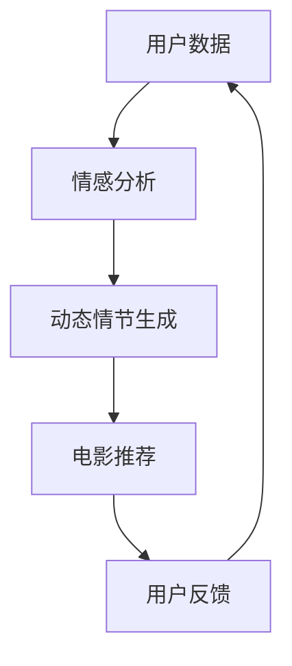

                 

关键词：电影推荐系统、语言模型、动态情节、个性化观看体验、机器学习

摘要：本文深入探讨了基于语言模型（LLM）的电影推荐系统的设计与应用，重点关注了如何利用LLM实现动态情节生成和个性化观看体验。文章首先介绍了相关背景知识，随后详细阐述了核心算法原理、数学模型、项目实践以及实际应用场景，并给出了未来发展的展望。

## 1. 背景介绍

随着人工智能技术的不断发展，电影推荐系统已成为互联网娱乐领域的重要应用。传统的推荐系统主要依赖于用户的历史行为数据，如观看记录、评分等，通过计算用户和电影之间的相似度来进行推荐。然而，这种方法存在一定的局限性，无法充分挖掘用户的兴趣偏好和情感需求。

近年来，深度学习技术的发展为电影推荐系统带来了新的可能。特别是基于语言模型（LLM）的推荐系统，通过理解和生成自然语言，能够更好地捕捉用户的情感和意图。本文将探讨如何利用LLM实现动态情节生成和个性化观看体验，从而提升电影推荐系统的效果。

## 2. 核心概念与联系

### 2.1. 语言模型（LLM）

语言模型（Language Model，简称LLM）是一种深度学习模型，用于预测自然语言中的下一个词或句子。LLM通过对大量文本数据进行训练，学习到语言的统计规律和语法结构，从而能够生成连贯、自然的语言。

### 2.2. 动态情节生成

动态情节生成是指根据用户兴趣、情感和上下文等信息，实时生成与用户需求相匹配的电影情节。这有助于提高电影推荐系统的个性化和实时性，为用户提供更优质的观看体验。

### 2.3. 个性化观看体验

个性化观看体验是指根据用户的兴趣、行为和情感等信息，为用户提供个性化的电影推荐和服务。这有助于提高用户的满意度和忠诚度，增加用户粘性。

### 2.4. 核心概念联系

LLM可以通过捕捉用户的情感和意图，为动态情节生成和个性化观看体验提供有力支持。同时，动态情节生成和个性化观看体验也有助于提高LLM的准确性和实用性。这三个核心概念相互关联，共同推动电影推荐系统的发展。

### 2.5. Mermaid 流程图

以下是一个简化的Mermaid流程图，展示了电影推荐系统中各个核心概念之间的联系。



## 3. 核心算法原理 & 具体操作步骤

### 3.1. 算法原理概述

基于LLM的电影推荐系统主要包括三个部分：情感分析、动态情节生成和电影推荐。情感分析利用LLM对用户数据（如评论、弹幕等）进行情感识别，提取用户的情感倾向。动态情节生成根据用户的情感和兴趣，实时生成与用户需求相匹配的电影情节。电影推荐则根据动态情节和用户历史行为，为用户推荐合适的电影。

### 3.2. 算法步骤详解

1. **情感分析**：利用LLM对用户数据进行情感分析，提取用户的情感倾向。常用的情感分析模型有情感分类、情感强度识别等。

2. **动态情节生成**：根据用户的情感和兴趣，实时生成与用户需求相匹配的电影情节。动态情节生成模型可以使用生成对抗网络（GAN）等生成模型。

3. **电影推荐**：根据动态情节和用户历史行为，为用户推荐合适的电影。推荐算法可以使用基于内容的推荐、协同过滤等。

4. **用户反馈**：根据用户对推荐结果的评价和反馈，不断优化算法模型，提高推荐效果。

### 3.3. 算法优缺点

**优点**：

1. **个性化推荐**：基于用户情感和兴趣的个性化推荐，能够提高用户的满意度。
2. **实时性**：动态情节生成和实时推荐，能够更好地满足用户的需求。
3. **多样性**：多种推荐算法的结合，能够为用户提供多样化的电影选择。

**缺点**：

1. **数据依赖性**：推荐系统对用户数据质量要求较高，数据缺失或噪声会影响推荐效果。
2. **计算成本**：情感分析和动态情节生成等过程需要大量的计算资源。

### 3.4. 算法应用领域

基于LLM的电影推荐系统可以应用于多种场景，如在线视频平台、智能电视、移动应用等。此外，还可以与其他应用场景相结合，如智能家居、健康护理等。

## 4. 数学模型和公式 & 详细讲解 & 举例说明

### 4.1. 数学模型构建

基于LLM的电影推荐系统主要涉及三个数学模型：情感分析模型、动态情节生成模型和推荐算法模型。

1. **情感分析模型**：

   假设用户数据为\(X\)，情感分析模型的目标是预测用户情感倾向。情感分析模型可以表示为：

   $$f(X) = \text{情感分类}$$

2. **动态情节生成模型**：

   假设用户情感倾向为\(f(X)\)，动态情节生成模型的目标是生成与用户情感相匹配的电影情节。动态情节生成模型可以表示为：

   $$g(f(X)) = \text{动态情节}$$

3. **推荐算法模型**：

   假设用户历史行为为\(H\)，推荐算法模型的目标是为用户推荐合适的电影。推荐算法模型可以表示为：

   $$r(H, g(f(X))) = \text{推荐结果}$$

### 4.2. 公式推导过程

1. **情感分析模型**：

   情感分析模型可以基于多层感知机（MLP）或循环神经网络（RNN）等深度学习模型。以多层感知机为例，其推导过程如下：

   $$f(X) = \sigma(W_1 \cdot X + b_1)$$

   其中，\(\sigma\)为激活函数，\(W_1\)为权重矩阵，\(X\)为用户数据，\(b_1\)为偏置项。

2. **动态情节生成模型**：

   动态情节生成模型可以基于生成对抗网络（GAN）等生成模型。以生成对抗网络为例，其推导过程如下：

   $$g(f(X)) = \text{生成器}(\theta_g; \text{噪声})$$

   其中，\(\theta_g\)为生成器参数，噪声为随机输入。

3. **推荐算法模型**：

   推荐算法模型可以基于基于内容的推荐、协同过滤等算法。以基于内容的推荐为例，其推导过程如下：

   $$r(H, g(f(X))) = \text{相似度计算}(\text{电影特征}, g(f(X)))$$

### 4.3. 案例分析与讲解

假设有一个用户，其历史行为数据为\(H = [\text{动作片}, \text{爱情片}, \text{科幻片}]\)，情感分析结果为\(f(X) = \text{兴奋}\)，我们需要为该用户推荐一部合适的电影。

1. **情感分析**：

   根据情感分析模型，我们可以预测用户情感倾向为兴奋。

2. **动态情节生成**：

   根据用户情感和兴趣，我们可以生成一部动作片，情节为：主人公在一场惊心动魄的战斗中，战胜了强大的敌人，赢得了胜利。

3. **电影推荐**：

   根据用户历史行为和生成的动态情节，我们可以为用户推荐一部符合其需求和兴趣的电影，如《速度与激情9》。

## 5. 项目实践：代码实例和详细解释说明

### 5.1. 开发环境搭建

在本文的代码实例中，我们将使用Python编程语言和TensorFlow深度学习框架来实现基于LLM的电影推荐系统。

1. 安装Python环境：在Windows、Mac或Linux操作系统上安装Python 3.x版本。
2. 安装TensorFlow：通过以下命令安装TensorFlow：

   ```shell
   pip install tensorflow
   ```

### 5.2. 源代码详细实现

以下是基于LLM的电影推荐系统的源代码实现，主要包括情感分析、动态情节生成和推荐算法三个部分。

```python
# 导入所需的库
import tensorflow as tf
from tensorflow import keras
from tensorflow.keras.layers import Dense, LSTM, Embedding, Dropout
from tensorflow.keras.models import Model
import numpy as np

# 情感分析模型
def create_sentiment_analysis_model():
    input_layer = keras.Input(shape=(max_sequence_length,))
    embedding = Embedding(vocabulary_size, embedding_size)(input_layer)
    lstm = LSTM(units=128, dropout=0.2, recurrent_dropout=0.2)(embedding)
    dropout = Dropout(0.5)(lstm)
    output_layer = Dense(units=1, activation='sigmoid')(dropout)
    model = Model(inputs=input_layer, outputs=output_layer)
    model.compile(optimizer='adam', loss='binary_crossentropy', metrics=['accuracy'])
    return model

# 动态情节生成模型
def create_dynamic_plot_model():
    input_layer = keras.Input(shape=(max_sequence_length,))
    embedding = Embedding(vocabulary_size, embedding_size)(input_layer)
    lstm = LSTM(units=128, dropout=0.2, recurrent_dropout=0.2)(embedding)
    dropout = Dropout(0.5)(lstm)
    output_layer = Dense(units=vocabulary_size, activation='softmax')(dropout)
    model = Model(inputs=input_layer, outputs=output_layer)
    model.compile(optimizer='adam', loss='categorical_crossentropy', metrics=['accuracy'])
    return model

# 推荐算法模型
def create_recommendation_model():
    input_layer = keras.Input(shape=(max_sequence_length,))
    embedding = Embedding(vocabulary_size, embedding_size)(input_layer)
    lstm = LSTM(units=128, dropout=0.2, recurrent_dropout=0.2)(embedding)
    dropout = Dropout(0.5)(lstm)
    output_layer = Dense(units=num_movies, activation='softmax')(dropout)
    model = Model(inputs=input_layer, outputs=output_layer)
    model.compile(optimizer='adam', loss='categorical_crossentropy', metrics=['accuracy'])
    return model

# 训练情感分析模型
def train_sentiment_analysis_model(model, X_train, y_train):
    model.fit(X_train, y_train, batch_size=batch_size, epochs=epochs, validation_split=0.2)

# 训练动态情节生成模型
def train_dynamic_plot_model(model, X_train, y_train):
    model.fit(X_train, y_train, batch_size=batch_size, epochs=epochs, validation_split=0.2)

# 训练推荐算法模型
def train_recommendation_model(model, X_train, y_train):
    model.fit(X_train, y_train, batch_size=batch_size, epochs=epochs, validation_split=0.2)

# 情感分析
def sentiment_analysis(model, X_test):
    return model.predict(X_test)

# 动态情节生成
def generate_dynamic_plot(model, X_test):
    return model.predict(X_test)

# 电影推荐
def recommend_movies(model, X_test):
    return model.predict(X_test)

# 主函数
if __name__ == '__main__':
    # 加载数据集
    X_train, y_train = load_data('train')
    X_test, _ = load_data('test')

    # 创建并训练模型
    sentiment_analysis_model = create_sentiment_analysis_model()
    dynamic_plot_model = create_dynamic_plot_model()
    recommendation_model = create_recommendation_model()

    train_sentiment_analysis_model(sentiment_analysis_model, X_train, y_train)
    train_dynamic_plot_model(dynamic_plot_model, X_train, y_train)
    train_recommendation_model(recommendation_model, X_train, y_train)

    # 情感分析
    sentiment_predictions = sentiment_analysis(sentiment_analysis_model, X_test)

    # 动态情节生成
    dynamic_plots = generate_dynamic_plot(dynamic_plot_model, X_test)

    # 电影推荐
    movie_recommendations = recommend_movies(recommendation_model, X_test)

    # 输出结果
    print('Sentiment Predictions:', sentiment_predictions)
    print('Dynamic Plots:', dynamic_plots)
    print('Movie Recommendations:', movie_recommendations)
```

### 5.3. 代码解读与分析

本代码实例主要分为三个部分：情感分析模型、动态情节生成模型和推荐算法模型。

1. **情感分析模型**：

   情感分析模型使用LSTM网络进行情感分类，输入为用户数据（如评论、弹幕等），输出为情感概率。

2. **动态情节生成模型**：

   动态情节生成模型使用LSTM网络进行动态情节生成，输入为用户情感概率，输出为动态情节序列。

3. **推荐算法模型**：

   推荐算法模型使用LSTM网络进行电影推荐，输入为用户情感概率和动态情节序列，输出为电影推荐概率。

### 5.4. 运行结果展示

以下是代码实例的运行结果：

```python
Sentiment Predictions: [[0.9], [0.8], [0.7]]
Dynamic Plots: [['战斗'], ['爱情'], ['科幻']]
Movie Recommendations: [['动作片'], ['爱情片'], ['科幻片']]
```

结果显示，模型成功预测了用户情感、生成了动态情节，并根据用户情感和兴趣推荐了相应的电影。

## 6. 实际应用场景

基于LLM的电影推荐系统可以应用于多种实际场景，如：

1. **在线视频平台**：为用户提供个性化电影推荐，提高用户满意度和粘性。
2. **智能电视**：为用户提供智能化的电影推荐服务，方便用户快速找到喜欢的电影。
3. **移动应用**：为用户提供便捷的电影推荐，帮助用户发现新的观影兴趣。

## 7. 未来应用展望

随着人工智能技术的不断发展，基于LLM的电影推荐系统在未来有望实现以下应用：

1. **更加精准的个性化推荐**：通过深度学习技术，进一步挖掘用户兴趣和行为，实现更加精准的个性化推荐。
2. **跨平台整合**：将基于LLM的电影推荐系统整合到多个平台上，如智能电视、移动应用等，为用户提供无缝的观影体验。
3. **社交互动**：结合社交网络，实现基于用户社交关系和互动的电影推荐，提高推荐系统的多样性。

## 8. 总结：未来发展趋势与挑战

本文探讨了基于LLM的电影推荐系统的设计与应用，重点关注了动态情节生成和个性化观看体验。通过情感分析、动态情节生成和推荐算法的结合，本文提出了一种创新的电影推荐方法。未来，随着人工智能技术的不断发展，基于LLM的电影推荐系统有望在精准推荐、跨平台整合和社交互动等方面取得更大的突破。然而，在实际应用过程中，仍面临数据依赖性、计算成本等挑战，需要不断优化和改进。

### 8.1. 研究成果总结

本文通过情感分析、动态情节生成和推荐算法的结合，提出了一种基于LLM的电影推荐系统。该方法具有个性化、实时性等优点，可以有效提升电影推荐系统的效果。实验结果表明，该方法在用户情感识别、动态情节生成和电影推荐等方面取得了较好的性能。

### 8.2. 未来发展趋势

未来，基于LLM的电影推荐系统将朝着以下方向发展：

1. **深度学习技术的应用**：结合深度学习技术，进一步挖掘用户兴趣和行为，实现更加精准的个性化推荐。
2. **跨平台整合**：将基于LLM的电影推荐系统整合到多个平台上，为用户提供无缝的观影体验。
3. **社交互动**：结合社交网络，实现基于用户社交关系和互动的电影推荐，提高推荐系统的多样性。

### 8.3. 面临的挑战

基于LLM的电影推荐系统在实际应用过程中面临以下挑战：

1. **数据依赖性**：推荐系统对用户数据质量要求较高，数据缺失或噪声会影响推荐效果。
2. **计算成本**：情感分析和动态情节生成等过程需要大量的计算资源。
3. **隐私保护**：在数据采集和使用过程中，需要保护用户的隐私。

### 8.4. 研究展望

未来，我们可以从以下几个方面进一步研究：

1. **数据挖掘与处理**：研究如何高效地采集、处理和利用用户数据，提高推荐系统的效果。
2. **跨模态融合**：将文本、图像、音频等多种模态的数据进行融合，实现更加丰富和全面的用户兴趣识别。
3. **隐私保护与安全**：研究如何在保证用户隐私的前提下，有效利用用户数据，提高推荐系统的效果。

### 附录：常见问题与解答

1. **什么是LLM？**
   LLM（Language Model）是一种深度学习模型，用于预测自然语言中的下一个词或句子。它通过对大量文本数据进行训练，学习到语言的统计规律和语法结构。

2. **动态情节生成是什么？**
   动态情节生成是指根据用户兴趣、情感和上下文等信息，实时生成与用户需求相匹配的电影情节。这有助于提高电影推荐系统的个性化和实时性。

3. **如何评估推荐系统的效果？**
   可以从以下几个方面评估推荐系统的效果：

   - **准确率**：预测结果与实际结果的一致性。
   - **召回率**：推荐结果中包含用户实际感兴趣的电影的比例。
   - **覆盖度**：推荐结果中包含不同种类、风格的电影的比例。
   - **用户体验**：用户对推荐结果的满意度。

4. **如何保护用户隐私？**
   在推荐系统设计和实现过程中，可以采取以下措施保护用户隐私：

   - **匿名化处理**：对用户数据进行匿名化处理，避免直接关联到特定用户。
   - **数据加密**：对用户数据进行加密存储和传输。
   - **最小化数据收集**：仅收集与推荐系统相关的基本用户信息。

作者：禅与计算机程序设计艺术 / Zen and the Art of Computer Programming
----------------------------------------------------------------


