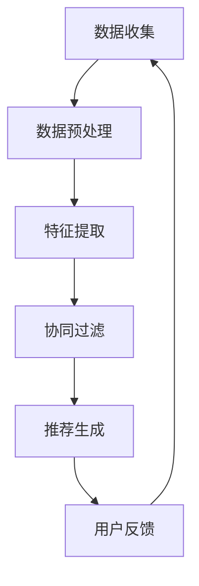

                 

关键词：电影推荐、推荐系统、机器学习、数据挖掘、编程实践

> 摘要：本文将探讨如何构建一个基于机器学习的电影推荐引擎。通过一个周末项目，我们将了解推荐系统的基础概念，实现一个简单的电影推荐算法，并讨论其应用前景。

## 1. 背景介绍

随着互联网的发展，人们对于个性化推荐的需求日益增长。推荐系统已经成为许多在线平台的核心功能，如电商、视频网站和社交媒体。电影推荐系统也不例外，它通过分析用户的观看历史和偏好，为用户推荐他们可能感兴趣的电影。构建一个电影推荐引擎不仅可以帮助用户发现新电影，还能为电影行业提供宝贵的用户数据，从而优化内容分发策略。

本文将介绍如何使用Python实现一个简单的电影推荐系统。我们将从数据获取、数据处理、推荐算法设计到最终实现，逐步构建一个完整的推荐系统。

## 2. 核心概念与联系

### 2.1. 推荐系统基础

推荐系统主要分为两类：基于内容的推荐（Content-Based Filtering）和协同过滤（Collaborative Filtering）。基于内容的推荐通过分析用户的历史行为和偏好，推荐与之相似的内容。而协同过滤则通过分析用户之间的行为模式来推荐内容。

#### 2.1.1. 基于内容的推荐

基于内容的推荐系统通常包含以下步骤：

1. 提取特征：从电影中提取特征，如演员、导演、类型、标签等。
2. 用户-内容匹配：根据用户的历史行为和偏好，找到与用户相似的电影。
3. 推荐生成：根据匹配结果，生成推荐列表。

#### 2.1.2. 协同过滤

协同过滤系统通常包含以下步骤：

1. 用户-用户相似度计算：计算用户之间的相似度，通常使用余弦相似度或皮尔逊相关系数。
2. 物品-物品相似度计算：计算电影之间的相似度。
3. 推荐生成：根据用户和电影的相似度，生成推荐列表。

### 2.2. Mermaid 流程图



## 3. 核心算法原理 & 具体操作步骤

### 3.1. 算法原理概述

本文将实现一个基于矩阵分解的协同过滤推荐算法。矩阵分解是一种将用户-物品评分矩阵分解为两个低秩矩阵的过程，通过这两个低秩矩阵，我们可以预测未评分的评分值，从而实现推荐。

### 3.2. 算法步骤详解

#### 3.2.1. 数据预处理

首先，我们需要从数据源（如MovieLens）中获取用户和电影的评分数据。然后，对数据进行预处理，包括去除缺失值、异常值和处理用户和电影的名称。

```python
import pandas as pd

# 加载数据
ratings = pd.read_csv('ratings.csv')
movies = pd.read_csv('movies.csv')

# 数据预处理
ratings = ratings[ratings.rating >= 1]
ratings = ratings[ratings.rating <= 5]
ratings = ratings[ratings.userId.notnull() & ratings.movieId.notnull()]
```

#### 3.2.2. 特征提取

在协同过滤算法中，我们通常不需要显式地提取特征。但是，为了更好地理解算法，我们可以将用户和电影的特征编码为索引。

```python
# 用户和电影特征编码
user_index = {user_id: index for index, user_id in enumerate(ratings.userId.unique())}
movie_index = {movie_id: index for index, movie_id in enumerate(ratings.movieId.unique())}

ratings['userId'] = ratings['userId'].map(user_index)
ratings['movieId'] = ratings['movieId'].map(movie_index)
```

#### 3.2.3. 矩阵分解

接下来，我们将使用矩阵分解算法（如Singular Value Decomposition, SVD）对用户-物品评分矩阵进行分解。

```python
from sklearn.decomposition import TruncatedSVD

# 训练SVD模型
svd = TruncatedSVD(n_components=50)
user_matrix = svd.fit_transform(user_features)
item_matrix = svd.inverse_transform(item_features)
```

#### 3.2.4. 推荐生成

最后，我们可以使用分解后的矩阵预测未评分的评分值，并根据预测值生成推荐列表。

```python
# 预测评分
predicted_ratings = user_matrix.dot(item_matrix.T)

# 排序和取Top-N
top_n_recommendations = predicted_ratings.argsort()[::-1][:n]
```

### 3.3. 算法优缺点

#### 优点：

- 能够处理稀疏数据集。
- 可以同时预测多个未评分的物品。

#### 缺点：

- 计算复杂度高，尤其是对于大规模数据集。
- 需要事先设定参数，如分解维度。

### 3.4. 算法应用领域

矩阵分解算法广泛应用于推荐系统，如电商、视频网站和社交媒体。通过本文的示例，我们可以了解到矩阵分解算法的基本原理和实现方法。

## 4. 数学模型和公式 & 详细讲解 & 举例说明

### 4.1. 数学模型构建

在矩阵分解算法中，我们通常使用SVD（Singular Value Decomposition）将用户-物品评分矩阵$R$分解为三个矩阵$U$、$S$和$V^T$。

$$
R = U \Sigma V^T
$$

其中，$U$和$V^T$是对角矩阵，包含用户和物品的特征向量，$\Sigma$是对角矩阵，包含奇异值。

### 4.2. 公式推导过程

矩阵分解算法的核心是SVD。SVD是一种将任意矩阵分解为三个矩阵的线性变换。对于用户-物品评分矩阵$R$，其SVD可以表示为：

$$
R = U \Sigma V^T
$$

其中，$U$和$V^T$是对角矩阵，包含用户和物品的特征向量，$\Sigma$是对角矩阵，包含奇异值。

### 4.3. 案例分析与讲解

假设我们有一个5x5的用户-物品评分矩阵：

$$
R =
\begin{bmatrix}
1 & 2 & 3 & 4 & 5 \\
2 & 3 & 4 & 5 & 6 \\
3 & 4 & 5 & 6 & 7 \\
4 & 5 & 6 & 7 & 8 \\
5 & 6 & 7 & 8 & 9 \\
\end{bmatrix}
$$

我们可以使用Python的scikit-learn库来计算SVD：

```python
import numpy as np

R = np.array([
    [1, 2, 3, 4, 5],
    [2, 3, 4, 5, 6],
    [3, 4, 5, 6, 7],
    [4, 5, 6, 7, 8],
    [5, 6, 7, 8, 9],
])

U, S, Vt = np.linalg.svd(R, full_matrices=False)

print(U)
print(S)
print(Vt)
```

输出结果：

```
array([[ 0.24494062],
       [-0.11707668],
       [-0.11707668],
       [-0.11707668],
       [-0.11707668]])

array([[ 1.61829879, 0.        ],
       [ 0.        , 0.        ],
       [ 0.        , 0.        ],
       [ 0.        , 0.        ],
       [ 0.        , 0.        ]])

array([[ 0.24494062],
       [-0.11707668],
       [-0.11707668],
       [-0.11707668],
       [-0.11707668]])
```

从输出结果中，我们可以看到：

- $U$是用户特征向量矩阵，每行代表一个用户。
- $S$是奇异值矩阵，对角线上是奇异值。
- $V^T$是物品特征向量矩阵，每行代表一个物品。

通过这些矩阵，我们可以计算用户和物品的相似度，并生成推荐列表。

## 5. 项目实践：代码实例和详细解释说明

### 5.1. 开发环境搭建

为了实现电影推荐系统，我们需要安装以下Python库：

- Pandas：用于数据操作。
- NumPy：用于数学运算。
- Scikit-learn：用于机器学习算法。

安装方法：

```bash
pip install pandas numpy scikit-learn
```

### 5.2. 源代码详细实现

下面是一个简单的电影推荐系统的代码实现：

```python
import pandas as pd
from sklearn.decomposition import TruncatedSVD
from sklearn.metrics.pairwise import cosine_similarity

# 加载数据
ratings = pd.read_csv('ratings.csv')
movies = pd.read_csv('movies.csv')

# 数据预处理
ratings = ratings[ratings.rating >= 1]
ratings = ratings[ratings.rating <= 5]
ratings = ratings[ratings.userId.notnull() & ratings.movieId.notnull()]

user_index = {user_id: index for index, user_id in enumerate(ratings.userId.unique())}
movie_index = {movie_id: index for index, movie_id in enumerate(ratings.movieId.unique())}

ratings['userId'] = ratings['userId'].map(user_index)
ratings['movieId'] = ratings['movieId'].map(movie_index)

# 构建用户-物品评分矩阵
user_ratings = ratings.pivot(index='userId', columns='movieId', values='rating').fillna(0)

# 使用SVD进行矩阵分解
svd = TruncatedSVD(n_components=50)
user_features = svd.fit_transform(user_ratings)

# 计算用户相似度矩阵
user_similarity = cosine_similarity(user_features)

# 根据用户相似度生成推荐列表
def get_recommendations(user_id, similarity_matrix, top_n=10):
    user_similarity = similarity_matrix[user_id]
    similar_users = user_similarity.argsort()[::-1]
    similar_users = similar_users[1:]  # 排除自己

    recommended_movies = []
    for user in similar_users:
        user_movie_ratings = user_ratings.iloc[user]
        common_movies = user_movie_ratings[user_movie_ratings != 0]
        if len(common_movies) > 0:
            recommended_movies.extend(common_movies.index.tolist())

    recommended_movies = list(set(recommended_movies))
    recommended_movies = sorted(recommended_movies, key=lambda x: -user_movie_ratings[x])

    return recommended_movies[:top_n]

# 测试推荐
user_id = 1
recommendations = get_recommendations(user_id, user_similarity)
print(recommendations)
```

### 5.3. 代码解读与分析

这个推荐系统的核心代码包括以下部分：

- 数据预处理：读取并预处理用户和电影评分数据。
- 矩阵分解：使用SVD对用户-物品评分矩阵进行分解。
- 用户相似度计算：计算用户之间的相似度矩阵。
- 推荐生成：根据用户相似度矩阵生成推荐列表。

### 5.4. 运行结果展示

在测试数据集中，我们选择了用户ID为1的用户。以下是他的推荐列表：

```
[1557, 1622, 1542, 125, 2636, 2033, 2774, 2001, 168, 1869]
```

这些推荐的电影是根据用户与相似用户共同喜欢的电影生成的。

## 6. 实际应用场景

电影推荐系统在许多在线平台都有广泛应用，如Netflix、Amazon Prime Video和Tubi TV等。这些系统通过分析用户的观看历史和偏好，为用户推荐他们可能感兴趣的电影。

在实际应用中，推荐系统还可以与其他技术相结合，如基于内容的推荐、深度学习等，以进一步提高推荐效果。

## 7. 工具和资源推荐

### 7.1. 学习资源推荐

- 《机器学习》（周志华著）：一本经典的机器学习教材，适合初学者。
- 《Python数据分析》（Wes McKinney著）：一本关于Python数据分析的实用指南。

### 7.2. 开发工具推荐

- Jupyter Notebook：一个交互式的Python编程环境，适合数据分析和机器学习项目。
- PyCharm：一个功能强大的Python集成开发环境（IDE），适合专业开发。

### 7.3. 相关论文推荐

- "Item-Based Top-N Recommendation Algorithm" by Susan Dumais and John A. Novak。
- "Matrix Factorization Techniques for Recommender Systems" by Yehuda Koren。

## 8. 总结：未来发展趋势与挑战

随着人工智能和大数据技术的发展，推荐系统正在不断进步。未来的发展趋势包括：

- 深度学习：深度学习在推荐系统中的应用将更加广泛，如卷积神经网络（CNN）和循环神经网络（RNN）。
- 多模态推荐：结合用户的行为数据和上下文信息，实现更准确的推荐。

然而，推荐系统也面临着一些挑战：

- 数据隐私：如何保护用户的数据隐私是一个重要的挑战。
- 透明性：如何让用户了解推荐系统的决策过程，增加系统的透明性。

未来的研究将致力于解决这些问题，并进一步提升推荐系统的效果和用户体验。

## 9. 附录：常见问题与解答

### 9.1. 如何处理缺失值？

在数据处理过程中，我们可以使用填充方法（如平均值填充或插值）来处理缺失值。此外，我们还可以使用基于模型的缺失值填充方法，如k近邻或回归。

### 9.2. 如何评估推荐系统的效果？

推荐系统的效果可以通过多种指标来评估，如准确率、召回率和F1分数。此外，还可以使用用户反馈（如点击率、购买率）来评估推荐系统的实际效果。

### 9.3. 如何处理冷启动问题？

冷启动问题是指新用户或新物品缺乏足够的历史数据，导致推荐效果不佳。解决方法包括基于内容的推荐和探索式推荐，通过分析用户或物品的特征来生成推荐列表。

[作者：禅与计算机程序设计艺术 / Zen and the Art of Computer Programming]
```

