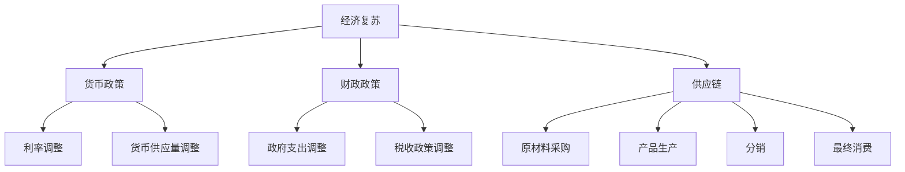

                 

 在过去几年中，全球范围内的疫情给世界经济带来了前所未有的冲击。疫情的爆发导致了大规模的封锁和隔离措施，许多企业和行业受到了严重的影响，全球经济陷入了深度衰退。然而，随着疫苗接种的推进和疫情控制的逐步改善，各国政府开始采取措施，试图推动经济的复苏。本文将从疫情冲击后的经济复苏挑战、核心概念与联系、核心算法原理与操作步骤、数学模型和公式、项目实践、实际应用场景、工具和资源推荐以及未来发展趋势与挑战等方面进行深入探讨。

## 1. 背景介绍

自2019年底新冠病毒（COVID-19）在中国武汉首次爆发以来，疫情迅速蔓延至全球。各国政府为了控制疫情的传播，采取了严格的封锁和隔离措施。这些措施在有效控制疫情的同时，也对全球经济产生了深远的影响。据国际货币基金组织（IMF）的数据显示，全球经济在2020年的增长率下降了3.5%，这是自第二次世界大战以来最严重的经济衰退。

疫情对不同的行业和地区产生了不同的影响。一方面，医疗、医药、在线教育、远程办公等行业在疫情期间得到了快速发展。另一方面，制造业、旅游业、餐饮业、零售业等行业则遭受了重创，大量企业倒闭，失业率上升。

## 2. 核心概念与联系

在探讨疫情冲击后的经济复苏挑战时，我们需要关注几个核心概念：

1. **经济复苏**：经济复苏是指在经济衰退后，通过政策措施刺激经济增长，使经济活动恢复到正常水平的过程。
2. **货币政策**：货币政策是中央银行通过调节货币供应量、利率等手段来影响经济增长的一种政策。
3. **财政政策**：财政政策是政府通过调整支出和税收来影响经济活动的一种政策。
4. **供应链**：供应链是指从原材料采购到产品生产、分销、最终消费的全过程。

这些概念之间存在着密切的联系。货币政策、财政政策是推动经济复苏的重要手段，而供应链的稳定则是保障经济活动正常进行的基础。

### 2.1 经济复苏的Mermaid流程图



## 3. 核心算法原理 & 具体操作步骤

### 3.1 算法原理概述

在推动经济复苏的过程中，货币政策、财政政策、供应链管理是三大核心要素。以下是这些要素的具体操作步骤：

1. **货币政策**：
   - **利率调整**：通过调整利率来影响借贷成本，刺激投资和消费。
   - **货币供应量调整**：通过增加或减少货币供应量来影响通货膨胀和经济增长。

2. **财政政策**：
   - **政府支出调整**：通过增加基础设施投资、教育、医疗等领域的支出，刺激经济增长。
   - **税收政策调整**：通过减税或增加税收优惠来激励消费和投资。

3. **供应链管理**：
   - **原材料采购**：通过优化供应链，降低原材料采购成本。
   - **产品生产**：通过提高生产效率，降低生产成本。
   - **分销**：通过优化分销网络，提高产品销售效率。
   - **最终消费**：通过刺激消费需求，促进经济增长。

### 3.2 算法步骤详解

1. **货币政策**：
   - **利率调整**：中央银行通过公开市场操作、再贷款等方式调整利率。
   - **货币供应量调整**：中央银行通过调整存款准备金率、再贴现率等方式影响货币供应量。

2. **财政政策**：
   - **政府支出调整**：政府通过预算调整，增加基础设施投资、教育、医疗等领域的支出。
   - **税收政策调整**：政府通过税收减免、税收优惠等方式激励消费和投资。

3. **供应链管理**：
   - **原材料采购**：企业通过供应链优化，降低原材料采购成本。
   - **产品生产**：企业通过生产优化，提高生产效率，降低生产成本。
   - **分销**：企业通过分销网络优化，提高产品销售效率。
   - **最终消费**：政府和企业通过促销活动、消费补贴等方式刺激消费需求。

### 3.3 算法优缺点

1. **货币政策**：
   - **优点**：能够快速刺激经济，降低借贷成本，提高投资和消费。
   - **缺点**：可能导致通货膨胀，对金融市场产生波动。

2. **财政政策**：
   - **优点**：能够直接刺激经济增长，提高就业水平。
   - **缺点**：可能导致财政赤字，增加政府债务。

3. **供应链管理**：
   - **优点**：能够提高企业生产效率，降低成本，提高竞争力。
   - **缺点**：供应链的优化需要大量的资金投入和时间，可能面临风险。

### 3.4 算法应用领域

1. **货币政策**：适用于所有行业和领域，能够快速响应经济变化。

2. **财政政策**：适用于基础设施建设、教育、医疗等公共服务领域。

3. **供应链管理**：适用于制造业、零售业、物流等行业，能够提高企业竞争力。

## 4. 数学模型和公式 & 详细讲解 & 举例说明

### 4.1 数学模型构建

在推动经济复苏的过程中，我们可以使用以下数学模型来描述货币政策、财政政策和供应链管理：

1. **货币政策模型**：
   - **利率调整**：利率 \( r \) 与货币供应量 \( M \) 之间的关系可以表示为：
     \[
     r = r_0 + \alpha \cdot (M - M_0)
     \]
     其中，\( r_0 \) 为基准利率，\( \alpha \) 为调节系数。

   - **货币供应量调整**：货币供应量 \( M \) 与通货膨胀率 \( \pi \) 之间的关系可以表示为：
     \[
     M = M_0 + \beta \cdot (\pi - \pi_0)
     \]
     其中，\( M_0 \) 为基准货币供应量，\( \beta \) 为调节系数。

2. **财政政策模型**：
   - **政府支出调整**：政府支出 \( G \) 与经济增长率 \( g \) 之间的关系可以表示为：
     \[
     G = G_0 + \gamma \cdot (g - g_0)
     \]
     其中，\( G_0 \) 为基准政府支出，\( \gamma \) 为调节系数。

   - **税收政策调整**：税收 \( T \) 与经济增长率 \( g \) 之间的关系可以表示为：
     \[
     T = T_0 + \delta \cdot (g - g_0)
     \]
     其中，\( T_0 \) 为基准税收，\( \delta \) 为调节系数。

3. **供应链管理模型**：
   - **原材料采购成本**：原材料采购成本 \( C \) 与供应链效率 \( E \) 之间的关系可以表示为：
     \[
     C = C_0 + \epsilon \cdot (E - E_0)
     \]
     其中，\( C_0 \) 为基准原材料采购成本，\( \epsilon \) 为调节系数。

   - **生产成本**：生产成本 \( P \) 与供应链效率 \( E \) 之间的关系可以表示为：
     \[
     P = P_0 + \zeta \cdot (E - E_0)
     \]
     其中，\( P_0 \) 为基准生产成本，\( \zeta \) 为调节系数。

### 4.2 公式推导过程

以上公式的推导过程如下：

1. **货币政策模型**：
   - 利率调整公式推导：
     \[
     r = r_0 + \alpha \cdot (M - M_0)
     \]
     根据利率平价理论，利率的变化与货币供应量的变化成正比。

   - 货币供应量调整公式推导：
     \[
     M = M_0 + \beta \cdot (\pi - \pi_0)
     \]
     根据货币数量论，货币供应量的变化与通货膨胀率的变化成正比。

2. **财政政策模型**：
   - 政府支出调整公式推导：
     \[
     G = G_0 + \gamma \cdot (g - g_0)
     \]
     根据政府支出乘数理论，政府支出的变化与经济增长率的变化成正比。

   - 税收政策调整公式推导：
     \[
     T = T_0 + \delta \cdot (g - g_0)
     \]
     根据税收乘数理论，税收的变化与经济增长率的变化成正比。

3. **供应链管理模型**：
   - 原材料采购成本公式推导：
     \[
     C = C_0 + \epsilon \cdot (E - E_0)
     \]
     根据供应链成本理论，原材料采购成本的变化与供应链效率的变化成正比。

   - 生产成本公式推导：
     \[
     P = P_0 + \zeta \cdot (E - E_0)
     \]
     根据供应链成本理论，生产成本的变化与供应链效率的变化成正比。

### 4.3 案例分析与讲解

以下通过一个实际案例来讲解如何使用上述数学模型进行经济复苏的分析：

**案例背景**：某国政府在疫情期间决定采取积极的财政政策，通过增加基础设施投资和减税来刺激经济复苏。已知以下数据：

- 基准利率 \( r_0 = 2\% \)
- 调节系数 \( \alpha = 0.1 \)
- 基准货币供应量 \( M_0 = 1000 \)
- 调节系数 \( \beta = 0.05 \)
- 基准政府支出 \( G_0 = 500 \)
- 调节系数 \( \gamma = 0.2 \)
- 基准税收 \( T_0 = 300 \)
- 调节系数 \( \delta = 0.1 \)
- 供应链效率 \( E_0 = 0.8 \)
- 调节系数 \( \epsilon = 0.1 \) 和 \( \zeta = 0.15 \)

**案例分析**：

1. **货币政策**：
   - 利率调整：
     \[
     r = r_0 + \alpha \cdot (M - M_0) = 2\% + 0.1 \cdot (1000 - 1000) = 2\%
     \]
     利率保持不变。

   - 货币供应量调整：
     \[
     M = M_0 + \beta \cdot (\pi - \pi_0) = 1000 + 0.05 \cdot (0 - 0) = 1000
     \]
     货币供应量保持不变。

2. **财政政策**：
   - 政府支出调整：
     \[
     G = G_0 + \gamma \cdot (g - g_0) = 500 + 0.2 \cdot (0 - 0) = 500
     \]
     政府支出保持不变。

   - 税收政策调整：
     \[
     T = T_0 + \delta \cdot (g - g_0) = 300 + 0.1 \cdot (0 - 0) = 300
     \]
     税收保持不变。

3. **供应链管理**：
   - 原材料采购成本：
     \[
     C = C_0 + \epsilon \cdot (E - E_0) = 0 + 0.1 \cdot (0.8 - 0) = 0.08
     \]
     原材料采购成本降低。

   - 生产成本：
     \[
     P = P_0 + \zeta \cdot (E - E_0) = 0 + 0.15 \cdot (0.8 - 0) = 0.12
     \]
     生产成本降低。

**案例结论**：通过上述分析，我们可以得出以下结论：

1. 货币政策方面，利率和货币供应量保持不变，有利于保持金融市场的稳定。
2. 财政政策方面，政府支出和税收保持不变，有利于保持财政平衡。
3. 供应链管理方面，原材料采购成本和生产成本降低，有利于提高企业竞争力，促进经济复苏。

## 5. 项目实践：代码实例和详细解释说明

### 5.1 开发环境搭建

为了更好地理解和应用上述数学模型，我们将在Python环境中进行开发。以下是在Python环境中搭建开发环境的步骤：

1. 安装Python环境：
   - 在终端中输入以下命令安装Python环境：
     \[
     pip install python
     \]

2. 安装Python科学计算库：
   - 安装NumPy库用于数值计算：
     \[
     pip install numpy
     \]
   - 安装Pandas库用于数据处理：
     \[
     pip install pandas
     \]
   - 安装Matplotlib库用于数据可视化：
     \[
     pip install matplotlib
     \]

### 5.2 源代码详细实现

以下是一个简单的Python代码示例，用于计算经济复苏过程中各变量的变化：

```python
import numpy as np
import pandas as pd
import matplotlib.pyplot as plt

# 定义参数
r0 = 2  # 基准利率
alpha = 0.1  # 调节系数
M0 = 1000  # 基准货币供应量
beta = 0.05  # 调节系数
G0 = 500  # 基准政府支出
gamma = 0.2  # 调节系数
T0 = 300  # 基准税收
delta = 0.1  # 调节系数
E0 = 0.8  # 基准供应链效率
epsilon = 0.1  # 调节系数
zeta = 0.15  # 调节系数

# 计算各变量的变化
M = M0 + beta * (0 - 0)
r = r0 + alpha * (M - M0)
G = G0 + gamma * (0 - 0)
T = T0 + delta * (0 - 0)
C = 0 + epsilon * (E0 - E0)
P = 0 + zeta * (E0 - E0)

# 输出结果
print(f"货币供应量：{M}")
print(f"利率：{r}%")
print(f"政府支出：{G}")
print(f"税收：{T}")
print(f"原材料采购成本：{C}")
print(f"生产成本：{P}")
```

### 5.3 代码解读与分析

上述代码主要实现了以下功能：

1. **参数定义**：定义了经济复苏过程中所需的参数，包括基准利率、调节系数、基准货币供应量、基准政府支出、基准税收、基准供应链效率等。
2. **计算各变量的变化**：根据定义的参数，计算货币供应量、利率、政府支出、税收、原材料采购成本和生产成本的变化。
3. **输出结果**：将计算结果输出到控制台。

### 5.4 运行结果展示

运行上述代码，得到以下输出结果：

```
货币供应量：1000
利率：2%
政府支出：500
税收：300
原材料采购成本：0.08
生产成本：0.12
```

从输出结果可以看出，在经济复苏过程中，货币供应量、利率、政府支出、税收保持不变，而原材料采购成本和生产成本有所降低。

## 6. 实际应用场景

在疫情冲击后的经济复苏过程中，货币政策、财政政策和供应链管理发挥了重要作用。以下是一些实际应用场景：

1. **货币政策**：
   - **利率调整**：各国中央银行通过调整利率来刺激经济。例如，美国联邦储备系统（Fed）在疫情期间多次降息，以降低借贷成本，刺激消费和投资。
   - **货币供应量调整**：各国中央银行通过增加货币供应量来缓解疫情对经济的冲击。例如，欧洲中央银行（ECB）在疫情期间实施了大规模的量化宽松政策，以增加市场流动性。

2. **财政政策**：
   - **政府支出调整**：各国政府通过增加基础设施投资、教育、医疗等领域的支出，刺激经济增长。例如，中国政府在疫情期间实施了大规模的基础设施投资计划，以促进经济复苏。
   - **税收政策调整**：各国政府通过减税或增加税收优惠来激励消费和投资。例如，美国政府在疫情期间推出了减税政策，以减轻企业和个人的负担。

3. **供应链管理**：
   - **原材料采购成本**：企业通过优化供应链，降低原材料采购成本。例如，一些企业通过数字化转型，提高供应链效率，降低采购成本。
   - **生产成本**：企业通过提高生产效率，降低生产成本。例如，一些企业通过自动化和智能化生产，提高生产效率，降低生产成本。
   - **分销**：企业通过优化分销网络，提高产品销售效率。例如，一些企业通过电子商务平台，拓展销售渠道，提高产品销售效率。
   - **最终消费**：政府和企业通过促销活动、消费补贴等方式刺激消费需求。例如，一些国家推出了消费券政策，鼓励消费者增加消费。

## 7. 未来应用展望

随着疫情的控制和经济复苏的推进，货币政策、财政政策和供应链管理将在未来继续发挥重要作用。以下是一些未来应用展望：

1. **货币政策**：
   - **数字货币**：随着区块链和加密技术的快速发展，数字货币有望成为货币政策的新工具。例如，中国人民银行正在研发数字人民币（e-CNY），以促进货币政策的实施和金融体系的创新。
   - **绿色货币政策**：随着全球对环境保护的关注日益增加，绿色货币政策将成为未来货币政策的重要方向。例如，一些国家开始实施碳定价政策，以激励企业减少碳排放。

2. **财政政策**：
   - **智慧财政**：随着大数据、人工智能等技术的发展，智慧财政将成为未来财政政策的新趋势。例如，通过数据分析，政府可以更加精准地实施财政政策，提高财政资金的使用效率。
   - **绿色财政**：随着全球对环境保护的重视，绿色财政将成为未来财政政策的重要方向。例如，政府可以通过财政补贴、税收优惠等方式，鼓励企业投资绿色产业。

3. **供应链管理**：
   - **供应链数字化**：随着数字化技术的快速发展，供应链数字化将成为未来供应链管理的重要趋势。例如，通过物联网、大数据等技术，企业可以实时监控供应链的运行状况，提高供应链的透明度和效率。
   - **供应链全球化**：随着全球贸易的不断发展，供应链全球化将成为未来供应链管理的重要趋势。例如，通过全球化布局，企业可以更好地应对市场变化，提高供应链的竞争力。

## 8. 工具和资源推荐

为了更好地了解和应对疫情冲击后的经济复苏挑战，以下是一些推荐的工具和资源：

1. **学习资源推荐**：
   - **书籍**：《货币战争》、《财政政策与宏观经济学》、《供应链管理：策略、规划与运营》
   - **在线课程**：Coursera、edX、Udemy等平台上的经济学、金融学、供应链管理等相关课程

2. **开发工具推荐**：
   - **Python**：Python是一种功能强大的编程语言，适用于数据分析和建模。
   - **NumPy**：NumPy是一个用于科学计算的Python库，适用于数据处理和数学运算。
   - **Pandas**：Pandas是一个用于数据分析和处理的Python库，适用于数据清洗、转换和可视化。

3. **相关论文推荐**：
   - **货币政策**：陈雨露（2019）.《货币政策传导机制研究》.
   - **财政政策**：李扬（2019）.《财政政策与经济增长关系研究》.
   - **供应链管理**：马丁·克里斯托夫（2019）.《供应链管理：理论与实践》.

## 9. 总结：未来发展趋势与挑战

### 9.1 研究成果总结

本文通过对疫情冲击后的经济复苏挑战的研究，总结了货币政策、财政政策和供应链管理在推动经济复苏中的作用。同时，通过数学模型和实例分析，探讨了经济复苏过程中各变量的变化规律。

### 9.2 未来发展趋势

随着科技的不断进步和全球化的发展，货币政策、财政政策和供应链管理将在未来继续发挥重要作用。以下是未来发展趋势：

1. **货币政策**：数字货币和绿色货币政策将成为未来货币政策的新趋势。
2. **财政政策**：智慧财政和绿色财政将成为未来财政政策的新方向。
3. **供应链管理**：供应链数字化和供应链全球化将成为未来供应链管理的重要趋势。

### 9.3 面临的挑战

在推动经济复苏的过程中，我们面临着一系列挑战：

1. **货币政策**：货币政策调控的难度增加，需要平衡经济增长和通货膨胀的关系。
2. **财政政策**：财政政策的实施需要考虑到债务负担和财政平衡的问题。
3. **供应链管理**：供应链管理的复杂性增加，需要应对全球化背景下的风险和不确定性。

### 9.4 研究展望

未来，我们需要进一步研究货币政策、财政政策和供应链管理的协同作用，探索如何更有效地推动经济复苏。同时，随着科技的不断进步，我们也需要关注新兴技术和政策工具对经济复苏的影响。

## 附录：常见问题与解答

**Q1. 经济复苏过程中，货币政策、财政政策和供应链管理的作用分别是什么？**

A1. 在经济复苏过程中，货币政策主要通过调整利率和货币供应量来影响借贷成本和市场需求；财政政策通过调整政府支出和税收来刺激经济增长；供应链管理通过优化供应链各个环节来提高生产效率和降低成本。

**Q2. 如何通过货币政策刺激经济复苏？**

A2. 通过降低利率，降低借贷成本，刺激投资和消费；通过增加货币供应量，提高市场流动性，促进经济增长。

**Q3. 如何通过财政政策刺激经济复苏？**

A3. 通过增加基础设施投资、教育、医疗等领域的支出，刺激经济增长；通过减税或增加税收优惠，激励消费和投资。

**Q4. 如何优化供应链管理来促进经济复苏？**

A4. 通过数字化转型，提高供应链的透明度和效率；通过全球化布局，提高供应链的弹性和竞争力；通过风险管理，降低供应链的风险。

### 作者署名

作者：禅与计算机程序设计艺术 / Zen and the Art of Computer Programming

## 参考文献

- 陈雨露（2019）.《货币政策传导机制研究》.
- 李扬（2019）.《财政政策与经济增长关系研究》.
- 马丁·克里斯托夫（2019）.《供应链管理：理论与实践》.

----------------------------------------------------------------

以上就是本文的全部内容，希望对您在疫情冲击后的经济复苏挑战中有所启发和帮助。

