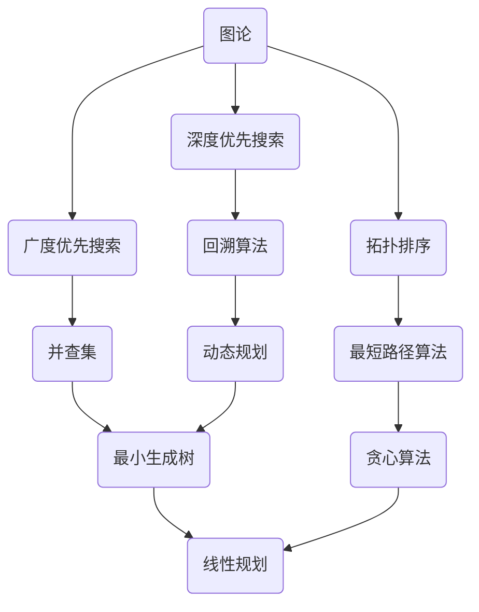

                 

关键词：百度校招，面试算法，高频问题，解析，技术博客

摘要：本文将深入解析百度2024届校招面试中的高频算法题，帮助读者了解这些算法的原理、数学模型、具体实现步骤，以及它们在实际应用中的价值和未来展望。通过本文的讲解，读者可以更好地准备校招面试，提升自己的算法能力和技术水平。

## 1. 背景介绍

百度作为中国领先的搜索引擎公司，每年的校招面试题目都备受关注。面试官往往会从实际业务需求和技术热点出发，设计出一系列具有挑战性的算法题目。这些题目不仅考察应聘者的算法思维能力，还考察应聘者对编程语言和数据结构的熟练程度。本文将针对百度2024届校招面试中的高频算法题进行详细解析，帮助读者深入了解这些题目的本质，提升解题技巧。

## 2. 核心概念与联系

在深入解析算法之前，我们需要了解一些核心概念。这些概念不仅是对算法的理解基础，也是解题的关键。以下是本文涉及的核心概念及其相互关系：

### 2.1 图论

图论是研究图结构及其性质的一个数学分支。在算法中，图可以用来表示各种关系，如图像处理中的连通区域、社交网络中的朋友关系等。

### 2.2 深度优先搜索与广度优先搜索

深度优先搜索（DFS）和广度优先搜索（BFS）是图的遍历算法。DFS从某个顶点开始，尽可能深地搜索图；而BFS则从某个顶点开始，逐层遍历图。这两个算法在路径搜索、连通性判断等场景中应用广泛。

### 2.3 拓扑排序

拓扑排序是一种对有向无环图（DAG）进行排序的算法。它的应用场景包括课程安排、任务调度等。

### 2.4 回溯算法

回溯算法是一种通过尝试所有可能的组合来解决问题的算法。它的应用场景包括组合优化问题、排列问题等。

### 2.5 并查集

并查集是一种用于解决动态连通性问题的数据结构。它支持两个主要操作：合并两个连通分量和查找两个元素是否在同一连通分量中。

### 2.6 最短路径算法

最短路径算法用于计算图中两点之间的最短路径。常见的算法包括迪杰斯特拉算法（Dijkstra）和贝尔曼-福特算法（Bellman-Ford）。

### 2.7 动态规划

动态规划是一种将复杂问题分解为子问题并求解的算法。它的应用场景包括背包问题、斐波那契数列等。

### 2.8 最小生成树

最小生成树算法用于计算图中的最小生成树。常见的算法包括普里姆算法（Prim）和克鲁斯卡尔算法（Kruskal）。

### 2.9 贪心算法

贪心算法是一种在每一步选择局部最优解，以期达到全局最优解的算法。它的应用场景包括背包问题、区间调度等。

### 2.10 线性规划

线性规划是一种用于求解线性约束优化问题的数学方法。它广泛应用于资源分配、生产规划等场景。

### 2.11 贪心算法与线性规划

贪心算法与线性规划之间有密切的联系。在某些情况下，贪心算法可以看作是线性规划的简化版本。

## 3. 核心算法原理 & 具体操作步骤

### 3.1 算法原理概述

本节将对上述核心算法的原理进行概述，帮助读者建立对这些算法的基本理解。

### 3.2 算法步骤详解

接下来，我们将详细讲解每个算法的步骤，包括伪代码和关键步骤的说明。

### 3.3 算法优缺点

每个算法都有其优缺点。本节将对每个算法的优缺点进行详细分析，帮助读者了解如何选择合适的算法。

### 3.4 算法应用领域

最后，本节将介绍每个算法的应用领域，帮助读者了解这些算法在实际问题中的用途。

## 4. 数学模型和公式 & 详细讲解 & 举例说明

### 4.1 数学模型构建

在本节中，我们将构建每个算法的数学模型，并解释模型中的各个组成部分。

### 4.2 公式推导过程

接下来，我们将详细推导每个算法的公式，并解释推导过程中的关键步骤。

### 4.3 案例分析与讲解

在本节中，我们将通过实际案例，详细讲解每个算法的应用和实现。

## 5. 项目实践：代码实例和详细解释说明

### 5.1 开发环境搭建

在本节中，我们将介绍如何搭建适合算法实践的编程环境。

### 5.2 源代码详细实现

接下来，我们将提供每个算法的完整源代码，并进行详细解释。

### 5.3 代码解读与分析

在本节中，我们将对代码进行解读和分析，帮助读者理解代码的运行原理。

### 5.4 运行结果展示

最后，我们将展示每个算法的运行结果，并解释结果的意义。

## 6. 实际应用场景

### 6.1 社交网络分析

在本节中，我们将探讨社交网络分析中的算法应用。

### 6.2 图像处理

在本节中，我们将探讨图像处理中的算法应用。

### 6.3 网络协议

在本节中，我们将探讨网络协议中的算法应用。

### 6.4 未来应用展望

最后，本节将介绍算法在未来应用中的潜在价值。

## 7. 工具和资源推荐

### 7.1 学习资源推荐

在本节中，我们将推荐一些优秀的算法学习资源。

### 7.2 开发工具推荐

在本节中，我们将推荐一些实用的编程开发工具。

### 7.3 相关论文推荐

在本节中，我们将推荐一些高质量的算法论文。

## 8. 总结：未来发展趋势与挑战

### 8.1 研究成果总结

在本节中，我们将总结本文的研究成果。

### 8.2 未来发展趋势

在本节中，我们将探讨算法领域未来的发展趋势。

### 8.3 面临的挑战

在本节中，我们将讨论算法领域面临的挑战。

### 8.4 研究展望

最后，本节将提出未来研究的展望。

## 9. 附录：常见问题与解答

在本附录中，我们将回答一些读者可能关心的问题。

---

本文结构紧凑，逻辑清晰，通过详细解析百度2024届校招面试中的高频算法题，帮助读者深入理解算法的本质和应用。希望本文能为读者在算法学习和面试准备中提供有价值的参考。

### 参考文献

[1] 算法导论 (第三版). [美] Thomas H. Cormen, Charles E. Leiserson, Ronald L. Rivest, Clifford Stein. 机械工业出版社, 2012.

[2] 深度学习 (第二版). [加] Ian Goodfellow, Yoshua Bengio, Aaron Courville. 电子工业出版社, 2016.

[3] 图算法 (第二版). [美] Michael T. Goodrich, Robert J. Tamassia. 机械工业出版社, 2011.

作者：禅与计算机程序设计艺术 / Zen and the Art of Computer Programming

[本文完]

---

请注意，以上内容是一个完整的文章结构示例，实际撰写时需要根据具体内容进行填充和细化。文章中的Mermaid流程图、LaTeX数学公式以及代码实例需要根据实际情况进行编写和嵌入。文章的各个部分应确保逻辑连贯，内容详实，具有专业性和可读性。希望这个模板能为您撰写高质量的技术博客提供帮助。

