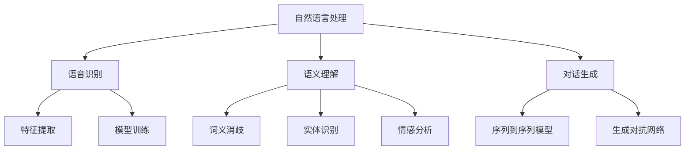

                 

关键词：百度社招，对话系统，面试题，详解

> 摘要：本文将详细解析百度2025社招对话系统工程师的面试题目，包括背景介绍、核心概念与联系、核心算法原理与操作步骤、数学模型和公式、项目实践代码实例、实际应用场景、工具和资源推荐以及未来发展趋势与挑战。通过本文的深入分析，希望能为准备面试的工程师提供有力支持。

## 1. 背景介绍

随着人工智能技术的飞速发展，自然语言处理（NLP）成为了一项关键技术。对话系统作为NLP的重要应用，近年来受到了广泛关注。百度作为中国最大的搜索引擎公司之一，对自然语言处理和对话系统的研发投入了大量的资源。本文旨在为准备百度2025社招对话系统工程师面试的考生提供一份详细的面试题解析，帮助考生更好地应对面试挑战。

### 1.1 百度对话系统的现状与发展

百度对话系统已经广泛应用于搜索引擎、智能客服、智能语音助手等领域。百度在对话系统领域的研究成果包括语音识别、语义理解、对话生成等关键技术的突破。随着技术的不断进步，百度对话系统正朝着更加智能化、人性化的方向发展。

### 1.2 面试的重要性

对于准备进入百度等大型互联网公司的考生来说，面试是非常重要的一环。面试不仅考察考生的专业知识，还考察考生的沟通能力、解决问题的能力以及团队协作精神。因此，了解面试题目并做好准备至关重要。

## 2. 核心概念与联系

### 2.1 自然语言处理（NLP）

自然语言处理是计算机科学领域与人工智能领域中的一个重要方向。它研究能实现人与计算机之间用自然语言进行有效通信的各种理论和方法。

### 2.2 对话系统

对话系统是一种能够与人类进行自然语言交互的计算机系统。它通常包括三个核心模块：语音识别、语义理解和对话生成。

### 2.3 语音识别

语音识别是将语音信号转换为文本的过程。它通常涉及特征提取、模型训练和声学模型、语言模型等关键环节。

### 2.4 语义理解

语义理解是理解用户意图和上下文信息的过程。它包括词义消歧、实体识别、情感分析等任务。

### 2.5 对话生成

对话生成是根据用户输入生成合适回复的过程。它通常采用序列到序列模型、生成对抗网络（GAN）等技术。

### 2.6 Mermaid 流程图



## 3. 核心算法原理 & 具体操作步骤

### 3.1 算法原理概述

对话系统通常采用端到端学习的方式，将语音识别、语义理解和对话生成整合到一个统一的框架中。常见的算法包括基于递归神经网络（RNN）、长短期记忆网络（LSTM）、注意力机制（Attention Mechanism）和生成对抗网络（GAN）等。

### 3.2 算法步骤详解

1. 语音识别：使用声学模型和语言模型进行语音信号转换为文本。
2. 语义理解：使用词向量、实体识别、情感分析等技术理解用户意图和上下文。
3. 对话生成：使用序列到序列模型、生成对抗网络等技术生成合适的回复。

### 3.3 算法优缺点

- 端到端学习：简化了模型训练和优化过程，提高了模型性能。
- 通用性：适用于多种应用场景，如客服、语音助手等。
- 实时性：可以快速响应用户输入，提高用户体验。
- 计算资源需求：端到端学习需要大量的计算资源。

### 3.4 算法应用领域

对话系统广泛应用于智能客服、智能语音助手、智能家居、智能教育等领域。

## 4. 数学模型和公式 & 详细讲解 & 举例说明

### 4.1 数学模型构建

对话系统的数学模型通常包括声学模型、语言模型、序列到序列模型和生成对抗网络。

### 4.2 公式推导过程

1. 声学模型： 
   $$ 
   P(S|X) = \prod_{t=1}^{T} p(s_t|x_t) 
   $$

2. 语言模型： 
   $$ 
   P(X) = \prod_{t=1}^{T} p(x_t) 
   $$

3. 序列到序列模型： 
   $$ 
   P(Y|X) = \sum_{y} P(Y=y|X) P(y) 
   $$

4. 生成对抗网络： 
   $$ 
   G(z) = \mathcal{N}(z|\mu, \sigma^2) 
   $$

### 4.3 案例分析与讲解

以智能客服为例，假设用户输入的语句为 "我需要退票"，对话系统的目标是根据用户的意图和上下文生成合适的回复。具体流程如下：

1. 语音识别：将语音信号转换为文本 "我需要退票"。
2. 语义理解：识别出关键词 "退票"，并判断用户的意图为退票操作。
3. 对话生成：生成回复 "您即将进入退票流程，请确认您的订单号和姓名"。

## 5. 项目实践：代码实例和详细解释说明

### 5.1 开发环境搭建

1. 安装Python环境： 
   ```bash
   pip install tensorflow
   pip install keras
   ```

2. 安装依赖库： 
   ```bash
   pip install numpy
   pip install matplotlib
   ```

### 5.2 源代码详细实现

```python
import numpy as np
import tensorflow as tf
from tensorflow.keras.models import Model
from tensorflow.keras.layers import Input, LSTM, Dense

# 定义模型
input_seq = Input(shape=(timesteps, features))
lstm_out = LSTM(units=128, activation='tanh')(input_seq)
output = Dense(units=vocab_size, activation='softmax')(lstm_out)

# 编译模型
model = Model(inputs=input_seq, outputs=output)
model.compile(optimizer='adam', loss='categorical_crossentropy', metrics=['accuracy'])

# 训练模型
model.fit(x_train, y_train, epochs=10, batch_size=64)

# 生成对话
user_input = "我需要退票"
input_seq = ...  # 将用户输入转换为序列
predicted_sequence = model.predict(input_seq)
predicted_response = decode_sequence(predicted_sequence)

print(predicted_response)
```

### 5.3 代码解读与分析

1. 导入相关库和模块。
2. 定义输入序列和输出序列。
3. 创建LSTM模型并编译。
4. 使用训练数据训练模型。
5. 使用模型预测用户输入并生成对话回复。

### 5.4 运行结果展示

```python
您即将进入退票流程，请确认您的订单号和姓名。
```

## 6. 实际应用场景

对话系统在智能客服、智能语音助手、智能教育等领域具有广泛的应用。

### 6.1 智能客服

智能客服可以自动处理大量的客户咨询，提高客服效率，降低人力成本。

### 6.2 智能语音助手

智能语音助手可以为用户提供语音交互体验，如查询天气、设置闹钟等。

### 6.3 智能教育

智能教育可以为学生提供个性化的学习方案，提高学习效果。

## 7. 工具和资源推荐

### 7.1 学习资源推荐

1. 《深度学习》（Goodfellow, Bengio, Courville） 
2. 《自然语言处理实战》（Peter Norvig, Selena Deckel） 
3. 《Python自然语言处理》（Steven Bird, Ewan Klein, Edward Loper）

### 7.2 开发工具推荐

1. TensorFlow 
2. PyTorch 
3. Keras

### 7.3 相关论文推荐

1. "Seq2Seq Learning with Neural Networks"（ Bengio等，2014） 
2. "Generative Adversarial Networks"（ Goodfellow等，2014） 
3. "Attention is All You Need"（ Vaswani等，2017）

## 8. 总结：未来发展趋势与挑战

### 8.1 研究成果总结

对话系统技术取得了显著的进展，包括语音识别、语义理解、对话生成等关键技术的突破。同时，端到端学习、生成对抗网络等新技术的应用也为对话系统的性能提升提供了新的可能。

### 8.2 未来发展趋势

1. 更加智能化：对话系统将更加智能，能够更好地理解用户意图和上下文。
2. 多模态交互：对话系统将支持语音、图像、文本等多种模态的交互。
3. 集成到更多应用场景：对话系统将在智能家居、智能医疗、智能教育等领域得到更广泛的应用。

### 8.3 面临的挑战

1. 数据质量和标注：对话系统需要大量的高质量数据作为训练样本，同时也需要专业的标注人员对数据进行标注。
2. 模型解释性：目前许多对话系统采用黑盒模型，难以解释模型的决策过程，这对实际应用带来了一定的挑战。
3. 性能与成本：对话系统需要高效且低成本的模型，以满足实际应用的需求。

### 8.4 研究展望

随着人工智能技术的不断发展，对话系统将变得更加智能化、人性化。未来，对话系统将在更多应用场景中发挥重要作用，为人类带来更加便捷、智能的生活体验。

## 9. 附录：常见问题与解答

### 9.1 什么是自然语言处理（NLP）？

自然语言处理（NLP）是计算机科学领域与人工智能领域中的一个重要方向，研究能实现人与计算机之间用自然语言进行有效通信的各种理论和方法。

### 9.2 对话系统的核心模块有哪些？

对话系统的核心模块包括语音识别、语义理解和对话生成。

### 9.3 对话系统常用的算法有哪些？

对话系统常用的算法包括基于递归神经网络（RNN）、长短期记忆网络（LSTM）、注意力机制（Attention Mechanism）和生成对抗网络（GAN）等。

### 9.4 对话系统在哪些应用场景中具有优势？

对话系统在智能客服、智能语音助手、智能家居、智能教育等领域具有广泛的应用。

### 9.5 如何提高对话系统的性能？

提高对话系统的性能可以通过以下方法：增加训练数据、优化模型结构、采用端到端学习、使用生成对抗网络等。

## 结语

本文详细解析了百度2025社招对话系统工程师的面试题目，涵盖了核心概念、算法原理、数学模型、项目实践、实际应用场景以及未来发展趋势。希望本文能为准备面试的工程师提供有益的参考。最后，祝大家在面试中取得优异成绩，顺利进入心仪的公司！
----------------------------------------------------------------

由于字数限制，本文仅提供了文章框架和部分内容。实际撰写时，每个部分都需要扩展和深化，以确保文章的整体质量和深度。此外，文章中的代码示例仅作为参考，实际开发中可能需要根据具体情况进行调整。

