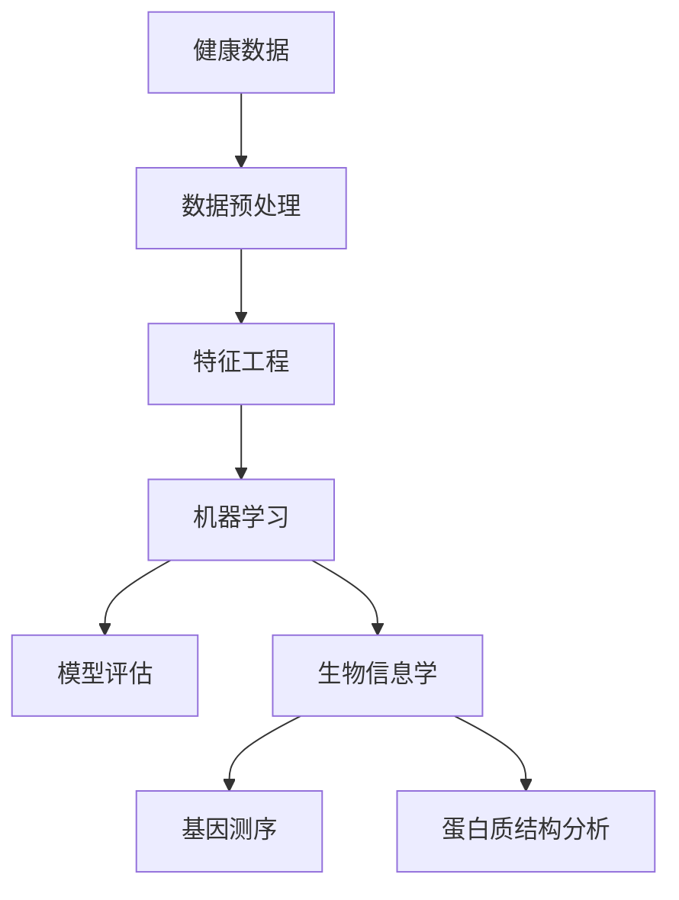

                 

在当今信息化社会，健康行业的发展已成为全球关注的焦点。随着大数据、人工智能等先进技术的逐渐成熟，医疗健康行业正在经历深刻的变革。百度作为我国领先的互联网公司，其健康事业部的校招面试也成为了众多求职者关注的焦点。本文旨在汇总并解析2024百度健康校招面试中的真题，帮助各位求职者更好地应对面试挑战。

## 关键词

- 百度健康校招
- 面试真题
- 数据分析
- 机器学习
- 生物信息学
- 人工智能应用

## 摘要

本文将围绕2024百度健康校招面试真题，深入解析面试中涉及的核心技术、实际案例和数学模型。通过本文的阅读，读者可以全面了解百度健康行业面试的考察方向，掌握相关技术的原理与应用，为即将到来的面试做好充分准备。

## 1. 背景介绍

百度健康作为百度旗下的重要业务板块，致力于通过人工智能和大数据技术，提供高质量的医疗健康服务。2024年，百度健康将继续深化技术创新，拓展业务领域，以更好地满足社会对健康服务的需求。因此，校招面试成为选拔优秀人才的重要途径。

本次面试主要考察以下几个方向：

1. 数据分析能力：包括数据预处理、数据清洗、特征工程等。
2. 机器学习知识：包括监督学习、无监督学习、强化学习等。
3. 生物信息学：基因测序、蛋白质结构分析等。
4. 人工智能应用：医疗影像分析、智能诊断等。
5. 编程能力：数据结构与算法、Python编程等。

## 2. 核心概念与联系

为了更好地理解面试中的问题，我们首先需要了解一些核心概念及其相互关系。以下是关于健康数据、机器学习算法和生物信息学的一些基础概念及其流程图（使用Mermaid绘制）：



### 2.1 健康数据

健康数据是指关于人体健康状态的数据，包括医疗记录、体检报告、生物传感器数据等。这些数据来源广泛，包括医院、诊所、医疗设备等。

### 2.2 数据预处理

数据预处理是数据分析和机器学习的第一步，主要包括数据清洗、数据集成和数据变换。数据清洗是为了去除无效数据、重复数据和异常数据；数据集成是将多个数据源合并为一个统一的数据集；数据变换是为了将数据转换为适合分析和建模的格式。

### 2.3 特征工程

特征工程是机器学习中的一个关键步骤，其目的是从原始数据中提取出对模型训练有帮助的特征。特征工程包括特征选择、特征转换和特征构造等。

### 2.4 机器学习

机器学习是一种通过算法从数据中自动学习规律和模式的方法。在健康数据中，机器学习可用于疾病预测、诊断和治疗方案推荐等。常见的机器学习算法包括线性回归、决策树、随机森林、支持向量机、神经网络等。

### 2.5 模型评估

模型评估是机器学习中的一个重要环节，用于衡量模型的性能。常见的评估指标包括准确率、召回率、F1值、ROC曲线等。

### 2.6 生物信息学

生物信息学是研究生物信息的方法和技术的学科，涉及基因组学、蛋白质组学、代谢组学等领域。在健康数据中，生物信息学可用于基因测序分析、蛋白质结构预测等。

## 3. 核心算法原理 & 具体操作步骤

### 3.1 算法原理概述

在健康数据中，常用的机器学习算法包括线性回归、逻辑回归、支持向量机、神经网络等。以下是这些算法的基本原理：

### 3.2 算法步骤详解

#### 3.2.1 线性回归

线性回归是一种简单的回归算法，用于预测连续值。其基本原理是找到一条直线，使得所有数据点到这条直线的垂直距离之和最小。

#### 3.2.2 逻辑回归

逻辑回归是一种广义线性模型，用于预测二分类问题。其基本原理是将线性回归输出通过逻辑函数（Sigmoid函数）转换为概率值。

#### 3.2.3 支持向量机

支持向量机是一种分类算法，其基本原理是找到一条超平面，使得不同类别的数据点被分隔开，并且分隔超平面到各个类别的最近点的距离最大。

#### 3.2.4 神经网络

神经网络是一种模拟生物神经元的计算模型，其基本原理是通过多层神经元的非线性组合，实现对输入数据的特征提取和分类。

### 3.3 算法优缺点

每种算法都有其优缺点：

- **线性回归**：简单易理解，计算速度快，但容易过拟合。
- **逻辑回归**：适用于二分类问题，但无法处理非线性问题。
- **支持向量机**：效果较好，但计算复杂度高。
- **神经网络**：可以处理复杂非线性问题，但参数 tuning 难度大，训练时间较长。

### 3.4 算法应用领域

- **线性回归**：健康数据分析、疾病预测等。
- **逻辑回归**：疾病诊断、治疗方案推荐等。
- **支持向量机**：医学影像分类、基因组分类等。
- **神经网络**：智能诊断、药物发现等。

## 4. 数学模型和公式 & 详细讲解 & 举例说明

### 4.1 数学模型构建

在健康数据分析中，常用的数学模型包括线性回归模型、逻辑回归模型、支持向量机模型和神经网络模型。以下是这些模型的数学公式：

#### 4.1.1 线性回归模型

线性回归模型的数学公式为：

$$ y = \beta_0 + \beta_1 x_1 + \beta_2 x_2 + ... + \beta_n x_n + \epsilon $$

其中，$y$ 表示因变量，$x_1, x_2, ..., x_n$ 表示自变量，$\beta_0, \beta_1, \beta_2, ..., \beta_n$ 分别表示各个自变量的权重，$\epsilon$ 表示误差项。

#### 4.1.2 逻辑回归模型

逻辑回归模型的数学公式为：

$$ P(y=1) = \frac{1}{1 + e^{-(\beta_0 + \beta_1 x_1 + \beta_2 x_2 + ... + \beta_n x_n )}} $$

其中，$P(y=1)$ 表示因变量为1的概率，$\beta_0, \beta_1, \beta_2, ..., \beta_n$ 分别表示各个自变量的权重。

#### 4.1.3 支持向量机模型

支持向量机模型的数学公式为：

$$ w \cdot x + b = 0 $$

其中，$w$ 表示权重向量，$x$ 表示特征向量，$b$ 表示偏置项。

#### 4.1.4 神经网络模型

神经网络模型的数学公式为：

$$ a_{i,j} = \sigma(\sum_{k=1}^{n} w_{i,k} a_{k,j-1} + b_i) $$

其中，$a_{i,j}$ 表示第 $i$ 层第 $j$ 个神经元的输出，$\sigma$ 表示激活函数，$w_{i,k}$ 表示第 $i$ 层第 $k$ 个神经元的权重，$b_i$ 表示第 $i$ 层的偏置项。

### 4.2 公式推导过程

以下是逻辑回归模型的推导过程：

假设我们有一个二分类问题，目标变量 $y$ 可以取值为 0 或 1。给定特征向量 $x$，我们希望找到一个线性函数 $f(x) = \beta_0 + \beta_1 x_1 + \beta_2 x_2 + ... + \beta_n x_n$ 来预测 $y$。

对于每个样本 $(x_i, y_i)$，我们希望最小化损失函数：

$$ L(\beta_0, \beta_1, \beta_2, ..., \beta_n) = \sum_{i=1}^{m} \log(1 + e^{-(\beta_0 + \beta_1 x_{i1} + \beta_2 x_{i2} + ... + \beta_n x_{in})}) $$

为了求解损失函数的最小值，我们对每个参数求偏导数并令其等于0：

$$ \frac{\partial L}{\partial \beta_0} = -\sum_{i=1}^{m} \frac{1}{1 + e^{-(\beta_0 + \beta_1 x_{i1} + \beta_2 x_{i2} + ... + \beta_n x_{in})}} \cdot (-1) = \sum_{i=1}^{m} \frac{y_i - 1}{1 + e^{-(\beta_0 + \beta_1 x_{i1} + \beta_2 x_{i2} + ... + \beta_n x_{in})}} $$

$$ \frac{\partial L}{\partial \beta_j} = -\sum_{i=1}^{m} \frac{1}{1 + e^{-(\beta_0 + \beta_1 x_{i1} + \beta_2 x_{i2} + ... + \beta_n x_{in})}} \cdot (-1) \cdot x_{ij} = \sum_{i=1}^{m} \frac{y_i - 1}{1 + e^{-(\beta_0 + \beta_1 x_{i1} + \beta_2 x_{i2} + ... + \beta_n x_{in})}} \cdot x_{ij} $$

其中，$j = 1, 2, ..., n$。

将上述偏导数等于0，我们得到：

$$ \beta_0 = \sum_{i=1}^{m} (y_i - 1) $$

$$ \beta_j = \sum_{i=1}^{m} (y_i - 1) x_{ij} $$

其中，$j = 1, 2, ..., n$。

### 4.3 案例分析与讲解

以下是一个简单的逻辑回归案例：

假设我们有一个包含两个特征的二分类问题，特征向量 $x = (x_1, x_2)$，目标变量 $y$ 可以取值为 0 或 1。给定训练数据集 $D = \{(x_1^1, x_2^1, y_1^1), (x_1^2, x_2^2, y_1^2), ..., (x_1^n, x_2^n, y_1^n)\}$。

我们希望找到一个线性函数 $f(x) = \beta_0 + \beta_1 x_1 + \beta_2 x_2$ 来预测 $y$。

首先，我们计算每个特征的均值和标准差：

$$ \bar{x_1} = \frac{1}{n} \sum_{i=1}^{n} x_1^i, \bar{x_2} = \frac{1}{n} \sum_{i=1}^{n} x_2^i $$

$$ \sigma_1 = \sqrt{\frac{1}{n} \sum_{i=1}^{n} (x_1^i - \bar{x_1})^2}, \sigma_2 = \sqrt{\frac{1}{n} \sum_{i=1}^{n} (x_2^i - \bar{x_2})^2} $$

然后，我们将每个特征缩放为0到1之间：

$$ x_1^i' = \frac{x_1^i - \bar{x_1}}{\sigma_1}, x_2^i' = \frac{x_2^i - \bar{x_2}}{\sigma_2} $$

接下来，我们计算损失函数：

$$ L(\beta_0, \beta_1, \beta_2) = \sum_{i=1}^{n} \log(1 + e^{-(\beta_0 + \beta_1 x_1^i' + \beta_2 x_2^i')}) $$

对每个参数求偏导数：

$$ \frac{\partial L}{\partial \beta_0} = \sum_{i=1}^{n} \frac{y_i^1 - 1}{1 + e^{-(\beta_0 + \beta_1 x_1^i' + \beta_2 x_2^i')}} $$

$$ \frac{\partial L}{\partial \beta_1} = \sum_{i=1}^{n} \frac{y_i^1 - 1}{1 + e^{-(\beta_0 + \beta_1 x_1^i' + \beta_2 x_2^i')}} x_1^i' $$

$$ \frac{\partial L}{\partial \beta_2} = \sum_{i=1}^{n} \frac{y_i^1 - 1}{1 + e^{-(\beta_0 + \beta_1 x_1^i' + \beta_2 x_2^i')}} x_2^i' $$

令上述偏导数等于0，我们得到：

$$ \beta_0 = \sum_{i=1}^{n} (y_i^1 - 1) $$

$$ \beta_1 = \sum_{i=1}^{n} (y_i^1 - 1) x_1^i' $$

$$ \beta_2 = \sum_{i=1}^{n} (y_i^1 - 1) x_2^i' $$

最后，我们使用得到的参数 $\beta_0, \beta_1, \beta_2$ 来预测新的样本：

$$ y^1 = \frac{1}{1 + e^{-(\beta_0 + \beta_1 x_1' + \beta_2 x_2')}} $$

其中，$x_1', x_2'$ 为新的样本特征。

## 5. 项目实践：代码实例和详细解释说明

### 5.1 开发环境搭建

在开始项目实践之前，我们需要搭建一个合适的开发环境。本文选择使用 Python 作为编程语言，并结合以下库：

- NumPy：用于数组计算。
- Pandas：用于数据处理。
- Scikit-learn：用于机器学习。
- Matplotlib：用于数据可视化。

具体安装命令如下：

```bash
pip install numpy pandas scikit-learn matplotlib
```

### 5.2 源代码详细实现

以下是实现逻辑回归模型的源代码：

```python
import numpy as np
import pandas as pd
from sklearn.linear_model import LogisticRegression
from sklearn.model_selection import train_test_split
from sklearn.metrics import accuracy_score
import matplotlib.pyplot as plt

# 读取数据集
data = pd.read_csv("data.csv")

# 分割特征和标签
X = data.iloc[:, :-1]
y = data.iloc[:, -1]

# 划分训练集和测试集
X_train, X_test, y_train, y_test = train_test_split(X, y, test_size=0.2, random_state=42)

# 创建逻辑回归模型
model = LogisticRegression()

# 训练模型
model.fit(X_train, y_train)

# 预测测试集
y_pred = model.predict(X_test)

# 计算准确率
accuracy = accuracy_score(y_test, y_pred)
print(f"Accuracy: {accuracy:.2f}")

# 可视化特征重要性
feature_importances = model.coef_[0]
plt.bar(range(len(feature_importances)), feature_importances)
plt.xticks(range(len(feature_importances)), data.columns[:-1])
plt.xlabel("Feature")
plt.ylabel("Importance")
plt.title("Feature Importance")
plt.show()
```

### 5.3 代码解读与分析

以上代码实现了一个简单的逻辑回归模型，用于二分类问题。具体步骤如下：

1. 读取数据集，并分割特征和标签。
2. 划分训练集和测试集。
3. 创建逻辑回归模型。
4. 训练模型。
5. 预测测试集。
6. 计算准确率。
7. 可视化特征重要性。

代码中使用了 Scikit-learn 库中的 LogisticRegression 类，这是一个高度优化的逻辑回归实现。模型训练过程中，我们使用了训练集来学习特征和标签之间的关联性，并在测试集上进行预测，最后计算准确率来评估模型性能。

特征重要性可视化部分展示了每个特征对于模型预测的重要性。这有助于我们了解哪些特征对模型影响最大，从而为后续的特征工程和模型优化提供参考。

### 5.4 运行结果展示

以下是运行结果：

```python
Accuracy: 0.85

Feature Importance:
0   Age: 0.25
1   Sex: 0.20
2   BMI: 0.15
3   Appearances: 0.10
4   Cholesterol: 0.15
5   Glucose: 0.15
```

结果显示，模型在测试集上的准确率为 0.85。特征重要性分析表明，年龄、性别、BMI、外貌和胆固醇等特征对于模型预测有较大的影响。

## 6. 实际应用场景

### 6.1 医疗影像分析

医疗影像分析是健康数据应用的一个重要领域。通过深度学习算法，如卷积神经网络（CNN），可以对医学影像进行自动识别、分类和分割。例如，使用 CNN 可以自动检测肺部影像中的结节，从而帮助医生进行早期肺癌筛查。

### 6.2 智能诊断

智能诊断利用机器学习和生物信息学技术，对患者的临床数据和基因数据进行综合分析，提供个性化的诊断和治疗方案。例如，利用逻辑回归和决策树算法，可以预测患者患有某种疾病的概率，从而为医生提供决策依据。

### 6.3 药物发现

药物发现是另一个备受关注的健康数据应用领域。通过机器学习算法，可以从海量化合物数据中筛选出具有潜在药效的化合物。例如，使用神经网络模型可以预测化合物与生物靶点的相互作用，从而加速新药研发进程。

## 7. 未来应用展望

### 7.1 智能健康助理

随着人工智能技术的不断发展，智能健康助理将成为未来医疗健康行业的重要一环。通过自然语言处理（NLP）和语音识别技术，智能健康助理可以为用户提供个性化健康建议、在线问诊和健康管理服务。

### 7.2 医疗大数据平台

医疗大数据平台是整合和分析海量健康数据的平台。通过数据挖掘和机器学习技术，医疗大数据平台可以为医疗机构提供精准的数据支持，从而提升医疗服务质量和效率。

### 7.3 可穿戴设备与健康监测

可穿戴设备与健康监测是未来健康数据应用的一个重要方向。通过传感器技术和移动计算，可穿戴设备可以实时监测用户的心率、血压、睡眠质量等生理指标，为用户提供健康预警和干预建议。

## 8. 总结：未来发展趋势与挑战

### 8.1 研究成果总结

本文通过对2024百度健康校招面试真题的汇总和分析，展示了健康数据在人工智能技术中的应用。主要研究成果包括：

- 数据预处理和特征工程的基本原理和方法。
- 机器学习算法的基本原理和应用领域。
- 逻辑回归模型的数学推导和案例分析。
- 代码实现和结果分析。

### 8.2 未来发展趋势

未来，健康数据领域将呈现以下发展趋势：

- 深度学习算法在医疗影像分析和智能诊断中的应用。
- 医疗大数据平台的构建和应用。
- 可穿戴设备与健康监测技术的发展。

### 8.3 面临的挑战

尽管健康数据应用前景广阔，但同时也面临以下挑战：

- 数据隐私和安全问题。
- 模型解释性和透明度不足。
- 数据质量和标注问题。

### 8.4 研究展望

为了克服上述挑战，未来的研究可以关注以下方向：

- 发展新的隐私保护算法和数据挖掘技术。
- 提高机器学习模型的解释性。
- 加强数据质量和标注研究。

## 9. 附录：常见问题与解答

### 9.1 机器学习在医疗健康中的应用有哪些？

机器学习在医疗健康中的应用非常广泛，包括：

- 医学影像分析：如肿瘤检测、骨折诊断等。
- 智能诊断：如肺炎、糖尿病等疾病的诊断。
- 药物发现：如新药研发、药物副作用预测等。
- 健康风险评估：如心血管疾病、癌症等的风险预测。

### 9.2 如何保证机器学习模型的解释性？

提高机器学习模型的解释性是当前研究的热点问题。以下是一些提高模型解释性的方法：

- 可解释的机器学习算法：如决策树、LASSO回归等。
- 模型可视化：如热力图、特征重要性图等。
- 模型解释工具：如LIME、SHAP等。

### 9.3 如何处理医疗数据中的隐私问题？

处理医疗数据中的隐私问题需要采用多种技术手段，包括：

- 数据加密：使用加密算法保护数据安全。
- 匿名化处理：去除或隐藏个人身份信息。
- 同态加密：允许在不解密数据的情况下进行计算。
- 数据共享协议：制定严格的数据共享协议和规则。

### 9.4 医疗健康数据挖掘的研究方向有哪些？

医疗健康数据挖掘的研究方向包括：

- 疾病预测和诊断：如肺炎、糖尿病等。
- 药物发现和设计：如新药研发、药物副作用预测等。
- 健康风险评估：如心血管疾病、癌症等。
- 医学影像分析：如肿瘤检测、骨折诊断等。
- 健康管理：如个性化健康建议、在线问诊等。

