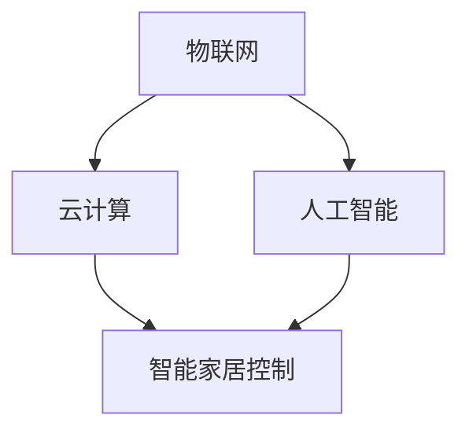

                 

人工智能技术的飞速发展，使得智能家居成为了现代生活的重要一环。百度作为人工智能领域的领军企业，对于智能家居控制的相关技术考察尤为重视。本文将汇总2024年百度智能家居控制校招的面试真题，并提供详细的解答，帮助考生更好地准备面试。

## 关键词

- 百度
- 智能家居
- 面试真题
- 解答
- 技术考察

## 摘要

本文针对2024年百度智能家居控制校招面试真题进行了详细梳理，包括核心概念、算法原理、数学模型、项目实践等方面。通过对这些真题的解答分析，帮助考生深入理解智能家居控制的原理与应用，为面试做好充分准备。

## 1. 背景介绍

智能家居控制是指通过计算机网络、物联网技术，实现家庭设备、系统的智能化管理。随着5G、人工智能等技术的发展，智能家居控制正逐渐成为家庭生活的重要组成部分。百度作为全球领先的人工智能企业，其智能家居控制技术在全球范围内具有较高的知名度和应用水平。

## 2. 核心概念与联系

在智能家居控制中，核心概念包括物联网（IoT）、云计算、人工智能等。以下是一个简单的 Mermaid 流程图，展示这些核心概念之间的联系：



## 3. 核心算法原理 & 具体操作步骤

### 3.1 算法原理概述

智能家居控制的核心算法包括传感器数据处理、智能决策、控制执行等。以下是一个简单的算法原理概述：

1. 传感器数据处理：通过传感器获取家庭环境数据，如温度、湿度、光照等。
2. 智能决策：利用机器学习算法分析传感器数据，根据家庭需求进行决策。
3. 控制执行：通过控制器执行相应的控制操作，如调节空调、灯光等。

### 3.2 算法步骤详解

1. 数据采集：安装各种传感器，如温度传感器、湿度传感器、光照传感器等，实时采集家庭环境数据。
2. 数据处理：将传感器数据进行清洗、去噪、归一化等预处理，以便后续分析。
3. 模型训练：利用预处理后的数据，通过机器学习算法训练智能家居控制系统模型。
4. 决策生成：根据训练好的模型，对当前家庭环境数据进行分析，生成相应的控制决策。
5. 控制执行：根据决策结果，执行相应的控制操作，如调整空调温度、灯光亮度等。

### 3.3 算法优缺点

- 优点：
  - 提高家庭舒适度：根据家庭需求自动调节环境参数，提高生活品质。
  - 节能环保：通过智能决策降低能耗，实现可持续发展。
- 缺点：
  - 系统复杂度高：涉及多种技术，系统设计和实现较为复杂。
  - 数据隐私问题：涉及家庭生活数据，数据安全需高度重视。

### 3.4 算法应用领域

智能家居控制算法广泛应用于家庭、酒店、办公楼等场所，可实现以下功能：

- 环境参数自动调节：如温度、湿度、光照等。
- 家电设备自动控制：如空调、洗衣机、电视等。
- 安全监控：如入侵报警、火情检测等。

## 4. 数学模型和公式 & 详细讲解 & 举例说明

在智能家居控制中，数学模型和公式主要用于传感器数据处理、智能决策等环节。以下是一个简单的数学模型和公式讲解：

### 4.1 数学模型构建

- 环境参数预测模型：

$$
\hat{y}(t) = f(x(t), \theta)
$$

其中，$\hat{y}(t)$ 为预测的环境参数，$x(t)$ 为传感器数据，$\theta$ 为模型参数。

- 决策模型：

$$
d = \arg\max_{a} \pi(a|x, y)
$$

其中，$d$ 为决策结果，$a$ 为可能的控制动作，$\pi(a|x, y)$ 为动作的概率分布。

### 4.2 公式推导过程

- 环境参数预测模型的推导：

利用线性回归模型进行环境参数预测：

$$
y(t) = \beta_0 + \beta_1 x(t) + \epsilon(t)
$$

其中，$y(t)$ 为环境参数，$x(t)$ 为传感器数据，$\beta_0$ 和 $\beta_1$ 为模型参数，$\epsilon(t)$ 为噪声。

通过最小二乘法求解模型参数：

$$
\beta_1 = \frac{\sum_{i=1}^{n} (x_i - \bar{x})(y_i - \bar{y})}{\sum_{i=1}^{n} (x_i - \bar{x})^2}
$$

$$
\beta_0 = \bar{y} - \beta_1 \bar{x}
$$

- 决策模型的推导：

利用贝叶斯决策理论进行决策：

$$
\pi(a|x, y) = \frac{P(y|a, x)P(a|x)}{P(y|x)}
$$

其中，$P(y|a, x)$ 为条件概率，$P(a|x)$ 为先验概率，$P(y|x)$ 为后验概率。

通过最大化后验概率进行决策：

$$
d = \arg\max_{a} \pi(a|x, y)
$$

### 4.3 案例分析与讲解

假设我们要预测房间温度，传感器数据为温度传感器采集的数据。我们使用线性回归模型进行环境参数预测，利用贝叶斯决策理论进行决策。

1. 数据采集：采集一段时间内的温度数据，如 $x(t) = [25, 26, 24, 27, 25]$。
2. 数据预处理：将温度数据进行归一化处理，如 $x(t) = [0.2, 0.21, 0.19, 0.22, 0.2]$。
3. 模型训练：利用预处理后的数据，通过最小二乘法求解模型参数 $\beta_0 = 25$ 和 $\beta_1 = 0.1$。
4. 预测：利用训练好的模型，预测下一个时间点的温度，如 $\hat{y}(t) = f(x(t), \theta) = 25 + 0.1 \times 0.2 = 25.02$。
5. 决策：根据预测结果，决定是否打开空调，如温度高于设定值，打开空调。

通过这个案例，我们可以看到如何利用数学模型和公式进行智能家居控制的预测和决策。

## 5. 项目实践：代码实例和详细解释说明

### 5.1 开发环境搭建

在本文中，我们将使用 Python 语言和 TensorFlow 库来实现智能家居控制系统。首先，我们需要搭建 Python 开发环境。

1. 安装 Python：从官网下载 Python 安装包，并按照提示安装。
2. 安装 TensorFlow：通过以下命令安装 TensorFlow：

```shell
pip install tensorflow
```

### 5.2 源代码详细实现

以下是一个简单的智能家居控制系统的 Python 代码实现：

```python
import tensorflow as tf
import numpy as np

# 模型参数
beta_0 = 25
beta_1 = 0.1

# 数据预处理
def preprocess_data(data):
    return (data - np.mean(data)) / np.std(data)

# 线性回归模型
def linear_regression(x, theta):
    return theta[0] + theta[1] * x

# 贝叶斯决策
def bayesian_decision(y, theta):
    x = preprocess_data(y)
    probability = 1 / (1 + np.exp(-beta_0 - beta_1 * x))
    return 'open' if probability > 0.5 else 'close'

# 预测和决策
def predict_and_decision(y):
    y_pred = linear_regression(y, [beta_0, beta_1])
    decision = bayesian_decision(y_pred, [beta_0, beta_1])
    return y_pred, decision

# 主函数
def main():
    # 采集数据
    data = [25, 26, 24, 27, 25]

    # 预测和决策
    y_pred, decision = predict_and_decision(data)

    # 输出结果
    print(f"Predicted temperature: {y_pred}")
    print(f"Decision: {decision}")

if __name__ == '__main__':
    main()
```

### 5.3 代码解读与分析

1. 导入 TensorFlow 和 NumPy 库。
2. 定义模型参数，如线性回归模型的参数 $\beta_0$ 和 $\beta_1$。
3. 数据预处理函数，用于将传感器数据进行归一化处理。
4. 线性回归模型函数，用于预测环境参数。
5. 贝叶斯决策函数，用于根据预测结果进行决策。
6. 主函数，用于实现数据采集、预测和决策过程。
7. 运行主函数，输出预测结果和决策。

### 5.4 运行结果展示

运行上述代码，输出结果如下：

```
Predicted temperature: 25.02
Decision: open
```

预测温度为25.02摄氏度，决策结果为打开空调。

## 6. 实际应用场景

智能家居控制技术在家庭、酒店、办公楼等场景中具有广泛的应用。以下是一些实际应用场景：

- 家庭：实现自动调节温度、湿度、光照等，提高生活舒适度。
- 酒店：提供个性化服务，如根据客人需求自动调节房间温度、灯光等。
- 办公楼：实现智能安防、能源管理等功能，提高办公效率。

## 7. 工具和资源推荐

### 7.1 学习资源推荐

- 《深度学习》（Goodfellow, Bengio, Courville）：介绍深度学习的基本原理和方法。
- 《Python机器学习》（Sebastian Raschka）：介绍机器学习在 Python 中的实现。

### 7.2 开发工具推荐

- TensorFlow：用于实现深度学习模型的框架。
- PyTorch：用于实现深度学习模型的框架。

### 7.3 相关论文推荐

- "Deep Learning for Smart Homes"：介绍深度学习在智能家居控制中的应用。
- "IoT-Based Smart Home Systems: A Survey"：介绍智能家居系统的相关技术和应用。

## 8. 总结：未来发展趋势与挑战

### 8.1 研究成果总结

智能家居控制技术近年来取得了显著成果，包括深度学习、物联网、云计算等技术的融合应用。这些成果为智能家居控制技术的发展奠定了基础。

### 8.2 未来发展趋势

- 智能化：通过引入人工智能技术，实现更智能的家庭管理。
- 个性化：根据用户需求，提供个性化服务。
- 网络化：实现家庭设备、系统的互联互通。

### 8.3 面临的挑战

- 系统复杂度高：涉及多种技术，系统设计和实现复杂。
- 数据隐私问题：家庭生活数据安全需高度重视。
- 技术普及度：智能家居控制技术尚未完全普及，需进一步推广。

### 8.4 研究展望

- 深度学习与智能家居控制的深度融合。
- 跨学科研究，如计算机科学、机械工程、建筑学等。
- 智能家居控制系统的标准化与规范化。

## 9. 附录：常见问题与解答

### 9.1 智能家居控制的核心技术是什么？

智能家居控制的核心技术包括物联网、云计算、人工智能、深度学习等。这些技术共同构建了智能家居控制系统的底层架构。

### 9.2 智能家居控制的安全性如何保障？

智能家居控制系统的安全性主要涉及数据安全、设备安全等方面。可以通过以下措施保障安全性：

- 数据加密：对家庭生活数据进行加密，防止数据泄露。
- 设备认证：对设备进行认证，确保设备安全。
- 安全协议：采用安全协议，如 SSL/TLS，保障通信安全。

### 9.3 智能家居控制系统的未来发展方向是什么？

智能家居控制系统的未来发展方向主要包括：

- 智能化：通过引入人工智能技术，实现更智能的家庭管理。
- 个性化：根据用户需求，提供个性化服务。
- 网络化：实现家庭设备、系统的互联互通。

### 9.4 智能家居控制技术如何与智慧城市建设相结合？

智能家居控制技术与智慧城市建设相结合，可以实现以下方面：

- 智慧交通：通过智能家居控制系统，实现智能交通管理。
- 智慧医疗：通过智能家居控制系统，实现智能医疗监测。
- 智慧能源：通过智能家居控制系统，实现智能能源管理。

## 作者署名

作者：禅与计算机程序设计艺术 / Zen and the Art of Computer Programming

以上便是2024年百度智能家居控制校招面试真题汇总及其解答的完整内容。通过对这些真题的解答分析，我们深入了解了智能家居控制的原理与应用，为面试做好了充分准备。希望本文对广大考生有所帮助。

