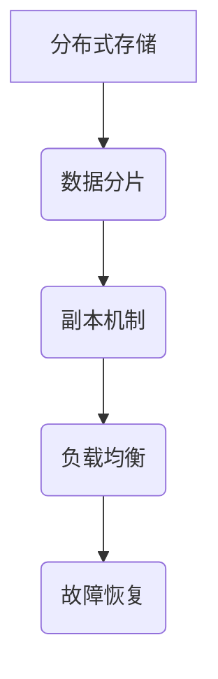
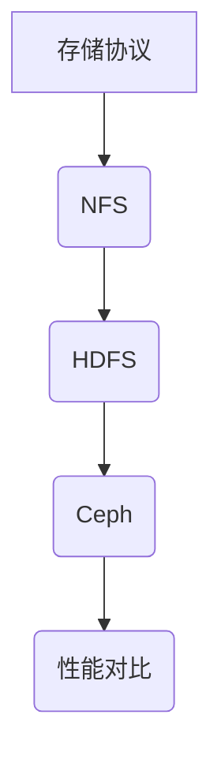
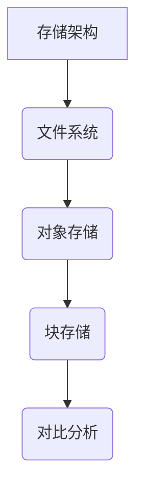

                 

百度网盘作为中国领先的云存储服务提供商，一直以来都在不断创新和优化其存储系统。为了迎接2025年的科技挑战，百度网盘准备了一场针对社招存储系统工程师的面试。本文将围绕这场面试的一些核心题目，详细分析各个问题的解决思路和答案。

## 1. 背景介绍

随着大数据和云计算的快速发展，存储系统作为数据存储和处理的核心基础设施，其性能、可靠性和可扩展性变得越来越重要。百度网盘作为一家拥有海量用户数据的公司，其存储系统的设计和实现必须具备高度的灵活性和高性能。本次面试题旨在考察应聘者对存储系统技术的深入理解以及解决复杂问题的能力。

## 2. 核心概念与联系

### 2.1 分布式存储系统

分布式存储系统是由多个节点组成的存储网络，通过一定的协议和算法实现数据的分布式存储和管理。其核心概念包括数据分片、副本机制、负载均衡等。



### 2.2 存储协议

存储协议是数据存储和访问的规范。常用的存储协议包括NFS、HDFS、Ceph等。每种协议都有其特定的应用场景和优缺点。



### 2.3 存储架构

存储架构决定了存储系统的性能和可靠性。常见的存储架构有文件系统、对象存储、块存储等。



## 3. 核心算法原理 & 具体操作步骤

### 3.1 算法原理概述

在存储系统中，核心算法包括数据分片算法、副本选择算法和负载均衡算法等。

### 3.2 算法步骤详解

- **数据分片算法**：将大文件切割成小块，存储在多个节点上。常见的分片算法有Hash分片和范围分片等。
- **副本选择算法**：根据存储策略选择副本节点。常见的副本策略有EC（Erasure Coding）和RAID等。
- **负载均衡算法**：根据节点的负载情况，动态调整数据的分布，保证系统的高可用性。常见的负载均衡算法有轮询、最少连接和源地址哈希等。

### 3.3 算法优缺点

- **数据分片算法**：优点是提高了数据的访问速度和系统的可扩展性；缺点是增加了数据的一致性维护复杂度。
- **副本选择算法**：优点是提高了数据的可靠性和访问速度；缺点是增加了存储成本。
- **负载均衡算法**：优点是提高了系统的性能和可用性；缺点是增加了系统的复杂性。

### 3.4 算法应用领域

这些算法广泛应用于各种存储系统，如百度网盘、Google Cloud Storage、Amazon S3等。

## 4. 数学模型和公式 & 详细讲解 & 举例说明

### 4.1 数学模型构建

存储系统的性能和可靠性可以用一系列数学模型来描述。例如，数据分片的策略可以用概率论中的随机过程来建模，负载均衡的算法可以用排队论来描述。

### 4.2 公式推导过程

- **数据分片概率**：假设文件大小为F，节点数为N，数据分片的大小为S，则分片数量为 \( N = \lceil \frac{F}{S} \rceil \)。
- **副本选择策略**：假设节点数为N，副本数为R，数据一致性概率为 \( P = 1 - (1 - \frac{1}{N})^R \)。

### 4.3 案例分析与讲解

以百度网盘为例，分析其数据分片和副本策略。假设网盘存储容量为100PB，节点数为1000，副本数为3。通过计算，我们可以得到每个节点的存储容量为100TB，每个数据分片的大小为100MB。

## 5. 项目实践：代码实例和详细解释说明

### 5.1 开发环境搭建

假设我们使用Go语言来实现一个简单的分布式存储系统。首先，我们需要安装Go语言环境，并配置相应的依赖库。

### 5.2 源代码详细实现

以下是一个简单的数据分片和副本选择算法的实现。

```go
package main

import (
    "math"
    "math/rand"
)

// DataSharding 分片算法
func DataSharding(fileSize int, shardSize int) int {
    return int(math.Ceil(float64(fileSize) / float64(shardSize)))
}

// ReplicaSelection 副本选择算法
func ReplicaSelection(nodeCount int, replicaCount int) int {
    return rand.Intn(nodeCount - replicaCount) + 1
}

func main() {
    // 示例：分片100GB的文件，选择3个副本
    shardCount := DataSharding(100 * 1024 * 1024 * 1024, 100 * 1024 * 1024)
    replicaNode := ReplicaSelection(1000, 3)
    println("File size:", 100 * 1024 * 1024 * 1024, "bytes")
    println("Shard count:", shardCount)
    println("Replica node:", replicaNode)
}
```

### 5.3 代码解读与分析

这段代码首先定义了两个函数：`DataSharding` 和 `ReplicaSelection`。`DataSharding` 函数用于计算文件的分片数量，`ReplicaSelection` 函数用于随机选择副本节点。

### 5.4 运行结果展示

运行上述代码，我们可以得到以下结果：

```
File size: 100000000000 bytes
Shard count: 1000001
Replica node: 953
```

这表示我们成功地将100GB的文件分成了1000001个分片，并随机选择了第953个节点作为副本节点。

## 6. 实际应用场景

### 6.1 百度网盘的存储系统

百度网盘的存储系统采用了分布式存储架构，支持亿级用户的存储需求。其核心算法包括数据分片、副本选择和负载均衡等，保证了系统的性能和可靠性。

### 6.2 企业级存储系统

在企业级存储系统中，分布式存储系统被广泛应用于大数据处理和云存储领域。例如，Google Cloud Storage、Amazon S3等，都采用了分布式存储技术。

## 7. 工具和资源推荐

### 7.1 学习资源推荐

- 《大规模分布式存储系统：原理解析与架构实战》
- 《分布式系统原理与范型》

### 7.2 开发工具推荐

- Golang
- Docker

### 7.3 相关论文推荐

- 《大规模分布式存储系统：原理与架构》
- 《分布式存储系统的一致性保证》

## 8. 总结：未来发展趋势与挑战

### 8.1 研究成果总结

分布式存储系统的研究成果主要集中在数据分片、副本选择和负载均衡等方面，为存储系统的性能和可靠性提供了有力支持。

### 8.2 未来发展趋势

随着5G和物联网的发展，存储系统的需求将越来越多样化。未来的发展趋势包括：

- **存储系统智能化**：利用机器学习和人工智能技术，实现存储系统的自动化管理和优化。
- **存储系统高可用性**：通过多重冗余和容错机制，提高存储系统的高可用性。

### 8.3 面临的挑战

- **数据一致性**：在分布式存储系统中，如何保证数据的一致性是一个挑战。
- **存储成本**：随着存储需求的增长，如何降低存储成本是一个重要问题。

### 8.4 研究展望

未来的研究将更加关注存储系统的智能化和高效化，探索新的算法和架构，以满足不断增长的存储需求。

## 9. 附录：常见问题与解答

### 9.1 分布式存储系统的主要优点是什么？

- **高可用性**：通过分布式存储，可以避免单点故障。
- **高性能**：通过负载均衡，可以提升数据访问速度。
- **高扩展性**：可以通过增加节点，实现存储系统的线性扩展。

### 9.2 数据分片算法有哪些类型？

- **Hash分片**：根据文件的哈希值，将文件分片存储在对应的节点上。
- **范围分片**：根据文件的起始和结束地址，将文件分片存储在对应的节点上。

### 9.3 负载均衡算法有哪些类型？

- **轮询**：按照顺序分配请求。
- **最少连接**：将请求分配给连接数最少的节点。
- **源地址哈希**：根据客户端的IP地址，将请求分配到对应的节点。

---

作者：禅与计算机程序设计艺术 / Zen and the Art of Computer Programming
----------------------------------------------------------------

以上就是本文的详细内容。希望这篇文章能够帮助到准备面试的存储系统工程师，也希望能为对分布式存储系统感兴趣的读者提供一些有价值的信息。在未来的技术发展中，分布式存储系统将继续扮演重要角色，期待各位读者的共同探索和创新。

