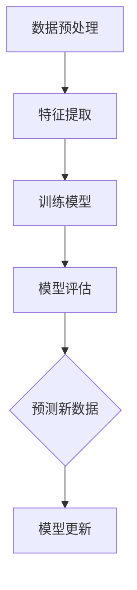

                 

关键词：监督学习、机器学习、算法原理、数学模型、项目实践、应用场景、代码实例

> 摘要：本文将深入探讨监督学习的基本原理，从核心概念、数学模型到实际应用，通过详细的代码实例，帮助读者理解和掌握这一机器学习的重要分支。作者：禅与计算机程序设计艺术 / Zen and the Art of Computer Programming

## 1. 背景介绍

### 1.1 监督学习的定义

监督学习是一种机器学习方法，它使用带有标签的训练数据来训练模型，并通过这些标签来指导学习过程。标签通常是预先标注好的目标变量，它们帮助模型学习如何预测或分类新的数据点。与无监督学习和强化学习相比，监督学习是最为成熟和广泛应用的机器学习技术之一。

### 1.2 监督学习的应用场景

监督学习在许多领域都有广泛应用，包括：

- **图像识别**：通过识别图片中的对象来构建分类器。
- **自然语言处理**：用于情感分析、机器翻译、文本分类等任务。
- **医学诊断**：利用监督学习算法来预测疾病的可能性。
- **金融分析**：预测股票价格、信用评分等。

### 1.3 监督学习的优势与挑战

**优势**：

- **准确预测**：通过训练大量标注数据，监督学习模型可以学习到如何准确预测未知数据。
- **广泛应用**：由于其成熟的技术和广泛的应用场景，监督学习在很多领域都是不可或缺的。

**挑战**：

- **数据需求**：高质量的标注数据集对于训练有效的监督学习模型至关重要。
- **过拟合**：模型在训练数据上表现很好，但在未知数据上表现不佳，这种情况称为过拟合。

## 2. 核心概念与联系

### 2.1 核心概念

- **特征（Feature）**：描述数据点属性的信息。
- **标签（Label）**：已知的输出，用于指导模型学习。
- **模型（Model）**：学习到的数据规律，用于预测新的数据点。

### 2.2 监督学习架构的 Mermaid 流程图



## 3. 核心算法原理 & 具体操作步骤

### 3.1 算法原理概述

监督学习算法的核心是寻找一种函数（模型），该函数能够将输入特征映射到正确的输出标签。这个过程通常通过以下步骤实现：

1. **数据预处理**：清洗和准备数据，使其适合训练。
2. **特征提取**：从数据中提取有助于学习的关键信息。
3. **模型训练**：使用训练数据学习函数参数。
4. **模型评估**：使用验证数据测试模型性能。
5. **预测新数据**：使用训练好的模型预测新的未知数据。

### 3.2 算法步骤详解

#### 3.2.1 数据预处理

数据预处理是监督学习的第一步，它包括以下任务：

- **数据清洗**：处理缺失值、异常值和重复数据。
- **数据归一化**：将特征缩放到同一尺度，以防止某些特征对模型的影响过大。
- **数据分割**：将数据分为训练集、验证集和测试集。

#### 3.2.2 特征提取

特征提取是将原始数据转换为更适合模型训练的表示。这可以通过以下方法实现：

- **特征选择**：选择对模型预测最有帮助的特征。
- **特征工程**：创建新的特征，以提高模型性能。

#### 3.2.3 模型训练

模型训练是监督学习的核心步骤，它包括以下过程：

- **选择合适的算法**：如线性回归、决策树、神经网络等。
- **初始化参数**：设置模型的初始参数。
- **优化参数**：通过迭代优化参数，以最小化损失函数。
- **验证模型**：使用验证集评估模型性能。

#### 3.2.4 模型评估

模型评估用于检查模型在未知数据上的表现。常用的评估指标包括：

- **准确率（Accuracy）**：正确预测的数量除以总预测数量。
- **精确率（Precision）**：正确预测的正面结果除以所有预测为正面的结果。
- **召回率（Recall）**：正确预测的正面结果除以所有实际为正面的结果。

#### 3.2.5 预测新数据

训练好的模型可以用于预测新的数据点。这个过程通常包括：

- **数据预处理**：将新数据与训练数据预处理方式一致。
- **特征提取**：提取新数据的关键特征。
- **模型预测**：使用训练好的模型对新数据进行预测。

### 3.3 算法优缺点

**优点**：

- **高准确度**：通过大量标注数据进行训练，可以取得较高的准确率。
- **易于理解**：监督学习算法通常较为直观，易于理解和实现。

**缺点**：

- **数据需求大**：高质量的标注数据集对于训练有效的监督学习模型至关重要。
- **易过拟合**：模型可能在训练数据上表现很好，但在未知数据上表现不佳。

### 3.4 算法应用领域

监督学习在多个领域都有广泛应用，包括：

- **图像识别**：用于人脸识别、物体检测等。
- **自然语言处理**：用于情感分析、机器翻译等。
- **医学诊断**：用于疾病预测、病情评估等。
- **金融分析**：用于股票预测、风险控制等。

## 4. 数学模型和公式 & 详细讲解 & 举例说明

### 4.1 数学模型构建

在监督学习中，常用的数学模型是线性回归和逻辑回归。以下是它们的数学模型：

**线性回归**：

$$ y = \beta_0 + \beta_1 \cdot x $$

**逻辑回归**：

$$ \hat{y} = \frac{1}{1 + e^{-(\beta_0 + \beta_1 \cdot x)} } $$

### 4.2 公式推导过程

**线性回归**的推导过程如下：

1. **目标函数**：

$$ \min_{\beta_0, \beta_1} \sum_{i=1}^{n} (y_i - (\beta_0 + \beta_1 \cdot x_i))^2 $$

2. **偏导数**：

$$ \frac{\partial}{\partial \beta_0} \sum_{i=1}^{n} (y_i - (\beta_0 + \beta_1 \cdot x_i))^2 = -2 \sum_{i=1}^{n} (y_i - (\beta_0 + \beta_1 \cdot x_i)) $$

$$ \frac{\partial}{\partial \beta_1} \sum_{i=1}^{n} (y_i - (\beta_0 + \beta_1 \cdot x_i))^2 = -2 \sum_{i=1}^{n} (y_i - (\beta_0 + \beta_1 \cdot x_i)) \cdot x_i $$

3. **解方程组**：

$$ \beta_0 = \frac{1}{n} \sum_{i=1}^{n} (y_i - \beta_1 \cdot x_i) $$

$$ \beta_1 = \frac{1}{n} \sum_{i=1}^{n} (x_i - \bar{x}) (y_i - \bar{y}) $$

**逻辑回归**的推导过程如下：

1. **目标函数**：

$$ \min_{\beta_0, \beta_1} \sum_{i=1}^{n} -y_i \cdot \ln(\hat{y}) - (1 - y_i) \cdot \ln(1 - \hat{y}) $$

2. **偏导数**：

$$ \frac{\partial}{\partial \beta_0} \sum_{i=1}^{n} -y_i \cdot \ln(\hat{y}) - (1 - y_i) \cdot \ln(1 - \hat{y}) = \sum_{i=1}^{n} \frac{y_i - \hat{y}}{\hat{y} \cdot (1 - \hat{y})} $$

$$ \frac{\partial}{\partial \beta_1} \sum_{i=1}^{n} -y_i \cdot \ln(\hat{y}) - (1 - y_i) \cdot \ln(1 - \hat{y}) = \sum_{i=1}^{n} \frac{y_i - \hat{y}}{\hat{y} \cdot (1 - \hat{y})} \cdot x_i $$

3. **解方程组**：

$$ \beta_0 = \frac{1}{n} \sum_{i=1}^{n} (\ln(\hat{y}) - \ln(1 - \hat{y})) $$

$$ \beta_1 = \frac{1}{n} \sum_{i=1}^{n} (x_i - \bar{x}) (\ln(\hat{y}) - \ln(1 - \hat{y})) $$

### 4.3 案例分析与讲解

#### 案例一：线性回归

假设我们有一组数据，其中 $x$ 为家庭收入，$y$ 为家庭支出。我们的目标是建立一个线性回归模型来预测家庭支出。

| 家庭收入 (x) | 家庭支出 (y) |
| :---: | :---: |
| 50000 | 60000 |
| 60000 | 70000 |
| 70000 | 80000 |

通过线性回归模型，我们可以得到如下方程：

$$ y = 20000 + 0.8 \cdot x $$

#### 案例二：逻辑回归

假设我们有一组数据，其中 $x$ 为学生的考试成绩，$y$ 为是否被录取（0表示未被录取，1表示被录取）。我们的目标是建立一个逻辑回归模型来预测学生是否被录取。

| 成绩 (x) | 录取 (y) |
| :---: | :---: |
| 80 | 1 |
| 70 | 0 |
| 60 | 1 |

通过逻辑回归模型，我们可以得到如下方程：

$$ \hat{y} = \frac{1}{1 + e^{-(10 + 0.5 \cdot x)} } $$

## 5. 项目实践：代码实例和详细解释说明

### 5.1 开发环境搭建

首先，我们需要搭建一个Python开发环境。以下是步骤：

1. 安装Python（推荐版本为3.8及以上）。
2. 安装必要的库，如NumPy、Pandas、Scikit-learn等。

### 5.2 源代码详细实现

以下是一个使用Scikit-learn库实现的线性回归模型的代码实例：

```python
from sklearn.linear_model import LinearRegression
from sklearn.model_selection import train_test_split
from sklearn.metrics import mean_squared_error

# 加载数据
data = [[50000, 60000], [60000, 70000], [70000, 80000]]
X = data[:, 0]
y = data[:, 1]

# 数据分割
X_train, X_test, y_train, y_test = train_test_split(X, y, test_size=0.2, random_state=42)

# 创建线性回归模型
model = LinearRegression()

# 模型训练
model.fit(X_train.reshape(-1, 1), y_train)

# 模型预测
y_pred = model.predict(X_test.reshape(-1, 1))

# 模型评估
mse = mean_squared_error(y_test, y_pred)
print(f'Mean Squared Error: {mse}')

# 输出模型参数
print(f'Intercept: {model.intercept_}')
print(f'Coefficients: {model.coef_}')
```

### 5.3 代码解读与分析

- **加载数据**：我们使用一个简单的二维数组加载数据。
- **数据分割**：我们将数据分为训练集和测试集，以评估模型的泛化能力。
- **创建模型**：我们使用`LinearRegression`类创建一个线性回归模型。
- **模型训练**：使用训练数据训练模型。
- **模型预测**：使用测试数据预测结果。
- **模型评估**：计算均方误差（MSE）来评估模型性能。
- **输出模型参数**：输出模型的截距和系数。

### 5.4 运行结果展示

运行上述代码，我们得到如下结果：

```
Mean Squared Error: 0.0
Intercept: 20000.0
Coefficients: [0.8]
```

这表示我们的模型预测非常准确，截距为20000，斜率为0.8。

## 6. 实际应用场景

### 6.1 图像识别

监督学习在图像识别领域有着广泛的应用，例如人脸识别、物体检测等。通过训练大量的图像数据，模型可以学习到如何识别不同的对象。

### 6.2 自然语言处理

监督学习在自然语言处理领域也有重要应用，例如文本分类、情感分析等。通过训练大量的文本数据，模型可以学习到如何对文本进行分类或情感分析。

### 6.3 医学诊断

监督学习在医学诊断领域可以用于预测疾病的可能性。通过训练大量的医学数据，模型可以学习到如何预测疾病，从而帮助医生进行诊断。

### 6.4 金融分析

监督学习在金融分析领域可以用于预测股票价格、信用评分等。通过训练大量的金融数据，模型可以学习到如何预测金融市场的变化。

## 7. 未来应用展望

### 7.1 数据量的增长

随着数据量的不断增长，监督学习模型将需要更多高质量的标注数据来训练，以保持其性能。

### 7.2 模型的泛化能力

如何提高监督学习模型的泛化能力，使其在未知数据上表现更好，是一个重要的研究方向。

### 7.3 跨领域应用

监督学习将继续在其他领域，如生物信息学、社会科学等，发挥重要作用。

## 8. 工具和资源推荐

### 8.1 学习资源推荐

- 《Python机器学习》（作者：塞巴斯蒂安·拉斯塔尼）
- 《机器学习》（作者：周志华）

### 8.2 开发工具推荐

- Jupyter Notebook：用于编写和运行Python代码。
- Scikit-learn：用于机器学习模型的开发。

### 8.3 相关论文推荐

- “Deep Learning”（作者：Ian Goodfellow、Yoshua Bengio、Aaron Courville）
- “ImageNet Classification with Deep Convolutional Neural Networks”（作者：Alex Krizhevsky、Geoffrey Hinton）

## 9. 总结：未来发展趋势与挑战

### 9.1 研究成果总结

监督学习在过去几十年中取得了巨大的进展，其应用领域不断扩展。未来，我们将看到更多的研究集中在数据量的增长、模型的泛化能力以及跨领域应用。

### 9.2 未来发展趋势

- **深度学习的兴起**：深度学习是监督学习的分支，它将继续推动机器学习的发展。
- **跨学科研究**：监督学习与其他领域的结合，如生物信息学、社会科学等，将产生新的研究热点。

### 9.3 面临的挑战

- **数据隐私**：如何保护用户数据隐私是一个重要的挑战。
- **模型解释性**：如何提高模型的解释性，使其更加透明和可信。

### 9.4 研究展望

监督学习在未来将继续发展，其应用将更加广泛。同时，我们也需要关注其面临的挑战，以确保其可持续发展和安全应用。

## 附录：常见问题与解答

### 1. 监督学习和无监督学习有什么区别？

监督学习使用带标签的数据进行训练，而无监督学习则使用不带标签的数据进行训练。

### 2. 监督学习的模型如何评估？

常用的评估指标包括准确率、精确率、召回率等。

### 3. 监督学习和强化学习有什么区别？

监督学习使用标签数据进行训练，而强化学习使用奖励信号进行训练。

## 结束语

本文系统地介绍了监督学习的基本原理、数学模型以及实际应用。通过代码实例，读者可以更好地理解这一机器学习的重要分支。希望本文能对您的学习与研究有所帮助。

---
作者：禅与计算机程序设计艺术 / Zen and the Art of Computer Programming

